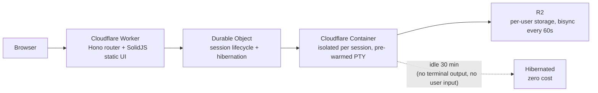

# Codeflare

I set out to prove that fully autonomous AI development actually works when done properly. Gave coding agents a detailed specification, made them follow TDD principles, and let them run unchecked. Somewhere along the way I accidentally built my favorite development environment.

Codeflare is an ephemeral cloud IDE that runs entirely in your browser. Every session spins up an isolated container on Cloudflare, pre-loads your AI agent of choice, and tears itself down when you're done. Your files persist in R2 storage. The containers don't. Nothing touches your local machine.

It's strongly optimized for mobile - because the best ideas hit while rewatching your favorite show for the 15th time, and your PC is just too far away.

**Try it:** [codeflare.graymatter.ch](https://codeflare.graymatter.ch) (gated behind a waitlist - I'm not an animal)

## What you get

- Browser-native terminal with 6 tabs per session and tiling mode - view 2-4 terminals side by side. Once you tile, you don't go back.
- One isolated container per session - agents can't escape their sandbox (I checked)
- Pre-loaded AI agents: [Claude Unleashed](https://github.com/nikolanovoselec/claude-unleashed), Codex, Gemini, OpenCode, or plain Bash for the purists
- Persistent R2 storage with bisync every 60s - even if a session dies before you `git push`, R2 has got your back. Sync conflicts? Cleaned up automatically next cycle.
- Pre-warmed terminals - the agent is already loaded when you open the tab, not staring at a blank screen wondering if something broke
- Set your API key once. It syncs across sessions forever. (It's rclone, but magic sounds better.)
- Dashboard for managing sessions, browsing files, and inviting users (or revoking them when they get too creative)
- Scales to zero when idle. You pay for what you use. Nothing when you don't.

## Setup

Four steps. Shorter than most cookie consent forms.

### 1. Fork this repo

You know how.

### 2. Set secrets

In your fork: `Settings` > `Secrets and variables` > `Actions` > `New repository secret`

**Secrets** (required):
- `CLOUDFLARE_API_TOKEN` - see [token scopes](#api-token-scopes) below
- `CLOUDFLARE_ACCOUNT_ID` - find it on any zone's overview page in the Cloudflare dashboard

Add each as a separate secret. Name goes in the **Name** field, value in **Secret**. Click **Add secret** after each one.

### 3. Deploy

Go to your fork: `Actions` > `Deploy` > `Run workflow` > Branch: `main` > **Run workflow**. GitHub Actions builds, tests, and deploys to Cloudflare Workers. Takes about 2 minutes - go grab a coffee.

Future deploys are automatic on every push to `main`.

### 4. Run the setup wizard

Find your worker URL: [dash.cloudflare.com](https://dash.cloudflare.com/) > `Compute` > `Workers & Pages` > your worker name (default: `codeflare`). If you didn't set `CLOUDFLARE_WORKER_NAME`, your URL is `codeflare.<your-user>.workers.dev`. Open it - the onboarding wizard takes over and walks you through:
- Verifying your token and account access
- Configuring a custom domain and allowed users
- Creating Cloudflare Access policies (handles auth so you don't have to)

That's it. You're live. No Kubernetes. No Terraform. No existential crisis. You'll need an active subscription to at least one coding agent (Claude Code, OpenAI Codex, Gemini CLI, or OpenCode) - log in directly from the terminal.

## API token scopes

Go to [dash.cloudflare.com/profile/api-tokens](https://dash.cloudflare.com/profile/api-tokens) and create a custom token. Yes, it's a lot of scopes. No, I'm not mining crypto with them (or am I?).

### Required

The minimum permissions for Codeflare to deploy and run. Every scope earns its keep:

| Scope | Permission | Access | Why |
|---|---|---|---|
| Account | Account Settings | Read | Setup wizard reads account metadata |
| Account | Workers Scripts | Edit | Deploys the Worker |
| Account | Workers KV Storage | Edit | Session metadata and configuration |
| Account | Workers R2 Storage | Edit | Per-user persistent file storage |
| Account | Containers | Edit | Manages ephemeral session containers |
| Account | Access: Apps and Policies | Edit | Creates the Access application that gates `/app` and `/api` |
| Account | Access: Organizations, Identity Providers, and Groups | Edit | Creates admin and user groups for access control |
| Zone | Zone | Read | Discovers your domain for custom domain setup |
| Zone | DNS | Edit | Adds DNS records for the custom domain |
| Zone | Workers Routes | Edit | Routes your domain to the Worker |

### Optional

| Scope | Permission | Access | Why |
|---|---|---|---|
| Account | Turnstile | Edit | Only needed when `ONBOARDING_LANDING_PAGE=active` - adds bot protection to the public waitlist page |

## Configuration

All optional. The defaults work out of the box. I respect your time.

| Variable | Default | What it does |
|---|---|---|
| `CLOUDFLARE_WORKER_NAME` | `codeflare` | Worker name and Access group prefix |
| `RESSOURCE_TIER` | unset (1 vCPU, 3 GB RAM) | Container size: `low` (0.25 vCPU, 1 GB) or `high` (2 vCPU, 6 GB) |
| `ONBOARDING_LANDING_PAGE` | `inactive` | Set to `active` for a public waitlist at `/` (requires Turnstile + `RESEND_API_KEY` secret) |
| `RUNNER` | `ubuntu-latest` | GitHub Actions runner |
| `CLAUDE_UNLEASHED_CACHE_BUSTER` | `inactive` | Set to `active` to force-reinstall the AI agent layer on every deploy |

## Architecture



Containers scale to zero when idle (no sessions = no bill). Storage persists. Auth is handled by Cloudflare Access - no custom login pages, no token management, no OAuth dance.

## Claude Unleashed

Cloudflare Containers run as root. Claude Code refuses to run with `--dangerously-skip-permissions` as root - even inside an ephemeral container where the root check is protecting a filesystem that won't exist in 30 seconds. Heroic. [Claude Unleashed](https://github.com/nikolanovoselec/claude-unleashed) is a wrapper that politely disagrees with this decision, patching around the restriction at source level. Handles root detection, auto-updates, and mode switching. Pre-installed in every Codeflare container because arguing with your tools is not a productive use of compute.

## Security

- Every session runs in its own container. No shared shells, no cross-session access. Your agent can `rm -rf /` and the only victim is itself.
- AI agents run with full terminal access *inside* the container - and can't get out. I gave them root and a sandbox. They got root in a sandbox.
- Cloudflare Access gates all authenticated surfaces (`/app`, `/api`, `/setup`).
- API tokens never enter the container. Secrets stay in GitHub and Cloudflare. The agent doesn't know your passwords, and frankly, it doesn't want to.

## Local development

```bash
npm install
cd web-ui && npm install && cd ..
npm run dev
```

## Docs

- `TECHNICAL.md` - deep dive into architecture, container lifecycle, and sync model
- `tutorials/Getting Started.md` - what you can do and why you should want to. Tabs, tiling, API keys, file persistence, and three paths forward depending on how much hand-holding you need.
- `tutorials/Examples/` - spec-driven project examples from Hello World to full blog platform. Hand one to your agent and go do something more interesting.

## License

PolyForm Noncommercial 1.0.0 - free for personal use, tinkering, and showing off.

Commercial use, resale, or paid hosted offerings require a separate written license. You know who you are.

## Common Gotchas

### Cloudflare WAF blocking API requests

If you're on a Cloudflare Pro plan (or higher) with Managed Rulesets enabled on your zone, Cloudflare's WAF may decide your perfectly legitimate API calls look like an attack. Congratulations - your own security product is protecting you from yourself.

Symptoms: a wall of HTML appearing in your terminal where a simple "session deleted" confirmation should be. The HTML helpfully informs you that you have been blocked, as if you didn't notice.

Fix: go to **Security** > **Analytics** > **Events** in your Domain configuration, find the blocked request (you will see "Action taken: Block"), click the rule that triggered it, disable it. Three clicks. Fewer clicks than it took Cloudflare to block you.
