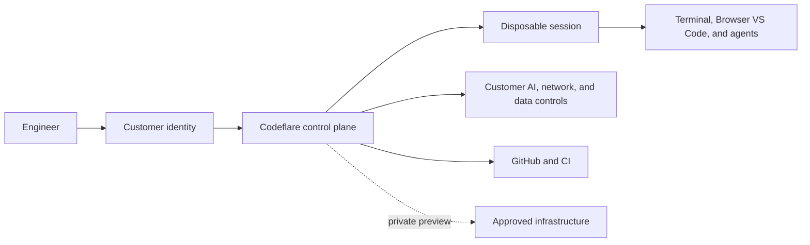

#  Codeflare


**Governed AI agents for software delivery, browser automation, and infrastructure operations in private preview.**

Codeflare is a customer-operated execution platform where engineers and AI agents design and architect systems, build and debug software, automate end-to-end tests, deploy, verify, and recover software releases together. Infrastructure operations are coming soon and currently in private preview, covering approved patching and migration work. Work happens inside authenticated, disposable browser sessions, with organizational rules, evidence, and human approval built into the workflow instead of bolted onto laptops or long-lived shared runners.

Enterprise Codeflare runs as a single-tenant deployment in the customer's Cloudflare account and connects to the customer's identity, GitHub organization, inference controls, storage, and security policies. A public demonstration is available at [codeflare.ch](https://codeflare.ch); enterprise deployment guidance is maintained in [codeflare-private](https://github.com/nikolanovoselec/codeflare-private) (access required).

<p align="center">
  
  
</p>

## Contents

- [What teams use Codeflare for](#what-teams-use-codeflare-for)
- [Disposable by design](#disposable-by-design)
- [Governed execution](#governed-execution)
- [Enterprise controls](#enterprise-controls)
- [Workspace experience](#workspace-experience)
- [Architecture](#architecture)
- [Deployment models](#deployment-models)
- [Enterprise deployment](#enterprise-deployment)
- [Community/default deployment quick start](#communitydefault-deployment-quick-start)
- [Configuration](#configuration)
- [Security boundaries](#security-boundaries)
- [Development and operations](#development-and-operations)
- [Testing and CI](#testing-and-ci)
- [Documentation](#documentation)
- [Codeflare Inference Mesh](#codeflare-inference-mesh)
- [License](#license)

---

## What teams use Codeflare for

Codeflare gives agents a governed execution environment for software delivery and browser automation, with approved infrastructure work coming soon in private preview.

| Work domain | What agents can do |
|---|---|
| **Software delivery** | Explore repositories, implement requirements, run review workflows, work through pull requests, inspect CI, and verify changes against behavioral acceptance criteria. |
| **Infrastructure operations** | Operate approved infrastructure with tools such as SSH and `kubectl`, governed by the customer's Cloudflare Zero Trust policies. Coming soon and currently in private preview. |
| **End-to-end test automation** | Drive deployed user journeys in isolated Cloudflare Browser Run sessions through Chrome DevTools. Agents can test desktop and mobile viewports, interact with the application, capture screenshots, inspect rendered state, and judge each flow against its acceptance criteria. |
| **Deployed-system verification** | Correlate browser results with logs, checks, live URLs, and deployment state. Deterministic assertions remain in CI alongside semantic browser validation. |
| **Operational recovery** | Diagnose failed builds or deployments, inspect current state, apply controlled corrections, and use documented deployment and rollback procedures. |

<p align="center">
  
  
</p>

---

## Disposable by design

AI agents need broad tools to be useful. Codeflare moves that activity away from endpoint devices and persistent shared runners into an isolated, disposable workspace for each session.

A session ends when the user stops it or its idle timeout expires. Selected project files, organizational knowledge, and workspace preferences can carry forward; running processes, temporary files, and session-only application data do not.

This reduces standing access and separates one session from another. It does **not** reverse changes already made outside the session, including synchronized files, Git pushes, deployments, API calls, or infrastructure changes.

Agents and trusted tools still have broad access inside their session. Disposable sessions reduce persistence; they are not a substitute for policy, review, or human approval.

---

## Governed execution

Codeflare applies one governed workflow across software delivery, browser automation, and deployment. Infrastructure operations are coming soon and currently in private preview:


1. **Define intent:** requirements, acceptance criteria, and operational scope establish the approved outcome.
2. **Execute:** agents work in repositories and supported software environments using the team's existing tools; private-preview operations extend execution to approved infrastructure.
3. **Test:** behavioral tests prove observable contracts in CI, while Browser Run and Chrome DevTools exercise deployed user journeys against their acceptance criteria.
4. **Review:** specialist reviewers inspect code, specifications, documentation, security, and observable behavior; humans approve consequential operational actions.
5. **Integrate:** GitHub pull requests, branch protection, and CI govern source changes; customer policies govern private-preview infrastructure access.
6. **Deploy and verify:** agents follow approved deployment workflows, inspect checks and logs, and verify live systems in a real browser. Private-preview infrastructure work follows approved operational workflows.
7. **Recover:** failed verification routes back to a controlled fix; documented rollback remains available when promotion is unsafe.

Enterprise sessions apply the organization's requirements, engineering rules, review process, CI gates, browser verification, and deployment workflows. Humans retain approval for merges, production promotion, and consequential operational actions.

---

## Enterprise controls

Enterprise Codeflare uses customer-configured services inside the customer's Cloudflare account, keeping identity, AI governance, network policy, data, and operational evidence under customer control.


| Control | Enterprise behavior |
|---|---|
| **Identity and authorization** | Use the customer's corporate identity and groups through Cloudflare Access to govern who can enter and administer Codeflare. |
| **AI governance** | Route supported model traffic through the customer's Cloudflare AI Gateway, with approved models and policies defined by the organization. |
| **Egress and DLP** | Apply the customer's Cloudflare Gateway controls to outbound web traffic, including existing allow, block, isolation, and DLP policy. |
| **Private infrastructure reach** *(coming soon, private preview)* | Connect agents to approved servers, clusters, databases, internal services, and appliances through the customer's Cloudflare Zero Trust policies. |
| **Credential protection** | Keep supported platform and service credentials outside the agent workspace. The exact boundary depends on the selected deployment and integrations. |
| **Customer-controlled data** | Keep persisted workspace and organizational knowledge in the customer's Cloudflare account, with optional encryption and governed inspection controls. |
| **Cost and usage control** | Attribute supported model usage to users and groups, constrain available routes, and stop session compute when it is no longer needed. |
| **Operational evidence** | Retain CI results, security evidence, resource metrics, and AI usage analytics in systems the customer controls. |


---

## Workspace experience


### Terminal and Browser VS Code

- Six browser-native terminal tabs per session, with flexible pane layouts.
- Fast startup for supported agents.
- Authenticated Browser VS Code that starts on demand inside each session.
- Native **Codeflare Chat** and **Review with Codeflare** in Browser VS Code without a separate Copilot sign-in, plus the official Claude editor panel for Claude sessions.
- Continuity for selected editor preferences and open files without carrying credentials or chat history between runtimes.
- Live resource, synchronization, and session status.
- MultiView for observing several sessions side by side.


### Repository, browser, and infrastructure tools

- Repository, pull-request, review, and CI workflows using the user's authorized permissions.
- Infrastructure tooling, including SSH and `kubectl`, is coming soon and currently in private preview, with access governed through the customer's Cloudflare Zero Trust environment.
- Cloudflare Browser Run and Chrome DevTools for end-to-end test automation, responsive testing, screenshots, and deployed-app verification.
- Reusable skills for architecture, deployment, security, infrastructure, and performance work across the customer's chosen platforms.

### Memory and project intelligence

- An integrated knowledge workspace for notes, decisions, plans, and captured context.
- Approved organizational context that carries across sessions without relying on a persistent agent process.
- A connected view of source code, requirements, decisions, plans, and documentation that helps agents trace dependencies and change impact.
- Specialist agents for architecture, debugging, deployment, security, review, and refactoring.

### Supported agents

Codeflare supports multiple agent choices, and administrators can decide which are available in their deployment.

| Agent | Description |
|---|---|
| [Antigravity](https://antigravity.google/docs/cli-overview) | Google's terminal coding agent (beta) |
| [Claude Code](https://docs.anthropic.com/en/docs/claude-code) | Anthropic's agentic CLI |
| [Codex](https://github.com/openai/codex) | OpenAI's coding agent |
| [GitHub Copilot](https://docs.github.com/en/copilot) | GitHub's CLI agent; distinct from the removed Browser IDE Copilot extension |
| [OpenCode](https://github.com/opencode-ai/opencode) | Open-source coding agent (beta) |
| [Pi](https://www.npmjs.com/package/@earendil-works/pi-coding-agent) | Extensible coding agent with native Codeflare Chat |
| Bash | A tool-ready shell without an AI agent |

Codeflare's deepest integrations are with Claude Code and Pi. Other agents receive compatible rules, skills, and agent definitions where their runtimes support them.

---

## Architecture


```mermaid
graph LR
    U[Engineer] --> I[Customer identity]
    I --> C[Codeflare control plane]
    C --> S[Disposable session]
    S --> T[Terminal, Browser VS Code, and agents]
    C --> G[Customer AI, network, and data controls]
    C --> R[GitHub and CI]
    C -. private preview .-> H[Approved infrastructure]
```

The Codeflare control plane handles authentication, routing, session lifecycle, and access to customer services. Each engineer works in a separate disposable runtime containing the terminal, Browser VS Code, and selected agents.

Enterprise deployments connect to the customer's identity, AI governance, network policy, storage, and GitHub environment. Supported credentials can remain outside the agent runtime, while GitHub and the customer's Cloudflare account retain delivery and operational evidence.

Private-preview infrastructure access extends the customer's Cloudflare Zero Trust policies to approved targets.

See [Architecture](documentation/lanes/architecture.md), [Authentication](documentation/lanes/authentication.md), [Security](documentation/lanes/security.md), [Container](documentation/lanes/container.md), and the [Enterprise Mode specification](sdd/spec/enterprise-mode.md).

---

## Deployment models

1. **Enterprise:** customer-operated, single-tenant deployment with corporate identity, governed inference, customer-managed egress and storage controls, plus private-preview infrastructure access through Cloudflare Zero Trust.
2. **Default/self-operated:** single-tenant deployment using the standard Cloudflare Access setup.
3. **SaaS:** optional multi-tenant mode with subscriptions, tiered plans, just-in-time provisioning, approval workflow, and per-user usage metering.

Enterprise and advanced-mode operations are maintained in [codeflare-private](https://github.com/nikolanovoselec/codeflare-private) (access required). The supported internal deployment target is the customer's Cloudflare account; multi-cloud and on-premises control-plane deployment are out of scope.

---

## Enterprise deployment

Enterprise rollout begins with the private deployment configuration rather than the public two-secret path. Operators connect the customer's Cloudflare account, Cloudflare Access application and groups, GitHub organization, Cloudflare AI Gateway, and storage regime. They also configure the customer's Cloudflare Gateway policies and Governed Mode when required.

Promotion is gated by repository CI, image scanning, immutable build/deployment evidence, and environment-specific verification. See [codeflare-private](https://github.com/nikolanovoselec/codeflare-private) for the deployment runbook and configuration surface (access required).

---

## Community/default deployment quick start

The public path supports evaluation, personal use, and standard self-operated deployments. Four steps produce a working single-tenant Default-mode instance.

### 1. Fork this repository

### 2. Add the two required secrets

In your fork, open **Settings → Secrets and variables → Actions → New repository secret** and add each value separately.

| Secret | Where to find it |
|---|---|
| `CLOUDFLARE_API_TOKEN` | Create a custom token using the [required scopes](#api-token-scopes) |
| `CLOUDFLARE_ACCOUNT_ID` | Any zone overview in the [Cloudflare dashboard](https://dash.cloudflare.com/) |

### 3. Deploy

Open **Actions → Deploy → Run workflow**, select `main`, and run the workflow. GitHub Actions builds, tests, scans, and deploys the application. Future pushes to `main` deploy automatically after their required gates pass.

### 4. Run the setup wizard

Find the Worker URL under **Cloudflare dashboard → Compute → Workers & Pages**. Open it; the wizard verifies the deployment token, configures a custom domain and allowed users, and creates the Cloudflare Access application.

The resulting Default-mode instance is ready for users to authenticate and start sessions. Users still need access to the selected agent's own subscription or credentials where that agent requires them.

> GitHub push and direct Cloudflare API operations require operator-registered OAuth applications in supported non-enterprise modes. Enterprise and advanced setup is documented in [codeflare-private](https://github.com/nikolanovoselec/codeflare-private) (access required).

<details>
<summary><strong id="api-token-scopes">API token scopes</strong></summary>

Create a custom token at [dash.cloudflare.com/profile/api-tokens](https://dash.cloudflare.com/profile/api-tokens).

| Scope | Permission | Access | Why |
|---|---|---|---|
| Account | Account Settings | Read | Read account metadata during setup |
| Account | Workers Scripts | Edit | Deploy the Worker |
| Account | Workers KV Storage | Edit | Store session metadata and configuration |
| Account | Workers R2 Storage | Edit | Manage per-user persistent storage |
| Account | Containers | Edit | Manage disposable session containers |
| Account | Access: Apps and Policies | Edit | Create the Access application for authenticated routes |
| Account | Access: Organizations, Identity Providers, and Groups | Edit | Create the standard-mode admin and user groups |
| Account | API Tokens | Edit | Create scoped per-user R2 credentials |
| Zone | Zone | Read | Discover the custom-domain zone |
| Zone | DNS | Edit | Add custom-domain DNS records |
| Zone | Workers Routes | Edit | Route the custom domain to the Worker |

</details>

---

## Configuration

The two deployment secrets above are sufficient only for the public Default-mode path. Enterprise, SaaS, Onboarding, identity-provider, OAuth-provider, inference, and advanced policy configuration is maintained separately in [codeflare-private](https://github.com/nikolanovoselec/codeflare-private) (access required).

### Default mode

With only the two required deployment secrets:

- The instance is single-tenant and authenticated by Cloudflare Access.
- Every user is unlimited; no subscription, billing, or quota workflow is active.
- All seven session choices are available.
- Per-user R2 storage synchronizes on start, every 15 minutes, on demand, and during graceful shutdown.
- Defaults allow 3 sessions per user, 10 per admin, and 10 concurrent containers, each with 1 vCPU, 3 GiB memory, and 6 GB disk.
- The root URL redirects to the authenticated application rather than a public landing page.

### Advanced deployment modes

Enterprise, Onboarding, and SaaS behavior is summarized under [Deployment models](#deployment-models). Their setup and operations remain in [codeflare-private](https://github.com/nikolanovoselec/codeflare-private) so the public two-secret path does not imply production enterprise readiness without the required controls.

---

## Security boundaries

Full details and residual risks are documented in [Security](documentation/lanes/security.md).

- **Identity:** authenticated surfaces validate the configured identity boundary. Enterprise uses Cloudflare Access in the customer's account and can reference customer-managed groups; Codeflare does not claim a separate direct SAML/OIDC or SCIM integration.
- **Session isolation:** each session has a separate root container, PTY set, and authenticated route. Agents cannot access another session's runtime through Codeflare, but trusted code remains unrestricted inside its own container.
- **Ephemerality:** stopping a session tears down processes and transient state. It reduces standing persistence but cannot reverse synchronized files or external operations.
- **Credential handling:** the master deployment token never enters agent sessions. Supported enterprise model, GitHub, and Browser Rendering credentials can remain outside the agent runtime; other modes and configurations may provide user-authorized credentials to the session.
- **Inference:** only supported, allowlisted enterprise agent traffic is intercepted. Unknown provider hosts and invalid gateway configuration fail closed rather than bypassing the configured route.
- **Egress:** optional strict enterprise egress applies the customer's existing Cloudflare Gateway policies to outbound web traffic. Codeflare neither creates nor weakens the customer's policies.
- **Private infrastructure reach:** coming soon and currently in private preview, this capability connects agents only to targets approved through the customer's Cloudflare Zero Trust policies. It does not provide unrestricted network access.
- **Storage:** optional encryption protects KV secrets and R2 objects. Governed Mode intentionally changes R2 encryption behavior for customer inspection through a gated migration.
- **Application and supply chain:** security headers, rate limits, input validation, CodeQL, dependency review, SBOM/attestation, Trivy, fuzzing, and external penetration probes protect release and runtime boundaries.

Report vulnerabilities through [SECURITY.md](SECURITY.md).

---

## Development and operations

Local development commands are shown for contributor reference; production deployment and verification run through GitHub Actions.

```bash
npm install
cd web-ui && npm install && cd ..
npm run dev
```

Operational documentation includes:

- [Deployment and rollback](documentation/lanes/deployment.md)
- [Architecture and data flow](documentation/lanes/architecture.md)
- [Container lifecycle](documentation/lanes/container.md)
- [Configuration](documentation/lanes/configuration.md)
- [Storage and synchronization](documentation/lanes/storage-and-sync.md)
- [Troubleshooting](documentation/lanes/troubleshooting.md)

---

## Testing and CI

```bash
npm test                     # Backend tests
cd web-ui && npm test        # Frontend tests
cd host && npm test          # Host tests
```

| Workflow | Trigger | Purpose |
|---|---|---|
| `deploy.yml` | Green PR Checks on `main` / manual | Stage Worker assets and container image, then deploy after authoritative verification |
| `container-image.yml` | Called by `deploy.yml` | Build, scan, and push the reusable container image |
| `test.yml` | Pull requests, `main`, nightly | Run path-filtered lint, tests, type checks, audits, dependency review, and complete-image Browser IDE verification |
| `zizmor.yml` | Workflow changes | Audit GitHub Actions configuration |
| `codeql.yml` | Push, pull request, weekly | Run CodeQL static analysis |
| `scorecard.yml` | `main`, weekly, manual | Produce OSSF Scorecard evidence |
| `fuzz.yml` | Pull requests, weekly, manual | Run property-based fuzzing |
| `pentest.yml` | Weekly, manual | Probe authentication, headers, TLS, methods, injection, and information disclosure |
| `stress-test.yml` | Manual | Run k6 load tests against the integration environment |

See [CI/CD and Testing](documentation/lanes/ci-cd.md) for suite ownership, deployment gates, artifact reuse, and verification behavior.

---

## Documentation

- [`documentation/`](documentation/README.md): architecture, authentication, configuration, security, deployment, storage, CI/CD, operations, and troubleshooting.
- [`sdd/`](sdd/README.md): domain requirements, acceptance criteria, implementation anchors, test evidence, constraints, and change history.
- [`preseed/tutorials/Getting Started.md`](preseed/tutorials/Getting%20Started.md): terminal, persistence, and agent workflow guidance.
- [`preseed/tutorials/Examples/`](preseed/tutorials/Examples/): specification-driven examples from small tasks to a complete application.

---

## Codeflare Inference Mesh

[Codeflare Inference Mesh](https://github.com/nikolanovoselec/codeflare-inference-mesh) is optional private inference capacity for open models on customer-controlled GPU or CPU hardware. Codeflare can route approved workloads to that endpoint while hosted providers remain first-class defaults or fallbacks. Inference Mesh is a separate deployment and is not required for the customer's Cloudflare AI Gateway routing.

---

## License

PolyForm Noncommercial 1.0.0 permits personal use, experimentation, and demonstration.

Commercial use, resale, or paid hosted offerings require a separate written license.
