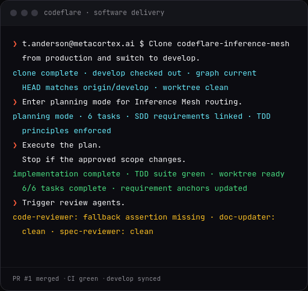
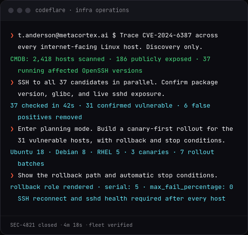
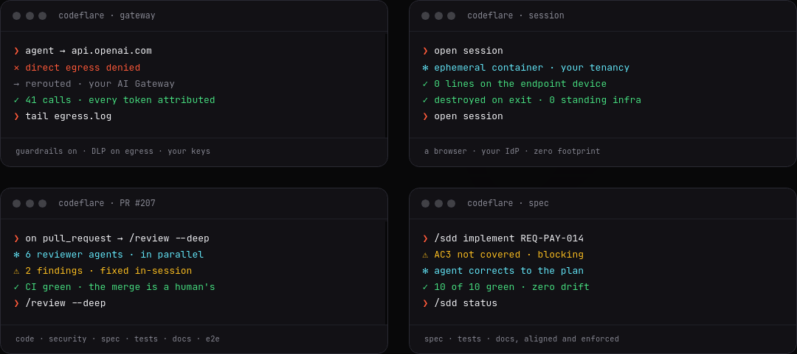
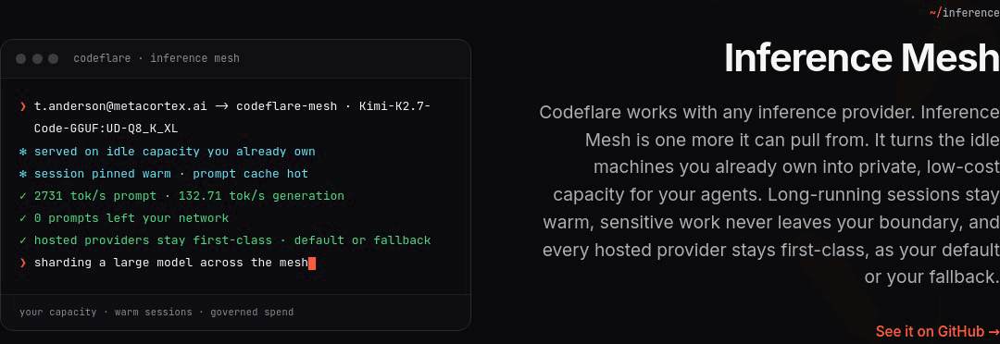
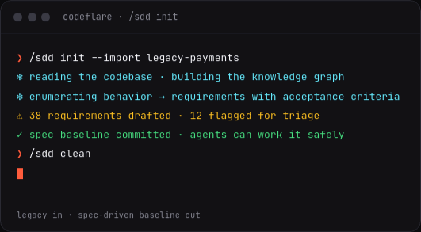
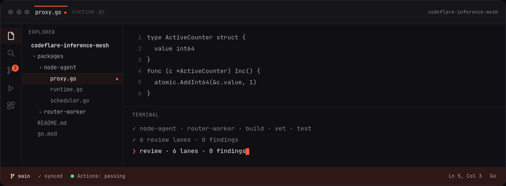

<h1 align="center">
  
  Codeflare
</h1>

<p align="center"><strong>The agentic engineering engine.</strong></p>

<p align="center">Governed engineering agents that build, test, review, deploy, and operate inside your own estate.</p>

<p align="center">
  <a href="https://github.com/nikolanovoselec/codeflare/actions/workflows/test.yml"></a>
  <a href="https://github.com/nikolanovoselec/codeflare/actions/workflows/codeql.yml"></a>
  <a href="https://github.com/nikolanovoselec/codeflare/actions/workflows/scorecard.yml"></a>
  <a href="LICENSE"></a>
</p>

<p align="center">
  <a href="https://codeflare.ch">codeflare.ch</a> ·
  <a href="documentation/README.md">Documentation</a> ·
  <a href="documentation/lanes/architecture.md">Architecture</a> ·
  <a href="SECURITY.md">Security</a>
</p>


Codeflare runs autonomous engineering agents in isolated, ephemeral containers. One engineer can direct several agents through architecture, implementation, testing, review, deployment, and operations while retaining control of intent, approvals, and production change.

Each session has a browser-native terminal, an optional Browser VS Code workspace, the selected agent, and the team's engineering context already loaded. The container is disposable. Work that should survive moves through Git or the user's R2-backed storage; idle compute stops.

Codeflare works through the systems an enterprise already trusts: its identity provider, GitHub organization, CI, Cloudflare account, model routes, storage, and network policy. Existing Git, branch protection, CI, and approval paths remain the delivery system.

<p align="center">
  
  
</p>

Enterprise Codeflare runs as a single-tenant deployment in the customer's Cloudflare account. The customer owns the identity boundary, session compute, persistent data, inference policy, egress policy, and delivery systems. The engineer still owns the merge, production promotion, and consequential operational approval.

## One operating model from intent to production

Every run is bootstrapped with Codeflare's spec-driven development framework, which carries requirements, acceptance criteria, tests, review evidence, and approval state through one execution loop:

1. **Define the outcome:** write the requirements, acceptance criteria, and approved scope before implementation starts.
2. **Give the agent a complete environment:** load the repository, engineering rules, skills, specialist agents, tools, and relevant project history.
3. **Prove observable behavior:** check the result against the contract with behavioral tests, CI, and deployed verification.
4. **Review at the delivery boundary:** inspect the same change across code, security, specification, documentation, and behavior. Findings return to the working session for correction and re-verification.
5. **Keep the final decision human:** leave branch protection, deployment gates, and operational approval in force.



Codeflare enforces spec-driven development at the pull-request boundary. `/sdd init` can derive a reviewable baseline from an existing repository. During implementation, requirements link to implementation and behavioral evidence. Codeflare rejects uncovered acceptance criteria and test theater before a change reaches human triage.

Agents work inside the repository's normal branch, pull-request, CI, and deployment model. Failed checks return the work to the session for correction; only verified changes move forward.

## Build, ship, and operate

### Software delivery

Agents explore repositories, plan changes, implement against requirements, write and run tests, update owned documentation, open pull requests, inspect CI, respond to review, deploy through approved workflows, and verify the live result. The workflow supports both new systems and large existing codebases.

### Infrastructure operations

The same governed session can discover, patch, migrate, and verify approved infrastructure. Engineers define the targets, rollout plan, stop conditions, and approval points. Agents work through the organization's permitted tools and Zero Trust routes, record evidence as they go, and do not receive a flat network path around existing access policy.

### Deployed-system verification

Browser Run is one verification tool within that delivery loop. When Cloudflare Browser Rendering is configured, sessions can read JavaScript-rendered public pages as clean Markdown or drive a deployed flow through Chrome DevTools. This supports responsive checks, screenshots, semantic end-to-end verification, and investigation of behavior that fixed selectors miss. Deterministic assertions remain in CI.

## Existing codebases and inference choice

For an existing repository, `/sdd init` derives requirements, acceptance criteria, and a source-linked knowledge graph from the implementation. `/sdd clean` reconciles a specification that has drifted from the code.

[Codeflare Inference Mesh](https://github.com/nikolanovoselec/codeflare-inference-mesh) is an optional inference source for open models on customer-controlled GPU or CPU capacity. Hosted providers remain first-class defaults and fallbacks. The mesh is deployed separately and is not required for the customer's Cloudflare AI Gateway path.

<p align="center">
  
  
</p>

## Enterprise control stays with the customer

Cloudflare Access protects the deployment and federates to the customer's identity provider. Codeflare can use customer-managed Access groups for admission and live admin elevation without creating a second directory.

Supported enterprise agent traffic is intercepted at the platform boundary and routed through the AI Gateway in the customer's own Cloudflare account. Operators control route catalogs, default models, context limits, and per-group policy. Gateway credentials stay outside the container. Enterprise GitHub and Browser Rendering credentials are injected only at their allowlisted egress boundary, and a session cannot select another user's credential.

When configured and enabled, Strict Gateway Egress sends direct-internet HTTP, HTTPS, and WebSocket traffic through the customer's Cloudflare Gateway and denies raw TCP and UDP internet egress. It is off by default and retains documented own-account Cloudflare exceptions.

Each user receives dedicated R2-backed persistence. `ENCRYPTION_KEY` enables AES-256-GCM protection for supported KV secrets and SSE-C for R2 objects. Enterprise Governed Mode can make R2 content inspectable by customer security tooling without disabling Vault or KV secret encryption. AI Gateway metadata attributes supported model use to verified users and Access groups, while idle session compute hibernates.


The operator can follow parallel agents, their current work, review outcomes, CI state, session health, synchronization, and supported model usage without taking execution away from the engineer directing it.


Codeflare makes no independent SLA, compliance-certification, or universal audit-log claim. It provides technical controls and evidence that fit into the customer's existing governance systems.

## Session workspace

Each session arrives with organizational rules, reusable skills, specialist agents, project intelligence, and approved tools. Context loads when needed rather than occupying every prompt, and persistent notes and knowledge graphs carry decisions across disposable runtimes.


The browser workspace includes:

- Up to six terminal tabs in single, two-pane, three-pane, or four-pane layouts.
- MultiView for following several active sessions from one browser.
- GitHub repository browsing, clone-into-session, authenticated Git operations, pull requests, checks, and review workflows.
- Per-user R2 persistence with startup restore, 15-minute synchronization, Sync-now, and a bounded final sync during deliberate shutdown.
- A mobile-oriented terminal that remains usable on desktop, tablet, and phone without installing a local agent toolchain.
- A lazy-started Browser VS Code instance inside the active session.



Pi sessions receive native Codeflare Chat and **Review with Codeflare**. Claude sessions use Anthropic's pinned official panel. Other agents open code-server without an agent-specific sidebar. Only a bounded allowlist of theme, Explorer, and open-file UI state can persist; credentials, authentication, extension state, editor databases, chat history, and logs remain temporary.

Default, Onboarding, and SaaS deployments support Claude Code, Codex, GitHub Copilot, Pi, Google Antigravity, OpenCode, and Bash. Enterprise administrators select from the gateway-capable Pi and GitHub Copilot agents, with Bash always available.

## Runtime architecture

A Hono Worker authenticates HTTP and WebSocket traffic, serves the application APIs, routes sessions, and applies control-plane policy. One Container Durable Object coordinates each session lifecycle, while one Cloudflare Container provides that session's Linux environment, PTYs, selected agent, and code-server process.

Workers KV holds control-plane records and status, so dashboard polling does not wake a sleeping container. Per-user R2 storage carries selected persistent data between disposable sessions through bounded rclone synchronization.

Enterprise egress interceptors keep supported model and integration credentials or routes at the Worker boundary where their contracts require it. The detailed component model, request paths, lifecycle states, and enterprise routing flows are maintained in [Architecture](documentation/lanes/architecture.md). API contracts are maintained separately in the [API reference](documentation/lanes/api-reference.md).

## Security model and limits

A useful engineering agent has broad access inside its own workspace. Codeflare limits standing and cross-session exposure around that work.

- Each session has a separate container, PTY set, authenticated route, and lifecycle-scoped proxy token. Trusted code and agents retain broad access inside that container.
- Browser VS Code opens on a fixed workspace and rejects browser-supplied workspace selectors. This is navigation confinement, not an operating-system sandbox for terminal commands or extensions.
- Destroying a session removes processes and transient state. It cannot reverse synchronized files, Git pushes, deployments, API calls, or infrastructure changes already made outside the container.
- Workspace synchronization is opt-in. Git remains the recommended persistence path for source code; R2 synchronization is periodic rather than transactional.
- Strict Gateway Egress is an optional enterprise boundary with documented own-account exceptions and a startup availability trade-off. Operators should review those limits before treating it as a mandatory DLP path.
- The initial setup endpoint is public until the deployment is claimed. Complete setup promptly and protect the initialization hostname afterward.

Read [Security](documentation/lanes/security.md), [Authentication](documentation/lanes/authentication.md), and the [security policy](SECURITY.md) before approving a production deployment. Vulnerabilities must be reported through the private route in `SECURITY.md`, not a public issue.

## Deployment

### Enterprise

Enterprise rollout uses the private environment configuration, not the public two-secret path. Operators connect the customer's Cloudflare account, Access application and groups, GitHub organization, AI Gateway, storage regime, and optional Gateway egress policy. Subscription and billing surfaces are disabled; admitted users receive full-capability sessions under the deployment's active-agent policy.

Exact enterprise secrets, token scopes, environment layouts, promotion checks, and rollback procedures live in [codeflare-private](https://github.com/nikolanovoselec/codeflare-private) (access required). They are intentionally not duplicated in the public repository.

### Default, self-operated deployment

The public path creates a private single-tenant instance in four steps:

1. Fork this repository.
2. Add `CLOUDFLARE_API_TOKEN` and `CLOUDFLARE_ACCOUNT_ID` as GitHub Actions repository secrets. Use the maintained [operator token scope list](documentation/lanes/configuration.md#cloudflare-api-token-operator).
3. Run **Actions > Deploy > Run workflow** from `main` with the production target.
4. Open the Worker URL and complete the setup wizard. It configures the custom domain, allowed users, administrators, R2 credentials, and Cloudflare Access resources.

Deployment and setup provision everything inside the operator's account: the Worker and its KV control plane, the session container image, dedicated per-user R2 buckets, and the Cloudflare Access application. Session limits and container sizing are maintained in [Configuration](documentation/lanes/configuration.md#container-specs).

For a shared or production deployment, configure `ENCRYPTION_KEY` before storing provider or user credentials. Without it, Codeflare cannot provide its KV credential-encryption and R2 SSE-C contracts. Users may also need their selected agent's subscription or credentials, and supported GitHub or Cloudflare connection flows require operator-registered OAuth applications.

Production deployment belongs to GitHub Actions. Do not use `npm run deploy` as a substitute for the reviewed workflow.

## Verification and release discipline

Codeflare's repository applies the same delivery rules that it gives to agents:

- PR Checks run path-aware lint, type checks, audits, backend and frontend tests, host tests, coverage, dependency review, workflow analysis, bundle limits, and complete-image Browser IDE verification.
- Container publication requires content-addressed input verification and a Trivy scan of fixable HIGH and CRITICAL findings. Fresh images carry an SBOM and provenance.
- CodeQL, property-based fuzzing, workflow static analysis, dependency monitoring, and external security probes run on their owned schedules.
- Deployment verifies the exact reviewed head and source tree before promoting Worker assets and the session image.
- Rollback starts from a known successful deployment and requires the original failed user flow to pass before the incident closes.

The complete gate and evidence model is documented in [CI/CD and Testing](documentation/lanes/ci-cd.md). Historical probe evidence is in [Penetration Testing](documentation/lanes/pentest.md), and load procedures are in [Stress Testing](documentation/lanes/stress-test.md).

## Development

Install the root and frontend dependencies, then start the Worker development environment:

```bash
npm install
cd web-ui && npm install && cd ..
npm run dev
```

Package owners keep their own test suites:

```bash
npm test
(cd web-ui && npm test)
(cd landing && npm test)
(cd host && npm test)
```

See [CONTRIBUTING.md](CONTRIBUTING.md) for branch, test, and pull-request expectations.

## Documentation

- [Operator and developer documentation](documentation/README.md) covers configuration, deployment, authentication, storage, lifecycle, CI, troubleshooting, and system internals.
- [The specification](sdd/README.md) owns required behavior, acceptance criteria, implementation anchors, behavioral evidence, constraints, and change history.
- [Getting Started](preseed/tutorials/Getting%20Started.md) introduces terminal sessions, persistence, and agent workflows.
- [Worked examples](preseed/tutorials/Examples/) cover specification-driven changes from small tasks through a complete application.
- [Architecture decisions](documentation/decisions/README.md) preserve the rationale and trade-offs behind consequential design choices.

## License

Codeflare is licensed under [PolyForm Noncommercial 1.0.0](LICENSE). The license permits noncommercial use, including the personal research, experimentation, and testing described in its terms. Commercial use, resale, or a paid hosted offering requires a separate written license.
