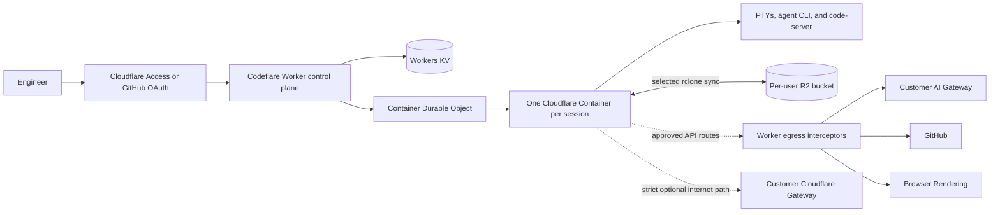

<h1 align="center">
  
  Codeflare
</h1>

<p align="center"><strong>Customer-operated execution for governed engineering agents.</strong></p>

<p align="center">Software delivery · browser automation · infrastructure operations in private preview</p>

<p align="center">
  <a href="https://github.com/nikolanovoselec/codeflare/actions/workflows/test.yml"></a>
  <a href="https://github.com/nikolanovoselec/codeflare/actions/workflows/codeql.yml"></a>
  <a href="https://github.com/nikolanovoselec/codeflare/actions/workflows/scorecard.yml"></a>
  <a href="https://codeflare.ch"></a>
  <a href="https://www.cloudflare.com"></a>
  <a href="LICENSE"></a>
</p>

<p align="center">
  <a href="https://codeflare.ch">Live product</a> ·
  <a href="documentation/README.md">Documentation</a> ·
  <a href="SECURITY.md">Security</a> ·
  <a href="https://github.com/nikolanovoselec/codeflare-private">Enterprise operations</a>
</p>


Codeflare runs engineering agents in authenticated, disposable browser sessions. Engineers define intent and approval boundaries. Agents work through repositories, tests, reviews, deployed applications, and approved operational workflows while Codeflare keeps the session, evidence, and delivery path under one control plane.

The software is deployed into the operator's Cloudflare account. In an enterprise deployment, identity, session compute, persistent storage, inference policy, network policy, and operational evidence remain in the customer's account and connected systems.

> Codeflare is in private preview. Software delivery and browser automation are available today. Infrastructure operations are restricted to approved private-preview deployments and should not be treated as generally available.

<p align="center">
  
  
</p>

Enterprise Codeflare runs as a single-tenant deployment in the customer's Cloudflare account. The customer chooses who can enter, which agents and model routes are available, where internet traffic may go, how persistent data is handled, and which delivery actions still require human approval.

## Platform scope

| Capability | What it provides | Availability |
|---|---|---|
| Software delivery | Repository exploration, implementation, behavioral tests, pull requests, specialist review, CI inspection, deployment, and live verification | Available |
| Browser automation | Public-page retrieval, clean Markdown extraction, interactive Chrome DevTools sessions, screenshots, responsive checks, and semantic end-to-end verification | Advanced sessions with Browser Rendering configured |
| Browser IDE | A lazy-started code-server workspace inside the active session, with bounded UI continuity and native Pi or Claude integration where supported | Advanced running sessions |
| Project intelligence | Specifications, reusable skills, specialist agents, persistent notes, memory capture, and source/documentation knowledge graphs | Advanced sessions |
| Enterprise controls | Cloudflare Access, customer AI Gateway routing, per-group route policy, boundary-injected credentials, optional strict egress, and governed storage controls | Enterprise deployment |
| Infrastructure operations | Approved discovery, patching, migration, verification, and recovery through customer policy boundaries | Private preview |

## Governed execution

A Codeflare run starts with agreed intent and ends with a reviewable delivery record. Advanced sessions can bootstrap an existing repository into a specification-driven baseline, enforce acceptance criteria and behavioral tests at pull-request boundaries, and send findings back for correction before human triage.

| Stage | Agent work | Control and evidence |
|---|---|---|
| Define | Inspect the system and write or select requirements with acceptance criteria | The approved scope is explicit before implementation starts |
| Execute | Change code, configuration, documentation, or an approved operational target | Work stays inside the selected session and authorized tool surface |
| Prove | Run behavioral tests and inspect deployed behavior in a browser | CI records deterministic checks; browser verification records observed outcomes |
| Review | Dispatch code, security, specification, documentation, and behavioral review | Findings are reported to the root workflow and corrected before handoff |
| Integrate | Work through branches, pull requests, required checks, and branch protection | The repository and CI remain the source of truth for delivery state |
| Promote | Deploy an exact reviewed tree and verify the live result | Humans retain merge, production-promotion, and consequential-operation approval |
| Recover | Diagnose failed checks or deployments and follow the documented rollback path | Failed verification does not become a successful release |


### Existing codebases and private inference

`/sdd init` can derive a reviewable requirements baseline from an existing repository, including acceptance criteria and a knowledge graph. `/sdd clean` brings a drifted specification back into line with the observed code and its tests.

[Codeflare Inference Mesh](https://github.com/nikolanovoselec/codeflare-inference-mesh) is an optional inference source for open models on customer-controlled GPU or CPU capacity. Hosted providers remain first-class defaults or fallbacks. Inference Mesh is deployed separately and is not required for Codeflare's customer AI Gateway path.

<p align="center">
  
  
</p>

## Enterprise control plane


| Control | Enterprise behavior | Boundary |
|---|---|---|
| Identity | Cloudflare Access protects the deployment. Optional customer-managed Access groups gate JIT provisioning and live admin elevation. | Codeflare consumes the Access identity; it does not add its own SAML, OIDC, or SCIM directory service. |
| Inference | Supported OpenAI-compatible agent traffic is intercepted before external egress, mapped to customer-configured AI Gateway routes, and tagged with verified user and group metadata. | Enterprise session selection is limited to configured Pi and GitHub Copilot choices, with Bash always available. |
| Model credentials | AI Gateway credentials remain in the Worker boundary. The container receives non-secret route hints and placeholders. | This contract applies to the enterprise interception path, not every non-enterprise credential flow. |
| GitHub | Users connect with their own GitHub authorization. Enterprise containers receive a placeholder; the Worker injects the user's token only at the bound GitHub egress path. | A session cannot select another user's token. Non-enterprise sessions use a different transport. |
| Browser Rendering | An administrator can configure one account-scoped Browser Rendering token. The Worker injects it only for that account's Browser Rendering API. | Without a configured token, Browser Run tools are withheld. Targets must be public. |
| Direct-internet egress | Optional Strict Gateway Egress sends direct-internet HTTP, HTTPS, and WebSocket traffic through the customer's Cloudflare Gateway and denies raw TCP/UDP internet egress. | The feature is off by default. Own-account R2, account-scoped Cloudflare APIs, Browser Rendering, and AI Gateway are direct exceptions with their own controls. |
| Persistent data | Each user has a dedicated R2 bucket. KV stores identity, session metadata, settings, and encrypted credential records when `ENCRYPTION_KEY` is configured. | Workspace sync is opt-in. Governed Mode trades R2 SSE-C opacity for customer inspection while leaving Vault and KV secret encryption intact. |
| Storage access | An enterprise toggle can block attachment downloads and allow only inline views of approved file types. | Enforcement is server-side; upload and delete remain available. |
| Cost and usage | Idle session compute stops, and AI Gateway metadata attributes supported model usage to verified users and Access groups. | Codeflare does not claim an independent enterprise billing, SLA, or compliance-certification layer. |


## Engineering workspace

An Advanced session starts with the organization's selected rules, skills, agent definitions, tools, and project context. The session image contains a Linux toolchain, GitHub CLI, Cloudflare tooling, code-server, browser automation clients, and the supported agent CLIs.


| Surface | Behavior |
|---|---|
| Web UI | Responsive session management and terminal workspaces for desktop, tablet, and mobile browsers |
| Terminal | Up to six browser terminals per session, with tabbed, two-pane, three-pane, and four-pane layouts |
| MultiView | A browser-local desktop/tablet workspace for observing two to four running sessions without creating another backend session |
| Browser IDE | Pinned code-server inside the selected container, opened on demand through the authenticated session route |
| GitHub | Repository browsing, clone-into-session, authenticated Git operations, pull requests, checks, and review workflows |
| Browser Run | One-shot rendered-page reads and interactive Chrome DevTools sessions for public targets owned or authorized by the user |
| Persistence | Per-user R2 sync for selected home data, optional project workspace sync, manual Sync-now, and a bounded final sync before deliberate shutdown |
| Memory and graph | Advanced-mode Vault notes, bounded memory capture, repository graphs, and a merged view of source, specifications, decisions, and documentation |

### Agent availability

| Deployment | Selectable session agents |
|---|---|
| Default, Onboarding, and SaaS | Claude Code, Codex, GitHub Copilot, Antigravity (beta), OpenCode (beta), Pi, and Bash |
| Enterprise | An administrator-selected subset of Pi and GitHub Copilot; Bash is always selectable |

The Browser IDE follows terminal tab 1. Pi sessions receive native Codeflare Chat and **Review with Codeflare**. Claude sessions receive Anthropic's pinned official panel. Other selections open code-server without an agent-specific sidebar. Live editor databases, extension state, credentials, authentication, chat history, and logs remain temporary; only a bounded allowlist of theme, Explorer, and open-file UI state can persist.


## Architecture


```mermaid
flowchart LR
    E[Engineer] --> ID[Cloudflare Access or GitHub OAuth]
    ID --> W[Codeflare Worker control plane]
    W --> KV[(Workers KV)]
    W --> DO[Container Durable Object]
    DO --> C[One Cloudflare Container per session]
    C --> P[PTYs, agent CLI, and code-server]
    C <-->|selected rclone sync| R2[(Per-user R2 bucket)]
    C -. approved API routes .-> X[Worker egress interceptors]
    X --> AIG[Customer AI Gateway]
    X --> GH[GitHub]
    X --> BR[Browser Rendering]
    C -. strict optional internet path .-> GW[Customer Cloudflare Gateway]
```

The Worker owns authentication, routing, public APIs, session lifecycle, and the proxy boundary. A Container Durable Object owns each session's runtime lifecycle. Workers KV is the dashboard's status and configuration store; polling it does not wake sleeping containers. R2 carries per-user persistent data between sessions.

See [Architecture](documentation/lanes/architecture.md), [Authentication](documentation/lanes/authentication.md), [Container](documentation/lanes/container.md), [Storage and Sync](documentation/lanes/storage-and-sync.md), and the [Enterprise Mode specification](sdd/spec/enterprise-mode.md).

## Trust boundaries

- A session isolates processes, files, and network state from other sessions. Trusted code and agents still have broad access inside their own container.
- The Browser IDE's fixed workspace is navigation confinement. It is not a filesystem sandbox for terminals, extensions, or agents.
- Stopping a session removes processes and transient state. It cannot reverse synchronized files, Git pushes, deployments, API calls, or infrastructure changes already made outside the container.
- Project workspace synchronization is disabled by default. Git remains the recommended persistence path for source code; full R2 workspace sync is an explicit setting.
- R2 synchronization is periodic rather than transactional. It runs on a 15-minute cadence, on Sync-now, and before deliberate shutdown, with newest modification time winning conflicts.
- Strict Gateway Egress is optional and has documented own-account exceptions. It should not be described as inspection of every packet or every Cloudflare backend.
- `ENCRYPTION_KEY` is the boundary for KV credential encryption and R2 SSE-C. A deployment without it must not claim encrypted application-level credential storage.
- The initial setup endpoint is public until the deployment is claimed. Operators should complete setup promptly and place the initialization hostname behind Access afterward.

Read the full [security architecture](documentation/lanes/security.md), [security policy](SECURITY.md), and [architecture decision record](documentation/decisions/README.md) before approving a production deployment.

## Deployment profiles

| Profile | Identity and entry | Intended use |
|---|---|---|
| Default | Cloudflare Access with setup-managed allowlists; private application entry | Evaluation, individual use, and self-operated single-tenant deployments |
| Onboarding | Public landing and integrated login; GitHub OAuth when configured, with an access-request flow | Controlled pilots and invite-based access |
| SaaS | Worker-managed GitHub OAuth or Access fallback, JIT users, subscription tiers, and metered usage | Hosted multi-user operation |
| Enterprise | Customer Cloudflare Access, JIT unlimited Advanced users, optional group gates, customer AI Gateway, and enterprise policy controls | Customer-operated single-tenant deployment |

Non-default secrets, environment layouts, token scopes, and operator runbooks are maintained in [codeflare-private](https://github.com/nikolanovoselec/codeflare-private) (access required). The public repository documents behavior and the Default deployment path without publishing private operational configuration.

## Default deployment quick start

The public path creates a self-operated Default-mode deployment. It requires a Cloudflare account, a GitHub fork, and two repository secrets.

### 1. Fork the repository

Fork this repository into the GitHub account that will own the deployment workflow.

### 2. Add deployment secrets

Open **Settings > Secrets and variables > Actions > New repository secret** in the fork and add:

| Secret | Value |
|---|---|
| `CLOUDFLARE_API_TOKEN` | A custom Cloudflare API token with the required operator permissions |
| `CLOUDFLARE_ACCOUNT_ID` | The target Cloudflare account ID |

<a id="api-token-scopes"></a>
The operator token must cover account metadata, Workers, KV, R2, Containers, Access applications and groups, API-token administration, and the target zone's DNS and Worker routes. The maintained permission table is in [Configuration: Cloudflare API Token (Operator)](documentation/lanes/configuration.md#cloudflare-api-token-operator).

<a id="cloudflare-api-token-user"></a>
Per-user Cloudflare OAuth offers Minimal, Recommended, and Advanced scope sets. The exact registration catalog and Browser Rendering requirement are maintained in [Configuration: Cloudflare API Token (User)](documentation/lanes/configuration.md#cloudflare-api-token-user).

### 3. Run the deployment workflow

Open **Actions > Deploy > Run workflow**, select `main`, choose the production target, and run it. The workflow verifies the exact source tree, builds the Worker and session image, scans the image, and deploys only after its gates pass.

### 4. Claim and configure the instance

Find the Worker URL in **Cloudflare dashboard > Compute > Workers & Pages** and open it immediately. The setup wizard configures the custom domain, R2 credentials, allowed users, administrators, and Cloudflare Access resources. After setup, use the custom domain as the application entry point.

> For a shared or production deployment, configure `ENCRYPTION_KEY` before storing provider or user credentials or enabling the Advanced Vault path. Without it, Codeflare cannot provide its KV credential-encryption and R2 SSE-C contracts.

Users may still need their selected agent's own subscription or credentials. GitHub and Cloudflare repository/deployment integrations also require their respective operator-registered OAuth applications where applicable.

## Operational defaults

| Setting | Default behavior |
|---|---|
| Session compute | 1 vCPU, 3 GiB memory, 6 GB disk |
| Container capacity | 10 concurrent containers unless the deployment overrides it |
| Auto-sleep | 30 minutes for ordinary active users; SaaS free-tier users are fixed at 15 minutes |
| Terminal capacity | Six PTYs per session |
| Workspace sync | Off; enable full workspace sync explicitly when Git is insufficient |
| Persistent sync | Startup restore, 15-minute bisync, Sync-now, and bounded final sync before deliberate teardown |
| Browser IDE | Advanced sessions only, lazy-started when first opened |
| Browser Run | Advanced sessions only and omitted when a Browser Rendering credential is unavailable |

The full configuration surface is in [Configuration](documentation/lanes/configuration.md). Storage behavior and exclusions are in [Storage and Sync](documentation/lanes/storage-and-sync.md).

## Verification and supply chain

| Gate | Repository contract |
|---|---|
| PR Checks | Path-aware lint, dead-code checks, type checks, audits, backend/frontend/landing/host tests, coverage, dependency review, workflow audit, bundle size, and Browser IDE package verification |
| Container image | Content-addressed build, Trivy scan of fixable HIGH/CRITICAL findings, SBOM generation, and provenance on fresh image publication |
| CodeQL | JavaScript and TypeScript analysis on pull requests, `main`, and the weekly schedule |
| Property-based fuzzing | 50,000 CI iterations over API, parsing, path, session, terminal, and migration boundaries |
| Workflow audit | `zizmor` and `actionlint` run as a blocking PR lane; SARIF history is retained in code scanning |
| External probes | Weekly checks for authentication, headers, TLS, methods, traversal, injection, and information disclosure |
| Deployment | Exact-head and exact-tree verification precedes the staged Worker and container deployment |

CI behavior, evidence reuse, and workflow ownership are documented in [CI/CD and Testing](documentation/lanes/ci-cd.md). Historical external-probe evidence is in [Penetration Testing](documentation/lanes/pentest.md), and load procedures are in [Stress Testing](documentation/lanes/stress-test.md).

## Development

Production deployment belongs to GitHub Actions. For contributor setup and local commands:

```bash
npm install
cd web-ui && npm install && cd ..
npm run dev
```

Run the package suites from their owners:

```bash
npm test
(cd web-ui && npm test)
(cd landing && npm test)
(cd host && npm test)
```

See [CONTRIBUTING.md](CONTRIBUTING.md) for branch, test, and pull-request expectations. Do not use `npm run deploy` as a substitute for the reviewed deployment workflow.

## Documentation map

| Audience | Start here |
|---|---|
| Operators | [Configuration](documentation/lanes/configuration.md), [Deployment and rollback](documentation/lanes/deployment.md), [Container](documentation/lanes/container.md), [Storage and Sync](documentation/lanes/storage-and-sync.md), [Troubleshooting](documentation/lanes/troubleshooting.md) |
| Security teams | [Security architecture](documentation/lanes/security.md), [Authentication](documentation/lanes/authentication.md), [User provisioning](documentation/lanes/user-provisioning.md), [Security policy](SECURITY.md) |
| Developers | [Architecture](documentation/lanes/architecture.md), [API reference](documentation/lanes/api-reference.md), [CI/CD](documentation/lanes/ci-cd.md), [Preseed system](documentation/lanes/preseed.md) |
| Product and QA | [Specification index](sdd/README.md), [Landing requirements](sdd/spec/landing.md), [Operations requirements](sdd/spec/operations.md), [change history](sdd/spec/changes.md) |
| Session users | [Getting Started](preseed/tutorials/Getting%20Started.md) and the [worked examples](preseed/tutorials/Examples/) |
| Enterprise operators | [codeflare-private](https://github.com/nikolanovoselec/codeflare-private) (access required) |

Specifications define required behavior and acceptance criteria. Documentation lanes describe the implementation and its operating boundaries; architecture decisions preserve the rationale for important trade-offs.

## Security reporting

Do not open public issues for vulnerabilities. Follow [SECURITY.md](SECURITY.md) for the private reporting route and response process.

## License

Codeflare is licensed under [PolyForm Noncommercial 1.0.0](LICENSE). The license permits noncommercial use, including the personal research, experimentation, and testing described in its terms. Commercial use, resale, or a paid hosted offering requires a separate written license.
