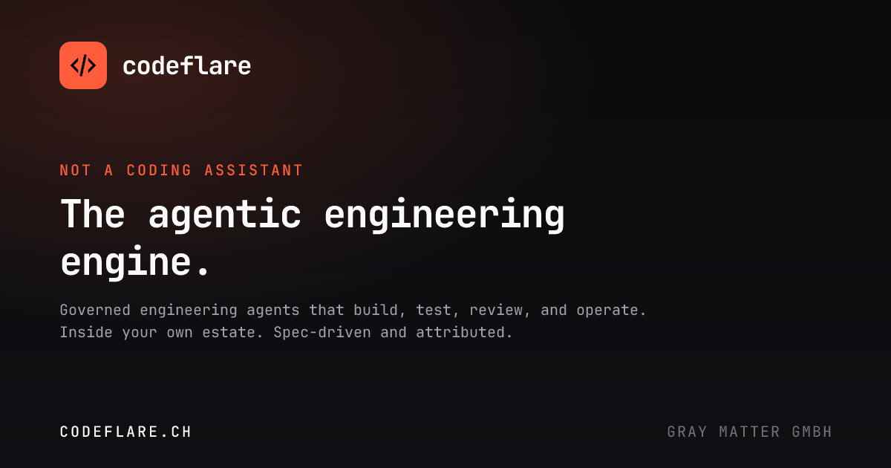
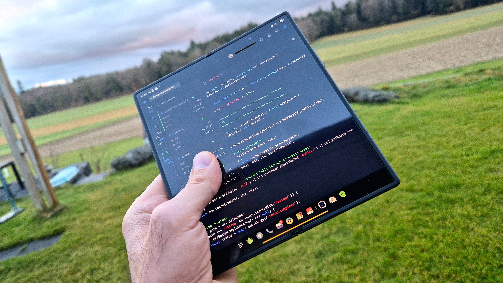
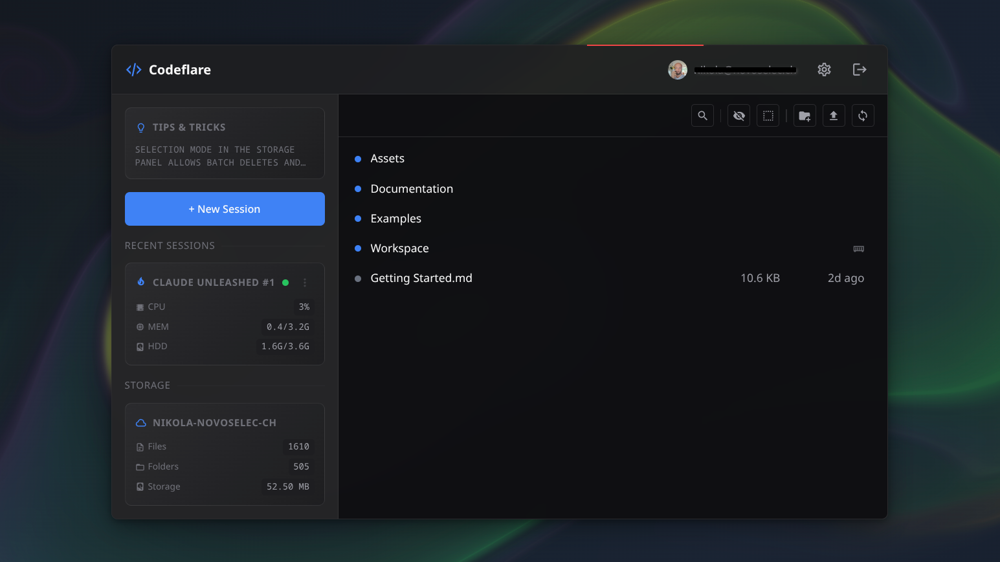
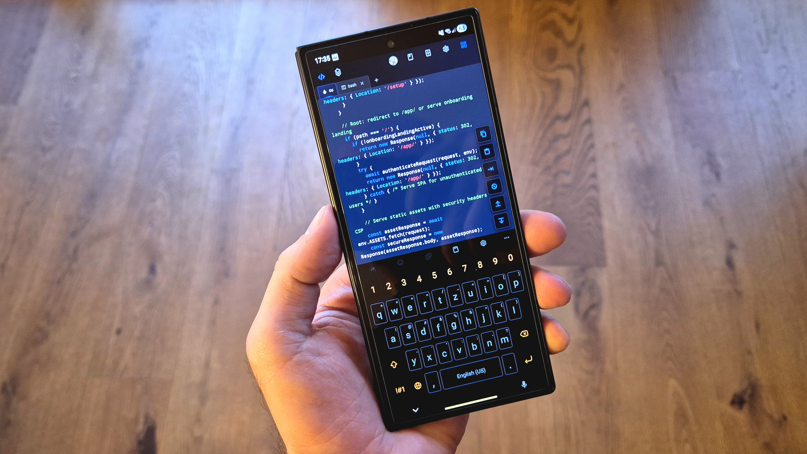
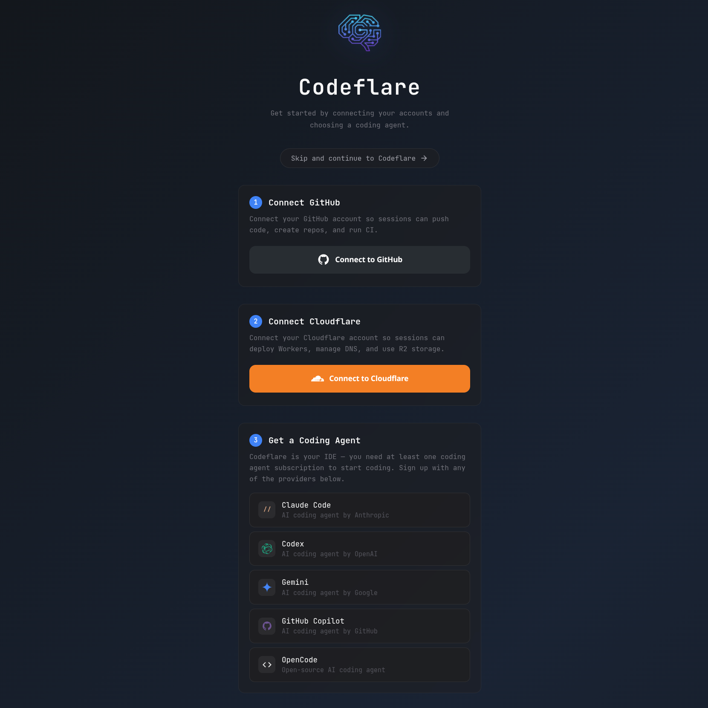

#  Codeflare



**Not a coding assistant. The agentic engineering engine.**

Codeflare runs governed engineering agents inside your own estate. They build, test, review, and operate. The engineer specifies, steers, and judges; the agents do the rest, under your git, your CI, and your zero-trust boundary.

The governance is the product. Spec-driven and test-driven development run as enforced, self-healing loops: every change is checked against its specification at the pull-request boundary, and drift is a blocking finding instead of something that ships. Each session runs in its own isolated, ephemeral container with no standing infrastructure to persist on. Model traffic never goes direct. It is intercepted at the platform layer and routed through your AI Gateway, where guardrails and DLP apply, every call is inspected, and every token of spend is attributed to a user, team, and route.


*One governed run, from intent to merge. Reachable from any screen with a browser, zero setup.*

**Try it:** [codeflare.ch](https://codeflare.ch)

Every session comes pre-loaded with your choice of agent:

| Agent | Description |
|---|---|
| [Antigravity](https://antigravity.google/docs/cli-overview) | Google's terminal coding agent (beta) |
| [Claude Code](https://docs.anthropic.com/en/docs/claude-code) | Anthropic's agentic CLI |
| [Codex](https://github.com/openai/codex) | OpenAI's coding agent |
| [GitHub Copilot](https://docs.github.com/en/copilot) | GitHub's AI coding agent |
| [OpenCode](https://github.com/opencode-ai/opencode) | Open-source coding agent (beta) |
| [Pi](https://www.npmjs.com/package/@earendil-works/pi-coding-agent) | Extensible coding agent |
| Bash | For the purists |

*Pro mode — cross-session memory, a queryable knowledge graph, curated skills, and spec-driven workflows — runs full-strength on Claude Code and Pi. Other agents receive the rules and agent definitions; the deepest Pro capabilities are Claude/Pi-native.*

---

## Contents

- [What Codeflare does](#what-codeflare-does)
- [Architecture](#architecture)
- [Quick start](#quick-start)
- [Configuration](#configuration)
  - [Default mode](#default-mode-what-you-get-with-zero-extra-config)
  - [Advanced deployment modes](#advanced-deployment-modes)
- [Security](#security)
- [Testing](#testing)
- [CI/CD](#cicd)
- [Documentation](#documentation)
- [Related projects](#related-projects)
- [License](#license)

---

## What Codeflare does


*Manage sessions, browse persistent storage, and monitor live resource usage — all from one view.*

**Native integrations, wired in, not bolted on.**

- **Native GitHub integration** — connect once via OAuth (no token paste). Every session gets automatic `git push`, `gh` CLI, and CI/CD access. No SSH keys, no per-session auth.
- **Native Cloudflare integration** — connect your own Cloudflare account once via OAuth. Deploy Workers and manage D1, R2, KV, and DNS from the terminal, already authenticated.
- **Build, push, and deploy skills** — pre-loaded agent skills scaffold Workers projects, configure `wrangler.toml`, push to GitHub, set up CI, and deploy. Describe what you want; the agent builds, pushes, and deploys it to a live URL.
- **Guided onboarding** — new users are walked through connecting GitHub and Cloudflare and choosing an agent. No prior Cloudflare knowledge required.

**The IDE.**

- Browser-native terminal with 6 tabs per session and tiling mode (2–4 terminals side by side within one session).
- **MultiView** — view several running sessions side by side in one workspace. It's a virtual view over sessions you already have: no new session is created, and no existing session's lifecycle is affected.
- One isolated container per session — agents can't escape their sandbox.
- Persistent R2 storage with bisync every 15 minutes, a manual Sync-now button, and a final sync on stop. Sync conflicts are reconciled automatically on the next cycle.
- Pre-warmed terminals — the agent is loaded before you open the tab.
- Fast Start — agent auto-updates are disabled by default for instant startup; toggle in Settings.
- Set your API key once; it syncs across sessions.
- Live per-session CPU/memory/disk metrics and a three-color status (active / idle / stopped).
- Usage dashboard — daily and monthly compute hours and quota remaining, tracked by a per-user Timekeeper Durable Object.
- Configurable auto-sleep — containers stop after inactivity (15m / 30m / 1h / 2h / 4h). The timer is input-aware: it resets only on real terminal input, not reconnects or background polls.
- CPU cost scales to zero when idle — you pay for what you use.

**For your agent (Pro mode).**

- **SilverBullet vault** — every Pro session ships a browser-native note editor at `~/Vault/`. Notes, decisions, and transcripts bisync to R2 (covered by `ENCRYPTION_KEY` when set) and are IndexedDB-encrypted at rest with a zero-UI per-session key.
- **Cross-session memory** — conversation context is auto-captured every 15 prompts into the vault, so the next session opens with full recall of prior decisions — even on a different device.
- **Knowledge graph** — a queryable semantic graph (Graphify) over project source and vault content, reachable in Claude via `mcp__graphify__*` and in Pi via native `graphify_query`, `graphify_path`, and `graphify_explain` tools.

**From solo to enterprise.**

- **Default** — single-tenant, every user unlimited, zero extra configuration. Fork, add two secrets, deploy.
- **SaaS** — multi-tenant: subscriptions and billing (Stripe), tiered plans, just-in-time user provisioning, an admin approval workflow, and per-user usage metering.
- **Enterprise** — single-tenant, end-to-end Zero Trust: browser isolation, SSO with your corporate IdP, a Secure Web Gateway, and every model call routed through your own AI Gateway with dynamic routing, DLP, and guardrails — no key or token ever inside the container.


*Strongly optimized for mobile. Swipe up/down with the keyboard open to navigate like arrow keys; swipe left/right to scroll terminal text.*

---

## Architecture


*Six terminal tabs, split tiling, and your dev tools — in a disposable container you didn't have to configure.*

Each session runs in its own isolated, pre-warmed container that scales to zero when idle — no sessions, no bill — while your storage persists and usage is tracked per user. Auth defaults to Cloudflare Access, with GitHub OAuth available in the advanced modes (see [authentication.md](documentation/lanes/authentication.md)). Full internals in [architecture.md](documentation/lanes/architecture.md).

---

## Quick start

Four simple steps.

### 1. Fork this repo

### 2. Add the two required secrets

In your fork: **Settings → Secrets and variables → Actions → New repository secret**. Add each as a separate secret.

| Secret | Where to find it |
|---|---|
| `CLOUDFLARE_API_TOKEN` | Create a custom token — see [API token scopes](#api-token-scopes) |
| `CLOUDFLARE_ACCOUNT_ID` | Any zone's overview page in the [Cloudflare dashboard](https://dash.cloudflare.com/) |

These two are the **only** required configuration. Everything in [Configuration](#configuration) is optional.

### 3. Deploy

**Actions → Deploy → Run workflow → Branch: `main` → Run workflow.** GitHub Actions builds, tests, and deploys to Cloudflare Workers (~2 minutes). Future pushes to `main` deploy automatically.

### 4. Run the setup wizard

Find your worker URL at [dash.cloudflare.com](https://dash.cloudflare.com/) → **Compute → Workers & Pages →** your worker (default name: `codeflare`, so `codeflare.<your-subdomain>.workers.dev`). Open it; the wizard verifies your token, configures a custom domain and allowed users, and sets up authentication via Cloudflare Access.


*Connect your accounts and pick an agent. No prior Cloudflare or GitHub knowledge required.*

That's it, you're live. You'll need an active subscription to at least one supported agent; log in directly from the terminal.

> To let users connect their own GitHub and Cloudflare accounts (automatic `git push` / `wrangler` deploy from a session), an admin registers one OAuth app per provider and enters the credentials in the wizard — see the [private deployment docs](https://github.com/nikolanovoselec/codeflare-private-docs) (access required).

<details>
<summary><strong id="api-token-scopes">API token scopes</strong></summary>

Create a custom token at [dash.cloudflare.com/profile/api-tokens](https://dash.cloudflare.com/profile/api-tokens).

**Required** — the minimum to deploy and run:

| Scope | Permission | Access | Why |
|---|---|---|---|
| Account | Account Settings | Read | Setup wizard reads account metadata |
| Account | Workers Scripts | Edit | Deploys the Worker |
| Account | Workers KV Storage | Edit | Session metadata and configuration |
| Account | Workers R2 Storage | Edit | Per-user persistent file storage |
| Account | Containers | Edit | Manages ephemeral session containers |
| Account | Access: Apps and Policies | Edit | Creates the Access application gating `/app` and `/api` |
| Account | Access: Organizations, Identity Providers, and Groups | Edit | Creates admin and user groups |
| Account | API Tokens | Edit | Creates per-user scoped R2 tokens |
| Zone | Zone | Read | Discovers your domain for custom-domain setup |
| Zone | DNS | Edit | Adds DNS records for the custom domain |
| Zone | Workers Routes | Edit | Routes your domain to the Worker |

</details>

---

## Configuration

> **The only mandatory configuration is the two secrets from [step 2](#2-add-the-two-required-secrets).** Set them, deploy, run the wizard, and you have a working instance in **Default mode**. Everything else — the advanced deployment modes (Onboarding / SaaS / Enterprise) and advanced tuning — is configured separately and documented privately (see [Advanced deployment modes](#advanced-deployment-modes)).

### Default mode: what you get with zero extra config

With **only** the two required secrets, your instance runs in Default mode:

- **Single-tenant**, authenticated by **Cloudflare Access** (the wizard creates the Access app, groups, and policies).
- **Every user is unlimited** — no subscription tiers, no billing, no quota enforcement; Pro mode is available.
- **All seven agents** selectable (six AI agents plus Bash).
- **Persistent R2 storage** per user, bisync every 15 minutes.
- Limits: **3 sessions/user**, **10/admin**; up to **10 concurrent containers**; **1 vCPU / 3 GiB / 6 GB** each.
- Root (`/`) redirects to the app — no public landing page.

Most self-hosters never need anything below this line.

### Advanced deployment modes

Beyond default mode, Codeflare also runs in **Onboarding**, **SaaS**, and **Enterprise** modes — see [What Codeflare does](#what-codeflare-does) for their capabilities. Setup and configuration for these modes is maintained privately: **[codeflare-private-docs](https://github.com/nikolanovoselec/codeflare-private-docs)** (access required).

---

## Security

Defense-in-depth throughout; full detail in [security.md](documentation/lanes/security.md).

- **Isolation** — one container per session, each running as root inside a locked sandbox it cannot escape. No shared shells, no cross-session access.
- **Authentication** — every authenticated surface (`/app`, `/api`, `/setup`) is gated by JWT verification — Cloudflare Access by default, GitHub OAuth in the advanced modes.
- **Credential handling** — deploy tokens stay in GitHub and Cloudflare by default. When you connect Push & Deploy, they're injected into your container, stored AES-256-GCM-encrypted in KV, scoped per user, and never shared across sessions.
- **Encryption at rest** *(optional, set `ENCRYPTION_KEY`)* — KV credentials (AES-256-GCM, per-value IVs, AAD-bound) and R2 files (SSE-C) are encrypted; the vault gets its own zero-UI per-session key. Existing plaintext entries migrate transparently on first read. See [Credential Encryption at Rest](documentation/lanes/security.md#credential-encryption-at-rest).
- **Hardening** — HSTS, CSP, X-Frame-Options, and Referrer-Policy on every response; KV-backed per-user rate limits (429 + `Retry-After`); Zod input validation with a 64 KiB body limit.
- **Supply chain** — CodeQL (with Copilot Autofix), OSSF Scorecard, `npm audit`, dependency review, Dependabot, and Trivy container scanning.
- **Continuous testing** — a weekly CI workflow runs automated penetration tests against the auth gate, security headers, TLS, injection, and information disclosure. See [Penetration Testing](documentation/lanes/pentest.md).

Report a vulnerability via [SECURITY.md](SECURITY.md).

---

## Testing

```bash
npm test                     # Backend tests
cd web-ui && npm test        # Frontend tests
cd host && npm test          # Host tests (prewarm, activity tracker)
npm run test:e2e:api         # E2E API (requires a deployed worker)
npm run test:e2e:ui          # E2E UI desktop (requires a deployed worker)
npm run test:e2e:ui-mobile   # E2E UI mobile
```

E2E tests require a deployed worker and service credentials (CF Access service tokens). See [CI/CD & Testing](documentation/lanes/ci-cd.md#testing) for the full suite and [E2E setup](documentation/lanes/ci-cd.md#e2e-service-token-setup).

---

## CI/CD

| Workflow | Trigger | Purpose |
|---|---|---|
| `deploy.yml` | Push to `main` / manual | Tests + Docker build + Trivy scan + deploy |
| `test.yml` | Pull requests | Lint, tests, typecheck, security audit, dependency review |
| `e2e.yml` | Manual | E2E matrix: API, UI desktop, UI mobile |
| `codeql.yml` | Push, PRs, weekly | CodeQL static analysis |
| `scorecard.yml` | Push to `main`, weekly, manual | OSSF Scorecard |
| `fuzz.yml` | PRs, weekly, manual | Property-based fuzzing (fast-check) |
| `pentest.yml` | Weekly (Mon 05:00 UTC), manual | Automated external penetration testing |
| `stress-test.yml` | Manual | k6 load testing against the integration worker |

See [CI/CD & Testing](documentation/lanes/ci-cd.md) for full documentation.

---

## Documentation

- **`documentation/`** — [architecture](documentation/lanes/architecture.md), [API reference](documentation/lanes/api-reference.md), [security](documentation/lanes/security.md), [configuration](documentation/lanes/configuration.md), [billing](documentation/lanes/billing.md), and [more](documentation/README.md).
- **`preseed/tutorials/Getting Started.md`** — tabs, tiling, file persistence, and three paths forward depending on how much hand-holding you want.
- **`preseed/tutorials/Examples/`** — spec-driven project examples from Hello World to a full blog platform. Hand one to your agent and go.

<details>
<summary><strong>Local development</strong></summary>

```bash
npm install
cd web-ui && npm install && cd ..
npm run dev
```

</details>

<details>
<summary><strong>Troubleshooting: Cloudflare WAF blocking API requests</strong></summary>

On a Cloudflare Pro plan (or higher) with Managed Rulesets enabled, the WAF may block legitimate API calls.

**Symptom:** a wall of HTML in your terminal where a simple confirmation (e.g. "session deleted") should be, informing you that you've been blocked.

**Fix:** in your domain's **Security → Analytics → Events**, find the blocked request (Action taken: *Block*), open the rule that triggered it, and disable it.

</details>

---

## Related projects

- **[codeflare-inference-mesh](https://github.com/nikolanovoselec/codeflare-inference-mesh)** — the self-hosted inference layer of the Codeflare family: a private LLM inference fabric on hardware you already own.

It pools the idle GPUs and CPUs across machines you already own into one private fabric and serves open LLMs on it — sharding a model too large for any single machine across several nodes and serving it as one — behind a single Gateway alias with automatic failover to external providers. The inference engine for your agents when you want prompts to stay on hardware you control.

---

## License

PolyForm Noncommercial 1.0.0 — free for personal use, tinkering, and showing off.

Commercial use, resale, or paid hosted offerings require a separate written license.
