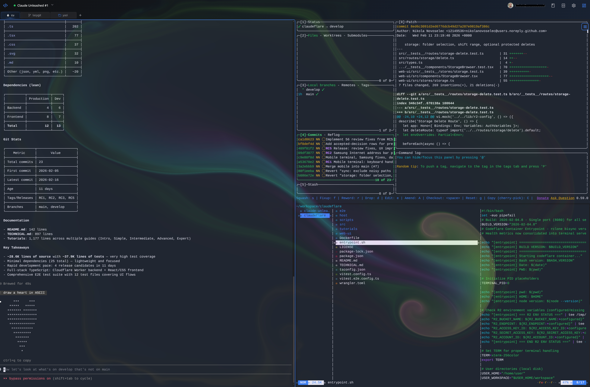
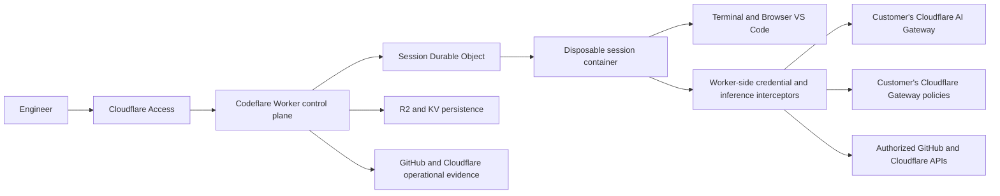

#  Codeflare


**Governed AI agents for software delivery and infrastructure operations.**

Codeflare is a customer-operated control plane for agents that build software, change Cloudflare infrastructure, inspect CI, deploy, verify live systems, and support operational recovery. Engineers define intent, steer execution, inspect evidence, and approve outcomes; agents work inside authenticated, disposable browser sessions instead of on laptops or long-lived shared runners.

Enterprise Codeflare runs as a single-tenant deployment in the customer's Cloudflare account and connects to the customer's identity, GitHub organization, inference controls, storage, and security policies. A public demonstration is available at [codeflare.ch](https://codeflare.ch); enterprise deployment guidance is maintained in [codeflare-private](https://github.com/nikolanovoselec/codeflare-private) (access required).

## Contents

- [What teams use Codeflare for](#what-teams-use-codeflare-for)
- [Disposable by design](#disposable-by-design)
- [Governed execution](#governed-execution)
- [Enterprise controls](#enterprise-controls)
- [Workspace experience](#workspace-experience)
- [Architecture](#architecture)
- [Deployment models](#deployment-models)
- [Enterprise deployment](#enterprise-deployment)
- [Community/default deployment quick start](#communitydefault-deployment-quick-start)
- [Configuration](#configuration)
- [Security boundaries](#security-boundaries)
- [Development and operations](#development-and-operations)
- [Testing and CI](#testing-and-ci)
- [Documentation](#documentation)
- [Codeflare Inference Mesh](#codeflare-inference-mesh)
- [License](#license)

---

## What teams use Codeflare for

Codeflare gives agents a governed execution environment for software and infrastructure work across the full delivery lifecycle.

| Work domain | What agents can do |
|---|---|
| **Software delivery** | Explore repositories, implement requirements, run review workflows, work through pull requests, inspect CI, and verify changes against behavioral acceptance criteria. |
| **Cloudflare infrastructure operations** | Use Wrangler and bundled Cloudflare skills to deploy and operate Workers, D1, R2, KV, DNS, Durable Objects, and related Cloudflare services with the user's authorized account. |
| **Deployed-system verification** | Inspect logs and checks, verify live URLs, read rendered pages, and drive semantic browser checks against deployed applications. Deterministic assertions remain in CI. |
| **Operational recovery** | Diagnose failed builds or deployments, inspect current state, apply bounded corrections, and use documented deployment and rollback procedures. |

The same terminal and agent tooling can work across application code, delivery pipelines, platform configuration, and live verification. Codeflare does not claim AWS, Azure, on-premises, or general multi-cloud infrastructure support.

---

## Disposable by design

AI agents need broad tools to be useful. Codeflare moves that activity away from endpoint devices and persistent shared runners into one isolated runtime per session.

> Agents run in disposable session containers rather than on laptops or long-lived shared runners. When a user stops a session, or its idle timeout expires, the runtime, processes, temporary IDE state, and unsynced transient state are torn down. Only explicitly synchronized workspace, Vault, and selected configuration data survives through bounded R2 synchronization.

Agents get the tools needed to act without leaving a long-lived runtime behind after the work ends.

Closing the browser does not destroy a session immediately. It starts the inactivity path; after the configured period without real terminal or Browser IDE input, Codeflare stops the container. Users can also stop or delete a session explicitly. A final bounded sync runs during graceful shutdown.

This removes standing runtime persistence and separates sessions from one another. It does **not** undo synced file changes, Git pushes, deployments, API calls, or other external side effects. Terminals, trusted extensions, and agents retain root access inside their own container; the disposable container and authenticated proxy are the isolation boundary, not an additional tool sandbox.

Persistent and ephemeral state are deliberately separated:

| Persists intentionally | Disappears with the runtime |
|---|---|
| Synced workspace files, Vault content, selected user configuration, and a bounded IDE UI snapshot | Processes, terminals, non-synced temporary files, live IDE databases, extension state, authentication state, chat history, logs, WAL/SHM files, and unsynced transient data |

---

## Governed execution

Codeflare enforces governance through the delivery lifecycle:

1. **Define intent:** requirements and acceptance criteria establish the approved outcome.
2. **Implement:** agents work in the repository and use the team's existing tools and environments.
3. **Test:** behavioral tests prove observable contracts rather than matching prompts or prose.
4. **Review:** specialist code, specification, documentation, security, and deep-behavior lanes inspect the exact change boundary.
5. **Integrate:** GitHub pull requests, branch protection, and CI remain the authoritative change gate.
6. **Deploy and verify:** agents can follow deployment workflows, inspect checks, and verify the live result in a real browser.
7. **Recover:** failed verification routes back to a bounded fix; documented rollback remains available when promotion is unsafe.

Pro sessions preload organizational rules, reusable skills, specialist agents, specification-driven development, TDD enforcement, PR-boundary review, CI monitoring, and deployment workflows. Humans retain approval for merges, production promotion, and consequential operational actions.

---

## Enterprise controls

Enterprise Codeflare is deployed inside the customer's Cloudflare account. That establishes one consistent control boundary; the services below are customer-configured Cloudflare capabilities, not a separate Codeflare-hosted identity, inference, or observability platform.

| Control | Enterprise behavior |
|---|---|
| **Identity and authorization** | Cloudflare Access in the customer's account federates the corporate identity provider. Access JWTs, customer-managed user/admin groups, just-in-time admission, and live group checks govern entry and administration. |
| **Inference routing** | Supported enterprise agent traffic is intercepted at the platform boundary and routed through the customer's Cloudflare AI Gateway. Global and per-group route catalogs constrain approved models, defaults, reasoning, and context windows. |
| **Egress and DLP** | Optional strict egress sends direct-internet HTTP, HTTPS, and WebSocket traffic through the customer's Cloudflare Gateway policies. Existing allow, block, isolation, and DLP policy remains customer-managed; missing configured egress fails closed. |
| **Credential boundaries** | AI Gateway, enterprise GitHub, and Browser Rendering credentials are resolved and injected Worker-side rather than given directly to the container. The exact remaining credential set depends on deployment and storage mode; credential-free containers are not claimed universally. |
| **Storage and encryption** | Workspace and Vault persistence use R2/KV in the customer's Cloudflare account. AES-256-GCM and SSE-C are optional; Governed Mode supports customer inspection through an explicit, verified storage-regime migration. |
| **FinOps and route attribution** | AI Gateway metadata attributes supported model usage to the verified user and matched groups. Route policy constrains available capacity, while session containers scale to zero after stop. |
| **Operational evidence** | GitHub Actions logs and artifacts, CI outcomes, SBOM and scan evidence, session resource metrics, Cloudflare dashboards, and AI Gateway analytics remain in systems the customer controls. |

Cloudflare Access, the customer's Cloudflare AI Gateway, the customer's Cloudflare Gateway policies, and R2/KV in the customer's Cloudflare account are distinct controls. Access governs who enters Codeflare; AI Gateway governs supported model traffic; Gateway governs optional direct-internet egress; R2/KV governs persisted state.

---

## Workspace experience


*One governed workspace from intent through verification, available through a browser without a local engineering toolchain.*

### Terminal and Browser VS Code

- Six browser-native terminal tabs per session, with two-to-four-pane tiling.
- Pre-warmed agent startup and configurable Fast Start behavior.
- Browser VS Code powered by pinned code-server in Pro sessions, lazy-started behind the existing authenticated session proxy.
- A fixed `/home/user/workspace` Browser IDE root with public workspace selectors rejected independently by the Worker and host.
- Native **Codeflare** Chat and **Review with Codeflare** for Pi; the official Claude editor panel for Claude sessions; no account-backed Copilot extension in the Browser IDE.
- Bounded continuity for theme, Explorer expansion, and canonical in-workspace open files without persisting IDE databases, credentials, extension state, or chat history.
- Live CPU, memory, disk, sync, active/idle, and stopped status.
- MultiView for observing several existing sessions side by side without changing their lifecycle.

### Repository, infrastructure, and browser tools

- GitHub repository browsing, cloning, `git`, `gh`, pull-request, review, and CI workflows using the user's authorized permissions.
- Wrangler plus bundled Cloudflare architecture, deployment, security, Durable Objects, Workers, storage, email, Zero Trust, and performance skills.
- Cloudflare Browser Run read and interactive surfaces for rendered-page inspection and semantic deployed-app verification.
- Native Cloudflare resource access for connected users in supported modes, including Workers, D1, R2, KV, and DNS operations.

### Memory and project intelligence

- A browser-native SilverBullet Vault for notes, decisions, plans, and captured context.
- Cross-session memory for approved durable context rather than hidden process continuity.
- Graphify knowledge graphs over project source and Vault content, with query, path, explanation, and visual outputs.
- Curated architecture, debugging, deployment, security, review, and refactoring specialists in Pro mode.


*The terminal workspace is optimized for mobile input as well as desktop and tablet use.*

### Supported agents

The full product supports seven session choices; deployment policy can narrow the available set. Enterprise mode uses its configured gateway-capable agent allowlist plus Bash.

| Agent | Description |
|---|---|
| [Antigravity](https://antigravity.google/docs/cli-overview) | Google's terminal coding agent (beta) |
| [Claude Code](https://docs.anthropic.com/en/docs/claude-code) | Anthropic's agentic CLI |
| [Codex](https://github.com/openai/codex) | OpenAI's coding agent |
| [GitHub Copilot](https://docs.github.com/en/copilot) | GitHub's CLI agent; distinct from the removed Browser IDE Copilot extension |
| [OpenCode](https://github.com/opencode-ai/opencode) | Open-source coding agent (beta) |
| [Pi](https://www.npmjs.com/package/@earendil-works/pi-coding-agent) | Extensible coding agent with native Codeflare Chat |
| Bash | A tool-ready shell without an AI agent |

Pro capabilities run deepest on Claude Code and Pi. Other agents receive compatible rules, skills, and agent definitions where their runtimes support them.

---

## Architecture


*Terminal, Browser VS Code, repository controls, and operational tools share one disposable session runtime.*


```mermaid
graph LR
    U[Engineer] --> A[Cloudflare Access]
    A --> W[Codeflare Worker control plane]
    W --> S[Session Durable Object]
    S --> C[Disposable session container]
    C --> T[Terminal and Browser VS Code]
    W --> D[R2 and KV persistence]
    C --> I[Worker-side credential and inference interceptors]
    I --> AI[Customer's Cloudflare AI Gateway]
    I --> GW[Customer's Cloudflare Gateway policies]
    I --> P[Authorized GitHub and Cloudflare APIs]
    W --> E[GitHub and Cloudflare operational evidence]
```

The Worker owns authentication, routing, API boundaries, session records, and browser-to-container proxying. Each session Durable Object owns one container lifecycle. The host inside that container runs terminal processes, agent tooling, synchronization, and code-server. R2/KV in the customer's Cloudflare account retain only the state selected for persistence.

In enterprise mode, supported LLM and credential-bearing traffic uses Worker-side interceptors so sensitive coordinates and tokens can remain outside the agent runtime. Optional strict egress covers otherwise direct internet traffic through the customer's Cloudflare Gateway policies. GitHub remains the source-change and approval system; GitHub Actions and Cloudflare provide deployment and runtime evidence.

See [Architecture](documentation/lanes/architecture.md), [Authentication](documentation/lanes/authentication.md), [Security](documentation/lanes/security.md), [Container](documentation/lanes/container.md), and the [Enterprise Mode specification](sdd/spec/enterprise-mode.md).

---

## Deployment models

1. **Enterprise:** customer-operated, single-tenant, unlimited Pro mode with billing bypass, Cloudflare Access groups, supported-agent inference interception, route policy, optional strict Gateway egress, and Governed Mode.
2. **Default/self-operated:** single-tenant deployment with unlimited users and Pro sessions using the standard Access setup. Fork the repository, add two deployment secrets, and run the setup wizard.
3. **SaaS:** optional multi-tenant mode with subscriptions, tiered plans, just-in-time provisioning, approval workflow, and per-user usage metering.

Enterprise and advanced-mode operations are maintained in [codeflare-private](https://github.com/nikolanovoselec/codeflare-private) (access required). The supported internal deployment target is the customer's Cloudflare account; multi-cloud and on-premises control-plane deployment are out of scope.

---

## Enterprise deployment

Enterprise rollout begins with the private deployment configuration rather than the public two-secret path. Operators connect the customer's Cloudflare account, Cloudflare Access application and groups, GitHub organization, Cloudflare AI Gateway, and storage regime. They also configure the customer's Cloudflare Gateway policies and Governed Mode when required.

Promotion is gated by repository CI, image scanning, immutable build/deployment evidence, and environment-specific verification. See [codeflare-private](https://github.com/nikolanovoselec/codeflare-private) for the deployment runbook and configuration surface (access required).

---

## Community/default deployment quick start

The public path supports evaluation, personal use, and standard self-operated deployments. Four steps produce a working single-tenant Default-mode instance.

### 1. Fork this repository

### 2. Add the two required secrets

In your fork, open **Settings → Secrets and variables → Actions → New repository secret** and add each value separately.

| Secret | Where to find it |
|---|---|
| `CLOUDFLARE_API_TOKEN` | Create a custom token using the [required scopes](#api-token-scopes) |
| `CLOUDFLARE_ACCOUNT_ID` | Any zone overview in the [Cloudflare dashboard](https://dash.cloudflare.com/) |

### 3. Deploy

Open **Actions → Deploy → Run workflow**, select `main`, and run the workflow. GitHub Actions builds, tests, scans, and deploys the application. Future pushes to `main` deploy automatically after their required gates pass.

### 4. Run the setup wizard

Find the Worker URL under **Cloudflare dashboard → Compute → Workers & Pages**. Open it; the wizard verifies the deployment token, configures a custom domain and allowed users, and creates the Cloudflare Access application.


*The setup wizard connects the deployment, identity boundary, and initial agent configuration.*

The resulting Default-mode instance is ready for users to authenticate and start sessions. Users still need access to the selected agent's own subscription or credentials where that agent requires them.

> GitHub and Cloudflare account connections for in-session push and infrastructure operations require operator-registered OAuth applications. Enterprise and advanced setup is documented in [codeflare-private](https://github.com/nikolanovoselec/codeflare-private) (access required).

<details>
<summary><strong id="api-token-scopes">API token scopes</strong></summary>

Create a custom token at [dash.cloudflare.com/profile/api-tokens](https://dash.cloudflare.com/profile/api-tokens).

| Scope | Permission | Access | Why |
|---|---|---|---|
| Account | Account Settings | Read | Read account metadata during setup |
| Account | Workers Scripts | Edit | Deploy the Worker |
| Account | Workers KV Storage | Edit | Store session metadata and configuration |
| Account | Workers R2 Storage | Edit | Manage per-user persistent storage |
| Account | Containers | Edit | Manage disposable session containers |
| Account | Access: Apps and Policies | Edit | Create the Access application for authenticated routes |
| Account | Access: Organizations, Identity Providers, and Groups | Edit | Create the standard-mode admin and user groups |
| Account | API Tokens | Edit | Create scoped per-user R2 credentials |
| Zone | Zone | Read | Discover the custom-domain zone |
| Zone | DNS | Edit | Add custom-domain DNS records |
| Zone | Workers Routes | Edit | Route the custom domain to the Worker |

</details>

---

## Configuration

The two deployment secrets above are sufficient only for the public Default-mode path. Enterprise, SaaS, Onboarding, identity-provider, OAuth-provider, inference, and advanced policy configuration is maintained separately in [codeflare-private](https://github.com/nikolanovoselec/codeflare-private) (access required).

### Default mode

With only the two required deployment secrets:

- The instance is single-tenant and authenticated by Cloudflare Access.
- Every user is unlimited; no subscription, billing, or quota workflow is active.
- All seven session choices are available.
- Per-user R2 storage synchronizes on start, every 15 minutes, on demand, and during graceful shutdown.
- Defaults allow 3 sessions per user, 10 per admin, and 10 concurrent containers, each with 1 vCPU, 3 GiB memory, and 6 GB disk.
- The root URL redirects to the authenticated application rather than a public landing page.

### Advanced deployment modes

Enterprise, Onboarding, and SaaS behavior is summarized under [Deployment models](#deployment-models). Their setup and operations remain in [codeflare-private](https://github.com/nikolanovoselec/codeflare-private) so the public two-secret path does not imply production enterprise readiness without the required controls.

---

## Security boundaries

Full details and residual risks are documented in [Security](documentation/lanes/security.md).

- **Identity:** authenticated surfaces validate the configured identity boundary. Enterprise uses Cloudflare Access in the customer's account and can reference customer-managed groups; Codeflare does not claim a separate direct SAML/OIDC or SCIM integration.
- **Session isolation:** each session has a separate root container, PTY set, and authenticated route. Agents cannot access another session's runtime through Codeflare, but trusted code remains unrestricted inside its own container.
- **Ephemerality:** stopping a session tears down processes and transient state. It reduces standing persistence but cannot reverse synchronized files or external operations.
- **Credential handling:** the master deployment token never enters containers. Enterprise model, GitHub, and Browser Rendering credentials can remain Worker-side; other modes and configurations may inject user-authorized credentials.
- **Inference:** only supported, allowlisted enterprise agent traffic is intercepted. Unknown provider hosts and invalid gateway configuration fail closed rather than bypassing the configured route.
- **Egress:** optional strict enterprise egress applies the customer's existing Cloudflare Gateway policies to direct-internet traffic. Codeflare neither creates nor weakens those policies.
- **Storage:** optional encryption protects KV secrets and R2 objects. Governed Mode intentionally changes R2 encryption behavior for customer inspection through a gated migration.
- **Application and supply chain:** security headers, rate limits, input validation, CodeQL, dependency review, SBOM/attestation, Trivy, fuzzing, and external penetration probes protect release and runtime boundaries.

Report vulnerabilities through [SECURITY.md](SECURITY.md).

---

## Development and operations

Local development commands are shown for contributor reference; production deployment and verification run through GitHub Actions.

```bash
npm install
cd web-ui && npm install && cd ..
npm run dev
```

Operational documentation includes:

- [Deployment and rollback](documentation/lanes/deployment.md)
- [Architecture and data flow](documentation/lanes/architecture.md)
- [Container lifecycle](documentation/lanes/container.md)
- [Configuration](documentation/lanes/configuration.md)
- [Storage and synchronization](documentation/lanes/storage-and-sync.md)
- [Troubleshooting](documentation/lanes/troubleshooting.md)

---

## Testing and CI

```bash
npm test                     # Backend tests
cd web-ui && npm test        # Frontend tests
cd host && npm test          # Host tests
```

| Workflow | Trigger | Purpose |
|---|---|---|
| `deploy.yml` | Green PR Checks on `main` / manual | Stage Worker assets and container image, then deploy after authoritative verification |
| `container-image.yml` | Called by `deploy.yml` | Build, scan, and push the reusable container image |
| `test.yml` | Pull requests, `main`, nightly | Run path-filtered lint, tests, type checks, audits, dependency review, and complete-image Browser IDE verification |
| `zizmor.yml` | Workflow changes | Audit GitHub Actions configuration |
| `codeql.yml` | Push, pull request, weekly | Run CodeQL static analysis |
| `scorecard.yml` | `main`, weekly, manual | Produce OSSF Scorecard evidence |
| `fuzz.yml` | Pull requests, weekly, manual | Run property-based fuzzing |
| `pentest.yml` | Weekly, manual | Probe authentication, headers, TLS, methods, injection, and information disclosure |
| `stress-test.yml` | Manual | Run k6 load tests against the integration environment |

See [CI/CD and Testing](documentation/lanes/ci-cd.md) for suite ownership, deployment gates, artifact reuse, and verification behavior.

---

## Documentation

- [`documentation/`](documentation/README.md): architecture, authentication, configuration, security, deployment, storage, CI/CD, operations, and troubleshooting.
- [`sdd/`](sdd/README.md): domain requirements, acceptance criteria, implementation anchors, test evidence, constraints, and change history.
- [`preseed/tutorials/Getting Started.md`](preseed/tutorials/Getting%20Started.md): terminal, persistence, and agent workflow guidance.
- [`preseed/tutorials/Examples/`](preseed/tutorials/Examples/): specification-driven examples from small tasks to a complete application.

---

## Codeflare Inference Mesh

[Codeflare Inference Mesh](https://github.com/nikolanovoselec/codeflare-inference-mesh) is optional private inference capacity for open models on customer-controlled GPU or CPU hardware. Codeflare can route approved workloads to that endpoint while hosted providers remain first-class defaults or fallbacks. Inference Mesh is a separate deployment and is not required for the customer's Cloudflare AI Gateway routing.

---

## License

PolyForm Noncommercial 1.0.0 permits personal use, experimentation, and demonstration.

Commercial use, resale, or paid hosted offerings require a separate written license.
