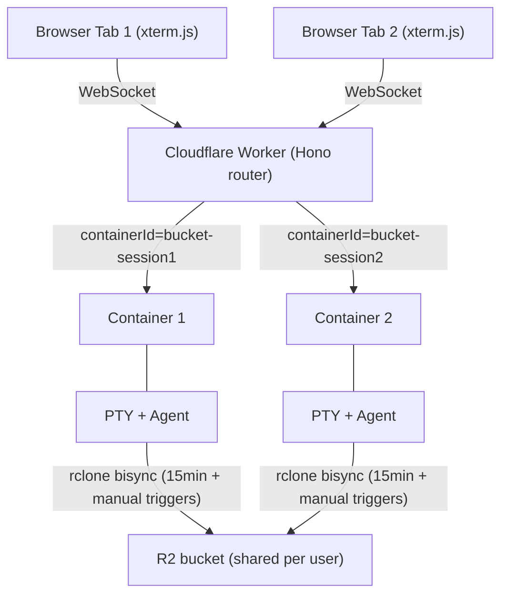
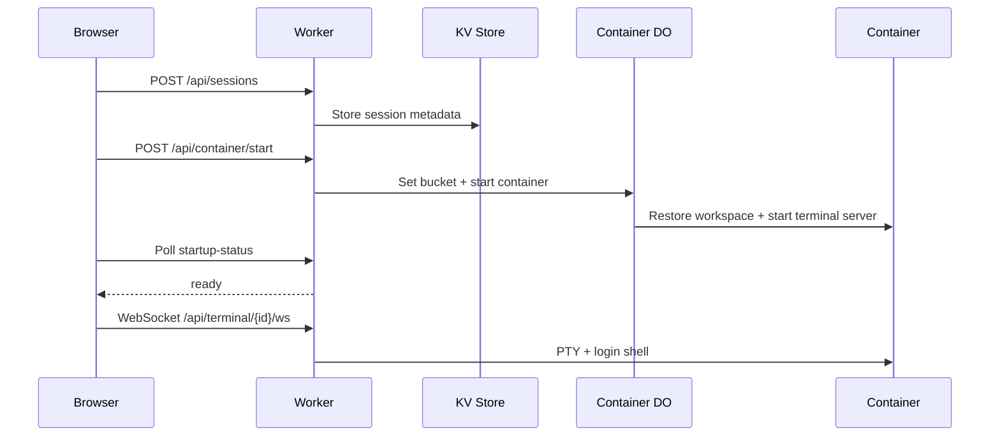
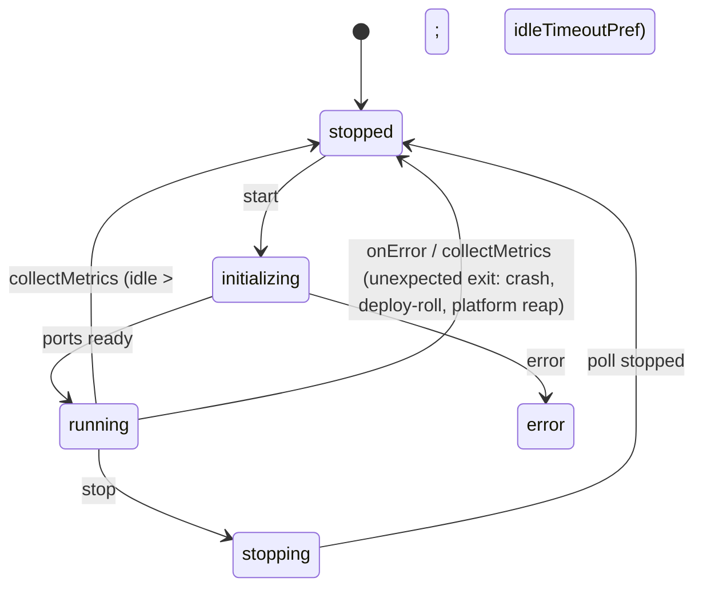
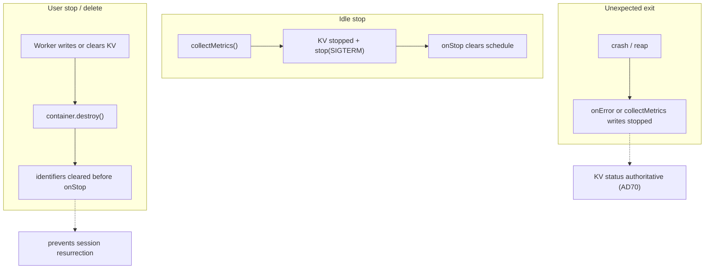
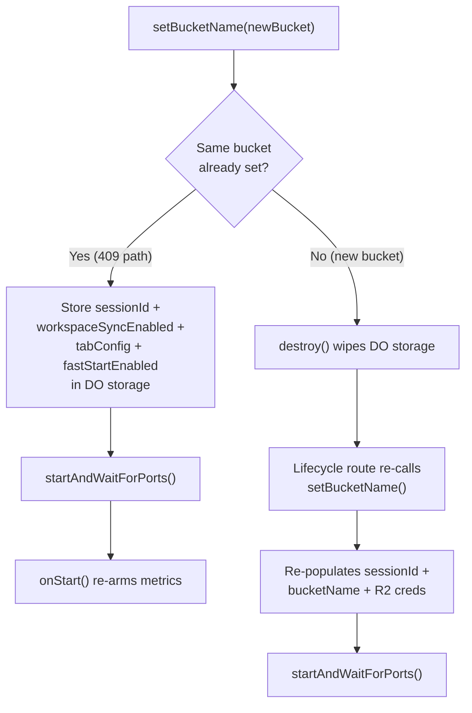
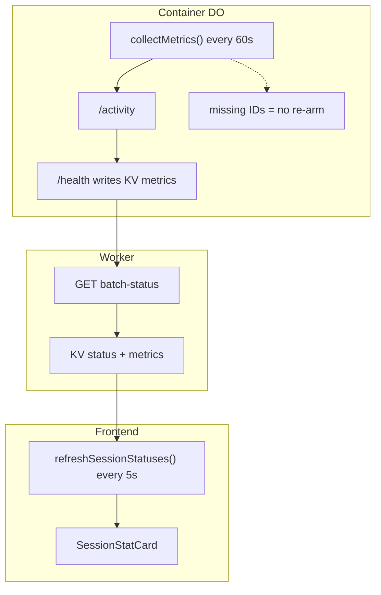
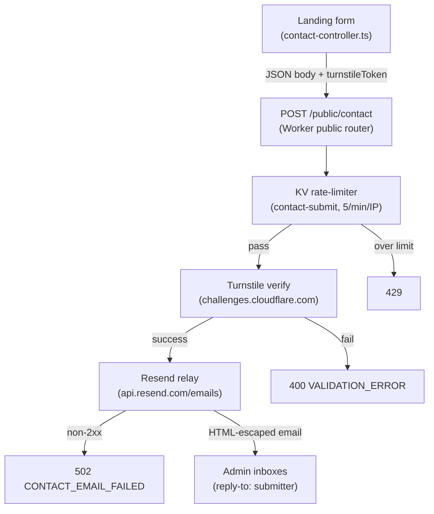
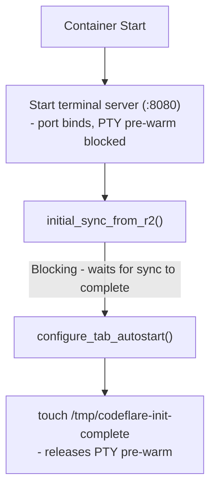

# Architecture

System architecture, components, data flow, and design rationale for Codeflare.

**Audience:** Developers

---

## Contents

- [Architecture Overview](#architecture-overview)
- [System Components](#system-components)
- [Data Flow](#data-flow)
- [Module-Level Caches](#module-level-caches)
- [Design Rationale](#design-rationale)
- [Landing composition implementation](#landing-composition-implementation)
- [Specification Coverage](#specification-coverage)
- [Related Documentation](#related-documentation)
- [Architecture internals reference](#architecture-internals-reference)
- [Architecture internals — Backend Libraries](#architecture-internals-backend-libraries)
- [Architecture internals — Code Structure (Pre-Launch Refactoring)](#architecture-internals-code-structure-pre-launch-refactoring)
- [Architecture internals — Appendix: CF-NNN Code Index](#architecture-internals-appendix-cf-nnn-code-index)
- [Architecture internals — SaaS UI Components](#architecture-internals-saas-ui-components)
- [Billing reference](#billing-reference)
- [Billing — Subscription Tiers](#billing-subscription-tiers)
- [Billing — Stripe Payment Integration](#billing-stripe-payment-integration)
- [Billing — Timekeeper DO (Usage Tracking)](#billing-timekeeper-do-usage-tracking)
- [Billing — Paygate Enforcement](#billing-paygate-enforcement)
- [Billing — Admin Subscription Management](#billing-admin-subscription-management)
- [Billing — Email Notifications](#billing-email-notifications)
- [Container reference](#container-reference)
- [Container — Container Image](#container-container-image)
- [Container — Container Startup](#container-container-startup)
- [Container — Claude Code Integration](#container-claude-code-integration)
- [Container — Graphify](#container-graphify-knowledge-graph-context-req-agent-023)
- [Container — LLM Consultation](#container-llm-consultation)
- [Container — Push & Deploy](#container-push--deploy)
- [Mobile reference](#mobile-reference)
- [Mobile — MultiView Availability](#mobile-multiview-availability)
- [Mobile — Cursor Visibility](#mobile-cursor-visibility)
- [Mobile — Keyboard Management](#mobile-keyboard-management)
- [Mobile — Touch Input](#mobile-touch-input)
- [Mobile — xterm 6.1 Color-Scheme Report Suppression (git: Fix 21)](#mobile-xterm-61-color-scheme-report-suppression-git-fix-21)
- [Mobile — Scroll Stability](#mobile-scroll-stability)
- [Mobile — WebSocket Recovery](#mobile-websocket-recovery)
- [Mobile — Scroll-Stability Integration Test Plan](#mobile-scroll-stability-integration-test-plan)
- [Preseed reference](#preseed-reference)
- [Preseed — Session Modes](#preseed-session-modes)
- [Preseed — Preseed Components](#preseed-preseed-components)
- [Preseed — Preseed Deployment](#preseed-preseed-deployment)
- [Preseed — Multi-Agent Preseed](#preseed-multi-agent-preseed)
- [Preseed — Settings.json Merge](#preseed-settingsjson-merge)
- [Preseed — Plugin Enablement](#preseed-plugin-enablement)
- [Preseed — Third-party plugin: context-mode](#preseed-third-party-plugin-context-mode)
- [Preseed — Graphify](#preseed-graphify-req-agent-023)
- [Preseed — /sdd init Modes](#preseed-sdd-init-modes)
- [Preseed — Troubleshooting](#preseed-troubleshooting)
- [Preseed — Image-baked seed (Governed Mode delta sync)](#preseed-image-baked-seed-governed-mode-delta-sync)
- [Storage and sync reference](#storage-and-sync-reference)
- [Storage and sync — Storage Quota](#storage-and-sync-storage-quota-req-stor-006-req-stor-014)
- [Storage and sync — Why rclone bisync (Not s3fs)](#storage-and-sync-why-rclone-bisync-not-s3fs)
- [Storage and sync — Initial Sync on Startup](#storage-and-sync-initial-sync-on-startup)
- [Storage and sync — What's Synced vs Excluded](#storage-and-sync-whats-synced-vs-excluded-req-stor-011)
- [Storage and sync — rclone Sync Modes](#storage-and-sync-rclone-sync-modes-req-stor-003)
- [Storage and sync — Manual Sync Triggers](#storage-and-sync-manual-sync-triggers-req-stor-015)
- [Storage and sync — Session Transcript Cleanup](#storage-and-sync-session-transcript-cleanup)
- [Storage and sync — Conflict Resolution](#storage-and-sync-conflict-resolution)
- [Storage and sync — Troubleshooting](#storage-and-sync-troubleshooting)
- [Storage and sync — File Browser](#storage-and-sync-file-browser-req-stor-016)
- [Storage and sync — Startup & steady-state sync performance](#storage-and-sync-startup--steady-state-sync-performance)
- [Storage and sync — Governed Mode (R2 SSE-C disabled)](#storage-and-sync-governed-mode-r2-sse-c-disabled)
- [Vault reference](#vault-reference)
- [Vault — Overview](#vault-overview-req-vault-001)
- [Vault — Directory Layout](#vault-directory-layout)
- [Vault — Capture Path](#vault-capture-path-req-vault-002)
- [Vault — User-edit Path](#vault-user-edit-path-req-vault-003)
- [Vault — Unified Global Graph](#vault-unified-global-graph-req-vault-004)
- [Vault — SilverBullet Editor](#vault-silverbullet-editor-req-vault-005)
- [Vault — Vault encryption and IDB lifecycle](#vault-vault-encryption-and-idb-lifecycle-req-vault-008-req-vault-024-req-vault-015-req-vault-021-req-vault-023)
- [Vault — Shutdown Bisync Reliability](#vault-shutdown-bisync-reliability-req-vault-006)
- [Vault — Preseed Integration](#vault-preseed-integration-req-vault-007)
- [Vault — First-session Expectations](#vault-first-session-expectations)
- [Vault — Attachment Cost Caveat](#vault-attachment-cost-caveat-req-vault-011-ac1)
- [Vault — PDF-Ingestion E2E Plan](#vault-pdf-ingestion-e2e-plan-req-vault-011)
- [Vault — Memory Capture System](#vault-memory-capture-system)
- [Vault — Troubleshooting](#vault-troubleshooting)
- [Manual verification checklist](#manual-verification-checklist)

## Architecture Overview

Codeflare runs AI coding agents in isolated containers, one per browser session (tab). All sessions for a user share a single R2 bucket for persistent storage, with periodic bidirectional sync every 15 minutes plus manual triggers from the storage panel and a final sync at shutdown (see [AD56](../decisions/README.md#ad56-15-minute-bisync-cadence-with-manual-triggers)).



**Workers.dev URL:** `https://<CLOUDFLARE_WORKER_NAME>.<ACCOUNT_SUBDOMAIN>.workers.dev` - used only for initial setup. After the setup wizard configures a custom domain, all traffic should go through the custom domain (protected by the configured auth mechanism - CF Access or GitHub OIDC). In CF Access mode, the workers.dev URL should be gated behind one-click Access in the Cloudflare dashboard.

---

## System Components

### Worker (Hono Router)

**File:** `src/index.ts`

Entry point and API gateway. Handles routing, WebSocket upgrade interception, authentication (CF Access JWT or GitHub OIDC session cookies), container lifecycle through Durable Objects, and CORS with configurable allowed origins.

**WebSocket must be intercepted BEFORE Hono routing** (required workaround for CF Workers):
```typescript
// See: https://github.com/cloudflare/workerd/issues/2319
const wsRouteResult = validateWebSocketRoute(request);
if (wsRouteResult.isWebSocketRoute) {
  return handleWebSocketUpgrade(request, env, ctx, wsRouteResult);
}
```

**CORS:** Checks static patterns from `env.ALLOWED_ORIGINS` + dynamic origins from KV (cached in memory). Uses `matchesPattern()` with domain-boundary enforcement (dot-prefixed = suffix match, bare domains = exact or subdomain with dot boundary).

**Route Registration:** `/health`, `/api/health`, `/api/auth`, `/auth`, `/public/auth/providers`, `/api/setup`, `/public`, `/api/user`, `/api/container`, `/api/sessions`, `/api/terminal`, `/api/users`, `/api/storage`, `/api/preferences`, `/api/llm-keys`, `/api/deploy-keys`, `/api/usage`, `/api/admin/tiers`

**Workers Assets Routing Guardrails (`wrangler.toml`):**

With SPA fallback (`not_found_handling = "single-page-application"`), control-plane paths must execute Worker logic first via `run_worker_first = ["/", "/login", "/login/", "/auth/*", "/api/*", "/public/*", "/health", "/landing/*"]`. Missing `/api/*` causes setup/auth flows to break (API endpoints return HTML instead of JSON); missing `/login` makes the onboarding `/login` rewrite ([REQ-AUTH-020](../../sdd/spec/authentication.md#req-auth-020-onboarding-mode-landing-integrated-login-shell)) silently fall through to the SPA because the asset layer serves it at the edge before the Worker runs.

### Container DO (container)

**File:** `src/container/index.ts` - Extends `Container` from `@cloudflare/containers`. Exported from `src/index.ts` as lowercase `container` (matching `wrangler.toml` class_name). `index.ts` is the thin DO class shell; it delegates config (`setBucketName`; and `ensureVaultKey`, now superseded for vault encryption by the HKDF `getVaultEncryptionKey` per [REQ-VAULT-021](../../sdd/spec/vault.md#req-vault-021-bucket-stable-vault-url-and-bucket-derived-key)) to `container-config.ts`, lifecycle hooks (onStart/onStop/alarm) to `container-lifecycle.ts`, internal `/_internal/*` dispatch to `container-router.ts`, and idle enforcement/metrics to `container-metrics.ts`. Together these own the full lifecycle of a single session's container: startup, idle enforcement via `collectMetrics()`, request proxying with auth token injection, and graceful shutdown with a 135-second budget for final bisync. A second DO, `Timekeeper`, is exported from `src/timekeeper/index.ts` for per-user usage tracking.

For Container DO internals including the `collectMetrics()` loop, `destroy()` override, auth token lifecycle, `setBucketName` idempotency, and SDK timer semantics, see [Container](architecture.md#container-reference).

### LlmInterceptor (Enterprise Mode)

**File:** `src/llm-interceptor.ts`

A `WorkerEntrypoint` that transparently proxies agent LLM traffic to the customer's AI Gateway when `ENTERPRISE_MODE=active`. Instantiated per container session by the Container DO via `ctx.container.interceptOutboundHttps` + `ctx.exports`. The interceptor receives every outbound HTTPS connection the container opens to the LLM provider host (`api.openai.com`), strips the placeholder credential injected by `entrypoint.sh`, and forwards to the AI Gateway **REST API** first (`https://api.cloudflare.com/client/v4/accounts/{account_id}/ai/v1/<path>`, authenticated with `Authorization: Bearer <AIG_TOKEN>` using the Workers AI scope, plus a `cf-aig-gateway-id` header).

On a `404` from the REST API (a provider not yet on that surface, e.g. Google/Gemini today), it replays the buffered request to the **deprecated compat path** (`https://gateway.ai.cloudflare.com/v1/{account_id}/{gateway_id}/compat/<path>`, authenticated with `cf-aig-authorization: Bearer <AIG_TOKEN>` using the AI Gateway Run scope).

The 404-fallback is safe because a 404 is a complete error body, not a started stream (no double-billing, no truncation), and it stops firing automatically as Cloudflare migrates providers onto the REST API. The account id and gateway id are parsed from `AIG_GATEWAY_URL`. Only OpenAI-wire-format agents (Copilot, Pi) run in enterprise mode, both via Chat Completions (`/chat/completions`); Pi runs with `reasoning: true` but starts each session at the configured default route's reasoning grade (default `off`), so gpt-5.5 stays tools-only by default (an OpenAI **Responses API** path was evaluated but reverted).

The interceptor maps the agent's slash-free `model` handle to the gateway dynamic route `dynamic/<route>` from the Setup-configured catalog on `/chat/completions` and `/responses` ([REQ-ENTERPRISE-007](../../sdd/spec/enterprise-mode.md#req-enterprise-007-gateway-route-pinning)), failing safe to the default route on an unknown handle; an empty catalog or a non-model-routable body is forwarded unchanged. The catalog + default it enforces are resolved per the session's matched Access groups via the shared `resolveRouteCatalog` core — first matching configured group (in admin-configured order) wins, else the global catalog — the same core the container env fan (`loadEnterpriseRouteConfig`) uses, so the two routing sinks cannot drift ([REQ-ENTERPRISE-013](../../sdd/spec/enterprise-mode.md#req-enterprise-013-per-group-dynamic-routing)). On streaming `/chat/completions` it also normalizes the response stream (see **Streaming normalization** below).

See [AD74](../decisions/README.md#ad74-enterprise-llm-transport-on-the-ai-gateway-rest-api) for the REST transport (it amends [AD72](../decisions/README.md#ad72-outbound-https-interception-over-a-worker-side-llm-proxy-for-enterprise-gateway-routing), whose interception mechanism is unchanged). On the compat replay the interceptor strips OpenAI-only fields (`store`, `prompt_cache_key`) that non-OpenAI providers reject with a 400 (the REST leg keeps them, so OpenAI prompt caching is unaffected).

Per-user attribution is stamped into `cf-aig-metadata` as the IdP-verified `user` email plus one `group_<sanitized>_<hash>=1` tag per matched Cloudflare Access group (the scalar `group` key is dropped), within CF's 5-entry cap (`user` + up to 4 groups, deterministic truncation with a warn), so the customer's gateway analytics attribute usage to the real identity and can branch per-group routing/cost/rate-limit policies via an equals-filter on each `group_*` key.

The key carries a deterministic djb2/base-36 suffix of the original group name (`sanitizeGroupKey`) so lossy `[a-z0-9_]` sanitization can't collide two distinct groups (e.g. `codeflare_admins` → `group_codeflare_admins_150f5d1`); the gateway equals-filter must target that full hashed key, not the bare name. See [Enterprise Access Group Configuration](configuration.md#enterprise-access-group-configuration) for the operator-facing detail.

`ctx.exports` is default-on at the project's compat date (`2026-02-05`). No `enable_ctx_exports` compat flag is needed.

The gateway URL (`AIG_GATEWAY_URL`) and token (`AIG_TOKEN`) live exclusively in the Worker/interceptor environment. They are never forwarded to the container and never appear in any container env var or log. When `ENTERPRISE_MODE` is unset the DO never calls `interceptOutboundHttps`, the interceptor is never instantiated, and the direct-key path is byte-identical to non-enterprise deployments.

### EgressController (Strict Gateway Egress, Enterprise Mode)

**File:** `src/egress-controller.ts` (transport helpers in `src/lib/controller-egress.ts`)

A `WorkerEntrypoint` the Container DO wires as the catch-all (`interceptOutboundHttps('*', controller)`) only when the optional **Strict Gateway Egress** toggle is ON ([REQ-ENTERPRISE-016](../../sdd/spec/enterprise-mode.md#req-enterprise-016-strict-gateway-egress)). Whereas `LlmInterceptor`/`GitHubInterceptor` own specific hosts and stamp the real credential, the `EgressController` is a **transparent proxy** for every other host: it stamps no `Authorization`/`cf-aig-*`/identity header, preserves the caller's `authorization`/`cookie` on the request and `set-cookie` on the response, strips only the eight RFC 7230 hop-by-hop headers, and forwards with `redirect:'manual'` through the Workers VPC `env.EGRESS.fetch` (and from there the customer's Cloudflare Gateway). Its only job is to force otherwise-unintercepted **direct-internet** traffic onto the mandatory Gateway boundary.

It exempts only THIS deployment's own-account destinations via `isAccountScopedDestination(url, accountId)` (`src/lib/controller-egress.ts`, account id from `ctx.props.accountId`), checked **before** the `env.EGRESS` guard: own-account R2 (`<accountId>.r2.cloudflarestorage.com` + vhost form, rclone bisync) and the own-account CF API / Browser Rendering path (`api.cloudflare.com/client/v4/accounts/<accountId>/...`) egress **direct** even when the binding is unbound. Any other account's R2/CF host — and all genuine direct-internet hosts — ride `env.EGRESS`/the Gateway (an absent account id exempts nothing; fail-secure).

Own-account R2 is **re-signed** with the worker-held R2 key (`createR2Client`/aws4fetch, reusing the request's `x-amz-content-sha256` so the body streams unbuffered and SSE-C headers are preserved) at the boundary, so the container carries only a non-secret placeholder R2 key; **WebSocket upgrades** reaching this catch-all are proxied by **bridging a fresh `WebSocketPair`** to the upstream socket (frames/close/error forwarded both ways), not returned as-is. (browser-run's `api.cloudflare.com` Browser Rendering — REST + CDP WS — is claimed ahead of this catch-all by the dedicated **`CloudflareBrowserInterceptor`** ([REQ-BROWSER-008](../../sdd/spec/browser-run.md#req-browser-008-browser-rendering-token-interception-never-in-the-container)), which strips the container's non-secret placeholder and injects the real Browser Rendering token worker-side, account-scoped to the wizard-configured account;

the CF-API/Browser-Rendering passthrough here is a dormant fallback that can only ever carry the placeholder.) `strict` + `accountId` are resolved once by the DO (constructor) and passed via `ctx.props` — no per-request KV read — and a per-op diagnostic debug log (`{h, sc, tx, rs, fMs}`, off by default — `LOG_LEVEL=debug` to enable) makes the routing + worker-side latency observable (temporary, for the R2-speed measurement). See [AD86](../decisions/README.md#ad86-platform-native-cloudflare-primitives-bypass-strict-gateway-egress-only-direct-internet-egress-takes-cf1network) and [AD87](../decisions/README.md#ad87-egresscontroller-re-signs-own-account-r2-container-holds-a-placeholder-key-bridges-websocket-upgrades-and-resolves-strict-via-props).

The toggle is a global admin flag persisted in KV (`SETUP_KEYS.STRICT_EGRESS`, `'active'`/`'inactive'`, default OFF) and resolved by `hasStrictGatewayEgress(env)` = enterprise mode AND KV `=== 'active'` — read from KV **once** at container-start (the `ENTERPRISE_MODE` precedent), not threaded per-session and not re-read per request: the DO resolves it in its constructor into `_strictEgress` and passes `strict` to the `EgressController` via `ctx.props` (the controller fails closed with `503 EGRESS_NOT_CONFIGURED` if the prop is absent/false), and `buildEnvVars` reads the same `_strictEgress` to choose the placeholder vs real R2 key so the wiring and container creds always agree. A transient KV error returns `false` (OFF) so the container still boots rather than failing the start.

The per-host LLM/GitHub registrations co-exist with and take precedence over the `'*'` catch-all (SDK precedence: deniedHosts > per-host > catch-all > allowedHosts > enableInternet), and when strict is ON the `GitHubInterceptor` swaps its single upstream `fetch` to `env.EGRESS.fetch` (GitHub is external; the `LlmInterceptor`'s AI Gateway upstream is platform-native and **always** egresses direct, so it never swaps — see [AD86](../decisions/README.md#ad86-platform-native-cloudflare-primitives-bypass-strict-gateway-egress-only-direct-internet-egress-takes-cf1network)).

The defining property is **fail-closed**: when strict is ON but `env.EGRESS` is unbound, the controller (on direct-internet hosts, incl. any other account's Cloudflare host) and the `GitHubInterceptor` return `503 EGRESS_UNAVAILABLE` and never fall back to global `fetch` — this account's own-account destinations (R2 + account-scoped CF API / Browser Rendering) and the AI Gateway stay exempt and egress direct; the controller additionally rejects SSRF literal-IP targets with `403 EGRESS_TARGET_BLOCKED` before any send. The `[[vpc_networks]]` `EGRESS` binding is enterprise-only — committed commented-out and injected by `deploy.yml` only when `ENTERPRISE_MODE=active` — so on non-enterprise deploys OFF + unbound is inert. See [Strict Gateway Egress](#strict-gateway-egress) for the data flow, [Security](security.md#strict-gateway-egress-enterprise-mode) for the boundary properties, and [AD85](../decisions/README.md#ad85-controller-mediated-cloudflare-gateway-egress-as-a-mandatory-web-boundary-wizard-toggled-default-off).

### CloudflareBrowserInterceptor (non-enterprise OAuth mode)

**File:** `src/cloudflare-browser-interceptor.ts` (wired in `src/container/index.ts::wireCloudflareApiInterception`).

The same `WorkerEntrypoint` that injects the enterprise Browser Rendering token ([REQ-BROWSER-008](../../sdd/spec/browser-run.md#req-browser-008-browser-rendering-token-interception-never-in-the-container)) serves a **second mode** for **non-enterprise Connect-to-Cloudflare OAuth** sessions ([REQ-AGENT-078](../../sdd/spec/agents.md#req-agent-078-cloudflare-oauth-token-refreshed-at-the-apicloudflarecom-boundary)). Because a dashboard OAuth access token is short-lived and nothing can refresh an env var inside a running container, the container is given only the non-secret placeholder `codeflare-oauth`, and this interceptor is wired for `api.cloudflare.com` to re-stamp **every** request (all paths — the OAuth token is full-scope) with a token freshly minted by `getValidCloudflareToken(bucket)` (refreshed via the stored per-user `refresh_token`).

Both the REST surface (`wrangler`) and the CDP WebSocket upgrade (browser-run) ride the interceptor's existing `relay()`/`bridge()` transport, so a session outlives the access-token TTL. The token is resolved solely from the session-bound `props.bucket` (never a request header) and the interceptor fails closed `401` with no upstream when no valid token can be minted.

The OAuth mode also intercepts the AI Gateway data-plane host `gateway.ai.cloudflare.com` (stamped as `cf-aig-authorization`, [REQ-AGENT-078](../../sdd/spec/agents.md#req-agent-078-cloudflare-oauth-token-refreshed-at-the-apicloudflarecom-boundary) AC5). The platform TLS-terminates both intercepted hosts with a mounted intercept CA (`/etc/cloudflare/certs/cloudflare-containers-ca.crt`); `entrypoint.sh` trusts it for the container's agent runtimes (Node/wrangler/curl) in a non-enterprise-only block gated on `ENTERPRISE_MODE != active` + CA-presence (AC6), separate from the enterprise CA-trust.

`wireCloudflareApiInterception` is double-guarded — it acts only when `!isEnterpriseMode(env)` **and** the container's `CLOUDFLARE_API_TOKEN` equals the OAuth placeholder (distinct from the enterprise `codeflare-enterprise` value) — so it can never wire or collide on `api.cloudflare.com` in enterprise, and the enterprise branch above is unchanged. The GitHub interceptor is not involved: non-enterprise git stays direct (GitHub tokens are long-lived). See [AD93](../decisions/README.md#ad93-refresh-the-non-enterprise-cloudflare-oauth-token-at-the-apicloudflarecom-boundary-reusing-the-browser-interceptor).

### GitHub Integration

A GitHub panel sits beside the R2 storage panel: a connected user browses and clones their repos, and the in-session agent acts with the user's own GitHub permissions. The panel renders whenever GitHub is enabled — there is no session-tier gate — and GitHub leads as the default right-column face on every session ([REQ-GITHUB-007](../../sdd/spec/github.md#req-github-007-broaden-the-panel-gate-beyond-enterprise)).

**Components:**

- **Routes** `src/routes/github.ts` - `/api/github/status|repos|connect|disconnect|clone`, plus the OAuth callback `src/routes/github-auth.ts`.
- **Token store + provider seam** `src/lib/github-token.ts` - `getGithubProvider`, `getValidGithubToken`, `connectGithub`, `disconnectGithub`, backed by the **existing** deploy-keys KV entry `DeployKeys.githubToken` (no new KV key), encrypted via `kv-crypto`.
- **Enterprise interceptor** `src/github-interceptor.ts` - the `GitHubInterceptor` WorkerEntrypoint, wired in `src/container/index.ts` (`wireGithubInterception`).
- **Container env** `src/container/container-env.ts` (`buildEnvVars`) and `entrypoint.sh` (clone-on-start); host `host/src/git-clone.ts` + `host/src/server.ts` (`/internal/git-clone`).
- **Frontend** `web-ui/src/components/github/` (panel, repo list, ClonePicker) + `web-ui/src/api/github.ts`.
- **Repository list UX**

    `web-ui/src/components/github/RepoList.tsx` and `web-ui/src/styles/github-panel.css` render no-repos/search-empty states and present repos inside an anchoring split with Storage: GitHub is pinned to the top, Storage to the bottom; the shorter panel shrinks to its content while the taller absorbs the slack, meeting at 50/50 when both are full ([REQ-GITHUB-009](../../sdd/spec/github.md#req-github-009-github-repository-list-viewport-and-empty-states)).
- **Adaptive split / face switching**

    `web-ui/src/components/Dashboard.tsx` (`effectiveFace` + `decidePanelLayoutMode` in `web-ui/src/lib/panel-allocation.ts`) and `web-ui/src/components/github/GitHubPanel.tsx` run the GitHub+Storage split on desktop/tablet and swap to a single face with a flip control when the viewport is narrower than the mobile breakpoint or the column is too short for both panels (the narrow check reads the viewport width, not the column's own width, which the layout caps small). GitHub leads — it is the default face on every enabled session — and Storage becomes the sole face only when GitHub is disabled ([REQ-GITHUB-010](../../sdd/spec/github.md#req-github-010-mobile-github-and-storage-face-switching)).

On desktop/tablet the panel expands to 80vh (centered, via `.dashboard-panel:not(--expanded)` in `web-ui/src/styles/dashboard.css`) and the two faces stack as a JS-measured anchoring split: `measureLayout`/`measureNatural` in `Dashboard.tsx` measure each face's natural height (panel chrome + the scroller's `scrollHeight`, with the cap removed), re-run on a ResizeObserver/MutationObserver, and write it as an inline `max-height`; the faces are `flex: 1 1 0` capped at that measured height with `justify-content: space-between`, so GitHub anchors to the top and Storage to the bottom — a short panel sits at its content while the larger one absorbs the slack, both meeting at 50/50 when full.

`panel-allocation.ts` only decides split-vs-flip; the per-face allocation is the flex engine's, fed by those measured caps.

    In single-panel (flip / mobile) mode the panel is content-sized and centered, and the active face sizes to its content up to one shared viewport cap (`max-height: 75vh` for both faces — mobile shows a single flip face at a time, so GitHub and Storage cap identically and flipping never resizes the panel; overflow scrolls inside `.github-repo-rows`/`.storage-drop-zone`), so a short panel — the connect card or a few repos — collapses instead of reserving the column ([REQ-GITHUB-010 AC7](../../sdd/spec/github.md#req-github-010-mobile-github-and-storage-face-switching)).
- **Search disclosure**

    on every breakpoint `GitHubPanel` hides the repo search behind a magnify toggle in `ConnectedHeader` (left of Refresh) so the list keeps its full whole-row viewport; revealing it focuses the input synchronously in the tap/click handler (so the on-screen keyboard opens on touch), and closing it clears the filter. Touch additionally runs `scrollFieldAboveKeyboard` (`web-ui/src/lib/mobile.ts`) to scroll the input above the keyboard via `visualViewport`. There is no longer an always-on desktop search bar ([REQ-GITHUB-011](../../sdd/spec/github.md#req-github-011-mobile-search-disclosure-with-autofocus)).

**Two credential transports** (the core architectural decision, [AD81](../decisions/README.md#ad81-reuse-the-container-egress-injection-layer-for-per-user-github-tokens)):

- **Enterprise (egress injection):**

    The container holds only a non-secret placeholder `GH_TOKEN` (`codeflare-enterprise`). `interceptedGithubHosts(env)` registers `github.com` + `api.github.com` + Copilot's remote GitHub MCP host `api.githubcopilot.com` (overridable via `GITHUB_HOST` / `GITHUB_API_HOST` / `GITHUB_COPILOT_MCP_HOST`) for outbound-HTTPS interception, **reusing the same AI-Gateway `interceptOutboundHttps` layer** as the LLM path. On each request the `GitHubInterceptor` looks up and decrypts the user's token (scoped solely by the wiring-time `props.bucket` binding), strips client auth, and stamps git Basic (`x-access-token:token`) for the web host, `Bearer` + `X-GitHub-Api-Version` for the API host, or `Bearer` (no API-version header) for Copilot's `api.githubcopilot.com/mcp` — without which Copilot CLI's built-in `github-mcp-server` rides the strict-egress catch-all to the Gateway unauthenticated and its handshake fails; it **fails closed** when no token is present.

    AI hosts continue to route to the LLM interceptor - one host→interceptor map, two WorkerEntrypoints, one responsibility each ([REQ-GITHUB-003](../../sdd/spec/github.md#req-github-003-enterprise-egress-injected-github-credentials)). Wired only when `ENTERPRISE_MODE=active`, at container start (CA-mount timing).
- **Non-enterprise (container transport):** The real token flows to the container as `GH_TOKEN` via the existing deploy-keys→env path, unchanged ([REQ-GITHUB-006](../../sdd/spec/github.md#req-github-006-other-mode-container-transport)).

### Terminal Server (node-pty)

**File:** `host/src/server.ts` - Node.js/TypeScript server inside the container. Single port 8080 for WebSocket + REST + health/metrics.

Sync handled entirely by `entrypoint.sh` (15-minute daemon, SIGUSR1-interruptible for manual triggers). Terminal server reads sync status from `/tmp/sync-status.json` and exposes via `/health`. The user-facing manual trigger surface is the Worker route `POST /api/sessions/sync`, which fans out per-session to each of the user's running containers; the per-container host endpoint it reaches is `POST /internal/bisync-trigger`, which reads `/tmp/sync-daemon.pid` and sends SIGUSR1 to the daemon. See [AD56](../decisions/README.md#ad56-15-minute-bisync-cadence-with-manual-triggers) and [REQ-STOR-015](../../sdd/spec/storage.md#req-stor-015-explicit-sync-trigger-from-ui). Activity tracking (WebSocket connection state + user input timestamps: `hasActiveConnections`, `connectedClients`, `activeSessions`, `disconnectedForMs`, `lastInputAt`) for hibernation decisions via `GET /activity`. Unknown JSON `type` strings are silently ignored (guard against future message types leaking to PTY).

**Auth-Exempt Paths:** The terminal server validates `Authorization: Bearer <token>` on all HTTP requests. `/health` and `/activity` are in the `authExemptPaths` Set at `host/src/server.ts` because `collectMetrics()` calls them directly via `ctx.container.getTcpPort(TERMINAL_SERVER_PORT).fetch(...)` from inside the DO class - that path enters the container over the SDK's private TCP plumbing and never runs through the public `fetch()` override, so no `Authorization` header is injected. The whitelist is safe because these two paths expose no user data and no mutable container state. The `/activity` endpoint is also exempted from auth in the DO-level `fetch()` override so internal health checks don't require token injection.

**`GET /activity` Endpoint:** Returns `{ hasActiveConnections: boolean, connectedClients: number, activeSessions: number, disconnectedForMs: number | null, lastInputAt: number | null }`. Consumed exclusively by the Container DO's `collectMetrics()` poll. Active connections = WebSocket clients currently connected. `disconnectedForMs` tracks time since all clients disconnected (null while clients are connected). `lastInputAt` is the Unix timestamp (ms) of the last real user input - determined by `containsUserInput()` after `stripTerminalResponses()` removes terminal protocol chatter (CPR, OSC, DA). This is the authoritative signal for codeflare's "user has walked away" idle policy.

**Idle Detection (Single Source of Truth):** Idle hibernation is enforced exclusively by `collectMetrics()`, which polls `/activity` every 60 s and computes `idleMs = Date.now() - (lastInputAt ?? containerStartedAt)`. When this exceeds `parseSleepAfterMs(idleTimeoutPref)`, it writes KV status `'stopped'` and calls `this.stop('SIGTERM')` directly. See [REQ-SESSION-004](../../sdd/spec/session-lifecycle.md#req-session-004-idle-containers-sleep-after-configurable-timeout) / [REQ-SESSION-005](../../sdd/spec/session-lifecycle.md#req-session-005-input-based-idle-detection). A secondary per-PTY reaper in `host/src/server.ts` (`PTY_KEEPALIVE_MS`, default 240 min / 4h) acts as a safety net if `lastInputAt` tracking gets stuck. It is floor-clamped at the maximum `sleepAfter` so it cannot fire before the authoritative `collectMetrics` path. See [AD47](../decisions/README.md#ad47-pty-keepalive-as-safety-net-only-not-the-idle-policy).

The SDK's `sleepAfter` timer is intentionally disabled - it's pinned to `'24h'` so it never fires in normal operation. This is necessary because `@cloudflare/containers` v0.2.x refreshes the SDK timer on every WebSocket message in both directions, which would give "any traffic" semantics (containers running `tail -f` or `yes` would never sleep even after the user walks away). Codeflare needs "no user input" semantics, which only an in-container PTY tracker (the terminal server's `lastInputAt`) can provide.

The `containerStartedAt` fallback is critical: if a user opens a terminal but never types, `lastInputAt` stays `null`. Without the fallback, the idle check would be skipped and the container would run forever. With the fallback, idle time is measured from container start, so an unused terminal still stops after the configured timeout.

`containsUserInput()` in `host/src/session.ts` uses a whitelist approach - only actual keypresses count (printable characters, control keys, arrow keys, function keys, Alt+key, mouse clicks). Terminal protocol responses (CSI, OSC, DCS, APC, focus reports, mouse movement) do not count. `stripTerminalResponses()` removes terminal emulator response sequences (CPR, OSC 10/11/12, DA1) before writing to the PTY. Scenarios: user stops typing → container stops after `sleepAfter` + up to 60s (poll granularity); browser closed → same; user opens terminal but never types → container stops after `sleepAfter` from start time.

**Timestamp taxonomy (four distinct timestamps, often confused):**

| Field | Source / owner | Advances on | Used for |
| --- | --- | --- | --- |
| `lastInputAt` | terminal server `/activity` (`host/src/session.ts`) | PTY **keystrokes only** - not output, not WS traffic, not vault/SB activity, not autonomous-agent output | The idle reference for `collectMetrics`. A long agent run with no keystrokes looks "idle". |
| `lastSeenInputAt` | Container DO in-memory cache of the last non-null `lastInputAt` | New keystroke observed by the poll | Surviving a poll where `/activity` momentarily returns `null`. |
| `lastActiveAt` | KV session record (written by `updateKvStatus`) | Input-driven status writes + the sleep-timer path | Dashboard "last active" display; persisted across hibernation. |
| `metrics.updatedAt` (`m.u` in list metadata) | `collectMetrics` heartbeat | **Wall-clock, every tick**, regardless of input | Metrics-staleness display **only**. **Not** a liveness signal - it freezes when the alarm loop is not running (hibernation). A heartbeat-age heuristic over this field previously caused false "stopped" kicks; removed in [codeflare#153](https://github.com/nikolanovoselec/codeflare/issues/153). Liveness comes from the authoritative KV `status`. |

**WebSocket Wake-Loop Prevention:** Three layers prevent browser auto-reconnect from waking a hibernated container in an infinite stop/start cycle:
1. **DO fetch gate** (`container/index.ts`): The `fetch()` override returns 503 for non-internal routes while the container is stopped.

   The DO reads container state directly, avoiding KV, and does not call the SDK path that starts a stopped container.
2. **Terminal route guard** (`routes/terminal.ts`): Rejects WebSocket upgrade requests with 503 when `session.status === 'stopped'` in KV. This is defense-in-depth - catches requests before they reach the DO.
3. **Frontend disposal** (`stores/session.ts`): The session poller disposes terminal state on a running-to-stopped transition, ending that session's WebSocket retry loops.

   A fresh connection starts only after the user explicitly restarts the session.

**WebSocket Protocol:** Raw terminal data (NOT JSON-wrapped). Control messages (resize, focus ownership, process-name, restore) as JSON. No application-level ping/pong -- Cloudflare handles protocol-level WebSocket keepalive for DO/Container connections. Headless terminal (xterm SerializeAddon) captures full state for reconnection.

**Resize Authority:** A PTY can have multiple browser WebSocket clients, but only the foreground owner is allowed to apply resize frames. The first client owns resize by default; a focused terminal sends a `focus` control frame before its resize frame; a pane that loses focus before its WebSocket opens clears the queued focus claim. When the owner detaches, authority falls back to the remaining client. This prevents stale hidden clients from shrinking a shared PTY back to old dimensions. <!-- @impl: host/src/session.ts::claimResizeAuthority --> <!-- @impl: host/src/session.ts::resize --> <!-- @impl: host/src/session.ts::detach --> <!-- @impl: web-ui/src/stores/terminal.ts::claimResizeAuthority --> <!-- @impl: web-ui/src/stores/terminal.ts::clearPendingResizeAuthority -->

**PTY:** Spawns `bash -l` (login shell for .bashrc) with `xterm-256color`, truecolor support.

**Terminal emulator response stripping:** `stripTerminalResponses()` in `host/src/session.ts` strips terminal emulator responses (CPR, OSC 10/11/12, DA1) from WebSocket input before writing to the PTY. These responses are generated by xterm.js in reply to terminal queries issued by CLI tools (e.g., `gh secret set` reads an OSC 11 response as the secret value). `containsUserInput()` then classifies the original data using a whitelist approach: printable characters, control keys (Enter, Backspace, Tab, Ctrl+key), arrow keys, function keys, Alt+key, and mouse clicks count as user input for idle detection. Terminal protocol chatter (CSI/OSC/DCS/APC sequences, focus reports, mouse movement/release) does not count. The `Session.write()` method calls both: PTY receives the filtered data, and `activityTracker.recordInput()` is called only when `containsUserInput()` returns true.

### Landing (Astro, prerendered)

**Directory:** `landing/`

The public enterprise marketing site ([REQ-LANDING-001](../../sdd/spec/landing.md#req-landing-001-mode-aware-public-landing-serving)). Builds to static HTML in `web-ui/dist/landing/` (base path `/landing`), so the existing `[assets]` binding serves it with no extra deployment. The Worker long-caches the content-hashed `/_astro/` build assets (`Cache-Control: public, max-age=31536000, immutable`) while HTML keeps its revalidating default, and both the landing layout and the SPA shell declare `color-scheme: dark` with an inline root paint so cross-document navigations (landing ↔ `/login`) never flash a white canvas ([REQ-LANDING-004](../../sdd/spec/landing.md#req-landing-004-first-paint-stability-and-immutable-asset-caching)).

The landing also opts every same-origin full-page navigation into a cross-document view transition (`@view-transition { navigation: auto }` in `landing/src/styles/global.css`), so the browser holds the current page during the document swap and Chromium-fork browsers (Vivaldi/Arc/Brave) never expose their gray navigation canvas ([REQ-LANDING-004](../../sdd/spec/landing.md#req-landing-004-first-paint-stability-and-immutable-asset-caching) AC3).

Directly under the primary hero, the landing renders a second hero band (`#inference-mesh`), a `<header>` that mirrors the primary hero rather than a `main > section`, positioning the mesh as one optional additional inference source Codeflare can pull from — reusing the idle machines a company already owns for private, low-cost inference — not its only or default inference path, since every hosted provider stays first-class as default or fallback.

The band is anchored as a sibling hero by a plain white `Inference Mesh` section-h2 (no coral flare, no scramble) under a right-aligned `~/inference` path-tag chiplet (the shared `.kicker`), both right-aligned on desktop to mirror the left proof terminal, and its call to action is the shared `.micro-cta` text link (`MicroCta.astro`) rather than a filled button.

It reuses the landing's static Astro composition and the shared Terminal/Transcript proof chrome — a concrete `codeflare-mesh` inference call whose bottom command line runs the shared typed reel (`data-ft-loop`) — rather than a new route or a new animation. ([REQ-LANDING-005](../../sdd/spec/landing.md#req-landing-005-inference-mesh-family-hero))

After the `#platform` section, a dedicated `#ide` band ([REQ-LANDING-007](../../sdd/spec/landing.md#req-landing-007-browser-ide-continuity-band)) presents the per-session Browser IDE as the bridge from the traditional SDLC to agentic development: the full VS Code workbench built on the shared `<Terminal>` chrome (`CodeEditor.astro`, content from `IDE`). The body slot is a three-column workbench (an activity rail, an explorer file tree, and an editor whose CSS-counter-numbered code pane sits over an integrated terminal); the editor tab (plus unsaved-change dot) rides `bar`; the status bar rides `foot`.

It fills the width on desktop and folds the rail and explorer away on narrow viewports, and the integrated terminal streams the agent's activity via the shared typed reel (`feature-terminals.ts`) in the page's one locked coral accent, never VS Code blue.

The Worker rewrites unauthenticated `GET /` to `/landing/` in SaaS and onboarding modes; default mode keeps the `/app/` redirect, and a missing landing build falls back to the SPA via `not_found_handling`.

In onboarding mode (`ONBOARDING_LANDING_PAGE` active, `SAAS_MODE` not active) the Worker also rewrites `GET /login` to the landing-built sign-in page at `/landing/login/` ([REQ-AUTH-020](../../sdd/spec/authentication.md#req-auth-020-onboarding-mode-landing-integrated-login-shell)) so onboarding sign-in shares the landing tokens, fonts, and nav chrome while staying visually quiet: it preloads the shared fonts, uses a static flare motif, and omits the marketing page's WebGL/motion/proof hooks for a stable first paint; SaaS mode keeps the SPA `/login` provider chooser unchanged. Layered internally: design tokens (`landing/src/styles/tokens.css`) → global CSS → typed content (`landing/src/content/site.ts`) → markup components → pages.

The hero terminal and all content render statically (no JS); browser logic is enhancement-only and opted into by the marketing page rather than by every `BaseLayout` consumer: the unit-tested contact controller (`contact-controller.ts`) with a thin DOM adapter, plus presentational scroll-reveals, the hero top-line capability ticker (`hero-kicker.ts`, advancing the active word and measuring its width while the server markup already contains the full stack), a reduced-motion-safe scramble on the single hero accent word (`scramble.ts`),

and a cursor- and scroll-reactive WebGL flare-fluid behind the whole page (`splash.ts` + the `splash-*` / `webgl-utils` fluid set: a fixed full-page layer, vivid behind the hero and veiled to a legible wash below, paused while the tab is hidden; `html.flare-on` is rendered by the layout before first paint so splash startup never flips page-wide visual classes — desktop pointers drive it with the cursor, touch devices drive it from the finger position during an active swipe (the scroll sweep is suppressed while a finger is down) and from page scroll when no finger is touching, and reduced-motion or no-WebGL visitors simply get no canvas),

and `proof.ts` (adds `.is-live` to each `[data-proof]` artifact once on scroll-in to play a one-shot reveal sequence; the markup ships the resolved final state, so the body's proof artifacts stay fully legible with no JS), and `agentfoot.ts` (a calm coding-agent statusline foot on the hero terminal: a slow context-percent tick and an occasional compaction beat, with the server-rendered foot as the reduced-motion and no-JS fallback), and `feature-terminals.ts` (drives the typing-loop animation on every `[data-ft-loop]` element with a `[data-ft-typed]` child: the feature-terminal grid in the shift section and the hero terminal's bottom command line, each typing a short command, holding, deleting,

and looping to the next with staggered starts so the terminals are never in sync; the server-rendered first command plus the CSS caret blink is the reduced-motion and no-JS fallback), none of which gate content. The shift section (`id="shift"`) presents a feature-terminal grid: four `FeatureTerminals` tiles, each showing a live-typed agent command (`feature-terminals.ts`) with a tile title, command lines, and a caption foot.

The spine-run-bound artifacts (the self-healing enforcement gate, the egress-inspection strip, the parallel review board, and the cost ledger) are keyed to one example run (the `SPINE` constant) sourced once in `site.ts` so their IDs cannot drift; the security boundary and the one egress call are folded into one merged terminal (`id="security"`, `.gate.boundary`): the boundary rows (each an actor, a `state` of `pass` or `deny` rendered as an `is-pass` / `is-deny` class, and descriptive text,

with at least one approved path and one the architecture makes impossible) roll in, a left-aligned `.gate-echo` command echo issues the one outbound model call (`EGRESS.call`) above a thin in-terminal divider, the egress rows render beneath and animate (roll, via `data-roll`) like the boundary rows above, keeping the `is-redact` DLP amber beat, and a single in-chrome foot closes the receipt (the AI Gateway is named as the egress control).

A legacy-rescue section (`id="legacy"`) sits between method and operations, its standard section head (terminal-path tag + h2 + lead) and narrative terminal paired as a `.split-band` (copy beside the terminal, single column on mobile and side by side from 820px) so the terminal fills its column instead of a dead right gutter, showing `/sdd init` reverse-engineering a legacy codebase into a spec-driven baseline and `/sdd clean` realigning a drifted spec.

Every top-level section opens the same way (a terminal-path tag `~/<name>` via `SECTION_KICKERS` / `.kicker`, rendered mono and lowercase with a CSS `~/` accent prefix, then the h2 and lead at full width), so sections read as calm peers in document order, cued by that per-section tag (the structural replacement for the removed numbered spine and the earlier uppercase eyebrow;

the five nav-pillar sections reuse their pillar word) and the alternating `--alt` section backgrounds rather than a counter, with the secondary bands (e2e, tenancy, runs-everywhere, trusted-by) folded into their parent section as subordinate `.substation` sub-content (a nested terminal-path tag like `~/platform/runs-everywhere` above an `--fs-subhead` sub-head) so nothing floats; the operations section (`id="operations"`) is a top-level peer placed directly before security, presenting the "operate" surface of the Directed Execution Model as a governed infrastructure run in the security gate grammar (Zero-Trust-scoped reach, operator-approved plan, out-of-scope paths denied);

in the context section (`id="context"`) the browser-isolation web fetch and the agent-steered e2e each render as a `.split-band` (copy beside the proof terminal, single column on mobile and side by side from 820px, so the narrow-content terminals fill their column), the e2e introduced by a `.substation` sub-head. The dogfood section (`id="dogfood"`) is a self-referential proof: it presents this landing page as REQ-LANDING-001 built via the SDD workflow (real `@impl`/`@test` anchors, Status: Implemented, an illustrative shipping PR), and its CTA is the page's only link to the public repository (`GITHUB_URL`) for source verification.

A Sign in action in the nav links to the SPA login provider-chooser (`/login`, `APP_LINKS.signIn`); the footer is reduced to a single centered "Built with Codeflare" line (no logo, nav links, Sign in, or GitHub mark); `/app/` is not used because the SPA guard redirects an unauthenticated visitor back to the landing before the login UI renders.

Discoverability documents (REQ-LANDING-003) are served by the Worker at the deployment root before the setup gate, mode-aware: in a public mode (SaaS or onboarding) `robots.txt` (built in `src/lib/seo.ts`) advertises the marketing surface and points at `sitemap.xml` + an `llms.txt` product summary at the canonical origin; a private (default/enterprise) deployment returns a disallow-all `robots.txt` and 404s the sitemap/llms. The landing also emits a schema.org JSON-LD graph (Organization + WebSite + a home-page SoftwareApplication) and the OG/Twitter card points at the brand image at `/og.png`. See `landing/README.md`.

### Frontend (SolidJS + xterm.js)

**Directory:** `web-ui/`

Key files: `App.tsx` (root), `Terminal.tsx` (xterm.js), `TerminalTabs.tsx`, `TerminalArea.tsx` (renders only visible workspace panes), `TerminalGrid.tsx` (shared tiled pane grid), `Layout.tsx` (orchestrates dashboard/terminal workspaces, manages WS disconnect/reconnect lifecycle), `SessionStatCard.tsx` (real-session Dashboard card with three-color status dot and metrics), `StorageBrowser.tsx` (R2 browser with toolbar), `StoragePanel.tsx` (slide-in drawer), `SettingsPanel.tsx`, `Dashboard.tsx` (new-session button plus icon-only MultiView reopen action), `SessionDropdown.tsx` (session + MultiView selection), `OnboardingLanding.tsx`, `OnboardingPage.tsx` (guided setup), `SubscribePage.tsx` (subscription flow), `UsagePage.tsx` (usage dashboard), `LoginPage.tsx` (SaaS login), `Header.tsx` (nav + user dropdown + inline usage), `KittScanner.tsx`.

Stores: `terminal-workspace.ts` (active workspace and visible pane ownership: dashboard, single session, or `MultiView #1`), `terminal.ts` (WebSocket state, compound key `sessionId:terminalId`, scheduled disconnect/reconnect), `terminal-url-detection.ts` (URL detection signals for floating buttons), `terminal-layout.ts` (terminal layout state), `session.ts` (CRUD, `terminalsPerSession`, `stopSession()` sets `'stopping'` and polls, `refreshSessionStatuses()` for lightweight dashboard polling - also updates storage stats from batch-status via `updateStatsFromBatch()`; mirrors `enterpriseMode` and `saasMode` from `/api/user` via `App.tsx`), `storage.ts` (R2 operations), `setup.ts`, `tiling.ts` (per-session tiled tab layout), `session-tabs.ts` (tab configuration).

**Accent theming:** `settings.ts` exposes `applyAccentColor(hex)`, which writes `--accent-hue` / `--accent-s` / `--accent-l` (HSL decomposition) plus `--color-accent-contrast` (the foreground for accent-filled controls, derived by a YIQ-brightness helper `accentContrast`: warm near-black `#160a06` on bright accents, near-white `#fafafa` on dark ones). The default accent is the brand coral `#ff5c3c` (`DEFAULT_ACCENT_HEX` in `AppearanceSection.tsx`, HSL default in `design-tokens.css`), so the app matches the landing / login / OG; `--color-accent-contrast` is the text color of the New Session button, the shared primary `Button`, and the accent controls in the header, settings, storage, file-preview, onboarding, and setup styles (it resolves to white for a dark accent, so it is inert there).

**Dashboard tips:** `TipsRotator.tsx` rotates usage tips filtered by device (mobile / desktop / general) and by mode: tips flagged `saasOnly` (e.g. Pro mode, metered usage) are hidden unless `sessionStore.saasMode` is set, so onboarding / enterprise / default deployments never advertise features they do not have.

#### Visible Terminal Workspace and MultiView

The frontend implements [REQ-TERM-011](../../sdd/spec/terminal.md#req-term-011-visible-terminal-panes-own-websocket-connections), [REQ-TERM-012](../../sdd/spec/terminal.md#req-term-012-multiview-virtual-session-workspace), and [REQ-TERM-013](../../sdd/spec/terminal.md#req-term-013-multiview-selection-flow) by separating **running**, **visible**, **connected**, and **focused** terminal state. `terminal-workspace.ts` is the source of truth for visible workspace panes: Dashboard has zero panes, a real session has one active workspace pane plus any currently visible tiled tabs, and `MultiView #1` has one pane per selected member session. `TerminalArea.tsx` renders only those visible surfaces, so hidden running sessions do not mount xterm instances, open WebSockets, send resize frames, forward input, or participate in URL detection.

URL detection is focused-pane-owned under [REQ-TERM-015](../../sdd/spec/terminal.md#req-term-015-focused-pane-owns-url-detection), so cleanup from a previously focused pane cannot clear the current pane's detected URL.

MultiView open, close, dashboard return, and session selection transitions are owned by `Layout.tsx`; leaf controls create/update the saved MultiView selection and delegate navigation to Layout. Terminal WebSocket connections carry owner tokens, so cleanup from a stale mount cannot close a newer WebSocket or input handler for the same `(sessionId, terminalId)`. This pane-ownership and virtual-MultiView model is recorded in [AD82](../decisions/README.md#ad82-visible-terminal-panes-own-websockets-and-multiview-is-virtual).

`MultiView #1` is a virtual frontend workspace, not a backend session. It is persisted only in browser storage, validates membership against currently running or initializing sessions, accepts two to four members on desktop, exactly two on tablet, and is hidden on mobile while preserving saved membership. It appears in the session switcher as `Launch MultiView`; on Dashboard it never renders as a session card and is reopened through the icon-only action beside `+ New Session` when saved panes exist. It is never sent to session lifecycle, quota, storage, metrics, or terminal-route APIs.

#### Dashboard WS Disconnect Flow

When user navigates to dashboard, `Layout.tsx` calls `scheduleDisconnect(DASHBOARD_WS_DISCONNECT_DELAY_MS)` (60s grace period). After the grace period, `disconnectAll()` closes all WS connections with reason `'dashboard-disconnect'`. Container can then idle to `sleepAfter` (user-configurable, default 30m for paying users, 15m for free tier). When user returns to terminal view, `cancelScheduledDisconnect()` cancels any pending timer, then visibility-return reconnect receives the exact visible terminal keys: current workspace panes plus visible tiled tabs for the active single-session workspace.

**Tab Visibility Auto-Refresh:** `Layout.tsx` listens for `visibilitychange` events. When the tab returns from background (mobile browser tab switch, screen off/on), it auto-refreshes session statuses and storage listing. This prevents stale "Failed to fetch" errors that appear when background tabs have their network requests aborted by the browser. Storage refresh is silent (no loading spinner) to avoid UI flicker.

**Session Status Architecture:** KV polling (every 5s via batch-status) is the source of truth for session status. The Container DO sends custom WS close code **4503** when `!this.ctx.container?.running`, giving the client an authoritative "container stopped" signal distinct from network errors (code 1006). On 4503, the client immediately sets the terminal to `'disconnected'` with "Session stopped" message and stops retrying. On 1006 (network error), the client retries indefinitely - KV polling will update the status when propagation completes. Guards only block KV polling during user-initiated stop (`session.status === 'stopping'`) and session initialization (`session.status === 'initializing'`). When KV polling transitions a session to 'stopped', it also disposes terminal connections and clears `activeSessionId`.

```mermaid
sequenceDiagram
    participant U as User
    participant L as Layout.tsx
    participant TS as TerminalStore
    participant DO as ContainerDO
    U->>L: Navigate to dashboard
    L->>TS: scheduleDisconnect() (60s grace)
    TS->>TS: Grace timer expires
    TS->>DO: disconnectAll()<br/>(dashboard-disconnect)
    DO->>DO: No WS clients; sleepAfter may expire
    U->>L: Return to session
    L->>TS: cancelScheduledDisconnect()
    TS->>DO: reconnectDisconnectedTerminals()<br/>(visible keys only)
    Note over TS: Status moves green -> yellow -> gray -> green
```

**Source:** `Layout` passes visible terminal keys into `reconnectDisconnectedTerminals()`, which filters reconnects to that set. <!-- @impl: web-ui/src/components/Layout.tsx::Layout --> <!-- @impl: web-ui/src/stores/terminal.ts::reconnectDisconnectedTerminals -->

#### Three-Color Session Status

`SessionStatCard` displays green (running + WS connected), yellow (running + WS disconnected -- container alive but dashboard-disconnected), gray (stopped). Driven by `dotVariant()` which checks both `session.status` and `terminalStore.getConnectionState()`. The yellow indicator was added to make the dashboard-disconnect flow visible to the user -- without it, status jumped from green directly to gray.

**KV Optimization (1500-User Scale):** `putSessionWithMetadata()` writes compressed `SessionListMetadata` (~195 bytes) via `kv.put(key, value, { metadata })`. `batch-status` reads from `kv.list()` metadata instead of N individual `kv.get()` calls, reducing KV reads/sec from ~901K to ~300 at 1500 users. Timekeeper user-record cache (60s TTL, 100-entry cap) reduces KV reads/min from 1,500 to ~25.

**Auto-Reconnect:** Infinite retries (1s delay) for retryable close codes (1001, 1006, 1011, 1012, 1013). Only server-authoritative close code 4503 stops retrying. Reconnection replays buffer via xterm SerializeAddon.

**Nested Terminals:** Up to 6 terminal tabs per session. Compound key `sessionId:terminalId`; WebSocket URL `/api/terminal/{sessionId}-{terminalId}/ws`.

**Bucket creation and seeding:** R2 buckets are auto-created on first access from `POST /api/container/start` and `GET /api/storage/browse`. Both paths read `sessionMode` from user preferences via `resolveSessionMode()` and pass it to `reconcileAgentConfigs()`.

See [Architecture Internals](architecture.md#architecture-internals-reference) for backend library reference, code structure index, and the CF-NNN code change index.

---

## Data Flow

### Session Creation to Terminal Connection



### Startup Status Stages ([REQ-SESSION-017](../../sdd/spec/session-lifecycle.md#req-session-017-container-health-and-startup-status-api))

| Stage | Progress | Condition |
|-------|----------|-----------|
| stopped | 0% | Container state cannot be determined (DO `getState()` unavailable) |
| starting | 10-20% | Container not yet running/healthy, or running with the health server not yet responding |
| syncing | 30-45% | Health server up, syncStatus = pending/syncing |
| verifying | 85% | Sync complete, terminal server not yet responding |
| mounting | 90% | Terminal server up, PTY pre-warming in progress. WebSocket connects, terminal canvas hidden (`visibility: hidden`) |
| ready | 100% | All checks passed. "Open" button appears. Click reveals terminal canvas with pre-buffered content |
| error | 0% | Sync failed or other error |

### Session Lifecycle State Machine



(`error` is a frontend-ephemeral state, never persisted - AC2; it resolves to `stopped` on the next batch-status poll, not via a KV write. The SDK's `onError()` fires on a **running** container's unexpected exit, hence the `running --> stopped` transition above.)

**Stop (unexpected exit):** A crash, deploy-roll, or platform idle-reap exits the container without a graceful `stop()`, so the SDK fires `onError()` (**not** `onStop()`). `onError()` writes KV `status: 'stopped'` (guarded on `!ctx.container.running`); if it is skipped, the `collectMetrics()` `!running` branch writes `stopped` on the next 60s tick. Either way KV converges to `stopped` rather than dangling at `running`. See rationale #5 / #17 and [AD70](../decisions/README.md#ad70-container-exit-writes-kv-stopped-no-read-side-reconciliation).

**Stop (idle):** `collectMetrics()` poll -> `idleMs = Date.now() - (lastInputAt ?? containerStartedAt)` -> `idleMs > parseSleepAfterMs(idleTimeoutPref)` -> write KV `status: 'stopped'` (with `lastActiveAt`) -> `this.stop('SIGTERM')` -> `onStop()` clears `collectMetrics` schedule.

**Fast container-stopped detection (frontend):** When the Container DO's "not running" guard returns close code `4503` (`WS_CONTAINER_STOPPED_CODE`), the terminal store stops retrying and marks the connection as disconnected. This is server-authoritative - the container is definitively not running. Non-4503 close codes (1006, 1001, 1011, etc.) trigger automatic reconnection with 1s delay.

**Anti-flapping (KV stopped→running):** When KV batch-status polling detects a `stopped→running` transition for a non-active session, `refreshSessionStatuses()` updates the session status dot but does **not** auto-initialize terminals. This prevents a flapping cycle: stale KV "running" → WS connections → 503 from dead container → disconnected → stale KV "running" restarts cycle. The primary source of a stale KV "running" is now closed at the writer - every container exit persists `stopped` (rationale #5, [AD70](../decisions/README.md#ad70-container-exit-writes-kv-stopped-no-read-side-reconciliation)) - so this guard is defense-in-depth against a transient lag between exit and the catch-all write, not the load-bearing fix it once was when KV could dangle at `running` indefinitely.

Newly started sessions have a 3-minute startup guard (`session-polling.ts`) during which only `4503` close code can transition them to stopped. The user explicitly clicks the session card to reconnect. Terminal initialization only occurs during: (1) explicit session start by user, (2) `loadSessions()` on initial page load where KV is authoritative.

**Stop (user-initiated):** Worker sets KV status to `'stopped'` -> calls `container.destroy()` -> `destroy()` clears `SESSION_ID_KEY` + `bucketName` from DO storage to prevent deleted session resurrection -> `super.destroy()` -> `onStop()` bails (no identifiers, so no KV write)

**Delete:** Worker `KV.delete()` -> `container.destroy()` -> `destroy()` clears `SESSION_ID_KEY` + `bucketName` -> `super.destroy()` -> `onStop()` bails (no identifiers, so deleted session cannot be resurrected in KV)



**Restart (same bucket):** `setBucketName` -> 409 (bucket already set, but stores `sessionId`, `workspaceSyncEnabled`, `tabConfig`, and `fastStartEnabled` in DO storage for KV reconciliation and preference updates) -> `startAndWaitForPorts()` -> `onStart()` re-arms metrics

**Restart (different bucket):** `setBucketName` succeeds -> `destroy()` (wipes DO storage) -> lifecycle route re-calls `setBucketName` (re-populates sessionId + bucketName + R2 creds) -> `startAndWaitForPorts()`



### Metrics Data Flow



### Contact Relay Data Flow ([REQ-LANDING-002](../../sdd/spec/landing.md#req-landing-002-demo-request-contact-pipeline))

The landing demo-request form relays to operators without persisting any submission content; the only KV write on the path is the rate-limiter counter, keeping the landing's "not stored" promise literally true.



Both secrets (`TURNSTILE_SECRET_KEY`, `RESEND_API_KEY`) must be present and at least one admin recipient must exist, else the endpoint returns `503`. Every user-controlled field is HTML-escaped before rendering into the email body, and the reply-to address and the name interpolated into the subject are CR/LF-stripped to prevent header injection (the topic field is constrained by Zod enum validation). The same flow backs `POST /public/waitlist` (onboarding-only) with a single-email envelope.

### Onboarding Access-Request Flow ([REQ-AUTH-021](../../sdd/spec/authentication.md#req-auth-021-onboarding-mode-sign-in-choices-and-access-request-flow))

In onboarding mode the GitHub OAuth callback (`src/routes/github-auth.ts`) is mode-aware after it resolves the user's tier. An active-tier user is redirected to `/app/`.

A non-approved user is recorded as an access request on their stored record (pending tier plus `requestedAt`, idempotent across repeat sign-ins), admin and user emails are sent via Resend (`sendAccessRequestNotification` for the operator alert and `sendAccessRequestConfirmation` for the user receipt, both in `src/lib/email.ts`, each wrapping the shared `sendEmail` helper), and the user is redirected to `/login?status=requested` — the landing login page (`landing/src/scripts/login.ts`) reads `?status` / `?error` and reshapes itself into the "request submitted" confirmation. Email delivery is best-effort: a Resend failure or a missing `RESEND_API_KEY` does not block the redirect.

This onboarding branch is skipped in SaaS mode (which keeps the `/app/subscribe` redirect for pending users) and in enterprise mode.

### GitHub Clone Data Flow ([REQ-GITHUB-004](../../sdd/spec/github.md#req-github-004-clone-a-repository-into-a-session))

Two entry points clone a repo into a session, distinguished by whether the session already exists.

- **New session (clone-on-start):** `POST /api/sessions` carries a `clone:{repo,ref}` field, which threads through `container-env.ts` into `GIT_CLONE_REPO` / `GIT_CLONE_REF`. `entrypoint.sh` clones into `$USER_WORKSPACE/<repo-verbatim>` before the agent starts, skipping if the directory already exists.
- **Running session:** `POST /api/github/clone` forwards to the container DO's `/internal/git-clone` host endpoint (authed by the existing `CONTAINER_AUTH_TOKEN` Worker→DO bearer injection). The host `resolveGitClone` validates `owner/name` + ref and refuses a pre-existing folder (`409`).

Auth on the clone itself uses the per-mode credential path: egress injection in enterprise mode (the `GitHubInterceptor` stamps the user's token onto the outbound clone), or the container-local `GH_TOKEN` otherwise.

### Enterprise LLM Routing

Applies only when `ENTERPRISE_MODE=active`. The Container DO wires outbound-HTTPS interception before starting the container; from that point every HTTPS connection the container makes to the LLM provider host (`api.openai.com`) is transparently TLS-terminated by the `LlmInterceptor` WorkerEntrypoint and re-issued to the customer's AI Gateway REST API. The container never sees the gateway credentials.

```mermaid
sequenceDiagram
    participant C as Container (agent CLI)
    participant I as LlmInterceptor (WorkerEntrypoint)
    participant G as AI Gateway REST API
    participant P as Backend (OpenAI / Bedrock / Workers AI / dynamic route)

    Note over C: entrypoint.sh:<br/>- Trusts CF containers CA (system store)<br/>- Persists CA env (NODE_EXTRA_CA_CERTS,<br/>  REQUESTS_CA_BUNDLE) to .bashrc<br/>- Persists Copilot BYOK vars to .bashrc<br/>- Sets placeholder credential<br/>- Points agent at api.openai.com
    C->>I: HTTPS to api.openai.com<br/>(TLS intercepted by platform;<br/>placeholder Bearer stripped)
    I->>G: POST api.cloudflare.com/.../ai/v1/<path><br/>Authorization: Bearer AIG_TOKEN<br/>cf-aig-gateway-id: <gateway>
    G->>P: Routed by model id (gateway-side)
    P-->>G: Response
    G-->>I: Response
    I-->>C: Response (transparent)
```

**CA trust:** The platform TLS-terminates each intercepted connection and presents a certificate signed by the Cloudflare containers CA (`/etc/cloudflare/certs/cloudflare-containers-ca.crt`). `entrypoint.sh` installs this CA into the system trust store and persists `NODE_EXTRA_CA_CERTS` / `REQUESTS_CA_BUNDLE` exports into `.bashrc` (sourced by the agent PTYs via `bash -l` → `.bash_profile` → `.bashrc`; a process-only export in the entrypoint would not reach them) so all agent runtimes (Node, Python) trust the intercepted connections without errors.

**Pre-start interception ordering ([REQ-ENTERPRISE-011](../../sdd/spec/enterprise-mode.md#req-enterprise-011-container-start-interception-ordering)):** The Container DO calls `setupEnterpriseInterception()` (which invokes `ctx.container.interceptOutboundHttps`) inside `startAndWaitForPorts()` **before** the SDK's `container.start()` call. This ordering is load-bearing: the Cloudflare containers CA at `/etc/cloudflare/certs/cloudflare-containers-ca.crt` is only mounted after `interceptOutboundHttps` is registered. If wired after boot (e.g. in `onStart`), `entrypoint.sh` finds no cert to install, and every intercepted TLS handshake to `api.openai.com` fails. When `ENTERPRISE_MODE` is unset the override performs no interception work and the container start path is byte-identical to the non-enterprise path.

**Credential flow:** `AIG_GATEWAY_URL` and `AIG_TOKEN` are Worker secrets. They reach `LlmInterceptor` through the Worker environment only, never through the container env. The account id and gateway id are parsed from `AIG_GATEWAY_URL`. The interceptor uses two auth headers depending on transport: `Authorization: Bearer <AIG_TOKEN>` on the REST API (`api.cloudflare.com/.../ai/v1/*`, Workers AI scope) and `cf-aig-authorization: Bearer <AIG_TOKEN>` on the compat fallback (`gateway.ai.cloudflare.com/.../compat/*`, AI Gateway Run scope); `AIG_TOKEN` must carry both permissions or the missing transport is rejected with `error 10000`. The placeholder credential (`codeflare-enterprise`) written by `entrypoint.sh` is what puts each agent CLI into API mode; the interceptor strips it before forwarding.

**Backend selection** (native provider, Amazon Bedrock, Workers AI, or a dynamic route) is entirely gateway-side via each agent's configured model id; codeflare holds no provider keys (BYOK lives in the gateway). See [AD72](../decisions/README.md#ad72-outbound-https-interception-over-a-worker-side-llm-proxy-for-enterprise-gateway-routing) for the interception mechanism and [AD74](../decisions/README.md#ad74-enterprise-llm-transport-on-the-ai-gateway-rest-api) for the REST API transport.

**Streaming normalization ([REQ-ENTERPRISE-004](../../sdd/spec/enterprise-mode.md#req-enterprise-004-outbound-interception-llm-routing-to-customer-ai-gateway) AC3):** On streaming `/chat/completions` responses the interceptor pipes the SSE body through a transform that guarantees a terminal `finish_reason` chunk before `[DONE]`.

AI Gateway dynamic routes can end a stream with `finish_reason: null` followed by `[DONE]`, omitting the terminal chunk; OpenAI-wire **Chat Completions** clients (Copilot) reject this as "Stream ended without finish_reason" and retry, multiplying token cost. (Both Copilot and Pi run on `chat/completions`, so this shim guards both; the `/responses` path is not used in the current configuration.) The shim synthesizes the missing terminator (`tool_calls` when a tool-call delta was seen on the stream, otherwise `stop`), is idempotent (it never adds a second terminator when the upstream already sent a non-null `finish_reason`), reassembles SSE `data:` lines split across network chunk boundaries (a single `data:` line arriving across multiple TCP chunks), and is bypassed for non-streaming and `/responses` traffic.

The gateway's stored response log is normalized and shows `finish_reason: stop` even when the live wire omits it, so the repair is only observable on the wire. When `ENTERPRISE_MODE` is unset the interceptor is never wired and no normalization runs.

### Strict Gateway Egress

Applies only when `ENTERPRISE_MODE=active` **and** the optional Strict Gateway Egress toggle is ON ([REQ-ENTERPRISE-016](../../sdd/spec/enterprise-mode.md#req-enterprise-016-strict-gateway-egress)). On container start the DO resolves `hasStrictGatewayEgress(env)`; when true it wires the catch-all `interceptOutboundHttps('*', EgressController)` (lower precedence than the per-host LLM/GitHub registrations) and passes `strict:true` into the `GitHubInterceptor` props only (the `LlmInterceptor` takes no strict prop — its AI Gateway upstream is platform-native and always egresses direct regardless of the toggle).

From that point the container's **direct-internet** HTTP/HTTPS egress is forced through the Workers VPC `env.EGRESS` Fetcher binding and the customer's Cloudflare (Zero Trust) Gateway: GitHub hosts ride their identity-stamping `GitHubInterceptor` (now sending upstream via `env.EGRESS.fetch`), and every other direct-internet host rides the transparent `EgressController`.

This deployment's own-account platform backends are exempt and egress **direct**: the `LlmInterceptor`'s AI Gateway upstream always egresses direct (it never swaps to `env.EGRESS`), and the `EgressController` short-circuits own-account R2 (`<accountId>.r2.cloudflarestorage.com` + vhost form, rclone bisync) and the own-account CF API / Browser Rendering path via `isAccountScopedDestination(url, accountId)` (`src/lib/controller-egress.ts`, account id from `ctx.props.accountId`) before the `env.EGRESS` guard — so they egress direct even when the binding is unbound. Any other account's R2/CF host rides the Gateway.

Own-account R2 is **re-signed** with the worker-held R2 key at the boundary (the container holds only a non-secret placeholder R2 key — see [Security · R2 key containment](security.md#strict-gateway-egress-enterprise-mode)); WebSocket upgrades reaching the catch-all are proxied by **bridging a fresh `WebSocketPair`** to the upstream socket, not returned as-is ([AD86](../decisions/README.md#ad86-platform-native-cloudflare-primitives-bypass-strict-gateway-egress-only-direct-internet-egress-takes-cf1network), [AD87](../decisions/README.md#ad87-egresscontroller-re-signs-own-account-r2-container-holds-a-placeholder-key-bridges-websocket-upgrades-and-resolves-strict-via-props)). browser-run's `api.cloudflare.com` Browser Rendering (REST + CDP WS) is claimed ahead of the catch-all by the dedicated **`CloudflareBrowserInterceptor`** ([REQ-BROWSER-008](../../sdd/spec/browser-run.md#req-browser-008-browser-rendering-token-interception-never-in-the-container)), which injects the real token worker-side; the container holds only the placeholder.

```mermaid
sequenceDiagram
    participant C as Container
    participant X as Interceptor
    participant E as env.EGRESS
    participant G as Cloudflare Gateway
    participant U as Upstream host
    C->>X: HTTPS to any host
    Note over X: strict on; literal-IP guard; fail closed if env.EGRESS is unbound
    Note over X: own-account R2 + CF API egress direct; direct-internet rides Gateway
    X->>E: env.EGRESS.fetch(request)
    E->>G: cf1:network
    G->>U: allowed by existing policy
    U-->>X: response via Gateway
    X-->>C: transparent or credential-injected response
```

**Fail-closed (the security point).** When strict is ON but `env.EGRESS` is unbound — e.g. a non-enterprise deploy, where the `[[vpc_networks]]` `EGRESS` binding (enterprise-only, injected by `deploy.yml` when `ENTERPRISE_MODE=active`) is absent — the `EgressController` (on direct-internet hosts, incl. any other account's Cloudflare host) and the `GitHubInterceptor` return `503 EGRESS_UNAVAILABLE` and never fall back to global `fetch`; this account's own-account destinations (R2 + account-scoped CF API / Browser Rendering) and the AI Gateway are exempt and still egress direct. The dormant state (toggle OFF + binding unbound) is therefore inert, which is what makes shipping the feature OFF safe.

**Transparent vs identity-stamping.** On the transparent path the `EgressController` adds no identity, gateway URL, or token and preserves the caller's `authorization`/`cookie`/`set-cookie`. Its only effect is the mandatory Gateway hop for direct-internet hosts.

The one exception is **own-account R2**: the controller strips the container's placeholder `Authorization` and re-signs the request with the worker-held R2 key (`createR2Client`/aws4fetch) so the real R2 key never enters the container (AD87). The per-host `GitHubInterceptor` keeps its existing credential injection and only swaps the destination of its single upstream `fetch`; the `LlmInterceptor` keeps its credential injection but always egresses direct to the AI Gateway (it never swaps — [AD86](../decisions/README.md#ad86-platform-native-cloudflare-primitives-bypass-strict-gateway-egress-only-direct-internet-egress-takes-cf1network)). Routing, header stamping, the LLM 404 compat fallback, and GitHub no-spoof scoping are byte-identical to the non-strict path.

**Policy inheritance.** Egress over `cf1:network` is subject to the account's existing Cloudflare Gateway traffic policies (allow/block/isolate/DLP) unchanged; codeflare never creates or modifies them. The controller's literal-IP SSRF guard is defense-in-depth only and does not stop DNS rebinding — the Gateway policy is the authoritative egress control (see [Security](security.md#strict-gateway-egress-enterprise-mode)). When the toggle is OFF or the deployment is non-enterprise, the catch-all is never wired, the interceptor swap is inert, and the egress path is byte-identical to today.

---

## Module-Level Caches

All module-level caches in the codebase. Workers isolates do not share memory, so each cache is per-isolate.

| Module | Cache Variable | TTL | What It Caches | Reset Function |
|---|---|---|---|---|
| `src/lib/access.ts` | `cachedAuthDomain`, `cachedAccessAud`, `cachedAccessAudList` | 5 min | CF Access auth domain and audience config | `resetAuthConfigCache()` |
| `src/lib/subscription.ts` | `cachedTierConfig` | 60s | Tier configuration from `tiers:config` KV key | `resetTierConfigCache()` |
| `src/lib/cors-cache.ts` | `cachedKvOrigins` | 5 min | CORS origins from `setup:custom_domain` + `setup:allowed_origins` | `resetCorsOriginsCache()` |
| `src/lib/jwt.ts` | JWKS key cache | 30s freshness threshold | Cloudflare Access JWKS public keys (re-fetched on kid miss after 30s) | `resetJWKSCache()` |
| `src/lib/stripe.ts` | `priceCache` | 1 hour | Stripe price amount/currency per price ID, including `currency_options` for multi-currency pricing | (none - TTL-only) |
| `src/lib/kv-crypto.ts` | imported CryptoKey | Isolate lifetime | AES-256 key from `ENCRYPTION_KEY` env var | (none - persists for isolate lifetime) |
| `src/lib/rate-limit-core.ts` | `failedKvOps` | Isolate lifetime | Counter for consecutive KV failures (circuit breaker) | (none) |
| `src/lib/circuit-breakers.ts` | per-container breakers | Isolate lifetime | Circuit breaker state per container ID | (none) |
| `src/lib/session-jwt.ts` | `cachedKey` | Isolate lifetime | HMAC CryptoKey imported from `OAUTH_JWT_SECRET` | (none - re-imported if secret changes) |

After admin config changes, different isolates may enforce different values for up to the cache TTL. This is an accepted trade-off for KV read performance.

---

## Design Rationale

Architectural principles and design rationale.

1. **rclone bisync > s3fs FUSE** - FUSE mounts are fragile and slow. Periodic bisync with local disk is faster and more reliable.
2. **Newest file wins** - Simple conflict resolution for single-user scenarios.
3. **Resilient bisync over auto-resync** - `--resilient` + `--recover` handle transient failures without losing deletion tracking. `--resync` is only used for initial baseline establishment (see [AD14](../decisions/README.md#ad14-never-auto---resync-on-bisync-failure)).
4. **Single-source idle detection via `collectMetrics`**

     The DO polls `/activity` inside the container every 60 s and explicitly calls `stop('SIGTERM')` when `idleMs > parseSleepAfterMs(idleTimeoutPref)`. The SDK's own `sleepAfter` timer is pinned to `'24h'` and plays no role in idle decisions (see AD/rationale #11). This replaced both the earlier heartbeat-based approach AND a short-lived input-change-detection design that leaned on the SDK timer - both were fragile when WebSocket reconnects reset the SDK's activity timer. One mechanism, one signal: has the user typed within the configured threshold? Container stops ~threshold + up to 60 s after the last keystroke.
5. **Every container exit must write KV `status: 'stopped'` - KV is the single source of truth**

     The persisted KV `status` is authoritative; the dashboard renders it verbatim with no read-side staleness reconciliation (the former `reconcileStaleStatus` heartbeat-age heuristic was removed in [codeflare#153](https://github.com/nikolanovoselec/codeflare/issues/153), see rationale #17 / [AD70](../decisions/README.md#ad70-container-exit-writes-kv-stopped-no-read-side-reconciliation)).

     For that to hold, every exit path must persist `stopped`, written through the shared `updateKvStatus()` helper: (a) graceful hibernation/idle-stop fires `onStop()`, which writes `stopped` and calls `deleteSchedules('collectMetrics')` to kill the alarm loop (otherwise zombie alarms fire on a dead container indefinitely); (b) an **unexpected** exit (crash, deploy-roll, platform reap) fires `onError()` - **not** `onStop()` - which writes `stopped` guarded on `!ctx.container.running` so a transient startup error cannot flip a still-starting container; (c) `collectMetrics()` is the 60s catch-all: its `!ctx.container.running` branch writes `stopped` on the next tick after any exit the hooks missed, then returns without re-arming. Without (b)/(c) an unexpected exit would dangle as `running` in KV forever.
6. **`destroy()` must clear identifiers before `super.destroy()`** - `onStop()` fires asynchronously after `super.destroy()`. Without clearing identifiers first, `onStop()` resuscitates deleted sessions in KV via read-modify-write.
7. **Secrets persist with worker state** - `wrangler delete` destroys all secrets.
8. **Single port architecture** - All services on port 8080 eliminates port conflict bugs.
9. **CPU metrics show load average, not utilization** - `os.loadavg()[0] / cpus * 100` measures run queue depth. Values >100% are normal.
10. **Downgrade verbose activity logs to debug** - Per-cycle activity check logs at `info` level generate log volume (every 60 s per container). Once the single-source `collectMetrics` idle enforcement is confirmed stable in production, downgrade to `debug`.
11. **Stateless dashboard polling preserves hibernation**

      Dashboard status endpoints must be pure KV reads with zero DO contact. Waking a DO resets the Container SDK's internal activity timer; even with the SDK timer pinned to 24 h (see [REQ-SESSION-004](../../sdd/spec/session-lifecycle.md#req-session-004-idle-containers-sleep-after-configurable-timeout) AC5), unnecessary DO wake-ups waste resources and can interfere with hibernation. `@cloudflare/containers` v0.2.x also auto-refreshes on any WebSocket message, so the SDK timer sees "any traffic" semantics, not "no user input" semantics - this is the primary reason idle enforcement is delegated entirely to `collectMetrics()` rather than the SDK timer.
12. **Polling interval vs push cadence** - The backend pushes metrics to KV every 60s (`collectMetrics`). The frontend polls at 5s for responsive session status updates (start/stop transitions). Metrics on the dashboard may be up to ~60s stale.
13. **rclone version upgrades can break bisync**

      The Alpine → Debian migration changed rclone v1.68 → v1.73, introducing stricter MD5 post-transfer verification that aborts on files modified during sync ("corrupted on transfer"). Fix: `--ignore-checksum` on all bisync commands. Pin rclone version in Dockerfile to prevent future surprise breakage. Additionally, `--max-delete 100` is required on all bisync commands - the default 50% threshold aborts syncs when bulk deletions (e.g., deleting a workspace folder) remove more than half the tracked files. **Warning**: `--resync` should never be used as an automatic recovery mechanism - it destroys bisync's deletion tracking (see [AD14](../decisions/README.md#ad14-never-auto---resync-on-bisync-failure)).
14. **Never auto-`--resync` on bisync failure**

      `--resync` makes both sides identical by copying the newer version of every file, then creates a fresh baseline. This permanently loses any pending deletions - if side A deleted a file and bisync fails before propagating, `--resync` resurrects the file from side B. Use `--resilient` + `--recover` for self-healing: `--resilient` allows bisync to continue past non-critical errors, and `--recover` automatically reconstructs corrupted listing files without losing state. Manual `--resync` is still available via `establish_bisync_baseline()` on container startup (one-way restore runs first, so no data loss).
15. **Never `docker system prune` in CI deploy workflows**

      `docker system prune -af` in the deploy workflow nukes the Docker layer cache on self-hosted runners, causing every subsequent build to pull all layers from scratch. This triggers Docker Hub 429 rate limit errors when base images need re-downloading. Let Docker manage its own cache; only prune manually if disk space is critical.
16. **Vanishing-file recovery before nuke**

      When bisync fails with `lstat: no such file or directory`, the file was listed by rclone then deleted before the copy completed (race condition with agents writing/deleting transient files). The correct response is to parse the error, add the file to a session-scoped exclusion filter (`/tmp/rclone-recovery-filters.txt`), and retry - not escalate to `nuke_corrupted_r2_files`. Non-workspace files are auto-excluded; workspace files (user code) trigger a plain retry on the assumption the file reappeared. Known ephemeral files (`.claude/mcp-*.json`) are statically excluded from all sync operations to prevent the race from occurring. See [Vanishing-file recovery](architecture.md#storage-and-sync-vanishing-file-recovery) and [AD43](../decisions/README.md#ad43-parse-and-exclude-vanishing-files-before-escalating-to-nuke).
17. **Exit-writes-`stopped` over read-side reconciliation**

      KV `status` is the single source of truth: every container exit persists `stopped` (rationale #5), so the dashboard renders KV verbatim with no staleness heuristic. The former `reconcileStaleStatus` read-side guess inferred `stopped` from a stale `metrics.updatedAt` heartbeat and falsely kicked live-but-idle sessions whose alarm loop had legitimately paused; it was removed in [codeflare#153](https://github.com/nikolanovoselec/codeflare/issues/153). Writing on exit is both correct (no dangling `running`) and simpler (no clock-skew tuning of a staleness threshold). See [AD70](../decisions/README.md#ad70-container-exit-writes-kv-stopped-no-read-side-reconciliation).
18. **Outbound-HTTPS interception over a Worker-side proxy for enterprise gateway routing**

      `LlmInterceptor` wires into the platform's `interceptOutboundHttps` mechanism rather than a public `/llm-proxy` Worker route. Interception is platform-internal: the gateway URL and token never leave the Worker environment, the container communicates with the real provider host (intercepted transparently), no public route carries gateway credentials, and no CF Access policy can be tripped. See [AD72](../decisions/README.md#ad72-outbound-https-interception-over-a-worker-side-llm-proxy-for-enterprise-gateway-routing).
19. **Controller-mediated Cloudflare Gateway egress as a mandatory web boundary (Strict Gateway Egress)**

      the optional, default-OFF Strict Gateway Egress toggle reuses the same `interceptOutboundHttps` mechanism to make the customer's Cloudflare Gateway a *mandatory* boundary for the container's **direct-internet** HTTP/HTTPS egress: a transparent `EgressController` catch-all plus a single-`fetch` swap to `env.EGRESS.fetch` in the `GitHubInterceptor`.

      This deployment's own-account platform backends — own-account R2 (rclone bisync) and the account-scoped CF API / Browser Rendering path, plus the AI Gateway (the `LlmInterceptor` upstream, which always egresses direct) — are exempt via `isAccountScopedDestination(url, accountId)` and egress direct, since an egress firewall polices the workload's reach to the outside world, not codeflare's own storage/AI/browser backends for the deployment's own account (which carry codeflare-managed credentials to Cloudflare-owned hosts and have their own audit trail).

      Any other account's R2/CF host rides the Gateway, closing the cross-account channel; own-account R2 is re-signed with the worker-held key so the container holds only a placeholder R2 key, and WebSocket upgrades are bridged via a fresh `WebSocketPair` (not returned as-is). It fails closed (503, no global-`fetch` fallback) rather than leaking direct-internet egress, so the dormant state (toggle OFF, or the enterprise-only VPC binding absent on a non-enterprise deploy) is inert. See [AD85](../decisions/README.md#ad85-controller-mediated-cloudflare-gateway-egress-as-a-mandatory-web-boundary-wizard-toggled-default-off), [AD86](../decisions/README.md#ad86-platform-native-cloudflare-primitives-bypass-strict-gateway-egress-only-direct-internet-egress-takes-cf1network), and [AD87](../decisions/README.md#ad87-egresscontroller-re-signs-own-account-r2-container-holds-a-placeholder-key-bridges-websocket-upgrades-and-resolves-strict-via-props).

---

## Landing composition implementation

**Implements:** [REQ-LANDING-001](../../sdd/spec/landing.md#req-landing-001-mode-aware-public-landing-serving)

| Component | Responsibility | Inputs | Outputs | Source |
|---|---|---|---|---|
| Page composition | Orders the enterprise narrative and folds subordinate bands into their parent sections. | Typed section content | Static HTML section tree | `landing/src/pages/index.astro` |
| Content model | Keeps proof identifiers, links, navigation, and copy in one typed source. | Authored landing data | Component-ready content | `landing/src/content/site.ts` |
| Shared sections | Applies one structure to peer sections and subordinate substations. | Heading, lead, tag, slots | Responsive section markup | `landing/src/components/Section.astro`, `SectionHead.astro` |
| Shared terminals | Applies one terminal frame, proof hook surface, and resting-state contract. | Transcript and status data | Server-rendered proof artifact | `landing/src/components/Terminal.astro`, `Transcript.astro` |
| Proof animation | Rolls resolved proof rows only after the artifact becomes visible. | Server-rendered final rows | Optional animated sequence | `landing/src/scripts/proof.ts` |
| Feature reels | Types, holds, deletes, loops, and optionally shuffles authored terminal beats. | Serialized beat arrays | Mutated command slot | `landing/src/scripts/feature-terminals.ts` |
| Reveal motion | Arms below-fold entrances while leaving above-fold content visible immediately. | Intersection events | One-shot entrance state | `landing/src/scripts/reveal.ts` |
| Scramble motion | Paints changing glyphs over a resting-width ghost so text never reflows. | Authored target words | Footprint-stable churn | `landing/src/scripts/scramble.ts` |
| Orchestration proof | Advances per-agent activity and counters from the authored orchestration model. | Agent rows | Live proof feed | `landing/src/scripts/orch.ts` |
| Design tokens | Centralizes type, spacing, color, terminal rhythm, breakpoints, and reduced-motion behavior. | Global design values | Shared responsive styling | `landing/src/styles/global.css` |
| Navigation and trust | Renders the typed pillar links, sign-in route, social proof, FAQ, and footer controls. | Typed links and content | Accessible navigation and disclosures | `landing/src/components/Header.astro`, `landing/src/pages/index.astro` |

The server output is the complete resting state. Client scripts only enhance it, and reduced-motion users retain the same content and controls without animated transitions.

## Specification Coverage

- [REQ-ENTERPRISE-004](../../sdd/spec/enterprise-mode.md#req-enterprise-004-outbound-interception-llm-routing-to-customer-ai-gateway) - Outbound-interception LLM routing to customer AI Gateway
- [REQ-ENTERPRISE-005](../../sdd/spec/enterprise-mode.md#req-enterprise-005-container-side-enterprise-routing-ca-trust--constant-base-urls) - Container-side enterprise routing (CA trust + constant base-URLs)
- [REQ-ENTERPRISE-011](../../sdd/spec/enterprise-mode.md#req-enterprise-011-container-start-interception-ordering) - Container start interception ordering (pre-start `interceptOutboundHttps`)
- [REQ-ENTERPRISE-013](../../sdd/spec/enterprise-mode.md#req-enterprise-013-per-group-dynamic-routing) - Per-group dynamic routing (shared `resolveRouteCatalog`, first-match by configured order)
- [REQ-ENTERPRISE-016](../../sdd/spec/enterprise-mode.md#req-enterprise-016-strict-gateway-egress) - Strict Gateway Egress toggle, catch-all wiring, fail-closed transport, and SSRF guard
- [REQ-ENTERPRISE-022](../../sdd/spec/enterprise-mode.md#req-enterprise-022-per-route-context-windows-for-dynamic-routes) - Per-route context windows for dynamic routes
- [REQ-ENTERPRISE-023](../../sdd/spec/enterprise-mode.md#req-enterprise-023-strict-gateway-egress-controller-transport) - Strict Gateway Egress controller transport, own-account exemption, R2 re-signing, and WebSocket bridge
- [REQ-ENTERPRISE-024](../../sdd/spec/enterprise-mode.md#req-enterprise-024-strict-gateway-egress-host-specific-interceptor-routing) - Strict Gateway Egress host-specific interceptor routing
- [REQ-TERM-003](../../sdd/spec/terminal.md#req-term-003-automatic-websocket-reconnection-on-transient-failures) - Automatic WebSocket reconnection on transient failures
- [REQ-TERM-005](../../sdd/spec/terminal.md#req-term-005-tab-1-auto-starts-the-configured-agent) - Tab 1 auto-starts the configured agent
- [REQ-TERM-007](../../sdd/spec/terminal.md#req-term-007-tiling-layouts-2-split-3-split-4-grid) - Tiling layouts (2-split, 3-split, 4-grid)
- [REQ-TERM-008](../../sdd/spec/terminal.md#req-term-008-write-batching-at-30fps) - Write batching at 30fps
- [REQ-TERM-009](../../sdd/spec/terminal.md#req-term-009-process-name-detection-via-control-messages) - Process name detection via control messages
- [REQ-TERM-011](../../sdd/spec/terminal.md#req-term-011-visible-terminal-panes-own-websocket-connections) - Visible terminal panes own WebSocket connections
- [REQ-TERM-012](../../sdd/spec/terminal.md#req-term-012-multiview-virtual-session-workspace) - MultiView virtual session workspace
- [REQ-TERM-013](../../sdd/spec/terminal.md#req-term-013-multiview-selection-flow) - MultiView selection flow
- [REQ-TERM-014](../../sdd/spec/terminal.md#req-term-014-terminal-scroll-anchoring-under-scrollback-trimming) - Terminal scroll anchoring under scrollback trimming
- [REQ-LANDING-001](../../sdd/spec/landing.md#req-landing-001-mode-aware-public-landing-serving) - Mode-aware public landing serving
- [REQ-LANDING-002](../../sdd/spec/landing.md#req-landing-002-demo-request-contact-pipeline) - Demo-request contact pipeline (contact relay data flow)
- [REQ-LANDING-003](../../sdd/spec/landing.md#req-landing-003-landing-social-share-and-search-metadata) - Landing social-share and search metadata (discoverability documents, JSON-LD, OG card)
- [REQ-LANDING-004](../../sdd/spec/landing.md#req-landing-004-first-paint-stability-and-immutable-asset-caching) - First-paint stability and immutable asset caching (dark color-scheme paint, `/_astro/` immutable cache)
- [REQ-AUTH-020](../../sdd/spec/authentication.md#req-auth-020-onboarding-mode-landing-integrated-login-shell) - Onboarding `/login` serving
- [REQ-AUTH-021](../../sdd/spec/authentication.md#req-auth-021-onboarding-mode-sign-in-choices-and-access-request-flow) - Onboarding post-OAuth access-request flow
- [REQ-GITHUB-001](../../sdd/spec/github.md#req-github-001-github-token-capture-and-storage) - GitHub token capture and storage (provider seam, token store)
- [REQ-GITHUB-002](../../sdd/spec/github.md#req-github-002-github-panel-and-repository-listing) - GitHub panel and repository listing (connect + repo list + clone panel)
- [REQ-GITHUB-003](../../sdd/spec/github.md#req-github-003-enterprise-egress-injected-github-credentials) - Enterprise egress-injected GitHub credentials (reuses the interception layer)
- [REQ-GITHUB-004](../../sdd/spec/github.md#req-github-004-clone-a-repository-into-a-session) - Clone a repository into a session (clone data flow)
- [REQ-GITHUB-005](../../sdd/spec/github.md#req-github-005-disconnect-and-offboarding-revocation) - Disconnect and offboarding revocation (token erasure + GitHub revocation)
- [REQ-GITHUB-006](../../sdd/spec/github.md#req-github-006-other-mode-container-transport) - Non-enterprise `GH_TOKEN` container transport
- [REQ-GITHUB-007](../../sdd/spec/github.md#req-github-007-broaden-the-panel-gate-beyond-enterprise) - Broaden the panel gate beyond enterprise
- [REQ-GITHUB-009](../../sdd/spec/github.md#req-github-009-github-repository-list-viewport-and-empty-states) - GitHub repository list viewport and empty states
- [REQ-GITHUB-010](../../sdd/spec/github.md#req-github-010-mobile-github-and-storage-face-switching) - Mobile GitHub and storage face switching
- [REQ-GITHUB-011](../../sdd/spec/github.md#req-github-011-mobile-search-disclosure-with-autofocus) - Mobile search disclosure with autofocus

---

## Related Documentation
- [Architecture Internals](architecture.md#architecture-internals-reference) - Backend libraries, code structure, CF-NNN index
- [API Reference](api-reference.md) - All API endpoints
- [Authentication](security.md#authentication-authentication-modes) - Authentication modes and SaaS billing
- [Security](security.md) - Security model and rate limiting
- [Container](architecture.md#container-reference) - Container image and startup
- [Storage & Sync](architecture.md#storage-and-sync-reference) - R2 storage and rclone bisync
- [Configuration](configuration.md#worker-environment) - Environment variables
- [Decisions](../decisions/README.md) - Architecture Decision Records

## Architecture internals reference

Backend library reference, code structure, and refactoring index for Codeflare.

**Audience:** Developers

See [Architecture](architecture.md) for system overview, components, data flow, and design rationale.

## Architecture internals: Backend Libraries

| File | Purpose |
|------|---------|
| `src/middleware/auth.ts` | Shared authentication middleware and the owner of admin authorization through `requireAdmin`. Delegates identity checks to `authenticateRequest()`, then sets `c.get('user')` and `c.get('bucketName')` for downstream handlers. |
| `src/lib/container-helpers.ts` | Consolidated container initialization: `getSessionIdFromQuery()` (from query param), `getContainerId()` (with validation, never fallbacks), `getContainerContext()` (full context for route handlers). |
| `src/lib/error-types.ts` | `AppError` base class with `code`, `statusCode`, `message`, `userMessage`. Specialized: `NotFoundError` (404), `ValidationError` (400), `ContainerError` (500), `AuthError` (401), `ForbiddenError` (403), `SetupError` (400), `RateLimitError` (429), `QuotaExceededError` (402), `CircuitBreakerOpenError` (503). Utilities: `toError(unknown)`, `toErrorMessage(unknown)`. |
| `src/lib/type-guards.ts` | Runtime type validation replacing unsafe type casts (e.g., `isBucketNameResponse()`). |
| `src/lib/constants.ts` | Single source of truth for shared constants: ports (`TERMINAL_SERVER_PORT = 8080`), session ID validation, CORS defaults, rate limit keys/windows, container fetch timeouts, max tabs, protected paths, request ID config, session limits (`getMaxSessions()`). |
| `src/lib/circuit-breaker.ts` | Prevents cascading failures. States: CLOSED (normal), OPEN (fail fast), HALF_OPEN (testing recovery). Wraps `container.fetch()` calls. |
| `src/middleware/rate-limit.ts` | Per-user rate limiting (bucketName from auth, IP fallback). Stores counts in KV. Adds `X-RateLimit-*` headers. |
| `src/lib/logger.ts` | JSON logging with `createLogger(module)`, child loggers with request context. |
| `src/lib/jwt.ts` | RS256 verification against CF Access JWKS (`https://{authDomain}/cdn-cgi/access/certs`). Per-isolate JWKS cache with `resetJWKSCache()`. |
| `src/lib/cache-reset.ts` | Centralized invalidation of CORS + auth config + JWKS caches. Called by setup wizard after configuration changes. |
| `src/lib/cf-api.ts` | Cloudflare API client. `parseCfResponse` checks `Content-Type` header before JSON parsing. When content-type is not `application/json`, attempts `JSON.parse` on the text body as a lenient fallback. Only throws a structured `AppError` with the first 200 chars of the response body if the parse fails. |
| `src/lib/request-helpers.ts` | Shared request handling: `parseJsonBody(c)` (JSON parse with ValidationError on malformed input), `firstZodError(error)` (first Zod issue message with fallback), `validateSessionId(id)` (throws on invalid format), `maskSecret(value)` (shows last 4 chars). |
| `src/lib/kv-keys.ts` | KV key utilities: session/user key helpers, `SETUP_KEYS` const for all 20 `setup:*` configuration keys, `getBaseUrl(kv, requestUrl)`, `listAllKvKeys()`. |
| `src/lib/currency.ts` | `getCurrencyForCountry(country)` - maps a 2-letter ISO country code to a supported currency (chf/usd/eur/gbp). CH/LI -> CHF; GB plus British territories GI/GG/JE/IM -> GBP; European countries (Eurozone, other EU, non-EU European) -> EUR; all others -> USD. Implements [REQ-SUB-020](../../sdd/spec/subscription.md#req-sub-020-multi-currency-pricing). |
| `src/types.ts` | `BillingStatus` union type with `BILLING_STATUS` const and `isBillingStatus()` guard. `ContainerConfigPayload` groups 16 container initialization params into logical sub-objects (R2 creds, LlmKeys, DeployKeys, preferences). |

### Architecture internals: Setup Wizard Resilience

**Directory:** `src/routes/setup/`

All Cloudflare API calls in the setup wizard are wrapped in `withSetupRetry()` (defined in `shared.ts`) for transient failure resilience. The wrapper retries up to 2 times (3 total attempts) with exponential backoff (1s, 2s), skipping retry for `CircuitBreakerOpenError`.

**Cross-environment safety:** `resolveManagedAccessApp()` in `access.ts` uses a 4-tier fallback to find existing Access apps: (1) exact domain match, (2) stored app ID from KV, (3) name match + domain validation, (4) `/app/*` suffix + domain validation. Tiers 3 and 4 validate domain to prevent cross-environment collision when multiple environments share a CF account.

**Error propagation:** `listAccessApps()` and `listAccessGroups()` propagate errors through `withSetupRetry` rather than silently returning `[]`. Errors surface as `SetupError` with step details. The frontend `ApiError` carries a `steps` array from `SetupError` JSON responses.

**Stale user removal during reconfiguration:** When `POST /configure` is re-run with a new `allowedUsers` list, users no longer in the list are removed via `cleanupUserData()` (`src/lib/user-cleanup.ts`), wrapped in `runStep('cleanup_stale_users')`. This performs full cleanup identical to `DELETE /api/users/:email`. **Self-removal prevention:** the backend rejects the request if the current authenticated user is not in the submitted admin list. The Zod schema enforces at least 1 admin user.

---

## Architecture internals: Code Structure (Pre-Launch Refactoring)

**Container DO extraction:** `src/container/index.ts` split into focused modules:
- `container-env.ts`: env var construction, bucket name application, credential injection, prefs-on-restart
- `container-metrics.ts`: collectMetrics, idle detection, Timekeeper ping, KV status updates (immutable spread, not mutation)
- `container-config.ts`: setBucketName, getBucketName, updateEnvVars, ensureVaultKey (superseded for vault encryption by `getVaultEncryptionKey` - see REQ-VAULT-021) - container state/config mutations
- `container-router.ts`: typed `/_internal/*` dispatch (the `INTERNAL_ROUTES` discriminated-union table + `dispatchInternalRoute`), replacing the prior stringly-typed `${method}:${pathname}` Map
- `container-lifecycle.ts`: onStart/onStop/alarm lifecycle hooks extracted from the DO class
- `index.ts`: thin facade owning the DO class shell (constructor, fetch) and delegating config, internal routing, lifecycle hooks, and metrics to the modules above. Sub-modules receive state via explicit interface parameters, not class inheritance.

**Vault route extraction:** `src/routes/vault.ts` split into focused sibling modules (behavior-preserving; `vault.ts` re-exports the extracted members so existing importers resolve unchanged):
- `vault-validation.ts`: `validateVaultRoute` route boundary parsing
- `vault-auth.ts`: `checkVaultOrigin` (origin/CSRF defense, applied before auth), `authenticateVaultRequest`, `assertActiveTier`
- `vault-access.ts`: `assertSessionOwnership` ownership gate
- `vault-crypto.ts`: `getVaultEncryptionKey` key resolution
- `vault-html.ts`: HTML rewriting and injection helpers (`rewriteVaultBaseHref`, `injectVaultBootstrapHopHtml`, `injectVaultIdbRecorder`, `filterVaultFsListing`)
- `vault.ts`: `handleVaultRequest` orchestration wiring the chain origin -> authenticate -> tier -> ownership

**Container lifecycle route extraction:** `src/routes/container/lifecycle.ts` split into focused modules (`lifecycle.ts` re-exports the helpers for existing importers):
- `lifecycle-validation.ts`: `validateSessionAndCheckLimits`, `resolveEffectiveSleepAfter`
- `lifecycle-init.ts`: `setupR2Credentials`, `ensureBucketAndSeed`, `configureContainerDO`
- `lifecycle.ts`: `startOrRestartContainer` orchestration + the `/start` and `/destroy` route handlers

**Session store extraction (CF-013):** `web-ui/src/stores/session.ts` split into focused modules:
- `session-polling.ts`: refreshSessionStatuses, miss counters, start/stop polling. Uses dependency injection via `registerPollingDeps()`.
- `session-usage.ts`: UsageState, warning levels, localStorage cache, `getDismissedQuotaLevel`/`setDismissedQuotaLevel` for per-UTC-month banner dismissal. Self-contained, no circular deps.
- `session.ts`: facade re-exports all members. Public API unchanged.

**Type safety fixes (CF-007):** `countPaidSlots` typed (no more `any[]`). Admin PATCH user uses `updateUserRecord` (not raw `KV.put`). `maxUsers` added to frontend `GetUsersResponseSchema` (no more double cast).

**Validation consolidation (CF-009):** 4 inline `SESSION_ID_PATTERN.test()` in `crud.ts` replaced with `validateSessionId()` from `request-helpers.ts`. Errors flow through global handler with consistent JSON shape.

**Shared config schema (CF-006):** `SetBucketNameBodySchema` in `container-config-schema.ts` - Zod schema for setBucketName payload with `.passthrough()` for flexibility. Deploy credential fields use conditional spread (not explicit `null`).

**ScrambleText consolidation (CF-016):** `ScrambleText.tsx` rewritten as a thin wrapper around `useScrambleText` hook (canonical `requestAnimationFrame` implementation). Single source of truth for scramble animation. Hook accepts `animateOnMount` option to trigger scramble on first render.

---

## Architecture internals: Appendix: CF-NNN Code Index

| Code | Description | Source Location |
|------|-------------|-----------------|
| CF-001 | Turnstile token enforcement; rate-limit bypass prevention | src/routes/auth.ts, src/routes/stripe-webhook.ts, src/index.ts |
| CF-002 | Promise dedup for concurrent cold-start KV reads | src/lib/access.ts |
| CF-003 | Deny requests when KV unavailable (security-critical) | src/middleware/rate-limit.ts, src/lib/rate-limit-core.ts |
| CF-004 | Reset tiers to free on subscription.deleted | src/routes/stripe-webhook.ts, src/routes/usage.ts |
| CF-005 | Default undefined tiers to pending (block access) | src/lib/access.ts, src/lib/subscription.ts |
| CF-006 | Explicit null check; use getEffectiveTier | src/routes/billing.ts, src/routes/terminal.ts |
| CF-007 | Fetch tiers before priceId lookup; staleness window | src/routes/billing.ts, src/lib/subscription.ts, src/timekeeper/index.ts |
| CF-008 | Atomic read-merge-write for user KV records | src/lib/user-record.ts |
| CF-009 | Default both undefined tiers to pending | src/lib/subscription.ts |
| CF-010 | Rate-limit webhook; parseUserRecord validation | src/routes/stripe-webhook.ts, src/lib/access.ts |
| CF-011 | Prefer metadata.email over customer_email; typed user records | src/routes/stripe-webhook.ts, src/lib/user-record.ts |
| CF-012 | Decode URI-encoded sequences before path-traversal check | src/routes/storage/validation.ts |
| CF-013 | Session store extraction (facade pattern) | web-ui/src/stores/session.ts, session-polling.ts, session-usage.ts |
| CF-014 | Module-level cache inventory | See [Architecture](architecture.md#module-level-caches) |
| CF-015 | Catch missed subscription.deleted via billing period expiry | src/lib/subscription.ts |
| CF-016 | ScrambleText consolidation to hook-based pattern | web-ui/src/lib/use-scramble-text.ts, web-ui/src/components/ScrambleText.tsx |
| CF-017 | Warn on plaintext credential storage when ENCRYPTION_KEY absent | src/index.ts, src/lib/kv-crypto.ts, src/lib/access.ts |
| CF-018 | billingPeriodEnd enforcement; unlimited tier exemption | src/lib/subscription.ts |
| CF-020 | Timekeeper delta clamping / alarm retry; admin inquiry email; mobile input dispatch | src/lib/email.ts, web-ui/src/lib/terminal-mobile-input.ts |
| CF-021 | Trial always in usage hours (trialDays fallback removed) | web-ui/src/components/SubscribePage.tsx |
| CF-022 | KV rollback on container start failure; separate try/catch for KV reads | src/lib/cors-cache.ts, src/routes/container/lifecycle.ts |
| CF-023 | Check existing subscription before overwriting | src/routes/stripe-webhook.ts |
| CF-024 | Missing webhook handler coverage | src/routes/billing.ts |
| CF-027 | Prices from Stripe via admin-configured stripePriceId | src/lib/subscription.ts |
| CF-029 | Cache invalidation for storage deletes | src/routes/storage/ |
| CF-030 | Idempotency key to prevent duplicate checkout sessions | src/lib/stripe.ts |
| CF-032 | Log warning on unresolved customer (was silently dropped) | src/routes/stripe-webhook.ts |

---

## Architecture internals: SaaS UI Components

SolidJS components for the SaaS auth and subscription flow (`web-ui/src/`). These components handle login, tier selection, onboarding, and admin user management.

### Architecture internals: LoginPage (`web-ui/src/components/LoginPage.tsx`)

Shown at `/` when `SAAS_MODE=active`. Detects current auth state:
- Active tier -> redirect to `/app/`; pending -> redirect to `/app/subscribe`; blocked -> show blocked message
- If unauthenticated, fetches providers from `/public/auth/providers` and renders GitHub login button

### Architecture internals: SubscribePage (`web-ui/src/components/SubscribePage.tsx`)

Shown at `/app/subscribe`. Two-phase layout:

**Phase 1 (home view):** Logo, feature highlights, status area (varies by user state).

**Phase 2 (plan view):** Mode card (Standard/Pro toggle), lifeline rail (5 plan stops: free -> standard -> advanced -> max -> unlimited), detail panel (price, hours, sessions, CTA button). Tier name and price use `useScrambleText` for decrypt animation on selection change.

**Status text by user state:**
| State | Text | Color |
|-------|------|-------|
| Pending | "Not Subscribed" | Orange |
| Active | "Subscribed" | Green + "Continue" link |
| Blocked | "Blocked" | Red |

### Architecture internals: RootPage (`web-ui/src/App.tsx`)

Determines deployment mode from backend:
1. Calls `/public/auth/providers` - if providers returned, show LoginPage (SaaS mode)
2. Calls `/public/onboarding-config` - if active, show OnboardingLanding
3. Otherwise, redirect to `/app/` (default mode with CF Access)

### Architecture internals: Admin User Management

Admin users always have `unlimited` tier and advanced session mode access (`canUseAdvanced()` returns `true` for admins). Backend rejects tier changes and deletions for admin-role users. `SettingsPanel` re-fetches `/api/user` each time it opens for live tier refresh.

---

## Billing reference

Stripe payment integration, subscription tiers, usage tracking, and paygate enforcement for Codeflare SaaS mode.

**Audience:** Operators, Developers

See [Authentication](security.md#authentication-reference) for auth flows. See [User Provisioning](security.md#user-provisioning-reference) for JIT provisioning and subscription UX.

---

## Billing: Subscription Tiers

Codeflare uses a multi-tier subscription system that controls monthly compute hours, max concurrent sessions, and session modes. Tier IDs: `blocked`, `pending`, `free`, `trial`, `standard`, `advanced`, `max`, `unlimited`.

**Default tier configuration** (from `getDefaultTiers()` in `src/lib/subscription.ts`):

| ID | Display Name | Hours/Month | Sessions | Modes | Storage | canLogin |
|----|-------------|-------------|----------|-------|---------|----------|
| `blocked` | Blocked | 0 | 0 | - | 0 | false |
| `pending` | Pending | 0 | 0 | - | 0 | true |
| `free` | Free | 4h | 1 | Standard | 250 MB | true |
| `trial` | Trial | 5h | 2 | Standard | 500 MB | true |
| `standard` | Starter | 40h | 1 | Standard, Pro | 500 MB | true |
| `advanced` | Advanced | 80h | 2 | Standard, Pro | 1 GB | true |
| `max` | Max | 160h | 3 | Standard, Pro | 2 GB | true |
| `unlimited` | Custom | Unlimited | 5 | Standard, Pro | Unlimited | true |

Prices, trial hours, and other parameters are configurable per deployment via the admin Subscription Management panel. Prices come from Stripe via admin-configured price slots per tier: `stripePriceId` (Standard mode) and `stripeAdvancedPriceId` (Pro mode) (CF-027). The mode-on-plan-change reconcile (below) reverse-looks-up these slots when the price carries no `mode` metadata.

**Graceful degradation:** When `STRIPE_SECRET_KEY` is not set, all tiers work via direct `POST /api/auth/subscribe` without payment.

**Tier storage and caching:**
- Stored in `user:{email}` KV record as `subscriptionTier`
- `getTierConfig()` reads from KV with 60-second module-level TTL, falling back to defaults
- Admin changes via `/admin/subscriptions` write to `tiers:config` KV key; take effect within 60 seconds

**Tier resolution logic (`src/lib/subscription.ts`):**
- `isActiveTier(tier)` - returns true for free/trial/standard/advanced/max/unlimited (undefined -> true for backward compat)
- `getUserTier(tierValue, tiers)` - resolves tier config; falls back to the tier with `isDefault: true`
- `getMaxSessionsForTier(tierValue, tiers)` - max concurrent sessions
- `getAllowedSessionModes(tierValue, tiers)` - list of allowed session modes

**Backward compatibility:** Legacy `accessTier` field (4-tier system) is maintained. Code reads `subscriptionTier` first, falls back to `accessTier`. Non-SaaS users without a tier default to `unlimited` access.

---

## Billing: Stripe Payment Integration

When `STRIPE_SECRET_KEY` is set as a Worker secret, paid tiers (standard, advanced, max) require Stripe Checkout before activation. Free tier remains direct (no payment).

**Architecture - Signal and Sync pattern:** Webhooks are signals that trigger a fetch of the latest state from Stripe. KV is a read cache, not the source of truth.

- Library: `src/lib/stripe.ts` - checkout session creation, webhook signature verification, `fetchSubscription()` (Signal and Sync), Stripe API communication
- Currency detection: `src/lib/currency.ts` - `getCurrencyForCountry(country)` maps ISO country code to CHF/USD/EUR/GBP. Implements [REQ-SUB-020](../../sdd/spec/subscription.md#req-sub-020-multi-currency-pricing).
- Billing routes: `src/routes/billing.ts` - `POST /api/billing/checkout`, `GET /api/billing/status`, `POST /api/billing/switch`
- Webhook: `src/routes/stripe-webhook.ts` - `POST /public/stripe/webhook` (unauthenticated, HMAC-verified)

**Checkout flow:**
1. User selects paid tier -> frontend calls `POST /api/billing/checkout` with `{ tier, mode }`
2. Backend detects visitor currency from `CF-IPCountry` header, creates Stripe Checkout Session
3. Frontend redirects to Stripe-hosted checkout
4. After payment, Stripe redirects to `/app/subscribe?checkout=success`
5. Frontend polls `GET /api/auth/status` every 2s (max 30s) waiting for webhook activation
6. Stripe sends `checkout.session.completed` -> handler maps email->customer, calls `syncSubscriptionState()`

**Webhook events handled:**
- `checkout.session.completed` - maps email->customer in KV, calls `syncSubscriptionState()`, sends admin notification
- `customer.subscription.updated` - delegates entirely to `syncSubscriptionState()`
- `customer.subscription.deleted` - writes `billingStatus: 'canceled'`, resets tiers to `free`

**`syncSubscriptionState(customerId, subscriptionId, env)`:**
1. Resolves email from customer ID (KV lookup with Stripe API fallback)
2. Calls `fetchSubscription()` - fetches latest subscription state from Stripe
3. Timestamp guard: skips write if KV's `lastSyncedAt` > now (prevents stale webhook overwriting newer state)
4. Writes via `updateUserRecord()` (preserves existing KV fields).

     `subscribedMode` is resolved from `price.metadata.mode` when present; otherwise the price ID is matched against the tier config's `stripePriceId` / `stripeAdvancedPriceId` slots (`resolveTierFromPriceId`), so a Standard<->Pro plan change always flips the mode even when prices are wired via tier slots rather than per-price metadata.
5. **Auto-reconcile on mode change:** `reconcileAgentConfigs()` runs on upgrade/downgrade and subscription termination, recreating the new mode's skills and removing the previous mode's.

   It also flips the `sessionMode` preference. Lazy: a running session is unaffected until next start. Implements [REQ-SUB-015](../../sdd/spec/subscription.md#req-sub-015-stripe-webhook-signal-and-sync-pattern) AC6-AC7.

**Security:**
- Webhook at `/public/stripe/webhook` bypasses CF Access (same as `/public/auth/providers`)
- HMAC-SHA256 signature verification via `crypto.subtle.timingSafeEqual()`
- 5-minute timestamp tolerance prevents replay attacks
- Event deduplication via `stripe:event:{eventId}` KV key with 72-hour TTL

**KV fields added to user record (billing):** `stripeCustomerId`, `stripeSubscriptionId`, `stripePriceId`, `billingPeriodEnd`, `checkoutSessionId`, `billingStatus` (`active`/`trialing`/`past_due`/`canceled`), `lastSyncedAt`, `cancelAtPeriodEnd`.

**Billing enforcement (`getEffectiveTier()`):**
- `billingStatus === CANCELED` -> immediate downgrade to `free`
- `billingStatus === PAST_DUE` + future `billingPeriodEnd` -> keep paid tier (grace period)
- `billingPeriodEnd` expired + `billingStatus === ACTIVE` -> downgrade to `free` (catches missed webhooks, CF-015)
- Stored `subscriptionTier` preserved in KV so resubscription restores the correct plan

**Trial model:** Every paid tier has a configurable `trialQuotaHours`. Trial is compute-based, not time-based. When trial compute quota is consumed, Timekeeper calls `endTrialNow()` to end the Stripe trial immediately and trigger the first charge. `trialUsed: true` set in KV prevents infinite free trials via subscribe->cancel->resubscribe.

---

## Billing: Timekeeper DO (Usage Tracking)

One Timekeeper Durable Object per user tracks compute usage. Container DOs ping Timekeeper every 60 seconds with monotonic `totalSeconds` per session. Timekeeper computes deltas, accumulates `pendingSeconds`, and flushes to KV via alarm every 5 minutes.

```
Container DO (session 1) --> ping --> Timekeeper DO (user X)
Container DO (session 2) --> ping --> Timekeeper DO (user X)
                                           |
                                  flush every 5 min (alarm)
                                           |
                                           v
                                KV: timekeeper:{bucketName}
```

**Ping handler** (`POST /ping`): receives `{ bucketName, sessionId, totalSeconds, email }`, computes delta per session, accumulates pendingSeconds, arms alarm, checks quota. Returns `{ quotaExceeded, totalMonthlySeconds }`.

**Usage query** (`GET /usage`): returns real-time usage (KV flushed + pending in-memory).

**Mid-session eviction:** when Timekeeper returns `quotaExceeded: true`, the Container DO calls `stop('SIGTERM')` (not SIGKILL) so the entrypoint trap runs the final rclone bisync before exit. See [REQ-SUB-008](../../sdd/spec/subscription.md#req-sub-008-mid-session-quota-enforcement-graceful-stop).

KV value shape at `timekeeper:{bucketName}`:
```typescript
interface UsageRecord {
  today:     { date: string; seconds: number };
  thisWeek:  { weekStart: string; seconds: number };
  thisMonth: { month: string; seconds: number };
  thisYear:  { year: string; seconds: number };
  allTime:   { seconds: number };
  lastUpdatedAt: string;
}
```

**Crash resilience:** Constructor restores all state via `blockConcurrencyWhile()`. Persisted fields: `pendingSeconds`, `sessionTotals`, `bucketName`, `email`, `lastFlushedMonthlyTotal`. Only decrements `pendingSeconds` after successful KV write.

**Security:**
- Identity validation: stores `bucketName` and `email` on first ping; subsequent pings with mismatched identity are rejected 403
- Delta clamping: per-ping delta capped at 300s (`MAX_DELTA_PER_PING`) to prevent corruption-driven usage spikes
- `sessionTotals` map capped at 30 entries (oldest evicted first) to prevent unbounded growth
- Only reachable via internal Worker-to-DO RPC, not public internet

---

## Billing: Paygate Enforcement

Session start (`POST /api/container/start`) checks tier-based usage quota in `validateSessionAndCheckLimits()`:
1. Resolves user's tier from `subscriptionTier ?? accessTier`
2. Reads monthly usage from `timekeeper:{bucketName}` KV
3. Compares against `tier.monthlySeconds` (skip for `null`/unlimited)
4. Throws `QuotaExceededError` (HTTP 402, code `QUOTA_EXCEEDED`) if exceeded
5. Skips for non-SaaS mode and stress test mode; fail-open on KV errors

Frontend detects `code === 'QUOTA_EXCEEDED'` and shows upgrade CTA.

**Usage display:** The `GET /api/sessions/batch-status` response includes an optional `usage` field (SaaS mode only) with `{ dailySeconds, monthlySeconds, monthlyQuotaSeconds, tier }`. Warning banners appear at 80%, 95%, 100% of monthly quota. The 80%/95% banners are dismissible per UTC month (localStorage). The 100% banner is not dismissible and blocks session creation. Implements [REQ-SUB-018](../../sdd/spec/subscription.md#req-sub-018-usage-dashboard-page).

---

## Billing: Admin Subscription Management

Standalone admin page at `/admin/subscriptions`. Features:
- Displays 6 editable tiers (free, trial, standard, advanced, max, unlimited; blocked/pending are read-only)
- Edit form: monthly compute hours, max sessions, allowed session modes, monthly price, trial period, description
- Submit -> `PUT /api/admin/tiers` -> validates 8-tier array -> writes `tiers:config` to KV
- Admin changes take effect within 60 seconds (module-level cache refresh)

---

## Billing: Email Notifications

Notifications via Resend API (`src/lib/email.ts`, sender: `RESEND_EMAIL` secret). All sending is non-blocking and non-fatal. `RESEND_API_KEY` must be a Worker secret (`wrangler secret put`), not just a GitHub Actions secret.

**Subscription emails** (`sendSubscriptionEmail`): Show old/new plan+mode, compute hours, sessions, price, trial/billing status, activation timestamp, instance URL.

**Admin notifications** (`sendSubscriptionAdminNotification`): Same format, sent to all admin-role users. Reply-to set to subscriber's email.

**Welcome email:** JIT-provisioned users receive a welcome email on first login. A `welcome-sent:{email}` KV flag with 24h TTL prevents duplicate sends.

---

## Container reference

Container image contents, startup sequence, AI tool integration, auto-sleep configuration, and injected features.

**Audience:** Operators, Developers

---

## Container: Container Image

**File:** `Dockerfile` - Base: `public.ecr.aws/docker/library/node:24-bookworm-slim` (AWS ECR Public mirror; avoids Docker Hub anonymous pull rate limits on CI runners), multi-stage build (builder compiles native addons, runtime has no build tools).

### Container: Installed Tools

| Category | Packages |
|----------|----------|
| Sync | rclone |
| Version Control | git, github-cli (gh), lazygit |
| Editors | vim (symlinked to neovim), neovim, nano |
| Network | curl, openssh-client |
| Process | procps (ps, pgrep) |
| Utilities | jq, python3 plus `python` alias, ripgrep, fd, tree, htop, tmux, yazi, fzf, zoxide, bat |

### Container: Global NPM Packages

AI CLI packages install with `@latest` -- each deploy pulls the newest versions (`.cache-bust` layer invalidation triggers fresh installs). The Dockerfile is the source of truth for exact versions. Exception: `bun` is pinned to a specific version because context-mode autodetects it as the JS/TS subprocess runtime; an upstream regression would silently break `ctx_execute` for every user.

**Known trade-off:** Installing CLIs via `@latest` means each new container may run a different CLI version. Major version jumps between deploys have caused regressions (e.g., cursor rendering, xterm integration). Users in long-lived sessions will see the old version; new sessions after a deploy will see the new version. Monitor for unexpected behavior after deploys.

| Package | Version | Provides |
|---------|---------|----------|
| `@anthropic-ai/claude-code` | `@latest` | `claude` command. Runs with `IS_SANDBOX=1` + `--dangerously-skip-permissions` for root container support. |
| `@openai/codex` | `@latest` | `codex` command |
| Antigravity (agy) | beta | `agy` command. Installed via `curl -fsSL https://antigravity.google/cli/install.sh \| bash` (Go-native binary, not npm). Runs with `--dangerously-skip-permissions`. |
| `opencode-ai` | `@latest` | `opencode` command |
| `@github/copilot` | `@latest` | `copilot` command. Post-install: non-linux-x64 prebuilds, `mxc-bin/arm64`, bundled `ripgrep/` (system `rg` used instead), and non-linux native modules (`clipboard`, `pvrecorder`, `sharp` node_modules) stripped to save ~200MB. |
| `bun` | pinned | JS/TS subprocess runtime autodetected by context-mode. The shadow-pin workflow owns the Dockerfile version. Image cleanup retains only the linux-x64 executable and strips non-Linux packages. |
| `consult-llm-mcp` | pinned | `consult-llm-mcp` command — the LLM Consultation MCP server for Claude Code + Pi. |
| `browser-run-mcp` | `@modelcontextprotocol/sdk` pinned exact in `preseed/agents/claude/browser-run-mcp/package.json` | Claude Code's cheap one-shot Browser Run READ surface. |
| `chrome-devtools-mcp` | pinned via `CHROME_DEVTOOLS_MCP_VERSION` | Interactive Browser Run for Claude Code and Pi. The image exposes a baked executable; advanced-mode startup registers it only with a Browser Rendering token. Shadow-pin automation owns the Dockerfile version. ([REQ-BROWSER-001](../../sdd/spec/browser-run.md#req-browser-001-browser-run-as-a-webfetch-fallback-claude-code-via-chrome-devtools-mcp), [REQ-BROWSER-006](../../sdd/spec/browser-run.md#req-browser-006-pi-interactive-browser-via-chrome-devtools-through-the-pi-mcp-adapter)) |

`consult-llm-mcp` is installed `-g` and verified on `PATH` at build time so the server starts without a runtime `npx` fetch. It is pinned and shadow-pinned by the `consult-llm-mcp` job in `bump-shadow-pins.yml`; the version literal lives only in the Dockerfile `npm install -g` line, so Dependabot cannot see it.

`chrome-devtools-mcp` is warmed through `npx -y chrome-devtools-mcp@$CHROME_DEVTOOLS_MCP_VERSION --help` during the Docker build, then linked to `/opt/codeflare/bin/chrome-devtools-mcp` and smoke-tested through that stable path. Runtime Browser Run config points Claude Code and Pi at the baked bin, not `npx`, so new sessions do not pay npm resolve/download/extract time. Future bumps update only the Dockerfile version env; the image rebuild regenerates the matching cache.

Additional details:

**`browser-run-mcp`:** Claude Code's cheap one-shot Browser Run READ surface. Exposes `browser_markdown` / `browser_content` / `browser_scrape` as MCP tools over the Cloudflare Browser Run REST Quick Actions. Built into the image at `/opt/codeflare/browser-run-mcp/` (COPY + `npm install --omit=dev` + an import smoke test) and registered in `~/.claude.json` by `entrypoint.sh` under the same advanced-mode + CF-token gate as `chrome-devtools-mcp`. The `@modelcontextprotocol/sdk` pin is exact and shadow-pinned (the `browser-run-mcp` job in `bump-shadow-pins.yml`) — the dir has no lockfile and is invisible to Dependabot, so the workflow bumps it weekly, like the `consult-llm-mcp` Dockerfile pin. Pi's equivalent is the native `browser-run.ts` + `browser-run-helpers.ts` extension (ships via preseed, no baked image artifact). ([REQ-BROWSER-005](../../sdd/spec/browser-run.md#req-browser-005-claude-browser-run-mcp-server-read-surface-parity))

### Container: Pi Extension npm Cache

Pi extensions (`@gotgenes/pi-subagents`, `context-mode`) are preinstalled at Docker build time into `/opt/codeflare/pi-agent/npm/` (see **Pi SDK version bridge** below for the install step). (Graphify tools are exposed as a first-party native Pi extension via `graphify-native.ts`, not as an npm package — see [Preseed System](architecture.md#preseed-reference).) On container boot, `warm_pi_npm_dependencies()` in `entrypoint.sh` symlinks `~/.pi/agent/npm/node_modules` to the image-local cache (instant, zero-copy). The symlink is recreated on each boot since `**/node_modules/**` is excluded from R2 sync. `PI_OFFLINE=1` prevents Pi from writing to the read-only target. The runtime npm cache (`~/.npm`) is purged at boot to reclaim ~200MB of disk from prior session installs.

Neither `entrypoint.sh` nor the preseeded `context-mode-runtime.ts` extension forces `CONTEXT_MODE_BRIDGE_IDLE_MS=0` globally; the extension only clears an inherited override (without appending anything to `settings.json`, so repeated sessions cannot duplicate config entries), letting context-mode's own foreground/subagent split keep the interactive bridge quiet while subagent bridge helpers self-release (~3 min) instead of accumulating ([REQ-AGENT-076](../../sdd/spec/agents.md#req-agent-076-pi-context-mode-enablement-and-tool-extension-defaults) AC6).

**Pi SDK version bridge (build-time):** `@earendil-works/pi-coding-agent` is only a *transitive* dep of the prewarm extensions, so a frozen lockfile would pin it independently of the `@latest` runtime agent and drift (Trivy flagged the stale copy as CVE-2026-54328). A dedicated Dockerfile layer — below the `.cache-bust` COPY, so it re-runs every deploy — reads the exact version the global `@latest` agent resolved, forces it across the prewarm tree via an npm `overrides` entry, drops the lockfile and reinstalls (`npm install --omit=dev`), so the prewarm SDK is always identical to the runtime agent.

The build **fails closed**: an empty resolved version aborts before reinstall, and a post-install assertion confirms the override actually pinned the transitive copy. The committed `overrides` value in `preseed/agents/pi/package.json` is a build-time placeholder the layer overwrites on every deploy.

### Container: V8 Compile Cache Warm-Up

Pi is warmed at Docker build time by running `pi --version`, which triggers V8 to compile and cache bytecode via `NODE_COMPILE_CACHE`. This pre-populates the compile cache so that first-launch inside containers skips the JavaScript compilation overhead, resulting in faster startup times. Go binaries (opencode, Antigravity/agy) are already natively compiled and do not need V8 cache warm-up. Claude Code ships as a native binary and is verified at build time via `claude --version`.

**codex and copilot are excluded (image-size owner decision, [AD96](../decisions/README.md#ad96-deactivate-codexcopilot-v8-warm-up-and-opencode-db-pre-init-image-size)):** both warm-ups are commented out in the Dockerfile so their bytecode is not baked into the image; each pays the V8 compile cost on its own first launch instead. Re-enable by restoring the two commented `RUN` lines next to `RUN pi --version` in the Dockerfile.

### Container: Pi Extension Jiti Transpile Cache Warm-Up ([AD79](../decisions/README.md#ad79-image-baked-pi-extension-transpile-cache))

`pi --version` does **not** load extensions, so the V8 warm-up above leaves Pi's TypeScript extension set cold. A dedicated build layer pre-transpiles the full Pi extension set (npm packages + local preseed extensions) into a baked jiti cache. Without it, every fresh container paid ~9s of cold jiti transpile before Pi's first PTY output, pushing the host's pre-warm past its 20s hard cap. Mechanics:

- jiti caches transpiles under `$TMPDIR/jiti`, so the warm run redirects `TMPDIR` and moves the result to `/opt/codeflare/jiti-cache`; `entrypoint.sh` symlinks `/tmp/jiti` → there at boot (same pattern as the npm preseed symlink).
- jiti's cache key is **path-sensitive** — the entry filename encodes `hash(abspath + source + jiti version)`, so identical bytes at two different paths produce different entries that never hit each other.

    The warm run therefore transpiles each extension at exactly the path Pi loads it from at runtime (`/home/user/.pi/agent/extensions/`), using the real `PI_CODING_AGENT_DIR`/`HOME` — not a throwaway tmpdir. npm packages hit regardless because warm and runtime both resolve through the same symlink realpath (`/opt/codeflare/pi-agent/npm`). The entrypoint's `relay_managed_pi_extensions()` keeps the on-disk extension bytes equal to the build (the content half of the key) in all deployment modes.
- The package list is **derived** from the preseed `package.json`, so a version bump there warms the right set automatically.
- The build is **fail-closed**

    The build is **fail-closed**: after the warm bake it asserts every extension in the source set produced a baked cache entry (`extensions-<base>.<hash>.mjs`), so an added, modified, or skipped extension — or a Pi CLI change that breaks the warm-up — fails the build rather than silently regressing startup in production.

### Container: OpenCode Database Pre-Initialization

OpenCode uses SQLite with Goose migrations that run on first startup ("Performing one time database migration"). The DB is stored at `~/.local/share/opencode/opencode.db` (XDG data directory).

**Disabled (image-size owner decision, [AD96](../decisions/README.md#ad96-deactivate-codexcopilot-v8-warm-up-and-opencode-db-pre-init-image-size)):** the Dockerfile's `opencode run "hello"` build-time warm-up is commented out — it baked ~147MB of opencode data into the image. OpenCode now runs its one-time DB migration on first interactive launch instead. Re-enable by uncommenting the `RUN ANTHROPIC_API_KEY="" ... opencode run "hello"` block in the Dockerfile.

### Container: Browser Shims

CLI tools (Claude Code, OpenCode, Antigravity) try to open a browser for OAuth. The Dockerfile installs shims (`open-url` for `BROWSER` env var, `xdg-open-shim` for `xdg-open`) that exit 1, forcing CLIs to print auth URLs as plain text in the PTY. The xterm.js link provider then detects and makes these URLs clickable, joining both soft-wrapped and application-newline continuation rows before offering the complete URL.

### Container: OpenVSCode Server Binary

**File:** `Dockerfile` installs `openvscode-server` (Gitpod build) at a pinned version with a `sha256sum -c` verification, mirroring the SilverBullet install block. Shadow-pinned by the `openvscode-server` job in `bump-shadow-pins.yml`. The supervisor that runs it is described under [Container Startup](#container-openvscode-server-browser-ide).

Port: 8080 (single port architecture).

---

## Container: Container Startup

**File:** `entrypoint.sh`

Uses polling with safety timeouts: poll until success OR background process exits OR safety timeout expires. Exit immediately on success. Safety timeout `SYNC_TIMEOUT=120` (2 min) prevents infinite blocking.

### Container: Startup Sequence

Port 8080 must bind before Cloudflare's container port-wait timeout (~10-15s) elapses. The entrypoint therefore starts the terminal server immediately - before R2 sync - then gates PTY pre-warm behind a flag file written only after sync and configuration complete.



**Managed Pi extension relay & background-init deprioritization ([REQ-STOR-017](../../sdd/spec/storage.md#req-stor-017-faster-startup-sync--bisync-head-storm-fix--governed-mode-preseed-bake)):** After `configure_tab_autostart()` and before the background bisync `--resync` baseline, `entrypoint.sh` calls `relay_managed_pi_extensions()` **synchronously, in all deployment modes**: it re-lays the image-baked managed Pi extension bytes (`/opt/codeflare/pi-agent/extensions/*.ts`) over the post-sync `~/.pi/agent/extensions/` tree, overwriting only codeflare-owned filenames (user-added extensions and all other seed files are untouched). This keeps the on-disk extension bytes equal to the build — the content half of the jiti prewarm cache key (see [Pi Extension Jiti Transpile Cache Warm-Up](#container-pi-extension-jiti-transpile-cache-warm-up-ad79)) — so the cache hits at runtime instead of cold-transpiling ~2.4s/session. `cp` (no `-p`) gives a fresh mtime so the subsequent `--resync` baseline treats local as authoritative and self-heals R2.

That bisync baseline then runs in a **background subshell deprioritized to `nice 19` / `ionice -c 3` (idle I/O class)**, so it yields the single vCPU and disk to the concurrent PTY pre-warm rather than contending for the core; the scheduling class is inherited by its rclone and daemon children and is best-effort (`|| true`).

> **Enterprise mode:** Before `container.start()`, `setupEnterpriseInterception()` wires outbound-HTTPS interception when `ENTERPRISE_MODE=active` ([REQ-ENTERPRISE-011](../../sdd/spec/enterprise-mode.md#req-enterprise-011-container-start-interception-ordering); see [Architecture — Enterprise LLM Routing](architecture.md#enterprise-llm-routing)). This step is a no-op in non-enterprise deployments.

> **Enterprise mode — container-side CA trust:** When `ENTERPRISE_MODE=active`, `entrypoint.sh` (container-side, separate from the DO-side interception wiring above) installs the Cloudflare containers CA into the system trust store and **prepends** three `export` lines (`NODE_EXTRA_CA_CERTS`, `SSL_CERT_FILE`, `REQUESTS_CA_BUNDLE`) to `~/.bashrc`, so the login-shell agent PTYs inherit the trust settings. The prepend (rather than append) is load-bearing: the `configure_tab_autostart` block launches the agent inline and blocks, so exports placed after it would never be sourced before the agent starts. See [Security — Credential Containment and CA Trust](security.md#enterprise-mode-credential-containment-and-ca-trust). No-op in non-enterprise deployments.

**Init-complete flag ([REQ-SESSION-015](../../sdd/spec/session-lifecycle.md#req-session-015-container-port-readiness-gating-with-pre-warm-pre-condition) AC1):** `CODEFLARE_INIT_FLAG_FILE=/tmp/codeflare-init-complete`. The terminal server polls for this file (every 250ms, up to 130s) before spawning the tab-1 PTY session. This ensures pre-warm reads the fully-restored `.claude.json`, `.bashrc`, and MCP server registrations rather than pre-sync state. If the flag does not appear within 130s (`PREWARM_INIT_WAIT_MS`), pre-warm proceeds anyway. The flag is deleted and recreated on every container start.

Auto-start uses `claude --dangerously-skip-permissions` for fast boot. Auto-updates are disabled by default via `FAST_CLI_START=true` (see [Fast Start](#container-fast-start) below). Users can enable auto-updates via Settings.

**PTY PATH:** The `.bashrc` tab autostart block sets `PATH="/usr/local/bin:/usr/bin:/bin:$PATH"` so that PTY sessions can find globally installed CLI tools.

### Container: OpenVSCode Server (Browser IDE)

**Lazy-started ([REQ-IDE-003](../../sdd/spec/browser-ide.md#req-ide-003-ide-lifecycle-and-availability)):** `entrypoint.sh`'s `start_openvscode_supervisor` runs OpenVSCode (the binary installed under [Container Image](#container-openvscode-server-binary)) on `127.0.0.1:13337` against the session's `~/workspace`, supervised by a crash-restart loop. It does not launch at boot: it waits until `CODEFLARE_INIT_FLAG_FILE` exists AND the host has written `/tmp/openvscode-requested` (on the container's first `/api/vscode` request), so a session that never opens the IDE never pays for it. It runs `--server-base-path=/api/vscode/<sessionId>` for session isolation and an ephemeral `--server-data-dir` under `/tmp` (never R2-synced). Advanced-mode only, armed alongside the SilverBullet supervisor. Torn down via `/tmp/openvscode.pid` on shutdown. See [REQ-IDE-001](../../sdd/spec/browser-ide.md#req-ide-001-per-session-browser-ide-served-through-the-worker-proxy).

### Container: Fast Start

**User preference:** `fastStartEnabled` (default: `true`) in `UserPreferences`.
**Container env var:** `FAST_CLI_START` (default: `'true'`).

When enabled, `entrypoint.sh` disables auto-update checks for all AI tools, eliminating 5-30s of startup delay per tool. Each tool has a different disable mechanism:

| Tool | Disable Mechanism | Type |
|------|------------------|------|
| Claude Code | `DISABLE_AUTOUPDATER=1` | Env var |
| OpenCode | `OPENCODE_DISABLE_AUTOUPDATE=1` | Env var |
| Copilot | `COPILOT_AUTO_UPDATE=false` | Env var |
| Codex | `~/.codex/version.json` -> `dismissed_version: "999.0.0"` | Config file (overwrite) |
| Pi | `PI_OFFLINE=1`, `PI_SKIP_VERSION_CHECK=1` | Env vars |

**Codex dismissed_version hack:** Writes `{"dismissed_version":"999.0.0"}` to trick the Codex version checker into thinking a future version was already dismissed. The `~/.codex/` directory is excluded from rclone sync, so this file is safe to recreate on every container start.

**context-mode update notice (always disabled, not Fast-Start-gated):** context-mode is not a CLI agent but it polls `registry.npmjs.org/context-mode/latest` (MCP server on boot + hourly; CLI on each `ctx_stats`/`ctx_insight` render) and prints an "Update available ... ctx_upgrade" line into the agent chat. It exposes no env var or flag to suppress this, so the Dockerfile context-mode bundle patch (the same step that prepends the createRequire shim) repoints the probe URL at a refused local address; the version then resolves to `"unknown"`, the notice never renders, and no outbound npm traffic is generated. This disable is unconditional — a governed container is not a surface a user self-upgrades context-mode from — and is unaffected by the Fast Start toggle. See [REQ-AGENT-076](../../sdd/spec/agents.md#req-agent-076-pi-context-mode-enablement-and-tool-extension-defaults) AC4.

When Fast Start is disabled (`FAST_CLI_START=false`), `entrypoint.sh` unsets the Dockerfile-level env vars (`DISABLE_AUTOUPDATER`, `DISABLE_INSTALLATION_CHECKS`) and the entrypoint-level update suppressors (`OPENCODE_DISABLE_AUTOUPDATE`, `PI_OFFLINE`, `PI_SKIP_VERSION_CHECK`), skips setting `COPILOT_AUTO_UPDATE`, removes Codeflare-managed Codex settings-file suppressors, and runs `pi update` so Pi and Pi packages reconcile before the session starts. Fast Start ON sets `PI_OFFLINE=1`, so Pi skips startup network checks and will not install restored user-added Pi packages that are absent from the image cache until Fast Start is turned off.

### Container: Auto-sleep (Configurable sleepAfter)

**User preference:** `sleepAfter` (type: `SleepAfterOption`, optional) in `UserPreferences`. Allowed values: `15m`, `30m`, `1h`, `2h`, `4h` (a pre-existing stored `5m` is still tolerated on read). Default when not set: `30m` (applied by container lifecycle route). **Free tier override:** backend forces `15m` regardless of stored preference; frontend locks dropdown and shows upgrade hint.

**SDK timer:** `override sleepAfter = '24h'` in `container/index.ts` sets the Container SDK's own idle timer to a 24-hour sentinel so it never fires in normal operation. Idle policy is owned exclusively by `collectMetrics()` (see AC4-AC5 in [REQ-SESSION-004](../../sdd/spec/session-lifecycle.md#req-session-004-idle-containers-sleep-after-configurable-timeout)). The user-facing preference is held in the in-memory field `idleTimeoutPref`; the wire-protocol and DO storage key remain `sleepAfter` for backwards compatibility with existing sessions. A secondary per-PTY reaper (`PTY_KEEPALIVE_MS`, default 240 min / 4h) in the host process acts as a safety net if `lastInputAt` tracking gets stuck. It is floor-clamped at the maximum `sleepAfter` so it cannot undercut the authoritative `collectMetrics` path. See [AD47](../decisions/README.md#ad47-pty-keepalive-as-safety-net-only-not-the-idle-policy).

**Not-running confirmation window and self-heal ([REQ-SESSION-018](../../sdd/spec/session-lifecycle.md#req-session-018-persisted-status-is-authoritative-on-container-exit) AC2–AC4):** `collectMetrics()` does not write `stopped` immediately on a single not-running reading. It opens a confirmation window (persisted to DO storage under `notRunningConfirmationOpenedAt`) and re-arms a `collectMetrics` tick. If the container is still not running after the window elapses, it writes `stopped`. A genuine crash transitions within one to a few ticks; a container that recovers clears the window with no false stopped written.

`onError` (unexpected SDK exit) feeds the same window (`openNotRunningConfirmation`) rather than writing `stopped` directly. A spurious platform event — deploy-roll, monitor blip — that fires `onError` on a live container defers the stopped decision to `collectMetrics`' confirmation window instead of flipping KV immediately.

**Self-heal:** When `collectMetrics` reaches its running branch (successful `/health` probe), but KV reads `stopped` and the persisted deliberate-stop marker (`shutdownRequested` in DO storage) is absent, it re-asserts `running` in KV, bounding any false-stopped window to a single alarm tick (~60 s). The self-heal does not apply when `destroy()` has written the marker: `destroy()` persists `shutdownRequested` as its first action — before clearing session identifiers — and also drops the `collectMetrics` alarm, so the guard survives a DO eviction mid-teardown. `onStart()` clears the marker on the next fresh start.

**DO storage persistence:** `sleepAfter` is persisted to DO storage (`ctx.storage.put('sleepAfter', ...)`) on both initial set and restart paths. The constructor's `blockConcurrencyWhile` reloads it with regex validation, falling back to `'5m'` if absent or invalid. This ensures the user's configured idle timeout survives Cloudflare DO resets (infrastructure-level events that reinitialize the DO instance). Cleaned up in `destroy()` alongside other operational keys.

**Data flow:**
1. User selects auto-sleep duration in Settings > Session Defaults > Auto-sleep dropdown
2. `PATCH /api/preferences` saves `{ sleepAfter: '30m' }` to KV (`user-prefs:{bucketName}`)
3. On next session start, `POST /api/container/start` reads preferences from KV
4. `configureContainerDO()` → `buildSetBucketNameBody()` includes `sleepAfter` in the JSON body
5. Container DO receives it in `handleSetBucketName()`, validates against `/^(5m|15m|30m|1h|2h)$/`, sets `this.idleTimeoutPref = sleepAfterPref`, and persists to DO storage under the key `sleepAfter`
6. `collectMetrics()` reads `idleTimeoutPref` on every 60 s poll to determine the threshold; the SDK timer at 24 h is never the enforcer
7. On restart (idempotent 409 path), `sleepAfter` is also updated from the latest preference and persisted to DO storage
8. On DO reset (cold start), constructor loads `sleepAfter` from DO storage before any `collectMetrics` alarm fires

**Access control:**
- **Admins** - always allowed to change their own `sleepAfter`
- **Paying users** (standard, advanced, max, unlimited) - allowed to change, default `30m`
- **Free users** - dropdown visible but disabled, locked to `15m`; hint text: "Fixed at 15 minutes on the Free plan. Upgrade for longer idle timeouts."
- **Non-subscribed users** - dropdown disabled; hint text: "Auto-sleep is managed by your administrator."
- Backend enforcement in `lifecycle-validation.ts` (`resolveEffectiveSleepAfter`): `effectiveTier === 'free' ? '15m' : (preferences.sleepAfter || '30m')` - free tier cannot bypass via API

**Settings UI:** Rendered in `SessionSection.tsx` as a `<select>` dropdown with 5 options. `SettingsPanel.tsx` fetches `hasSubscribed` from `/api/user` and computes `isFreeUser()` from `liveAccessTier()`. The `canChangeSleepAfter` accessor returns `(isAdmin() || userHasSubscribed()) && !isFreeUser()`. The `isFreeUser` prop is passed to `SessionSection` to show tier-specific hint text.

**`SleepAfterOption` type:** Defined in `src/types.ts` and `web-ui/src/types.ts`. The `SleepAfterOptions` array (`['5m', '15m', '30m', '1h', '2h']`) is also exported from `src/types.ts` for use in the zod validation schema.

**Sleep timer UI (`web-ui/src/lib/sleep-timer.ts`):** Frontend displays a countdown clock icon when a session's idle timeout is approaching. Computes `remainingMs = sleepAfterMs - (now - lastActiveAt)` from batch-status data. Only visible when < 10 min remaining. Orange pulse at < 10 min, red faster pulse at < 5 min. Hidden for stopped sessions or when `lastActiveAt` is null.

- **Session cards** (`SessionStatCard.tsx`): Clock icon (`mdiClockTimeEightOutline`) between status dot and menu trigger. Click shows inline tooltip with explanation text (same pattern as Workspace tooltip in `FileList.tsx`).
- **Header toolbar** (`Header.tsx`): Clock icon next to the avatar. Click shows dropdown with countdown bucket + explanation text.
- **Data source:**

    `lastActiveAt` initialized to container start time by `onStart()`, then refreshed by `collectMetrics` every 60 s from the in-container `/activity` endpoint's `lastInputAt` value (the Unix timestamp of the last PTY keystroke tracked by the terminal server). This ensures the timer icon has a reference timestamp from the moment the session starts, even before any user input. Read by `batch-status` endpoint and passed to frontend via 5 s session list poll.

---

## Container: Claude Code Integration

Claude Code runs directly via the official `@anthropic-ai/claude-code` npm package (`claude` command). Containers run as root, and `IS_SANDBOX=1` (set in the Dockerfile) allows `--dangerously-skip-permissions` to work as root. No wrapper or patcher needed.

**Auto-update control:** `DISABLE_AUTOUPDATER=1` prevents the CLI's internal auto-updater from running, avoiding startup delay. Updates happen at Docker build time via `.cache-bust` layer invalidation. When Fast Start is OFF, `DISABLE_AUTOUPDATER` is unset, allowing the CLI to update to latest on startup.

### Container: Container Environment Variables

**Global (Dockerfile ENV):** `NPM_CONFIG_UPDATE_NOTIFIER=false`, `IS_SANDBOX=1`, `DISABLE_INSTALLATION_CHECKS=1`, `DISABLE_AUTOUPDATER=1`, `NODE_COMPILE_CACHE=/root/.cache/node-compile-cache`, `BROWSER=/usr/local/bin/open-url`

**Prewarm readiness:** Detected by first PTY output -- as soon as the agent produces any terminal output, pre-warm is considered ready. The 20s hard timeout in `server.ts` remains as a safety net.

**Auto-start flags (.bashrc):** `--dangerously-skip-permissions`

---

## Container: Graphify (Knowledge-Graph Context) (REQ-AGENT-023)

`graphifyy` (Apache-2.0) is installed globally at Docker build time via `uv tool install graphifyy[mcp,sql,pdf]==<VER>`. The version is pinned to `preseed/agents/claude/plugins/graphify/.claude-plugin/plugin.json` `.version`; a Dependabot bump there triggers a Dockerfile rebuild in lockstep so the runtime binary and the plugin manifest stay synchronised. The `graphify` CLI lives at `/root/.local/bin/graphify` (PATH-ready). The MCP server is invoked via the venv's own interpreter at `/root/.local/share/uv/tools/graphifyy/bin/python`, running the `graphify-mcp-lazy.py` wrapper (preseeded at `~/.claude/plugins/graphify/scripts/graphify-mcp-lazy.py`).

System `python3` cannot import graphifyy directly because `uv tool install` keeps the package isolated. Graphify provider/backend extras are intentionally omitted; interactive semantic extraction and community labels are produced by the active agent session, and Graphify consumes `.graphify_labels.json` via local `cluster-only --no-label`. Build cost: ~220 MB.

**Tier-split gating ([AD52](../decisions/README.md#ad52-graphify-mcp-available-everywhere-discipline-advanced-only), [AD53](../decisions/README.md#ad53-graphify-hot-reload-wrapper-with-multi-repo-sentinel-tracking)):** the MCP server + `graphify-mcp-lazy.py` wrapper are registered in `~/.claude.json` for both default and advanced session modes (ambient capability). All hooks - SessionStart context-injection, PostToolUse-on-clone triage, PreToolUse graph-first nudge, and the active-repo tracker - plus `graph-first.md` and `graphify/SKILL.md` ship in advanced session mode only. Default session mode users have the capability without the proactive discipline and without multi-repo tracking precision.

**Hot-reload wrapper ([AD53](../decisions/README.md#ad53-graphify-hot-reload-wrapper-with-multi-repo-sentinel-tracking)):** `graphify-mcp-lazy.py` lets the MCP server come up against an empty workspace. Upstream `graphify.serve` `sys.exit(1)`s when `graphify-out/graph.json` is missing; the wrapper monkey-patches `_load_graph` to return a `LazyGraph` (subclass of `nx.DiGraph`) that starts empty and rebinds its underlying dicts atomically as a `graph.json` appears or changes on disk. Watcher thread polls every `GRAPHIFY_POLL_SECONDS` (default 2s). The tool list stays static; only G's contents swap.

**Active-repo tracking (advanced only, [AD53](../decisions/README.md#ad53-graphify-hot-reload-wrapper-with-multi-repo-sentinel-tracking)):** Codeflare sessions begin with an empty workspace and typically hold 2-3 cloned repos. `graphify-active-repo.sh` is a PostToolUse hook on `Bash | Edit | Write | Read | NotebookEdit | mcp__context-mode__ctx_execute | mcp__context-mode__ctx_execute_file | mcp__context-mode__ctx_batch_execute`. It resolves the agent's current repo root (Bash from session cwd; Edit/Write/Read by walking up from `file_path`; ctx_execute variants by parsing `cd X` from the shell snippet) and writes it to a sentinel at `~/.cache/codeflare-hooks/graphify-active-cwd`. The wrapper polls the sentinel and rebinds G to that repo's `graphify-out/graph.json`. When the sentinel is absent (default mode, or before the first hook fires), the wrapper falls back to the freshest mtime across `CODEFLARE_WORKSPACE/*/graphify-out/graph.json`.

Per-branch graphs are not supported - the wrapper reads `<repo>/.git/HEAD` only for an informative log line on rebind; users run `graphify update` after a checkout and the mtime watcher picks it up.

**Coexistence:** graphify functions in all paid tiers and does not depend on context-mode. Context-mode routing is advisory (the Bash deny-gate was removed); when context-mode is present, subagent Read/Grep calls during `/graphify` extraction route through `ctx_execute` for bonus token savings. Without context-mode, graphify's own subagent-chunking model bounds the main agent's context.

**MCP tools exposed:** `mcp__graphify__query_graph`, `mcp__graphify__get_node`, `mcp__graphify__get_neighbors`, `mcp__graphify__get_community`, `mcp__graphify__god_nodes`, `mcp__graphify__graph_stats`, `mcp__graphify__shortest_path`.

**Pi native tools exposed:** `graphify_query`, `graphify_path`, and `graphify_explain` are registered by `graphify-native.ts`. They shell the same Graphify CLI and resolve the cwd repo graph, then the active-repo sentinel graph, then the merged global graph.

**Persistence:** `graphify-out/` lives in the repo, not in R2. Repo owners commit `graph.json`, `GRAPH_REPORT.md`, `.graphify_labels.json`, final labeled `graph.html`, and final labeled `callflow.html` to git; contributors get the graph and browser-openable visualizations on clone. Repos without push permission keep the graph local-only and ephemeral. R2 bisync explicitly excludes `**/graphify-out/**`. The SKILL's `.gitignore` block adds regenerable build outputs under `graphify-out/` (`cache/`, `.cache/`, `.chunks/`, `manifest.json`, `obsidian/` - the Obsidian-app stub vault that rewrites on every update and would drown PRs), the `.graphify_*` working-tree intermediates the protocol creates mid-run (cleaned by the build's Step 9, gitignored as the safety net for runs interrupted before cleanup), and per-machine markers such as `.graphify_root` with an absolute path.

The semantic merge driver for `graph.json` is registered globally in the image (`git config --global merge.graphify.driver`), so concurrent edits across branches merge cleanly when the repo's `.gitattributes` opts in with `graphify-out/graph.json merge=graphify`.

---

## Container: LLM Consultation

When `CODEFLARE_OPENAI_API_KEY` or `CODEFLARE_GEMINI_API_KEY` env vars are present (or the user is logged into Codex), `entrypoint.sh` (`configure_consult_llm`) configures the `consult-llm-mcp` MCP server for **both** Claude Code (`~/.claude.json`) and Pi (`~/.pi/agent/mcp.json`). Pi reaches it through the pi-mcp-adapter `mcp` proxy with `lifecycle: "lazy"`, so the server starts only when the user explicitly asks to consult an external LLM. On each start, entrypoint replaces Codeflare's owned `mcpServers["consult-llm"]` object, removing the old always-on `keep-alive` / `directTools` fields while preserving unrelated user MCP servers.

The keys are injected under a `CODEFLARE_` namespace so the coding agents (Pi, opencode, antigravity) cannot auto-detect them as their own credentials, then mapped back to the bare `OPENAI_API_KEY`/`GEMINI_API_KEY` **only inside the server's scoped `env` block** — never the container's global env. Keys are stored in KV as `llm-keys:{bucketName}`, managed via `PUT /api/llm-keys`, injected during `setBucketName()`, and read fresh from KV on each container start (never persisted in DO storage). ([REQ-AGENT-031](../../sdd/spec/agents.md#req-agent-031-consult-llm-key-isolation-subscription-backend-and-multi-agent-parity))

**Backend selection** (per provider; the server is written only when ≥1 provider is usable):

| Provider | Backend |
|----------|---------|
| OpenAI | **Codex subscription** (`CONSULT_LLM_OPENAI_BACKEND=codex-cli`, `CONSULT_LLM_CODEX_REASONING_EFFORT=high`) when `~/.codex/auth.json` is present — routes through the user's Codex login, no API spend; otherwise the `CODEFLARE_OPENAI_API_KEY` (api backend). |
| Gemini | `CODEFLARE_GEMINI_API_KEY` (api backend; no consult-llm-compatible Gemini *subscription* CLI ships, so Gemini is API-key only). |

**Invocation gate:** The consult-llm skill runs only when the current user request explicitly asks to consult external LLMs or names GPT, ChatGPT, Gemini, OpenAI, or `consult_llm`. Generic "second opinion", "stronger model", or advisor requests do not activate it; ask a clarification instead. See [REQ-AGENT-067](../../sdd/spec/agents.md#req-agent-067-consult-llm-invocation-and-model-selection-behavior), `preseed/agents/claude/skills/consult-llm/SKILL.md`, and `preseed/agents/pi/skills/consult-llm/SKILL.md`.

**Model selection:** when the user names a specific model (e.g. `gpt-5.5`, `gemini-3.1-pro`), the skill passes that exact ID with no dialog. Otherwise it shows a single-select `AskUserQuestion` dialog (on Pi, the equivalent `ask_user_question`) with four options — the tool auto-adds an "Other" free-text choice for five total:

1. **Latest Google (Gemini)** → call with the selector `model: "gemini"`.
2. **Latest OpenAI (GPT)** → call with the selector `model: "openai"`.
3. **Both** → one call per provider, then synthesize across them.
4. **List all available** → read concrete Gemini/OpenAI IDs from the latest `AVAILABLE MODELS` block in `~/.local/state/consult-llm-mcp/mcp.log`, then call with the chosen exact ID.
5. *(Other — added automatically)* → the exact model the user types, passed verbatim.

The `"openai"`/`"gemini"` selectors are resolved to the current best flagship by the `consult_llm` server at call time, so "latest" never drifts to a stale pin and no live `GET /v1/models` lookup (which would require the isolated key in the agent's env) is performed.

**Enterprise mode:** consult-llm is fully unavailable — no keys are injected, `/api/llm-keys` returns `403`, the "LLM API Keys" settings UI is hidden, and any seeded `consult-llm` skill dir (Claude + Pi) is removed at boot. Enterprise models route through the managed AI Gateway instead.

Skill definitions: `preseed/agents/claude/skills/consult-llm/SKILL.md` (Claude), `preseed/agents/pi/skills/consult-llm/SKILL.md` (Pi).

---

## Container: Push & Deploy

Optional feature that lets users connect GitHub and Cloudflare accounts once in Settings. Tokens are stored in KV (`deploy-keys:{bucketName}`), validated against provider APIs on save, and injected as environment variables into every container session.

**Environment variables injected:** `GH_TOKEN` (GitHub fine-grained PAT), `CLOUDFLARE_API_TOKEN` (Cloudflare API token), `CLOUDFLARE_ACCOUNT_ID` (auto-fetched from CF API).

**Backend:** `src/routes/deploy-keys.ts` - GET returns masked tokens, PUT validates against GitHub/Cloudflare APIs before storing, DELETE clears all. Follows the same pattern as `llm-keys.ts`.

**Container injection:** Deploy keys are read from KV at container start (`lifecycle.ts`) and serialized into the setBucketName body via `buildSetBucketNameBody()` in `src/routes/container/lifecycle-init.ts`. The DO injects them as `envVars`. Keys are sent as explicit `null` when absent (not omitted) to ensure revocation propagates on session restart.

**Git credential helper:** `entrypoint.sh` configures `git config --global credential.helper` when `GH_TOKEN` is present, enabling `git push` without `gh auth login`.

**Token scopes:** GitHub permissions pre-filled via template URL, Cloudflare scopes pre-filled. Both URLs use provider-specific template mechanisms to pre-select permissions.

**GitHub PAT template (Aug 2025 format):** Uses correct parameter names (`emails` for email addresses, added `user_copilot_requests=read` account permission). Copilot CLI checks env vars in order: `COPILOT_GITHUB_TOKEN`, `GH_TOKEN`, `GITHUB_TOKEN`. If `GH_TOKEN` is set but lacks Copilot scope, auth fails silently. See [GitHub docs](https://docs.github.com/en/authentication/keeping-your-account-and-data-secure/managing-your-personal-access-tokens).

**Frontend:** `web-ui/src/components/settings/DeployKeysSection.tsx` - self-contained component with connect/disconnect flows for both providers, multi-account Cloudflare dropdown, and token masking.

**Preseed rule:** `preseed/agents/claude/rules/deploy-credentials.md` - comprehensive capability reference telling agents what commands are available with each token.

**Docker Hub fallback:** When the primary Cloudflare-managed registry drops connections mid-upload, `deploy-dockerhub.yml` provides a fallback deploy path via Docker Hub. See [CI/CD](deployment.md#ci-and-cd-reference) for workflow details.

**Known gotchas:**
- `printf '%s' "$SECRET" | gh secret set` can store empty values - use file redirect (`< tmpfile`) instead.
- `cloudflare/wrangler-action@v3` bundles an old wrangler. Use `npx --yes wrangler deploy` with `env:` block for secrets.

---

## Mobile reference

Technical reference for the mobile terminal implementation covering keyboard handling, touch input, scroll stability, and terminal rendering.

**Audience:** Developers

---

## Mobile: MultiView Availability

Mobile phone viewports implement [REQ-TERM-012](../../sdd/spec/terminal.md#req-term-012-multiview-virtual-session-workspace) and [REQ-TERM-013](../../sdd/spec/terminal.md#req-term-013-multiview-selection-flow) as single-session terminal surfaces. `web-ui/src/lib/mobile.ts::getTerminalViewportClass` supplies the shared capacity class, and `web-ui/src/components/SessionDropdown.tsx::SessionDropdown` hides the MultiView control when that capacity is zero, so mobile users cannot enter MultiView selection or open tiled session panes. Existing browser-local MultiView membership is preserved while hidden; returning to tablet or desktop can show and reopen the saved `MultiView #1` if at least two member sessions are still running or initializing.

## Mobile: Cursor Visibility

The xterm cursor is visible (enabled as of Claude Code 1.0.12+ / Copilot 1.0.12+). Previously, the cursor was hidden via CSS `display: none` on `.xterm-cursor-block`, `.xterm-cursor-outline`, `.xterm-cursor-bar`, and `.xterm-cursor-underline`, and via transparent theme colors.

**Current configuration:**
- `cursorBlink: true`, `cursorStyle: 'bar'`
- Cursor color: `#e4e4f0`, cursor accent: `#1a2332`
- CSS that hid cursor elements has been removed
- `applyCursorVisibility()` no longer hides cursor in alternate buffer mode (only honors DECTCEM hide sequences)

**Rationale:** Newer CLI versions (Copilot 1.0.12+, Claude Code) rely on xterm's native cursor layer instead of rendering their own via ANSI escape sequences. This provides better cursor synchronization and eliminates the need for client-side hiding tricks.

**Historical note:** Previous versions hid the xterm cursor on mobile to avoid "orange square" duplication. The iframe compositor jail remains for the Android IME native caret problem.

## Mobile: Keyboard Management

### Mobile: VirtualKeyboard API

The `overlaysContent` flag must be managed carefully throughout the terminal lifecycle:

- **Enable** when the terminal textarea is focused (`enableVirtualKeyboardOverlay`)
- **Disable** on terminal exit (`disableVirtualKeyboardOverlay`) so other inputs get normal browser resizing — but NOT on a pane-to-pane focus handoff (see [Multi-pane focus handoff](#mobile-multi-pane-focus-handoff))
- `overlaysContent` must be enabled BEFORE focus to beat the keyboard/layout race

### Mobile: Multi-pane focus handoff

The virtual-keyboard signals (`vkOpen`, `keyboardHeight`) and `overlaysContent` are a single shared resource for the whole window, owned by the focused terminal pane. When several terminal panes are visible (tiling layouts, tablet MultiView) and focus moves between panes while the keyboard is open, the keyboard must stay open and the newly focused pane keeps keyboard mode rather than dropping to keyboard-closed/freescroll.

`web-ui/src/lib/mobile.ts::isFocusOnTerminalInput` is the single discriminator: it reports whether `document.activeElement` is a terminal input iframe (class `terminal-input-iframe`). The three per-pane focus-loss teardown sites gate on it so a handoff does not tear the shared keyboard down:

- `useTerminal.ts` keyboard-lifecycle `onCleanup` — skips `iframeInput.blur()`, `disableVirtualKeyboardOverlay()`, and `forceResetKeyboardState()` when focus is still on a terminal input.
- `terminal-mobile-input.ts` per-input blur debounce — skips `disableVirtualKeyboardOverlay()` on handoff.
- `useTerminal.ts` Samsung `focusout` — defers one tick (so the focus transition settles), then skips `forceResetKeyboardState()` on handoff.

A real exit (focus on a non-terminal element, or terminal unmount) is not a handoff, so those sites — and the unconditional iframe-removal cleanup in `setupMobileInput` — still tear the keyboard down. Implements [REQ-MOB-015](../../sdd/spec/mobile.md#req-mob-015-virtual-keyboard-persists-across-terminal-pane-focus-handoff).

### Mobile: Background prewarm focus safety

Vault browser prewarm runs in a hidden same-origin iframe while the user may already be typing in the terminal. It is intentionally not delayed by terminal focus or an open virtual keyboard. Instead, `injectVaultPrewarmFocusGuard()` makes only the valid-token prewarm shell focus-inert before SilverBullet app scripts run: script `focus()`, `select()`, and `window.focus()` calls are no-ops, focus-in events inside the hidden document are blurred, and `startVaultPrewarm()` restores the previously focused terminal/input element if the outer iframe captures parent focus. Normal user-opened Vault tabs do not carry prewarm parameters and keep regular editor focus behavior. Vault browser prewarm implements [REQ-MOB-014](../../sdd/spec/mobile.md#req-mob-014-mobile-background-surface-focus-isolation) and [REQ-VAULT-020](../../sdd/spec/vault.md#req-vault-020-vault-prewarm-focus-safety).

### Mobile: Samsung Internet Quirks

Samsung Internet's bottom navigation bar inflates viewport height, causing the VirtualKeyboard API to report incorrect dimensions.

**Solution:** VirtualKeyboard API with `overlaysContent = true` for accurate keyboard dimensions. Samsung-specific compensation via user settings toggle (`samsungAddressBarTop`) since Samsung exposes NO API to detect address bar position (exhaustively tested 6+ approaches -- all return identical values regardless of position).

Samsung Internet on Android has several quirks with the VirtualKeyboard API. The fixes below are minimal, event-driven patches applied on top of the stable `df1dcfc` baseline (no polling, no timers for state verification, no delayed rechecks).

#### Mobile: Stale `geometrychange` Ignore Window

Samsung fires a cached stale `geometrychange` event immediately when `overlaysContent` is toggled. The stale event carries whatever `boundingRect` was last cached, which can leave the terminal at half height on re-entry (git: Fix 2).

**Solution:** `mobile.ts` tracks `overlaysContentChangedAt = Date.now()` in both `enableVirtualKeyboardOverlay()` and `disableVirtualKeyboardOverlay()`. The `handleGeometryChange` handler ignores events within 50ms of the toggle. Real user-initiated keyboard events arrive well after this window.

**CRITICAL: Guard on actual toggle only.** The timestamp must ONLY be stamped when `overlaysContent` actually changes value (e.g., `false->true`). If `enableVirtualKeyboardOverlay()` is called when `overlaysContent` is already `true` (a no-op), it must NOT restamp `overlaysContentChangedAt`. Restamping on no-ops restarts the 50ms ignore window, which eats the REAL `geometrychange` event that follows the stale one -- leaving `keyboardHeight` at 0 with the keyboard visually open (the "gap" bug).

Root cause of a persistent Samsung bug: on dashboard entry the enable call was a no-op (no stamp); on visibility return it was a real toggle that ate both stale and real events.

#### Mobile: `baselineInnerHeight` / `viewportGrowth` Compensation

Samsung's bottom navigation bar creates a "locked layout viewport" bug:
- When the keyboard opens, the bottom bar hides, growing `window.innerHeight`
- The CSS layout viewport does NOT update, creating a gap between terminal content and keyboard
- `baselineInnerHeight` captures the pre-keyboard `innerHeight` for comparison
- `viewportGrowth` = `innerHeight - baselineInnerHeight` represents the nav bar space
- `getKeyboardHeight()` subtracts `viewportGrowth` from `boundingRect.height` (only with bottom address bar, narrow screens)

#### Mobile: `baselineInnerHeight` Immutability

`baselineInnerHeight` captures `window.innerHeight` at module initialization (page load). It must NEVER be updated during keyboard close, force resets, or stale-state checks. The only exception is the Galaxy Fold screen-switch resize handler (delta > 200px) (git: Fix 4, revised).

**Why:** Samsung fires `geometrychange` with `height=0` (keyboard closed) BEFORE the bottom navigation bar returns to the screen. At this point, `window.innerHeight` is still inflated by ~47px (the space the bottom bar occupied). Any code that updates `baselineInnerHeight` during keyboard close grabs this inflated value, which poisons `viewportGrowth` to 0 on all subsequent keyboard opens -- producing a persistent ~47px gap between the terminal and keyboard.

**Fix:** Removed ALL `baselineInnerHeight` updates from keyboard-close, `forceResetKeyboardState()`, and `resetKeyboardStateIfStale()`. Baseline only changes at module initialization and the Galaxy Fold screen-switch resize handler (`delta > 200px`) which handles genuine physical screen changes.

### Mobile: Samsung Focusout Handler

Samsung doesn't fire `geometrychange` when the back button dismisses the keyboard. Without detection, keyboard state signals stay stale (git: Fix 1).

**Solution:** `useTerminal.ts` registers a `focusout` listener on the terminal input element (only on Samsung). When `focusout` fires it defers one tick for the focus transition to settle, then — only if focus has left the terminal (`isFocusOnTerminalInput()` is false, i.e. not a pane-to-pane handoff) and `isVirtualKeyboardOpen()` is true — calls `forceResetKeyboardState()` to zero all signals. A handoff to a sibling terminal pane keeps the keyboard (see [Multi-pane focus handoff](#mobile-multi-pane-focus-handoff)). The listener is cleaned up on terminal deactivation.

### Mobile: Visibility Return Reset

When the browser is backgrounded and returned to, keyboard state signals (`keyboardHeight`, `vkOpen`, `viewportGrowth`) can be stale because (git: Fix 6):
- `disableVirtualKeyboardOverlay()` fires on blur (backgrounding) but does NOT reset signals
- `geometrychange` events are frozen or fall within the 50ms stale-ignore window
- On Samsung, `forceResetKeyboardState()` zeros signals on `focusout`, but `overlaysContent` stays `false`

**Chrome symptom:** Ghost padding at bottom -- `keyboardHeight()` stuck non-zero with keyboard closed.
**Samsung symptom:** No floating buttons + scrollable page -- `overlaysContent=false` means `geometrychange` never sets `vkOpen=true` when keyboard reopens.

**Why `forceResetKeyboardState()` instead of `resetKeyboardStateIfStale()`:** `boundingRect.height` returns stale cached values when the browser resumes -- the `visibilitychange` event fires before the compositor updates layout metrics. A conditional check (is keyboard closed?) always passes because the stale cache says height=0, but the signals may already be wrong in other ways. Unconditional zeroing is the only reliable approach.

**Solution (Chrome):** Two complementary fixes:
1. `terminal-mobile-input.ts` `restoreFocusIfNeeded()` calls `forceResetKeyboardState()` + `enableVirtualKeyboardOverlay()` BEFORE refocusing the input. This ensures signals are zeroed and `overlaysContent` is `true` when the keyboard opens.
2. `Layout.tsx` visibility handler calls `forceResetKeyboardState()` as fallback for when focus restore doesn't fire (input was not focused when backgrounded, or readOnly guard is active). Then delays `enableVirtualKeyboardOverlay()` by 300ms so Samsung's stale events settle before the toggle.

**Solution (Samsung -- Dashboard Bounce):** Samsung's VirtualKeyboard compositor state is fundamentally unreliable on browser resume. No combination of signal resets, delayed toggles, or stale-event windows reliably fixes it. The only path that consistently works is deactivating and reactivating the session -- this triggers the full Terminal keyboard lifecycle cleanup (onCleanup effects, `disableVirtualKeyboardOverlay`) and re-initialization (onMount effects, `enableVirtualKeyboardOverlay`).

`Layout.tsx` visibility handler detects Samsung via `isSamsungBrowser` and performs an automatic "dashboard bounce":
1. `forceResetKeyboardState()` -- zero all signals immediately
2. `sessionStore.setActiveSession(null)` + `setViewState('dashboard')` -- deactivate session (triggers Terminal cleanup)
3. After 50ms: `sessionStore.setActiveSession(sessionId)` + `setViewState('terminal')` -- reactivate (triggers Terminal re-init)
4. `reconnectOnVisibilityReturn()` -- reconnect any dropped WebSockets

The 50ms delay gives SolidJS time to process the null state and run cleanup effects before re-initialization begins. The user doesn't see the dashboard (50ms is below perception threshold).

**Samsung-specific input resume:** `terminal-mobile-input.ts` `restoreFocusIfNeeded()` does NOT auto-focus on Samsung (which would open the keyboard and trigger stale `geometrychange` events). Instead, it delays `enableVirtualKeyboardOverlay()` by 300ms so the compositor settles, then leaves the keyboard closed for the user to tap when ready. The 300ms delay ensures Samsung's delayed stale `geometrychange` events (which can arrive up to ~200ms after toggle) are caught by the 50ms ignore window from the delayed toggle.


### Mobile: FitAddon Management

Three code paths can trigger `fitAddon.fit()` (git: Fix 3):
1. **Keyboard refit** (debounced 150ms)
2. **Active-state effect** (immediate `requestAnimationFrame`)
3. **ResizeObserver** (immediate `requestAnimationFrame`)

A `kbDebounceTimer` variable (timer ID, not boolean) gates the ResizeObserver. When the keyboard refit starts its debounce timer, `kbDebounceTimer` is set to the timer ID. The ResizeObserver checks `kbDebounceTimer !== null` and skips `fit()` when active. The timer callback sets it back to `null`. Using the timer ID (vs. a boolean flag) prevents a race condition where cleanup of the debounce timer doesn't properly clear the gate.

**Scroll preservation after `fit()`:** Every `fit()` call site must preserve or restore scroll position, because `fit()` recalculates terminal dimensions and can reset the viewport to the top. The rules are:

- **Mobile with keyboard open:** Always call `scrollToBottom()` after `fit()`. The user expects to see the prompt whenever the keyboard is open.
- **Desktop / mobile without keyboard:** Check `isAtBottom()` *before* `fit()`. If the user was following output (viewport at bottom), call `scrollToBottom()` after `fit()`. If the user had scrolled up into scrollback, preserve their position.
- **Zero-height guard:** All `fit()` call sites check `containerEl.clientHeight === 0` and bail early.
    - Inactive terminals have `height: 0` via CSS; calling `fit()` on a zero-height container calculates `rows = 0`, which clamps `viewportY` and corrupts scroll state when the terminal re-expands.

This applies to all three `fit()` paths above, plus the init-overlay refit and keyboard lifecycle refit.

## Mobile: Touch Input

### Mobile: Swipe Gestures

Horizontal swipe gestures (left/right arrow key simulation) use a `setInterval` repeat timer that fires every 80ms while the finger is held. `touchstart`/`touchmove` were registered in capture phase, but `touchend`/`touchcancel` were in bubble phase. When xterm.js's internal Gesture handler (on `.xterm-screen`) called `stopPropagation()` on `touchend` during its own gesture processing, the bubble-phase listener on the container never fired, leaving the repeat timer running indefinitely (git: Fix 7).

**Solution:** Register `touchend`/`touchcancel` in capture phase (`{ capture: true }`) matching `touchstart`/`touchmove`. Our handler now fires before xterm's, guaranteeing the repeat timer is always cleared.

**xterm 6.1 Gesture shield (git: Fix 20).** xterm 6.1 (`6.1.0-beta.288`) vendored VS Code's touch-scroll rewrite (upstream PR #5377, absent from 6.0.0), which registers a document-level `Gesture` singleton via `MouseService` → `Gesture.addTarget(.xterm-screen)` and calls `preventDefault()` on any `touchstart`/`touchend` starting inside the terminal. Per the Touch Events spec that cancels the browser's synthesized `click` — codeflare's ONLY mobile-keyboard-open trigger (`Terminal.tsx` `on:click`) — so upgrading past 6.0.0 silently broke tap-to-open-keyboard on mobile (the keyboard never appeared; scrolling still worked).

Fix: a bubble-phase `stopPropagation` "Gesture shield" for `touchstart`/`touchmove`/`touchend` on the terminal container in `attachSwipeGestures()` (`web-ui/src/lib/touch-gestures.ts`) — codeflare's own capture-phase handlers still run first, `stopPropagation()` (never `preventDefault`) does not affect browser click synthesis, and xterm's document-level Gesture singleton never sees a terminal-container touch. Removed on terminal cleanup. Covered by `touch-gestures.test.ts` (shield blocks container-origin touches from reaching document-level listeners; outside-container touches unaffected; cleanup removes the shield). Kept on top of the beta pin rather than reverting it — pinning an intermediate build is impossible (both breaking commits are ancestors of #5770's branch, the Pi-flicker mitigation this repo needs; see [Pi Terminal Flicker](troubleshooting.md#pi-terminal-flicker-or-scrollback-snaps-to-an-edge)). ([REQ-MOB-002](../../sdd/spec/mobile.md#req-mob-002-virtual-keyboard-opens-reliably-on-tap) AC6)

**Fullscreen alternate-buffer scroll routing (git: Fix 22).** Claude Code `/tui fullscreen` renders conversation history inside the alternate screen and captures wheel reports, so `terminal.scrollLines()` cannot move that application-owned history. Desktop wheel events already reach Claude; mobile swipes did not because the Gesture shield deliberately keeps xterm's document-level touch handler out. `attachSwipeGestures()` now detects an alternate buffer with wheel-capable mouse tracking and emits one line-mode `WheelEvent` per accumulated touch line on `terminal.element`. xterm retains ownership of mouse-protocol encoding, the route works with the keyboard open or closed, and the shield continues preserving tap-to-open-keyboard. Normal-buffer swipes still use `terminal.scrollLines()`. ([REQ-MOB-017](../../sdd/spec/mobile.md#req-mob-017-fullscreen-application-touch-scrolling) AC1)

### Mobile: Input Architecture

The mobile terminal input system uses several techniques to work around browser/OS limitations:

1. **Iframe compositor jail** -- Separate compositor context for Android IME caret containment
2. **`_syncTextArea` (NOT frozen)**

   xterm repositions its hidden textarea to the cursor on every render. This must remain active so the browser's focus-scroll targets the cursor position at the bottom of the terminal, not `(0,0)`.

   Freezing it was a premature optimization (~30 style recalcs/sec on one hidden element) that caused the scroll-to-top bug (git: Fix 8). On mobile, CSS `!important` overrides `_syncTextArea` positioning for the compositor jail, so additional guards are needed (git: Fix 9).
3. **`createElement` monkey-patch**

   Uses `input[type=password]` instead of textarea, scoped to `terminal.open()`, to suppress autocorrect at OS level. Voice input is handled separately via the Web Speech API (`SpeechRecognition` / `webkitSpeechRecognition`) in `speech-input.ts`, completely decoupled from the keyboard/iframe input system.

   The floating microphone button starts recognition on mobile. On desktop, a small mic icon in the bottom-right corner and `Ctrl+Space` toggle voice input. Final transcribed text is sent directly to `terminal.input()`. For reliability, `continuous=false` and `interimResults=false` make each tap/shortcut one utterance: tap, speak, pause, send text, auto-deactivates.

   Browsers without the API hide the feature. On first use, the browser shows a microphone permission prompt.

   On mobile this appears behind the virtual keyboard. The mic button checks `navigator.permissions.query({name: 'microphone'})`; if state is `'prompt'`, it blurs the iframe input, dismissing the keyboard before `recognition.start()`. The same pattern handles clipboard paste (`clipboard-read` permission). Composition events (`compositionstart`/`compositionend`) buffer swipe typing text until the IME commits.
4. **`isFocused` getter override** -- Live reference via `iframe.contentDocument?.hasFocus()` avoids stale state
5. **VK API toggle** -- `overlaysContent` must be enabled BEFORE focus to beat the keyboard/layout race
6. **Touch scroll routing**

   With the keyboard closed and normal scrollback active, vertical swipes in `touch-gestures.ts` scroll the terminal buffer through `terminal.scrollLines()`. xterm 6.0.0's `SmoothScrollableElement` uses JS-based scrolling rather than native overflow, so the gesture handler accumulates pixel deltas and converts them to lines using the terminal font metrics.

   An alternate-screen application with wheel-capable mouse tracking owns its own history. `attachSwipeGestures()`'s `scrollTouchLines()` helper (`web-ui/src/lib/touch-gestures.ts`) turns the same accumulated lines into DOM wheel events on xterm's terminal element, allowing xterm to encode application mouse reports instead of attempting to move nonexistent terminal scrollback.
7. **Floating page navigation**

   The page-up and down-arrow controls query the focused terminal's live buffer type on each click. Normal-buffer controls keep xterm's `scrollPages(-1)` and `scrollToBottom()` behavior. Alternate-screen controls send the PageUp/PageDown input sequences so fullscreen applications such as Claude Code move their application-owned history instead of nonexistent terminal scrollback. The same target resolver preserves focused MultiView pane routing. ([REQ-MOB-001](../../sdd/spec/mobile.md#req-mob-001-terminal-fully-usable-on-mobile-devices) AC7)

## Mobile: xterm 6.1 Color-Scheme Report Suppression (git: Fix 21)

Not touch-related — filed here as a sibling xterm-6.1 regression (backed by `REQ-TERM-019` AC2, fixed in `useTerminal.ts`, not `touch-gestures.ts`).

xterm 6.1's default-on color-scheme reporting (upstream PR #5628) answers `CSI ?996n` and pushes `CSI ?997;1n` on every theme change once a TUI enables DECSET 2031. `applyCursorVisibility()` reassigns `options.theme` on every DECTCEM (cursor show/hide) toggle, so a 2031-enabled TUI (Claude Code, which toggles the cursor constantly and has a known echo gap — anthropics/claude-code#41570) gets flooded with `?997` reports it echoes at the prompt (visible as a literal `^[[?997;1n` and a corrupted status line).

Fix: `vtExtensions: { colorSchemeQuery: false }` passed to the `Terminal` constructor in `useTerminal.ts` — a public typed xterm option that gates both the `996` reply and the `2031` push, restoring exact 6.0.0 byte behavior. Covered by `useTerminal.test.ts` (constructor contract: `vtExtensions.colorSchemeQuery === false`). ([REQ-TERM-019](../../sdd/spec/terminal.md#req-term-019-terminal-websocket-control-frames-and-protocol-guards) AC2)

## Mobile: Scroll Stability

### Mobile: Root Cause

`@xterm/xterm` is pinned to `6.1.0-beta.288`. Its deferred viewport-DOM synchronization fixes Pi's full-scrollback flicker and its full-buffer trim preserves surviving content for a scrolled-up user. The older xterm 6.0 correction history remains relevant to bottom-following and focus resets; generic post-write distance correction stays removed, with only the configured-full zero-clamp boundary recovery described below.

xterm 6.0.0 replaced `.xterm-viewport` (native `overflow-y: scroll` with a scroll-area div) with VS Code's `SmoothScrollableElement` (JS-based scrolling via transforms). Despite this, the terminal would jump to the top of scrollback during burst output (git: Fix 8). Root cause was a vicious cycle between two performance hacks:

**`_syncTextArea` freeze + scroll guard vicious cycle:**

1. `_syncTextArea` was frozen (replaced with a no-op) to avoid ~30 style recalcs/sec on xterm's hidden textarea during burst output. This left the textarea stuck at `(0,0)` instead of following the cursor.

2. With the textarea at `(0,0)`, the browser's focus validation engine would force-scroll containers to reveal the focused element, causing a visual snap to the top.

3. A capture-phase "scroll guard" was added to counteract this -- intercepting native scroll events on `.xterm-viewport`, `.xterm-screen`, `.xterm-scrollable-element`, and `.xterm`, forcing `scrollTop/scrollLeft` back to `0`.

4. **The scroll guard was the actual bug.**

     xterm 6.0.0's `SmoothScrollableElement` still uses `.xterm-viewport`'s native `scrollTop` as the synchronization mechanism between the scrollbar and `viewportY`. Forcing `scrollTop = 0` on viewport scroll events told xterm the user scrolled to the absolute top of the buffer, setting `viewportY = 0`.

**Solution:** Remove both hacks. `_syncTextArea` stays active so the textarea follows the cursor -- the browser's focus-scroll then targets the cursor position (bottom of terminal), not `(0,0)`. The scroll guard is no longer needed because the focus-scroll no longer causes a snap to top. The ~30 style recalcs/sec on a single hidden element is negligible compared to the scroll corruption it was preventing.

**Three-layer fix** (git: Fix 9, extended by Fix 10):

1. **CSS: Kill native scroll on viewport** -- `.xterm .xterm-viewport { overflow: hidden !important; }`. Since xterm 6.0.0's viewport div is empty (SmoothScrollableElement handles scrolling), this has no side effects. Originally mobile-only (`@media (pointer: coarse)`); extended to all devices.

2. **Synchronous bottom-following guard** -- `useScrollCorrection()` handles xterm's `onScroll` event before paint. It re-anchors only a terminal that was following output and yields to recent user scroll intent.

3. **Scroll-drop detector**

   `useTerminal` subscribes to xterm's `onScroll` event and monitors for sudden ydisp drops to 0 when ybase is high. If detected, it immediately corrects via `queueMicrotask(() => scrollToBottom())`.

   This catches resets from any source: write path, resize, keyboard, or browser focus-validation.

**Verification (git: Fix 10):** Deep analysis of xterm 6.0.0 source confirmed that `.xterm-viewport` is genuinely empty (`CoreBrowserTerminal.ts` creates a bare `<div>` with no children), no xterm code reads/writes `_viewportElement.scrollTop`, mouse wheel is handled by `SmoothScrollableElement` JS (`scrollableElement.ts`), and the visible scrollbar is the overlay widget (`.xterm-scrollable-element > .scrollbar`). `overflow: hidden` on an empty element has zero functional impact on xterm.

**Additional hardening:**
- All `fitAddon.fit()` call sites are guarded with `containerEl.clientHeight === 0` checks to prevent zero-row dimension calculations during CSS visibility transitions (inactive terminals have `height: 0`).
- All `scrollToBottom()` call sites check `viewportY >= baseY` before scrolling to preserve manual scrollback position.
- `flushWriteBuffer()` leaves ordinary non-zero trim shifts to xterm 6.1. It restores distance only when an unchanged, configured-full buffer exhausts that native anchor and clamps a previously scrolled-up viewport to zero.
- `refitAllTerminals()` skips the resize WS message if dimensions didn't change.

### Mobile: Distance-Based Detection

Absolute `ydisp === 0` detection false-positived during scrollback trimming: xterm legitimately decrements ydisp as old lines are removed (399->398->...->1->0). The detector therefore compares adjacent **distance from bottom** values (`baseY - ydisp`) and only treats a direct jump from a deep viewport to zero as suspicious. During a browser focus reset, ydisp snaps to 0 while baseY stays large, causing distance to jump dramatically (git: Fix 15, supersedes Fix 14).

**Detection predicates:** A browser reset is detected when ALL of the following hold:
- `previousYdisp > 20`
- `ybase > 20`
- `distanceDrift > 20` (impossible during normal trimming which changes distance by at most 1-2 lines)

**Distance-based restoration:** Restores using `targetY = currentBaseY - savedDistanceFromBottom`, applied as a **delta** (`targetY - currentY`). This is trim-safe because it uses the user's relative position, not absolute coordinates.

### Mobile: xterm 6.1 Native Full-Buffer Anchoring

When the 1000-line scrollback is full, xterm 6.1 decrements `viewportY` as old lines trim so the same surviving content remains under a scrolled-up user. Codeflare's older generic distance guard interpreted every multi-line shift as drift and called `scrollLines` toward the former distance after each 33ms batch, repeatedly overriding xterm and pulling the viewport toward the live prompt.

Removing that generic correction exposed the opposite boundary: once a dense batch trims at least the current `viewportY`, xterm's native anchor reaches zero and cannot decrement further, leaving the viewport clamped at the top. `flushWriteBuffer()` now snapshots distance only for a non-top, scrolled-up viewport whose `baseY` equals the configured scrollback cap. After parsing, it restores that distance only if `baseY` is unchanged and `viewportY` reached exactly zero. Ordinary shifts such as `500 -> 490` remain untouched, bottom followers stay owned by `useScrollCorrection()`, and no suppression counter or `scrollToBottom()` call is reintroduced.

#### Mobile: Keyboard-Open Suppression

With the keyboard open, normal terminal scrollback is bottom-anchored: output auto-follows and vertical swipes send arrow keys. Fullscreen application scrolling is the deliberate exception: its wheel reports change application-owned history without moving xterm's viewport. Multiple independent xterm scroll mechanisms previously fought during keyboard-open output (git: Fix 16):

1. Keyboard height change effect called `scrollToBottom()` (leading + trailing edge)
2. ResizeObserver called `scrollToBottom()` ~18 times during 300ms keyboard animation
3. Scroll-reset detector could fire on side effects of the above

**Solution:**
1. **Skip scroll-reset detector when keyboard open** -- the detector handles xterm viewport resets; fullscreen wheel reports do not alter that viewport. Early return in `onScroll` when `isVirtualKeyboardOpen()`.
2. **Remove ResizeObserver scrollToBottom when keyboard open** -- the keyboard height change effect already handles fit + scrollToBottom during animation. ResizeObserver adding concurrent scrolls was redundant and caused thrash.

The keyboard height effect remains the source of truth for keyboard-transition refits; the pre-paint scroll-event handler preserves bottom-following output.

### Mobile: Bottom-Following Re-Anchor

Users following the prompt saw flashing when generic post-write correction competed with xterm's render and viewport synchronization (git: Fix 19). Bottom ownership therefore remains in xterm's synchronous `onScroll` path, where the terminal can distinguish a follower from a user reading scrollback before the next paint.

**Solution:**

1. **Bottom-following correction stays in `onScroll`** (`useScrollCorrection.ts`) -- when `wasFollowingOutput` is true and `ydisp < ybase`, call `scrollToBottom()` immediately. The `isCorrectingScroll` flag prevents recursion, and recent wheel/pointer/navigation intent prevents trapping a user at the bottom.

2. **Write-side recovery is boundary-only** (`terminal.ts`) -- `flushWriteBuffer()`'s write callback performs only the configured-full `viewportY > 0 -> 0` clamp recovery; every non-zero native anchor shift remains unmodified, verified by `terminal.test.ts`'s boundary-guard cases ([REQ-TERM-014](../../sdd/spec/terminal.md#req-term-014-terminal-scroll-anchoring-under-scrollback-trimming) AC7).

### Mobile: Scroll Stability Overhaul Context

Earlier iterations introduced overlapping scroll-correction mechanisms that fought each other (oscillation on mobile with keyboard open). The overhaul (git: Fix 13) simplified to:
- Narrowed reset detection to `ydisp === 0` (browser focus-reset always snaps to 0)
- Removed `drop > 3` heuristic (xterm natively adjusts viewportY during trim)
- Added `isCorrectingScroll` re-entrancy guard
- External scroll intent API (`lib/terminal-scroll-intent.ts`) so floating buttons don't trigger the detector
- Scrollback reduced from 10,000 to 1,000 lines; virtual scroll disabled (`CLAUDE_CODE_DISABLE_VIRTUAL_SCROLL=1`)

## Mobile: WebSocket Recovery

### Mobile: Retryable Close Codes

The WebSocket reconnection logic retries on a set of close codes (`WS_RETRYABLE_CLOSE_CODES`) rather than only on `1006` (Abnormal Closure). This covers server shutdown (1001), unexpected conditions (1011), service restart (1012), and try-again-later (1013). Normal closure (1000) does NOT trigger retry. Custom close code **4503** (`WS_CONTAINER_STOPPED_CODE`) is sent by the Container DO and terminal route when the container is not running -- the client treats this as authoritative and stops retrying immediately. Network errors (1006) retry indefinitely; KV polling handles session status (git: Fix 5).

---

## Mobile: Scroll-Stability Integration Test Plan

[REQ-MOB-004](../../sdd/spec/mobile.md#req-mob-004-scroll-drop-detection-during-burst-output) (scroll-drop detection during burst output) and [REQ-MOB-012](../../sdd/spec/mobile.md#req-mob-012-scroll-anchoring-during-keyboard-transitions) (scroll anchoring during keyboard transitions) describe xterm.js scroll behaviour wired through module-internal helpers in `web-ui/src/stores/terminal.ts` and `web-ui/src/hooks/useTerminal.ts`. The right verification surface is a Playwright E2E suite running under `E2E_MOBILE=1` in the `e2e-ui-mobile` workflow job (extension to `e2e/ui/mobile-specific.test.ts`).

### Mobile: REQ-MOB-004 test scenarios

1. **Burst output retains bottom anchor.** Start a session, open a terminal tab, send `for i in {1..2000}; do echo "line $i"; done` via the WS, wait for output to settle.
    - Assert `page.evaluate(() => terminal.buffer.active.viewportY >= terminal.buffer.active.baseY)` returns true (no scroll drop).
2. **Focus loss/regain does not reset viewport.** Defocus the terminal, refocus via `page.evaluate(() => document.body.click())`, assert viewport remains at bottom (no `ydisp` drop to 0).
3. **Viewport overflow style.** Inspect computed style of `.xterm .xterm-viewport`, assert `overflow: hidden` is present (xterm 6.0.0 `SmoothScrollableElement` invariant).

### Mobile: REQ-MOB-012 test scenarios

1. **Keyboard-open burst pins to bottom.** Tap terminal to open the virtual keyboard, send a burst, assert viewport remains pinned to bottom with no flicker (scroll-reset detector is silent because the keyboard-open branch is taken).
2. **Ordinary trim keeps surviving content.** Fill the 1000-line scrollback, scroll up, continue with a small output batch, and assert xterm's non-zero viewport shift is not corrected toward the bottom.
3. **Dense trim cannot clamp to top.** From a non-top scrolled-up position in a configured-full buffer, stream enough output to exhaust the native anchor and assert the prior distance is restored instead of leaving `viewportY = 0`.
4. **Keyboard transition does not override manual scrollback.** With the keyboard closed, scroll during active output and assert only the full-buffer zero-clamp boundary can invoke write-side recovery.

The Verification fields in [`sdd/spec/mobile.md`](../../sdd/spec/mobile.md) point at this plan; CQ-1 truth check resolves on test file annotation once the Playwright suite is written.

---

## Preseed reference

**Audience:** Developers

How AI agent rules, agents, commands, skills, and plugins are deployed
to per-user containers. This file owns the "what gets seeded" and "how
it gets there" content. Memory-system specifics live in
[vault.md](architecture.md#vault-memory-capture-system); container runtime details live in
[container.md](architecture.md#container-reference).

## Preseed: Session Modes

Users choose between **Default** and **Advanced** session modes via
Settings > Session Defaults. The mode controls which preseed files are
deployed on Recreate or new bucket creation.

| Content | Default | Advanced | Advanced on Custom tier |
|---------|---------|----------|-------------------------|
| Memory plugin & rule | No | Yes | Yes |
| Core environment rules (cloudflare-environment, no-local-builds, git-workflow) | Yes | Yes | Yes |
| Pi startup header and local statusline | Yes | Yes | Yes |
| Cloudflare-stack, ship (+ refs), ci-monitoring, pr-workflow, deploy-credentials skills | Yes | Yes | Yes |
| `consult-llm` skill (Claude + Pi) | No | Yes | Yes |
| CC hooks: `block-attributed-commits`, `git-push-review-reminder`, `enforce-review-spawn` | No | Yes | Yes |
| Language rules (common, TS, Python, Go, Swift) | No | Yes | Yes |
| Agent definitions (architect, code-reviewer, deep-reviewer, spec-reviewer, etc.) | No | Yes | Yes |
| Commands (/brainstorm, /debug, /deploy, /review, /sdd) | No | Yes | Yes |
| Cherry-picked skills (api-design, backend-patterns, etc.) | No | Yes | Yes |
| `spec-discipline` rule + spec-enforce skill family (spine, AC, truth) | No | Yes | Yes |
| `documentation-discipline` rule + doc-enforce skill family (spine, lanes, shape, truth) | No | Yes | Yes |
| `tdd-discipline` rule + tdd-enforce skill | No | Yes | Yes |
| git-review-pipeline skill (SDD PR-boundary review pipeline) | No | Yes | Yes |
| SDD template scaffolding for `/sdd init` | No | Yes | Yes |
| Known marketplaces plugin config | Yes | Yes | Yes |
| context-mode helper package (`ctx_*` tools) | Enabled by default in Pi; `/ctx off` to disable for current session | Enabled by default in Pi; `/ctx off` to disable for current session | Enabled by default in Pi; `/ctx off` to disable for current session |
| Pi tool extensions (`@juicesharp/rpiv-advisor`, `@juicesharp/rpiv-ask-user-question`, `@juicesharp/rpiv-todo`, `pi-web-access`, `pi-mcp-adapter`) | Yes (always-on `required`) | Yes (always-on `required`) | Yes (always-on `required`) |
| context-mode plugin folder (Claude Code auto-routing hooks for context-window reduction) | No | No | Yes |

The Custom-tier column reflects the extra Claude Code delivery surface for users on the `unlimited` subscription tier in Advanced mode. Pi starts with context-mode **enabled** by default (its `ctx_*` tools and the bash-curl-redirect hook are active without `/ctx on`); the Codeflare Pi extension provides `/ctx status`, `/ctx on`, and `/ctx off` for per-session control. The next Codeflare container start resets Pi back to enabled. Neither `entrypoint.sh` nor the Pi-native `context-mode-runtime.ts` extension force-sets `CONTEXT_MODE_BRIDGE_IDLE_MS=0` at session start; context-mode's own foreground/subagent split (upstream `#868`) keeps the interactive bridge quiet on its own, while non-foreground/subagent bridge helpers keep the default idle reaper and self-release instead of accumulating ([REQ-AGENT-076](../../sdd/spec/agents.md#req-agent-076-pi-context-mode-enablement-and-tool-extension-defaults) AC6).

The five Pi tool extensions are installed in the settings `required` set, so they load in every Pi session independently of the context-mode toggle. `@juicesharp/rpiv-advisor` adds the user-invoked `advisor` tool and user-only `/advisor` configuration command; Codeflare overrides the package's prompt guidance at startup so assistants must not call `advisor`, run `/advisor`, or suggest `/advisor` unless the user's current message explicitly asks for advisor. `pi-web-access` adds `web_search`/`fetch_content`; both authenticate through Pi's own model registry / zero-config Exa MCP, so neither needs a per-user API key.

`web_search` defaults to the `auto-summary` workflow via a preseeded, create-if-missing `~/.pi/web-search.json` (`{"workflow": "auto-summary"}`). A user who edits that file to opt back into the interactive `summary-review` workflow has their choice respected on later boots.

This is a deliberate workaround for an upstream `pi-web-access` bug: `openCuratorBrowser` references `sendCuratorFallbackUpdate` outside its declaring scope and crashes the whole `pi` process whenever the interactive browser-curator fallback tries to open a browser. The container is headless, so `auto-summary` is the only workflow that never reaches that path.

Implements [REQ-AGENT-076](../../sdd/spec/agents.md#req-agent-076-pi-context-mode-enablement-and-tool-extension-defaults) AC1/AC3/AC5; source: `entrypoint.sh::warm_pi_npm_dependencies` (tool extensions, AC3), `entrypoint.sh` main-execution web-search default block (AC5), `preseed/agents/pi/skills/advisor/SKILL.md`, and `preseed/agents/pi/package.json`.

**Storage**: `sessionMode?: 'default' | 'advanced'` in
`UserPreferences` (KV). Undefined = `'default'`.

**Resolver**: `resolveSessionMode(prefs)` in
`src/lib/session-mode.ts` -- single source of truth for the
`?? 'default'` fallback.

**When mode takes effect**: On any of: explicit "Recreate AI agent
skills & rules" click, new bucket creation, Stripe mode change
(upgrade or downgrade via webhook), subscription termination
(`customer.subscription.deleted`), Settings toggle of
`sessionMode`, or automatic upgrade on release (triggered by
`preseedNeedsUpgrade: true` in the initial dashboard batch-status
response; see
[REQ-AGENT-049](../../sdd/spec/agents.md#req-agent-049-auto-upgrade-preseed-on-release)).

The Settings toggle immediately triggers server-side reconciliation
as part of the `PATCH /api/preferences` call -- no separate Recreate
click is required; the UI shows a confirmation ("Agent skills updated
for X mode. Takes effect in new sessions.") when the toggle
completes. On Stripe-driven or Settings-driven reconciliation,
preseed files are overwritten to match the new mode; user-created
files are never deleted. Implements
[REQ-AGENT-004](../../sdd/spec/agents.md#req-agent-004-two-session-modes-standard-and-pro) AC4 - AC5 and
[REQ-AGENT-005](../../sdd/spec/agents.md#req-agent-005-pro-mode-includes-additional-skills-rules-agents-and-mcp-servers).

**Cleanup on Recreate**: `reconcileAgentConfigs()` seeds
mode-appropriate files then deletes preseed-managed files not in
the current mode. Strictly scoped to keys from
`AGENTS_SEEDED_CONFIGS` -- no bucket listing, no prefix scans,
never touches user-created files. `getPreseedKeysNotInMode()`
excludes variant-per-mode keys (instruction files that exist in
both modes with different content) to avoid deleting a file that
was just seeded. Partial delete failures return `warnings` without
failing the overall operation. `getConfigsForMode()` validates no
duplicate keys within a single mode.

**No migration**: Existing users are unaffected. Changes only happen
on explicit action.

## Preseed: Preseed Components

ECC-derived rules, agents, commands, and skills are preseeded directly
to the agent config filesystem. No external plugins are installed.

**Agents**: `architect`, `build-error-resolver`, `code-reviewer`,
`deep-reviewer`, `doc-updater`, `refactor-cleaner`, `security-reviewer`,
`spec-reviewer`, `tdd-guide`. Preseeded to `~/.claude/agents/*.md`
(and adapted equivalents for other agents) via the manifest pipeline
with `"modes": ["advanced"]`. `deep-reviewer` is invoked exclusively
by `/review --deep`; it reads SDD REQ + impl + tests and judges
behavioral spec-vs-code match per acceptance criterion. Each agent definition has YAML
frontmatter with `name`, `description`, `tools` (emitted as a record
`{read: true, write: true}` for OpenCode, instead of array format),
and `model` (CC only).

**Commands**: `brainstorm`, `debug`, `deploy`, `review`, `sdd`.
Preseeded to `~/.claude/commands/*.md` (CC only -- other agents don't
support slash commands). Planning transitions are handled via Plan
Mode (a built-in Claude Code primitive), not a slash command. `/review`
takes mandatory scope flags (`--all` or `--diff`) plus optional
`--deep` (Phase 3 behavioral REQ verification via parallel
deep-reviewer agents) and `--verify-high` (Phase 7 external-LLM
second-opinion); invoking it with no arguments prints a CLI help
screen and exits without running.

**Skills** (each preseeded as `<name>/SKILL.md`): `cloudflare-stack`, `ship`
(+ reference files), `consult-llm`, `api-design`, `backend-patterns`,
`content-hash-cache-pattern`, `database-migrations`, `deployment-patterns`,
`frontend-patterns`, `iterative-retrieval`, `search-first`,
`spec-driven-development` (+ reference templates for `/sdd init` scaffolding),
`sdd-init`, `sdd-clean`, `vault-operations`, `vault-note-capture`, and `graphify`.
The SDD skill set covers the Import/Resume legacy-codebase transition below.

The SDD enforcement family is advanced-only: `spec-enforce` +
`spec-enforce-ac` + `spec-enforce-truth`, `doc-enforce` +
`doc-enforce-lanes` + `doc-enforce-shape` + `doc-enforce-truth`, and
`tdd-enforce`. The git-workflow family is `ci-monitoring`,
`git-review-pipeline` (advanced-only), `pr-workflow`, and `deploy-credentials`.

The design family (UI/frontend work) is `emil-design-eng` and
`design-taste-frontend` (prose-only, adapted to every agent), plus `impeccable`.
`impeccable` keeps its multi-command design skill and bundled offline/live detector
scripts. It is scoped to Claude + Pi only: Claude gets the vendored tree in
`~/.claude/skills/impeccable/`; Pi gets a dedicated copy under
`~/.pi/agent/skills/impeccable/` with paths re-pointed and `.mjs` scripts emitted
verbatim, so detector scripts are never mangled by Claude-to-Pi text adaptation.
The vendored Impeccable bundle is shadow-pinned by `bump-shadow-pins.yml`, which
checks `impeccable.style`, refreshes both agent copies, updates both manifests,
and regenerates the seed.

Skills are preseeded to `~/.claude/skills/<name>/SKILL.md` and adapted equivalents
for agents that support skills. `consult-llm` is scoped to Claude + Pi only. On
container start, `configure_consult_llm` keeps the skill and MCP server only when
at least one provider is usable (Codex login or `CODEFLARE_OPENAI_API_KEY` /
`CODEFLARE_GEMINI_API_KEY`); when no provider is usable, and in Enterprise Mode,
it removes the Claude/Pi skill directories so no agent sees a skill for a missing
MCP server. Its skill hard-gates use to explicit current user requests naming
external LLMs/GPT, ChatGPT, Gemini, or OpenAI; see [REQ-AGENT-031](../../sdd/spec/agents.md#req-agent-031-consult-llm-key-isolation-subscription-backend-and-multi-agent-parity)
and [REQ-AGENT-067](../../sdd/spec/agents.md#req-agent-067-consult-llm-invocation-and-model-selection-behavior).

Claude receives consult-llm through `~/.claude.json`; Pi receives it through
`~/.pi/agent/mcp.json` via the pi-mcp-adapter `mcp` proxy. The Pi entrypoint-owned
`consult-llm` server entry is replaced on each start with `lifecycle: "lazy"`,
removing the old always-on `keep-alive` / `directTools` fields while preserving
unrelated user MCP servers in the same file ([REQ-AGENT-069](../../sdd/spec/agents.md#req-agent-069-pi-consult-llm-mcp-lazy-wiring)).

**Rules** (core environment rules in both modes; the rest advanced-only) ([REQ-MEM-006](../../sdd/spec/memory.md#req-mem-006-memory-available-only-in-pro-advanced-mode),
[REQ-VAULT-007](../../sdd/spec/vault.md#req-vault-007-vault-rules-and-plugin-are-preseeded-into-every-advanced-session)):
core environment rules (`cloudflare-environment`, `no-local-builds`,
`git-workflow`) ship in both modes. Claude keeps the baseline `git-workflow` rule.
Pi gets its own native `preseed/agents/pi/rules/git-workflow.md` from the Pi manifest,
which delegates branched mechanics to `ci-monitoring`, `git-review-pipeline`,
`pr-workflow`, and `deploy-credentials`.

Pi CI monitoring is background-agent owned and shares the review trigger. When a
push or PR opens or syncs a PR to `main`/`master`, the review extension's visible
main-session handoff spawns **both** the CI monitor and `review-monitor` for the
exact head (one trigger; the CI monitor appears in the same background-agent UI as
`review-monitor`), unless the user explicitly skips CI monitoring. Pi does not
start a separate per-push CI monitor — that duplicate collided with the handoff's
CI monitor — and a head with no open main-bound PR is not CI-monitored. The
backgrounded CI monitor reports success/failure/timeout and never fixes, commits,
or pushes
([REQ-AGENT-068](../../sdd/spec/agents.md#req-agent-068-ci-monitoring-background-agent-policy)
AC1/AC4).

The monitor waits for every workflow row returned for the monitored HEAD to complete
and for the workflow/run-id fingerprint to stabilize before success. Before each poll
and before terminal success/failure, it compares the local branch ref to the monitored
HEAD; if a later push advanced the branch, it exits with `CI_RESULT timeout superseded ...`
instead of reporting stale success/failure for the old head ([REQ-AGENT-068](../../sdd/spec/agents.md#req-agent-068-ci-monitoring-background-agent-policy)
AC2/AC3).

After `CI_RESULT`, the main session prints the CI summary first, including monitored
head, run/log pointers when present, and planned next action ([REQ-AGENT-068](../../sdd/spec/agents.md#req-agent-068-ci-monitoring-background-agent-policy)
AC6). If a CI monitor task stops, errors, or completes without a `CI_RESULT`, the
main session starts a replacement monitor for the same exact head unless the head
was superseded or the user explicitly skipped CI ([REQ-AGENT-068](../../sdd/spec/agents.md#req-agent-068-ci-monitoring-background-agent-policy)
AC1).

Pi receives its native `preseed/agents/pi/skills/ci-monitoring/SKILL.md` entry from
the Pi manifest instead of a Claude-transformed skill ([REQ-AGENT-068](../../sdd/spec/agents.md#req-agent-068-ci-monitoring-background-agent-policy)
Constraints). That native skill queries exact commits and reports `CI_RESULT timeout` when
GitHub CLI access fails or no workflow rows appear for the pushed head ([REQ-AGENT-068](../../sdd/spec/agents.md#req-agent-068-ci-monitoring-background-agent-policy)
AC7).

Claude CI monitoring remains on-demand ([REQ-AGENT-070](../../sdd/spec/agents.md#req-agent-070-claude-on-demand-ci-monitoring-policy)): routine pushes do not start `ci-monitoring`; Claude invokes it only when the user asks or a deploy/merge gate needs a fresh CI result. When invoked, the Claude skill launches a detached temp-script monitor, prints `CI_MONITOR_STARTED head=<sha> pid=<pid> log=<path>`, requires a non-empty workflow/run fingerprint to stay stable across two polls before success, and writes terminal `CI_RESULT failure` / `CI_RESULT timeout` lines to that durable log on workflow failure or GitHub CLI access failure.

Monitoring and any other long-running wait/poll are background-only: no agent may
keep the main session busy with `tail -f`, `gh run watch`, blocking `ctx_execute`,
Bash loops, deploy-status waits, review-completion waits, or foreground polling
([REQ-AGENT-068](../../sdd/spec/agents.md#req-agent-068-ci-monitoring-background-agent-policy)
AC5). The discipline triad (`spec-discipline`, `documentation-discipline`,
`tdd-discipline`) is advanced-only and points to the SDD workflow status,
severity, and skill families.

`memory` is advanced-only and carries folded vault trigger/route content. It
references Claude-specific `mcp__graphify__*` tools and the vault hook system.
`vault-note-capture` is advanced-only and routes "take a note" phrases to the
`vault-note-capture` skill.

`graph-first` is advanced-only (graphify discipline,
[REQ-AGENT-023](../../sdd/spec/agents.md#req-agent-023-knowledge-graph-capability-graphify)).
`karpathy` is advanced-only (LLM coding-mistakes principles). `frontend-components`
is advanced-only and covers composable-UI standards: extract repeated structures,
separate content from components, and write behavioral tests only.

`engineering-constitution` is advanced-only. It carries the four engineering
mandates plus the work-continuity rule, plan gate, and done gate
([REQ-AGENT-065](../../sdd/spec/agents.md#req-agent-065-engineering-constitution-preseeded-to-all-agents)).
Work continuity queues new messages until the active concrete step reaches a safe
stopping point unless the user says to stop, pause, or reprioritize.

The stricter PR-boundary review push gate is present in default+advanced
`git-workflow` and repeated in advanced `engineering-constitution`, so generated
agent instructions receive it through [REQ-AGENT-006](../../sdd/spec/agents.md#req-agent-006-preseed-configs-generated-from-single-source-of-truth) AC7 and advanced sessions also receive the constitution copy through [REQ-AGENT-065](../../sdd/spec/agents.md#req-agent-065-engineering-constitution-preseeded-to-all-agents). Source: `preseed/agents/claude/rules/git-workflow.md::Review push gate` and `preseed/agents/claude/rules/engineering-constitution.md::Review push gate`.
ECC-derived language rules in `{common,typescript,python,golang,swift}/` subdirs
are advanced-only. `common/coding-style.md` covers shared style; per-language
`security.md` files stand alone after `common/security.md` removal.

**Known marketplaces**: `plugins/known_marketplaces.json` preseeds
the official Anthropic plugin marketplace URL for user discovery.

**Updates**: Preseed files update when the pipeline is redeployed
and users click "Recreate AI agent skills & rules".

## Preseed: Preseed Deployment

All preseed content is deployed via the manifest pipeline:

1. Source files in `preseed/agents/claude/` organized by type:
   `rules/`, `agents/`, `commands/`, `skills/`, `plugins/`
2. `preseed/agents/claude/manifest.json` maps each file to modes
   (`default`, `advanced`, or both)
3. `scripts/generate-agent-seed.mjs` reads manifest + files
   (manifest-driven, ignores non-manifest files like
   `plugins/cache/`), generates `src/lib/agent-seed.generated.ts`
   with `AGENTS_SEEDED_CONFIGS` array and `PRESEED_CONTENT_HASH`
   (deterministic SHA-256 over all documents sorted by key,
   truncated to 16 hex chars)
4. On first bucket creation:
   `reconcileAgentConfigs(mode, { overwrite: false, cleanup: false })`
   writes mode-appropriate files to R2
5. On "Recreate skills & rules" button:
   `reconcileAgentConfigs(mode, { overwrite: true, cleanup: true })`
   overwrites in R2 and deletes files not in current mode
6. On first dashboard load after a release, the frontend compares the baked
   seed hash with the user's stored seed hash.
7. Bisync pulls from R2 to container config directories
   (`~/.claude/`, `~/.codex/`, `~/.gemini/` (Antigravity), `~/.copilot/`,
   `~/.config/opencode/`, `~/.pi/agent/`)

The release auto-upgrade check uses
`GET /api/sessions/batch-status?includePreseedCheck=true` to compare
`PRESEED_CONTENT_HASH` with `lastPreseedHash` in `UserPreferences` KV. If they
differ, the frontend fires `recreateAgentConfigs()` in the background. The "+ New
Session" button and stopped-session cards are disabled during the upgrade. On
completion, `lastPreseedHash` is updated. Failure is non-fatal; a page refresh
retries. Implements
[REQ-AGENT-049](../../sdd/spec/agents.md#req-agent-049-auto-upgrade-preseed-on-release).

**Manifest structure** (Claude configs plus Pi-native assets; exact counts live in the manifests, not here):
- `rules/`: core, common, and language-specific rule documents.
- `agents/`: advanced-only specialist agent definitions.
- `commands/`: advanced-only slash command definitions.
- `skills/`: default skills, advanced skills, design skills, and enforcement skill families.
- `plugins/`: marketplace, memory, vault, hooks, context-mode, and graphify plugin payloads.
- Pi-native runtime assets include package config and package lock.

The `rules/` tree includes core rules for both modes: cloudflare-environment,
no-local-builds, and git-workflow. Advanced mode adds memory, spec-discipline,
documentation-discipline, tdd-discipline, graph-first, karpathy,
frontend-components, engineering-constitution, and vault-note-capture. It also
includes common coding-style rules plus standalone language security rules for
TypeScript, Python, Go, and Swift.

The `agents/` tree is advanced-only: architect, build-error-resolver,
code-reviewer, deep-reviewer, doc-updater, memory-capture, refactor-cleaner,
security-reviewer, spec-reviewer, tdd-guide, and vault-extract.

The `commands/` tree is advanced-only: brainstorm, debug, deploy, review, and sdd.

The `skills/` tree includes cloudflare-stack, ship (+ refs), ci-monitoring,
pr-workflow, and deploy-credentials as default+advanced skills. Advanced skills
include consult-llm, api-design, backend-patterns, content-hash-cache-pattern,
database-migrations, deployment-patterns, frontend-patterns, iterative-retrieval,
search-first, spec-driven-development (+ reference templates for /sdd init
scaffolding), sdd-init, sdd-clean, vault-operations, vault-note-capture,
spec-enforce, spec-enforce-ac, spec-enforce-truth, doc-enforce,
doc-enforce-lanes, doc-enforce-shape, doc-enforce-truth, tdd-enforce,
git-review-pipeline, graphify, and browser-run + browser-e2e for both agents.

The design skills are emil-design-eng and design-taste-frontend for all agents,
plus impeccable for Claude + Pi only. Impeccable ships the design skill and offline
detector in advanced mode; Pi gets a dedicated verbatim copy, not the
prose-transformed lane.

The `plugins/` tree includes known_marketplaces.json for default+advanced mode.
Advanced-only plugins are codeflare-memory (plugin.json, memory-capture.sh,
memory-capture-block.sh, memory-agent-prompt.md, prefilter-transcript.sh,
assert-iso-ts.sh, memory-context-inject.sh), codeflare-vault (plugin.json,
vault-monitor-hook.sh, vault-extract-prompt.md, merge-vault-graph.py), and
codeflare-hooks (plugin.json, block-attributed-commits.sh, block-local-builds.sh,
git-push-review-reminder.sh, enforce-review-spawn.sh).

The hooks plugin also carries `scripts/lib/gh-pr-state.sh`, the shared gh CLI
helper sourced by both PR-aware hooks, and `scripts/lib/lane-classifier.sh`, the
shared diff-classification helper sourced by both PR-aware hooks so the in-turn
nudge and the turn-end gate agree on which lanes a push requires. The advanced
context-mode plugin keeps only `README.md` for MCP/indexing registration and prunes
stale deny-gates. The graphify plugin includes plugin.json, README, and
graphify-mcp-lazy.py in default+advanced mode; advanced mode adds
graphify-active-repo.sh, graphify-session-start.sh, graphify-clone-prompt.sh,
graph-first-nudge.sh, safe-graphify-update.sh, and local-graphify-labels.sh.

Graphify tools ship as the native extension `extensions/graphify-native.ts` rather
than through the MCP adapter — a Pi-native first-class choice. Pi still consumes
MCP servers through the `pi-mcp-adapter`: it reaches `consult-llm` and
`chrome-devtools` through the `mcp` proxy, wired into `~/.pi/agent/mcp.json` by
`entrypoint.sh`.

Extension files deploy Pi-specific runtime behavior. `codeflare-commands.ts`
provides `/debug`, `/deploy`, and `/brainstorm`; durable review-job helpers
enforce PR-boundary review; `startup-header.ts` replaces Pi's startup header; and
`local-statusline.ts` preserves extension status rows in default and advanced modes.

`browser-run.ts` plus pure `browser-run-helpers.ts` (advanced only) register native
`browser_markdown`, `browser_content`, and `browser_scrape` tools that call the
Cloudflare Browser Run REST Quick Actions. That cheap one-shot READ surface is
self-gated on `CLOUDFLARE_API_TOKEN` and `CLOUDFLARE_ACCOUNT_ID`.

Browser Run has two surfaces and both agents have both. The READ surface above is
Pi-native; Claude Code gets a sibling `browser-run` MCP server built from
`preseed/agents/claude/browser-run-mcp/` and registered in `~/.claude.json`. The
INTERACTIVE `chrome-devtools` surface supports navigate / click / screenshot /
viewport; Claude receives it as a registered MCP server, while Pi reaches it through
the `pi-mcp-adapter`. The `browser-run` skill for both agents frames the
cost/context decision: cheap markdown read first, interactive browser only when a
page must be driven.

`browser-e2e` for both agents drives the interactive surface to verify a deployed
app by judgment, including from a mobile viewport. Every file under
`preseed/agents/pi/extensions/` is loaded by the Pi extension scanner and must
export a default factory function. Pure helper modules such as
`browser-run-helpers.ts` and `graphify-helpers.ts` therefore export a no-op default
factory alongside their named exports, or Pi aborts startup with
`Extension does not export a valid factory function`.

Native skill overrides include graphify
([REQ-AGENT-043](../../sdd/spec/agents.md#req-agent-043-graphify-build-mode-dispatch)
AC7) and `review`.

Capture-contract prompts include `memory-agent-prompt.md` and
`vault-extract-prompt.md`.

Pi graphify scripts include `build-graphify-architecture.sh`,
`build-graphify-ast.sh`, `safe-graphify-update.sh`, and
`local-graphify-labels.sh`.

The generator maps each manifest key by directory prefix: `extensions/` to
`.pi/agent/extensions/`, `skills/` to `.pi/agent/skills/`, `scripts/` to
`.pi/agent/scripts/`, `prompts/` to `.pi/agent/prompts/`, and `agents/` to
`.pi/agent/agents/`.

The `agents/` prefix maps both to `.pi/agent/agents/` for session-local overrides
for `@gotgenes/pi-subagents` and to `~/.pi/agent/agents/` for persistent user-level
overrides. `preseed/agents/pi/agents/Explore.md` is the first native Pi agent
override shipped via this path. Package files deploy under `.pi/agent/npm/`.

  These assets adapt runtime behavior to Pi primitives while rules and
  skills still come from the Claude source tree. `/review` is deliberately
  separate from PR-boundary enforcement: the command reviews a requested
  scope, while `review-enforcement.ts` reacts to native GitHub workflow
  commands that create, push, sync, update, or merge PR heads, resolves the
  active repo from those commands, and requires durable review-job completion
  for SDD PRs targeting `main`/`master`.

  Cross-extension repo state (the session's active repo and the repo under
  review) is stored on `globalThis` via `Symbol.for("codeflare.activeRepo")`
  and `Symbol.for("codeflare.reviewRepo")`. Pi 0.79.1's extension loader
  (`createJiti` with `moduleCache:false`) gives each extension its own module
  instance, so module-local state written by `codeflare-pi.ts` is invisible to
  `review-enforcement.ts` and `local-statusline.ts`.

  The same `globalThis` pattern backs the `gh pr view` result cache
  (`Symbol.for("codeflare.prCache")`), with an asymmetric TTL (60 s for OPEN
  PRs, 10 s for negative/missing) keyed on repo + branch so a checkout
  invalidates promptly. Two per-session signals then decide whether a missed
  boundary **auto-starts** review or merely **offers** it.

  The primary signal is `Symbol.for("codeflare.reviewBoundaryActedThisSession")`:
  repo+branch keys for which a real boundary command ran this session. The
  backstop is `Symbol.for("codeflare.reviewSessionBaselineHead")`: the head first
  observed for the repo+branch in this Pi process. It auto-starts only when the
  current enforced PR head is a descendant of, and different from, that baseline;
  a clone/reload inherited head has `baseline === head` and is offered instead.
  <!-- @impl: preseed/agents/pi/extensions/review-job-helpers.ts::reviewBaselineContinuation -->

  The main-session transcript backstop scans complete JSONL records only: it keeps
  the first complete record after an existing cursor (so a just-written compound
  `git commit && git push` tool call is not skipped) and leaves incomplete trailing
  records for the next scan. This repairs missed real pushes without changing the
  offer-only behavior for clone/reload inherited heads. <!-- @impl: preseed/agents/pi/extensions/review-helpers.ts::completeTranscriptDelta -->

  Agent and subagent pushes need one more guard because their internal `git push`
  runs inside another Pi process and never appears as a main-session Bash tool
  event. `review-enforcement.ts` records the enforced PR head at Agent tool start
  and compares it with the fresh head at Agent tool end. A changed, unacked,
  enforced head is treated as a real PR-boundary event and uses the same durable
  review-window path as a directly observed push. <!-- @impl: preseed/agents/pi/extensions/review-enforcement.ts::reconcileAgentHeadAdvance -->

  A head matching neither signal is offered once as a passive `ctx.ui.notify`
  toast, never as a chat/transcript message, and stays merge-blocking until the
  user runs `/review-run` or `/review-skip`. The offer is deduped per session via
  `Symbol.for("codeflare.reviewOfferSurfacedThisSession")`, so a relaunch on a
  still-unchosen offer re-surfaces it exactly once.

  After reloads where Pi's cwd is the parent workspace, the active-repo fallback
  can recover a nested SDD repo from remembered review state or persisted active
  repo markers. Ctx-bearing routing prefers the current active repo over a
  remembered review repo; the no-ctx reaper separately iterates remembered review
  repos so all in-flight reviews can finish.

  When `/review-run` cannot resolve the active repo it reports the Pi session cwd
  and tells the user to run a command inside the target repo first, then retry.

  On the `git push` / `gh pr create` boundary path specifically, enforcement fails
  open if `gh pr view` returns an OPEN PR with an empty `baseRefName` (a transient
  `gh`/`jq` parsing edge). The PR is treated as targeting `main`/`master`, and the
  review window persists `"main"` as a concrete base-label fallback so the pending
  record stays readable on reload.

  That label is coarse — a `master`-based PR still records `"main"` — but harmless,
  because the review's diff scope is anchored by the SHA `reviewBase`, never by
  this branch label. The autonomous reconcile tick keeps the stricter non-empty-base
  check, and the `gh pr merge` gate fails closed when `gh pr view` is unreadable
  while an unacked review is pending for the local head.

  The merge gate is **report-only and defended in depth** ([AD80](../decisions/README.md#ad80-pi-pr-boundary-merge-gate-is-report-only-and-defended-in-depth)).
  It blocks a merge until the reviewed head is **acked** — i.e. until the required
  reviewers RAN — never on findings severity. The review lanes only report; they
  never veto, so a clean merge is gated on coverage existing, not on a verdict.

  The blocking logic is a pure, unit-tested decision (`mergeGateDecision` in
  `review-job-helpers.ts`: allow / bypass / block) with the `onAgentStart` handler
  reduced to thin wiring. The decision evaluates the PR the merge command **actually
  targets**, not just the cwd branch.

  `mergeCommandTarget` (`review-helpers.ts`) pulls a PR number, a `/pull/N` URL, a
  branch, or a `--repo`/`-R` slug out of the command. The args are tokenized
  quote-aware, so a quoted multi-word flag value is never mistaken for the selector,
  and value-flag arguments are skipped. `gh pr merge 123` is gated against PR 123,
  while `gh pr merge --repo OTHER/REPO` naming a foreign repository is skipped by
  both the gate and the retroactive audit because the gate governs only this SDD
  repo's PRs.

  The gate fails CLOSED when that PR is readable-but-malformed (OPEN with an empty
  `baseRefName`/`headRefOid`) or when `gh` is transiently unreadable while any
  unacked merge-blocking head exists: a pending review, a latched circuit breaker,
  or an outstanding offer. It also blocks `--auto` on an enforced unacked PR, which
  would otherwise merge server-side after checks without re-consulting the gate.

  Because the `onAgentStart` pre-block cannot intercept every wrapper form (`bash -c`,
  `xargs`, or a server-side `--auto` that completes later), a **retroactive backstop**
  in `onToolEnd` emits a durable `merge_completed_unreviewed` audit event plus a toast
  whenever a PR is observed MERGED while its head was never acked. An evasion is
  always recorded even when it could not be stopped. The pre-block is the primary
  defense; the retroactive audit is the truth layer behind it.

  The durable runner in `review-jobs.ts` writes job state under
  `.git/codeflare-review-jobs/<head>/` and public findings under
  `.git/sdd-review-results/<head>/`. Each result file uses a common
  `## Findings` section followed by a severity-count Review Summary table.

  While internal durable lanes run, Pi displays a compact footer status
  (`Review code | spec | docs`, rendering only required lanes and turning a lane
  label green when that lane finishes). Colored review status rows truncate by
  visible width, preserve ANSI color sequences, and reset styling before the
  ellipsis. Once durable review state says the exact head is acked, the footer
  suppresses stale `codeflare-review` fallback strings from older extension status
  caches ([REQ-AGENT-056](../../sdd/spec/agents.md#req-agent-056-pi-local-statusline-footer)
  AC5). Duplicate lane-result notices are suppressed for the same repo/head/lane
  result.

  Review summaries have a second monitor delivery phase. `review-monitor` is a
  background agent/subagent, not an extension. When a PR-boundary trigger creates
  an active review window, the Pi extension records durable lane state and sends
  the main session a visible monitor handoff for the exact head. That visible
  handoff is specified by [REQ-AGENT-074](../../sdd/spec/agents.md#req-agent-074-pi-visible-review-and-ci-monitor-handoff).

  If the visible follow-up cannot be sent, Pi falls back to direct service-spawning of
  `review-monitor`. The monitor waits for lane results and `summary.md`, writes
  `monitor.completed` only after that complete set exists, then returns
  `REVIEW_RESULT clean|findings` to the main session. Missing result files while a
  required lane marker is still `running` are waiting state, not failure. Only an
  explicit required-lane `status: "failed"` produces `REVIEW_RESULT failed` without
  a completion marker, so a later retry can deliver the final summary.

  The monitor's polling loop is pinned to a tight fixed cadence (`sleep 10` between
  checks, never a coarse multi-minute sleep) so a completed review is delivered to the
  main session within ~10s of the lanes finishing. Both monitor-prompt sources (the
  extension's inline `reviewMonitorPrompt` and the `review-monitor` agent file) pin
  this so the subagent cannot pick an arbitrarily coarse interval — an earlier unpinned
  cadence let it choose multi-minute sleeps, surfacing as review results landing in the
  main session up to ~15 minutes late.

  Pi keeps the pending review window unacked until a valid `monitor.completed`
  exists, and it does not resurrect old acked jobs after pending state is cleared.
  `/review-results` remains the manual fallback for saved exact-head summaries.
  <!-- @impl: preseed/agents/pi/extensions/review-enforcement.ts::ensureReviewWindow --> <!-- @impl: preseed/agents/pi/extensions/review-enforcement.ts::finalizeCompletedReview --> <!-- @impl: preseed/agents/pi/extensions/review-enforcement.ts::startReviewMonitor --> <!-- @impl: preseed/agents/pi/extensions/review-enforcement.ts::reviewMonitorCompletionReady --> <!-- @impl: preseed/agents/pi/agents/review-monitor.md::review-monitor -->

  The disk-driven reaper that settles each lane is retry-aware: an attempt that
  ends with `willRetry: true` (pi auto-retrying the same child after a transient
  error such as a WebSocket drop) does not settle the lane, and that attempt's
  error verdict is discarded so it cannot poison the retry — only a terminal
  `agent_end` (any end without `willRetry: true`; a clean finish omits the
  field) settles it. A lane an earlier reaper tick
  already marked failed is self-healed back to completed (audit event
  `lane_recovered`) if its transcript later shows a terminal clean usable
  result, so a review that succeeded on retry is never left discarded.

  After the first acknowledged review, subsequent re-reviews are scoped to the
  incremental window between the last acked clean head and the current head
  (`last-acked-head..current-head`), not the full PR diff. A re-review inspects only
  the new commits instead of re-flagging the whole PR each round.

  `spawnDurableLane` carries that window into each durable lane subprocess by
  exporting `CODEFLARE_REVIEW_BASE` (last acked head), `CODEFLARE_REVIEW_HEAD`
  (current head), and `CODEFLARE_REVIEW_BASE_REF` (base branch ref) when a prior
  clean head was acked. On a first review none are set and the lane reviews the full
  PR diff.

  The scope limitation deliberately lives in the dispatch runtime, never in the
  shared reviewer agent definitions or enforce skills, which Claude and other CLIs
  also inherit. Those definitions are scope-agnostic: they review exactly the window
  the caller provides and default to the full change set only when no window is given.

  The `reviewScopeBlockReason` guard (`review-lane-guards.ts`) makes the window
  binding. When `CODEFLARE_REVIEW_BASE` is set it blocks full-PR diff commands (`gh
  pr diff`; a `git diff` ranging two- or three-dot against the base branch —
  `origin/<ref>`, the base ref itself, or `main`/`master`/`develop`) while allowing
  the window forms (`git diff <base> <head>`, a bare `<base>..<head>` SHA range,
  `--name-only`, `-- <path>`). Implements
  [REQ-AGENT-040](../../sdd/spec/agents.md#req-agent-040-pr-boundary-lane-classification-and-agent-dispatch)
  AC8 and
  [REQ-AGENT-060](../../sdd/spec/agents.md#req-agent-060-pi-durable-review-lane-tool-surface)
  AC8.

  After the exact-head durable review job completes and every required lane has
  a result file, Pi writes one merged `summary.md` with `## Review Summary`,
  `## Findings`, and `## Finding Details` sections. That summary aggregates
  severity counts across code/spec/docs, lists all findings sorted by
  criticality, and avoids per-lane result-file links; the per-lane `.md` files
  remain the durable evidence store. Implements
  [REQ-AGENT-053](../../sdd/spec/agents.md#req-agent-053-pi-durable-review-status-and-result-formatting).

  Delivering that summary back into the live session is a separate monitor phase.
  For each `(repo, head)`, the Pi extension records one durable monitor claim.
  Valid `monitor.completed` files and fresh monitor claims suppress duplicate
  monitor requests; reload/status refresh also consumes valid exact-head completion
  markers when the transient pending file is already gone.

  The Pi extension owns the durable claim/completion files; the monitor agent owns
  waiting and returning `REVIEW_RESULT`. Malformed or stale monitor claim files are
  reclaimed, so a partial `monitor.json` cannot block delivery forever. Visible
  main-session monitor spawning and restart behavior live in [REQ-AGENT-074](../../sdd/spec/agents.md#req-agent-074-pi-visible-review-and-ci-monitor-handoff).

  The monitor waits for every lane result file and `summary.md`; if lane files
  exist but `summary.md` is missing, it writes a concise merged summary from those
  lane reports. Implements
  [REQ-AGENT-062](../../sdd/spec/agents.md#req-agent-062-pi-pr-boundary-review-result-delivery)
  AC1/AC2/AC3; source: `review-enforcement.ts::startReviewMonitor`,
  `review-enforcement.ts::claimReviewMonitorStart`,
  `review-enforcement.ts::reviewMonitorCompletionReady`,
  `review-enforcement.ts::reviewMonitorPrompt`,
  `review-job-helpers.ts::reviewMonitorDecision`,
  `review-job-helpers.ts::reviewMonitorSpawnDecision`, and
  `review-job-helpers.ts::formatMergedReviewSummary`.

  The monitor is the delivery wakeup. Before successful exit after complete lane
  results and `summary.md`, it writes
  `.git/codeflare-review-jobs/<head>/monitor.completed` as JSON containing `repo`,
  `head`, `summaryPath`, `completedAt`, and result `clean` or `findings`.

  If a lane explicitly reports failed before that complete set exists, it returns
  `REVIEW_RESULT failed` without that marker; missing result files while a lane is
  still running never trigger failure. Before a completion marker latches, Pi
  rejects and deletes records whose repo/head/summaryPath/result/completedAt no
  longer match the lane inputs, so the monitor can retry with a valid marker.

  Implements
  [REQ-AGENT-062](../../sdd/spec/agents.md#req-agent-062-pi-pr-boundary-review-result-delivery)
  AC4/AC5/AC6; source: `preseed/agents/pi/agents/review-monitor.md`,
  `review-enforcement.ts::reviewMonitorPrompt`,
  `review-enforcement.ts::reviewMonitorCompletionReady`,
  `review-job-helpers.ts::reviewMonitorCompletionRejectReason`, and
  `review-job-helpers.ts::reviewMonitorCompletionRecordReady`.

  Partial lane results, failed required lanes, or a missing `summary.md` cannot
  trigger autofix. If actionable MEDIUM/HIGH/CRITICAL findings remain after the
  complete exact-head summary, the monitor result includes a detailed overview:
  result line, severity counts, lane status, ranked findings, summary path,
  monitor transcript path when available, and next action.

  The monitor tells the main session to print that overview first, then read
  `summary.md`, verify each finding, and fix only legitimate findings by default.
  If the latest user instruction says not to autofix, wait for approval, or do not
  push, the monitor tells the main session to stop for approval instead. There is
  no hidden `autofix.requested` marker and no custom summary announcement channel.
  Implements
  [REQ-AGENT-059](../../sdd/spec/agents.md#req-agent-059-pi-durable-review-fix-loop).

  Task/subagent contexts may reap lane children and write durable state, but they
  do not own review-monitor delivery. The live main session owns visible monitor
  spawning and restart decisions after the extension's handoff; old acked jobs are
  not resurrected after pending state is cleared. Delivery does not depend on a
  custom transcript nonce or a summary announcement record. The `/review-results`
  command remains the manual fallback: it displays the persisted exact-head
  `summary.md` without mutating delivery state or claiming the head was
  acknowledged. Implements
  [REQ-AGENT-062](../../sdd/spec/agents.md#req-agent-062-pi-pr-boundary-review-result-delivery)
  AC7; source: `review-enforcement.ts::review-results`,
  `review-job-helpers.ts::reviewResultsSummaryMessage`, and
  `review-enforcement.ts::remember`.

  The main-session visible handoff and restart rule is documented in `pr-workflow`,
  `git-review-pipeline`, and `git-workflow`; that workflow implements
  [REQ-AGENT-074](../../sdd/spec/agents.md#req-agent-074-pi-visible-review-and-ci-monitor-handoff).

  Timed-out or failed durable lanes are recorded as failed and do not produce
  the required result file. The PR head remains unacked until a later review run
  succeeds, per
  [REQ-AGENT-054](../../sdd/spec/agents.md#req-agent-054-pi-durable-review-lane-failure-handling).

  Merge enforcement does not depend on third-party subagent task IDs or
  in-memory service records. Because Claude slash commands do not deploy to Pi,
  the user-invoked `/review` workflow ships as the dedicated
  `skills/review/SKILL.md` native skill (full 11-phase flow) rather than relying
  only on the transformed `git-review-pipeline` enforcement skill.

  Pi memory capture is driven by two deployed contracts:
  `prompts/memory-agent-prompt.md` (the capture-agent contract) and
  `prompts/vault-extract-prompt.md` (the Vault-graph extraction contract). They
  carry the full [AD58](../decisions/README.md#ad58-sonnet-for-memory-capture-with-prefilter-and-scratchpad)-grade
  capture instructions.

  `memory-vault.ts` reads those prompts from `~/.pi/agent/prompts/*.md`, reads
  the conversation from Pi's durable on-disk session transcript for `/resume`,
  counts only Claude-compatible real user prompts, and prefilters to
  user/assistant text before spawning capture at `delta >= 15`
  ([REQ-MEM-002](../../sdd/spec/memory.md#req-mem-002-capture-triggers-every-15-user-messages)).
  Empty resolved transcripts skip capture instead of writing hollow notes.

  The pending `.vars` carrier stays on disk while memory-capture runs, so Pi
  does not spawn duplicates. The subagent writes the prompt counter only after
  the Vault note exists, then clears `.vars`; stale `.vars` markers self-clear
  after the pending TTL so stopped captures retry instead of skipping a window.
  Implements [REQ-MEM-002](../../sdd/spec/memory.md#req-mem-002-capture-triggers-every-15-user-messages) AC5-AC6; source: `preseed/agents/pi/extensions/memory-vault.ts::memoryVarsPending`, `preseed/agents/pi/extensions/memory-vault.ts::captureVars`, and `preseed/agents/pi/prompts/memory-agent-prompt.md::Advance the counter and clear the pending marker`.

  A missing `/tmp` counter with more than one real user prompt force-fires
  resumed-session capture, matching Claude. Vault indexing uses the shared
  content-hash manifest (`graphify-out/vault-extract-manifest.json`) as its
  high-water mark
  ([REQ-VAULT-007](../../sdd/spec/vault.md#req-vault-007-vault-rules-and-plugin-are-preseeded-into-every-advanced-session), [REQ-VAULT-026](../../sdd/spec/vault.md#req-vault-026-vault-extract-change-detection-survives-container-restart-content-hash-manifest))
  and excludes `Raw/Sessions/`, `graphify-out/`, `.silverbullet/`, and the four
  preseed root pages, so it only runs after user-curated Vault changes.

  Pi subagents are provided by `@gotgenes/pi-subagents`; the generator adapts
  Claude agent definitions into `.pi/agent/agents/*.md`. The container image
  preinstalls Pi extension npm dependencies into an image-local cache, and
  entrypoint copies that cache into `~/.pi/agent/npm` after R2 restore.

## Preseed: Multi-Agent Preseed

The generator produces adapted config files for all supported agents
from CC's preseed as the default source of truth. Pi-specific runtime contracts
that must differ from Claude, such as `git-workflow` and `ci-monitoring`, live as
native Pi manifest entries instead of transformed Claude files.

Shared operational rules in `preseed/agents/claude/rules/engineering-constitution.md`
fan out through `scripts/generate-agent-seed.mjs` to every agent instruction surface.
The review push gate is sourced from that constitution: do not push while a PR-boundary review is running, pending, missing, stale, or otherwise incomplete for the current head unless the user explicitly authorizes it. Implements
[REQ-AGENT-006](../../sdd/spec/agents.md#req-agent-006-preseed-configs-generated-from-single-source-of-truth)
AC7 and [REQ-AGENT-065](../../sdd/spec/agents.md#req-agent-065-engineering-constitution-preseeded-to-all-agents).

**Supported agents and their config locations:**

| Agent | Global Instructions | Skills | Custom Agents |
|-------|-------------------|--------|---------------|
| CC | `~/.claude/rules/*.md` (individual) | `~/.claude/skills/<name>/SKILL.md` | `~/.claude/agents/*.md` |
| Codex | `~/.codex/AGENTS.md` (single file) | `~/.codex/skills/<name>/SKILL.md` | N/A |
| Antigravity (`agy`) | `~/.gemini/GEMINI.md` (single file, auto-loaded) | `~/.gemini/skills/<name>/SKILL.md` | `~/.gemini/agents/*.md` |
| Copilot | `~/.copilot/copilot-instructions.md` (single file) | N/A | `~/.copilot/agents/<name>.agent.md` |
| OpenCode | `~/.config/opencode/AGENTS.md` (single file) | `~/.config/opencode/skills/<name>/SKILL.md` | `~/.config/opencode/agents/*.md` |
| Pi | `~/.pi/agent/AGENTS.md` (single file) | `~/.pi/agent/skills/<name>/SKILL.md` | `~/.pi/agent/agents/*.md` |

**Tool name mapping** (adapted in agent definition frontmatter):

| CC | Codex | Antigravity | Copilot | OpenCode | Pi |
|--------|-------|-------------|---------|----------|----|
| Read | read | read_file | read | read | read |
| Write | write | write_file | editFiles | write | write |
| Edit | edit | replace | editFiles | edit | edit |
| Bash | shell | run_shell_command | execute | bash | bash |
| Grep | grep | search_file_content | search | search | grep |
| Glob | glob | glob | search | glob | find |

**What each agent gets:** Claude Code and Pi both receive the full capability set.
Claude Code uses its native rules/agents/commands/skills/hooks/plugins. Pi uses
adapted rules/skills/agents plus native TypeScript extensions that reimplement the
CC-only surfaces: slash commands, hooks, memory capture, and review enforcement.

Codex, Copilot, OpenCode, and Antigravity receive a reduced, runtime-appropriate
subset: adapted rules and, where the runtime supports them, skills and agents. They
receive none of the CC-only surfaces.

Antigravity (`agy`) is seeded into the Gemini CLI global config tree (`~/.gemini/`),
which it reads natively. The `.gemini` -> `.agents` rename in Antigravity applies
only to per-workspace config, not the home directory codeflare seeds. The exact
per-agent document counts are emitted by `scripts/generate-agent-seed.mjs` from
`manifest.json` - read the generated output, not a hardcoded total here.

**Excluded from non-CC transformed assets**: hooks (CC hook system), commands
(CC slash commands), plugins (CC plugin system, including codeflare-memory and
codeflare-vault), and `preseed/agents/claude/rules/memory.md`.

The memory rule references CC-specific `mcp__graphify__*` tools and the vault hook
system. The vault trigger/route content lives in that preseed rule as folded
subsections, not a separate rules/vault.md.

`preseed/agents/claude/rules/git-workflow.md` is excluded for Pi only; Pi gets
`preseed/agents/pi/rules/git-workflow.md` instead. The `consult-llm` skill depends
on the consult-llm MCP tool, so it is excluded from the codex/opencode/antigravity
transform lane. Pi still gets a native `consult-llm` skill + MCP server via
`~/.pi/agent/mcp.json`, see
[REQ-AGENT-031](../../sdd/spec/agents.md#req-agent-031-consult-llm-key-isolation-subscription-backend-and-multi-agent-parity).

Pi receives native TypeScript extensions for runtime behaviors that cannot be
represented as transformed prose: `/sdd`, `/graphify`, `/vault`, `/note`, `/debug`,
`/deploy`, `/brainstorm`, graphify active-repo/global-graph maintenance and clone
triage, automatic memory capture, Vault graph extraction/global-graph merge,
local-build blocking, and AI-attribution blocking.

Graphify build/update runbooks for both Claude and Pi pass the scanned repo root to
Graphify's manifest writer, keeping `graphify-out/manifest.json` portable after a
repo move. Pi receives a dedicated native graphify skill that uses local AST
extraction plus Pi `Agent` subagents instead of the Claude/MCP-specific transformed
skill.

The Pi runtime also registers first-party native `graphify_query` /
`graphify_path` / `graphify_explain` tools through `graphify-native.ts`. Each query
shells the upstream Graphify CLI and resolves the cwd repo graph first, then the
active-repo sentinel graph, then the merged global graph. The active repo identity
injected into Pi context includes repository basename, checked-out branch, and HEAD
prefix. Pi receives a separate `review-command.ts` for the user-invoked `/review`
UX and `review-enforcement.ts` for PR-boundary review enforcement.

**Adaptation pipeline**: For each non-CC agent, the generator concatenates
applicable rules into a single instructions file, remaps tool names in agent
definition frontmatter, removes the `model` field for runtimes that do not support
it while preserving Pi subagent model pins, replaces `~/.claude/` path references
with agent-specific config paths, and uses correct file extensions such as
`.agent.md` for Copilot agents.

Pi additionally loads `preseed/agents/pi/manifest.json`, emits native runtime files
to `.pi/agent/extensions/`, `.pi/agent/scripts/`, `.pi/agent/npm/package.json`,
and `.pi/agent/npm/package-lock.json`, emits capture-contract prompts to
`.pi/agent/prompts/`, emits native Pi skill overrides under `~/.pi/agent/skills/`,
and emits native Pi agent overrides under `~/.pi/agent/agents/`.

Pi adapts Claude agent definitions into `.pi/agent/agents/*.md` for
`@gotgenes/pi-subagents`. Pi's generated agent frontmatter and body text use
Pi-native tool names: Graphify MCP references become `graphify_query` /
`graphify_path` / `graphify_explain`, and context-mode MCP references become
`ctx_*` tool names so subagents never try unavailable Claude MCP tools.

Durable PR-boundary review lanes are not `@gotgenes/pi-subagents` and not
in-process `createAgentSession` calls. `spawnDurableLane` launches detached
headless `pi` child processes with a bounded inspection tool allowlist,
`--no-extensions`, and explicit `-e` loading for `graphify-native.ts`,
`review-lane-guards.ts`, plus settings-enabled context-mode. Bash remains
available for git/gh diff inspection; `review-lane-guards.ts` blocks local build,
test, lint, and dev-server commands in the headless lane.

**Per-mode seeding**: Default mode seeds the core rules plus the
universal skills; advanced mode seeds the full set (memory, ECC
language rules, discipline triad, enforcement skill families, agents,
commands, plugins). The generated array carries variant-per-mode
duplicates for instructions files (see below); the exact per-mode
file counts live in the generated `agent-seed.generated.ts`, not here.

**Variant-per-mode keys**: Instructions files appear twice in the
generated array -- once for default mode (core rules only) and once for
advanced mode (all rules including memory, ECC), with the same R2
key but different content. `getPreseedKeysNotInMode()` handles this
correctly by excluding keys that have a variant in the target mode.

## Preseed: Settings.json Merge

Implements [REQ-AGENT-008](../../sdd/spec/agents.md#req-agent-008-preseed-deployed-to-container-on-start) AC3 - AC5.

`entrypoint.sh` merges settings into `~/.claude/settings.json`
using a two-phase strategy. Non-hooks settings (statusLine,
effortLevel, permissions, etc.) are merged with `jq '. * $cfg'`.
Hooks are rebuilt separately: for each hook type and matcher,
user-added hooks (commands not matching the managed-hooks regex)
are preserved, while managed hooks are replaced with the
entrypoint's definitions. The managed-hook detector matches:

- `plugins/(codeflare-(hooks|memory|vault)|graphify)/scripts/`
  (anchored on the literal `plugins/` segment so unrelated
  workspace tools with the same basenames are not falsely scooped
  into the prune)
- `enforce-ctx-mode.sh` (both legacy `~/.claude/hooks/` and
  current `~/.claude/plugins/context-mode/scripts/` paths)
- `context-mode hook claude-code` CLI invocations (bare,
  `bunx context-mode@*`, and `npx -y context-mode@*` forms for
  legacy-compat with stale settings.json from before the
  build-time install landed)

Adding a new hook script to entrypoint requires extending this
regex - otherwise prior copies accumulate on every container boot
instead of being replaced (the bug class that PR #369 fixed for
`codeflare-vault/scripts/` and `graphify/scripts/`).

Handles three cases:

- **File doesn't exist**: Creates with settings config
- **File exists**: Merges non-hooks settings, rebuilds hooks
  preserving user additions; empty-hooks matchers and empty
  hook-type top-level keys are filtered out to keep
  `settings.json` clean (guards against `null` hooks arrays from
  pre-existing settings)
- **File malformed**: Skips with warning (includes the jq error
  text), does not overwrite

## Preseed: Plugin Enablement

(Implements [REQ-MEM-006](../../sdd/spec/memory.md#req-mem-006-memory-available-only-in-pro-advanced-mode), [REQ-VAULT-007](../../sdd/spec/vault.md#req-vault-007-vault-rules-and-plugin-are-preseeded-into-every-advanced-session).)

`entrypoint.sh` merges `enabledPlugins` into `~/.claude/.claude.json`
to enable both the `codeflare-memory` and `codeflare-hooks` plugins.
This is permanent (not mode-gated) because missing plugins are
silently skipped by Claude Code -- when the plugin files are absent
in default mode, the plugins simply don't load. Plugins are used for
file organization and delivery via R2 sync only -- hook registration
is done via `settings.json` (see above).

- **codeflare-memory**: Two UserPromptSubmit hooks registered in
  settings.json, scripts delivered via plugin.

`memory-context-inject.sh` fires on the first prompt of each session: extracts
keywords, queries the unified graphify graph, and injects matched nodes as
additionalContext before the agent responds
([REQ-MEM-013](../../sdd/spec/memory.md#req-mem-013-proactive-memory-injection-on-first-prompt)).
`memory-capture.sh` handles the ongoing 15-prompt capture cadence.
- **codeflare-hooks**: Scripts for commit attribution blocking,
  git-push review reminders, and SDD review-agent enforcement.

Review dispatch is non-blocking: required code, spec, and documentation lanes
spawn as independent background lanes. The durable summary waits for every
required lane result; no lane depends on another lane's transcript.

In-flight suppression is per lane. A fresh in-flight lane is skipped
without masking other required lanes, while a stale uncompleted lane past
the transcript recency bound is demanded again.

The PostToolUse nudge and Stop hook share `scripts/lib/lane-classifier.sh`.
Generated-only `graphify-out/` diffs require no review lanes and are auto-acked
with a durable audit event; generated artifacts never suppress review for mixed
diffs. Doc-only pushes spawn only `doc-updater`; `sdd/`-only pushes spawn
`spec-reviewer` then `doc-updater`; source pushes spawn all three; non-SDD
projects fire no review agents.

Each tool-gated hook is registered on two matcher entries covering three
tool names: the `Bash` matcher (with `Bash(git *)` and `Bash(gh *)`
predicates) and the pipe-alternated MCP matcher
`mcp__context-mode__ctx_execute|mcp__context-mode__ctx_batch_execute`.
This keeps attribution blocking and push detection effective whether
context-mode is active or not. Implements
[REQ-AGENT-021](../../sdd/spec/agents.md#req-agent-021-pro-mode-sdd-workflow-preseed-and-tool-surface-portability) AC3,
[REQ-AGENT-036](../../sdd/spec/agents.md#req-agent-036-pr-boundary-review-trigger-conditions) AC1+AC7,
[REQ-AGENT-063](../../sdd/spec/agents.md#req-agent-063-pr-boundary-command-parsing) AC1,
and [REQ-AGENT-040](../../sdd/spec/agents.md#req-agent-040-pr-boundary-lane-classification-and-agent-dispatch) AC1+AC2+AC4-AC7.
Hooks registered in settings.json, scripts delivered via plugin.

## Preseed: Third-party plugin: context-mode

[context-mode](https://github.com/mksglu/context-mode) is registered as a Claude Code MCP server (`ctx_*` helper tools) where that runtime enables it. Pi loads context-mode by default in the settings `required` set. `/ctx off` disables the package for the current running Pi session and reloads resources; `/ctx on` re-enables it. The next Codeflare container start resets Pi back to enabled.

Durable PR-boundary review lanes inherit `/ctx on` only when `spawnDurableLane` adds the settings-enabled context-mode package as an explicit `-e` argument. With `/ctx on`, the lane can expose `ctx_search`; with it off, the lane runs without ctx tools. `graphify-native.ts` and `review-lane-guards.ts` are loaded separately.

The npm package is fetched by the user's own container from the npm registry on first invocation; Codeflare does not redistribute the source. Commercial users receive only the MCP server registration: no skill, rule, hook, or system-prompt nudge in our preseed instructs Claude to invoke `ctx_*` tools. The agent's tool-selection is its own.

Codeflare no longer ships the former Bash/WebFetch/Grep deny-gate
(`enforce-ctx-mode.sh`) in the context-mode plugin. Context-mode is
MCP/indexing only: agents may call the `ctx_*` tools when available, but
native Bash, WebFetch, and grep-class tools are not blocked by a
context-mode routing hook. Entrypoint reconciliation prunes stale copies
of the old deny-gate from managed hook settings so restored containers do
not retain obsolete hard-routing behavior.

context-mode's npm update-check probe (`registry.npmjs.org/context-mode/latest`)
is neutralized at image-build time in both installs it loads from:

- The Claude global install, resolved via `npm root -g`.
- The Pi runtime's prewarmed copy at `/opt/codeflare/pi-agent/npm/node_modules/context-mode`.

Pi loads that prewarm tree as `npm:context-mode@<ver>` through a runtime symlink.
`scripts/patch-context-mode-bundles.mjs` repoints the probe URL to a refused
local address in both bundles. The version resolves to `"unknown"`, no "Update
available ... ctx_upgrade" notice renders, and no outbound npm registry traffic
is generated.

Implements [REQ-AGENT-076](../../sdd/spec/agents.md#req-agent-076-pi-context-mode-enablement-and-tool-extension-defaults) AC4.

context-mode is licensed under [Elastic License 2.0](https://github.com/mksglu/context-mode/blob/main/LICENSE).
The integration is sized to stay within ELv2's permitted-use envelope.
See [AD49](../decisions/README.md#ad49-context-mode-delivered-as-preseed-plugin-not-runtime-install) for the full design + license analysis.

## Preseed: Graphify ([REQ-AGENT-023](../../sdd/spec/agents.md#req-agent-023-knowledge-graph-capability-graphify))

### Preseed: SessionStart context injection ([REQ-AGENT-024](../../sdd/spec/agents.md#req-agent-024-advanced-session-mode-graph-first-discipline) AC1)

In advanced session mode, `graphify-session-start.sh` injects structural context from the knowledge graph as `additionalContext` on session start. Three-tier fallback:

1. **Tier 1 (god-nodes):** If `graphify-out/graph.json` exists and `python3` is available, computes the 15 highest-degree nodes directly from the graph JSON and injects them with degree counts. The agent sees the architectural spine before its first tool call.
2. **Tier 2 (report preamble):** If the god-nodes query fails (e.g., empty graph), falls back to the first 80 lines of `GRAPH_REPORT.md`.
3. **Tier 3 (build suggestion):** If no graph exists but the cwd contains code files, injects a suggestion to build one via `/graphify`.

All tiers append tool guidance (pointing at `mcp__graphify__query_graph`, `mcp__graphify__get_node`, etc.). The hook never auto-builds a graph.

### Preseed: Post-clone graph triage ([REQ-AGENT-025](../../sdd/spec/agents.md#req-agent-025-post-clone-graph-triage))

In advanced session mode, clone triage detects real `git clone` / `gh repo clone` operations and resolves the destination from the tool result (`Cloning into '...'`) before falling back to command parsing.

If no repo graph exists, the agent asks the user which graph action to take before doing graph work: Full repo AST-only, Full repo semantic, or no graph action.

Claude's clone hook injects a directive that tells the agent to compare `graphify-out/graph.json` `built_at_commit` with `git rev-parse HEAD`. Pi performs that freshness comparison natively in its lifecycle extension.

Fresh graphs produce an information message only. A stale graph opens with an explicit STALE warning before presenting choices; an unknown-freshness graph asks without the stale flag. Both offer existing-graph-as-is, Full repo AST-only update, or Full repo semantic refresh.

Freshness plus on-disk existence are resolved at clone-event time via `exists`/`freshness` callbacks. The AST-only update uses the bounded upstream-update wrapper only after the user chooses it.

Full semantic build/refresh records clone-time intent only: after corpus detection, the graphify skill must show actual uncached file/subagent counts and get confirmation before dispatching semantic subagents. Pi mirrors the same behavior through native lifecycle events and suppresses clone triage inside durable PR-boundary review lanes.

Clone detection is scoped to shell-only command text: Bash `.command` fields, `ctx_execute` blocks with `language: "shell"`, and `ctx_batch_execute` `.commands[].command` entries. Non-shell `ctx_execute` bodies are excluded so a source literal containing `git clone` cannot trigger the prompt.

The detection regex also tolerates a leading env-var prefix (`BROWSER="" gh repo clone`, `GIT_TERMINAL_PROMPT=0 git clone`, `env BROWSER="" gh repo clone`).

### Preseed: Pi native graphify tools ([REQ-AGENT-023](../../sdd/spec/agents.md#req-agent-023-knowledge-graph-capability-graphify) AC4-AC5)

Pi has no MCP client, so Codeflare exposes `graphify_query`, `graphify_path`,
and `graphify_explain` through `graphify-native.ts`. The extension shells the
same upstream `graphify` CLI used by Claude's MCP server and passes the resolved
`--graph` path explicitly.

Graph resolution is local-first: the cwd repo's `graphify-out/graph.json` wins,
then the active-repo sentinel's graph, then `~/.graphify/global-graph.json`.
Tool results include the graph path, scope, and repo cwd so the graphify skill
can save the answer back to the same graph. If no graph exists, the tools fail
soft with a build-graph hint. `codeflare-pi.ts` still owns active-repo context
and clone triage; it no longer acts as the primary query retry shim.

### Preseed: Build model choice ([REQ-AGENT-043](../../sdd/spec/agents.md#req-agent-043-graphify-build-mode-dispatch))

The Claude `/graphify` skill and the dedicated Pi graphify skill both dispatch
semantic-extraction subagents for non-code files when the user chooses Full mode.
That includes docs, papers, and images.

The Pi skill deliberately avoids headless semantic extraction for uncached
docs/images:

- Subagents read chunks and write Graphify-schema JSON.
- Graphify's cache helpers persist those chunks.
- Local Graphify module flows merge, build, cluster, and report output.

Community names are written by the active agent session to `.graphify_labels.json`.
Pi applies them by regenerating the final user-facing report/html from the graph's
existing community assignments, never `graphify label` or provider backends.

Pi's graph refresh menu offers Architecture graph, Full repo AST-only, Full repo
semantic, and an explicit no-graph option.

- Architecture graph uses the local module-graph script to filter tests, docs,
  generated files, and config noise, then projects Graphify's symbol graph into
  file/module dependencies.
- Full AST initial build uses the local first-build script built from Graphify's
  own modules.
- AST-only refresh uses the bounded upstream-update wrapper.
- Full semantic merge starts from a freshly recreated AST-only baseline and adds
  cached/new semantic chunks without passing those source files as `prune_sources`,
  because Graphify prunes after adding.

Pi's local build/merge wrappers pass the scanned repo root into Graphify's manifest
writer, so `graphify-out/manifest.json` stays portable if a repo is moved or
recloned. Final `graphify-out/graph.html` and `graphify-out/callflow.html` are
generated after labels are applied, and durable graph commits include both.

Model selection is runtime-specific. Claude Code's graphify skill pins its own reliable extraction model and never escalates to Opus from this workflow. Pi does not name or pin provider-specific models: Pi `Agent` semantic subagents omit a `model` override and inherit whatever model the main Pi session is using unless the user explicitly asks for a different model.

Subagents are dispatched in bounded waves to avoid flooding agent concurrency. Each wave runs in parallel; waves are sequential. Chunk count scales with the size of the non-code corpus.

### Preseed: Git persistence ([REQ-AGENT-026](../../sdd/spec/agents.md#req-agent-026-knowledge-graph-persistence-via-git))

Graphify repo outputs persist in git when the user can push to the repository.
The durable committed surface is:

- `graphify-out/graph.json` — queryable graph data, with `.gitattributes` wiring `graphify-out/graph.json merge=graphify`
- `graphify-out/GRAPH_REPORT.md` — human-readable graph report
- `graphify-out/graph.html` — interactive visualization, generated after `.graphify_labels.json` is applied so users see named communities
- optional `graphify-out/wiki/` if the user requests a wiki export

The Pi graphify skill mirrors the Claude skill's persistence rule: never
blanket-ignore `graphify-out/`.

Repo ignore rules must ignore only regenerable build outputs:

- `graphify-out/cache/`
- `graphify-out/.chunks/`
- `graphify-out/manifest.json`
- `graphify-out/.graphify_*`
- root `.graphify_*` intermediates

During `/sdd init`, a graph built for enrichment is still a repo artifact. The
scaffold or same-turn graph commit must include the durable graph files and the
ignore/merge wiring rather than leaving them as local-only files.

## Preseed: /sdd init Modes

`/sdd init` is the single entry point for bootstrapping SDD on a project. It detects one of three scenarios from project state and dispatches automatically:

- **Greenfield** - empty project. Agent drafts vision / actors / domains / requirements from the user's prose and writes scaffolding.
- **Import** - substantive existing code, no `sdd/` yet; uses a two-output model.
  - Clearly determinable behavior from source, tests, comments, commits, or PRs becomes official REQs in `sdd/{domain}.md`.
  - Unclear behavior becomes triage entries in `sdd/.init-triage.md`.

  Examples include magic numbers, retry policies, ambiguous contracts, and orphan code.
  Each triage entry carries `**Context:**` (file:line, git author, commit refs, related tests/PRs) and a populated `**Recommendation:**`: the best-guess answer with a one-line `**Rationale:**`, up front.
  - Status defaults for CLEAR REQs honour `enforce_tdd`.
  - Import Mode defaults `enforce_tdd: false`; CLEAR REQs whose source implements the AC land as `Status: Implemented` unconditionally.
  - The code-only default avoids demoting everything to `Partial` only because imported code predates REQ-ID test conventions.
  - When `enforce_tdd: false`, each domain file receives a `_Verification: code-only (no automated coverage)._` footnote; per-REQ `Notes:` fields do not carry this signal.
  - Switch to `enforce_tdd: true` manually in `sdd/config.yml` once REQ-ID references have been added to test names.
- **Resume** - `sdd/` exists and `sdd/.init-triage.md` has at least one `**Status:** open` item.
  - The agent surfaces one item at a time with refreshed Context.
  - Five decisions are available: `accept`, `correct`, `lost`, `skip`, and `quit`.
  - `accept` uses the recommendation as-is and folds it into a REQ.
  - `correct` takes free-form prose describing purpose and behavior; the agent folds purpose into Intent and behavior into ACs.
  - `lost` requires a one-line Reason and writes no spec.
  - `skip` leaves the item open and writes no spec.
  - Only `accept` and `correct` promote anything into the official spec.

**Interaction flow.** Both Greenfield and Import Mode run as a lean two-confirm
flow. The agent asks one vision question or accepts inline `$ARGUMENTS`, then
drafts the entire spec in memory.

That draft includes actors, domains, design principles, REQs in canonical shape,
CON-* constraints, founding ADRs, and glossary terms. The agent presents the full
draft as one review surface and applies edits in place until the user accepts.
The 10-15-turn one-domain-at-a-time confirmation chain is not used.

**Enrichment pass.** After the draft is accepted, before any files are written,
three passes run automatically in one in-memory cycle. All three query the
project's `graphify-out/graph.json` for structural inputs.

The post-clone PostToolUse hook ([REQ-AGENT-025](../../sdd/spec/agents.md#req-agent-025-post-clone-graph-triage))
prompts the user to build a graph immediately after `git clone`. The graph is
therefore normally already in place by the time `/sdd init` runs:

- **Cross-link pass** - `mcp__graphify__get_neighbors` returns every node that shares an edge with a referenced REQ, CON, or concept.
  - Every drafted REQ that names another REQ in its body also gains it in `Dependencies:` as an anchor link `[REQ-X-NNN](#req-x-nnn-title-slug)`.
- **ADR-seed pass** - `mcp__graphify__god_nodes(top_n=20)` returns the most-connected nodes (architectural pillars).
  - 3-8 surviving candidates become founding ADRs in `documentation/decisions/README.md` with an index table and per-ADR sections.
  - Candidate types include tech stack, framework, deployment target, auth pattern, data store, and key middleware.
  - Candidates that fail the "What is NOT an ADR" test (no real alternative considered) are dropped.
- **Glossary-seed pass** - `mcp__graphify__query_graph` for concept-tagged nodes (graphify emits these with `source_file: null`); each becomes a one-line glossary entry in `sdd/glossary.md`. Synonym clusters land in `documentation/README.md`'s synonym glossary slot.

No additional user prompts during the enrichment cycle. When the graphify graph is missing at enrichment time (rare - the post-clone hook offered to build one), `/sdd init` prompts the user once for `/graphify cluster-only` (AST-only, free); on decline, enrichment falls back to an in-memory heuristic (literal-string matching across the draft) with a one-line notice in `sdd/changes.md` recording reduced cross-link density. The `mcp__graphify__*` MCP tools are tool-agnostic and work identically under both Bash and context-mode (`mcp__context-mode__ctx_*`) environments.

**Phase 7a - source-anchor truth-check (CRITICAL gate).** Before scaffold commit, `/sdd init` runs `verify-source-anchors.py` (`skills/sdd-init/references/verify-source-anchors.py`) against every `<!-- @impl: <path>::<symbol>[ = <value>] -->` anchor in drafted `sdd/**/*.md` and `documentation/**/*.md`.

The verifier resolves each anchor's path on disk, confirms word-bounded symbol presence in source, validates literal value patterns within the symbol's local region, counts malformed `@impl`-shaped comments, and counts unreadable files.

It emits `.verify-anchors.json` with shape `{parsed, resolved, orphaned, drifted, malformed, unreadable, failures, malformed_entries, unreadable_entries, exit_code}`. The three detail arrays carry per-anchor failure context that CQ-SOURCE and Pass 15 consume.

The `[sdd-init]` commit body MUST include this summary line verbatim: `Phase 7a verifier: parsed=N resolved=N orphaned=N drifted=N malformed=N unreadable=N exit_code=0|1`.

A non-zero exit blocks the commit until every failure is fixed in source or escalated to `sdd/spec/.review-queue.md`. Substituting self-attestation, a sampled audit, or a structural sanity check for verifier output is CRITICAL. Named failure modes: `phase-7a-self-attestation`, `phase-7a-incomplete-coverage`, `phase-7a-pipeline-inversion`, `phase-7a-tooling-bypass`, `phase-7a-evidence-missing`.

The next PR-boundary review catches those failures. Steady-state CQ-SOURCE and Pass 15 consume the same JSON when present rather than re-deriving.

**Phase 7b - enumeration-coverage verification (CRITICAL gate).** After Phase 7a and before iterate-to-clean, `/sdd init` runs `verify-enumeration-coverage.py` (`skills/sdd-init/references/verify-enumeration-coverage.py`) as the symmetric counterpart.

Where Phase 7a verifies every claim the agent wrote is anchored, Phase 7b verifies the agent did not silently drop entire source files from the enumeration.

The verifier walks the working tree with `os.walk` in-place pruning for `node_modules`, `dist`, `.git`, `sdd/`, `documentation/`, and similar directories. It identifies load-bearing source files by project-shape-agnostic heuristic: files under `services/`, `handlers/`, `controllers/`, `providers/`, `models/`, `domain/`, `core/`, `commands/`, `usecases/`, or `workers/`, plus files with at least 100 source lines.

Each file's repo-relative path is checked against the `<path>` portion of every `@impl` anchor in the drafted spec/docs and against literal mentions in the layout-appropriate triage queue. Nested layout uses `sdd/spec/.init-triage.md` + `sdd/spec/.review-queue.md`; flat-layout legacy uses `sdd/.init-triage.md` + `sdd/.review-needed.md`.

Output goes to `.phase-7b.json` with shape `{enumerated, accounted, unaccounted, coverage_pct, accounted_via, unaccounted_entries, exit_code}`.

The `[sdd-init]` step-10 commit body MUST include this summary line beside Phase 7a's: `Phase 7b enum verifier: enumerated=N accounted=N unaccounted=N coverage_pct=P exit_code=0|1`.

The two gates close the Validation-Equals-Generation gap: an Import-Mode agent using anchorability as the generation predicate can produce a clean Phase 7a, an empty triage queue, and a spec that elides every ambiguity. Phase 7b detects this.

Failure modes are CRITICAL: `phase-7b-self-attestation`, `phase-7b-incomplete-coverage`, `phase-7b-pipeline-inversion`, `phase-7b-evidence-missing`, `import-mode-narrowed-scope`, `import-mode-empty-triage-implausible` (Phase 4 enumeration-review companion), and `phase-4-enumeration-skipped`.

Per-project waiver: `sdd/spec/.phase-7b-waiver.txt` excludes specific framework-boilerplate files from the coverage check. Use one repo-relative path per line; `#` comments are allowed and entries require a one-line justification.

Phase 7b is advisory for greenfield. `enumerated=0` and `coverage_pct=100.0` are the expected outcome with no source on disk yet, but the commit body line is still required so the audit-trail format stays uniform. Implements [REQ-AGENT-035](../../sdd/spec/agents.md#req-agent-035-sdd-init-phase-7a-source-anchor-verifier-gate) AC2.

**Tool surface compatibility.** Every `/sdd` sub-command (`init`, `edit`, `add`, `clean`, `mode`) works under both Bash and the context-mode MCP tool family (`mcp__context-mode__ctx_execute`, `mcp__context-mode__ctx_batch_execute`, `mcp__context-mode__ctx_search`). Discovery commands that produce more than 20 lines of output (`gh pr list --state all`, `git log --follow`, `npm view <pkg> peerDependencies`, full-tree scans, scaffold-only `npm install --package-lock-only`) route through `ctx_execute` / `ctx_batch_execute` in context-mode environments and through Bash in plain environments.

While `sdd/.init-triage.md` contains any open items, `sdd/config.yml` carries `transition: true`. The transition gate condition is the conjunction `transition: true` in config AND `**Status:** open` items in the triage file (case-insensitive on `open`); all enforcement layers test both. During transition the entire review pipeline is suspended:

- PR-boundary hooks (`git-push-review-reminder` PostToolUse + `enforce-review-spawn` Stop) short-circuit to no-op so no reviewer spawns on push or PR events
- Manually-invoked review agents (code-reviewer, spec-reviewer, doc-updater) check the same gate and exit no-op with a one-line notice
- `/sdd mode unleashed` is rejected (judgment is required for triage; cannot run blind)

**Resume Mode** is always interactive regardless of `sdd/config.yml`'s `mode` setting. It refuses to start on a dirty working tree (same gate as `/sdd clean`). When `mode: auto` is active, a one-line suspension notice is printed at entry.

**Transition closure.** When the last open item is resolved or marked `lost`, the closure commit:
1. Clears `transition: true` from `sdd/config.yml`
2. Appends a closure entry to `sdd/changes.md` recording totals (accepted / corrected / lost)
3. The agent enters Plan Mode -- the first feature work on the now-real spec is plan-gated

`enforce_tdd` is NOT touched by the closure commit. The user changes it manually when ready for TDD enforcement (typically after adding REQ-ID references to test names in the imported source).

Full SDD discipline applies on the next push; autonomous agentic development is unlocked. `sdd/.init-triage.md` is preserved as the audit record. Implements [REQ-AGENT-033](../../sdd/spec/agents.md#req-agent-033-sdd-init-scaffolding-and-canonical-render) (`/sdd init` two-confirm flow + canonical render + review-queue pre-create), [REQ-AGENT-034](../../sdd/spec/agents.md#req-agent-034-sdd-init-enrichment-pass-with-graphify) (enrichment pass), [REQ-AGENT-021](../../sdd/spec/agents.md#req-agent-021-pro-mode-sdd-workflow-preseed-and-tool-surface-portability) AC2 (tool-surface portability), [REQ-AGENT-022](../../sdd/spec/agents.md#req-agent-022-legacy-codebase-import-mode-discovery) (Import Mode discovery), and [REQ-AGENT-045](../../sdd/spec/agents.md#req-agent-045-import-mode-triage-queue-and-transition-state) (triage + transition + status defaults).

**GitHub corpus degradation.** When Import Mode cannot reach GitHub (non-GitHub remote, `gh auth status` failure, rate-limited, air-gapped), discovery falls back to working-tree + git-log evidence only. A one-line notice naming the reason is appended to the `sdd/changes.md` import entry; triage Context fields reference whatever artifact refs are reachable.

## Preseed: Troubleshooting

### Preseed: Common Issues

- **Attribution blocking not working**:
  - Check `~/.claude/settings.json` has `PreToolUse` hook entries pointing to `block-attributed-commits.sh`.
  - Confirm two matcher entries cover three tool names: a `Bash` matcher and a pipe-alternated MCP matcher.
  - The `Bash` matcher uses `"if": "Bash(git *)"` and `"if": "Bash(gh *)"` predicates.
  - The MCP matcher is `"matcher": "mcp__context-mode__ctx_execute|mcp__context-mode__ctx_batch_execute"`.
  - Verify the script exists at `~/.claude/plugins/codeflare-hooks/scripts/block-attributed-commits.sh`.
  - If attribution appears via `gh pr create` in a context-mode session, re-run the entrypoint or check the `SETTINGS_CONFIG` merge in `entrypoint.sh`.

- **Review-spawn enforcement not firing on push**: see [Resetting Review-Spawn Checkpoints](#preseed-resetting-review-spawn-checkpoints) below.

- **Default mode has hooks**: If `settings.json` has hook entries in default mode, the entrypoint `SESSION_MODE` gating may have failed. Remove them:
  `jq 'del(.hooks)' ~/.claude/settings.json > /tmp/s.json && mv /tmp/s.json ~/.claude/settings.json`.

- **`/dev/fd/63: No such file or directory` from a custom hook**:
  - A bash hook using process substitution (`done < <(...)`) is running where `/proc/self/fd` is unavailable.
  - The kernel cannot resolve the `/dev/fd/<N>` symlink the shell created.
  - Most codeflare hooks default to here-strings (`done <<< "$STR"`) because they stage through a real temp file and work in every runner.
  - The documented exception is `enforce-review-spawn.sh`'s `compute_required_lanes`, which uses `done < <(git diff -z ...)`.
  - That exception preserves the NUL delimiter needed by the `-z`/`read -d ''` pair, because bash strips NUL bytes from command substitution captures.
  - If a custom hook hits this error in another runner, switch the read loop to a here-string and accept the NUL-stripping tradeoff if you also need `-z`.

- **Stop hook spawns all three review agents even on a doc-only push (partially-deployed install)**:
  - `enforce-review-spawn.sh` and `git-push-review-reminder.sh` both source `scripts/lib/lane-classifier.sh`.
  - The path is relative to the hooks plugin root.
  - In source it lives at `preseed/agents/claude/plugins/codeflare-hooks/scripts/lib/lane-classifier.sh`.
  - The helper determines which lanes a diff requires.
  - If the helper is missing or fails to source, both hooks fail-closed to the legacy all-three-lanes posture: `code-reviewer spec-reviewer doc-updater`.
  - This keeps a partially-synced plugin set from disabling review.
  - To diagnose, check `ls ~/.claude/plugins/codeflare-hooks/scripts/lib/lane-classifier.sh`.
  - If absent, re-run `entrypoint.sh` or trigger a full R2 sync to restore the complete plugin payload.

### Preseed: Resetting Review-Spawn Checkpoints

The Claude `Stop` hook (`enforce-review-spawn.sh`) only fires in advanced mode when `sdd/` and `sdd/README.md` are present. Its transcript-based trigger surface is `git push`, `gh pr merge`, and protected-base `gh pr edit --base main|master`; `git-push-review-reminder.sh` handles the in-turn reminder path for `git push`, `gh pr create`, and protected-base `gh pr edit`.

Pi native enforcement covers the wider local command set (`git push`, `git push --follow-tags`, `git -C <repo> push`, command-local `cd <repo>` prefixes, `gh pr create`, protected-base `gh pr edit`, `gh pr merge`, `gh pr update-branch`, and `gh repo sync`) and ignores metadata-only PR commands. Implements [REQ-AGENT-036](../../sdd/spec/agents.md#req-agent-036-pr-boundary-review-trigger-conditions) AC1-AC3 and [REQ-AGENT-063](../../sdd/spec/agents.md#req-agent-063-pr-boundary-command-parsing) AC2-AC3; source: `review-helpers.ts::isPrBoundaryTrigger` and `review-helpers.ts::gitPushCommandTarget`.

Passive lifecycle events never create a review window solely because the current branch already has an open protected-base PR. All surfaces enforce only when the open PR targets `main` or `master`; intermediate-branch PRs are deferred until their PR-to-`main` opens.

On Pi's boundary fast path, shell start-args are captured on both the `tool_call` and `tool_execution_start` events, keyed by the same tool id. Same-tool PR-boundary commands are remembered only when they are actual triggers and are recovered at `tool_result` if the successful end event loses command text.

Protected-base `gh pr edit <selector>` reads that explicit PR selector, not the current branch; a foreign `--repo` target is ignored by this repo's gate. Clone-only setup is not a trigger and is never recovered as one. This is a Pi-only mechanism; the Claude `Stop` hook is unaffected because it receives the completed command from the shell.

If a successful `bash` result still arrives with no recoverable command, Pi writes a deduped `boundary_tool_end_ignored` row with reason `missing_command_text_after_success` to `.git/codeflare-review-events.jsonl` and immediately forces fresh PR-state reconciliation.

That reason is distinct from the `no_resolvable_head` / `dedupe_skipped` reasons stamped by the confirmed-enforced near-miss path; see [REQ-AGENT-058](../../sdd/spec/agents.md#req-agent-058-pr-boundary-review-reconciliation-and-missed-event-recovery) AC6. Reconciliation still requires a real protected-base PR and the in-session-advance signal, so clone-only inherited PRs can offer but do not auto-start. Implements [REQ-AGENT-036](../../sdd/spec/agents.md#req-agent-036-pr-boundary-review-trigger-conditions) AC7 and [REQ-AGENT-058](../../sdd/spec/agents.md#req-agent-058-pr-boundary-review-reconciliation-and-missed-event-recovery) AC1.

Pi's broader post-command backstop runs after successful shell commands that invoke `git` or `gh`, including wrapper forms such as `env VAR=value git ...`, `env -u NAME VAR=value gh ...`, and `timeout 60 gh ...`. That path bypasses the PR cache before reading GitHub PR state, so an unclassified push cannot be hidden behind a stale cached PR head. Implements [REQ-AGENT-058](../../sdd/spec/agents.md#req-agent-058-pr-boundary-review-reconciliation-and-missed-event-recovery) AC1; source: `review-helpers.ts::postCommandReconcileDecision` and `review-enforcement.ts::reconcileOpenPrReview`.

The Claude hook and Pi native enforcement both track the most recently acknowledged PR HEAD SHA in `.git/sdd-last-ack-pr-head`. Claude advances that checkpoint only after every required lane has a current-head Agent spawn with a `completed</status>` marker. A recent in-flight Claude lane suppresses re-summon noise only; it does not satisfy final acknowledgement.

Pi also persists compatibility pending state in `.git/sdd-review-pending.json` and durable runner state in `.git/codeflare-review-jobs/<head>/`. Without a user bypass, Pi acknowledgement advances only when result files exist for the full required pipeline (code-reviewer + spec-reviewer + doc-updater, or the reduced lane set for doc/spec-only changes) for the current PR HEAD.

When a new push lands while review is still in flight, Pi rolls the pending review window forward if the new PR head descends from the pending head, keeps the first unreviewed base for cumulative review, and does not treat a remote-tracking previous head as reviewed unless an explicit ack or completed prior review proves that coverage. This preserves earlier findings during fix-push cascades while keeping intermediate-branch PRs deferred until their PR-to-`main` review. See [REQ-AGENT-040](../../sdd/spec/agents.md#req-agent-040-pr-boundary-lane-classification-and-agent-dispatch) for lane dispatch and in-flight gating, and [REQ-AGENT-055](../../sdd/spec/agents.md#req-agent-055-pi-pr-boundary-review-window-advancement) for review-window roll-forward semantics.

Three USER-ONLY bypass methods exist (the agent must never invoke these autonomously): the user runs `touch /tmp/review-bypass`, the user says "skip review" or "skip verification" in a message, or the user waits for the 5-strike circuit breaker to clear after 5 blocks on the same un-acknowledged PR HEAD. The sentinel is one-shot, per-session, not committed, and auto-deleted on use.

In Pi, only a live review-start decision or merge gate may consume it; passive status refresh, monitor delivery, lane completion, idle reaping, already-acked heads, breaker-open heads, and existing review windows leave it untouched. Agent/subagent head-advance recovery uses the same bypass-aware start path, and `reviewBoundaryStartDecision` keeps the side-effecting dedupe token behind those no-op guards. Implements [REQ-AGENT-041](../../sdd/spec/agents.md#req-agent-041-pr-boundary-review-bypass-surfaces) AC1/AC2/AC5/AC6/AC7; source: `review-enforcement.ts::consumeBypass`, `review-job-helpers.ts::reviewWindowStartDecision`, `review-job-helpers.ts::reviewBoundaryStartDecision`, and `enforce-review-spawn.sh`.

Runtime semantics differ intentionally: Claude treats the sentinel as a one-turn Stop-hook escape that does not advance `.git/sdd-last-ack-pr-head`, while Pi consumes it as an explicit acknowledgement only after a live review-start decision or merge gate resolves the protected PR head to acknowledge. Pi task/subagent contexts leave the sentinel untouched and cannot acknowledge the bypass if consumption fails. Implements [REQ-AGENT-041](../../sdd/spec/agents.md#req-agent-041-pr-boundary-review-bypass-surfaces) AC3/AC4; source: `review-enforcement.ts::consumeBypass`, `review-enforcement.ts::acknowledgeBypass`, `review-helpers.ts::canMainSessionConsumeReviewBypass`, and `review-helpers.ts::reviewBypassConsumeDecision`.

If enforcement fires spuriously after a legitimate pipeline completed and local `HEAD` is the current PR head, preserve the acknowledgement and clear only transient runtime state:

```bash
git rev-parse HEAD > .git/sdd-last-ack-pr-head
rm -f .git/sdd-review-block-count .git/sdd-review-pending.json
rm -rf .git/codeflare-review-jobs/$(git rev-parse HEAD)
```

The legacy v4 timestamp file `.git/sdd-last-ack-push` (if present from a prior install) is auto-deleted on the first v5 invocation, so no manual cleanup is needed for the v4 to v5 migration path.

To inspect enforcement state without reading `.git/` by hand, Pi exposes a read-only `/review-status` command ([REQ-AGENT-057](../../sdd/spec/agents.md#req-agent-057-pi-review-status-command), `review-command.ts`). It renders the canonical review state for the current repo's enforced head — PR / local / last-acked HEADs, per-lane status, overall verdict, summary readiness, monitor completion, circuit-breaker state, and the merge-gate verdict — followed by a short tail of the `.git/codeflare-review-events.jsonl` decision audit (every enforcement decision — boundary detected, review started, merge blocked, breaker opened — is appended there). The command never spawns a review, advances the ack, or mutates any enforcement state; it is purely diagnostic.

---

## Preseed: Image-baked seed (Governed Mode delta sync)

In addition to seeding the agent config into R2 at session start, the container image **bakes** the same seed as an on-disk file tree so a [Governed Mode](configuration.md#governed-mode-r2-sse-c-disable) container can avoid re-downloading it every boot (REQ-STOR-017, [AD90](../decisions/README.md#ad90-governed-mode-preseed-bake--checksum-delta-initial-sync)).

- **Build (in-image).** The Dockerfile runs `scripts/materialize-agent-seed.mjs` against the committed, freshness-enforced `src/lib/agent-seed.generated.ts`.
  - It writes `getConfigsForMode('default'/'advanced', false)` to `/opt/codeflare/agent-seed-bake/<mode>/<key>`.
  - Because `getConfigsForMode` is a pure filter, the baked tree is **byte-identical** to what is seeded to R2.
  - That byte identity is the precondition for the checksum skip and is guarded by the `agent-seed-bake` byte-identity test.
  - The tier-gated context-mode subtree is excluded because it delta-syncs from R2.
  - Generating in-image needs no host build ordering and cannot drift from the seed.
- **Runtime (Governed Mode only).** Before the initial R2 sync, `entrypoint.sh::lay_down_agent_seed_preseed` copies the mode's baked tree into the user home.
  - The copy mirrors the R2 key layout, so one copy lands every agent home.
  - It also `chmod +x`'s the hooks.
  - The initial sync then compares by `--checksum`, using MD5 ETags available only when SSE-C is off.
  - Unchanged seed files are skipped and only user deltas transfer.
- **Gated.** Both the lay-down and `--checksum` activate only when `R2_SSE_DISABLED=true`.
  - Under SSE-C, the default path remains byte-identical to before: no lay-down and `--size-only`.
  - This avoids relying on `--size-only`, which could not detect a same-size edit to a seed file.
  - It also prevents the bake from overwriting an in-container edit.

## Storage and sync reference

R2 persistent storage, rclone bisync synchronization, sync modes, storage quotas, and conflict resolution.

**Audience:** Operators, Developers

---

## Storage and sync: Storage Quota (REQ-STOR-006, REQ-STOR-014)

Per-user R2 storage is capped by `maxStorageBytes` in `SubscriptionTierConfig`. R2 has no native per-bucket quota - enforcement is in application code.

**Tier defaults:** Configurable per tier in admin Subscription Management panel (Storage Quota field, in MB). Custom tier defaults to unlimited.

**Enforcement:** Session creation (`POST /api/sessions` in `crud.ts`) checks `storage-stats:{bucketName}` KV cache against the user's tier quota. If `totalSizeBytes > maxStorageBytes`, the request is rejected with a clear error message. Users must delete files from their storage browser to free space before starting new sessions.

**Stats endpoint:** `GET /api/storage/stats` returns `maxStorageBytes` alongside usage stats. The quota is cached in KV alongside the stats (`storage-stats:{bucketName}`) so cache hits don't need tier config resolution - tier config is only read on cache miss (every 60s). Frontend displays "X / Y" in the storage card. Subscribe page plan cards show storage quota in the specs line. Admin Subscription Management has an editable "Storage Quota (MB)" field per tier.

**What is NOT enforced:** Individual file uploads, rclone sync writes, and preseed writes are not blocked by quota. The quota is checked only at session start. Users can temporarily exceed their quota during an active session via rclone sync or file uploads. The overage is caught on the next session start attempt.

**Tier config merge:** `getTierConfig()` merges stored KV tiers with hardcoded defaults via `{ ...default, ...stored }`. New fields (like `maxStorageBytes`) backfill from defaults even when KV was saved before the field existed. Admin-saved values always take priority. The admin `PUT /api/admin/tiers` Zod schema includes `maxStorageBytes` so it persists on save.

## Storage and sync: Why rclone bisync (Not s3fs)

s3fs FUSE: every file op = network call (~340ms PUT, ~50ms HEAD), fragile on network hiccups, "Socket not connected" errors.

rclone bisync: all file ops on local disk (<1ms), background daemon every 15 minutes (`sleep 900`, SIGUSR1-interruptible for manual triggers from the storage panel), final bisync on shutdown via the DO-side synchronous drain (`POST /internal/final-sync`, 120s budget) before stop. See [AD56](../decisions/README.md#ad56-15-minute-bisync-cadence-with-manual-triggers) for the cadence rationale and [AD57](../decisions/README.md#ad57-135-second-shutdown-budget-for-final-bisync) for the shutdown budget.

## Storage and sync: Initial Sync on Startup

1. One-way `rclone sync` from R2 to local (restore data) - blocking, container waits for completion (120s timeout)
2. All file modifications run (`.claude.json`, `.codex/version.json`, tab autostart) - these complete before bisync starts to avoid hash mismatches
3. `rclone bisync --resync --ignore-checksum --max-delete 100 --check-sync=false --retries 3 --retries-sleep 10s` to establish baseline (non-blocking - runs in background), then start the 15-minute daemon (SIGUSR1-interruptible)

All bisync commands use `--ignore-checksum` to skip post-transfer MD5 verification. rclone v1.73+ treats hash mismatches as fatal ("corrupted on transfer"), which aborts bisync when files change during transfer (e.g., coding agents modifying workspace files). Change detection still uses modtime + size; files that change mid-transfer are caught in the next 15-minute cycle (or sooner via a manual Sync-now trigger).

`--min-size 1B` on all rclone commands (sync, bisync baseline, bisync daemon) excludes 0-byte files from transfer. R2 SSE-C fails on empty objects - the HeadObject call returns 400 when SSE-C headers are sent for a 0-byte object, which causes rclone to abort with "encryption parameters are not applicable". Empty files (`.lock`, `__init__.py`, etc.) carry no data and are excluded entirely.

`--max-delete 100` allows bisync to propagate bulk deletions (e.g., deleting entire workspace folders). The rclone default of 50% aborts bisync when more than half the files are deleted in one cycle - in a config-heavy sync with few files, even a single folder deletion can exceed this threshold.

## Storage and sync: What's Synced vs Excluded (REQ-STOR-011)

| Path | Synced | Reason |
|------|--------|--------|
| `~/.claude/` | Yes | Claude credentials, config, projects |
| `~/.gitconfig` | Yes | Git configuration |
| `~/workspace/` | Depends on `SYNC_MODE` | Excluded by default (`none`). Synced when `full` or partially with `metadata`. |
| `~/.npm/`, `~/.bun/`, `~/.cache/**` | **NO** | Package manager caches, regenerated |
| `~/.wrangler/`, `~/.config/**` | **NO** | Wrangler state (root location) + all XDG tool configs (configstore, fish, opencode, uv, rclone, wrangler-XDG) - all regenerable on first use. No codeflare-managed state lives under `~/.config/`. |
| `~/.local/share/claude/**` | **NO** | Native installer version binaries (leftover data, removed from build) |
| `~/.local/share/uv/**`, `~/.local/bin/uv`, `~/.local/bin/uvx` | **NO** | uv tool venvs and binaries (graphifyy venv ~275MB lives at `/root/.local/share/uv` baked into the image; the user-side mirror is duplicate cruft, regenerable). |
| `~/.claude/context-mode/**` | **NO** | context-mode plugin FTS5 store and per-session SQLite DBs (~255MB on an active session, pure cache, regenerable by re-indexing). |
| `~/.copilot/logs/**`, `~/.copilot/pkg/**`, `~/.copilot/*.db-{wal,shm}` | **NO** | Copilot logs, auto-update binary, and ephemeral SQLite companions |
| `~/.codex/sessions/**`, `~/.codex/plugins/cache/**`, `~/.codex/cache/**`, `~/.codex/logs*.sqlite*`, `~/.codex/log/**`, `~/.codex/tmp/**`, etc. | **NO** | Codex session data, regenerated plugin/app caches, and log databases |
| `~/.codex/skills/.system/**` | **NO** | Codex's bundled system skills (imagegen, plugin-creator, skill-installer) ship inside the codex binary and are re-extracted on launch (`.codex-system-skills.marker` gate). Not codeflare-managed, not user content - same locally-regenerated rationale as `.agents/`. |
| `~/.claude/cache/**`, `~/.claude/debug/**`, `~/.claude/file-history/**`, etc. | **NO** | Claude Code session-specific ephemeral data |
| `~/.claude/projects/**/subagents/**`, `tool-results/**`, `workflows/**` | **NO** | Subagent transcripts, tool artifacts, and per-session workflow state; all are captured or regenerated elsewhere |
| `~/.claude/usage-data/**`, `~/.claude/backups/**`, `~/.claude/tasks/**` | **NO** | Insights reports, settings backups, task state (all regenerated) |
| `~/.claude/sessions/**`, `~/.claude/history.jsonl` | **NO** | Session metadata, command history (ephemeral) |
| `~/.pi/agent/sessions/**/*.jsonl` | Yes (partial) | Pi session transcripts synced for --resume. Task subdirs (`**/tasks/**`) and context-mode FTS5 store (`~/.pi/context-mode/**`) excluded. `~/.pi/agent/npm/node_modules/` excluded (image-seeded cache, see [container.md](architecture.md#container-pi-extension-npm-cache)). |
| `~/.cpan/**` | **NO** | Perl CPAN package manager cache, regenerated |
| `~/.gemini/tmp/**` | **NO** | Legacy no-op filter retained in entrypoint (Gemini CLI agent removed; filter is harmless) |
| `~/.local/share/opencode/log/**`, `opencode.db-shm`, `opencode.db-wal` | **NO** | OpenCode session logs and SQLite temp files |
| `.claude/mcp-*.json` | **NO** | MCP auth cache; created and deleted within milliseconds, listing-then-missing causes bisync fatal errors. Regenerated on every connect. |
| `~/.graphify/**` | **NO** | Per-machine global graph store (absolute paths, machine-specific). Each container builds its own from the per-repo `graphify-out/` artefacts. |
| `**/graphify-out/**` ([REQ-AGENT-023](../../sdd/spec/agents.md#req-agent-023-knowledge-graph-capability-graphify)) | **NO** | Knowledge-graph artifacts live in the repo, not in R2. Repo owners commit `graphify-out/` to git; the working tree gets them on clone. Repos without push permission keep the graph local-only and ephemeral. R2 bisync is not in the graphify persistence path. |
| `Vault/graphify-out/vault-graph.json`, `Vault/graphify-out/vault-extract-manifest.json` (advanced mode) | Yes | Cumulative graph source and extraction high-water mark persist despite the blanket graphify exclude. |
| `Vault/graphify-out/graph.html` | **NO** | Derived visualization; the served durable copy is `Vault/Raw/Graphs/vault-graph.html`. |

`vault-graph.json` is the [REQ-MEM-009](../../sdd/spec/memory.md#req-mem-009-vault-graph-accumulates-monotonically-across-extractions) source of truth; the global graph is rebuilt from it at boot. The extraction manifest prevents a restored vault from being reprocessed wholesale.

The two durable `VAULT_FILTER` allow-rules precede `+ Vault/**` because rclone uses first-match semantics. `- Vault/graphify-out/**` drops derived output: `graph.json`, `graph.html`, chunks, `.graphify_labels.json`, `GRAPH_REPORT.md`, cache, and Graphify's own manifest. The published visualization remains under `Vault/Raw/Graphs/`.

## Storage and sync: rclone Sync Modes (REQ-STOR-003)

| Mode | Workspace Sync | Use Case |
|------|---------------|----------|
| `none` | Excluded entirely | Default. Settings and config only. |
| `full` | Entire `workspace/` (minus `node_modules/`) | Persistent storage across stop/resume |
| `metadata` | Only agent config files (`.claude/` and `CLAUDE.md`) per repo | Lightweight project context sync |

All modes always exclude these groups:

- Shell/runtime caches: `.bashrc`, `.bash_profile`, `.npm/**`, `.bun/**`, `.cache/**`, `.wrangler/**`, `.config/**`, `.local/state/**`, `.cpan/**`.
- Dependency and graph caches: `**/node_modules/**`, `**/graphify-out/**`, `.graphify/**`, `.claude/context-mode/**`, `.pi/context-mode/**`.
- Local tool stores: `.local/share/claude/**`, `.local/share/uv/**`, `.local/bin/uv`, `.local/bin/uvx`, `.claude/mcp-*.json`.
- Copilot/OpenCode/Gemini state: `.copilot/logs/**`, `.copilot/pkg/**`, `.copilot/session-state/**`, `.copilot/*.db-wal`, `.copilot/*.db-shm`, `.gemini/tmp/**`, `.local/share/opencode/log/**`, `.local/share/opencode/opencode.db-shm`, `.local/share/opencode/opencode.db-wal`.
- Codex volatile state: `.codex/sessions/**`, `.codex/plugins/cache/**`, `.codex/cache/**`, `.codex/logs*.sqlite*`, `.codex/state*.sqlite-shm`, `.codex/state*.sqlite-wal`, `.codex/.tmp/**`, `.codex/log/**`, `.codex/models_cache.json`, `.codex/.personality_migration`, `.codex/shell-snapshots/**`, `.codex/tmp/**`, `.codex/version.json`, `.codex/skills/.system/**`.
- Claude volatile state: `.claude/cache/**`, `.claude/debug/**`, `.claude/file-history/**`, `.claude/plugins/marketplaces/**`, `.claude/projects/**/subagents/**`, `.claude/projects/**/tool-results/**`, `.claude/projects/**/workflows/**`, `.claude/session-env/**`.
- More Claude volatile state: `.claude/shell-snapshots/**`, `.claude/stats-cache.json`, `.claude.json.backup.*`, `.claude/usage-data/**`, `.claude/backups/**`, `.claude/tasks/**`, `.claude/sessions/**`, `.claude/history.jsonl`, `.claude/daemon/**`, `.claude/daemon.*`, `.claude/paste-cache/**`, `.claude/jobs/**`, `.claude/*.bak.*`, `.claude/settings.json.bak*`, `.claude/skills.bak.*/**`.
- Pi task transcripts: `.pi/agent/sessions/**/tasks/**`.

In advanced mode the `VAULT_FILTER` re-includes `Vault/graphify-out/vault-graph.json` and `Vault/graphify-out/vault-extract-manifest.json` ahead of `+ Vault/**`; `- Vault/graphify-out/**` excludes the derived HTML and other generated output.

The broad `.config/**` exclude subsumes older specific `.config/rclone/**` and `.config/.wrangler/**` entries. All rclone commands use `--filter` flags, not `--include`/`--exclude`.

Memory-capture counter files used to live at `~/.memory/counter/**` and required an explicit exclude. They now live at `/tmp/.memory-counter/`, which is not synced because Cloudflare Containers use ephemeral disk; see [REQ-MEM-002](../../sdd/spec/memory.md#req-mem-002-capture-triggers-every-15-user-messages) AC6.

**Note:** The `metadata` mode is defined in `entrypoint.sh` but the Container DO currently only maps `workspaceSyncEnabled` to `full` or `none`. The `metadata` mode can be used by setting `SYNC_MODE` directly in the container environment (see [configuration.md](configuration.md#container-environment) for the env var reference).

**Why `none` is the default.** Workspace directories can be large (gigabytes for compiled projects). Bisyncing the full workspace on every session start adds significant latency and R2 egress cost for content that git already tracks. The recommended pattern for workspace persistence is `git push` before stopping a session and `git clone` on the next. Enable `full` mode only for files that are genuinely hard to reproduce from source: local build artifacts, large datasets, or binary assets not committed to git. See [AD56](../decisions/README.md#ad56-15-minute-bisync-cadence-with-manual-triggers) for the cost-vs-staleness rationale behind the 15-minute cadence.

## Storage and sync: Manual Sync Triggers (REQ-STOR-015)

Because the periodic cadence is 15 minutes, one user-driven trigger lets users pull fresh state immediately; a second trigger provides a durability guarantee at shutdown:

1. **Sync-now button**

     (storage panel toolbar, cloud-download icon). Calls `POST /api/sessions/sync`, which enumerates the authenticated user's running sessions and fans out a per-session bisync trigger with a concurrency cap of 8. Per-session failures are isolated; the response carries `{ sessions: [{ sessionId, status: 'triggered' | 'not-running' | 'failed', error? }], count }` so the UI can show honest aggregate feedback ("Synced N sessions" / "Sync errors" / "No running sessions to sync"). Rate-limited to 6 requests per minute per user. See [REQ-STOR-015](../../sdd/spec/storage.md#req-stor-015-explicit-sync-trigger-from-ui).
2. **Final sync at shutdown**

     (durability, not user-driven). Before signalling stop, the Container DO's `destroy()` runs a synchronous drain (`drainFinalSync` → `POST /internal/final-sync`, which triggers the daemon via SIGUSR1) and blocks until that bisync reaches a terminal status, while the container is still fully alive. The DO aborts the drain at its 120-second budget (`FINAL_SYNC_BUDGET_MS`); the host endpoint's own poll cap is held strictly ABOVE that (125s) so the DO's abort — not the host loop — is the authoritative ceiling. An inverted host cap (below the budget) was the bisync-on-delete data-loss root cause and is now guarded against. The DO's teardown hard-cap is 135 seconds (120s drain + 15s clean-exit buffer).

     The legacy SIGTERM-trap watchdog is no longer the durability mechanism — the platform killed the container within ~3s of stop, never honoring the grace. See [AD57](../decisions/README.md#ad57-135-second-shutdown-budget-for-final-bisync) and [REQ-STOR-005](../../sdd/spec/storage.md#req-stor-005-graceful-shutdown-performs-final-sync).

R2 uploads do not auto-fan-out to running containers. The user clicks Sync-now to propagate a freshly uploaded file immediately, or waits for the next 15-minute cycle. The upload-side fire-and-forget trigger was removed: bursting many files at once (e.g., 20-file drag-drop) otherwise enumerated KV and fan-out RPC per file, blowing Worker subrequest budget for a feature that the manual button + cadence already cover.

**Daemon-side mechanism.** Triggers reach the daemon as SIGUSR1, sent by the host's `/internal/bisync-trigger` endpoint (which the Worker hits transparently through the Container DO's existing fetch-forward path). A SIGUSR1 trap inside the daemon subshell toggles two coalescing flags: `BISYNC_REQUESTED=1` (interrupt the current `sleep 900`) or `BISYNC_RERUN_REQUESTED=1` (queue exactly one rerun after the current cycle, if a bisync is mid-flight). N signals during one cycle coalesce to exactly one rerun. See [REQ-STOR-015](../../sdd/spec/storage.md#req-stor-015-explicit-sync-trigger-from-ui) AC5.

**Fan-out safety.** Parallel bisync across multiple running sessions is safe under the existing `--conflict-resolve newer` semantics: the merge is commutative and associative on absolute mtime, so parallel and serial fan-out produce the same final R2 state per file. R2's S3-compatible atomic per-object writes guarantee no partial-state corruption. The same concurrent mode already runs every 15 minutes for multi-session users; manual triggers introduce no new failure mode. See [AD56](../decisions/README.md#ad56-15-minute-bisync-cadence-with-manual-triggers).

**Hibernation note.** Triggers are best-effort. A SIGUSR1 sent while the container is sleeping never reaches the daemon (the daemon process is dead); the next container wake runs a forced baseline bisync per [REQ-STOR-004](../../sdd/spec/storage.md#req-stor-004-initial-sync-restores-files-on-container-start) AC4, which absorbs any pending trigger. The Sync-now button surfaces hibernated sessions as `'not-running'` in the per-session result so the user gets honest feedback rather than a hang.

## Storage and sync: Session Transcript Cleanup

`cleanup_old_transcripts()` runs before each periodic bisync (sequential in the same loop iteration - no concurrent access). Keeps the 5 most recent session transcripts (`.claude/projects/**/*.jsonl` sorted by mtime), deletes older `.jsonl` files only - session directories are left intact so Claude Code can still resolve project paths. Deletions propagate to R2 via bisync automatically. Subagent transcripts are also excluded from bisync entirely (`--filter "- .claude/projects/**/subagents/**"`) since results are captured in the main transcript. `cleanup_old_transcripts()` is wrapped in a subshell with `|| true` so `set -euo pipefail` cannot kill the bisync daemon when cleanup encounters benign non-zero exits (e.g., empty `find` results, `xargs` with no input).

`cleanup_old_pi_transcripts()` runs immediately after the Claude cleanup in the same daemon loop. Same 5-most-recent retention policy, applied to `~/.pi/agent/sessions/**/*.jsonl` (excluding `tasks/` subdirs). Unlike the Claude version, Pi transcript cleanup also deletes the companion `tasks/` subdirectory alongside each removed transcript, since Pi task logs are only meaningful in the context of their parent session. Same subshell + `|| true` error-swallowing pattern.

## Storage and sync: Conflict Resolution

Newest file wins (`--conflict-resolve newer`). `--resilient` + `--recover` handle transient bisync failures (e.g., interrupted transfers, listing mismatches) without losing deletion tracking. The sync daemon retries on the next 15-minute cycle after a failure (or sooner if SIGUSR1-triggered via the storage panel). `--max-delete 100` on ALL bisync commands (`establish_bisync_baseline` and `bisync_with_r2`) allows bulk workspace deletions to propagate. Final bisync at shutdown runs via the DO-side synchronous drain (`POST /internal/final-sync`, 120s budget) before stop — not the legacy SIGTERM-trap watchdog (see [AD57](../decisions/README.md#ad57-135-second-shutdown-budget-for-final-bisync)). All bisync commands use `--ignore-checksum` to prevent false hash-mismatch aborts - rclone v1.73 introduced stricter post-transfer MD5 verification that fails when files change during sync.

`--check-sync=false` disables rclone's post-sync listing validation on both `establish_bisync_baseline` and `bisync_with_r2`. The validation compares local/remote file listings after sync - if files change on R2 during the sync (e.g., another active session writing), the listings diverge and rclone exits with code 7 (critical abort). This was the most common trigger. With `--check-sync=false`, drift is caught by the next 15-minute cycle (or sooner via Sync-now).

`--retries 3 --retries-sleep 10s` (rclone v1.66+) on both functions adds bisync-level retries for transient R2 API failures. Each bisync invocation retries up to 3 times with 10s sleep between attempts, before the daemon-level retry logic even kicks in.

**Consecutive failure recovery:** The daemon tracks consecutive bisync failures. After 3 consecutive failures (each with 3 internal retries = 9 total attempts), falls back to `establish_bisync_baseline` (which uses `--resync`) to re-establish clean bisync state. `--resync` merges both sides (files present on only one side get copied to the other), so this is a last resort. The counter resets to 0 on any success or after the resync fallback. Resync failures are logged with full command output for diagnostic visibility. The baseline establishment timeout is 600s (10 minutes) to accommodate large initial syncs.

**After consecutive failure recovery:** Transient file errors (encryption mismatch, size mismatch, hash mismatch) are handled by `--resilient` + `--recover` flags and the resync fallback in the daemon. Vanishing-file errors are handled by the per-session recovery filter (see below). A planned `nuke_corrupted_r2_files` function that would scan all R2 objects and delete unrecoverable ones was considered but not implemented; encryption-mismatch orphans from older sessions remain in R2 until manually deleted.

**Bisync exit code handling:** `bisync_with_r2()` uses a temp file approach instead of `| tee` to capture both output and exit code. Piping through `tee` swallows the rclone exit code (the pipe's exit code is `tee`'s, not rclone's), masking bisync failures and breaking error detection in the daemon loop. Both functions redirect with `> "$FILE" 2>&1` (not `2>&1 > "$FILE"`). The old order sent stderr to the parent process's stdout (lost) and only captured stdout in the file. rclone outputs errors and verbose info to stderr, so all diagnostic output was invisible in `/tmp/sync.log`.

**Bisync-initialized flag on timeout:** The bisync-initialized flag (`/tmp/.bisync-initialized`) is now touched on the sync timeout path as well. Previously, if initial sync timed out, the flag was never set, causing the final shutdown sync to be skipped - losing any files created during the session.

### Storage and sync: Vanishing-file recovery

When bisync/resync fails because a transient file was listed but deleted before rclone could copy it (error: `failed to open source object: lstat ... no such file or directory`), the system automatically:
1. Parses the rclone error output for the failing file path
2. Adds it to a session-scoped recovery filter at `/tmp/rclone-recovery-filters.txt`
3. Clears stale bisync locks
4. Retries the same operation (up to 3 recovery attempts)

Only non-workspace files are auto-excluded. If the vanishing file is under `workspace/` (user code), the system retries without excluding - the file likely reappeared after a save operation completed. Known ephemeral files (`.claude/mcp-*.json` - MCP auth cache that exists for milliseconds) are statically excluded to prevent the race condition entirely.

The recovery filter file starts empty on every container start and is never synced to R2. All rclone bisync/resync invocations include `--filter-from /tmp/rclone-recovery-filters.txt` in addition to the static filters.

**Daemon always starts:** The bisync daemon starts unconditionally after the baseline attempt - even if all baseline recovery attempts fail. A dead daemon means zero sync for the entire session. The daemon has its own recovery loop (vanishing-file recovery on each cycle + consecutive failure → resync fallback after 3 failures). This ensures sync can recover mid-session even if startup sync was disrupted.

---

## Storage and sync: Troubleshooting

- **Storage panel doesn't show a file I just created in the terminal**

    The periodic bisync runs every 15 minutes (see [AD56](../decisions/README.md#ad56-15-minute-bisync-cadence-with-manual-triggers)). Click the **Sync-now** button (cloud-sync icon in the storage panel toolbar) to trigger an immediate bisync across all your running sessions. Status surfaces in the button tooltip ("Synced N sessions" / "No running sessions to sync" / "Sync errors"). If a session shows as `'not-running'`, its container is hibernated; the next time you open that tab the container's wake-time baseline bisync will pull fresh state from R2.
- **Bisync empty listing**: Initial `establish_bisync_baseline()` uses `--resync` to create the baseline, handles this case. The periodic daemon never uses `--resync` (see [AD14](../decisions/README.md#ad14-never-auto---resync-on-bisync-failure)).
- **`lstat: no such file or directory` bisync failure**

    A transient file was listed by rclone then deleted before the copy completed. Automatically recovered: the system parses the error, adds the file to `/tmp/rclone-recovery-filters.txt`, clears bisync locks, and retries (max 3 attempts). Check `/tmp/sync.log` for `[sync-recovery] Excluded vanished file:` entries. If the failure persists beyond 3 attempts, it escalates to the normal consecutive-failure path. See [Vanishing-file recovery](#storage-and-sync-vanishing-file-recovery) and [AD43](../decisions/README.md#ad43-parse-and-exclude-vanishing-files-before-escalating-to-nuke).
- **Transfers 0 files**: Filter order indeterminacy from mixed `--include`/`--exclude`. Use `--filter` flags instead.
- **Slow sync**: Switch to `SYNC_MODE=metadata` or manually clean large repos from R2.
- **Missing secrets**: Check `startup-status` response `details.syncError` for the missing variable.
- **Session-delete spinner takes ~2 minutes**

    The Container DO `destroy()` budget is 135 seconds (120s DO-side final-bisync drain budget + 15s clean-exit buffer) — the DO drains the bisync synchronously (`POST /internal/final-sync`) before signalling stop, so unsaved local changes propagate to R2 before SIGKILL. Routine on sessions with large pending writes. See [AD57](../decisions/README.md#ad57-135-second-shutdown-budget-for-final-bisync).
- **Search button is missing from the storage panel**

    Removed 2026-05-18 (sync-v2). The toolbar slot is now the Sync-now button. The underlying search-by-name filter (`storageStore.searchFiles`) is still in the codebase and can be restored by re-adding `<SearchInput />` in the toolbar - see comments in `web-ui/src/components/storage/StorageToolbar.tsx` and `web-ui/src/components/StorageBrowser.tsx`.

---

## Storage and sync: File Browser (REQ-STOR-016)

The storage browser reads directly from R2 via the Worker API (not the container
filesystem) and renders as a side drawer on desktop, a bottom-sheet on mobile.

**Folder paths.** Because rclone bisyncs the whole `/home/user` home directory to the bucket root, every folder maps to a real in-container directory. Each folder row shows that path in `~/<prefix>` form (`web-ui/src/components/storage/FileList.tsx::folderShortPath`) so operators can see where a prefix lands in the container — at any depth (`Documentation/guides/` → `~/Documentation/guides`) and for dotfolders (`.claude/` → `~/.claude`). Special folders (Vault, Uploads, Temporary, Workspace) instead show their canonical `containerPath` mapping, whose casing can differ from the R2 prefix (`workspace/` → `~/Workspace`).

Within a row the path is pinned to the right edge for every folder so all paths align identically; the special-folder container icon (a tooltip toggle) sits immediately after the folder name rather than trailing the row (`web-ui/src/components/storage/FileList.tsx`, `web-ui/src/styles/storage-browser.css`).

Clicking a file opens it inline in a new browser tab (served with an XSS-safe
Content-Type + `nosniff`) rather than downloading it.

**Traversal safety.** The browse endpoint (`src/routes/storage/validation.ts::validateKey`)
validates every requested prefix and rejects parent-directory (`../`) references, so a
probe cannot escape the user's bucket root — a rejected prefix causes the endpoint to
return an error response (4xx) rather than any listing.

---

## Storage and sync: Startup & steady-state sync performance

Four startup costs are minimized (REQ-STOR-017):

- **Bisync compares via server-modtime (AD88, all modes).**

    Both `rclone bisync` invocations in `entrypoint.sh` (the `--resync` baseline and the steady-state cycle) pass `--use-server-modtime` and `--checkers 64`. `--use-server-modtime` compares the `LastModified` already returned by the bulk `--fast-list` instead of issuing one mtime HEAD per object, eliminating the per-cycle HEAD storm (the dominant steady-state cost). This is sound under codeflare's newest-wins bisync because the bucket is the per-user source of truth and absolute upload order is the conflict key.
- **Governed Mode delta initial sync (AD90, Governed Mode only).**

    The blocking `initial_sync_from_r2` normally re-downloads the whole agent seed (~627 files, ~9 MB) every boot because the container filesystem is ephemeral. In [Governed Mode](#storage-and-sync-governed-mode-r2-sse-c-disabled) the entrypoint lays the image-baked seed (see [Preseed](architecture.md#preseed-reference)) into the user home first, then runs the initial sync with `--checksum` (usable MD5 ETags, available only when SSE-C is off), so the unchanged seed files are skipped and only user deltas transfer. Under SSE-C (the default) the path is unchanged: `--size-only`, no lay-down.
- **Managed Pi extension relay (all modes).**

    Before the bisync `--resync` baseline, `entrypoint.sh` calls `relay_managed_pi_extensions()` to re-lay the image-baked managed Pi extension bytes over the post-sync `~/.pi/agent/extensions/` tree. This keeps the on-disk bytes equal to the build — the content precondition for the path-sensitive jiti prewarm cache (see [Container lane](architecture.md#container-pi-extension-jiti-transpile-cache-warm-up-ad79)) to hit at runtime. Without it, a stale bucket copy of a managed extension (faithfully restored by sync) hashes differently and costs ~2.4s of cold transpile every session. Only managed (codeflare-owned) filenames are overwritten; user-added extensions are preserved.
- **Background init deprioritization (all modes).**

    The background subshell running the bisync `--resync` baseline, vault seed, and sync/vault daemons runs at `nice 19` / `ionice -c 3` (idle I/O class), yielding the single vCPU and disk to the concurrent pi PTY pre-warm — whose latency was dominated by contention with the baseline, not by the baseline's own work.

## Storage and sync: Governed Mode (R2 SSE-C disabled)

When an enterprise admin enables [Governed Mode](configuration.md#governed-mode-r2-sse-c-disable), R2 SSE-C is disabled deployment-wide so the corporate bucket is readable/scannable. Each bucket's actual encryption regime + any in-flight migration is tracked by a per-bucket **state object** (`r2-regime:<bucket>` — `{status: ready|migrating|mixed-recovery, regime, from?, to?, generation, cursor?, phase?, drained?, leaseExpiresAt?, keyMd5?, stuckCount?, lastFailedKey?}`; it replaced the old boolean `UserPreferences.r2SseRegime` marker, a boolean being unable to describe a partially in-place-migrated bucket). Flipping the policy losslessly re-encrypts the bucket in place — a same-key server-side `CopyObject` with `MetadataDirective=REPLACE` (never a nuke) — driven in resumable chunks by the dashboard `batch-status` poll, with the regime committed only after a full verification HEAD-scan.

While a bucket migrates, running containers are drained (best-effort — a drain failure leaves a brief stray-write window, caught by the verification rescan + read self-heal), every R2 writer is gated `409 BUCKET_MIGRATING`, and reads use a dual-regime fallback (a stray cross-regime object self-heals via a `mixed-recovery` scan). Session start never migrates, so session creation is never blocked. Sync behaviour follows the committed regime: rclone drops the SSE-C block from `rclone.conf` and compares by checksum once the bucket is plain. See [AD91](../decisions/README.md#ad91-governed-mode-migration-is-a-verified-gated-chunked-state-machine-replace-copy-not-a-boolean-marker-lazy-reconcile) (migration mechanics; supersedes [AD89](../decisions/README.md#ad89-governed-mode-deployment-wide-r2-sse-c-disable-via-a-kv-toggle-with-lossless-in-place-re-encrypt-migration)) and the [Deployment lane](deployment.md#governed-mode-migration-batch-status-driven).

---

## Vault reference

Persistent user-note vault, automatic conversation capture, unified graphify graph, and SilverBullet editor proxy. The vault is the agent's cross-session memory and the user's own note store, in the same directory.

**Audience:** Developers

---

## Vault: Overview (REQ-VAULT-001)

The vault lives at `/home/user/Vault/` inside every advanced-mode session container. It is rclone-bisynced to R2 alongside the rest of `/home/user/`, so anything written here is available on the next session you start.

Two parties write to the vault:

- The **capture agent** (sonnet) appends a markdown file to `Raw/Sessions/` every 15 user prompts (replaces the old MCP-memory write path).
- **The user** edits notes via SilverBullet or any tool that writes under `Notes/`, `References/`, `Inbox/`, or `Journal/`. Attachments land next to the referencing note; `Raw/Pasted/` remains an optional hand-organised archive.

A single 60s daemon polls for user edits and signals a background sonnet agent to ingest them into the unified graphify graph. Future agents query that graph via `mcp__graphify__*` and see captures + user notes + every active repo's code, merged.

### Vault: Uploads and Temporary folders

Two persistent sibling directories are created alongside the vault on every boot by `init_user_vault()`:

- **`/home/user/Uploads/`** -- drop zone for files that need to survive session restart and be visible from every device.
- **`/home/user/Temporary/`** -- persistent scratch space with the same bisync and panel treatment.

Files placed in Uploads are included in `RCLONE_FILTERS_COMMON` (`+ Uploads/**`, ordered before the global `graphify-out` exclude) and appear in the R2 storage panel.

### Vault: Storage panel special folders (REQ-VAULT-001)

The R2 storage browser surfaces four directories as "special folders" at the bucket root. Vault, Uploads, and Temporary appear unconditionally; Workspace appears only when the workspace-sync preference is enabled. Each entry shows an info icon that reveals a tooltip:

| Folder | Container path | Gated? |
|---|---|---|
| Workspace | `/home/user/Workspace` | Only when workspace-sync preference is enabled |
| Vault | `/home/user/Vault` | Always shown |
| Uploads | `/home/user/Uploads` | Always shown |
| Temporary | `/home/user/Temporary` | Always shown |

The tooltip shows the folder's purpose and its in-container path so users know where to look inside a session.

## Vault: Directory Layout

Inside the container, three sibling directories live under `/home/user/` alongside the workspace:

<!-- doc-allow-element: AD54 vault tree needs the full directory map -->
```
/home/user/
|-- Workspace/         <- active project (workspace-sync gated)
|-- Vault/             <- vault (always bisynced in advanced mode)
|   |-- Index.md           <- SEED-IF-MISSING: Codeflare dashboard (seeded once; editor normalizes + owns it)
|   |-- README.md          <- PRESEED-MANAGED: vault user guide (overwritten each boot)
|   |-- CONFIG.md          <- PRESEED-MANAGED: SilverBullet #meta config page (overwritten each boot)
|   |-- STYLES.md          <- PRESEED-MANAGED: Codeflare editor theme (overwritten each boot)
|   |-- Raw/
|   |   |-- Sessions/      <- AGENT-OWNED: one .md per 15-prompt capture
|   |   |-- Pasted/        <- USER-OWNED: image/PDF drops from SilverBullet
|   |   `-- Graphs/        <- USER-EDITABLE: Vault Graph.md (seeded once, never overwritten); links to vault-graph.html re-rendered on each vault-extract pass
|   |-- Notes/             <- USER-OWNED: durable notes saved by note-capture flows
|   |-- References/        <- USER-OWNED: reference material and source notes
|   |-- Inbox/             <- USER-OWNED: SB "Quick Note" target
|   |-- Journal/           <- USER-OWNED: SB "Journal: Today" target
|   |-- graphify-out/      <- DERIVED: graphify extract output (do not edit)
|   |-- Library/
|   |   `-- Codeflare/     <- CODEFLARE-MANAGED: preseeded SilverBullet plugs
|   `-- .silverbullet/     <- EDITOR CONFIG: SilverBullet config + plug cache
|-- Uploads/           <- persistent drop zone for files (always bisynced)
`-- Temporary/         <- persistent scratch space (always bisynced)
```

`Raw/`, `Notes/`, `References/`, and `graphify-out/` are where content lives. `Notes/` and `References/` are the user-facing priority areas promoted on the SilverBullet dashboard; `graphify-out/` is updated by the vault-extract agent via a chunk-JSON merge on every user-edit tick (not a full re-extract). `.silverbullet/` is owned by the editor. `Library/Codeflare/` holds the plug files managed by Codeflare (pdf, treeview, github, graph) -- see [Preseed Integration](#vault-preseed-integration-req-vault-007).

Two classes of path are hidden from the SilverBullet client listing/sync ([REQ-VAULT-015](../../sdd/spec/vault.md#req-vault-015-vault-idb-lifecycle-and-listing-filters) AC1). Generated `Raw/Graphs/*.html` visualisations stay fetchable by direct link but are removed from the listing so the object index does not try to treat multi-MB HTML graph artifacts as documents. Machine-owned session-capture memory under `Raw/Sessions/` (rewritten by the capture pipeline every ~15 prompts) is likewise hidden so IndexedDB does not churn on logs the user never opens, and client mutations to those hidden paths are rejected so a transitioning client cannot delete the on-disk memory.

**Codeflare-authoritative vs user-editable.** Three root pages (`README.md`, `CONFIG.md`, `STYLES.md`) are codeflare-authoritative: `init_user_vault()` overwrites them on every boot from `/opt/silverbullet-preseed/`, gated so identical files are not rewritten. Hand-editing them inside SilverBullet is futile - changes are silently reverted on the next session start. `Index.md` also ships from preseed but is seeded create-if-missing, not force-overwritten: the SilverBullet editor normalizes and autosaves the dashboard on open, so a boot-time revert fought the client save into a perpetual `Index.conflicted:*.md` sync conflict (see [Vault initialization tiers](#vault-vault-initialization-tiers-req-vault-001-ac3--req-vault-010-ac1ac4ac5)); once seeded it is editor-owned. User content lives in `Notes/`, `References/`, `Inbox/`, `Journal/`, `Raw/Pasted/`, and `Raw/Sessions/`, which the boot-time sync never touches.

**Hidden-root constraint (see [AD54](../decisions/README.md#ad54-vault-directory-must-use-a-non-hidden-basename)):** The vault directory must use a non-hidden basename. SilverBullet's disk walker (`server/disk_space_primitives.go` `FetchFileList`) aborts the directory walk when the root basename begins with `.`, returning an empty file listing even when notes are present on disk. This is why the path is `/home/user/Vault/`, not `/home/user/.user_vault/`.

## Vault: Capture Path (REQ-VAULT-002)

The `memory-capture.sh` UserPromptSubmit hook fires every 15 user messages, writes a `.vars` marker, and emits `additionalContext` instructing the main agent to dispatch the **memory-capture** named subagent (Task tool with `subagent_type="memory-capture"`). The subagent's frontmatter (`preseed/agents/claude/agents/memory-capture.md`) pins `model: sonnet` per [AD58](../decisions/README.md#ad58-sonnet-for-memory-capture-with-prefilter-and-scratchpad); the hook directive instructs the main agent not to pass a model override so the pin cannot be silently downgraded. The subagent runs `memory-agent-prompt.md` end to end:

1. Deletes the `.vars` marker (dedup gate so a concurrent prompt cannot spawn a duplicate).
2. Reads the new transcript range.
3. Identifies decisions, observations, references, and a short topic phrase.
4. Writes `/home/user/Vault/Raw/Sessions/{ISO_TS}-{SID_SHORT}.md` using the YAML-frontmatter template (session id, captured-at, captured-from-range, then Context / Decisions / Observations / References sections).
5. Acts as the LLM extractor for the captured file and merges the resulting graph into the global vault entry.

The extraction emits chunk JSON matching graphify's schema: nodes, edges, hyperedges, and `[[wikilinks]]` as `file_type:concept` nodes with `source_file: null`. Graphify's `external_labels` dedup in `global_add` then unifies those concepts across vault and per-repo graphs by label. The agent calls `graphify.build.build_from_json`, `graphify.cluster.cluster`, and `graphify.export.to_json` from the Python API to produce `graph.json`, then runs `flock -w 5 /tmp/graphify-global.lock graphify global add ... --as user_vault`. No LLM provider key is needed; codeflare ships none, and the agent itself is the extractor, matching the `/graphify` skill's parallel-subagent pattern.

Compaction is manual: the vault grows append-only and no automated compactor ships. When `Raw/Sessions/` becomes unwieldy, prune or summarise files directly via SilverBullet.

Linking convention enforced in the prompt: concepts go in `[[wikilinks]]` so graphify's external-label dedup unifies them across the vault and per-repo code graphs. File paths, code symbols, and PR references stay as prose -- they namespace per-project and would never auto-link meaningfully.

## Vault: User-edit Path (REQ-VAULT-003)

Implements [REQ-MEM-009](../../sdd/spec/memory.md#req-mem-009-vault-graph-accumulates-monotonically-across-extractions) (monotonic vault graph accumulation across extractions).

A second daemon, `start_vault_monitor_daemon` in entrypoint.sh, polls the vault every 60s. Change detection is a **content-hash manifest**, not a file mtime ([AD94](../decisions/README.md#ad94-content-hash-manifest-for-vault-extract-change-detection-mtime-is-reset-by-the-r2-restore)): the boot R2 restore rewrites every vault file's mtime to download-time, so the old `find -newer` marker matched the whole vault and re-extracted it (~200k tokens) every session. The state:

| File | Written by | Used by |
|---|---|---|
| `graphify-out/vault-extract-manifest.json` | Vault-extract agent, ONLY on success | `vault-manifest.py changed` — the durable `{path→sha256}` high-water mark (R2-synced, survives restart) |
| `vault-monitor.tick` | Daemon, every tick | Diagnostics (heartbeat) |
| `vault-extract.last` | Vault-extract agent, ONLY on success | Ephemeral dedup timestamp for the hook's vars-staleness guard (NOT detection) |
| `vault-extract.vars` | Daemon, when a change is detected | Trigger for `vault-monitor-hook.sh` |

If extraction fails mid-flight on the Claude path, the manifest is NOT committed, the next tick re-discovers the same files, and the system converges. Eventual consistency, no work lost. (Pi commits the manifest at spawn — see Pi runtime divergence below.)

A complementary guard in `vault-monitor-hook.sh` covers the daemon-vs-extract overlap case. The daemon ticks every 60s and an extraction run typically takes ~90s on sonnet (was 30-60s on haiku before [AD58](../decisions/README.md#ad58-sonnet-for-memory-capture-with-prefilter-and-scratchpad)), so the daemon may re-write `vault-extract.vars` after the agent's step-1 delete.

When the agent finishes and advances `vault-extract.last`, that re-written `.vars` is left behind, older than `.last`. The hook detects this on the next prompt (`! "$VARS_FILE" -nt "$LAST_MARKER"`), silently deletes the stale marker, and exits 0 instead of triggering a redundant agent spawn.

The in-flight sentinel's TTL is 30 minutes. It was raised from 5 minutes in 2026-07 because real extraction runs on large change sets measured ~18 min, and the old TTL treated a still-running extraction as crashed and dispatched a second concurrent agent that raced the first on the shared chunk file. A genuinely crashed run now delays re-extraction by up to 30 min, which the daemon's high-water-mark re-detection makes eventual, never lost.

The exclusion set — `Raw/Sessions/`, `Raw/Graphs/`, `graphify-out/`, `Library/Codeflare/`, `.silverbullet/` (agent-owned; the served graph-viz copy the extractor's own final step re-renders; derived; vendored SilverBullet plug bundles; editor-config) — lives in `vault-manifest.py` (a parallel Python copy of `VAULT_GENERATED_PREFIXES` + `VAULT_PRESEED_ROOT_FILES`, code-commented "MUST stay identical to memory-vault-helpers.ts") and Pi's `vault-manifest-fs.ts` (which imports the predicate from `memory-vault-helpers.ts` directly) — kept in parity by convention on the Python side, by direct import on the TypeScript side.

A mismatch re-triggers a spurious extraction cycle on the extractor's own output (observed live 2026-07-02 for `Raw/Graphs/vault-graph.html`). It also excludes the four preseed-managed root pages (`Index.md`, `CONFIG.md`, `README.md`, `STYLES.md`): `init_user_vault()` overwrites these on every boot when content drifts, but content-hash detection ignores an unchanged page regardless, and the by-name exclusion keeps even a genuinely-rewritten page from counting as a user edit ([REQ-VAULT-010](../../sdd/spec/vault.md#req-vault-010-codeflare-authoritative-files-preseeded-into-the-vault-on-every-boot) AC1).

On the first session for a vault (no manifest yet), `init_user_vault()` baselines the manifest from current content before the daemon starts, so the restored/preseed vault is recorded as known and the first tick finds nothing. On every later boot the manifest is restored from R2 and never re-baselined, so genuine changes — including a prior session's unextracted files — are still detected. This replaces the old preseed-page marker-bump: content-hash detection already ignores an unchanged page, so no per-boot bump is needed.

`vault-monitor-hook.sh` is the UserPromptSubmit hook for the user-edit path. It exits 0 immediately when `vault-extract.vars` is absent (~99% of prompts), keeping token cost at zero on idle. When the marker is present it emits `additionalContext` instructing the main agent to dispatch the **vault-extract** named subagent (Task tool with `subagent_type="vault-extract"`). The subagent's frontmatter (`preseed/agents/claude/agents/vault-extract.md`) pins `model: sonnet` per [AD58](../decisions/README.md#ad58-sonnet-for-memory-capture-with-prefilter-and-scratchpad); the hook directive instructs the main agent not to pass a model override.

The vault-extract agent's contract ([REQ-MEM-009](../../sdd/spec/memory.md#req-mem-009-vault-graph-accumulates-monotonically-across-extractions)):

1. Delete `vault-extract.vars` (dedup gate).
2. Run `vault-manifest.py changed` — files whose sha256 differs from the manifest, excluding the agent-owned subtrees.
3. Acts as the LLM extractor for each changed file: reads the file, produces a chunk JSON (nodes / edges / hyperedges matching graphify's schema; `[[wikilinks]]` become concept nodes with `source_file: null` for cross-repo dedup).
4. Loads the persistent vault graph at `/home/user/Vault/graphify-out/vault-graph.json` and writes the updated cumulative graph back to `vault-graph.json`.
5. Run `flock -w 5 /tmp/graphify-global.lock graphify global add ... --as user_vault`.
6. Re-render the vault viz HTML into `Raw/Graphs/vault-graph.html` so the `Vault Graph.md` index page link resolves.

Step 4 starts from an empty graph when `vault-graph.json` is absent. It merges the new chunk's nodes and edges using a hash-keyed union: existing IDs dedupe, new IDs append. The global graph's `user_vault` tag therefore reflects cumulative vault content, not only the most recent extraction. Prior to [REQ-MEM-009](../../sdd/spec/memory.md#req-mem-009-vault-graph-accumulates-monotonically-across-extractions), each pass replaced the entire `user_vault` entry with the chunk graph, causing vault knowledge to shrink on every extraction (observed: 17 nodes -> 2 nodes after two stub files were extracted).

Step 6 runs `graphify cluster-only .` with cwd `/home/user/Vault` against the per-run `graph.json`, then copies `graph.html` to `Raw/Graphs/vault-graph.html`. Failure here does not set `EXTRACT_FAILED` because graph data is already persisted by steps 4-5. The only loss is a stale viz HTML, and the next successful extraction re-renders it.
7. Commit the content-hash manifest (advance the high-water mark) and refresh `vault-extract.last` -- FINAL step only.

**Pi runtime divergence.** Pi implements REQ-VAULT-003 through the `memory-vault.ts` extension rather than a shell daemon + hook, but the graph result is identical to Claude. The extension is a pure trigger: it detects vault changes (hashing file bytes against the shared manifest via `vault-manifest-fs.ts`), commits the manifest, re-publishes the existing cumulative `vault-graph.json` to the global graph, and spawns the `vault-extract` subagent.

Unlike Claude's contract, the extension commits the manifest **before** the `vault-extract` subagent finishes extracting (the subagent's prompt explicitly instructs it not to touch the manifest — the extension owns it). So a Pi subagent that crashes after this point is not self-healing via the high-water mark; that changed file is not re-flagged until it is edited again. This is a deliberate fire-and-forget trade-off — the file's bytes still persist on disk and in R2 — which is why REQ-VAULT-003 AC5's "not committed on failure" self-healing guarantee is anchored to the Claude contract only.

The subagent runs the same canonical pipeline as Claude end to end. It authors a chunk with the canonical `file_type`/`source_file`/`relation`/`confidence` schema, a `contains`-linked sub-section node per markdown heading level 2+, a `references`-linked concept node per `[[wikilink]]`, plus prose concepts, code symbols, and `conceptually_related_to` edges. It then folds the chunk into cumulative `vault-graph.json` via the Pi-local `merge-vault-graph.py`, runs `graphify global add vault-graph.json --as user_vault`, and re-renders the viz. The helper is preseeded to `/home/user/.pi/agent/scripts/`, byte-identical to the Claude copy, and Pi reaches nothing in `.claude`. There is no separate in-process deterministic baseline.

**Sentinel namespacing.** The entrypoint vault-monitor daemon also runs under Pi because it is gated on advanced mode, not runtime. It writes the shared-namespace `vault-extract.vars`, which only Claude's UserPromptSubmit hook consumes; under Pi that file is never picked up. The Pi extension therefore reads its own trigger sentinels (`vault-extract.pi.vars` / `vault-extract.pi.in-flight`) and shares the durable `vault-extract-manifest.json` high-water mark plus the `vault-extract.last` dedup timestamp.

Committing the manifest on each turn makes the daemon's content-hash scan come up empty, so the daemon stays quiet rather than wedging Pi's trigger gate with a file Pi can never clear. A `vault-extract.pi.vars` left behind by a crashed subagent self-clears once it ages past the 30-minute in-flight TTL (`VAULT_EXTRACT_INFLIGHT_TTL_MS`).

**PDFs are the exception:** the Pi Read tool cannot render PDF pages as images, so a PDF on the Pi path yields only a bare document node. The heading/title/entity extraction the Claude runtime performs (see [Attachment Cost Caveat](#vault-attachment-cost-caveat-req-vault-011-ac1)) is Claude-only, and scanned/image-only PDFs are inherently out of reach on Pi. For markdown and plain-text files (`.md`/`.txt`/`.json`/`.yaml`/`.yml`), the text/structural output matches the Claude path. The canonical-schema and viz-publish contract these steps satisfy is [REQ-VAULT-016](../../sdd/spec/vault.md#req-vault-016-vault-graph-extraction-emits-the-canonical-shared-schema).

## Vault: Unified Global Graph (REQ-VAULT-004)

`~/.graphify/global-graph.json` is the hash-keyed merge of every per-source graph plus the vault's own graph. The graphify MCP wrapper prefers this graph when present, so `mcp__graphify__*` tool calls return a unified view across vault + active repos.

Write sites that touch the global graph:

- The capture agent, after writing a vault file ([REQ-VAULT-002](../../sdd/spec/vault.md#req-vault-002-conversation-captures-land-in-the-vault-as-markdown)).
- The vault-extract agent, after user-edit extraction ([REQ-VAULT-003](../../sdd/spec/vault.md#req-vault-003-user-curated-edits-are-detected-and-ingested-within-60s)).
- `graphify-active-repo.sh`, on every active-repo transition where a per-repo graph exists or its `source_hash` differs from the manifest (single-active-repo invariant; see below).
- The `/graphify` skill, on commit, after building a repo's graph.

All four serialise via `flock -w 5 /tmp/graphify-global.lock`. The locking is necessary because `graphify global add` rewrites the manifest + merged graph file in place; the `-w 5` bound prevents a stuck holder from hanging Bash/Edit/Write/ctx_execute tool calls indefinitely.

### Vault: Single-active-repo invariant

`graphify-active-repo.sh` enforces a single-active-repo invariant for the per-repo side of the global graph: at any time the manifest holds the vault entry plus exactly one per-repo entry (the user's currently active repo). The hook is structured around a sentinel at `~/.cache/codeflare-hooks/graphify-active-cwd`:

1. **Fast-path skip**: when the resolved active-repo path equals the prior sentinel value and `graphify-out/graph.json` is not newer than that sentinel, the hook returns immediately.
2. **Vault skip ([REQ-VAULT-004](../../sdd/spec/vault.md#req-vault-004-unified-global-graph-merges-vault-and-active-repos) AC3)**: when the walk-up loop resolves to `$HOME/Vault`, the hook exits 0 without writing the sentinel or invoking `graphify global add`.
3. **Repo switch ([REQ-VAULT-014](../../sdd/spec/vault.md#req-vault-014-graphify-active-repo-invariant-and-lock-serialisation) AC1)**: when OLD differs from NEW by basename and OLD is still in the manifest, `flock -w 5 ... graphify global remove <OLD-basename>` prunes the prior repo's nodes.
4. **Add/refresh**: pre-check the manifest's recorded `source_hash` against `sha256sum` of the current `graph.json`, then run `flock -w 5 ... graphify global add --as <basename>` when the hash differs or the tag is new.
5. **Sentinel mtime bump**: `touch`-bumps the sentinel after every non-fast-path fire so subsequent fires can short-circuit until the next graph rebuild.

The fast path avoids spawning the graphify CLI, including hundreds of MB of Python imports, on every Bash/Edit/Write/ctx_execute tool call. The vault skip canonicalizes `$HOME` via `cd && pwd` to match `REPO` resolution and also matches basename `Vault` as a guard against symlink paths into the vault from outside `$HOME`. The vault is registered exclusively by entrypoint init under `user_vault`, so the skip prevents a vault tool call from re-tagging it as basename `Vault` and exposing it to prune-on-switch.

Same-basename repo transitions skip explicit removal because the add replaces the existing entry via graphify's `source_hash` dedup. The add pre-check truncates `sha256sum` to graphify's 16-hex format and has a length sanity guard so a future format change does not silently degrade to "always re-add".

Branch granularity is intentionally not represented in the manifest -- a repo's tag is its directory basename. Branch switches within the same repo refresh the entry via the hash-diff path once the user has rebuilt the graph on the new branch (`graphify update` or `/graphify`). Until the rebuild runs, the global graph still shows the prior branch's nodes under the same tag, an acceptable staleness window since auto-rebuild on every checkout would be too expensive.

## Vault: SilverBullet Editor (REQ-VAULT-005)

The Dockerfile installs the `silverbullet-server-linux-x86_64` binary at `/usr/local/bin/silverbullet`, pinned by version + SHA256. `start_silverbullet_supervisor` in entrypoint.sh runs the server on `127.0.0.1:3030` against the vault, supervised with a 5s restart loop so an editor crash never requires a container restart.

The editor is reached from the codeflare UI through the Worker proxy. The SilverBullet app is served under a **bucket-stable URL** `/api/vault/<token>/`, where `<token>` is a deterministic, opaque 32-hex SHA-256 of the user's R2 bucket name (no session id, no PII). The session-keyed path `/api/vault/<sid>/` is an entry only: it sets the HttpOnly `cf_vault_sid` cookie so the Worker resolves the session on bucket-stable requests, then 302-redirects to the token URL.

Because the served `location.href` is identical across sessions, the SilverBullet IndexedDB stores (`sb_data_*` for the index, `sb_files_*` for the SW sync store) and the service-worker scope are bucket-scoped and persist across sessions. A returning user opens against the same IndexedDB and does not re-index from scratch ([REQ-VAULT-021](../../sdd/spec/vault.md#req-vault-021-bucket-stable-vault-url-and-bucket-derived-key)). Auth, tier check, and rate-limiting are enforced at the Worker -- see [security.md](./security.md). The in-container HTTP server (`host/src/server.ts`) has a `/vault/*` HTTP branch and a WS upgrade passthrough that proxies to `127.0.0.1:3030`.

The Vault button in `Header.tsx` (`VaultButton`, left of the Storage button) opens the editor in a new tab via `window.open`. It only renders when an active session exists **and the session mode is `advanced`**. Default-mode sessions never see the button ([REQ-VAULT-012](../../sdd/spec/vault.md#req-vault-012-vault-button-render-and-dashboard-landing) AC1, CF-060/CF-075).

Readiness has two layers. First, `Layout.tsx` calls `probeVaultReady()`, which issues `GET /api/vault/:sid/status`; the Worker runs the SilverBullet-reachability check server-side and returns `{ vaultReady: true }` only when SB is actually serving — the same ground-truth signal the old `HEAD /api/vault/:sid/` proxy probe carried, but without the 502/timeout-abort console noise it produced during warm-up. The per-session server latch flips on the first ready response, retrying every 5s until success and then steady-probing every 60s ([REQ-VAULT-018](../../sdd/spec/vault.md#req-vault-018-vault-control-gating-and-on-demand-prewarm-trigger) AC1-AC2). That tests the real vault path and catches SB-crashed scenarios a startup-stage flag would miss.

Second, on the user's FIRST click of the server-ready ('available') control, `startVaultPrewarm()` mounts a hidden same-origin iframe at `/api/vault/:sid/.codeflare-bootstrap?codeflarePrewarm=1&prewarmId=...`. Prewarm is on demand — codeflare never mounts it automatically, because that left the user staring at an empty editor for up to two minutes with a manual reload to recover. The bootstrap hop registers/configures the native service worker, explicitly asks the browser to update that registration, and preserves the prewarm query through the redirect.

`injectVaultPrewarmFocusGuard()` runs before SilverBullet app scripts in that hidden prewarm document. With a valid prewarm token it no-ops script focus/select/window-focus calls and blurs any focus target, while the generic shell stays normal when opened without prewarm parameters. The parent iframe is also inert and reclaims focus to the previously focused terminal/input whenever the iframe holds parent focus.

The reclaim is driven by `focusout`, the guaranteed signal, plus a lifetime poll; the window-`blur` listener remains as a secondary catch. That split is necessary because a focus move into a same-origin child iframe fires no `focusin` on any outer element, and window `blur` varies by browser/platform. All reclaim paths, including listeners, the poll, and one-shot timers, are cancelled in teardown cleanup, so reclaiming stops the moment prewarm finishes or errors.

Removing the prewarm iframe orphans the top-level document: `document.hasFocus()` goes false and keyboard input dies until a reload, even when the terminal textarea is still active and no focus moved into the iframe. No click recovers it because xterm preventDefaults its mousedown. The orphan is caused by removal itself, so it cannot be prevented, only repaired. After `iframe.remove()`, prewarm re-asserts `window.focus()` and re-focuses the live terminal target, else `.xterm-helper-textarea`, retried across a few frames and gated on the window actually lacking focus so a still-focused terminal is never disturbed.

The on-demand prewarm therefore does not steal focus while the user types or has the mobile keyboard open; it is not paused on focus. `injectVaultPrewarmBridge()` marks the runtime as headless without using SilverBullet's upstream `?headless` URL flag because that flag disables service worker registration. The bridge is injected into the generic shell because the service worker may serve the precached shell instead of a fresh Worker response.

The button remains guarded until a same-origin/current-attempt bridge ready signal also proves current-device local readiness: recorded `sb_data_*`, recorded `sb_files_*`, and an active per-session service worker. The bridge holds this proof across `requiredReadyStreak` (2) consecutive polls before it arms the control, and a single not-ready poll resets the streak. That prevents a momentary index-queue-empty mid-sync from arming the control prematurely ([REQ-VAULT-018](../../sdd/spec/vault.md#req-vault-018-vault-control-gating-and-on-demand-prewarm-trigger) AC6).

Timeout/error states stay guarded and retry in the background; the button stays visible and click/tap feedback explains that this browser is preparing or retrying the Vault cache. On the reload-skip path, where the control is already green from a prior session, a click rechecks local readiness and key recoverability before opening. An evicted or cleared cache drops back into a fresh on-demand prepare instead of opening a stale editor. On the cold path, the arming poll has already verified the prewarm proof and key before the control went green, so that click opens synchronously.

On a successful full prewarm the bridge's complete ready proof (runtime ready + space sync + object index complete + `/.fs/` file listing) records a persistent per-browser marker, `vault-session-<sid>-prewarmed`, in `localStorage`. On a later page load, where the in-memory prewarm status has reset, `Layout.tsx` skips re-mounting the bootstrap iframe and marks the control armed (green) directly with no click.

That reload-skip happens only when the marker is present and live local readiness still holds. `checkVaultLocalReadiness` verifies recorded `sb_data_*`/`sb_files_*` plus an active service worker, not evicted, with the liveness probe bounded by a short timeout. If the probe does not settle, or the marker is absent, the control stays 'available' for an on-demand click and is never auto-mounted.

This stops a reload of an already-initialized device from re-running service-worker registration, space sync, and indexing, and from contending with the terminal for keyboard focus during that re-init. An interrupted first-init (stores + SW present but no recorded full proof) deliberately stays 'available' until the user clicks, rather than opening onto an unbuilt index. The marker shares the `vault-session-*` cache namespace, so `sweepOrphanVaultCaches`/`cleanupSessionVaultCache` preserve it for an active session and remove it on session delete/orphan (see Cache cleanup below). ([REQ-VAULT-022](../../sdd/spec/vault.md#req-vault-022-vault-armed-state-open-flow-and-persistence) AC2)

The button surfaces this on-demand flow as a breathing affordance (`VaultButton.tsx`, the same breathing the "Return to Dashboard" icon uses). Server-ready is `available`: clickable, no breathing. The first click breathes the codeflare accent and auto-surfaces a focus-loss warning tooltip while indexing runs (`preparing`). When indexing completes, the icon breathes green and auto-surfaces a "ready" tooltip that hides after 5s, and the second click opens the vault instantly (`armed`).

Once the vault is ready (`pw === 'ready'` in `Layout.tsx`'s `vaultButtonStatus`) the button is green and stays green for the rest of the session. A warm or returning session therefore shows green immediately and opens on a single click, identical on mobile, tablet, and desktop because green carries no reload-dependent settle state ([REQ-VAULT-022](../../sdd/spec/vault.md#req-vault-022-vault-armed-state-open-flow-and-persistence) AC5). A reload of an already-warm device shows `armed` immediately (one click to open).

The "ready" tooltip auto-shows only on the genuine `preparing` -> `armed` transition, tracked via `prevStatus` in `VaultButton.tsx`. It never fires on a fresh already-armed mount, warm reload, or return from the vault tab, so it no longer re-pops on every mobile standalone-PWA reload.

The open itself (`openVaultTab`) targets the bootstrap-hop `/api/vault/<sid>/.codeflare-bootstrap`, never the bare shell. The hop posts the AES key to the service worker and waits for SW activation before redirecting to the editor, so the first open never races the worker's single-shot `__cfRecover` into SilverBullet's top-level `/.auth` navigation (the old "first open shows /.auth 'Authentication not enabled'; close-and-reopen works" symptom). After the open click, `openVaultTab` clears the per-session open-intent so the control falls back to that same steady green 'ready' state, still clickable to reopen, rather than any transient armed-intent. `prefers-reduced-motion` keeps the state colours without the breathing animation ([REQ-VAULT-022](../../sdd/spec/vault.md#req-vault-022-vault-armed-state-open-flow-and-persistence) AC3).

On the real top-level open, never the headless prewarm iframe, `rewriteVaultHtmlResponse` injects a one-time controlled reload (`injectVaultControlledReload` wrapping the exported `installVaultControlledReload`) only when the request carries no prewarm id. When an already-warmed vault is opened before its vault-scoped service worker controls the page (`navigator.serviceWorker.controller` null on first paint), SilverBullet would otherwise boot without the SW-backed local space and render an empty/partial editor until a manual reload (the old "reload one or two times to see your files").

The safety net reloads the page exactly once, gated by a `sessionStorage` one-shot (`cf-vault-sw-controlled-reload`) so it can never loop. It is inert in the prewarm iframe, on a genuine first boot with no vault SW yet, for a non-vault service-worker scope, and without service-worker support. It clears the one-shot once the worker already controls the page so a later in-tab navigation can self-heal again ([REQ-VAULT-022](../../sdd/spec/vault.md#req-vault-022-vault-armed-state-open-flow-and-persistence) AC4).

Codeflare also calls `navigator.storage.persisted()` / `persist()` / `estimate()` before prewarm as a best-effort mobile-hardening step. This reduces eviction risk on browsers that grant persistent storage, but it is not part of readiness and denial is not fatal. If a mobile browser clears origin storage under pressure, the next click-time local-readiness recheck detects the missing IndexedDB evidence and prepares the current browser cache again.

The landing page on every Vault button click is `Index.md` (the Codeflare dashboard), set by exporting `SB_INDEX_PAGE=Index` in the supervisor before launching the binary ([REQ-VAULT-012](../../sdd/spec/vault.md#req-vault-012-vault-button-render-and-dashboard-landing) AC3). The SilverBullet Go server hardcodes the default to lowercase `"index"` (`server/cmd/server.go` in SilverBullet's source) and ignores any `indexPage` key in `.silverbullet/config.yaml` -- the env var is the only override. The dashboard leads with `Notes/` and `References/` because those are the durable user-curated areas used by note-capture and reference workflows; broader recent-content widgets remain below. The README is one click away via a link at the top of the dashboard.

### Vault: Per-session `<base href>` rewrite (REQ-VAULT-013 AC1)

SilverBullet 2.x emits `<base href="/" />` in its index HTML, so under the `/api/vault/<token>/` subpath proxy every relative asset reference (e.g. `.client/client.js`) would otherwise resolve against the Worker root and 404 -- producing a white screen.

`handleVaultRequest` in `src/routes/vault.ts` is the proxy adapter. On every response with Content-Type `text/html`, it rewrites `<base href="/" />` to `<base href="/api/vault/<token>/" />`, where `<token>` is the bucket-stable token for this user. The token is identical on every request for a given user, which keeps the SilverBullet IndexedDB names and service-worker scope stable across sessions ([REQ-VAULT-021](../../sdd/spec/vault.md#req-vault-021-bucket-stable-vault-url-and-bucket-derived-key)).

The injected boot recorder/prewarm bridge are keyed separately by the real session id, passed to `rewriteVaultHtmlResponse` as `bootSessionId`, so their `vault-session-<sid>-*` localStorage markers match what the dashboard reads. The path is not gated because SilverBullet 2.x serves its SPA shell as a catch-all on every non-API URL. A `location.reload()` from a deep page (`/Notes/Today`) lands on that same path and the shell HTML returned there must also be rewritten.

Without the rewrite, every relative fetch from `client.js` resolves to the Worker root, the tab goes blank, and any in-flight PUT to `.fs/<page>.md` misses the `/api/vault/<token>` prefix entirely, silently losing the write. The text/html guard alone is sufficient because SilverBullet's API endpoints (`.fs/`, `index.json`, `.attachment/`) return non-HTML content types (text/markdown, application/json, image MIMEs) and never reach the rewriter.

When the body is rewritten, both `Content-Length` (body length changed) and `Content-Encoding` (Workers `Response.text()` auto-decompresses gzip/br upstream, so the body is now plain text) are dropped from the response headers. A `vault base-href rewrite no-op` warning is logged when the rewrite runs but matches nothing -- gated to status 200 on the shell paths (`/`, `/index.html`) so error pages and non-shell HTML do not generate false-positive warnings, so a future SilverBullet template change (single-quoted href, added attribute, etc.) still surfaces as a logged signal on the load-bearing paths.

Rewrite contract (regex, header hygiene, selectors): see `handleVaultRequest` in `src/routes/vault.ts`.

### Vault: Service Worker registration noop bypass

SilverBullet's client registers a Service Worker for offline caching. Browsers may omit credentials on `navigator.serviceWorker.register()` script fetches (Chrome 76+ per spec, Samsung Internet and other Chromium forks may not), so the cookie-auth chain at `/api/vault/<sid>/service_worker.js` would return 401 and registration would fail permanently.

`handleVaultRequest` short-circuits these requests and serves SilverBullet's native service worker (`VAULT_NATIVE_SERVICE_WORKER_JS`, the SB 2.9.0 binary worker vendored verbatim in `src/routes/vault-native-sw.ts`, SHA-256 drift-guarded) directly from the Worker. The selector requires three conditions: method `GET`, exact path `/service_worker.js`, and request header `Service-Worker: script` (a Fetch-spec forbidden header name - page JavaScript cannot set it via `fetch()`). Cookie presence is intentionally not checked because Samsung Internet and other Chromium forks may send cookies on SW registration fetches; serving the same native worker for both the cookied and cookieless cases is what keeps registration browser-agnostic.

Serving the native worker (not the former key-shim) is the AD69 fix for codeflare#445: the native worker carries SilverBullet's sync engine and its persistent `sb_files_*` local-sync store, so the editor indexes incrementally and keeps a resumable local copy instead of re-indexing the whole vault over HTTP on every cold load. The worker bytes are identical across sessions and contain zero user data (the per-session encryption key is posted in via `postMessage` from the auth-gated bootstrap-hop page to the worker's native `set-encryption-key` handler, never baked into the JS source), so bypassing auth on this exact request is safe.

The native worker precaches the shell `/` plus its `/.client/*` static assets via `cache.addAll(...)` during `install`. That precache of `/` runs BEFORE the bootstrap-hop sets the `codeflare_vault_bootstrap` cookie, so the shell-path 302-to-hop would otherwise make `cache.addAll` reject atomically and hang the SW install. `handleVaultRequest` suppresses that redirect for Service-Worker-context fetches, identified by `isServiceWorkerContextFetch` (`Sec-Fetch-Mode` header present and != `navigate` - the browser only sets `navigate` on top-level document loads). Top-level navigations and clients with no `Sec-Fetch-Mode` still get the hop (fail-safe), so a real first navigation never boots without the encryption key wired.

The served worker is not the verbatim upstream bytes. `graftVaultKeyRecovery` (`src/routes/vault-native-sw.ts`) injects a `__cfRecover()` helper and calls it at the worker's two key-empty checkpoints to re-fetch the key from `/.vault-key` when its in-memory key is empty (see the encryption section below). This graft is mandatory, not optional: the native worker flushes its key 5s after the last client disconnects and the browser can idle-terminate the worker at any time.

Without recovery, the key is gone before the shell boots and SB bounces to `.auth`. The first integration deploy reproduced exactly that on cold boot, and a graft on `get-encryption-key` alone did not fix it because the actual trigger is the `config`-message auth-gate, which reads the key directly. The same graft also removes no-client info spam and demotes expected auth/sync startup retries while leaving client messages and unexpected proxy errors intact.

The verbatim upstream bytes are stored separately (`VAULT_NATIVE_SW_VERBATIM`) and SHA-256 drift-guarded so a SilverBullet version bump is caught. The only AD69 item still gated on integration observation is the `/.client/*` precache-auth exemption, reserved on [REQ-VAULT-017](../../sdd/spec/vault.md#req-vault-017-silverbullet-native-service-worker), the native-SW contract. It is needed only if those precache fetches return 401.

#### Vault: Not-ready sync guard ([REQ-VAULT-025](../../sdd/spec/vault.md#req-vault-025-silverbullet-native-service-worker-runtime-graft) AC2, [REQ-VAULT-023](../../sdd/spec/vault.md#req-vault-023-bucket-stable-vault-store-persistence-and-content-bootstrap) AC2)

`graftVaultKeyRecovery` also guards the sync engine against a not-yet-ready SilverBullet server. The sync engine treats the remote (`secondary` -- the in-container SB server) as authoritative for deletions: a file present in the persistent local `sb_files_*` store and the sync snapshot but absent from the remote `fetchFileList()` is deleted from the local store. The console line is `File deleted on secondary, deleting from primary`.

The in-container SB server takes ~1-2 min to become ready after a fresh session starts. During that window `fetchFileList()` returns an empty list or a non-array body, such as a 5xx or stray CF Access 302 HTML body, not the real list. Because [REQ-VAULT-021](../../sdd/spec/vault.md#req-vault-021-bucket-stable-vault-url-and-bucket-derived-key) makes the local store bucket-stable and persistent, a 2nd session that reconciled against that not-ready response would see every local file as deleted on secondary, wipe the entire vault on open, and churn the editor so the terminal never regains focus.

The graft wraps the `o=` initializer of the full-sync cycle: it normalizes a non-array to `[]`, then throws to abort the cycle before any deletion when the remote list is empty while the local store (`s`) or snapshot (`t.files`) is non-empty. `syncSpace` rethrows; the sync `run()` loop logs a downgraded warn and retries on its ~20s interval, deferring reconciliation until the server is actually serving the real list. A genuinely empty vault (empty primary and empty snapshot) stays a safe no-op, and a real non-empty list reconciles normally. The SW therefore deletes only once it has reached SilverBullet and SilverBullet has confirmed the file list.

#### Vault: Deterministic preseed mtime stops the 2nd-session 'preparing' loop

Distinct from the not-ready *deletion* guard above, this addresses a spurious *change* loop ([REQ-VAULT-023](../../sdd/spec/vault.md#req-vault-023-bucket-stable-vault-store-persistence-and-content-bootstrap) AC3). REQ-VAULT-021's persistent client sync snapshot records each force-overwritten config page's `lastModified` from the session that built it, but bisync/cp give a byte-identical `CONFIG.md` a fresh mtime on every container boot. On a 2nd session that fresh mtime diverges from the snapshot, so SilverBullet's sync engine reports the page "changed on secondary" on every ~3s editor watch-poll, copies it, reloads, and re-enqueues one index op per cycle.

The prewarm readiness gate (`injectVaultPrewarmBridge`: index queue empty for `requiredReadyStreak` consecutive polls, [REQ-VAULT-018](../../sdd/spec/vault.md#req-vault-018-vault-control-gating-and-on-demand-prewarm-trigger) AC6) therefore never settles and the Vault button breathes 'preparing' indefinitely; a cold start is unaffected because its snapshot is built fresh in-session.

`init_user_vault()` fixes this for the force-overwritten config pages by stamping `CONFIG.md`, `README.md`, and `STYLES.md` (the `PRESEED_PAGES` set) with the immutable preseed source mtime (`touch -r "$PRESEED_DIR/$PAGE" "$VAULT/$PAGE"`) on every boot, even when the `cmp`-based content skip leaves the page untouched. The image's preseed mtime is constant for a release, so the in-container SB server reports an identical `lastModified` for these pages every session. The snapshot agrees, and "changed on secondary" never fires.

**`Index.md` is exempt** — it is no longer in `PRESEED_PAGES` and is not stamped. The deterministic mtime equalizes only the secondary-side mtime, and `Index.md`'s 2nd-start conflict was primary-side: the SilverBullet editor normalizes/re-serializes the dashboard on open and autosaves it. Force-overwriting `Index.md` from preseed at boot fought that client save, producing a "changed on BOTH ends" conflict (`Index.conflicted:*.md`) that no secondary-side mtime stamp could stop. That conflict kept the prewarm index queue from ever draining, so the Vault button never went green on a 2nd start.

The actual 2nd-start fix is moving `Index.md` into the create-if-missing tier (below): once seeded, the client's normalized copy persists via R2 to a no-conflict fixed point. `syncIgnore`-ing the config pages was rejected because it trips the worker's "shouldn't sync" branch that `deleteFile()`s them from local IDB and drops them from the `.fs/` readiness listing, breaking both cold and warm start.

### Vault: PUT body forwarding contract (REQ-VAULT-009)

`maybeSynthesizeCsrfHeader` adds `X-Requested-With: XMLHttpRequest` to state-changing requests (PUT/POST/PATCH/DELETE) so `authenticateRequest`'s CSRF guard does not reject vault writes. When a request carries no `Origin` header (SilverBullet's same-origin fetch path, service-worker-controlled fetches, and CLI-style clients), the synthesis now treats the request as same-origin and proceeds rather than skipping it. A request with an Origin header that fails the allowlist still returns 403; the no-Origin fallback does not widen the allowlist. SilverBullet drag-drop attachment uploads (`PUT /api/vault/<sid>/Inbox/<file>`) were the primary trigger: the SB Inbox plug's fetch path omitted Origin, causing the prior code to skip synthesis, reach `authenticateRequest` without `X-Requested-With`, and return 401 to the user.

`container.fetch` must be called with the Request returned by `maybeSynthesizeCsrfHeader`, not the original incoming `request`. The helper consumes the input body when it constructs the header-rewritten clone (Workers Fetch semantics for `new Request(input, { headers })`); forwarding the original raises `TypeError: This ReadableStream is disturbed (has already been read from)`. `handleVaultRequest` hoists `requestForAuth` to outer scope for exactly this reason, and `authenticateRequest` must read only headers (cookies, JWT assertion) -- a future body read inside the auth chain would re-introduce the same bug.

## Vault: Vault encryption and IDB lifecycle (REQ-VAULT-008, REQ-VAULT-024, REQ-VAULT-015, REQ-VAULT-021, REQ-VAULT-023)

SilverBullet 2.9.0 ships full client-side IDB encryption via `EncryptedKvPrimitives` (`client/data/encrypted_kv_primitives.ts`). Activation requires three independent conditions checked in `client/boot.ts`:

1. `localStorage["enableEncryption"]` is truthy - set by the bootstrap-hop page (below).
2. `bootConfig.enableClientEncryption === true` - set by the Worker's `injectVaultEncryptionConfig` (`src/routes/vault.ts`), which rewrites the upstream `/.config` JSON before it reaches the SB client.
3. A `CryptoKey` is held in the per-origin service worker's `encryptionKeyMemoryStore`, postMessage'd in via `{type: "set-encryption-key"}` - done by the bootstrap-hop page (below).

The `.config` rewrite also injects `bootConfig.vaultEncryptionKey`, the bucket-derived key from `getVaultEncryptionKey` described below. The key reaches the SB client through two independent channels: the bootstrap-hop's SW `postMessage` (condition 3, the runtime path SB actually uses) and the bootConfig JSON read at boot. Both must stay in sync. A key rotation that updates one channel without the other surfaces as "encryption flag set but SW has no key" and SB aborts the encrypted open.
The two injection points are distinct: `injectVaultEncryptionConfig` handles condition 2 (a JSON rewrite on the `/.config` proxy response), while the bootstrap-hop page handles conditions 1 and 3 (localStorage flag + SW key transport). Both must fire for SB to enable encryption.

With all three conditions satisfied, SB derives an AES-GCM key from the AES-CTR raw bytes via `deriveGCMKeyFromCTR` (`plug-api/lib/crypto.ts`) and wraps the `sb_data_<hash>` IDB through `EncryptedKvPrimitives`, so values are AES-GCM ciphertext at rest (random IV per write, AES-256). The Worker delivers the raw key material as AES-CTR base64; the wire/transport format is AES-CTR-shaped, the at-rest format is AES-GCM.

The Worker bridges the gap between codeflare's auth model (no SB passphrase, key lives in the Container DO) and SB's runtime contract via a one-time bootstrap-hop page:

- `GET /api/vault/<token>/.codeflare-bootstrap` renders the auth-gated bootstrap page through `injectVaultBootstrapHopHtml` in `src/routes/vault.ts`.
- `GET /api/vault/<token>/.vault-key` is an auth-gated endpoint that returns `{key}` JSON via `getVaultEncryptionKey` with `Cache-Control: no-store`.
- The dashboard's pre-open recoverability check fetches the session-keyed `/api/vault/<sid>/.vault-key`, which 302-redirects here.
- The service worker is SilverBullet's native worker (`VAULT_NATIVE_SERVICE_WORKER_JS`) with the codeflare `graftVaultKeyRecovery` patch applied.

The bootstrap page registers SilverBullet's native service worker, posts the bucket-derived AES-CTR key to its native `set-encryption-key` handler, sets `localStorage["enableEncryption"]`, sets the `codeflare_vault_bootstrap` cookie, then `location.replace`s the user to `/api/vault/<token>/`. The key comes from `getVaultEncryptionKey`: HKDF-SHA256 over `ENCRYPTION_KEY` + the bucket name, see [REQ-VAULT-021](../../sdd/spec/vault.md#req-vault-021-bucket-stable-vault-url-and-bucket-derived-key). The SB shell handler 302-redirects to this hop on any shell-path request without the bootstrap cookie, so first visits always traverse it. After the hop completes, the cookie suppresses redirects and the shell handler proxies the SB binary normally.

The hop page guards against missing `navigator.serviceWorker`, failing loud if the API is absent. It uses a 10-second activation timeout (`VAULT_SW_ACTIVATION_TIMEOUT_MS`) instead of the indefinite `navigator.serviceWorker.ready`, and detects the "redundant" SW state (install failure) as an explicit error. On any failure the hop shows a user-visible error and aborts without setting the cookie or flag.

The `.vault-key` endpoint is used by the grafted native worker to recover the encryption key whenever its in-memory key is gone ([REQ-VAULT-024](../../sdd/spec/vault.md#req-vault-024-vault-bootstrap-hop-key-arming-and-service-worker-retention) AC5). It uses the same auth chain as `.codeflare-bootstrap`.

The native worker is the full SB sync engine plus its native `set-encryption-key` / `get-encryption-key` message handlers. It stores the posted key in a module-local var and flushes it 5s after the last client disconnects, and loses it on any idle-termination, with no upstream recovery.

Two paths then read the key and fail hard when it is empty. The **`config`** message handler, gate `if(t.enableClientEncryption&&!y)`, posts an auth-error and the client navigates to `.auth`; this fires on cold boot because the client posts `config` while the key is still absent from the bootstrap-hop -> shell transition flush. The `get-encryption-key` reply is the other path.

The graft injects a shared `__cfRecover()` helper. When the key is empty, it fetches `/api/vault/<token>/.vault-key` with `{credentials:'same-origin'}`, scope-relative to the bucket-stable SW, so the fetch carries the `cf_vault_sid` cookie. It decodes with SB's own decoder, sets the key, and calls the helper at both sites before either gives up. This is the same fallback the old key-shim had, and it keeps cold boot and idle-reopen from bouncing to `.auth`. The former key-shim (`VAULT_KEY_SHIM_SERVICE_WORKER_JS`) has been removed now that the native-worker path is verified on integration (AD69).

SilverBullet maintains two IndexedDB databases per (spaceFolderPath, baseURI, encryptionKeyPart) tuple: `sb_data_<hash>` (client-context, opened by `client/client.ts`) and `sb_files_<hash>` (SW-context, opened by `client/service_worker.ts`). With the native worker now served (AD69), BOTH are created: `sb_files_*` is the persistent local-sync store that makes indexing incremental and survives cold loads (the codeflare#445 fix). Both stores are encrypted through the same key. (Under the former key-shim only `sb_data_*` existed and `sb_files_*` was never created, which is why the editor re-indexed over the network on every cold load.)

Cleanup runs at two surfaces (`web-ui/src/lib/vault-cache.ts`):

Reconciled by [REQ-VAULT-023](../../sdd/spec/vault.md#req-vault-023-bucket-stable-vault-store-persistence-and-content-bootstrap): the `sb_data_*`/`sb_files_*` IndexedDB stores and the vault service worker are now **bucket-stable** — one set per user, shared across all of that user's sessions — so cleanup deletes NEITHER the IndexedDB databases NOR the service worker. Deleting them on a per-session DELETE or orphan sweep would erase the next session's vault and force a full re-index (the exact persistence REQ-VAULT-023 provides). Cleanup is therefore localStorage-marker bookkeeping only. The boot recorder still records the IDB names (keyed by the real session id) for the readiness check; it just no longer drives a deletion.

- `cleanupSessionVaultCache(sid)` -- called from `deleteSession()`. Removes the `vault-session-<sid>`, `vault-session-<sid>-idbs`, and `vault-session-<sid>-prewarmed` localStorage keys. Does not touch IndexedDB or the service worker.
- `sweepOrphanVaultCaches(activeSessionIds)` -- called only after an authoritative `loadSessions()` fetch succeeds. Removes marker keys for sessions absent from `activeSessionIds`.

`sweepOrphanVaultCaches` iterates every `vault-session-*`, `vault-session-*-idbs`, and `vault-session-*-prewarmed` entry in localStorage. `listSessionMarkers` strips the `-idbs`/`-prewarmed` suffixes so all three map to the same sid. The sweep catches sessions deleted via API in another tab or after a browser crash. Dashboard mount does not sweep, because it can see the initial empty store before the session list is known.

All operations are fail-safe: a missing global (SSR, fresh tab) or malformed `-idbs` JSON value is swallowed silently because cleanup is best-effort and must never block the delete UI or a successful session-list refresh.

**Principled-rejection invariant (load-bearing):** the cleanup helpers MUST NEVER enumerate IDBs via `indexedDB.databases()` and never derive names from the `sb_<type>_<hash>` formula. They work exclusively from the recorded localStorage list. An earlier version parsed `parts[2]` of the IDB name as the sid and nuked every SB IDB on every Dashboard mount, forcing a full SB resync on every reopen. The new design avoids the bug entirely by recording observed names at boot rather than re-deriving them.

## Vault: Shutdown Bisync Reliability (REQ-VAULT-006)

The vault's persistence guarantee depends on the final bisync running to completion on session shutdown. Pre-vault, this was a known weak point: the shutdown handler had no timeout on the bisync call, and the DO destroy() SIGKILLed at 25s. A vault edit made in the last seconds before shutdown would be silently truncated if the bisync ran long, leaving R2 in a partial state. The next session loaded that partial state and looked stale, forcing a manual session delete.

Two paired fixes bundled with the vault PR:

- `shutdown_handler` in entrypoint.sh wraps the final `bisync_with_r2` call in a background subshell with a watchdog that hard-kills at 120s. Vault-monitor and SilverBullet supervisor PIDs are also terminated.
- `Container.destroy()` in `src/container/container-lifecycle.ts` uses `timeoutMs = 135_000`: 120s for bisync plus a 15s buffer.

The shutdown watchdog was raised from 60s in [AD57](../decisions/README.md#ad57-135-second-shutdown-budget-for-final-bisync) because the 15-minute cadence from [AD56](../decisions/README.md#ad56-15-minute-bisync-cadence-with-manual-triggers) lets a single bisync accumulate up to 15 minutes of writes. `onStop()` logs `shutdownElapsedMs`, and a `logger.warn` fires at 110 s elapsed so any session approaching the budget surfaces in logs and the budget can be tuned again if needed.

If the bisync exceeds 120s, the log records `TIMED OUT after 120s` -- a recognisable string for operators triaging stale-session reports.

## Vault: Preseed Integration (REQ-VAULT-007)

The vault plugin and supporting rule ship as preseed entries that land in every advanced-mode session at container boot:

- `preseed/agents/claude/plugins/codeflare-vault/` -- plugin descriptor, prompt-submit hook, extraction contract, and graph merge helper ([REQ-MEM-009](../../sdd/spec/memory.md#req-mem-009-vault-graph-accumulates-monotonically-across-extractions)).

  `merge-vault-graph.py` performs the locked load, compose, cluster, and persist step. The plugin is registered in `preseed/agents/claude/manifest.json`.
- `preseed/agents/claude/agents/vault-extract.md` -- named subagent definition; frontmatter pins `model: sonnet` per [AD58](../decisions/README.md#ad58-sonnet-for-memory-capture-with-prefilter-and-scratchpad). Registered in the manifest's top-level `agents/` section and delivered via `reconcileAgentConfigs()`.

The model pin prevents silent downgrade via a Task tool override. Delivery uses the same pipeline as architect, code-reviewer, and other agents.
- Vault trigger and route rules live in the "Vault operations" and "Vault-edit hook" sections of `preseed/agents/claude/rules/memory.md`.

  Vault layout, wikilink conventions, and prohibited operations live in `preseed/agents/claude/skills/vault-operations/SKILL.md`, which is advanced-mode only.
- `preseed/agents/claude/rules/vault-note-capture.md` + `preseed/agents/claude/skills/vault-note-capture/SKILL.md` -- minimal trigger rule plus on-demand skill for "take a note" / "note this down" requests into `Notes/<Category>/`. Advanced-mode only.
- `preseed/silverbullet/` -- optional `atlas.plug.js`, the four preseeded plug files (`pdf`, `treeview`, `github`, `graph` -- see `preseed/silverbullet/plugs/MANIFEST.md`), and the four preseed-managed pages.

The note-capture rule stays small to keep always-in-context bloat minimal; the skill loads on demand with category inference, filename format, body template, and wikilink convention. The preseed-managed pages are `Index.md`, `README.md`, `CONFIG.md`, and `STYLES.md`. The Dockerfile copies `preseed/silverbullet/` to `/opt/silverbullet-preseed/`, and `init_user_vault()` syncs from there on every boot. `config.yaml` was removed because SilverBullet 2.x ignores `.silverbullet/config.yaml` entirely; runtime config goes through `CONFIG.md` and env vars only.

`scripts/generate-agent-seed.mjs` reads the manifest and emits `src/lib/agent-seed.generated.ts`, the typed payload that the container fetches and writes during preseed. The vault plugin appears in default mode's manifest only as the rule's exclusion entry; runtime files are advanced-mode gated.

### Vault: Vault initialization tiers (REQ-VAULT-001 AC3 + REQ-VAULT-010 AC1/AC4/AC5)

`init_user_vault()` is split into three tiers by what the user can durably change:

| Tier | Path |
|------|------|
| Always-mkdir (critical dirs) | `Raw/Sessions/`, `Raw/Pasted/`, `Raw/Graphs/`, `Notes/`, `References/`, `graphify-out/`, `.silverbullet/_plug/` |
| Always-overwrite (Codeflare-authoritative config pages) | `CONFIG.md`, `README.md`, `STYLES.md` (`PRESEED_PAGES`) |
| Create-if-missing (user-editable pages) | `Index.md`, `Notes.md`, `References.md`, `Raw/Graphs/Vault Graph.md` |
| One-time cleanup (legacy pages) | `Raw/Graphs/Global Graph.md`, `Raw/Graphs/global-graph.html` |
| Recreate-if-missing (build-output stub) | `graphify-out/graph.json` |
| Cleanup of dead config | `.silverbullet/config.yaml` |
| Idempotent plug sync | `Library/Codeflare/*.plug.js` |

**Always-mkdir:** runs `mkdir -p`; existing contents are untouched. User-deleted directories are recreated empty so agent hooks and SilverBullet cannot land in a broken state.

**Always-overwrite:** copies from `/opt/silverbullet-preseed/`, gated so identical files are not rewritten. On every boot each page is additionally stamped with the immutable preseed source's mtime (`touch -r`), even when the content-equality skip left it untouched. The in-container SB server therefore reports a stable `lastModified` across sessions and the persistent client sync snapshot never sees a spurious "changed on secondary" ([REQ-VAULT-023](../../sdd/spec/vault.md#req-vault-023-bucket-stable-vault-store-persistence-and-content-bootstrap) AC3 -- see [Deterministic preseed mtime](#vault-deterministic-preseed-mtime-stops-the-2nd-session-preparing-loop)). User edits are silently reverted on next boot; these files are Codeflare-owned because they encode SB `#meta` config, theme, and user guide.

**Create-if-missing:** copies from `/opt/silverbullet-preseed/` only when absent, including the `for LANDING in Index.md Notes.md References.md` loop and the separate `Vault Graph.md` seed. The pages are never overwritten on subsequent boots, so user edits and deletions are preserved. `Index.md` is create-if-missing because the SilverBullet editor normalizes and autosaves the dashboard on open. A boot-time revert fought that client save into a perpetual `Index.conflicted:*.md` sync conflict that kept the prewarm index queue from draining, so the Vault button never went green on a 2nd start; see [Deterministic preseed mtime](#vault-deterministic-preseed-mtime-stops-the-2nd-session-preparing-loop).

`Vault Graph.md` seeds the `Raw/Graphs/` treeview folder on a fresh vault, because treeview is page-driven and an empty directory is invisible. `Notes.md`/`References.md` resolve `Index.md`'s bare `[[Notes]]`/`[[References]]` wikilinks to real pages instead of broken/aspiring 404s ([REQ-VAULT-023](../../sdd/spec/vault.md#req-vault-023-bucket-stable-vault-store-persistence-and-content-bootstrap) AC4).

**One-time cleanup:** removes the legacy graph page and HTML on every boot if present, using idempotent `rm -f`. The unified global graph is a 10k+ node corpus that renders as an unusable force-directed hairball; structural queries via `mcp__graphify__*` are the real interface. Vaults restored from R2 snapshots predating the drop are reconciled to current state on the next boot.

**Recreate-if-missing:** seeds `graphify-out/graph.json` with the empty-graph JSON only when absent. The populated graph from a prior session is never overwritten. The graph is build output regenerated by `graphify extract` / `graphify global add`.

**Cleanup of dead config:** removes `.silverbullet/config.yaml` on every boot. SilverBullet 2.x does not read this file; leaving it on disk only misleads future readers.

**Idempotent plug sync:** copies each `Library/Codeflare/*.plug.js` file from `/opt/silverbullet-preseed/plugs/` only when content differs. User plugs in other `Library/` subdirectories are untouched. Never copy a partial `Library/Std/` onto disk: SilverBullet's binary ships compiled `Library/Std/Plugs/*.plug.js` via the `client_bundle/base_fs` overlay, and a disk shadow with only source markdown breaks widget rendering.

The contract closes failure modes that surfaced in earlier releases:
- Deleting any preseed page silently broke the SilverBullet dashboard or theme.
- An R2-restored vault that pre-dated a preseed update would carry stale pages forever, because the prior `init_user_vault()` only ran content sync inside the first-init gate.
- A `.silverbullet/config.yaml` file from older releases gave a false sense that SB was reading bootstrap settings from it; in SB 2.x the file is dead and only env vars + `CONFIG.md` actually configure the server.

### Vault: CONFIG.md and Library/Std (base_fs)

`CONFIG.md` is a SilverBullet 2.x `#meta` page with an optional `space-lua` config block (built-in keys defined in `Library/Std/Config.md`; see [SilverBullet docs](https://silverbullet.md/Configuration)). Earlier releases used a yaml block with `libraries:` and `pageBlackList:` -- both keys are unrecognized by SB 2.x and were always no-ops.

The preseed `CONFIG.md` includes a `space-lua` block that configures treeview navigation exclusions ([REQ-VAULT-015](../../sdd/spec/vault.md#req-vault-015-vault-idb-lifecycle-and-listing-filters) AC2). The upstream silverbullet-treeview plug v2 schema requires the top-level key `treeview` (not `plug.treeview`) and the field `exclusions` (not `exclude`), where each entry is `{ type = "regex", rule = "<regex>" }`. Bare-string glob patterns are silently dropped by the plug.

The block hides `Library/`, `Repositories/`, `graphify-out/`, and the four top-level preseed pages (`CONFIG`, `Index`, `README`, `STYLES`). `Repositories/` is SilverBullet's own library-manager mirror created at runtime by the Library Manager plug; users do not curate it. `.silverbullet/` is dot-prefixed and hidden by SilverBullet's default behaviour without an explicit rule. This exclusion list is the UI-side complement to the server-side `/.fs` filter ([REQ-VAULT-015](../../sdd/spec/vault.md#req-vault-015-vault-idb-lifecycle-and-listing-filters) AC1) that strips `graphify-out/**` and generated `Raw/Graphs/*.html` files from raw listings.

`Library/Std` (and its compiled `Plugs/*.plug.js`) is served by the SilverBullet binary from its built-in `client_bundle/base_fs` overlay. There is nothing to federate at runtime and nothing to preseed onto disk. The dashboard's `widgets.commandButton`, `templates.fullPageItem`, `templates.pageItem`, `templates.taskItem`, `index.contentPages()`, and `tags.page` all resolve through that overlay automatically. The first-load delay (~30 s on a fresh browser) is the SilverBullet client building its IndexedDB index of Library/Std files; subsequent loads are instant from cache.

### Vault: STYLES.md and codeflare theming (REQ-VAULT-007)

`STYLES.md` applies the codeflare visual theme inside SilverBullet via the `#meta/styles` tag (SilverBullet's convention for theme pages). It targets SilverBullet 2.x's CSS variable namespace under `html[data-theme="dark"]`: `--root-*`, `--ui-accent-*`, `--top-*`, `--button-*`, `--editor-*`, `--modal-*`, `--panel-*`, and `--editor-wiki-link-*`. This was verified against the 2.9.0 `client/styles/theme.scss` source.

The codeflare palette tokens (`--cf-*`, zinc dark base + blue accent matching `web-ui/src/styles/design-tokens.css`) are defined locally in `:root` and consumed by the SB variables. Earlier versions of this file only defined `--cf-*` variables, which SilverBullet does not read, so the theme had no visual effect until the variable mapping was corrected. See [AD55](../decisions/README.md#ad55-codeflare-brands-the-vault-editor-via-preseed-managed-stylesmd). It is always-overwritten on boot and cannot be customised in-place; theme changes must go through `preseed/silverbullet/STYLES.md` in the repo.

### Vault: SilverBullet plug preinstall (REQ-VAULT-007)

On every boot, `init_user_vault()` copies the plug files from `/opt/silverbullet-preseed/plugs/` into `~/Vault/Library/Codeflare/`. The copy is idempotent: each file is only overwritten when its content differs from the installed copy (using `cmp`), so a pin bump in the Dockerfile propagates on the next boot without touching user-written notes.

| Plug | Provides |
|---|---|
| `pdf` | Inline PDF rendering inside notes |
| `treeview` | File tree sidebar |
| `github` | GitHub issue/PR embedding |
| `graph` | Local graph visualisation of `[[wikilinks]]` |

`Library/Codeflare/` is reserved for codeflare-managed plugs. User-installed plugs go under other `Library/` subdirectories (e.g. `Library/Personal/`); the boot-time overwrite never touches those paths.

## Vault: First-session Expectations

A brand-new session boots with a pre-populated vault. `README.md`, `CONFIG.md`, and `STYLES.md` are always written from preseed on every boot. `Index.md`, `Notes.md`, and `References.md` are seeded from preseed only when absent (create-if-missing). `Index.md` is no longer force-overwritten because the editor normalizes and autosaves the dashboard, so a boot-time revert produced a perpetual `Index.conflicted:*.md` sync conflict; see [Vault initialization tiers](#vault-vault-initialization-tiers-req-vault-001-ac3--req-vault-010-ac1ac4ac5).

Critical subdirectories (`Raw/Sessions/`, `Raw/Pasted/`, `Raw/Graphs/`, `Notes/`, `References/`, `graphify-out/`, `.silverbullet/_plug/`) are always `mkdir -p`'d. `Raw/Graphs/Vault Graph.md` is seeded from preseed only when absent and is never overwritten. Legacy `Global Graph.md` pages from earlier installs are removed on every boot because the unified global graph is too large for useful HTML rendering; use `mcp__graphify__*` instead. `graphify-out/graph.json` is seeded as an empty stub only when absent.

A returning session inherits R2-restored content for user-owned paths: `Notes/`, `References/`, `Inbox/`, `Journal/`, `Raw/Pasted/`, `Raw/Sessions/`, plus `Index.md` once seeded. The always-overwrite config pages are refreshed from preseed regardless, so any preseed update propagates without per-user migration.

`init_user_vault()` runs AFTER `establish_bisync_baseline()` so we never run the per-boot sync over a half-restored vault. If the baseline fails for any reason, the init function still runs (`(init_user_vault) || echo ...`) and the critical-dir + preseed-page tiers are created locally; the next successful bisync reconciles user content.

On first browser open after a fresh vault, SilverBullet must build this browser's IndexedDB stores, complete its service-worker space sync, and build the object index. Codeflare does that work on demand, on the user's first click: the Vault button stays guarded ('idle') until the server probe succeeds, then becomes clickable ('available'). The first click mounts the hidden same-origin prewarm iframe, and the button breathes 'preparing' until that iframe emits the current-device bridge ready signal ([REQ-VAULT-018](../../sdd/spec/vault.md#req-vault-018-vault-control-gating-and-on-demand-prewarm-trigger) AC1-AC6).

That ready signal requires local `sb_data_*`/`sb_files_*` proof, an active per-session service worker, a `space-sync-complete` signal from SilverBullet, SilverBullet's current object-index version complete with the index queue empty, and a local `/.fs/` listing containing the codeflare-authoritative files (`CONFIG.md`, `Index.md`, `STYLES.md`). The arming poll verifies `/.vault-key` before the button breathes green ('armed'): it stays in the non-openable preparing state until local readiness and key recoverability both hold.

The second click then opens synchronously inside the gesture, and on the reload-skip path that click re-verifies readiness and key first ([REQ-VAULT-019](../../sdd/spec/vault.md#req-vault-019-vault-key-recoverable-open-gate)). The hidden prewarm shell is focus-inert, so the on-demand prewarm runs while the user types in the terminal without dismissing the mobile keyboard ([REQ-VAULT-020](../../sdd/spec/vault.md#req-vault-020-vault-prewarm-focus-safety)). Subsequent user clicks open a tab against an already-prepared browser cache instead of showing the indexing state first.

Visual confirmation that the preseed theme is wired correctly: the editor renders on a zinc-950 base (`#09090b`), wikilinks and modal selection use a blue-500 accent (`hsl(217, 91%, 60%)`), body type is Inter and code spans are JetBrains Mono. If the editor shows SilverBullet's default white/cream palette, `STYLES.md` is missing or targeting variables SB does not consume (the previous `--cf-*`-only regression).

The vault-monitor daemon does not fire a spurious extraction on first boot or after a preseed update: on a first session `init_user_vault()` baselines the content-hash manifest from the current vault, and the manifest excludes the four preseed-managed pages by name, so even a genuinely-rewritten page is never treated as a user edit. A fresh session sends 5 prompts in a row with no user vault edits and the vault-extract hook fires zero times.

## Vault: Attachment Cost Caveat (REQ-VAULT-011 AC1)

SilverBullet writes pasted / drag-dropped attachments next to the note that referenced them (a Quick Note at `Inbox/2026-05-18/16-59-59.md` produces attachments at `Inbox/2026-05-18/*.pdf`, `.png`, etc.). The vault-extract agent reads PDFs via the Read tool (rendering pages as images, capped at 20 pages per PDF) and emits a `document` node plus `concept` nodes for whatever titles / headings / entities are visible. Image-only PDFs and screenshots cost vision tokens per page on every ingestion pass; be aware when pasting many images into notes you expect to query frequently. Move attachments to `Raw/Pasted/` manually if you want them grouped outside the date-folder rhythm.

## Vault: PDF-Ingestion E2E Plan (REQ-VAULT-011)

Manual verification for PDF ingestion. PDF ingestion is agent-prompt behaviour driven by `vault-extract-prompt.md`; it has no automated test, so this is the manual sign-off path.

1. AC1/AC2 - healthy PDF: drop a multi-page text PDF into `Raw/Pasted/`, wait one 60s daemon tick, then confirm graph nodes.
2. AC3 - citation edge: add a sibling markdown note that wikilinks the same PDF, tick again, and confirm the edge.
3. AC4 - corrupt-file isolation: drop a corrupt or password-protected PDF alongside a healthy changed file, tick once, and confirm isolation.

For AC1/AC2, the global graph should gain a `document` node for the file plus `concept` nodes for its visible titles, headings, and named entities, not skip it as opaque binary. For AC3, a citation edge should connect the PDF's document node to the wikilink concept so the two unify. For AC4, the corrupt PDF should emit only a bare document node while the healthy file still ingests and the content-hash manifest advances to include it; one unreadable PDF does not block the batch.

## Vault: Memory Capture System

Cross-session memory in codeflare lives entirely in the vault. Graphify ingests every vault file into the unified global graph; agents query it via `mcp__graphify__*`. The former MCP `@modelcontextprotocol/server-memory` subsystem has been removed. Conversation context (decisions, debugging insights, observations) survives across sessions and devices. Every 15 user prompts the agent auto-captures a structured note into `Raw/Sessions/`. Cross-device persistence requires Pro mode (the "Pro" / advanced session mode, gated by [REQ-MEM-006](../../sdd/spec/memory.md#req-mem-006-memory-available-only-in-pro-advanced-mode)): only Pro sessions bisync the vault subtree to R2. Default-mode sessions still run the capture hook for in-session context, but the vault never leaves the container.

Implements [REQ-MEM-001](../../sdd/spec/memory.md#req-mem-001-conversation-context-automatically-captured-to-vault), [REQ-MEM-002](../../sdd/spec/memory.md#req-mem-002-capture-triggers-every-15-user-messages), [REQ-MEM-004](../../sdd/spec/memory.md#req-mem-004-vault-contents-synced-to-r2-across-sessions), [REQ-MEM-006](../../sdd/spec/memory.md#req-mem-006-memory-available-only-in-pro-advanced-mode), [REQ-MEM-008](../../sdd/spec/memory.md#req-mem-008-memory-prompt-files-preseeded-via-manifest-pipeline), [REQ-MEM-010](../../sdd/spec/memory.md#req-mem-010-memory-capture-hook-plumbing).

### Vault: Hook Mechanics

The `memory-capture.sh` script runs as a **UserPromptSubmit hook**.

1. **Tilde expansion** - expands `~` in `transcript_path` to `$HOME`.
2. **Message counting** - `grep -c '"role":"user","content":"[^<]' "$TRANSCRIPT"`
   counts real human prompts. Two layers of synthetic messages are
   excluded: tool_result wrappers (array content, excluded by the
   trailing `"`) and slash-command/task-notification wrappers (string
   content starting with `<`, excluded by `[^<]`).
3. **Counter check** - reads `/tmp/.memory-counter/{session_id}` (line 1:
   last count, line 2: last line offset). The counter lives under `/tmp`
   on purpose: Cloudflare Containers guarantees an ephemeral disk on every
   container start ("All disk is ephemeral. When a Container instance goes
   to sleep, the next time it is started, it will have a fresh disk as
   defined by its container image."), so in codeflare the counter's
   presence/absence is the canonical "mid-session vs. fresh-container"
   signal. The `MEMCAP_COUNTER_DIR` env var overrides the default for
   hermetic tests; production never sets it. If the counter file exists
   and the delta is `< 15`, exits silently. If the counter is missing,
   the hook distinguishes two sub-cases by `CURRENT_COUNT` (real-user
   prompts in the transcript):
   - **`CURRENT_COUNT == 1`** (brand-new session): baseline at the current
     transcript size, write the counter, emit the first-message
     graphify-query nudge, exit without capture.
   - **`CURRENT_COUNT > 1`** (resumed session per [REQ-MEM-002](../../sdd/spec/memory.md#req-mem-002-capture-triggers-every-15-user-messages) AC6): the
     container was recycled but the transcript was restored on disk, so
     prior-session prompts are still there. Force-fire a capture covering
     the transcript from line 1 (flushing any tail from the prior session
     that never reached the 15-prompt boundary), AND re-emit the
     graphify-query directive because the agent's in-context recall of
     prior decisions is gone after the recycle.
4. **Vars file** - writes transcript path, offsets, date, counts, and
   counter path to `/tmp/.memory-counter/{session_id}.vars` as JSON.
5. **Counter update** - writes current count + total lines back to the
   counter before emitting so subsequent invocations see delta `< 15`.
6. **JSON output** - emits `{hookSpecificOutput:{...,additionalContext}}`
   with a mandatory directive: the main agent MUST spawn the **memory-capture**
   subagent (Task tool, `subagent_type="memory-capture"`, `run_in_background=true`)
   before any other work. The companion `memory-capture-block.sh` PreToolUse hook
   hard-blocks all tool calls until the subagent is spawned. The subagent's
   frontmatter pins `model: sonnet` ([AD58](../decisions/README.md#ad58-sonnet-for-memory-capture-with-prefilter-and-scratchpad)); the main agent must not pass a model
   override.

The capture agent deletes the `.vars` file as its first step (dedup
gate), runs `prefilter-transcript.sh` (jq filter that strips tool I/O,
slash-command wrappers, and meta records - 76x size reduction on a
typical transcript), splits the clean NDJSON into chunks, processes each
chunk into a scratchpad, then synthesises the final vault note and merges
into the global graph. See [AD58](../decisions/README.md#ad58-sonnet-for-memory-capture-with-prefilter-and-scratchpad)
for the rationale (recency bias + haiku confabulation that motivated the
switch from haiku to sonnet).

Between the dedup-gate step and the prefilter step, the agent invokes
`assert-iso-ts.sh` (Step 1.5 in the prompt; [REQ-MEM-010](../../sdd/spec/memory.md#req-mem-010-memory-capture-hook-plumbing) AC5/AC6/AC7).
The script resolves the user's timezone and runs `date` to produce a
stamp like `2026-05-23T22-11-09+0200`.

It then runs three assertions and exits non-zero if any fail: (a) the
stamp must end with a four-digit `[+-]NNNN` offset; (b) that offset must
equal what `TZ="$RESOLVED" date '+%z'` produces, catching dropped-TZ-wrapper
bugs like issue #416 without false-positiving legitimately-UTC hosts; (c)
the reconstructed epoch must be within 30 seconds of the wall clock,
catching LLM fabrications that typically drift hours. Assertion failure
**halts the capture**: no vault file is written, no graph merge runs. The
captured ISO_TS string is the single source of truth for the filename and
`captured_at` frontmatter field; both must contain identical bytes.

### Vault: Counter Storage

```
/tmp/.memory-counter/
+-- {session_id}         # Two lines: last_count, last_line_offset
+-- {session_id}.vars    # Variables JSON for current hook invocation
```

The counter directory lives under `/tmp` by design: Cloudflare Containers
guarantees that `/tmp` (and all non-R2-backed disk) is fresh on every
container start, which is what makes the counter's absence on the first
hook fire a reliable "fresh container" signal for [REQ-MEM-002](../../sdd/spec/memory.md#req-mem-002-capture-triggers-every-15-user-messages) AC6
resume detection. No bisync filter is required because `/tmp` is not
synced in the first place. The `MEMCAP_COUNTER_DIR` env var overrides
the default for hermetic tests; production never sets it.

Cross-reference: the verified Cloudflare-Containers ephemerality contract
this design relies on is captured at `~/Vault/References/Cloudflare-Containers-Ephemerality.md`
in the user's vault.

### Vault: Specification Coverage (Memory)

- [REQ-MEM-012](../../sdd/spec/memory.md#req-mem-012-hard-block-tool-calls-while-memory-capture-is-deferred) - Hard-block tool calls while memory-capture is deferred
- [REQ-MEM-013](../../sdd/spec/memory.md#req-mem-013-proactive-memory-injection-on-first-prompt) - Proactive memory injection on first prompt

## Vault: Troubleshooting

| Symptom | Likely cause | Fix |
|---|---|---|
| Vault button missing from header | Not in terminal view, or no active session | Open a session terminal; the button renders only when both are true. |
| `curl http://127.0.0.1:3030/` returns nothing inside the container | SilverBullet supervisor not yet up | Wait 5s and retry; check `/tmp/silverbullet.log` for the restart-loop output. |
| `mcp__graphify__query_graph` returns no vault nodes | Global graph not built yet, or wrapper still pointing at per-repo graph | Check `~/.graphify/global-graph.json` exists; if it does, restart the MCP wrapper (it polls on a 2s loop). |
| Edits don't appear in graph queries within 60s | Vault-extract manifest already covers the file (content unchanged) | Run `python3 ~/.claude/plugins/codeflare-vault/scripts/vault-manifest.py changed /home/user/Vault /home/user/Vault/graphify-out/vault-extract-manifest.json`; a genuine content edit under `Notes/` should appear. |
| Stale session state on reopen after stop | Shutdown bisync was killed mid-write | Look for `TIMED OUT after 120s` (or the `logger.warn` at 110 s elapsed) in Durable Object logs (`wrangler tail <SCRIPT_NAME>`); raise the watchdog budget in `shutdown_handler` if it fires routinely. |
| `/api/vault/:sid/` returns 503 | SilverBullet supervisor not ready | Wait for the readiness probe to mark Vault available, then click the button to start prewarm. The button reports preparing and retrying states. |
| Vault button shows armed (green, one-click-to-open) immediately after a page reload, with no prewarm iframe visible | This device completed a full prewarm earlier, so the persistent `vault-session-<sid>-prewarmed` localStorage marker plus a live local-readiness check let `Layout.tsx` skip re-mounting the bootstrap iframe ([REQ-VAULT-022](../../sdd/spec/vault.md#req-vault-022-vault-armed-state-open-flow-and-persistence) AC2). | Expected, not stale: the skip requires a live `checkVaultLocalReadiness` proof (recorded `sb_data_*`/`sb_files_*` + active service worker). If origin storage was evicted, the reload-skip probe fails or times out, so the button stays 'available' for an on-demand click instead of opening stale; clicking then re-prepares the cache. |
| Clicking "Quick Note" shows `You are not authenticated, going to reload...` alert, then reloads to a blank/white page | SilverBullet's client.js writes via PUT/DELETE/PATCH without `X-Requested-With`, which `authenticateRequest`'s CSRF guard required (fixed by the Origin-validated synthesis in `src/routes/vault.ts`) | Redeploy the container image to pick up the fix. As a temporary workaround, open the vault in a fresh browser tab (clears any stale ServiceWorker scope that may compound the loop). |
| Drag-dropping a PDF or image into SilverBullet returns 401; attachment never saves | Older image: `maybeSynthesizeCsrfHeader` skipped synthesis when `Origin` was absent (SilverBullet's same-origin fetch and SW-controlled paths omit it), so the PUT landed at `authenticateRequest` without `X-Requested-With` ([REQ-VAULT-009](../../sdd/spec/vault.md#req-vault-009-vault-writes-succeed-end-to-end-for-silverbullet-attachment-uploads)). | Redeploy. After the fix, a missing `Origin` header is treated as same-origin and synthesis proceeds. A present-but-disallowed `Origin` still returns 403. |
| SilverBullet opens lowercase "index" (empty editor) instead of the Codeflare dashboard | Supervisor not exporting `SB_INDEX_PAGE=Index` before launching the binary | Confirm the env var is set in `entrypoint.sh start_silverbullet_supervisor`. SB's Go server hardcodes the default to `"index"` (`server/cmd/server.go` in SilverBullet's source); the env var is the only override. |
| Vault button opens during boot or first sync/index | Readiness guard missing | Keep visible but guarded until all server, prewarm, sync, index, and file-list readiness proofs pass. |
| Dashboard widgets render as raw `${query[[...]]}` text or nothing | Someone copied a partial `Library/Std/` onto disk, shadowing the binary's `base_fs` overlay | `rm -rf ~/Vault/Library/Std` and restart SB. Library/Std is shipped inside the SilverBullet binary; **never** seed it from disk. |
| `mcp__graphify__query_graph` returns no vault nodes even after several capture cycles | Older image: capture agent called `graphify extract --file` (requires an LLM provider key, codeflare ships none), so every run produced 0 nodes | Redeploy. After the fix, agents self-extract via their own conversation and emit chunk JSON that `graphify global add` ingests. |
| Browser console shows `Failed to register a ServiceWorker ... 401 ... fetching the script`; SilverBullet loads but appears unregistered as a PWA / offline mode never activates | Older image: SW registration GET at `/api/vault/<sid>/service_worker.js` ran the cookie-auth chain, but browsers may omit credentials on SW script fetches, so auth returned 401 and registration failed permanently | Redeploy. The Worker now short-circuits SW registration (selector: `service-worker: script` header) and returns SilverBullet's native SW (`VAULT_NATIVE_SERVICE_WORKER_JS`) the browser accepts. Distinct from the CSRF / Quick-Note row above; both can be present on a pre-fix image. |
| Bootstrap-hop page stuck on "Loading vault..." indefinitely | Samsung Internet and other Chromium forks may send cookies on SW registration fetches. If the Worker's SW selector rejected cookied requests, the request fell through to SB's native SW whose `cache.addAll()` install failed and left `navigator.serviceWorker.ready` permanently unresolved | Fixed: the Cookie gate was removed from `isServiceWorkerRegistration()`, and the hop page now uses a 10-second activation timeout (`VAULT_SW_ACTIVATION_TIMEOUT_MS`) instead of the indefinite `.ready`. On timeout or install failure ("redundant" state), the hop shows an explicit error message with retry guidance. |
| Editing a SilverBullet note shows `Could not save page, retrying again in 10 seconds` repeatedly; saves never succeed | Older image: PUT requests went through `maybeSynthesizeCsrfHeader` which clones the request to add `X-Requested-With`, consuming the original body; the proxy then forwarded the original (now disturbed) request to `container.fetch`, raising `TypeError: This ReadableStream is disturbed` and returning 500 | Redeploy. The proxy now forwards the auth-validated clone (which owns the body) instead of the original; pre-fix images log `Vault request error` with the disturbed-stream stack trace in Worker logs (`wrangler tail` or Cloudflare Observability). |
| Browser shows encryption enabled, then encrypted IDB open aborts | Key-rotation desync between config and SW key message | Hard-reload; if rotating, unregister the SW, drop the bootstrap cookie, and reload. |
| Vault shows `.auth` 403 on cold boot or idle reopen | Native SB worker lost its in-memory encryption key | Redeploy; pre-graft images can clear the bootstrap cookie and reload. |
| Second session opens empty or terminal loses focus | Older SW full-sync wiped local store during server warmup | Redeploy; the not-ready guard defers empty remote lists. |
| Second start never turns green and `Index.conflicted` files appear | Older image force-overwrote `Index.md` while the editor normalized it | Redeploy; `Index.md` is now create-if-missing. |
| Mobile vault button differs from desktop after return | Older settle-on-return state diverged across mobile reloads | Redeploy; green ready state now persists without localStorage settle. |
| Desktop: the FIRST vault open lands on `/.auth` "Authentication not enabled"; closing and reopening the tab works | Older image: opening the bare shell after prewarm raced the service worker's single-shot key recovery (`__cfRecover`) — the key had been flushed after prewarm, and SilverBullet's top-level navigation read it before recovery completed, bouncing to `/.auth`. | Redeploy. `openVaultTab` now opens via the bootstrap-hop `/api/vault/<sid>/.codeflare-bootstrap` ([REQ-VAULT-024](../../sdd/spec/vault.md#req-vault-024-vault-bootstrap-hop-key-arming-and-service-worker-retention) AC6), which re-arms the SW key and waits for SW activation before redirecting to the editor, so the first open no longer races recovery. |
| Opening an already-warm vault shows an empty/partial editor until you manually reload once or twice | The tab loaded before the vault-scoped service worker controlled it (`navigator.serviceWorker.controller` null on first paint), so SilverBullet booted without the SW-backed local space. | Fixed: the one-time controlled reload ([REQ-VAULT-022](../../sdd/spec/vault.md#req-vault-022-vault-armed-state-open-flow-and-persistence) AC4) reloads the real top-level tab exactly once (a `sessionStorage` one-shot, so it never loops) when a vault SW is active but not yet controlling, so the editor boots against the local space without a manual reload. |
| Capture not firing | Counter file present at `/tmp/.memory-counter/{session_id}` and transcript has `<15` new prompts since last capture | Send more prompts to reach the 15-message threshold; or verify the hook is registered (`cat ~/.claude/settings.json`) |
| Capture not firing after a resume | Counter file present despite the container appearing to be a fresh start (would indicate `/tmp` somehow survived recycle, which Cloudflare's ephemerality contract forbids) | Inspect `ls -la /tmp/.memory-counter/`; if the counter mtime predates the current container's start time, file an issue - the platform contract is being violated. Workaround: `rm /tmp/.memory-counter/{session_id}` |
| Capture spawns but no vault file | Capture agent failed mid-write | Check the agent's transcript for errors; the `.vars` file is gone but the counter has advanced - next 15-prompt window will try again |
| Capture transcript shows `ISO_TS_ASSERTION_FAILED` | Timestamp assertion rejected the capture ([REQ-MEM-010](../../sdd/spec/memory.md#req-mem-010-memory-capture-hook-plumbing) AC5) | Read the transcript failure; next 15-prompt window retries. |
| Same file extracted twice | Concurrent capture + vault-monitor tick | Both serialise via `flock -w 5 /tmp/graphify-global.lock`; safe, but the last writer wins for that specific file's nodes |

Vault readiness requires all proofs before click-through: the button stays visible but `aria-disabled`; `probeVaultReady()` must see `{ vaultReady: true }`; `startVaultPrewarm()` and the `codeflare-vault-prewarm` iframe must receive the same-origin ready message; local `sb_data_*`/`sb_files_*` and service-worker proof must exist; `space-sync-complete` must fire; the current object-index queue must be empty; and `/.fs/` must list `CONFIG.md`, `Index.md`, and `STYLES.md`. If it opens early, recheck those paths.

For encryption desync, `injectVaultEncryptionConfig` may rewrite `/.config` with a fresh `vaultEncryptionKey` while the bootstrap-hop key message is stale. Causes include an old tab kept across rotation, or a partial deploy that rewrote config without restarting the SW. Reload end-to-end (`Cmd-Shift-R` / `Ctrl-Shift-R`); if rotation is in progress, force-unregister from DevTools, drop the bootstrap cookie, and reload. The key-shim SW holds the key in module memory only, so tearing it down and re-running the hop is safe.

For `.auth` 403s, the failure window is between bootstrap-hop posting the key and shell booting, or after an idle reopen flushes memory. AD69 grafts key recovery into the served worker: `get-encryption-key` re-fetches from auth-gated `GET /.vault-key` when the in-memory key is empty, then replies. Pre-graft images can clear the bootstrap cookie in DevTools and reload so the hop re-posts the key.

For empty second sessions, older images reconciled full sync while the in-container SilverBullet server was still warming. The console showed `[sync] File deleted on secondary, deleting from primary` right after `Performing a full sync cycle...`; empty/non-array `fetchFileList()` made every local file look deleted. The editor then churned re-syncing and never handed focus back. The not-ready guard now aborts that sync cycle until the real list is served, so the second session no longer wipes the vault.

For `Index.conflicted` files, the old boot-time force overwrite fought the editor's normalized autosave into a changed-on-both-ends PRIMARY-side client-save conflict. That kept the prewarm index queue from ever draining, so readiness never settled. `Index.md` is now seeded only if missing, so the queue drains normally; deterministic mtimes still cover force-overwritten config pages.

For mobile return behavior, the old settle-on-return icon state was persisted in `localStorage` as a neutral post-open state; mobile standalone reloads made it diverge between platforms, over-corrected the control, and re-fired the tooltip on every remount. The control now remains green once armed, and the tooltip fires only on the real `preparing` -> `armed` transition.

`ISO_TS_ASSERTION_FAILED` reasons are: `missing TZ offset`, `offset X does not match TZ=Y`, or `drifts Ns from current clock`. Fail-closed is intentional: capture halts rather than writing a wrong timestamp to the vault.

For hook registration, attribution-blocking, review-spawn enforcement,
or session-mode gating issues, see [Troubleshooting in preseed.md](architecture.md#preseed-troubleshooting).

## Manual verification checklist

Exercise each listed UI, agent, session, storage, or container workflow in staging; compare observable state and output with every AC, using retained source/test anchors as supporting evidence.

- [ ] [REQ-TERM-006](../../sdd/spec/terminal.md#req-term-006-user-created-tabs-start-with-plain-bash) — verify every acceptance criterion.
- [ ] [REQ-TERM-008](../../sdd/spec/terminal.md#req-term-008-write-batching-at-30fps) — verify every acceptance criterion.
- [ ] [REQ-TERM-009](../../sdd/spec/terminal.md#req-term-009-process-name-detection-via-control-messages) — verify every acceptance criterion.
- [ ] [REQ-TERM-013](../../sdd/spec/terminal.md#req-term-013-multiview-selection-flow) — verify every acceptance criterion.
- [ ] [REQ-IDE-003](../../sdd/spec/browser-ide.md#req-ide-003-ide-lifecycle-and-availability) — verify every acceptance criterion.
- [ ] [REQ-AGENT-001](../../sdd/spec/agents.md#req-agent-001-support-multiple-ai-coding-agents) — verify every acceptance criterion.
- [ ] [REQ-AGENT-002](../../sdd/spec/agents.md#req-agent-002-agent-selection-at-session-creation) — verify every acceptance criterion.
- [ ] [REQ-AGENT-003](../../sdd/spec/agents.md#req-agent-003-agent-cli-auto-started-in-tab-1) — verify every acceptance criterion.
- [ ] [REQ-AGENT-004](../../sdd/spec/agents.md#req-agent-004-two-session-modes-standard-and-pro) — verify every acceptance criterion.
- [ ] [REQ-AGENT-005](../../sdd/spec/agents.md#req-agent-005-pro-mode-includes-additional-skills-rules-agents-and-mcp-servers) — verify every acceptance criterion.
- [ ] [REQ-AGENT-006](../../sdd/spec/agents.md#req-agent-006-preseed-configs-generated-from-single-source-of-truth) — verify every acceptance criterion.
- [ ] [REQ-AGENT-007](../../sdd/spec/agents.md#req-agent-007-multi-agent-adaptation-pipeline) — verify every acceptance criterion.
- [ ] [REQ-AGENT-008](../../sdd/spec/agents.md#req-agent-008-preseed-deployed-to-container-on-start) — verify every acceptance criterion.
- [ ] [REQ-AGENT-009](../../sdd/spec/agents.md#req-agent-009-llm-api-key-storage-encrypted-in-kv) — verify every acceptance criterion.
- [ ] [REQ-AGENT-010](../../sdd/spec/agents.md#req-agent-010-deploy-credential-storage-github-pat-cf-api-token) — verify every acceptance criterion.
- [ ] [REQ-AGENT-011](../../sdd/spec/agents.md#req-agent-011-agent-skills--rules-manually-recreatable-from-settings) — verify every acceptance criterion.
- [ ] [REQ-AGENT-012](../../sdd/spec/agents.md#req-agent-012-fast-cli-start-configurable) — verify every acceptance criterion.
- [ ] [REQ-AGENT-013](../../sdd/spec/agents.md#req-agent-013-browser-shim-for-oauth-flows) — verify every acceptance criterion.
- [ ] [REQ-AGENT-014](../../sdd/spec/agents.md#req-agent-014-manifest-driven-preseed-pipeline) — verify every acceptance criterion.
- [ ] [REQ-AGENT-015](../../sdd/spec/agents.md#req-agent-015-review-command-for-multi-perspective-codebase-review) — verify every acceptance criterion.
- [ ] [REQ-AGENT-017](../../sdd/spec/agents.md#req-agent-017-bubblewrap-sandbox-for-codex) — verify every acceptance criterion.
- [ ] [REQ-AGENT-018](../../sdd/spec/agents.md#req-agent-018-push--deploy-credential-management-ui) — verify every acceptance criterion.
- [ ] [REQ-AGENT-019](../../sdd/spec/agents.md#req-agent-019-branded-settings-ui) — verify every acceptance criterion.
- [ ] [REQ-AGENT-020](../../sdd/spec/agents.md#req-agent-020-llm-api-key-management-ui) — verify every acceptance criterion.
- [ ] [REQ-AGENT-021](../../sdd/spec/agents.md#req-agent-021-pro-mode-sdd-workflow-preseed-and-tool-surface-portability) — verify every acceptance criterion.
- [ ] [REQ-AGENT-022](../../sdd/spec/agents.md#req-agent-022-legacy-codebase-import-mode-discovery) — verify every acceptance criterion.
- [ ] [REQ-AGENT-024](../../sdd/spec/agents.md#req-agent-024-advanced-session-mode-graph-first-discipline) — verify every acceptance criterion.
- [ ] [REQ-AGENT-025](../../sdd/spec/agents.md#req-agent-025-post-clone-graph-triage) — verify every acceptance criterion.
- [ ] [REQ-AGENT-026](../../sdd/spec/agents.md#req-agent-026-knowledge-graph-persistence-via-git) — verify every acceptance criterion.
- [ ] [REQ-AGENT-027](../../sdd/spec/agents.md#req-agent-027-context-mode-interoperability) — verify every acceptance criterion.
- [ ] [REQ-AGENT-029](../../sdd/spec/agents.md#req-agent-029-deploy-credential-propagation-to-container) — verify every acceptance criterion.
- [ ] [REQ-AGENT-030](../../sdd/spec/agents.md#req-agent-030-multi-agent-format-transforms) — verify every acceptance criterion.
- [ ] [REQ-AGENT-031](../../sdd/spec/agents.md#req-agent-031-consult-llm-key-isolation-subscription-backend-and-multi-agent-parity) — verify every acceptance criterion.
- [ ] [REQ-AGENT-032](../../sdd/spec/agents.md#req-agent-032-starter-documentation-manually-recreatable-from-settings) — verify every acceptance criterion.
- [ ] [REQ-AGENT-033](../../sdd/spec/agents.md#req-agent-033-sdd-init-scaffolding-and-canonical-render) — verify every acceptance criterion.
- [ ] [REQ-AGENT-034](../../sdd/spec/agents.md#req-agent-034-sdd-init-enrichment-pass-with-graphify) — verify every acceptance criterion.
- [ ] [REQ-AGENT-035](../../sdd/spec/agents.md#req-agent-035-sdd-init-phase-7a-source-anchor-verifier-gate) — verify every acceptance criterion.
- [ ] [REQ-AGENT-037](../../sdd/spec/agents.md#req-agent-037-sdd-clean-rescue-and-autonomy-modes) — verify every acceptance criterion.
- [ ] [REQ-AGENT-038](../../sdd/spec/agents.md#req-agent-038-resume-mode-drain-workflow) — verify every acceptance criterion.
- [ ] [REQ-AGENT-039](../../sdd/spec/agents.md#req-agent-039-sdd-init-phase-7b-enumeration-coverage-verifier-gate) — verify every acceptance criterion.
- [ ] [REQ-AGENT-041](../../sdd/spec/agents.md#req-agent-041-pr-boundary-review-bypass-surfaces) — verify every acceptance criterion.
- [ ] [REQ-AGENT-043](../../sdd/spec/agents.md#req-agent-043-graphify-build-mode-dispatch) — verify every acceptance criterion.
- [ ] [REQ-AGENT-044](../../sdd/spec/agents.md#req-agent-044-review-agent-discipline-enforcement) — verify every acceptance criterion.
- [ ] [REQ-AGENT-045](../../sdd/spec/agents.md#req-agent-045-import-mode-triage-queue-and-transition-state) — verify every acceptance criterion.
- [ ] [REQ-AGENT-047](../../sdd/spec/agents.md#req-agent-047-resume-mode-closure-and-review-pipeline-gate) — verify every acceptance criterion.
- [ ] [REQ-AGENT-048](../../sdd/spec/agents.md#req-agent-048-audit-accumulator-surfaces) — verify every acceptance criterion.
- [ ] [REQ-AGENT-049](../../sdd/spec/agents.md#req-agent-049-auto-upgrade-preseed-on-release) — verify every acceptance criterion.
- [ ] [REQ-AGENT-050](../../sdd/spec/agents.md#req-agent-050-pi-native-review-workflow-skill) — verify every acceptance criterion.
- [ ] [REQ-AGENT-051](../../sdd/spec/agents.md#req-agent-051-pi-debug-deploy-and-brainstorm-commands) — verify every acceptance criterion.
- [ ] [REQ-AGENT-059](../../sdd/spec/agents.md#req-agent-059-pi-durable-review-fix-loop) — verify every acceptance criterion.
- [ ] [REQ-AGENT-061](../../sdd/spec/agents.md#req-agent-061-pi-idle-durable-review-reaper) — verify every acceptance criterion.
- [ ] [REQ-AGENT-063](../../sdd/spec/agents.md#req-agent-063-pr-boundary-command-parsing) — verify every acceptance criterion.
- [ ] [REQ-AGENT-064](../../sdd/spec/agents.md#req-agent-064-connect-to-cloudflare-via-oauth) — verify every acceptance criterion.
- [ ] [REQ-AGENT-065](../../sdd/spec/agents.md#req-agent-065-engineering-constitution-preseeded-to-all-agents) — verify every acceptance criterion.
- [ ] [REQ-AGENT-067](../../sdd/spec/agents.md#req-agent-067-consult-llm-invocation-and-model-selection-behavior) — verify every acceptance criterion.
- [ ] [REQ-AGENT-070](../../sdd/spec/agents.md#req-agent-070-claude-on-demand-ci-monitoring-policy) — verify every acceptance criterion.
- [ ] [REQ-AGENT-074](../../sdd/spec/agents.md#req-agent-074-pi-visible-review-and-ci-monitor-handoff) — verify every acceptance criterion.
- [ ] [REQ-AGENT-075](../../sdd/spec/agents.md#req-agent-075-cloudflare-platform-skills-bundled-into-the-advanced-seed) — verify every acceptance criterion.
- [ ] [REQ-AGENT-076](../../sdd/spec/agents.md#req-agent-076-pi-context-mode-enablement-and-tool-extension-defaults) — verify every acceptance criterion.
- [ ] [REQ-MOB-001](../../sdd/spec/mobile.md#req-mob-001-terminal-fully-usable-on-mobile-devices) — verify every acceptance criterion.
- [ ] [REQ-MOB-016](../../sdd/spec/mobile.md#req-mob-016-mobile-terminal-input-compositor-and-autocorrect-controls) — verify every acceptance criterion.
- [ ] [REQ-MOB-004](../../sdd/spec/mobile.md#req-mob-004-scroll-drop-detection-during-burst-output) — verify every acceptance criterion.
- [ ] [REQ-MOB-008](../../sdd/spec/mobile.md#req-mob-008-cursor-visible-for-all-supported-agents) — verify every acceptance criterion.
- [ ] [REQ-MOB-009](../../sdd/spec/mobile.md#req-mob-009-visibility-return-recovers-keyboard-state) — verify every acceptance criterion.
- [ ] [REQ-MOB-013](../../sdd/spec/mobile.md#req-mob-013-mobile-input-system-platform-compatibility) — verify every acceptance criterion.
- [ ] [REQ-STOR-003](../../sdd/spec/storage.md#req-stor-003-bidirectional-sync-every-15-minutes-with-manual-triggers) — verify every acceptance criterion.
- [ ] [REQ-STOR-004](../../sdd/spec/storage.md#req-stor-004-initial-sync-restores-files-on-container-start) — verify every acceptance criterion.
- [ ] [REQ-STOR-005](../../sdd/spec/storage.md#req-stor-005-graceful-shutdown-performs-final-sync) — verify every acceptance criterion.
- [ ] [REQ-STOR-006](../../sdd/spec/storage.md#req-stor-006-storage-quota-enforced-per-tier-at-session-start) — verify every acceptance criterion.
- [ ] [REQ-STOR-007](../../sdd/spec/storage.md#req-stor-007-web-file-browser) — verify every acceptance criterion.
- [ ] [REQ-STOR-008](../../sdd/spec/storage.md#req-stor-008-multipart-upload-for-large-files) — verify every acceptance criterion.
- [ ] [REQ-STOR-009](../../sdd/spec/storage.md#req-stor-009-getting-started-docs-auto-seeded-on-first-session) — verify every acceptance criterion.
- [ ] [REQ-STOR-014](../../sdd/spec/storage.md#req-stor-014-r2-storage-stats-caching) — verify every acceptance criterion.
- [ ] [REQ-STOR-015](../../sdd/spec/storage.md#req-stor-015-explicit-sync-trigger-from-ui) — verify every acceptance criterion.
- [ ] [REQ-STOR-016](../../sdd/spec/storage.md#req-stor-016-file-browser-presentation-and-traversal-safety) — verify every acceptance criterion.
- [ ] [REQ-VAULT-002](../../sdd/spec/vault.md#req-vault-002-conversation-captures-land-in-the-vault-as-markdown) — verify every acceptance criterion.
- [ ] [REQ-VAULT-003](../../sdd/spec/vault.md#req-vault-003-user-curated-edits-are-detected-and-ingested-within-60s) — verify every acceptance criterion.
- [ ] [REQ-VAULT-004](../../sdd/spec/vault.md#req-vault-004-unified-global-graph-merges-vault-and-active-repos) — verify every acceptance criterion.
- [ ] [REQ-VAULT-005](../../sdd/spec/vault.md#req-vault-005-worker-proxy-exposes-the-in-container-vault-editor) — verify every acceptance criterion.
- [ ] [REQ-VAULT-006](../../sdd/spec/vault.md#req-vault-006-shutdown-bisync-completes-vault-writes-before-sigkill) — verify every acceptance criterion.
- [ ] [REQ-VAULT-007](../../sdd/spec/vault.md#req-vault-007-vault-rules-and-plugin-are-preseeded-into-every-advanced-session) — verify every acceptance criterion.
- [ ] [REQ-VAULT-008](../../sdd/spec/vault.md#req-vault-008-zero-ui-vault-encryption) — verify every acceptance criterion.
- [ ] [REQ-VAULT-011](../../sdd/spec/vault.md#req-vault-011-vault-extract-ingests-pdf-files) — verify every acceptance criterion.
- [ ] [REQ-VAULT-012](../../sdd/spec/vault.md#req-vault-012-vault-button-render-and-dashboard-landing) — verify every acceptance criterion.
- [ ] [REQ-VAULT-014](../../sdd/spec/vault.md#req-vault-014-graphify-active-repo-invariant-and-lock-serialisation) — verify every acceptance criterion.
- [ ] [REQ-VAULT-015](../../sdd/spec/vault.md#req-vault-015-vault-idb-lifecycle-and-listing-filters) — verify every acceptance criterion.
- [ ] [REQ-VAULT-016](../../sdd/spec/vault.md#req-vault-016-vault-graph-extraction-emits-the-canonical-shared-schema) — verify every acceptance criterion.
- [ ] [REQ-SUB-003](../../sdd/spec/subscription.md#req-sub-003-free-tier-requires-no-payment) — verify every acceptance criterion.
- [ ] [REQ-SUB-004](../../sdd/spec/subscription.md#req-sub-004-paid-tiers-integrate-with-stripe-checkout) — verify every acceptance criterion.
- [ ] [REQ-SUB-009](../../sdd/spec/subscription.md#req-sub-009-admin-configurable-tiers-via-management-panel) — verify every acceptance criterion.
- [ ] [REQ-SUB-011](../../sdd/spec/subscription.md#req-sub-011-graceful-degradation-without-stripe) — verify every acceptance criterion.
- [ ] [REQ-SUB-013](../../sdd/spec/subscription.md#req-sub-013-concurrent-session-limits) — verify every acceptance criterion.
- [ ] [REQ-SUB-016](../../sdd/spec/subscription.md#req-sub-016-customer-portal-and-plan-switching) — verify every acceptance criterion.
- [ ] [REQ-SUB-017](../../sdd/spec/subscription.md#req-sub-017-enterprise-tier-contact-flow) — verify every acceptance criterion.
- [ ] [REQ-SUB-019](../../sdd/spec/subscription.md#req-sub-019-session-limit-popup-in-frontend) — verify every acceptance criterion.
- [ ] [REQ-SUB-021](../../sdd/spec/subscription.md#req-sub-021-billing-cycle-alignment) — verify every acceptance criterion.
- [ ] [REQ-LANDING-001](../../sdd/spec/landing.md#req-landing-001-mode-aware-public-landing-serving) — verify every acceptance criterion.
- [ ] [REQ-LANDING-002](../../sdd/spec/landing.md#req-landing-002-demo-request-contact-pipeline) — verify every acceptance criterion.
- [ ] [REQ-LANDING-003](../../sdd/spec/landing.md#req-landing-003-landing-social-share-and-search-metadata) — verify every acceptance criterion.
- [ ] [REQ-LANDING-004](../../sdd/spec/landing.md#req-landing-004-first-paint-stability-and-immutable-asset-caching) — verify every acceptance criterion.
- [ ] [REQ-LANDING-006](../../sdd/spec/landing.md#req-landing-006-enter-the-matrix-sign-in-cta) — verify every acceptance criterion.
- [ ] [REQ-LANDING-007](../../sdd/spec/landing.md#req-landing-007-browser-ide-continuity-band) — verify every acceptance criterion.
- [ ] [REQ-BROWSER-001](../../sdd/spec/browser-run.md#req-browser-001-browser-run-as-a-webfetch-fallback-claude-code-via-chrome-devtools-mcp) — verify every acceptance criterion.
- [ ] [REQ-BROWSER-003](../../sdd/spec/browser-run.md#req-browser-003-pi-native-browser-run-wrapper) — verify every acceptance criterion.
- [ ] [REQ-BROWSER-004](../../sdd/spec/browser-run.md#req-browser-004-agent-semantic-e2e-via-browser-run) — verify every acceptance criterion.
- [ ] [REQ-BROWSER-005](../../sdd/spec/browser-run.md#req-browser-005-claude-browser-run-mcp-server-read-surface-parity) — verify every acceptance criterion.
- [ ] [REQ-BROWSER-006](../../sdd/spec/browser-run.md#req-browser-006-pi-interactive-browser-via-chrome-devtools-through-the-pi-mcp-adapter) — verify every acceptance criterion.
- [ ] [REQ-SESSION-003](../../sdd/spec/session-lifecycle.md#req-session-003-r2-bucket-mounted-and-synced-on-start) — verify every acceptance criterion.
- [ ] [REQ-SESSION-004](../../sdd/spec/session-lifecycle.md#req-session-004-idle-containers-sleep-after-configurable-timeout) — verify every acceptance criterion.
- [ ] [REQ-SESSION-005](../../sdd/spec/session-lifecycle.md#req-session-005-input-based-idle-detection) — verify every acceptance criterion.
- [ ] [REQ-SESSION-007](../../sdd/spec/session-lifecycle.md#req-session-007-running-session-count-limited-per-tier) — verify every acceptance criterion.
- [ ] [REQ-SESSION-010](../../sdd/spec/session-lifecycle.md#req-session-010-session-status-observable-from-dashboard) — verify every acceptance criterion.
- [ ] [REQ-SESSION-015](../../sdd/spec/session-lifecycle.md#req-session-015-container-port-readiness-gating-with-pre-warm-pre-condition) — verify every acceptance criterion.
- [ ] [REQ-SESSION-016](../../sdd/spec/session-lifecycle.md#req-session-016-user-timezone-propagated-from-preferences-to-container-env) — verify every acceptance criterion.
- [ ] [REQ-SESSION-017](../../sdd/spec/session-lifecycle.md#req-session-017-container-health-and-startup-status-api) — verify every acceptance criterion.
- [ ] [REQ-MEM-001](../../sdd/spec/memory.md#req-mem-001-conversation-context-automatically-captured-to-vault) — verify every acceptance criterion.
- [ ] [REQ-MEM-002](../../sdd/spec/memory.md#req-mem-002-capture-triggers-every-15-user-messages) — verify every acceptance criterion.
- [ ] [REQ-MEM-006](../../sdd/spec/memory.md#req-mem-006-memory-available-only-in-pro-advanced-mode) — verify every acceptance criterion.
- [ ] [REQ-MEM-008](../../sdd/spec/memory.md#req-mem-008-memory-prompt-files-preseeded-via-manifest-pipeline) — verify every acceptance criterion.
- [ ] [REQ-MEM-009](../../sdd/spec/memory.md#req-mem-009-vault-graph-accumulates-monotonically-across-extractions) — verify every acceptance criterion.
- [ ] [REQ-MEM-010](../../sdd/spec/memory.md#req-mem-010-memory-capture-hook-plumbing) — verify every acceptance criterion.
- [ ] [REQ-MEM-012](../../sdd/spec/memory.md#req-mem-012-hard-block-tool-calls-while-memory-capture-is-deferred) — verify every acceptance criterion.
- [ ] [REQ-MEM-013](../../sdd/spec/memory.md#req-mem-013-proactive-memory-injection-on-first-prompt) — verify every acceptance criterion.
- [ ] [REQ-MEM-014](../../sdd/spec/memory.md#req-mem-014-pi-capture-contract-transcript-prefilter-and-model-fidelity-lever) — verify every acceptance criterion.
- [ ] [REQ-GITHUB-002](../../sdd/spec/github.md#req-github-002-github-panel-and-repository-listing) — verify every acceptance criterion.
- [ ] [REQ-GITHUB-004](../../sdd/spec/github.md#req-github-004-clone-a-repository-into-a-session) — verify every acceptance criterion.
- [ ] [REQ-GITHUB-008](../../sdd/spec/github.md#req-github-008-enterprise-github-provider-configuration-via-setup) — verify every acceptance criterion.
