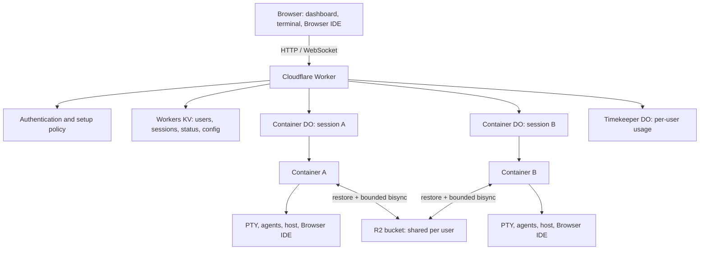
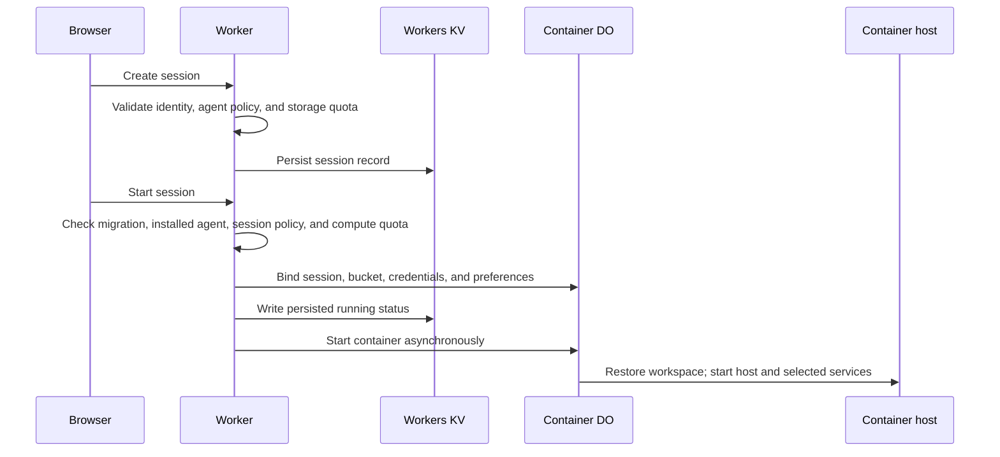
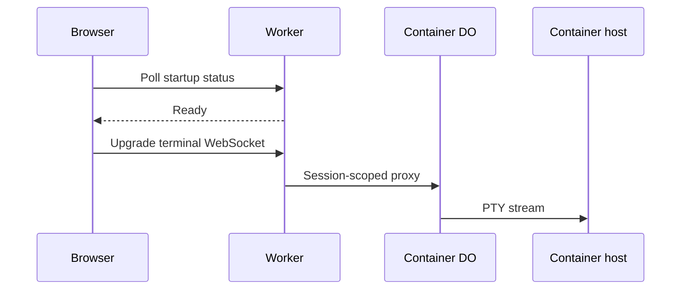
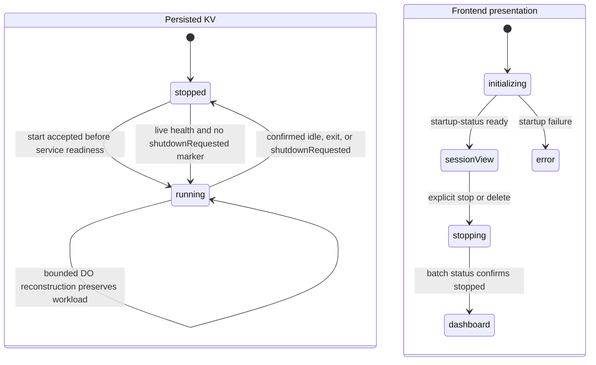
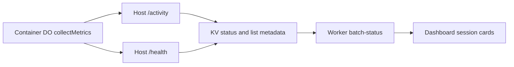
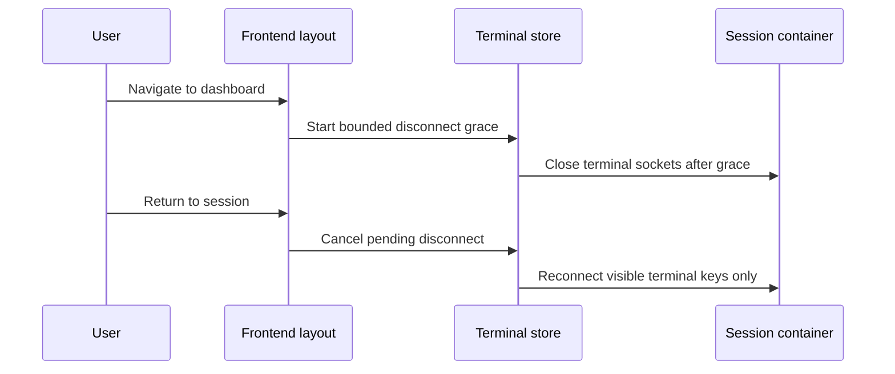
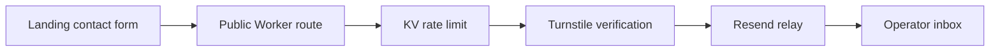
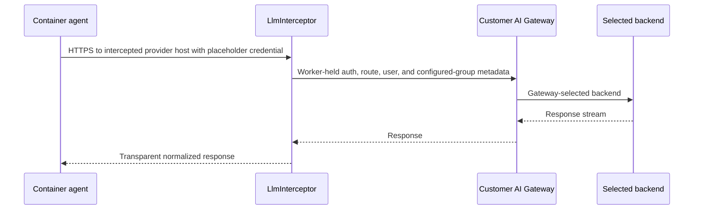
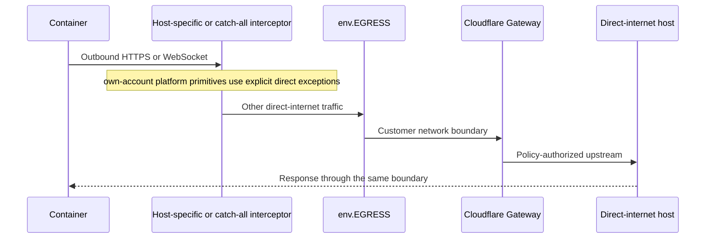
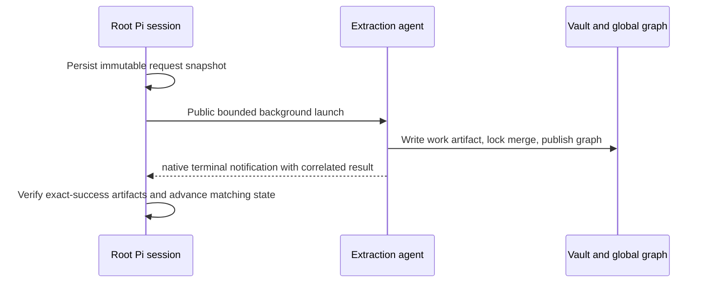

# Architecture

System map, ownership boundaries, authoritative state, and cross-component flows for Codeflare.

**Audience:** Operators and developers

---

## Contents

- [Purpose, Audience, and Ownership](#purpose-audience-and-ownership)
- [System at a Glance](#system-at-a-glance)
- [System Components](#system-components)
- [Architectural Invariants](#architectural-invariants)
- [State Ownership and Durability](#state-ownership-and-durability)
- [Data Flow](#data-flow)
- [Failure Domains and Recovery Ownership](#failure-domains-and-recovery-ownership)
- [Observability and Operator Signals](#observability-and-operator-signals)
- [Capacity, Caching, and Performance Assumptions](#capacity-caching-and-performance-assumptions)
- [Security and Privacy Boundaries](#security-and-privacy-boundaries)
- [Decision and Requirement Map](#decision-and-requirement-map)
- [Related Documentation](#related-documentation)

## Purpose, Audience, and Ownership

This document owns Codeflare's runtime topology, component boundaries, authoritative state, cross-component flows, failure domains, and architectural invariants. It is the starting point for an operator investigating which system owns a decision and for a developer tracing a request across processes.

It does not own endpoint contracts, configuration catalogues, deploy commands, threat-control detail, troubleshooting procedures, or source-file inventories. Those facts live in their existing specialist lanes and are linked at the point where the boundary matters.

| Question | Canonical owner |
|---|---|
| Which component owns this responsibility or state? | This document |
| What does an HTTP or WebSocket endpoint accept and return? | [API Reference](api-reference.md) |
| Which setting controls it? | [Configuration](configuration.md) |
| How is it deployed or rolled back? | [Deployment](deployment.md) |
| Which security control protects it? | [Security](security.md) |
| How does the container or host implement it? | [Container](container.md) and [Architecture Internals](architecture-internals.md) |
| How is persistent data reconciled? | [Storage & Sync](storage-and-sync.md) |
| How are agents, review, and seeded policies delivered? | [Preseed](preseed.md) |
| What should an operator do when it fails? | [Troubleshooting](troubleshooting.md) |
| Why was a trade-off accepted? | [Architecture Decisions](../decisions/README.md) |

## System at a Glance

Codeflare runs each backend session in one isolated Cloudflare Container. Browser tabs, terminal panes, MultiView, and the Browser IDE connect to a session; they do not define its identity. A user's sessions share one R2 bucket for selected persistent data while each container keeps an ephemeral local working copy. Workers KV is the control-plane record, and Durable Objects coordinate session-local runtime state.

The public Worker owns the edge boundary. Container credentials that must remain outside the workload are held or re-stamped at Worker-side interception boundaries. The container remains deliberately powerful inside its isolated workload and may change files or external systems permitted by its credentials and network policy.

### Deployment modes

| Mode | Identity boundary | Public entry | Billing | Enterprise interception |
|---|---|---|---|---|
| Default | Cloudflare Access | Authenticated application | Disabled | Off |
| Onboarding | GitHub OIDC session | Public landing and integrated sign-in | Disabled | Off |
| SaaS | GitHub OIDC session | Public landing and provider chooser | Enabled | Off |
| Enterprise | Customer Cloudflare Access | Customer-controlled application | Suppressed | Optional AI Gateway, Browser token, GitHub token, and strict egress boundaries |

The `workers.dev` URL is a setup surface, not the normal production entry. Custom-domain and Access configuration belong to [Configuration](configuration.md) and [Authentication](authentication.md); deployment procedure belongs to [Deployment](deployment.md). [REQ-SETUP-007](../../sdd/spec/setup.md#req-setup-007-custom-domain-with-dns-validation) defines the custom-domain contract.

## System Components

The registry below keeps one stable evidence-bearing dossier per runtime component. The detailed owner link is where implementation and operator procedure continue.

### Worker (Hono Router)

**Responsibility:** Authenticate public requests, apply edge policy, serve static assets, and route API, WebSocket, and session work to the owning component.

**Inputs:** HTTP and WebSocket requests, Worker bindings, setup state, and verified identity.

**Outputs:** API and asset responses, WebSocket upgrades, and calls to Durable Objects or external integrations.

**State owned:** No durable process-local authority; bounded per-isolate caches accelerate reads.

**Does not own:** Container processes, durable workspace content, or endpoint-specific business state.

**Source:** `src/index.ts`, `src/middleware/auth.ts`. <!-- @impl: src/middleware/auth.ts::requireAdmin -->

**Requirements:** [REQ-AUTH-020](../../sdd/spec/authentication.md#req-auth-020-onboarding-mode-landing-integrated-login-shell), [REQ-AUTH-022](../../sdd/spec/authentication.md#req-auth-022-session-expiry-on-resume-produces-a-clean-sign-in-redirect-never-a-blank-page)

**Decisions:** [AD10](../decisions/README.md#ad10-bootstrap-window-pre-setup-endpoints-csrf-and-worker-name-derivation), [AD34](../decisions/README.md#ad34-websocket-auth-bypass-of-hono-middleware)

**Detailed documentation:** [API Reference](api-reference.md), [Authentication](authentication.md), [Architecture Internals](architecture-internals.md)

### Container DO (container)

**Responsibility:** Coordinate one backend session's container configuration, startup, proxying, metrics, recovery, idle policy, and teardown.

**Inputs:** Session and bucket identity, preferences, credentials, internal control requests, and host health/activity.

**Outputs:** Container lifecycle transitions, authenticated proxy traffic, persisted status, usage, and recovery evidence.

**State owned:** Session-local Durable Object coordination, deliberate-shutdown marker, recovery evidence, and container configuration.

**Does not own:** The user's durable files or the dashboard's read model.

**Source:** `src/container/` and `src/routes/container/`.

**Requirements:** [REQ-SESSION-002](../../sdd/spec/session-lifecycle.md#req-session-002-one-container-per-session-isolation), [REQ-SESSION-018](../../sdd/spec/session-lifecycle.md#req-session-018-persisted-status-is-authoritative-on-container-exit), [REQ-SESSION-021](../../sdd/spec/session-lifecycle.md#req-session-021-unreachable-container-transport-initiates-coordinator-reconstruction)

**Decisions:** [AD1](../decisions/README.md#ad1-one-container-per-session), [AD70](../decisions/README.md#ad70-container-exit-writes-kv-stopped-no-read-side-reconciliation)

**Detailed documentation:** [Container](container.md), [Session lifecycle internals](architecture-internals.md)

### LlmInterceptor (Enterprise Mode)

**Responsibility:** Route configured enterprise LLM traffic through the customer's AI Gateway without exposing its credential to the container.

**Inputs:** Intercepted OpenAI-wire requests, the configured route catalogue, matched configured user-access groups, and Worker-held gateway configuration.

**Outputs:** Authenticated gateway requests, normalized streamed responses, or bounded fail-closed errors.

**State owned:** No durable state; it receives request-scoped and session-scoped props from the Container DO.

**Does not own:** Provider keys, Access policy, per-group configuration, or agent model selection UI.

**Source:** `src/llm-interceptor.ts`, `src/container/container-interception.ts`.

**Requirements:** [REQ-ENTERPRISE-004](../../sdd/spec/enterprise-mode.md#req-enterprise-004-outbound-interception-llm-routing-to-customer-ai-gateway), [REQ-ENTERPRISE-007](../../sdd/spec/enterprise-mode.md#req-enterprise-007-gateway-route-pinning), [REQ-ENTERPRISE-013](../../sdd/spec/enterprise-mode.md#req-enterprise-013-per-group-dynamic-routing)

**Decisions:** [AD72](../decisions/README.md#ad72-outbound-https-interception-over-a-worker-side-llm-proxy-for-enterprise-gateway-routing), [AD74](../decisions/README.md#ad74-enterprise-llm-transport-on-the-ai-gateway-rest-api)

**Detailed documentation:** [Security](security.md#enterprise-mode-credential-containment-and-ca-trust), [Configuration](configuration.md#enterprise-access-group-configuration), [Architecture Internals](architecture-internals.md)

### EgressController (Strict Gateway Egress, Enterprise Mode)

**Responsibility:** Force otherwise-unclaimed enterprise direct-internet traffic through the customer's Cloudflare Gateway boundary.

**Inputs:** Catch-all intercepted requests, account identity, strict-egress state, and the VPC egress binding.

**Outputs:** Gateway-routed traffic, direct own-account platform traffic, bridged WebSockets, or fail-closed boundary errors.

**State owned:** No durable state; strict mode and account identity arrive as Container DO props.

**Does not own:** Customer Gateway policy, host-specific credential injection, or own-account service authorization.

**Source:** `src/egress-controller.ts`, `src/lib/controller-egress.ts`, `src/container/container-interception.ts`.

**Requirements:** [REQ-ENTERPRISE-016](../../sdd/spec/enterprise-mode.md#req-enterprise-016-strict-gateway-egress), [REQ-ENTERPRISE-023](../../sdd/spec/enterprise-mode.md#req-enterprise-023-strict-gateway-egress-controller-transport)

**Decisions:** [AD85](../decisions/README.md#ad85-controller-mediated-cloudflare-gateway-egress-as-a-mandatory-web-boundary-wizard-toggled-default-off), [AD86](../decisions/README.md#ad86-platform-native-cloudflare-primitives-bypass-strict-gateway-egress-only-direct-internet-egress-takes-cf1network), [AD87](../decisions/README.md#ad87-egresscontroller-re-signs-own-account-r2-container-holds-a-placeholder-key-bridges-websocket-upgrades-and-resolves-strict-via-props)

**Detailed documentation:** [Security](security.md#strict-gateway-egress-enterprise-mode), [Configuration](configuration.md), [Deployment](deployment.md#strict-gateway-egress-enterprise-mode)

### CloudflareBrowserInterceptor (non-enterprise OAuth mode)

**Responsibility:** Refresh and inject user-scoped Cloudflare OAuth or enterprise Browser Rendering credentials at the Worker boundary.

**Inputs:** Intercepted Cloudflare REST or CDP traffic, session-bound identity, and Worker-held token state.

**Outputs:** Re-authenticated HTTP or WebSocket traffic, or a fail-closed authentication response.

**State owned:** No durable state beyond token stores owned by the authentication layer.

**Does not own:** OAuth consent, account authorization, browser session state, or arbitrary outbound traffic.

**Source:** `src/cloudflare-browser-interceptor.ts`, `src/container/container-interception.ts`.

**Requirements:** [REQ-BROWSER-008](../../sdd/spec/browser-run.md#req-browser-008-browser-rendering-token-interception-never-in-the-container), [REQ-AGENT-078](../../sdd/spec/agents.md#req-agent-078-cloudflare-oauth-token-refreshed-at-the-apicloudflarecom-boundary)

**Decisions:** [AD93](../decisions/README.md#ad93-refresh-the-non-enterprise-cloudflare-oauth-token-at-the-apicloudflarecom-boundary-reusing-the-browser-interceptor)

**Detailed documentation:** [Authentication](authentication.md), [Security](security.md#api-token-containment)

### GitHub Integration

**Responsibility:** Connect a user's GitHub identity to repository discovery, cloning, and in-session GitHub traffic through mode-appropriate credentials.

**Inputs:** OAuth state and tokens, repository selection, clone requests, session identity, and intercepted GitHub traffic in enterprise mode.

**Outputs:** Connection metadata, repository lists, clone operations, and authenticated GitHub requests.

**State owned:** Encrypted per-user GitHub token in the existing deploy-key record.

**Does not own:** Repository authorization, GitHub account policy, workspace persistence, or general network egress.

**Source:** `src/routes/github.ts`, `src/routes/github-auth.ts`, `src/lib/github-token.ts`, `src/github-interceptor.ts`, `host/src/git-clone.ts`, `web-ui/src/components/github/`.

**Requirements:** [REQ-GITHUB-001](../../sdd/spec/github.md#req-github-001-github-token-capture-and-storage), [REQ-GITHUB-003](../../sdd/spec/github.md#req-github-003-enterprise-egress-injected-github-credentials), [REQ-GITHUB-004](../../sdd/spec/github.md#req-github-004-clone-a-repository-into-a-session), [REQ-GITHUB-014](../../sdd/spec/github.md#req-github-014-clone-created-session-resume), [REQ-GITHUB-006](../../sdd/spec/github.md#req-github-006-other-mode-container-transport)

**Decisions:** [AD81](../decisions/README.md#ad81-reuse-the-container-egress-injection-layer-for-per-user-github-tokens)

**Detailed documentation:** [API Reference](api-reference.md#github-integration), [Security](security.md#github-token-containment), [Architecture Internals](architecture-internals.md)

### Browser IDE

**Responsibility:** Provide a session-isolated code-server workbench and the selected native Pi, official Claude, or empty agent inventory.

**Inputs:** Session route, immutable Terminal or VS Code workspace snapshot, fixed editor workspace, selected tab-one agent, editor requests, bounded UI-state snapshot, and bounded user-extension manifest.

**Outputs:** Editor UI, native agent context, file changes, diagnostics, session-scoped process descendants, and lazy Open VSX restoration.

**State owned:** Live editor databases, writable extension layer, and agent processes inside the ephemeral container; only bounded UI continuity and extension-intent manifests persist.

The Worker snapshots the entitled default when it creates a session. Missing and historical values mean Terminal. VS Code sessions remain dashboard-owned, skip host PTY prewarm and terminal WebSockets, and expose **Open** only after editor readiness. A stable session-keyed browser target focuses one retained editor tab. Terminal sessions keep their existing PTY prewarm and request-lazy editor.

**Does not own:** Terminal Pi conversation, generic VS Code authentication, extension package bytes or private galleries, durable credentials, or the user's future workspace preference.

**Source:** `src/routes/session/crud.ts`, `src/container/container-env.ts`, `host/src/server.ts`, `host/src/vscode-proxy.ts`, `web-ui/src/components/Layout.tsx`, `web-ui/src/stores/terminal-workspace.ts`, `openvscode/agent-sidebar/`, `openvscode/claude/`, `scripts/browser-ide-ui-state.py`, `scripts/browser-ide-extensions.py`, `entrypoint.sh`.

**Requirements:** [REQ-IDE-002](../../sdd/spec/browser-ide.md#req-ide-002-session-isolated-ide-not-bucket-stable), [REQ-IDE-005](../../sdd/spec/browser-ide.md#req-ide-005-selected-native-ide-agent), [REQ-IDE-006](../../sdd/spec/browser-ide.md#req-ide-006-ide-conversation-context-and-credential-isolation), [REQ-IDE-008](../../sdd/spec/browser-ide.md#req-ide-008-ide-agent-process-lifecycle), [REQ-IDE-015](../../sdd/spec/browser-ide.md#req-ide-015-clean-browser-ide-url-and-private-workspace-selection), [REQ-IDE-019](../../sdd/spec/browser-ide.md#req-ide-019-codeflare-eligibility-in-editor-inline-chat), [REQ-IDE-020](../../sdd/spec/browser-ide.md#req-ide-020-native-pi-editor-proposal-execution), [REQ-IDE-022](../../sdd/spec/browser-ide.md#req-ide-022-native-pi-blocking-ui-protocol), [REQ-IDE-025](../../sdd/spec/browser-ide.md#req-ide-025-shared-ide-pi-surface-isolation), [REQ-IDE-026](../../sdd/spec/browser-ide.md#req-ide-026-native-inline-chat-edit-validation).

**Requirements (continued):** [REQ-IDE-030](../../sdd/spec/browser-ide.md#req-ide-030-native-inline-chat-result-envelope), [REQ-IDE-033](../../sdd/spec/browser-ide.md#req-ide-033-controller-owned-inline-review-lifecycle), [REQ-IDE-034](../../sdd/spec/browser-ide.md#req-ide-034-bounded-inline-lifecycle-diagnostics), [REQ-IDE-035](../../sdd/spec/browser-ide.md#req-ide-035-canonical-browser-ide-workspace-projection), [REQ-IDE-036](../../sdd/spec/browser-ide.md#req-ide-036-persistent-user-managed-extensions), [REQ-IDE-037](../../sdd/spec/browser-ide.md#req-ide-037-lazy-extension-restoration), [REQ-IDE-038](../../sdd/spec/browser-ide.md#req-ide-038-extension-warning-acknowledgement), [REQ-IDE-040](../../sdd/spec/browser-ide.md#req-ide-040-user-extension-allowance-policy), [REQ-IDE-043](../../sdd/spec/browser-ide.md#req-ide-043-native-pi-provider-history-isolation), [REQ-IDE-048](../../sdd/spec/browser-ide.md#req-ide-048-default-workspace-and-dashboard-owned-vs-code-sessions), [REQ-IDE-049](../../sdd/spec/browser-ide.md#req-ide-049-dashboard-browser-ide-interactions).

**Decisions:** [AD114](../decisions/README.md#ad114-native-pi-chat-and-the-official-claude-extension-own-editor-integration), [AD119](../decisions/README.md#ad119-replace-openvscode-with-pinned-code-server-behind-the-existing-session-proxy), [AD120](../decisions/README.md#ad120-browser-ide-uses-fixed-public-workspace-selection-and-exported-ui-state-continuity), [AD127](../decisions/README.md#ad127-native-inline-chat-uses-proposal-only-pi-turns-and-host-owned-text-edits), [AD128](../decisions/README.md#ad128-inline-review-lifecycle-belongs-to-the-pinned-controller), [AD129](../decisions/README.md#ad129-proxied-inline-uri-identity-must-be-observed-before-lifecycle-changes), [AD130](../decisions/README.md#ad130-the-projected-workspace-uses-the-canonical-browser-authority), [AD131](../decisions/README.md#ad131-inline-diagnostics-retain-only-sanitized-resource-identity), [AD132](../decisions/README.md#ad132-user-extensions-are-a-bounded-manifest-over-an-immutable-base-inventory), [AD135](../decisions/README.md#ad135-inline-chat-requires-one-host-correlated-result)

**Detailed documentation:** [Container](container.md#code-server-browser-ide), [Security](security.md#browser-ide-native-agents), [Architecture Internals](architecture-internals.md)

Requirement status and outstanding evidence remain authoritative in `sdd/spec/browser-ide.md`. This system map does not promote a Partial requirement by describing implemented behavior.

### Terminal Server (node-pty)

**Responsibility:** Own in-container PTYs, terminal WebSocket framing, host activity tracking, and private health/control endpoints.

**Inputs:** Authenticated HTTP/WebSocket traffic, terminal control frames, classified terminal input, Browser IDE client frames, and PTY output.

**Outputs:** Terminal bytes and control frames, PTY writes, shared activity/health state, and internal sync-control responses.

**State owned:** Ephemeral PTY sessions, connected-client state, resize authority, and the shared last-input timestamp.

**Does not own:** Persisted session status, idle policy decisions, durable workspace files, or public authorization.

**Source:** `host/src/server.ts`, `host/src/session.ts`, `host/src/activity-tracker.ts`, `host/src/terminal-ws.ts`, `host/src/request-router.ts`.

**Requirements:** [REQ-SESSION-005](../../sdd/spec/session-lifecycle.md#req-session-005-input-based-idle-detection), [REQ-TERM-021](../../sdd/spec/terminal.md#req-term-021-synchronized-output-frame-atomicity), [REQ-TERM-023](../../sdd/spec/terminal.md#req-term-023-away-only-agent-notification-delivery)

**Decisions:** [AD47](../decisions/README.md#ad47-pty-keepalive-as-safety-net-only-not-the-idle-policy), [AD82](../decisions/README.md#ad82-visible-terminal-panes-own-websockets-and-multiview-is-virtual)

**Detailed documentation:** [Container](container.md), [API Reference](api-reference.md), [Architecture Internals](architecture-internals.md)

### Landing (Astro, prerendered)

**Responsibility:** Build and serve the mode-aware public marketing and onboarding surfaces as static assets.

**Inputs:** Typed content, Astro components, design tokens, mode-aware Worker routing, and optional browser enhancement support.

**Outputs:** Prerendered HTML, fingerprinted assets, metadata, contact requests, and progressive visual enhancement.

**State owned:** No application state; the contact path persists only rate-limit counters and relays submission content without storing it.

**Does not own:** Authentication sessions, application routing, contact delivery credentials, or runtime workspace state.

**Source:** `landing/`, `src/lib/seo.ts`, Worker static-assets routing.

**Requirements:** [REQ-LANDING-001](../../sdd/spec/landing.md#req-landing-001-mode-aware-public-landing-serving), [REQ-LANDING-002](../../sdd/spec/landing.md#req-landing-002-demo-request-contact-pipeline), [REQ-LANDING-003](../../sdd/spec/landing.md#req-landing-003-landing-social-share-and-search-metadata), [REQ-LANDING-004](../../sdd/spec/landing.md#req-landing-004-first-paint-stability-and-immutable-asset-caching)

**Decisions:** [AD18](../decisions/README.md#ad18-vendored-creativewebgl-code-uses-untyped-patterns)

**Detailed documentation:** [Architecture Internals](architecture-internals.md), [API Reference](api-reference.md#public-landing), [Security](security.md)

### Frontend (SolidJS + xterm.js)

**Responsibility:** Present dashboard, terminal, storage, settings, billing, provisioning, and session-control surfaces in the browser.

**Inputs:** Worker APIs, session status, terminal WebSockets, browser viewport/focus, and bounded local UI state.

**Outputs:** User actions, visible terminal panes, dashboard state, and mode-appropriate product surfaces.

**State owned:** Browser-local presentation and virtual MultiView membership; authoritative backend state remains elsewhere.

**Does not own:** Container lifecycle truth, durable session status, workspace files, or credential storage.

**Source:** `web-ui/src/`.

**Requirements:** [REQ-TERM-011](../../sdd/spec/terminal.md#req-term-011-visible-terminal-panes-own-websocket-connections), [REQ-TERM-012](../../sdd/spec/terminal.md#req-term-012-multiview-virtual-session-workspace), [REQ-TERM-013](../../sdd/spec/terminal.md#req-term-013-multiview-selection-flow), [REQ-TERM-015](../../sdd/spec/terminal.md#req-term-015-focused-pane-owns-url-detection)

**Decisions:** [AD82](../decisions/README.md#ad82-visible-terminal-panes-own-websockets-and-multiview-is-virtual), [AD105](../decisions/README.md#ad105-streamed-output-defers-while-the-user-reads-scrollback-keyboard-open-swipes-are-always-terminal-input)

**Detailed documentation:** [Architecture Internals](architecture-internals.md), [Mobile](mobile.md)

### KV

**Responsibility:** Hold control-plane records for users, sessions, setup, configuration, status, usage, and rate limits.

**Inputs:** Validated Worker and lifecycle writes.

**Outputs:** Authoritative control-plane reads and list metadata for dashboards and policy resolution.

**State owned:** Persistent control-plane records, including authoritative session status.

**Does not own:** Container process state, workspace bytes, or immediate cross-isolate consistency.

**Source:** Worker KV binding and key helpers under `src/lib/`.

**Requirements:** [REQ-SESSION-010](../../sdd/spec/session-lifecycle.md#req-session-010-session-status-observable-from-dashboard), [REQ-SESSION-018](../../sdd/spec/session-lifecycle.md#req-session-018-persisted-status-is-authoritative-on-container-exit)

**Decisions:** [AD6](../decisions/README.md#ad6-kv-read-modify-write-races-and-collectmetrics-atomicity), [AD70](../decisions/README.md#ad70-container-exit-writes-kv-stopped-no-read-side-reconciliation)

**Detailed documentation:** [Container](container.md), [Configuration](configuration.md)

### R2

**Responsibility:** Hold the selected durable per-user files restored into and reconciled from session containers.

**Inputs:** Initial restore, periodic/manual/final bisync, storage API mutations, and seed reconciliation.

**Outputs:** Durable user files and storage listings.

**State owned:** One persistent bucket namespace per user.

**Does not own:** Live POSIX semantics, process state, excluded caches, or sync coordination.

**Source:** R2 binding, scoped S3 credentials, and `entrypoint.sh` sync lifecycle.

**Requirements:** [REQ-STOR-001](../../sdd/spec/storage.md#req-stor-001-dedicated-per-user-r2-bucket), [REQ-STOR-002](../../sdd/spec/storage.md#req-stor-002-file-persistence-across-sessions), [REQ-STOR-003](../../sdd/spec/storage.md#req-stor-003-bidirectional-sync-every-15-minutes-with-manual-triggers)

**Decisions:** [AD3](../decisions/README.md#ad3-per-user-r2-buckets), [AD56](../decisions/README.md#ad56-15-minute-bisync-cadence-with-manual-triggers), [AD125](../decisions/README.md#ad125-bounded-automatic-resync-after-exhausted-recovery)

**Detailed documentation:** [Storage & Sync](storage-and-sync.md)

### Timekeeper

**Responsibility:** Convert per-session runtime reports into bounded per-user usage accounting.

**Inputs:** Monotonic usage reports from running session coordinators and tier context.

**Outputs:** Usage deltas and quota/accounting records.

**State owned:** Per-user usage coordination in a Durable Object.

**Does not own:** Session lifecycle, billing checkout, or container metrics collection.

**Source:** `src/timekeeper/` and subscription helpers.

**Requirements:** [REQ-SUB-006](../../sdd/spec/subscription.md#req-sub-006-real-time-usage-tracking-via-timekeeper-do), [REQ-SUB-007](../../sdd/spec/subscription.md#req-sub-007-quota-enforcement-at-session-start-402)

**Decisions:** [AD37](../decisions/README.md#ad37-kv-as-billing-read-cache----signal-and-sync-cf-015)

**Detailed documentation:** [Billing](billing.md), [Container](container.md)

## Architectural Invariants

| Invariant | Consequence | Current decision | Detailed owner |
|---|---|---|---|
| One container belongs to one backend session. | Browser tabs and virtual views cannot change session identity. | [AD1](../decisions/README.md#ad1-one-container-per-session) | [Container](container.md) |
| One persistent R2 bucket belongs to one user. | Multiple sessions reconcile selected files through one durable namespace. | [AD3](../decisions/README.md#ad3-per-user-r2-buckets) | [Storage & Sync](storage-and-sync.md) |
| KV status is the dashboard authority. | Exit paths write `stopped`; a demonstrably live container may repair a false stop only without a deliberate-shutdown marker. | [AD70](../decisions/README.md#ad70-container-exit-writes-kv-stopped-no-read-side-reconciliation) | [Container](container.md) |
| Idle means no classified terminal or Browser IDE input. | Autonomous output and server-to-client traffic do not keep a session alive. | [AD47](../decisions/README.md#ad47-pty-keepalive-as-safety-net-only-not-the-idle-policy) | [Container](container.md) |
| Only visible terminal panes own WebSockets and resize authority. | MultiView is browser-local and does not create backend sessions. | [AD82](../decisions/README.md#ad82-visible-terminal-panes-own-websockets-and-multiview-is-virtual) | [Architecture Internals](architecture-internals.md) |
| Final sync is awaited while the container is alive. | The signal trap is a backstop, not the durability guarantee. | [AD57](../decisions/README.md#ad57-135-second-shutdown-budget-for-final-bisync) | [Storage & Sync](storage-and-sync.md) |
| Ordinary sync recovery precedes baseline reconstruction. | Automatic `--resync` is bounded to exhausted recovery or absent listing state. | [AD125](../decisions/README.md#ad125-bounded-automatic-resync-after-exhausted-recovery) | [Storage & Sync](storage-and-sync.md) |
| Worker-held credentials never enter a container when an interceptor owns them. | Missing interceptor configuration fails closed rather than bypassing the boundary. | [AD72](../decisions/README.md#ad72-outbound-https-interception-over-a-worker-side-llm-proxy-for-enterprise-gateway-routing), [AD81](../decisions/README.md#ad81-reuse-the-container-egress-injection-layer-for-per-user-github-tokens) | [Security](security.md) |
| Direct-internet strict egress passes through the customer's Gateway. | Own-account platform primitives remain explicitly scoped exceptions. | [AD86](../decisions/README.md#ad86-platform-native-cloudflare-primitives-bypass-strict-gateway-egress-only-direct-internet-egress-takes-cf1network) | [Security](security.md) |
| Root sessions own mutation and delivery. | Review, CI, memory, and Vault child agents report or publish only within their bounded contracts. | [AD98](../decisions/README.md#ad98-pi-pr-review-uses-visible-session-scoped-agents), [AD102](../decisions/README.md#ad102-pi-extraction-delivery-is-root-owned-visible-and-transactional) | [Preseed](preseed.md), [Vault](vault.md) |

## State Ownership and Durability

When two observations disagree, the authority column decides which one wins. A process-local cache or browser display is never allowed to overrule its durable owner.

| State | Scope | Authority | Durability | Writers | Readers | Recovery owner |
|---|---|---|---|---|---|---|
| User, setup, and configuration records | Deployment/user | Workers KV | Persistent, eventually consistent | Authenticated Worker routes | Worker policy and UI | Owning route/configuration lane |
| Session status and list metadata | Session | Workers KV record | Persistent | Lifecycle routes and Container DO | Dashboard batch-status | Container lifecycle |
| Container coordination and recovery evidence | Session | Container DO storage | Durable across DO hibernation/reconstruction | Container DO | Container DO | Container lifecycle |
| Live process and port state | Session | Containers platform plus successful host probes | Ephemeral | Container runtime | Container DO | Container lifecycle |
| Workspace and selected user files | User | R2 bucket | Persistent | Sync lifecycle and storage API | Session containers and storage UI | Storage & Sync |
| Local workspace and agent runtime | Session | Container filesystem/processes | Ephemeral | User, agents, IDE, entrypoint | Same session | Restore from R2/Git or restart |
| Browser IDE UI snapshot | User | `~/.codeflare/ide-ui-state.json` in selected sync | Bounded persistent | IDE exporter | IDE restore | Browser IDE runtime |
| Live editor databases, credentials, chat, logs | Session | Ephemeral container paths | Ephemeral by contract | code-server and extensions | Same editor generation | Fresh launch, never R2 restore |
| Virtual MultiView membership | Browser | Browser storage | Browser-local | Frontend | Frontend | Validate against live sessions |
| Per-isolate caches | Worker isolate | Owning module plus TTL/reset | Ephemeral | Owning module | Same isolate | TTL or explicit reset |
| Vault and cumulative graph content | User | R2-backed Vault plus published graph files | Persistent after exact-success publication | Root-owned extraction lifecycle | Vault and graph consumers | Vault extraction owner |

Bucket creation is lazy and idempotent. Session start and storage browse ensure the user's bucket exists; preseed and mode reconciliation occur through their specialist owners. See [Storage & Sync](storage-and-sync.md), [Preseed](preseed.md), and [Container](container.md).

## Data Flow

### Session Creation to Terminal Connection

#### Creation and start

#### Terminal connection

**Authority:** An active authenticated user may create the record. Creation and start are distinct operations: creation does not consume a concurrent-running slot; start checks role/tier concurrency and compute quota, binds the Container DO, then writes KV `running` before asynchronous startup. Concurrent-session admission is explicitly best effort: the KV count and later status write are not atomic, so simultaneous starts may exceed the nominal per-user limit. Deployment `max_instances` is the separate hard platform capacity boundary. Successful host readiness owns service availability.

Creation may reject enterprise agent policy or SaaS storage quota. Start may reject bucket migration, unavailable agent, the current session-count guard, or compute quota. An accepted asynchronous start that later fails rolls KV back to `stopped` rather than producing a persisted `error` state.

**Failure owner:** [Container](container.md) owns startup, retry, and recovery detail. [API Reference](api-reference.md) owns endpoint outcomes. [Troubleshooting](troubleshooting.md#container-start-is-rejected-or-returns-to-stopped) owns operator diagnosis.

**Requirements:** [REQ-SESSION-002](../../sdd/spec/session-lifecycle.md#req-session-002-one-container-per-session-isolation), [REQ-SESSION-017](../../sdd/spec/session-lifecycle.md#req-session-017-container-health-and-startup-status-api)

### Startup Status Stages

| Stage | Progress | Derived from |
|---|---:|---|
| stopped | 0% | `getState()` unavailable before a running workload is observed |
| starting | 10–20% | Container state not running/healthy, or host health unavailable |
| syncing | 30–45% | Host health available while initial sync is pending or active |
| verifying | 85% | Initial sync complete while terminal sessions remain unavailable |
| mounting | 90% | Terminal sessions available while PTY pre-warm remains incomplete |
| ready | 100% | Terminal sessions and pre-warm ready; sync may be complete, skipped, or running on demand |
| error | 0% | Startup-status handler or initial-sync failure |

These endpoint stages are derived observations, not persisted lifecycle state. KV remains authoritative for persisted `running|stopped`; `initializing`, `stopping`, and lifecycle-error presentation are frontend-only. [API Reference](api-reference.md#container-lifecycle) owns the exact response contract.

### Session Lifecycle State Machine

<!-- doc-allow-element: AD70 durable and presentation authority must remain visible together -->

Persisted storage has only `running` and `stopped`; `running` may precede terminal readiness. `initializing`, `sessionView`, `stopping`, `dashboard`, and `error` above are frontend presentation states. `collectMetrics()` confirms a not-running condition before writing `stopped`; a successful live health probe may re-assert `running` only when no durable `shutdownRequested` marker proves deliberate teardown. Transport reconstruction is bounded and preserves the running workload where possible.

| Event | Authoritative owner | Durable effect | Recovery pointer |
|---|---|---|---|
| Idle threshold | Container DO metrics loop | Write `stopped`, drain final sync, signal stop | [Container](container.md) |
| User stop/delete | Lifecycle route and Container DO | Persist shutdown marker and `stopped`; delete may then remove record | [Container](container.md) |
| Monitor transport loss | Durable recovery record | Preserve running status during bounded DO reconstruction | [Container recovery](container.md) |
| Unexpected exit | Error hook plus confirmed metrics observation | Write `stopped` after confirmation | [Troubleshooting](troubleshooting.md) |
| Restart with changed configuration | Lifecycle route | Teardown, repopulate, start, then re-assert running | [Container](container.md) |

**Requirements:** [REQ-SESSION-009](../../sdd/spec/session-lifecycle.md#req-session-009-container-destroy-wipes-session-state), [REQ-SESSION-018](../../sdd/spec/session-lifecycle.md#req-session-018-persisted-status-is-authoritative-on-container-exit), [REQ-SESSION-020](../../sdd/spec/session-lifecycle.md#req-session-020-the-metrics-alarm-outlives-a-container-that-stops-answering), [REQ-SESSION-021](../../sdd/spec/session-lifecycle.md#req-session-021-unreachable-container-transport-initiates-coordinator-reconstruction), [REQ-SESSION-024](../../sdd/spec/session-lifecycle.md#req-session-024-transport-recovery-ownership-is-durable)

### Metrics Data Flow

The host reports observations. The Container DO applies policy and writes the authoritative status/metrics record. The dashboard reads KV and never contacts the Durable Object merely to render status.

**Requirements:** [REQ-SESSION-004](../../sdd/spec/session-lifecycle.md#req-session-004-idle-containers-sleep-after-configurable-timeout), [REQ-SESSION-010](../../sdd/spec/session-lifecycle.md#req-session-010-session-status-observable-from-dashboard)

### Dashboard WS Disconnect Flow

Only visible panes reconnect. A server-authoritative stopped signal ends retries; a transient network close remains retryable. Exact timings, codes, and frontend ownership live in [Architecture Internals](architecture-internals.md), [API Reference](api-reference.md), and [Troubleshooting](troubleshooting.md).

### Contact Relay Data Flow

Submission content is validated, escaped, and relayed without persistence; KV stores only rate-limit state. [API Reference](api-reference.md#public-landing) owns request and error contracts, and [Security](security.md) owns abuse and injection controls.

**Requirements:** [REQ-LANDING-002](../../sdd/spec/landing.md#req-landing-002-demo-request-contact-pipeline)

### Onboarding Access-Request Flow

An authenticated onboarding user with no active tier is recorded as a pending access request, receives a confirmation redirect, and triggers best-effort operator/user email. SaaS keeps its subscription path; enterprise bypasses this flow. [Authentication](authentication.md) owns the complete branch and [Security](security.md#onboarding-access-request-oauth-gated) owns its boundary.

**Requirements:** [REQ-AUTH-021](../../sdd/spec/authentication.md#req-auth-021-onboarding-mode-sign-in-choices-and-access-request-flow)

### GitHub Clone Data Flow

A session created from a repository keeps its clone directive in session metadata and re-applies it before every container start; configuration failure blocks startup. For a missing ephemeral workspace, the established best-effort clone runs again; an existing or workspace-synced target is left untouched by the collision guard. A running session uses the authenticated host clone endpoint. Enterprise mode injects the user's GitHub token at the Worker egress boundary; other modes provide the existing container credential. [API Reference](api-reference.md#github-integration) owns outcomes and validation.

**Requirements:** [REQ-GITHUB-004](../../sdd/spec/github.md#req-github-004-clone-a-repository-into-a-session), [REQ-GITHUB-014](../../sdd/spec/github.md#req-github-014-clone-created-session-resume)

### Enterprise LLM Routing

Interception is wired before container start so the platform CA is available to the workload. Gateway URL and token remain Worker-side. Missing mandatory routing fails closed. Detailed transport, route, and streaming behavior belongs to [Security](security.md), [Configuration](configuration.md), and [Architecture Internals](architecture-internals.md).

**Requirements:** [REQ-ENTERPRISE-004](../../sdd/spec/enterprise-mode.md#req-enterprise-004-outbound-interception-llm-routing-to-customer-ai-gateway), [REQ-ENTERPRISE-011](../../sdd/spec/enterprise-mode.md#req-enterprise-011-container-start-interception-ordering)

### Strict Gateway Egress

Host-specific interceptors remain responsible for credential stamping. The catch-all controller is transparent except for own-account R2 re-signing. Strict mode never falls back to unrestricted fetch when the required egress binding is absent.

**Requirements:** [REQ-ENTERPRISE-016](../../sdd/spec/enterprise-mode.md#req-enterprise-016-strict-gateway-egress), [REQ-ENTERPRISE-023](../../sdd/spec/enterprise-mode.md#req-enterprise-023-strict-gateway-egress-controller-transport), [REQ-ENTERPRISE-024](../../sdd/spec/enterprise-mode.md#req-enterprise-024-strict-gateway-egress-host-specific-interceptor-routing)

### Pi Memory and Vault Extraction Data Flow

The root owns delivery and finalization. The child receives one immutable request, publishes under a bounded lock, and cannot advance root counters or manifests by self-report. [Vault](vault.md) owns capture and publication semantics; [Preseed](preseed.md) owns delivered runtime contracts.

**Requirements:** [REQ-MEM-002](../../sdd/spec/memory.md#req-mem-002-capture-triggers-every-15-user-messages), [REQ-VAULT-027](../../sdd/spec/vault.md#req-vault-027-pi-vault-extraction-delivery-is-visible-and-transactional)

### Pi PR-Boundary Review Data Flow

An authoritative open PR head produces independent report-only reviewer lanes. The root launches them, correlates exact native results, publishes one finding triage, acknowledges that reviewed head, and applies accepted fixes in a separate turn. Review never runs against unpublished local commits.

**Requirements:** [REQ-AGENT-036](../../sdd/spec/agents.md#req-agent-036-pr-boundary-review-trigger-conditions), [REQ-AGENT-055](../../sdd/spec/agents.md#req-agent-055-pi-session-scoped-review-window), [REQ-AGENT-098](../../sdd/spec/agents.md#req-agent-098-pi-review-triage-acknowledgement-barrier)

**Detailed documentation:** [Preseed](preseed.md)

### User-Invoked Review and SDD Ownership

User-invoked `/review` specialists are report-only. The root owns triage and any approved mutation. `/sdd init` and `/sdd clean` are root mutation workflows that apply specification enforcement before documentation enforcement.

**Requirements:** [REQ-AGENT-015](../../sdd/spec/agents.md#req-agent-015-review-command-for-multi-perspective-codebase-review), [REQ-AGENT-037](../../sdd/spec/agents.md#req-agent-037-sdd-clean-rescue-and-autonomy-modes), [REQ-AGENT-050](../../sdd/spec/agents.md#req-agent-050-pi-native-review-workflow-skill)

**Detailed documentation:** [Preseed](preseed.md)

### Pi CI Monitoring Data Flow

CI monitoring launches independently after required reviewers are launched. It observes the exact PR head and reports a terminal result; it does not acknowledge review, mutate the branch, cancel runs, or chase a changed head.

**Requirements:** [REQ-AGENT-068](../../sdd/spec/agents.md#req-agent-068-independent-pi-ci-monitoring)

**Decisions:** [AD99](../decisions/README.md#ad99-pi-ci-monitoring-uses-one-attached-native-background-subagent), [AD122](../decisions/README.md#ad122-the-ci-monitor-observes-and-reports-it-does-not-cancel-runs-or-chase-the-remote)

**Detailed documentation:** [CI/CD](ci-cd.md), [Preseed](preseed.md)

### Managed Environment Data Flow

**Requirements:** [REQ-SETUP-013](../../sdd/spec/setup.md#req-setup-013-managed-environment-configuration), [REQ-SETUP-014](../../sdd/spec/setup.md#req-setup-014-managed-repository-credential-boundary), [REQ-AGENT-147](../../sdd/spec/agents.md#req-agent-147-signed-managed-agent-configuration-releases), [REQ-AGENT-148](../../sdd/spec/agents.md#req-agent-148-protected-managed-release-publication), [REQ-AGENT-149](../../sdd/spec/agents.md#req-agent-149-shared-compiler-cli-compatibility), [REQ-AGENT-150](../../sdd/spec/agents.md#req-agent-150-independent-managed-release-activation-validation), [REQ-AGENT-154](../../sdd/spec/agents.md#req-agent-154-build-compatible-managed-release-discovery), [REQ-AGENT-151](../../sdd/spec/agents.md#req-agent-151-bounded-managed-release-streaming), [REQ-STOR-020](../../sdd/spec/storage.md#req-stor-020-managed-environment-reconciliation), [REQ-STOR-021](../../sdd/spec/storage.md#req-stor-021-managed-content-ownership), [REQ-STOR-022](../../sdd/spec/storage.md#req-stor-022-managed-reconciliation-admission), [REQ-STOR-023](../../sdd/spec/storage.md#req-stor-023-managed-release-status-and-discovery), [REQ-STOR-024](../../sdd/spec/storage.md#req-stor-024-managed-release-application), [REQ-IDE-042](../../sdd/spec/browser-ide.md#req-ide-042-additive-company-extension-reconciliation), [REQ-IDE-044](../../sdd/spec/browser-ide.md#req-ide-044-exact-company-vsix-verification), [REQ-IDE-045](../../sdd/spec/browser-ide.md#req-ide-045-company-extension-reconciliation-orchestration), [REQ-IDE-046](../../sdd/spec/browser-ide.md#req-ide-046-session-local-company-vsix-installation)

A protected private-repository workflow publishes one immutable signed release. The Worker alone uses the encrypted repository PAT, verifies immutable GitHub metadata, asset digests, Ed25519 signature, sequence, repository identity, seed ABI, runtime hash, paths, bounds, and extension records, then caches content-addressed bytes in deployment R2. A repository-stable conditional pointer records the authoritative trust selection. A losing concurrent replacement performs bounded KV repair and fails explicitly if the pointer does not settle. <!-- @impl: src/lib/remote-curation.ts::resolveManagedEnvironmentRelease --> <!-- @impl: src/lib/remote-curation.ts::configureManagedEnvironment -->

Dashboard status compares the already-verified active descriptor and resolved mode with the user's applied stamp without re-expanding an unchanged payload; the existing five-minute resolver still verifies and caches a newly discovered release once.

When an idle user needs an upgrade, the existing storage route reads the cached gzip once and validates it as a bounded stream. The parser flushes each 16 KiB input slice and admits at most six pending document callbacks before streaming through at most six concurrent user-bucket writes. Reconciliation preserves the established mode/provenance/cleanup payload and stamps completion last. Container startup receives only an active boolean and the applied digest. It never receives GitHub credentials, signing material, bundle/signature bytes, or VSIX bytes. <!-- @impl: src/lib/remote-curation.ts::resolveManagedEnvironmentRelease --> <!-- @impl: src/lib/remote-curation.ts::verifyManagedReleaseStream --> <!-- @impl: src/lib/r2-seed.ts::reconcileAgentConfigs --> <!-- @impl: src/routes/storage/seed.ts::default -->

Private curation is the runtime content master; the public baked preseed remains an independent fallback. Publication is discovered through the existing five-minute dashboard refresh rather than a container downloader, webhook, or new polling loop. <!-- @impl: src/lib/remote-curation.ts::resolveManagedEnvironmentRelease --> See [Preseed — Managed curation ownership](preseed.md#managed-curation-ownership) and [AD136](../decisions/README.md#ad136-managed-environments-reconcile-signed-releases-before-session-start).

## Failure Domains and Recovery Ownership

| Failure domain | Observable disagreement | Authority | Recovery owner | Degradation rule |
|---|---|---|---|---|
| Worker isolate/cache | Isolates temporarily read different cached configuration | KV plus bounded TTL/reset | [Architecture Internals](architecture-internals.md#module-level-caches) | Never treat isolate memory as durable authority |
| Durable Object attachment | Host routes fail while platform may still report running | Correlated host probes and durable recovery record | [Container](container.md#auto-sleep-configurable-sleepafter) | Reconstruct the coordinator at most twice while preserving workload where possible |
| Container process | KV says running but not-running persists | Confirmed container state | [Container](container.md#auto-sleep-configurable-sleepafter) | Write `stopped` only after the confirmation window |
| Accepted asynchronous start | Start was accepted, then startup status returns to `stopped` | KV rollback plus Worker/container-start logs | [Troubleshooting](troubleshooting.md#container-start-is-rejected-or-returns-to-stopped) | Preserve `stopped`; inspect policy/platform capacity and retry after correction |
| False persisted stop | Health proves live while KV says stopped | Live health plus absence of shutdown marker | [Container](container.md#auto-sleep-configurable-sleepafter) | Re-assert `running` within one metrics tick |
| Final persistence drain | Stop requested while local changes may be newer | Awaited host final-sync result | [Storage & Sync](storage-and-sync.md#rclone-sync-modes-req-stor-003) | Stop remains bounded; outcome is audited |
| R2 bisync | Listings or transfer remain unrecoverable | Sync daemon state and health report | [Storage & Sync](storage-and-sync.md#vanishing-file-recovery) | Repair vanished files first; bounded baseline rebuild last |
| Enterprise credential boundary | Required token or binding unavailable | Worker-side interceptor configuration | [Security](security.md#api-token-containment) and [Configuration](configuration.md) | Fail closed; never expose or fall back to container credentials |
| Browser IDE process | code-server or agent descendant exits or ignores TERM | Generation identity and bounded reap | [Container](container.md#code-server-browser-ide) and [Architecture Internals](architecture-internals.md#browser-ide-internals) | Reap matching generation before replacement |
| Review or CI result | Result names a different head | Authoritative PR head | [Preseed](preseed.md) and [CI/CD](ci-cd.md) | Ignore stale result; never acknowledge replacement head |
| Extraction publication | Child reports success without matching artifacts | Root artifact verification | [Vault](vault.md) and [Preseed](preseed.md) | Leave counters/manifests unchanged and redeliver within bound |

## Observability and Operator Signals

| Signal | Meaning / non-evidence | Observed at | Escalate when | Runbook |
|---|---|---|---|---|
| KV session `status` | Authoritative persisted running/stopped; not immediate host readiness | Dashboard `/api/sessions/batch-status` | `stopped` disagrees with successful live health | [False stopped](troubleshooting.md#session-shows-stopped-on-the-dashboard-but-container-is-actually-running) |
| Startup stage | Derived startup boundary; not persisted lifecycle status | `/api/container/startup-status` | Rejected start, accepted start returning to `stopped`, `error`, or no progress | [Start rejection/rollback](troubleshooting.md#container-start-is-rejected-or-returns-to-stopped), [Waiting for services](troubleshooting.md#container-stuck-at-waiting-for-services) |
| `lastInputAt` | Latest classified terminal or Browser IDE input; not agent output or liveness | Internal host `/activity`, surfaced through idle decisions and lifecycle logs | A session idles despite recent user input | [Container idle policy](container.md#auto-sleep-configurable-sleepafter) |
| Metrics `updatedAt` | Last metrics publication; not liveness while the alarm loop sleeps | Dashboard batch status | Older than one 60-second metrics cycle while KV remains `running` | [Dashboard metrics](troubleshooting.md#dashboard-metrics-look-stale-or-cpu-exceeds-100) |
| Terminal connection state | Visible-pane connectivity; not persisted session state | Terminal UI and client WebSocket state | Reconnecting persists after visibility return | [Terminal reconnect](troubleshooting.md#terminal-stuck-on-connecting-after-a-mobile-app-switch) |
| Sync health/status | Current persistence-cycle result; not proof of complete R2 contents | Startup-status `details`, `/tmp/sync-status.json`, `/tmp/sync.log` | `failed`, frozen, or final-sync audit is incomplete | [R2 Sync Issues](troubleshooting.md#r2-sync-issues) |
| Recovery correlation logs | Attempt, route observation, outcome, and exhaustion; not user-requested shutdown | `wrangler tail`, keyed by `recoveryAttemptId` | Recovery exhausts or shutdown ownership is unreadable | [Transport recovery](troubleshooting.md#common-failure-modes) |
| CI native notification | Terminal result for one exact PR head; not review completion | Root Pi terminal/session notification | Failure, timeout, malformed result, or head mismatch | [CI/CD](ci-cd.md) |

## Capacity, Caching, and Performance Assumptions

Worker module caches are per isolate. Different isolates may observe configuration changes at different times within each cache's TTL; reset hooks narrow that window but cannot create shared memory. Exact cache variables, TTLs, bounds, and reset functions live in [Architecture Internals](architecture-internals.md#module-level-caches).

| Assumption | Bound or cadence | Operational consequence | Detailed owner |
|---|---|---|---|
| Dashboard status polling | 5 seconds | Status may lag one browser poll; rendering reads compact KV list metadata without one `KV.get` per session | [Architecture Internals](architecture-internals.md#module-level-caches) |
| Metrics publication | Normally 60 seconds | Metrics may trail status; stale `updatedAt` alone is not a liveness verdict | [Container](container.md#auto-sleep-configurable-sleepafter) |
| In-container metrics requests | 10 seconds each | A wedged route cannot hold the alarm forever; repeated full-route failure enters bounded recovery | [Container](container.md#auto-sleep-configurable-sleepafter) |
| Coordinator reconstruction | At most two resets | Recovery preserves a possibly live workload, then fails closed into ordinary exit confirmation | [Troubleshooting](troubleshooting.md#common-failure-modes) |
| Background R2 bisync | 15 minutes, plus manual triggers | Local files may lead R2 between reconciliations | [Storage & Sync](storage-and-sync.md#rclone-sync-modes-req-stor-003) |
| Final persistence drain | 120-second sync budget; 135-second teardown cap | Stop stays bounded while awaiting durability before signalling the container | [Storage & Sync](storage-and-sync.md#rclone-sync-modes-req-stor-003) |
| Background bisync baseline and PTY pre-warm | Run concurrently after the required initial restore; baseline sync is deprioritized on the default single-vCPU tier | Readiness waits for mode-specific restore and pre-warm rather than port binding alone | [Container](container.md#container-startup) |
| Session create/start requests | 10 creates and 5 starts per minute per user | Creation records intent; start separately checks concurrency and compute-quota policy | [API Reference](api-reference.md#session-management), [Container](container.md) |
| Concurrent-session limit | Non-SaaS, including current Enterprise runtime: role-based; SaaS: effective-tier-based | Best-effort start-time check; simultaneous starts may exceed the nominal limit. [Issue #880](https://github.com/nikolanovoselec/codeflare/issues/880) tracks one role-independent Enterprise limit | [Configuration](configuration.md#worker-environment), [Billing](billing.md), [REQ-SESSION-007](../../sdd/spec/session-lifecycle.md#req-session-007-running-session-count-limited-per-tier) |
| Container resource profile | Low: 0.25 vCPU/1 GiB/4 GB; default or `saas`: 1 vCPU/3 GiB/6 GB; high: 2 vCPU/6 GiB/12 GB | One profile is selected per deployment | [Configuration](configuration.md#container-specs) |
| Deployment container capacity | 10 instances by default; positive-integer `MAX_INSTANCES` override | This deployment-wide platform bound is distinct from the per-user policy guard | [Configuration](configuration.md#container-specs) |
| Timekeeper user-record cache | 60 seconds; 100 entries per isolate | Quota decisions may briefly observe stale billing state | [Architecture Internals](architecture-internals.md#module-level-caches) |

Container work runs on local disk. R2 is the durability boundary, not a FUSE filesystem. Capacity and sync performance therefore depend on bounded reconciliation, not remote latency for every file operation.

## Security and Privacy Boundaries

| Boundary | Guarantee | Failure behavior | Detailed owner |
|---|---|---|---|
| Public request to Worker | Identity and route policy are applied before protected work | Reject unauthenticated or unauthorized requests | [Authentication](authentication.md), [Security](security.md) |
| Worker to Container DO | Session identity selects one coordinator | Reject invalid or cross-session routing | [Container](container.md) |
| Container DO to host | Internal token authenticates mutable private endpoints | Missing token prevents the request | [Security](security.md) |
| Container to AI Gateway | Gateway credential remains Worker-side | Mandatory enterprise path returns bounded error | [Security](security.md) |
| Container to GitHub in enterprise | Real user token is injected at host-specific egress | Missing token fails closed | [Security](security.md#github-token-containment) |
| Container to Cloudflare API/browser | User or enterprise token is refreshed/injected Worker-side where configured | Missing valid token fails closed | [Security](security.md#api-token-containment) |
| Strict direct-internet egress | Traffic traverses the customer's Gateway | Missing required binding returns 503 without global-fetch fallback | [Security](security.md#strict-gateway-egress-enterprise-mode) |
| Browser IDE state export | Only allowlisted credential-free UI state persists | Invalid, external, or symbolic-link resources are excluded | [Security](security.md#browser-ide-native-agents) |
| R2 sync | Selected user files persist under scoped credentials | Sync failure is observable and bounded | [Storage & Sync](storage-and-sync.md) |
| Extraction child | Child can publish only through request-scoped exact-success contract | Root state does not advance on missing/mismatched artifacts | [Vault](vault.md) |

## Decision and Requirement Map

This table is navigational. Requirement status and acceptance criteria remain authoritative in `sdd/spec/`; this document does not promote a Partial requirement by describing implemented source.

| Concern | Architecture section | Requirements | Decisions | Detailed owner |
|---|---|---|---|---|
| Session topology and authority | System at a Glance; Container DO; state matrix | [REQ-SESSION-002](../../sdd/spec/session-lifecycle.md#req-session-002-one-container-per-session-isolation), [REQ-SESSION-018](../../sdd/spec/session-lifecycle.md#req-session-018-persisted-status-is-authoritative-on-container-exit) | [AD1](../decisions/README.md#ad1-one-container-per-session), [AD70](../decisions/README.md#ad70-container-exit-writes-kv-stopped-no-read-side-reconciliation) | [Container](container.md) |
| Persistence | R2; state matrix; lifecycle flow | [REQ-STOR-002](../../sdd/spec/storage.md#req-stor-002-file-persistence-across-sessions), [REQ-STOR-003](../../sdd/spec/storage.md#req-stor-003-bidirectional-sync-every-15-minutes-with-manual-triggers) | [AD56](../decisions/README.md#ad56-15-minute-bisync-cadence-with-manual-triggers), [AD125](../decisions/README.md#ad125-bounded-automatic-resync-after-exhausted-recovery) | [Storage & Sync](storage-and-sync.md) |
| Browser IDE | Browser IDE component | [REQ-IDE-002](../../sdd/spec/browser-ide.md#req-ide-002-session-isolated-ide-not-bucket-stable), [REQ-IDE-005](../../sdd/spec/browser-ide.md#req-ide-005-selected-native-ide-agent), [REQ-IDE-006](../../sdd/spec/browser-ide.md#req-ide-006-ide-conversation-context-and-credential-isolation), [REQ-IDE-008](../../sdd/spec/browser-ide.md#req-ide-008-ide-agent-process-lifecycle) | [AD114](../decisions/README.md#ad114-native-pi-chat-and-the-official-claude-extension-own-editor-integration), [AD120](../decisions/README.md#ad120-browser-ide-uses-fixed-public-workspace-selection-and-exported-ui-state-continuity) | [Container](container.md), [Security](security.md) |
| Enterprise routing | LLM and egress components/flows | [REQ-ENTERPRISE-004](../../sdd/spec/enterprise-mode.md#req-enterprise-004-outbound-interception-llm-routing-to-customer-ai-gateway), [REQ-ENTERPRISE-016](../../sdd/spec/enterprise-mode.md#req-enterprise-016-strict-gateway-egress) | [AD74](../decisions/README.md#ad74-enterprise-llm-transport-on-the-ai-gateway-rest-api), [AD86](../decisions/README.md#ad86-platform-native-cloudflare-primitives-bypass-strict-gateway-egress-only-direct-internet-egress-takes-cf1network) | [Security](security.md), [Configuration](configuration.md) |
| GitHub | GitHub component/clone flow | [REQ-GITHUB-001](../../sdd/spec/github.md#req-github-001-github-token-capture-and-storage), [REQ-GITHUB-004](../../sdd/spec/github.md#req-github-004-clone-a-repository-into-a-session), [REQ-GITHUB-014](../../sdd/spec/github.md#req-github-014-clone-created-session-resume) | [AD81](../decisions/README.md#ad81-reuse-the-container-egress-injection-layer-for-per-user-github-tokens) | [API Reference](api-reference.md), [Security](security.md) |
| Landing | Landing component/contact flow | [REQ-LANDING-001](../../sdd/spec/landing.md#req-landing-001-mode-aware-public-landing-serving), [REQ-LANDING-002](../../sdd/spec/landing.md#req-landing-002-demo-request-contact-pipeline), [REQ-LANDING-004](../../sdd/spec/landing.md#req-landing-004-first-paint-stability-and-immutable-asset-caching) | [AD18](../decisions/README.md#ad18-vendored-creativewebgl-code-uses-untyped-patterns) | [Architecture Internals](architecture-internals.md), [Security](security.md) |
| Governed agents | Memory, review, and CI flows | [REQ-AGENT-055](../../sdd/spec/agents.md#req-agent-055-pi-session-scoped-review-window), [REQ-AGENT-068](../../sdd/spec/agents.md#req-agent-068-independent-pi-ci-monitoring), [REQ-VAULT-027](../../sdd/spec/vault.md#req-vault-027-pi-vault-extraction-delivery-is-visible-and-transactional) | [AD98](../decisions/README.md#ad98-pi-pr-review-uses-visible-session-scoped-agents), [AD99](../decisions/README.md#ad99-pi-ci-monitoring-uses-one-attached-native-background-subagent), [AD102](../decisions/README.md#ad102-pi-extraction-delivery-is-root-owned-visible-and-transactional) | [Preseed](preseed.md), [Vault](vault.md), [CI/CD](ci-cd.md) |

## Related Documentation

- [Architecture Internals](architecture-internals.md) - Source modules, implementation composition, caches, and extension boundaries
- [API Reference](api-reference.md) - HTTP and WebSocket contracts
- [Authentication](authentication.md) - Identity modes and authorization flows
- [Billing](billing.md) - Subscription, usage, and Timekeeper-facing behavior
- [CI/CD](ci-cd.md) - Workflow and exact-head CI behavior
- [Configuration](configuration.md) - Environment, KV settings, and operator-controlled toggles
- [Container](container.md) - Container startup, lifecycle, host, terminal, and Browser IDE runtime
- [Deployment](deployment.md) - Build, deployment, rollback, and private-operation links
- [Mobile](mobile.md) - Mobile viewport, keyboard, terminal, and MultiView behavior
- [Preseed](preseed.md) - Agent delivery, review, SDD, and runtime policy
- [Security](security.md) - Threat boundaries, credentials, egress, and controls
- [Storage & Sync](storage-and-sync.md) - R2 persistence, sync, recovery, and final drain
- [Troubleshooting](troubleshooting.md) - Symptoms, diagnosis, and operator recovery
- [Vault](vault.md) - Memory capture, Vault extraction, and graph publication
- [Decisions](../decisions/README.md) - Alternatives, trade-offs, and consequences
