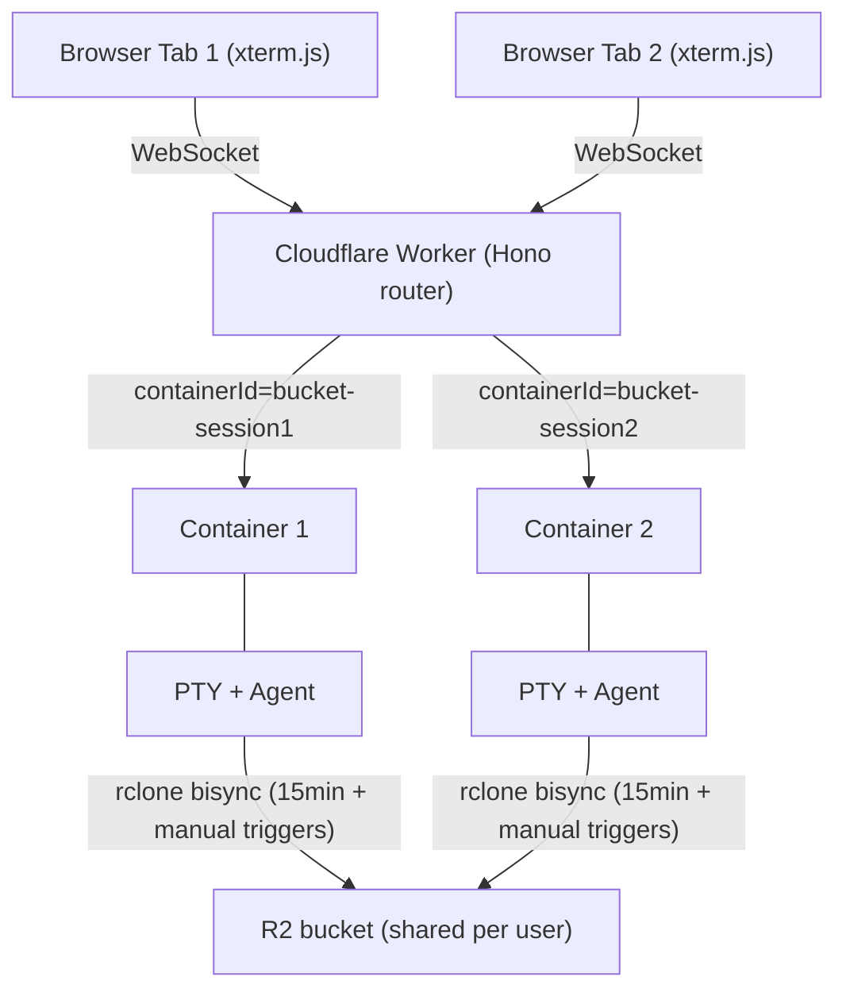
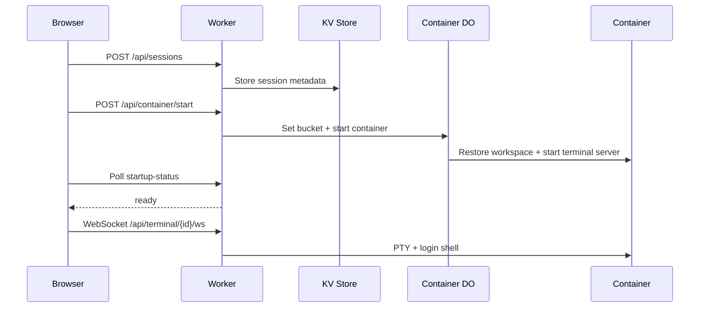
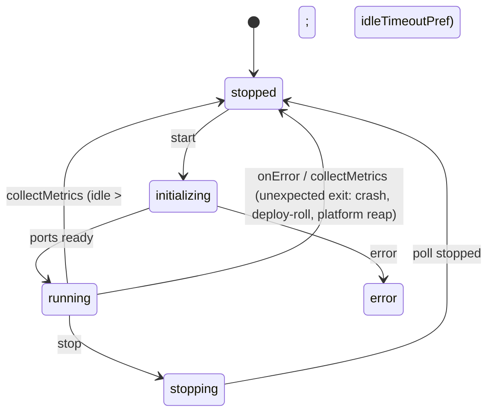
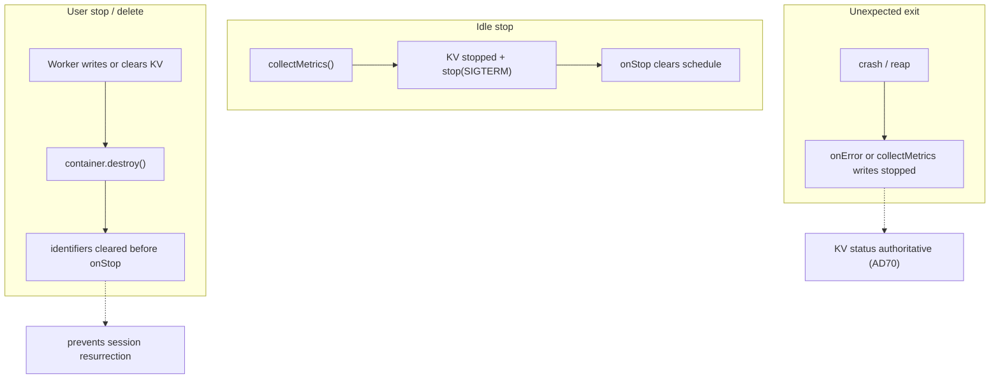
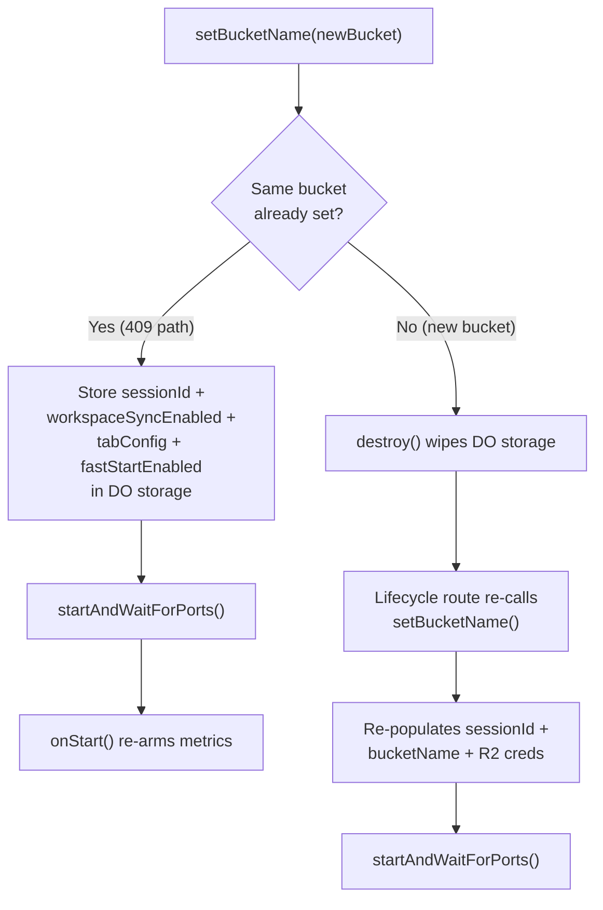
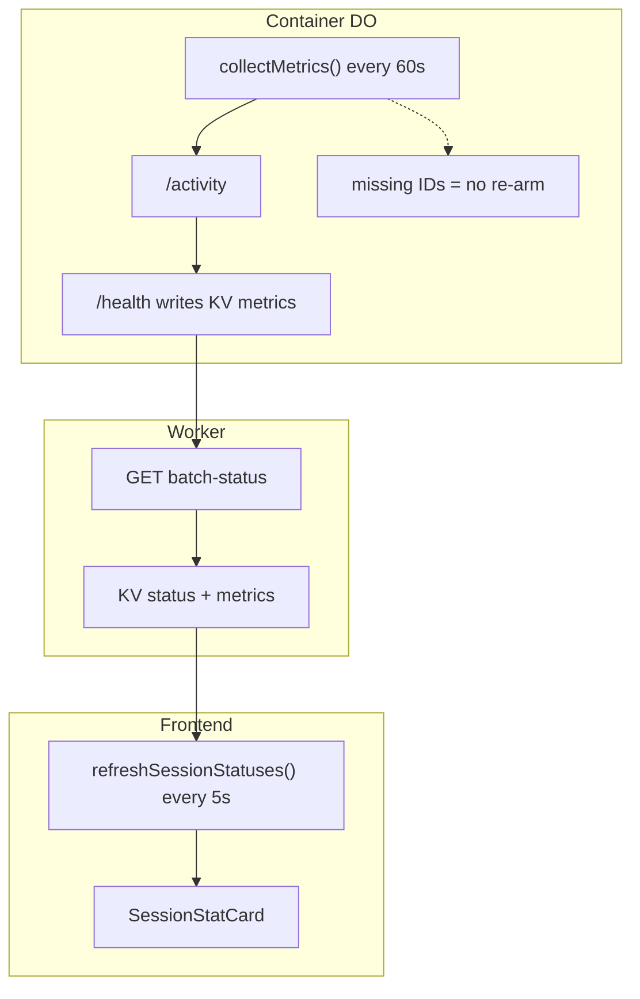
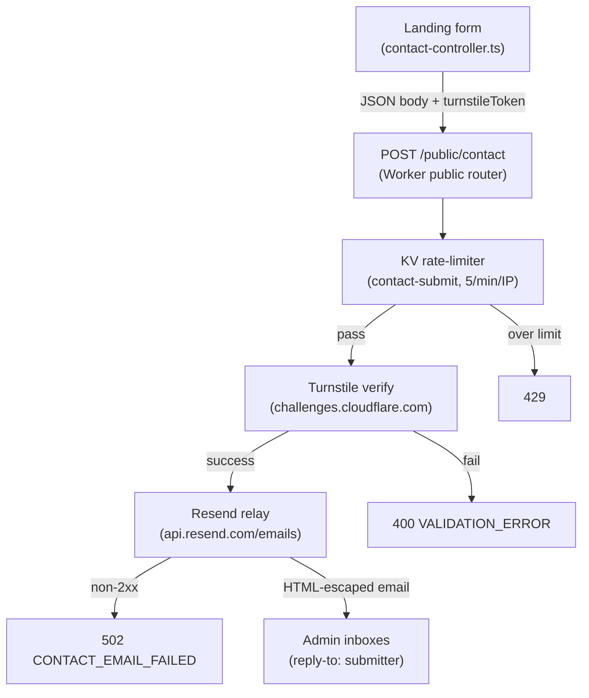

# Architecture

System architecture, components, data flow, and design rationale for Codeflare.

**Audience:** Developers

---

## Contents

- [Architecture Overview](#architecture-overview)
- [System Components](#system-components)
- [Data Flow](#data-flow)
- [Module-Level Caches](#module-level-caches)
- [Design Rationale](#design-rationale)
- [Landing composition implementation](#landing-composition-implementation)
- [Manual verification checklist](#manual-verification-checklist)
- [Specification Coverage](#specification-coverage)
- [Related Documentation](#related-documentation)

## Architecture Overview

Codeflare runs AI coding agents in isolated containers, one per browser session (tab). All sessions for a user share a single R2 bucket for persistent storage, with periodic bidirectional sync every 15 minutes plus manual triggers from the storage panel and a final sync at shutdown (see [AD56](../decisions/README.md#ad56-15-minute-bisync-cadence-with-manual-triggers)).



**Workers.dev URL:** `https://<CLOUDFLARE_WORKER_NAME>.<ACCOUNT_SUBDOMAIN>.workers.dev` - used only for initial setup. After the setup wizard configures a custom domain, all traffic should go through the custom domain (protected by the configured auth mechanism - CF Access or GitHub OIDC). In CF Access mode, the workers.dev URL should be gated behind one-click Access in the Cloudflare dashboard.

---

## System Components

### Worker (Hono Router)

**File:** `src/index.ts`

Entry point and API gateway. Handles routing, WebSocket upgrade interception, authentication (CF Access JWT or GitHub OIDC session cookies), container lifecycle through Durable Objects, and CORS with configurable allowed origins.

`src/middleware/auth.ts` owns shared authentication middleware and admin authorization through `requireAdmin`. Admin route modules run identity middleware first, then `requireAdmin`; the detailed auth model remains in [Authentication](authentication.md#authentication-modes). <!-- @impl: src/middleware/auth.ts::requireAdmin -->

**WebSocket must be intercepted BEFORE Hono routing** (required workaround for CF Workers):
```typescript
// See: https://github.com/cloudflare/workerd/issues/2319
const wsRouteResult = validateWebSocketRoute(request);
if (wsRouteResult.isWebSocketRoute) {
  return handleWebSocketUpgrade(request, env, ctx, wsRouteResult);
}
```

**CORS:** Checks static patterns from `env.ALLOWED_ORIGINS` + dynamic origins from KV (cached in memory). Uses `matchesPattern()` with domain-boundary enforcement (dot-prefixed = suffix match, bare domains = exact or subdomain with dot boundary).

**Route Registration:** `/health`, `/api/health`, `/api/auth`, `/auth`, `/public/auth/providers`, `/api/setup`, `/public`, `/api/user`, `/api/container`, `/api/sessions`, `/api/terminal`, `/api/users`, `/api/storage`, `/api/preferences`, `/api/llm-keys`, `/api/deploy-keys`, `/api/usage`, `/api/admin/tiers`

**Workers Assets Routing Guardrails (`wrangler.toml`):**

With SPA fallback (`not_found_handling = "single-page-application"`), control-plane paths must execute Worker logic first via `run_worker_first = ["/", "/login", "/login/", "/auth/*", "/api/*", "/public/*", "/health", "/landing/*"]`. Missing `/api/*` causes setup/auth flows to break (API endpoints return HTML instead of JSON); missing `/login` makes the onboarding `/login` rewrite ([REQ-AUTH-020](../../sdd/spec/authentication.md#req-auth-020-onboarding-mode-landing-integrated-login-shell)) silently fall through to the SPA because the asset layer serves it at the edge before the Worker runs.

### Container DO (container)

**File:** `src/container/index.ts` - Extends `Container` from `@cloudflare/containers`. Exported from `src/index.ts` as lowercase `container` (matching `wrangler.toml` class_name). `index.ts` is the thin DO class shell; it delegates config (`setBucketName`; and `ensureVaultKey`, now superseded for vault encryption by the HKDF `getVaultEncryptionKey` per [REQ-VAULT-021](../../sdd/spec/vault.md#req-vault-021-bucket-stable-vault-url-and-bucket-derived-key)) to `container-config.ts`, lifecycle hooks (onStart/onStop/alarm) to `container-lifecycle.ts`, internal `/_internal/*` dispatch to `container-router.ts`, and idle enforcement/metrics to `container-metrics.ts`. Together these own the full lifecycle of a single session's container: startup, idle enforcement via `collectMetrics()`, request proxying with auth token injection, and graceful shutdown with a 135-second budget for final bisync. A second DO, `Timekeeper`, is exported from `src/timekeeper/index.ts` for per-user usage tracking.

For Container DO internals including the `collectMetrics()` loop, `destroy()` override, auth token lifecycle, `setBucketName` idempotency, and SDK timer semantics, see [Container](container.md).

### LlmInterceptor (Enterprise Mode)

**File:** `src/llm-interceptor.ts`

A `WorkerEntrypoint` that transparently proxies agent LLM traffic to the customer's AI Gateway when `ENTERPRISE_MODE=active`. Instantiated per container session by the Container DO via `ctx.container.interceptOutboundHttps` + `ctx.exports`. The interceptor receives every outbound HTTPS connection the container opens to the LLM provider host (`api.openai.com`), strips the placeholder credential injected by `entrypoint.sh`, and forwards to the AI Gateway **REST API** first (`https://api.cloudflare.com/client/v4/accounts/{account_id}/ai/v1/<path>`, authenticated with `Authorization: Bearer <AIG_TOKEN>` using the Workers AI scope, plus a `cf-aig-gateway-id` header).

On a `404` from the REST API (a provider not yet on that surface, e.g. Google/Gemini today), it replays the buffered request to the **deprecated compat path** (`https://gateway.ai.cloudflare.com/v1/{account_id}/{gateway_id}/compat/<path>`, authenticated with `cf-aig-authorization: Bearer <AIG_TOKEN>` using the AI Gateway Run scope).

The 404-fallback is safe because a 404 is a complete error body, not a started stream (no double-billing, no truncation), and it stops firing automatically as Cloudflare migrates providers onto the REST API. The account id and gateway id are parsed from `AIG_GATEWAY_URL`. Only OpenAI-wire-format agents (Copilot, Pi) run in enterprise mode, both via Chat Completions (`/chat/completions`); Pi runs with `reasoning: true` but starts each session at the configured default route's reasoning grade (default `off`), so gpt-5.5 stays tools-only by default (an OpenAI **Responses API** path was evaluated but reverted).

The interceptor maps the agent's slash-free `model` handle to the gateway dynamic route `dynamic/<route>` from the Setup-configured catalog on `/chat/completions` and `/responses` ([REQ-ENTERPRISE-007](../../sdd/spec/enterprise-mode.md#req-enterprise-007-gateway-route-pinning)), failing safe to the default route on an unknown handle; an empty catalog or a non-model-routable body is forwarded unchanged. The catalog + default it enforces are resolved per the session's matched Access groups via the shared `resolveRouteCatalog` core — first matching configured group (in admin-configured order) wins, else the global catalog — the same core the container env fan (`loadEnterpriseRouteConfig`) uses, so the two routing sinks cannot drift ([REQ-ENTERPRISE-013](../../sdd/spec/enterprise-mode.md#req-enterprise-013-per-group-dynamic-routing)). On streaming `/chat/completions` it also normalizes the response stream (see **Streaming normalization** below).

See [AD74](../decisions/README.md#ad74-enterprise-llm-transport-on-the-ai-gateway-rest-api) for the REST transport (it amends [AD72](../decisions/README.md#ad72-outbound-https-interception-over-a-worker-side-llm-proxy-for-enterprise-gateway-routing), whose interception mechanism is unchanged). On the compat replay the interceptor strips OpenAI-only fields (`store`, `prompt_cache_key`) that non-OpenAI providers reject with a 400 (the REST leg keeps them, so OpenAI prompt caching is unaffected).

Per-user attribution is stamped into `cf-aig-metadata` as the IdP-verified `user` email plus one `group_<sanitized>_<hash>=1` tag per matched Cloudflare Access group (the scalar `group` key is dropped), within CF's 5-entry cap (`user` + up to 4 groups, deterministic truncation with a warn), so the customer's gateway analytics attribute usage to the real identity and can branch per-group routing/cost/rate-limit policies via an equals-filter on each `group_*` key.

The key carries a deterministic djb2/base-36 suffix of the original group name (`sanitizeGroupKey`) so lossy `[a-z0-9_]` sanitization can't collide two distinct groups (e.g. `codeflare_admins` → `group_codeflare_admins_150f5d1`); the gateway equals-filter must target that full hashed key, not the bare name. See [Enterprise Access Group Configuration](configuration.md#enterprise-access-group-configuration) for the operator-facing detail.

`ctx.exports` is default-on at the project's compat date (`2026-02-05`). No `enable_ctx_exports` compat flag is needed.

The gateway URL (`AIG_GATEWAY_URL`) and token (`AIG_TOKEN`) live exclusively in the Worker/interceptor environment. They are never forwarded to the container and never appear in any container env var or log. When `ENTERPRISE_MODE` is unset the DO never calls `interceptOutboundHttps`, the interceptor is never instantiated, and the direct-key path is byte-identical to non-enterprise deployments.

### EgressController (Strict Gateway Egress, Enterprise Mode)

**File:** `src/egress-controller.ts` (transport helpers in `src/lib/controller-egress.ts`)

A `WorkerEntrypoint` the Container DO wires as the catch-all (`interceptOutboundHttps('*', controller)`) only when the optional **Strict Gateway Egress** toggle is ON ([REQ-ENTERPRISE-016](../../sdd/spec/enterprise-mode.md#req-enterprise-016-strict-gateway-egress)). Whereas `LlmInterceptor`/`GitHubInterceptor` own specific hosts and stamp the real credential, the `EgressController` is a **transparent proxy** for every other host: it stamps no `Authorization`/`cf-aig-*`/identity header, preserves the caller's `authorization`/`cookie` on the request and `set-cookie` on the response, strips only the eight RFC 7230 hop-by-hop headers, and forwards with `redirect:'manual'` through the Workers VPC `env.EGRESS.fetch` (and from there the customer's Cloudflare Gateway). Its only job is to force otherwise-unintercepted **direct-internet** traffic onto the mandatory Gateway boundary.

It exempts only THIS deployment's own-account destinations via `isAccountScopedDestination(url, accountId)` (`src/lib/controller-egress.ts`, account id from `ctx.props.accountId`), checked **before** the `env.EGRESS` guard: own-account R2 (`<accountId>.r2.cloudflarestorage.com` + vhost form, rclone bisync) and the own-account CF API / Browser Rendering path (`api.cloudflare.com/client/v4/accounts/<accountId>/...`) egress **direct** even when the binding is unbound. Any other account's R2/CF host — and all genuine direct-internet hosts — ride `env.EGRESS`/the Gateway (an absent account id exempts nothing; fail-secure).

Own-account R2 is **re-signed** with the worker-held R2 key (`createR2Client`/aws4fetch, reusing the request's `x-amz-content-sha256` so the body streams unbuffered and SSE-C headers are preserved) at the boundary, so the container carries only a non-secret placeholder R2 key; **WebSocket upgrades** reaching this catch-all are proxied by **bridging a fresh `WebSocketPair`** to the upstream socket (frames/close/error forwarded both ways), not returned as-is. (browser-run's `api.cloudflare.com` Browser Rendering — REST + CDP WS — is claimed ahead of this catch-all by the dedicated **`CloudflareBrowserInterceptor`** ([REQ-BROWSER-008](../../sdd/spec/browser-run.md#req-browser-008-browser-rendering-token-interception-never-in-the-container)), which strips the container's non-secret placeholder and injects the real Browser Rendering token worker-side, account-scoped to the wizard-configured account;

the CF-API/Browser-Rendering passthrough here is a dormant fallback that can only ever carry the placeholder.) `strict` + `accountId` are resolved once by the DO (constructor) and passed via `ctx.props` — no per-request KV read — and a per-op diagnostic debug log (`{h, sc, tx, rs, fMs}`, off by default — `LOG_LEVEL=debug` to enable) makes the routing + worker-side latency observable (temporary, for the R2-speed measurement). See [AD86](../decisions/README.md#ad86-platform-native-cloudflare-primitives-bypass-strict-gateway-egress-only-direct-internet-egress-takes-cf1network) and [AD87](../decisions/README.md#ad87-egresscontroller-re-signs-own-account-r2-container-holds-a-placeholder-key-bridges-websocket-upgrades-and-resolves-strict-via-props).

The toggle is a global admin flag persisted in KV (`SETUP_KEYS.STRICT_EGRESS`, `'active'`/`'inactive'`, default OFF) and resolved by `hasStrictGatewayEgress(env)` = enterprise mode AND KV `=== 'active'` — read from KV **once** at container-start (the `ENTERPRISE_MODE` precedent), not threaded per-session and not re-read per request: the DO resolves it in its constructor into `_strictEgress` and passes `strict` to the `EgressController` via `ctx.props` (the controller fails closed with `503 EGRESS_NOT_CONFIGURED` if the prop is absent/false), and `buildEnvVars` reads the same `_strictEgress` to choose the placeholder vs real R2 key so the wiring and container creds always agree. A transient KV error returns `false` (OFF) so the container still boots rather than failing the start.

The per-host LLM/GitHub registrations co-exist with and take precedence over the `'*'` catch-all (SDK precedence: deniedHosts > per-host > catch-all > allowedHosts > enableInternet), and when strict is ON the `GitHubInterceptor` swaps its single upstream `fetch` to `env.EGRESS.fetch` (GitHub is external; the `LlmInterceptor`'s AI Gateway upstream is platform-native and **always** egresses direct, so it never swaps — see [AD86](../decisions/README.md#ad86-platform-native-cloudflare-primitives-bypass-strict-gateway-egress-only-direct-internet-egress-takes-cf1network)).

The defining property is **fail-closed**: when strict is ON but `env.EGRESS` is unbound, the controller (on direct-internet hosts, incl. any other account's Cloudflare host) and the `GitHubInterceptor` return `503 EGRESS_UNAVAILABLE` and never fall back to global `fetch` — this account's own-account destinations (R2 + account-scoped CF API / Browser Rendering) and the AI Gateway stay exempt and egress direct; the controller additionally rejects SSRF literal-IP targets with `403 EGRESS_TARGET_BLOCKED` before any send. The `[[vpc_networks]]` `EGRESS` binding is enterprise-only — committed commented-out and injected by `deploy.yml` only when `ENTERPRISE_MODE=active` — so on non-enterprise deploys OFF + unbound is inert. See [Strict Gateway Egress](#strict-gateway-egress) for the data flow, [Security](security.md#strict-gateway-egress-enterprise-mode) for the boundary properties, and [AD85](../decisions/README.md#ad85-controller-mediated-cloudflare-gateway-egress-as-a-mandatory-web-boundary-wizard-toggled-default-off).

### CloudflareBrowserInterceptor (non-enterprise OAuth mode)

**File:** `src/cloudflare-browser-interceptor.ts` (wired in `src/container/index.ts::wireCloudflareApiInterception`).

The same `WorkerEntrypoint` that injects the enterprise Browser Rendering token ([REQ-BROWSER-008](../../sdd/spec/browser-run.md#req-browser-008-browser-rendering-token-interception-never-in-the-container)) serves a **second mode** for **non-enterprise Connect-to-Cloudflare OAuth** sessions ([REQ-AGENT-078](../../sdd/spec/agents.md#req-agent-078-cloudflare-oauth-token-refreshed-at-the-apicloudflarecom-boundary)). Because a dashboard OAuth access token is short-lived and nothing can refresh an env var inside a running container, the container is given only the non-secret placeholder `codeflare-oauth`, and this interceptor is wired for `api.cloudflare.com` to re-stamp **every** request (all paths — the OAuth token is full-scope) with a token freshly minted by `getValidCloudflareToken(bucket)` (refreshed via the stored per-user `refresh_token`).

Both the REST surface (`wrangler`) and the CDP WebSocket upgrade (browser-run) ride the interceptor's existing `relay()`/`bridge()` transport, so a session outlives the access-token TTL. The token is resolved solely from the session-bound `props.bucket` (never a request header) and the interceptor fails closed `401` with no upstream when no valid token can be minted.

The OAuth mode also intercepts the AI Gateway data-plane host `gateway.ai.cloudflare.com` (stamped as `cf-aig-authorization`, [REQ-AGENT-078](../../sdd/spec/agents.md#req-agent-078-cloudflare-oauth-token-refreshed-at-the-apicloudflarecom-boundary) AC5). The platform TLS-terminates both intercepted hosts with a mounted intercept CA (`/etc/cloudflare/certs/cloudflare-containers-ca.crt`); `entrypoint.sh` trusts it for the container's agent runtimes (Node/wrangler/curl) in a non-enterprise-only block gated on `ENTERPRISE_MODE != active` + CA-presence (AC6), separate from the enterprise CA-trust.

`wireCloudflareApiInterception` is double-guarded — it acts only when `!isEnterpriseMode(env)` **and** the container's `CLOUDFLARE_API_TOKEN` equals the OAuth placeholder (distinct from the enterprise `codeflare-enterprise` value) — so it can never wire or collide on `api.cloudflare.com` in enterprise, and the enterprise branch above is unchanged. The GitHub interceptor is not involved: non-enterprise git stays direct (GitHub tokens are long-lived). See [AD93](../decisions/README.md#ad93-refresh-the-non-enterprise-cloudflare-oauth-token-at-the-apicloudflarecom-boundary-reusing-the-browser-interceptor).

### GitHub Integration

A GitHub panel sits beside the R2 storage panel: a connected user browses and clones their repos, and the in-session agent acts with the user's own GitHub permissions. The panel renders whenever GitHub is enabled — there is no session-tier gate — and GitHub leads as the default right-column face on every session ([REQ-GITHUB-007](../../sdd/spec/github.md#req-github-007-broaden-the-panel-gate-beyond-enterprise)).

**Components:**

- **Routes** `src/routes/github.ts` - `/api/github/status|repos|connect|disconnect|clone`, plus the OAuth callback `src/routes/github-auth.ts`.
- **Token store + provider seam** `src/lib/github-token.ts` - `getGithubProvider`, `getValidGithubToken`, `connectGithub`, `disconnectGithub`, backed by the **existing** deploy-keys KV entry `DeployKeys.githubToken` (no new KV key), encrypted via `kv-crypto`.
- **Enterprise interceptor** `src/github-interceptor.ts` - the `GitHubInterceptor` WorkerEntrypoint, wired in `src/container/index.ts` (`wireGithubInterception`).
- **Container env** `src/container/container-env.ts` (`buildEnvVars`) and `entrypoint.sh` (clone-on-start); host `host/src/git-clone.ts` + `host/src/server.ts` (`/internal/git-clone`).
- **Frontend** `web-ui/src/components/github/` (panel, repo list, ClonePicker) + `web-ui/src/api/github.ts`.
- **Repository list UX**

    `web-ui/src/components/github/RepoList.tsx` and `web-ui/src/styles/github-panel.css` render no-repos/search-empty states and present repos inside an anchoring split with Storage: GitHub is pinned to the top, Storage to the bottom; the shorter panel shrinks to its content while the taller absorbs the slack, meeting at 50/50 when both are full ([REQ-GITHUB-009](../../sdd/spec/github.md#req-github-009-github-repository-list-viewport-and-empty-states)).
- **Adaptive split / face switching**

    `web-ui/src/components/Dashboard.tsx` (`effectiveFace` + `decidePanelLayoutMode` in `web-ui/src/lib/panel-allocation.ts`) and `web-ui/src/components/github/GitHubPanel.tsx` run the GitHub+Storage split on desktop/tablet and swap to a single face with a flip control when the viewport is narrower than the mobile breakpoint or the column is too short for both panels (the narrow check reads the viewport width, not the column's own width, which the layout caps small). GitHub leads — it is the default face on every enabled session — and Storage becomes the sole face only when GitHub is disabled ([REQ-GITHUB-010](../../sdd/spec/github.md#req-github-010-mobile-github-and-storage-face-switching)).

On desktop/tablet the panel expands to 80vh (centered, via `.dashboard-panel:not(--expanded)` in `web-ui/src/styles/dashboard.css`) and the two faces stack as a JS-measured anchoring split: `measureLayout`/`measureNatural` in `Dashboard.tsx` measure each face's natural height (panel chrome + the scroller's `scrollHeight`, with the cap removed), re-run on a ResizeObserver/MutationObserver, and write it as an inline `max-height`; the faces are `flex: 1 1 0` capped at that measured height with `justify-content: space-between`, so GitHub anchors to the top and Storage to the bottom — a short panel sits at its content while the larger one absorbs the slack, both meeting at 50/50 when full.

`panel-allocation.ts` only decides split-vs-flip; the per-face allocation is the flex engine's, fed by those measured caps.

    In single-panel (flip / mobile) mode the panel is content-sized and centered, and the active face sizes to its content up to one shared viewport cap (`max-height: 75vh` for both faces — mobile shows a single flip face at a time, so GitHub and Storage cap identically and flipping never resizes the panel; overflow scrolls inside `.github-repo-rows`/`.storage-drop-zone`), so a short panel — the connect card or a few repos — collapses instead of reserving the column ([REQ-GITHUB-010 AC7](../../sdd/spec/github.md#req-github-010-mobile-github-and-storage-face-switching)).
- **Search disclosure**

    on every breakpoint `GitHubPanel` hides the repo search behind a magnify toggle in `ConnectedHeader` (left of Refresh) so the list keeps its full whole-row viewport; revealing it focuses the input synchronously in the tap/click handler (so the on-screen keyboard opens on touch), and closing it clears the filter. Touch additionally runs `scrollFieldAboveKeyboard` (`web-ui/src/lib/mobile.ts`) to scroll the input above the keyboard via `visualViewport`. There is no longer an always-on desktop search bar ([REQ-GITHUB-011](../../sdd/spec/github.md#req-github-011-mobile-search-disclosure-with-autofocus)).

**Two credential transports** (the core architectural decision, [AD81](../decisions/README.md#ad81-reuse-the-container-egress-injection-layer-for-per-user-github-tokens)):

- **Enterprise (egress injection):**

    The container holds only a non-secret placeholder `GH_TOKEN` (`codeflare-enterprise`). `interceptedGithubHosts(env)` registers `github.com` + `api.github.com` + Copilot's remote GitHub MCP host `api.githubcopilot.com` (overridable via `GITHUB_HOST` / `GITHUB_API_HOST` / `GITHUB_COPILOT_MCP_HOST`) for outbound-HTTPS interception, **reusing the same AI-Gateway `interceptOutboundHttps` layer** as the LLM path. On each request the `GitHubInterceptor` looks up and decrypts the user's token (scoped solely by the wiring-time `props.bucket` binding), strips client auth, and stamps git Basic (`x-access-token:token`) for the web host, `Bearer` + `X-GitHub-Api-Version` for the API host, or `Bearer` (no API-version header) for Copilot's `api.githubcopilot.com/mcp` — without which Copilot CLI's built-in `github-mcp-server` rides the strict-egress catch-all to the Gateway unauthenticated and its handshake fails; it **fails closed** when no token is present.

    AI hosts continue to route to the LLM interceptor - one host→interceptor map, two WorkerEntrypoints, one responsibility each ([REQ-GITHUB-003](../../sdd/spec/github.md#req-github-003-enterprise-egress-injected-github-credentials)). Wired only when `ENTERPRISE_MODE=active`, at container start (CA-mount timing).
- **Non-enterprise (container transport):** The real token flows to the container as `GH_TOKEN` via the existing deploy-keys→env path, unchanged ([REQ-GITHUB-006](../../sdd/spec/github.md#req-github-006-other-mode-container-transport)).

### Terminal Server (node-pty)

**File:** `host/src/server.ts` - Node.js/TypeScript server inside the container. Single port 8080 for WebSocket + REST + health/metrics.

Sync handled entirely by `entrypoint.sh` (15-minute daemon, SIGUSR1-interruptible for manual triggers). Terminal server reads sync status from `/tmp/sync-status.json` and exposes via `/health`. The user-facing manual trigger surface is the Worker route `POST /api/sessions/sync`, which fans out per-session to each of the user's running containers; the per-container host endpoint it reaches is `POST /internal/bisync-trigger`, which reads `/tmp/sync-daemon.pid` and sends SIGUSR1 to the daemon. See [AD56](../decisions/README.md#ad56-15-minute-bisync-cadence-with-manual-triggers) and [REQ-STOR-015](../../sdd/spec/storage.md#req-stor-015-explicit-sync-trigger-from-ui). Activity tracking (WebSocket connection state + user input timestamps: `hasActiveConnections`, `connectedClients`, `activeSessions`, `disconnectedForMs`, `lastInputAt`) for hibernation decisions via `GET /activity`. Unknown JSON `type` strings are silently ignored (guard against future message types leaking to PTY).

**Auth-Exempt Paths:** The terminal server validates `Authorization: Bearer <token>` on all HTTP requests. `/health` and `/activity` are in the `authExemptPaths` Set at `host/src/server.ts` because `collectMetrics()` calls them directly via `ctx.container.getTcpPort(TERMINAL_SERVER_PORT).fetch(...)` from inside the DO class - that path enters the container over the SDK's private TCP plumbing and never runs through the public `fetch()` override, so no `Authorization` header is injected. The whitelist is safe because these two paths expose no user data and no mutable container state. The `/activity` endpoint is also exempted from auth in the DO-level `fetch()` override so internal health checks don't require token injection.

**`GET /activity` Endpoint:** Returns `{ hasActiveConnections: boolean, connectedClients: number, activeSessions: number, disconnectedForMs: number | null, lastInputAt: number | null }`. Consumed exclusively by the Container DO's `collectMetrics()` poll. Active connections = WebSocket clients currently connected. `disconnectedForMs` tracks time since all clients disconnected (null while clients are connected). `lastInputAt` is the Unix timestamp (ms) of the last real user input - determined by `containsUserInput()` after `stripTerminalResponses()` removes terminal protocol chatter (CPR, OSC, DA). This is the authoritative signal for codeflare's "user has walked away" idle policy.

**Idle Detection (Single Source of Truth):** Idle hibernation is enforced exclusively by `collectMetrics()`, which polls `/activity` every 60 s and computes `idleMs = Date.now() - (lastInputAt ?? containerStartedAt)`. When this exceeds `parseSleepAfterMs(idleTimeoutPref)`, it writes KV status `'stopped'` and calls `this.stop('SIGTERM')` directly. See [REQ-SESSION-004](../../sdd/spec/session-lifecycle.md#req-session-004-idle-containers-sleep-after-configurable-timeout) / [REQ-SESSION-005](../../sdd/spec/session-lifecycle.md#req-session-005-input-based-idle-detection). A secondary per-PTY reaper in `host/src/server.ts` (`PTY_KEEPALIVE_MS`, default 240 min / 4h) acts as a safety net if `lastInputAt` tracking gets stuck. It is floor-clamped at the maximum `sleepAfter` so it cannot fire before the authoritative `collectMetrics` path. See [AD47](../decisions/README.md#ad47-pty-keepalive-as-safety-net-only-not-the-idle-policy).

The SDK's `sleepAfter` timer is intentionally disabled - it's pinned to `'24h'` so it never fires in normal operation. This is necessary because `@cloudflare/containers` v0.2.x refreshes the SDK timer on every WebSocket message in both directions, which would give "any traffic" semantics (containers running `tail -f` or `yes` would never sleep even after the user walks away). Codeflare needs "no user input" semantics, which only an in-container PTY tracker (the terminal server's `lastInputAt`) can provide.

The `containerStartedAt` fallback is critical: if a user opens a terminal but never types, `lastInputAt` stays `null`. Without the fallback, the idle check would be skipped and the container would run forever. With the fallback, idle time is measured from container start, so an unused terminal still stops after the configured timeout.

`containsUserInput()` in `host/src/session.ts` uses a whitelist approach - only actual keypresses count (printable characters, control keys, arrow keys, function keys, Alt+key, mouse clicks). Terminal protocol responses (CSI, OSC, DCS, APC, focus reports, mouse movement) do not count. `stripTerminalResponses()` removes terminal emulator response sequences (CPR, OSC 10/11/12, DA1) before writing to the PTY. Scenarios: user stops typing → container stops after `sleepAfter` + up to 60s (poll granularity); browser closed → same; user opens terminal but never types → container stops after `sleepAfter` from start time.

**Timestamp taxonomy (four distinct timestamps, often confused):**

| Field | Source / owner | Advances on | Used for |
| --- | --- | --- | --- |
| `lastInputAt` | terminal server `/activity` (`host/src/session.ts`) | PTY **keystrokes only** - not output, not WS traffic, not vault/SB activity, not autonomous-agent output | The idle reference for `collectMetrics`. A long agent run with no keystrokes looks "idle". |
| `lastSeenInputAt` | Container DO in-memory cache of the last non-null `lastInputAt` | New keystroke observed by the poll | Surviving a poll where `/activity` momentarily returns `null`. |
| `lastActiveAt` | KV session record (written by `updateKvStatus`) | Input-driven status writes + the sleep-timer path | Dashboard "last active" display; persisted across hibernation. |
| `metrics.updatedAt` (`m.u` in list metadata) | `collectMetrics` heartbeat | **Wall-clock, every tick**, regardless of input | Metrics-staleness display **only**. **Not** a liveness signal - it freezes when the alarm loop is not running (hibernation). A heartbeat-age heuristic over this field previously caused false "stopped" kicks; removed in [codeflare#153](https://github.com/nikolanovoselec/codeflare/issues/153). Liveness comes from the authoritative KV `status`. |

**WebSocket Wake-Loop Prevention:** Three layers prevent browser auto-reconnect from waking a hibernated container in an infinite stop/start cycle:
1. **DO fetch gate** (`container/index.ts`): The `fetch()` override returns 503 for non-internal routes while the container is stopped.

   The DO reads container state directly, avoiding KV, and does not call the SDK path that starts a stopped container.
2. **Terminal route guard** (`routes/terminal.ts`): Rejects WebSocket upgrade requests with 503 when `session.status === 'stopped'` in KV. This is defense-in-depth - catches requests before they reach the DO.
3. **Frontend disposal** (`stores/session.ts`): The session poller disposes terminal state on a running-to-stopped transition, ending that session's WebSocket retry loops.

   A fresh connection starts only after the user explicitly restarts the session.

**WebSocket Protocol:** Raw terminal data (NOT JSON-wrapped). Control messages (resize, focus ownership, process-name, restore) as JSON. No application-level ping/pong -- Cloudflare handles protocol-level WebSocket keepalive for DO/Container connections. Headless terminal (xterm SerializeAddon) captures full state for reconnection.

**Resize Authority:** A PTY can have multiple browser WebSocket clients, but only the foreground owner is allowed to apply resize frames. The first client owns resize by default; a focused terminal sends a `focus` control frame before its resize frame; a pane that loses focus before its WebSocket opens clears the queued focus claim. When the owner detaches, authority falls back to the remaining client. This prevents stale hidden clients from shrinking a shared PTY back to old dimensions. <!-- @impl: host/src/session.ts::claimResizeAuthority --> <!-- @impl: host/src/session.ts::resize --> <!-- @impl: host/src/session.ts::detach --> <!-- @impl: web-ui/src/stores/terminal.ts::claimResizeAuthority --> <!-- @impl: web-ui/src/stores/terminal.ts::clearPendingResizeAuthority -->

**PTY:** Spawns `bash -l` (login shell for .bashrc) with `xterm-256color`, truecolor support.

**Terminal emulator response stripping:** `stripTerminalResponses()` in `host/src/session.ts` strips terminal emulator responses (CPR, OSC 10/11/12, DA1) from WebSocket input before writing to the PTY. These responses are generated by xterm.js in reply to terminal queries issued by CLI tools (e.g., `gh secret set` reads an OSC 11 response as the secret value). `containsUserInput()` then classifies the original data using a whitelist approach: printable characters, control keys (Enter, Backspace, Tab, Ctrl+key), arrow keys, function keys, Alt+key, and mouse clicks count as user input for idle detection. Terminal protocol chatter (CSI/OSC/DCS/APC sequences, focus reports, mouse movement/release) does not count. The `Session.write()` method calls both: PTY receives the filtered data, and `activityTracker.recordInput()` is called only when `containsUserInput()` returns true.

### Landing (Astro, prerendered)

**Directory:** `landing/`

The public enterprise marketing site ([REQ-LANDING-001](../../sdd/spec/landing.md#req-landing-001-mode-aware-public-landing-serving)). Builds to static HTML in `web-ui/dist/landing/` (base path `/landing`), so the existing `[assets]` binding serves it with no extra deployment. The Worker long-caches the content-hashed `/_astro/` build assets (`Cache-Control: public, max-age=31536000, immutable`) while HTML keeps its revalidating default, and both the landing layout and the SPA shell declare `color-scheme: dark` with an inline root paint so cross-document navigations (landing ↔ `/login`) never flash a white canvas ([REQ-LANDING-004](../../sdd/spec/landing.md#req-landing-004-first-paint-stability-and-immutable-asset-caching)).

The landing also opts every same-origin full-page navigation into a cross-document view transition (`@view-transition { navigation: auto }` in `landing/src/styles/global.css`), so the browser holds the current page during the document swap and Chromium-fork browsers (Vivaldi/Arc/Brave) never expose their gray navigation canvas ([REQ-LANDING-004](../../sdd/spec/landing.md#req-landing-004-first-paint-stability-and-immutable-asset-caching) AC3).

Directly under the primary hero, the landing renders a second hero band (`#inference-mesh`), a `<header>` that mirrors the primary hero rather than a `main > section`, positioning the mesh as one optional additional inference source Codeflare can pull from — reusing the idle machines a company already owns for private, low-cost inference — not its only or default inference path, since every hosted provider stays first-class as default or fallback.

The band is anchored as a sibling hero by a plain white `Inference Mesh` section-h2 (no coral flare, no scramble) under a right-aligned `~/inference` path-tag chiplet (the shared `.kicker`), both right-aligned on desktop to mirror the left proof terminal, and its call to action is the shared `.micro-cta` text link (`MicroCta.astro`) rather than a filled button.

It reuses the landing's static Astro composition and the shared Terminal/Transcript proof chrome — a concrete `codeflare-mesh` inference call whose bottom command line runs the shared typed reel (`data-ft-loop`) — rather than a new route or a new animation. ([REQ-LANDING-005](../../sdd/spec/landing.md#req-landing-005-inference-mesh-family-hero))

After the `#platform` section, a dedicated `#ide` band ([REQ-LANDING-007](../../sdd/spec/landing.md#req-landing-007-browser-ide-continuity-band)) presents the per-session Browser IDE as the bridge from the traditional SDLC to agentic development: the full VS Code workbench built on the shared `<Terminal>` chrome (`CodeEditor.astro`, content from `IDE`). The body slot is a three-column workbench (an activity rail, an explorer file tree, and an editor whose CSS-counter-numbered code pane sits over an integrated terminal); the editor tab (plus unsaved-change dot) rides `bar`; the status bar rides `foot`.

It fills the width on desktop and folds the rail and explorer away on narrow viewports, and the integrated terminal streams the agent's activity via the shared typed reel (`feature-terminals.ts`) in the page's one locked coral accent, never VS Code blue.

The Worker rewrites unauthenticated `GET /` to `/landing/` in SaaS and onboarding modes; default mode keeps the `/app/` redirect, and a missing landing build falls back to the SPA via `not_found_handling`.

In onboarding mode (`ONBOARDING_LANDING_PAGE` active, `SAAS_MODE` not active) the Worker also rewrites `GET /login` to the landing-built sign-in page at `/landing/login/` ([REQ-AUTH-020](../../sdd/spec/authentication.md#req-auth-020-onboarding-mode-landing-integrated-login-shell)) so onboarding sign-in shares the landing tokens, fonts, and nav chrome while staying visually quiet: it preloads the shared fonts, uses a static flare motif, and omits the marketing page's WebGL/motion/proof hooks for a stable first paint; SaaS mode keeps the SPA `/login` provider chooser unchanged. Layered internally: design tokens (`landing/src/styles/tokens.css`) → global CSS → typed content (`landing/src/content/site.ts`) → markup components → pages.

The hero terminal and all content render statically (no JS); browser logic is enhancement-only and opted into by the marketing page rather than by every `BaseLayout` consumer: the unit-tested contact controller (`contact-controller.ts`) with a thin DOM adapter, plus presentational scroll-reveals, the hero top-line capability ticker (`hero-kicker.ts`, advancing the active word and measuring its width while the server markup already contains the full stack), a reduced-motion-safe scramble on the single hero accent word (`scramble.ts`),

and a cursor- and scroll-reactive WebGL flare-fluid behind the whole page (`splash.ts` + the `splash-*` / `webgl-utils` fluid set: a fixed full-page layer, vivid behind the hero and veiled to a legible wash below, paused while the tab is hidden; `html.flare-on` is rendered by the layout before first paint so splash startup never flips page-wide visual classes — desktop pointers drive it with the cursor, touch devices drive it from the finger position during an active swipe (the scroll sweep is suppressed while a finger is down) and from page scroll when no finger is touching, and reduced-motion or no-WebGL visitors simply get no canvas),

and `proof.ts` (adds `.is-live` to each `[data-proof]` artifact once on scroll-in to play a one-shot reveal sequence; the markup ships the resolved final state, so the body's proof artifacts stay fully legible with no JS), and `agentfoot.ts` (a calm coding-agent statusline foot on the hero terminal: a slow context-percent tick and an occasional compaction beat, with the server-rendered foot as the reduced-motion and no-JS fallback), and `feature-terminals.ts` (drives the typing-loop animation on every `[data-ft-loop]` element with a `[data-ft-typed]` child: the feature-terminal grid in the shift section and the hero terminal's bottom command line, each typing a short command, holding, deleting,

and looping to the next with staggered starts so the terminals are never in sync; the server-rendered first command plus the CSS caret blink is the reduced-motion and no-JS fallback), none of which gate content. The shift section (`id="shift"`) presents a feature-terminal grid: four `FeatureTerminals` tiles, each showing a live-typed agent command (`feature-terminals.ts`) with a tile title, command lines, and a caption foot.

The spine-run-bound artifacts (the self-healing enforcement gate, the egress-inspection strip, the parallel review board, and the cost ledger) are keyed to one example run (the `SPINE` constant) sourced once in `site.ts` so their IDs cannot drift; the security boundary and the one egress call are folded into one merged terminal (`id="security"`, `.gate.boundary`): the boundary rows (each an actor, a `state` of `pass` or `deny` rendered as an `is-pass` / `is-deny` class, and descriptive text,

with at least one approved path and one the architecture makes impossible) roll in, a left-aligned `.gate-echo` command echo issues the one outbound model call (`EGRESS.call`) above a thin in-terminal divider, the egress rows render beneath and animate (roll, via `data-roll`) like the boundary rows above, keeping the `is-redact` DLP amber beat, and a single in-chrome foot closes the receipt (the AI Gateway is named as the egress control).

A legacy-rescue section (`id="legacy"`) sits between method and operations, its standard section head (terminal-path tag + h2 + lead) and narrative terminal paired as a `.split-band` (copy beside the terminal, single column on mobile and side by side from 820px) so the terminal fills its column instead of a dead right gutter, showing `/sdd init` reverse-engineering a legacy codebase into a spec-driven baseline and `/sdd clean` realigning a drifted spec.

Every top-level section opens the same way (a terminal-path tag `~/<name>` via `SECTION_KICKERS` / `.kicker`, rendered mono and lowercase with a CSS `~/` accent prefix, then the h2 and lead at full width), so sections read as calm peers in document order, cued by that per-section tag (the structural replacement for the removed numbered spine and the earlier uppercase eyebrow;

the five nav-pillar sections reuse their pillar word) and the alternating `--alt` section backgrounds rather than a counter, with the secondary bands (e2e, tenancy, runs-everywhere, trusted-by) folded into their parent section as subordinate `.substation` sub-content (a nested terminal-path tag like `~/platform/runs-everywhere` above an `--fs-subhead` sub-head) so nothing floats; the operations section (`id="operations"`) is a top-level peer placed directly before security, presenting the "operate" surface of the Directed Execution Model as a governed infrastructure run in the security gate grammar (Zero-Trust-scoped reach, operator-approved plan, out-of-scope paths denied);

in the context section (`id="context"`) the browser-isolation web fetch and the agent-steered e2e each render as a `.split-band` (copy beside the proof terminal, single column on mobile and side by side from 820px, so the narrow-content terminals fill their column), the e2e introduced by a `.substation` sub-head. The dogfood section (`id="dogfood"`) is a self-referential proof: it presents this landing page as REQ-LANDING-001 built via the SDD workflow (real `@impl`/`@test` anchors, Status: Implemented, an illustrative shipping PR), and its CTA is the page's only link to the public repository (`GITHUB_URL`) for source verification.

A Sign in action in the nav links to the SPA login provider-chooser (`/login`, `APP_LINKS.signIn`); the footer is reduced to a single centered "Built with Codeflare" line (no logo, nav links, Sign in, or GitHub mark); `/app/` is not used because the SPA guard redirects an unauthenticated visitor back to the landing before the login UI renders.

Discoverability documents (REQ-LANDING-003) are served by the Worker at the deployment root before the setup gate, mode-aware: in a public mode (SaaS or onboarding) `robots.txt` (built in `src/lib/seo.ts`) advertises the marketing surface and points at `sitemap.xml` + an `llms.txt` product summary at the canonical origin; a private (default/enterprise) deployment returns a disallow-all `robots.txt` and 404s the sitemap/llms. The landing also emits a schema.org JSON-LD graph (Organization + WebSite + a home-page SoftwareApplication) and the OG/Twitter card points at the brand image at `/og.png`. See `landing/README.md`.

### Frontend (SolidJS + xterm.js)

**Directory:** `web-ui/`

Key files: `App.tsx` (root), `Terminal.tsx` (xterm.js), `TerminalTabs.tsx`, `TerminalArea.tsx` (renders only visible workspace panes), `TerminalGrid.tsx` (shared tiled pane grid), `Layout.tsx` (orchestrates dashboard/terminal workspaces, manages WS disconnect/reconnect lifecycle), `SessionStatCard.tsx` (real-session Dashboard card with three-color status dot and metrics), `StorageBrowser.tsx` (R2 browser with toolbar), `StoragePanel.tsx` (slide-in drawer), `SettingsPanel.tsx`, `Dashboard.tsx` (new-session button plus icon-only MultiView reopen action), `SessionDropdown.tsx` (session + MultiView selection), `OnboardingLanding.tsx`, `OnboardingPage.tsx` (guided setup), `SubscribePage.tsx` (subscription flow), `UsagePage.tsx` (usage dashboard), `LoginPage.tsx` (SaaS login), `Header.tsx` (nav + user dropdown + inline usage), `KittScanner.tsx`.

Stores: `terminal-workspace.ts` (active workspace and visible pane ownership: dashboard, single session, or `MultiView #1`), `terminal.ts` (WebSocket state, compound key `sessionId:terminalId`, scheduled disconnect/reconnect), `terminal-url-detection.ts` (URL detection signals for floating buttons), `terminal-layout.ts` (terminal layout state), `session.ts` (CRUD, `terminalsPerSession`, `stopSession()` sets `'stopping'` and polls, `refreshSessionStatuses()` for lightweight dashboard polling - also updates storage stats from batch-status via `updateStatsFromBatch()`; mirrors `enterpriseMode` and `saasMode` from `/api/user` via `App.tsx`), `storage.ts` (R2 operations), `setup.ts`, `tiling.ts` (per-session tiled tab layout), `session-tabs.ts` (tab configuration).

**Accent theming:** `settings.ts` exposes `applyAccentColor(hex)`, which writes `--accent-hue` / `--accent-s` / `--accent-l` (HSL decomposition) plus `--color-accent-contrast` (the foreground for accent-filled controls, derived by a YIQ-brightness helper `accentContrast`: warm near-black `#160a06` on bright accents, near-white `#fafafa` on dark ones). The default accent is the brand coral `#ff5c3c` (`DEFAULT_ACCENT_HEX` in `AppearanceSection.tsx`, HSL default in `design-tokens.css`), so the app matches the landing / login / OG; `--color-accent-contrast` is the text color of the New Session button, the shared primary `Button`, and the accent controls in the header, settings, storage, file-preview, onboarding, and setup styles (it resolves to white for a dark accent, so it is inert there).

**Dashboard tips:** `TipsRotator.tsx` rotates usage tips filtered by device (mobile / desktop / general) and by mode: tips flagged `saasOnly` (e.g. Pro mode, metered usage) are hidden unless `sessionStore.saasMode` is set, so onboarding / enterprise / default deployments never advertise features they do not have.

#### Visible Terminal Workspace and MultiView

The frontend implements [REQ-TERM-011](../../sdd/spec/terminal.md#req-term-011-visible-terminal-panes-own-websocket-connections), [REQ-TERM-012](../../sdd/spec/terminal.md#req-term-012-multiview-virtual-session-workspace), and [REQ-TERM-013](../../sdd/spec/terminal.md#req-term-013-multiview-selection-flow) by separating **running**, **visible**, **connected**, and **focused** terminal state. `terminal-workspace.ts` is the source of truth for visible workspace panes: Dashboard has zero panes, a real session has one active workspace pane plus any currently visible tiled tabs, and `MultiView #1` has one pane per selected member session. `TerminalArea.tsx` renders only those visible surfaces, so hidden running sessions do not mount xterm instances, open WebSockets, send resize frames, forward input, or participate in URL detection.

URL detection is focused-pane-owned under [REQ-TERM-015](../../sdd/spec/terminal.md#req-term-015-focused-pane-owns-url-detection), so cleanup from a previously focused pane cannot clear the current pane's detected URL.

MultiView open, close, dashboard return, and session selection transitions are owned by `Layout.tsx`; leaf controls create/update the saved MultiView selection and delegate navigation to Layout. Terminal WebSocket connections carry owner tokens, so cleanup from a stale mount cannot close a newer WebSocket or input handler for the same `(sessionId, terminalId)`. This pane-ownership and virtual-MultiView model is recorded in [AD82](../decisions/README.md#ad82-visible-terminal-panes-own-websockets-and-multiview-is-virtual).

`MultiView #1` is a virtual frontend workspace, not a backend session. It is persisted only in browser storage, validates membership against currently running or initializing sessions, accepts two to four members on desktop, exactly two on tablet, and is hidden on mobile while preserving saved membership. It appears in the session switcher as `Launch MultiView`; on Dashboard it never renders as a session card and is reopened through the icon-only action beside `+ New Session` when saved panes exist. It is never sent to session lifecycle, quota, storage, metrics, or terminal-route APIs.

#### Dashboard WS Disconnect Flow

When user navigates to dashboard, `Layout.tsx` calls `scheduleDisconnect(DASHBOARD_WS_DISCONNECT_DELAY_MS)` (60s grace period). After the grace period, `disconnectAll()` closes all WS connections with reason `'dashboard-disconnect'`. Container can then idle to `sleepAfter` (user-configurable, default 30m for paying users, 15m for free tier). When user returns to terminal view, `cancelScheduledDisconnect()` cancels any pending timer, then visibility-return reconnect receives the exact visible terminal keys: current workspace panes plus visible tiled tabs for the active single-session workspace.

**Tab Visibility Auto-Refresh:** `Layout.tsx` listens for `visibilitychange` events. When the tab returns from background (mobile browser tab switch, screen off/on), it auto-refreshes session statuses and storage listing. This prevents stale "Failed to fetch" errors that appear when background tabs have their network requests aborted by the browser. Storage refresh is silent (no loading spinner) to avoid UI flicker.

**Session Status Architecture:** KV polling (every 5s via batch-status) is the source of truth for session status. The Container DO sends custom WS close code **4503** when `!this.ctx.container?.running`, giving the client an authoritative "container stopped" signal distinct from network errors (code 1006). On 4503, the client immediately sets the terminal to `'disconnected'` with "Session stopped" message and stops retrying. On 1006 (network error), the client retries indefinitely - KV polling will update the status when propagation completes. Guards only block KV polling during user-initiated stop (`session.status === 'stopping'`) and session initialization (`session.status === 'initializing'`). When KV polling transitions a session to 'stopped', it also disposes terminal connections and clears `activeSessionId`.

```mermaid
sequenceDiagram
    participant U as User
    participant L as Layout.tsx
    participant TS as TerminalStore
    participant DO as ContainerDO
    U->>L: Navigate to dashboard
    L->>TS: scheduleDisconnect() (60s grace)
    TS->>TS: Grace timer expires
    TS->>DO: disconnectAll()<br/>(dashboard-disconnect)
    DO->>DO: No WS clients; sleepAfter may expire
    U->>L: Return to session
    L->>TS: cancelScheduledDisconnect()
    TS->>DO: reconnectDisconnectedTerminals()<br/>(visible keys only)
    Note over TS: Status moves green -> yellow -> gray -> green
```

**Source:** `Layout` passes visible terminal keys into `reconnectDisconnectedTerminals()`, which filters reconnects to that set. <!-- @impl: web-ui/src/components/Layout.tsx::Layout --> <!-- @impl: web-ui/src/stores/terminal.ts::reconnectDisconnectedTerminals -->

#### Three-Color Session Status

`SessionStatCard` displays green (running + WS connected), yellow (running + WS disconnected -- container alive but dashboard-disconnected), gray (stopped). Driven by `dotVariant()` which checks both `session.status` and `terminalStore.getConnectionState()`. The yellow indicator was added to make the dashboard-disconnect flow visible to the user -- without it, status jumped from green directly to gray.

**KV Optimization (1500-User Scale):** `putSessionWithMetadata()` writes compressed `SessionListMetadata` (~195 bytes) via `kv.put(key, value, { metadata })`. `batch-status` reads from `kv.list()` metadata instead of N individual `kv.get()` calls, reducing KV reads/sec from ~901K to ~300 at 1500 users. Timekeeper user-record cache (60s TTL, 100-entry cap) reduces KV reads/min from 1,500 to ~25.

**Auto-Reconnect:** Infinite retries (1s delay) for retryable close codes (1001, 1006, 1011, 1012, 1013). Only server-authoritative close code 4503 stops retrying. Reconnection replays buffer via xterm SerializeAddon.

**Nested Terminals:** Up to 6 terminal tabs per session. Compound key `sessionId:terminalId`; WebSocket URL `/api/terminal/{sessionId}-{terminalId}/ws`.

**Bucket creation and seeding:** R2 buckets are auto-created on first access from `POST /api/container/start` and `GET /api/storage/browse`. Both paths read `sessionMode` from user preferences via `resolveSessionMode()` and pass it to `reconcileAgentConfigs()`.

See [Architecture Internals](architecture-internals.md) for backend library reference, code structure index, and the CF-NNN code change index.

---

## Data Flow

### Session Creation to Terminal Connection



### Startup Status Stages ([REQ-SESSION-017](../../sdd/spec/session-lifecycle.md#req-session-017-container-health-and-startup-status-api))

| Stage | Progress | Condition |
|-------|----------|-----------|
| stopped | 0% | Container state cannot be determined (DO `getState()` unavailable) |
| starting | 10-20% | Container not yet running/healthy, or running with the health server not yet responding |
| syncing | 30-45% | Health server up, syncStatus = pending/syncing |
| verifying | 85% | Sync complete, terminal server not yet responding |
| mounting | 90% | Terminal server up, PTY pre-warming in progress. WebSocket connects, terminal canvas hidden (`visibility: hidden`) |
| ready | 100% | All checks passed. "Open" button appears. Click reveals terminal canvas with pre-buffered content |
| error | 0% | Sync failed or other error |

### Session Lifecycle State Machine



(`error` is a frontend-ephemeral state, never persisted - AC2; it resolves to `stopped` on the next batch-status poll, not via a KV write. The SDK's `onError()` fires on a **running** container's unexpected exit, hence the `running --> stopped` transition above.)

**Stop (unexpected exit):** A crash, deploy-roll, or platform idle-reap exits the container without a graceful `stop()`, so the SDK fires `onError()` (**not** `onStop()`). `onError()` writes KV `status: 'stopped'` (guarded on `!ctx.container.running`); if it is skipped, the `collectMetrics()` `!running` branch writes `stopped` on the next 60s tick. Either way KV converges to `stopped` rather than dangling at `running`. See rationale #5 / #17 and [AD70](../decisions/README.md#ad70-container-exit-writes-kv-stopped-no-read-side-reconciliation).

**Stop (idle):** `collectMetrics()` poll -> `idleMs = Date.now() - (lastInputAt ?? containerStartedAt)` -> `idleMs > parseSleepAfterMs(idleTimeoutPref)` -> write KV `status: 'stopped'` (with `lastActiveAt`) -> `this.stop('SIGTERM')` -> `onStop()` clears `collectMetrics` schedule.

**Fast container-stopped detection (frontend):** When the Container DO's "not running" guard returns close code `4503` (`WS_CONTAINER_STOPPED_CODE`), the terminal store stops retrying and marks the connection as disconnected. This is server-authoritative - the container is definitively not running. Non-4503 close codes (1006, 1001, 1011, etc.) trigger automatic reconnection with 1s delay.

**Anti-flapping (KV stopped→running):** When KV batch-status polling detects a `stopped→running` transition for a non-active session, `refreshSessionStatuses()` updates the session status dot but does **not** auto-initialize terminals. This prevents a flapping cycle: stale KV "running" → WS connections → 503 from dead container → disconnected → stale KV "running" restarts cycle. The primary source of a stale KV "running" is now closed at the writer - every container exit persists `stopped` (rationale #5, [AD70](../decisions/README.md#ad70-container-exit-writes-kv-stopped-no-read-side-reconciliation)) - so this guard is defense-in-depth against a transient lag between exit and the catch-all write, not the load-bearing fix it once was when KV could dangle at `running` indefinitely.

Newly started sessions have a 3-minute startup guard (`session-polling.ts`) during which only `4503` close code can transition them to stopped. The user explicitly clicks the session card to reconnect. Terminal initialization only occurs during: (1) explicit session start by user, (2) `loadSessions()` on initial page load where KV is authoritative.

**Stop (user-initiated):** Worker sets KV status to `'stopped'` -> calls `container.destroy()` -> `destroy()` clears `SESSION_ID_KEY` + `bucketName` from DO storage to prevent deleted session resurrection -> `super.destroy()` -> `onStop()` bails (no identifiers, so no KV write)

**Delete:** Worker `KV.delete()` -> `container.destroy()` -> `destroy()` clears `SESSION_ID_KEY` + `bucketName` -> `super.destroy()` -> `onStop()` bails (no identifiers, so deleted session cannot be resurrected in KV)



**Restart (same bucket):** `setBucketName` -> 409 (bucket already set, but stores `sessionId`, `workspaceSyncEnabled`, `tabConfig`, and `fastStartEnabled` in DO storage for KV reconciliation and preference updates) -> `startAndWaitForPorts()` -> `onStart()` re-arms metrics

**Restart (different bucket):** `setBucketName` succeeds -> `destroy()` (wipes DO storage) -> lifecycle route re-calls `setBucketName` (re-populates sessionId + bucketName + R2 creds) -> `startAndWaitForPorts()`



### Metrics Data Flow



### Contact Relay Data Flow ([REQ-LANDING-002](../../sdd/spec/landing.md#req-landing-002-demo-request-contact-pipeline))

The landing demo-request form relays to operators without persisting any submission content; the only KV write on the path is the rate-limiter counter, keeping the landing's "not stored" promise literally true.



Both secrets (`TURNSTILE_SECRET_KEY`, `RESEND_API_KEY`) must be present and at least one admin recipient must exist, else the endpoint returns `503`. Every user-controlled field is HTML-escaped before rendering into the email body, and the reply-to address and the name interpolated into the subject are CR/LF-stripped to prevent header injection (the topic field is constrained by Zod enum validation). The same flow backs `POST /public/waitlist` (onboarding-only) with a single-email envelope.

### Onboarding Access-Request Flow ([REQ-AUTH-021](../../sdd/spec/authentication.md#req-auth-021-onboarding-mode-sign-in-choices-and-access-request-flow))

In onboarding mode the GitHub OAuth callback (`src/routes/github-auth.ts`) is mode-aware after it resolves the user's tier. An active-tier user is redirected to `/app/`.

A non-approved user is recorded as an access request on their stored record (pending tier plus `requestedAt`, idempotent across repeat sign-ins), admin and user emails are sent via Resend (`sendAccessRequestNotification` for the operator alert and `sendAccessRequestConfirmation` for the user receipt, both in `src/lib/email.ts`, each wrapping the shared `sendEmail` helper), and the user is redirected to `/login?status=requested` — the landing login page (`landing/src/scripts/login.ts`) reads `?status` / `?error` and reshapes itself into the "request submitted" confirmation. Email delivery is best-effort: a Resend failure or a missing `RESEND_API_KEY` does not block the redirect.

This onboarding branch is skipped in SaaS mode (which keeps the `/app/subscribe` redirect for pending users) and in enterprise mode.

### GitHub Clone Data Flow ([REQ-GITHUB-004](../../sdd/spec/github.md#req-github-004-clone-a-repository-into-a-session))

Two entry points clone a repo into a session, distinguished by whether the session already exists.

- **New session (clone-on-start):** `POST /api/sessions` carries a `clone:{repo,ref}` field, which threads through `container-env.ts` into `GIT_CLONE_REPO` / `GIT_CLONE_REF`. `entrypoint.sh` clones into `$USER_WORKSPACE/<repo-verbatim>` before the agent starts, skipping if the directory already exists.
- **Running session:** `POST /api/github/clone` forwards to the container DO's `/internal/git-clone` host endpoint (authed by the existing `CONTAINER_AUTH_TOKEN` Worker→DO bearer injection). The host `resolveGitClone` validates `owner/name` + ref and refuses a pre-existing folder (`409`).

Auth on the clone itself uses the per-mode credential path: egress injection in enterprise mode (the `GitHubInterceptor` stamps the user's token onto the outbound clone), or the container-local `GH_TOKEN` otherwise.

### Enterprise LLM Routing

Applies only when `ENTERPRISE_MODE=active`. The Container DO wires outbound-HTTPS interception before starting the container; from that point every HTTPS connection the container makes to the LLM provider host (`api.openai.com`) is transparently TLS-terminated by the `LlmInterceptor` WorkerEntrypoint and re-issued to the customer's AI Gateway REST API. The container never sees the gateway credentials.

```mermaid
sequenceDiagram
    participant C as Container (agent CLI)
    participant I as LlmInterceptor (WorkerEntrypoint)
    participant G as AI Gateway REST API
    participant P as Backend (OpenAI / Bedrock / Workers AI / dynamic route)

    Note over C: entrypoint.sh:<br/>- Trusts CF containers CA (system store)<br/>- Persists CA env (NODE_EXTRA_CA_CERTS,<br/>  REQUESTS_CA_BUNDLE) to .bashrc<br/>- Persists Copilot BYOK vars to .bashrc<br/>- Sets placeholder credential<br/>- Points agent at api.openai.com
    C->>I: HTTPS to api.openai.com<br/>(TLS intercepted by platform;<br/>placeholder Bearer stripped)
    I->>G: POST api.cloudflare.com/.../ai/v1/<path><br/>Authorization: Bearer AIG_TOKEN<br/>cf-aig-gateway-id: <gateway>
    G->>P: Routed by model id (gateway-side)
    P-->>G: Response
    G-->>I: Response
    I-->>C: Response (transparent)
```

**CA trust:** The platform TLS-terminates each intercepted connection and presents a certificate signed by the Cloudflare containers CA (`/etc/cloudflare/certs/cloudflare-containers-ca.crt`). `entrypoint.sh` installs this CA into the system trust store and persists `NODE_EXTRA_CA_CERTS` / `REQUESTS_CA_BUNDLE` exports into `.bashrc` (sourced by the agent PTYs via `bash -l` → `.bash_profile` → `.bashrc`; a process-only export in the entrypoint would not reach them) so all agent runtimes (Node, Python) trust the intercepted connections without errors.

**Pre-start interception ordering ([REQ-ENTERPRISE-011](../../sdd/spec/enterprise-mode.md#req-enterprise-011-container-start-interception-ordering)):** The Container DO calls `setupEnterpriseInterception()` (which invokes `ctx.container.interceptOutboundHttps`) inside `startAndWaitForPorts()` **before** the SDK's `container.start()` call. This ordering is load-bearing: the Cloudflare containers CA at `/etc/cloudflare/certs/cloudflare-containers-ca.crt` is only mounted after `interceptOutboundHttps` is registered. If wired after boot (e.g. in `onStart`), `entrypoint.sh` finds no cert to install, and every intercepted TLS handshake to `api.openai.com` fails. When `ENTERPRISE_MODE` is unset the override performs no interception work and the container start path is byte-identical to the non-enterprise path.

**Credential flow:** `AIG_GATEWAY_URL` and `AIG_TOKEN` are Worker secrets. They reach `LlmInterceptor` through the Worker environment only, never through the container env. The account id and gateway id are parsed from `AIG_GATEWAY_URL`. The interceptor uses two auth headers depending on transport: `Authorization: Bearer <AIG_TOKEN>` on the REST API (`api.cloudflare.com/.../ai/v1/*`, Workers AI scope) and `cf-aig-authorization: Bearer <AIG_TOKEN>` on the compat fallback (`gateway.ai.cloudflare.com/.../compat/*`, AI Gateway Run scope); `AIG_TOKEN` must carry both permissions or the missing transport is rejected with `error 10000`. The placeholder credential (`codeflare-enterprise`) written by `entrypoint.sh` is what puts each agent CLI into API mode; the interceptor strips it before forwarding.

**Backend selection** (native provider, Amazon Bedrock, Workers AI, or a dynamic route) is entirely gateway-side via each agent's configured model id; codeflare holds no provider keys (BYOK lives in the gateway). See [AD72](../decisions/README.md#ad72-outbound-https-interception-over-a-worker-side-llm-proxy-for-enterprise-gateway-routing) for the interception mechanism and [AD74](../decisions/README.md#ad74-enterprise-llm-transport-on-the-ai-gateway-rest-api) for the REST API transport.

**Streaming normalization ([REQ-ENTERPRISE-004](../../sdd/spec/enterprise-mode.md#req-enterprise-004-outbound-interception-llm-routing-to-customer-ai-gateway) AC3):** On streaming `/chat/completions` responses the interceptor pipes the SSE body through a transform that guarantees a terminal `finish_reason` chunk before `[DONE]`.

AI Gateway dynamic routes can end a stream with `finish_reason: null` followed by `[DONE]`, omitting the terminal chunk; OpenAI-wire **Chat Completions** clients (Copilot) reject this as "Stream ended without finish_reason" and retry, multiplying token cost. (Both Copilot and Pi run on `chat/completions`, so this shim guards both; the `/responses` path is not used in the current configuration.) The shim synthesizes the missing terminator (`tool_calls` when a tool-call delta was seen on the stream, otherwise `stop`), is idempotent (it never adds a second terminator when the upstream already sent a non-null `finish_reason`), reassembles SSE `data:` lines split across network chunk boundaries (a single `data:` line arriving across multiple TCP chunks), and is bypassed for non-streaming and `/responses` traffic.

The gateway's stored response log is normalized and shows `finish_reason: stop` even when the live wire omits it, so the repair is only observable on the wire. When `ENTERPRISE_MODE` is unset the interceptor is never wired and no normalization runs.

### Strict Gateway Egress

Applies only when `ENTERPRISE_MODE=active` **and** the optional Strict Gateway Egress toggle is ON ([REQ-ENTERPRISE-016](../../sdd/spec/enterprise-mode.md#req-enterprise-016-strict-gateway-egress)). On container start the DO resolves `hasStrictGatewayEgress(env)`; when true it wires the catch-all `interceptOutboundHttps('*', EgressController)` (lower precedence than the per-host LLM/GitHub registrations) and passes `strict:true` into the `GitHubInterceptor` props only (the `LlmInterceptor` takes no strict prop — its AI Gateway upstream is platform-native and always egresses direct regardless of the toggle).

From that point the container's **direct-internet** HTTP/HTTPS egress is forced through the Workers VPC `env.EGRESS` Fetcher binding and the customer's Cloudflare (Zero Trust) Gateway: GitHub hosts ride their identity-stamping `GitHubInterceptor` (now sending upstream via `env.EGRESS.fetch`), and every other direct-internet host rides the transparent `EgressController`.

This deployment's own-account platform backends are exempt and egress **direct**: the `LlmInterceptor`'s AI Gateway upstream always egresses direct (it never swaps to `env.EGRESS`), and the `EgressController` short-circuits own-account R2 (`<accountId>.r2.cloudflarestorage.com` + vhost form, rclone bisync) and the own-account CF API / Browser Rendering path via `isAccountScopedDestination(url, accountId)` (`src/lib/controller-egress.ts`, account id from `ctx.props.accountId`) before the `env.EGRESS` guard — so they egress direct even when the binding is unbound. Any other account's R2/CF host rides the Gateway.

Own-account R2 is **re-signed** with the worker-held R2 key at the boundary (the container holds only a non-secret placeholder R2 key — see [Security · R2 key containment](security.md#strict-gateway-egress-enterprise-mode)); WebSocket upgrades reaching the catch-all are proxied by **bridging a fresh `WebSocketPair`** to the upstream socket, not returned as-is ([AD86](../decisions/README.md#ad86-platform-native-cloudflare-primitives-bypass-strict-gateway-egress-only-direct-internet-egress-takes-cf1network), [AD87](../decisions/README.md#ad87-egresscontroller-re-signs-own-account-r2-container-holds-a-placeholder-key-bridges-websocket-upgrades-and-resolves-strict-via-props)). browser-run's `api.cloudflare.com` Browser Rendering (REST + CDP WS) is claimed ahead of the catch-all by the dedicated **`CloudflareBrowserInterceptor`** ([REQ-BROWSER-008](../../sdd/spec/browser-run.md#req-browser-008-browser-rendering-token-interception-never-in-the-container)), which injects the real token worker-side; the container holds only the placeholder.

```mermaid
sequenceDiagram
    participant C as Container
    participant X as Interceptor
    participant E as env.EGRESS
    participant G as Cloudflare Gateway
    participant U as Upstream host
    C->>X: HTTPS to any host
    Note over X: strict on; literal-IP guard; fail closed if env.EGRESS is unbound
    Note over X: own-account R2 + CF API egress direct; direct-internet rides Gateway
    X->>E: env.EGRESS.fetch(request)
    E->>G: cf1:network
    G->>U: allowed by existing policy
    U-->>X: response via Gateway
    X-->>C: transparent or credential-injected response
```

**Fail-closed (the security point).** When strict is ON but `env.EGRESS` is unbound — e.g. a non-enterprise deploy, where the `[[vpc_networks]]` `EGRESS` binding (enterprise-only, injected by `deploy.yml` when `ENTERPRISE_MODE=active`) is absent — the `EgressController` (on direct-internet hosts, incl. any other account's Cloudflare host) and the `GitHubInterceptor` return `503 EGRESS_UNAVAILABLE` and never fall back to global `fetch`; this account's own-account destinations (R2 + account-scoped CF API / Browser Rendering) and the AI Gateway are exempt and still egress direct. The dormant state (toggle OFF + binding unbound) is therefore inert, which is what makes shipping the feature OFF safe.

**Transparent vs identity-stamping.** On the transparent path the `EgressController` adds no identity, gateway URL, or token and preserves the caller's `authorization`/`cookie`/`set-cookie`. Its only effect is the mandatory Gateway hop for direct-internet hosts.

The one exception is **own-account R2**: the controller strips the container's placeholder `Authorization` and re-signs the request with the worker-held R2 key (`createR2Client`/aws4fetch) so the real R2 key never enters the container (AD87). The per-host `GitHubInterceptor` keeps its existing credential injection and only swaps the destination of its single upstream `fetch`; the `LlmInterceptor` keeps its credential injection but always egresses direct to the AI Gateway (it never swaps — [AD86](../decisions/README.md#ad86-platform-native-cloudflare-primitives-bypass-strict-gateway-egress-only-direct-internet-egress-takes-cf1network)). Routing, header stamping, the LLM 404 compat fallback, and GitHub no-spoof scoping are byte-identical to the non-strict path.

**Policy inheritance.** Egress over `cf1:network` is subject to the account's existing Cloudflare Gateway traffic policies (allow/block/isolate/DLP) unchanged; codeflare never creates or modifies them. The controller's literal-IP SSRF guard is defense-in-depth only and does not stop DNS rebinding — the Gateway policy is the authoritative egress control (see [Security](security.md#strict-gateway-egress-enterprise-mode)). When the toggle is OFF or the deployment is non-enterprise, the catch-all is never wired, the interceptor swap is inert, and the egress path is byte-identical to today.

### Pi Memory and Vault Extraction Data Flow

Pi keeps memory capture and user-curated Vault extraction as separate bounded background agents, but the root session owns both delivery lifecycles ([AD102](../decisions/README.md#ad102-pi-extraction-delivery-is-root-owned-visible-and-transactional), [AD103](../decisions/README.md#ad103-pi-extraction-agents-use-bounded-medium-reasoning-and-one-pass-inputs), [REQ-MEM-002](../../sdd/spec/memory.md#req-mem-002-capture-triggers-every-15-user-messages), [REQ-VAULT-027](../../sdd/spec/vault.md#req-vault-027-pi-vault-extraction-delivery-is-visible-and-transactional)). A small active request-ID pointer supports reload discovery; its request-specific execution snapshot is written first and becomes immutable after the first exact public tool call. Root-session JSONL supplies launch/reminder counts and correlates native terminal notifications by tool-use ID. Missing or failed work receives the initial directive plus five reminders, then GIVEUP; no queue, receipt, lease, scheduler, or private spawn service exists. <!-- @impl: preseed/agents/pi/extensions/memory-vault.ts::registerMemoryVault --> <!-- @impl: preseed/agents/pi/extensions/memory-vault-helpers.ts::extractionTranscriptFacts -->

For memory, the root snapshots only prompts after the last successful counter (at most 40 text turns × 4000 characters). The worker writes the note once, then `build-memory-graph.py` deterministically derives its semantic H1 document node, canonical concept nodes, and unique reference/concept edges before publication. Exact native success qualifies only when the note and request chunk both appear after graph publication; the root then advances the counter with `max(current, frozenPromptCount)` and removes only matching state. For Vault edits, prelaunch changes coalesce under one request ID, launched work stays frozen, and later edits become one follow-up. The full content-hash manifest is staged beside the committed manifest and promoted by same-directory rename only after exact success, post-commit chunk qualification, and hash validation; rename-before-cleanup recovery accepts matching committed bytes idempotently. <!-- @impl: preseed/agents/pi/extensions/memory-vault.ts::finalizeMemorySuccess --> <!-- @impl: preseed/agents/pi/extensions/memory-vault.ts::finalizeVaultSuccess --> <!-- @impl: preseed/agents/pi/extensions/vault-manifest-fs.ts::promoteVaultManifest -->

Generated agents and public calls both set medium reasoning; calls stop after four turns and expose only Bash. The normal path reads each immutable input once, writes `<CHUNK>.work`, and uses one required 300-second flock for cumulative merge plus `graphify global add --as user_vault`. Only successful publication exposes canonical `CHUNK`; failure leaves root high-water state unchanged. Noncritical visualization is best effort with a 15-second ceiling.

```mermaid
sequenceDiagram
    participant R as Root Pi session
    participant T as Session JSONL
    participant A as Extraction agent
    participant G as Vault/global graph
    R->>T: persist visible launch request
    R->>A: public background subagent call
    A->>G: work chunk; locked merge + publication
    A->>G: expose post-commit chunk
    A-->>T: native terminal notification
    R->>T: correlate exact tool-use ID
    R->>R: advance matching counter/manifest and clean request
```

### Pi PR-Boundary Review Data Flow

Pi review is session-scoped and independent of CI ([AD98](../decisions/README.md#ad98-pi-pr-review-uses-visible-session-scoped-agents), [REQ-AGENT-055](../../sdd/spec/agents.md#req-agent-055-pi-session-scoped-review-window), [REQ-AGENT-059](../../sdd/spec/agents.md#req-agent-059-pi-native-review-findings-handoff)). The shared scope resolver produces one lane packet containing the normalized work set, exact ancestry-validated range, lane-owned files/hunks, and cross-lane changed inputs. Each changed input carries old/new hunk ranges; consumers call the shared intersection predicate before following an anchored symbol or named test, so path equality alone cannot fan out review scope. <!-- @impl: preseed/agents/pi/skills/review-scope/scripts/build-review-packet.mjs::buildReviewPacket --> <!-- @impl: preseed/agents/pi/skills/review-scope/scripts/build-review-packet.mjs::changedInputIntersects -->

Diff-scoped reviewers retain their complete enforcement families but use gather-then-reason evidence waves. Policy and packet inputs load once, deterministic checks and focused reads run in one batch, and concrete unresolved candidates share one additional evidence batch. The root may use context-mode when enabled, but in-process reviewers deliberately do not load that extension: they invoke the same packet CLI through the native Bash/Node transport, preserving the identical work set and evidence without per-child MCP bridges. Every scoped hunk and manifest row receives a disposition; whole-file reads require a hunk-backed candidate, and unchanged baseline debt is reserved for full-tree scope. <!-- @impl: preseed/agents/pi/skills/review-scope/SKILL.md::`scope=diff` execution --> <!-- @impl: preseed/agents/pi/extensions/context-mode-runtime.ts::attachContextModeToForeground -->

After a successful persisted root boundary, `active-repo-memory.ts` resolves `cd` and tool-level cwd context. `review-enforcement.ts` compares that repository's local `HEAD` with fresh protected-base PR state on a bounded retry schedule and emits one launch plan only for an exact match. A valid acknowledgement yields the acknowledged-to-current range; otherwise the full PR is reviewed. Unmatched calls remain in flight until native terminal notification, so queued or slow reviewers are not duplicated. <!-- @impl: preseed/agents/pi/extensions/active-repo-memory.ts::rememberActiveRepoFromToolResult --> <!-- @impl: preseed/agents/pi/extensions/review-enforcement.ts::registerReviewEnforcement -->

Code, specification, and documentation lanes use the provider-neutral `medium` thinking profile without changing scope or enforcement policy ([REQ-AGENT-087](../../sdd/spec/agents.md#req-agent-087-pi-reviewer-execution-profile)). <!-- @impl: preseed/agents/pi/agents/code-reviewer.md::thinking = medium --> <!-- @impl: preseed/agents/pi/agents/spec-reviewer.md::thinking = medium --> <!-- @impl: preseed/agents/pi/agents/doc-updater.md::thinking = medium -->

Only the reminder head can be acknowledged after every required correlated notification. Reload alone cannot fabricate completion, but a persisted delayed notification may acknowledge the reviewed head after reload or newer unpublished local work while the authoritative PR head still matches it. A replacement PR head is never acknowledged by stale notifications. Pi has no pre-command merge interceptor or durable review execution state. See [REQ-AGENT-036](../../sdd/spec/agents.md#req-agent-036-pr-boundary-review-trigger-conditions), [REQ-AGENT-053](../../sdd/spec/agents.md#req-agent-053-pi-native-review-result-correlation), [REQ-AGENT-055](../../sdd/spec/agents.md#req-agent-055-pi-session-scoped-review-window), [REQ-AGENT-058](../../sdd/spec/agents.md#req-agent-058-supported-boundary-recovery), [REQ-AGENT-071](../../sdd/spec/agents.md#req-agent-071-pr-boundary-review-agent-dispatch), [REQ-AGENT-074](../../sdd/spec/agents.md#req-agent-074-pi-settled-review-handoff), [REQ-AGENT-080](../../sdd/spec/agents.md#req-agent-080-unified-pi-pr-boundary-launch-plan), and [REQ-AGENT-082](../../sdd/spec/agents.md#req-agent-082-pi-review-range-selection).

### User-Invoked Review and SDD Ownership

Claude and Pi `/review` reuse the existing six specialist agent types. Every launch prompt carries `review_mode=report-only`; that binding overrides the normal write mode of `refactor-cleaner` and `tdd-guide` and the output-file behavior of `deep-reviewer`. Specialist, deep-verification, cross-reference, architecture-filter, and Reality Filter agents return reports to the root. The root writes the review artifacts, performs optional external verification, records triage history, updates approved ADRs/issues, and applies only user-approved fixes. No `/review` subagent writes source, tests, specifications, documentation, triage, or report files ([REQ-AGENT-015](../../sdd/spec/agents.md#req-agent-015-review-command-for-multi-perspective-codebase-review), [REQ-AGENT-050](../../sdd/spec/agents.md#req-agent-050-pi-native-review-workflow-skill), [REQ-AGENT-086](../../sdd/spec/agents.md#req-agent-086-claude-reviewer-direct-evidence-and-root-handoff), [REQ-AGENT-088](../../sdd/spec/agents.md#req-agent-088-user-invoked-review-ownership-and-triage)). <!-- @impl: preseed/agents/pi/skills/review/SKILL.md::Review ownership (binding) --> <!-- @impl: preseed/agents/claude/commands/review.md::Review ownership (binding) -->

`/sdd init` and `/sdd clean` are deliberately different: they are root-session mutation workflows, never reviewer jobs. Initialization writes and commits its scaffold in the root. Cleanup invokes specification enforcement before documentation enforcement, applies mode-authorized changes, and in auto/unleashed mode pushes only to the current branch ([REQ-AGENT-021](../../sdd/spec/agents.md#req-agent-021-pro-mode-sdd-workflow-preseed-and-tool-surface-portability), [REQ-AGENT-037](../../sdd/spec/agents.md#req-agent-037-sdd-clean-rescue-and-autonomy-modes)).

### Pi CI Monitoring Data Flow

Pi CI monitoring has a separate execution lifecycle ([AD99](../decisions/README.md#ad99-pi-ci-monitoring-uses-one-attached-native-background-subagent), [REQ-AGENT-068](../../sdd/spec/agents.md#req-agent-068-independent-pi-ci-monitoring)). The PR-boundary extension emits one launch plan with two structured waves: required reviewers first, then independent CI. The root issues every reviewer call, immediately invokes the plan's resolver with the affected repository cwd and explicit review launch state, and submits its returned request unchanged once through public `subagent`. CI launches last without waiting for review completion; no stdout means no action. Non-SDD repositories and default-mode sessions receive CI-only plans for eligible boundaries.

The dedicated `ci-monitor` timeout-bounds each GitHub command, verifies the authoritative PR head, and reports through Pi's native task notification. Review acknowledgement never waits for CI, and neither lifecycle recovers the other. Reload may abort monitoring; only a later extension-issued boundary plan or explicit user request can launch another monitor. See [REQ-AGENT-068](../../sdd/spec/agents.md#req-agent-068-independent-pi-ci-monitoring).

---

## Module-Level Caches

All module-level caches in the codebase. Workers isolates do not share memory, so each cache is per-isolate.

| Module | Cache Variable | TTL | What It Caches | Reset Function |
|---|---|---|---|---|
| `src/lib/access.ts` | `cachedAuthDomain`, `cachedAccessAud`, `cachedAccessAudList` | 5 min | CF Access auth domain and audience config | `resetAuthConfigCache()` |
| `src/lib/subscription.ts` | `cachedTierConfig` | 60s | Tier configuration from `tiers:config` KV key | `resetTierConfigCache()` |
| `src/lib/cors-cache.ts` | `cachedKvOrigins` | 5 min | CORS origins from `setup:custom_domain` + `setup:allowed_origins` | `resetCorsOriginsCache()` |
| `src/lib/jwt.ts` | JWKS key cache | 30s freshness threshold | Cloudflare Access JWKS public keys (re-fetched on kid miss after 30s) | `resetJWKSCache()` |
| `src/lib/stripe.ts` | `priceCache` | 1 hour | Stripe price amount/currency per price ID, including `currency_options` for multi-currency pricing | (none - TTL-only) |
| `src/lib/kv-crypto.ts` | imported CryptoKey | Isolate lifetime | AES-256 key from `ENCRYPTION_KEY` env var | (none - persists for isolate lifetime) |
| `src/lib/rate-limit-core.ts` | `failedKvOps` | Isolate lifetime | Counter for consecutive KV failures (circuit breaker) | (none) |
| `src/lib/circuit-breakers.ts` | per-container breakers | Isolate lifetime | Circuit breaker state per container ID | (none) |
| `src/lib/session-jwt.ts` | `cachedKey` | Isolate lifetime | HMAC CryptoKey imported from `OAUTH_JWT_SECRET` | (none - re-imported if secret changes) |

After admin config changes, different isolates may enforce different values for up to the cache TTL. This is an accepted trade-off for KV read performance.

---

## Design Rationale

Architectural principles and design rationale.

1. **rclone bisync > s3fs FUSE** - FUSE mounts are fragile and slow. Periodic bisync with local disk is faster and more reliable.
2. **Newest file wins** - Simple conflict resolution for single-user scenarios.
3. **Resilient bisync over auto-resync** - `--resilient` + `--recover` handle transient failures without losing deletion tracking. `--resync` is only used for initial baseline establishment (see [AD14](../decisions/README.md#ad14-never-auto---resync-on-bisync-failure)).
4. **Single-source idle detection via `collectMetrics`**

     The DO polls `/activity` inside the container every 60 s and explicitly calls `stop('SIGTERM')` when `idleMs > parseSleepAfterMs(idleTimeoutPref)`. The SDK's own `sleepAfter` timer is pinned to `'24h'` and plays no role in idle decisions (see AD/rationale #11). This replaced both the earlier heartbeat-based approach AND a short-lived input-change-detection design that leaned on the SDK timer - both were fragile when WebSocket reconnects reset the SDK's activity timer. One mechanism, one signal: has the user typed within the configured threshold? Container stops ~threshold + up to 60 s after the last keystroke.
5. **Every container exit must write KV `status: 'stopped'` - KV is the single source of truth**

     The persisted KV `status` is authoritative; the dashboard renders it verbatim with no read-side staleness reconciliation (the former `reconcileStaleStatus` heartbeat-age heuristic was removed in [codeflare#153](https://github.com/nikolanovoselec/codeflare/issues/153), see rationale #17 / [AD70](../decisions/README.md#ad70-container-exit-writes-kv-stopped-no-read-side-reconciliation)).

     For that to hold, every exit path must persist `stopped`, written through the shared `updateKvStatus()` helper: (a) graceful hibernation/idle-stop fires `onStop()`, which writes `stopped` and calls `deleteSchedules('collectMetrics')` to kill the alarm loop (otherwise zombie alarms fire on a dead container indefinitely); (b) an **unexpected** exit (crash, deploy-roll, platform reap) fires `onError()` - **not** `onStop()` - which writes `stopped` guarded on `!ctx.container.running` so a transient startup error cannot flip a still-starting container; (c) `collectMetrics()` is the 60s catch-all: its `!ctx.container.running` branch writes `stopped` on the next tick after any exit the hooks missed, then returns without re-arming. Without (b)/(c) an unexpected exit would dangle as `running` in KV forever.
6. **`destroy()` must clear identifiers before `super.destroy()`** - `onStop()` fires asynchronously after `super.destroy()`. Without clearing identifiers first, `onStop()` resuscitates deleted sessions in KV via read-modify-write.
7. **Secrets persist with worker state** - `wrangler delete` destroys all secrets.
8. **Single port architecture** - All services on port 8080 eliminates port conflict bugs.
9. **CPU metrics show load average, not utilization** - `os.loadavg()[0] / cpus * 100` measures run queue depth. Values >100% are normal.
10. **Downgrade verbose activity logs to debug** - Per-cycle activity check logs at `info` level generate log volume (every 60 s per container). Once the single-source `collectMetrics` idle enforcement is confirmed stable in production, downgrade to `debug`.
11. **Stateless dashboard polling preserves hibernation**

      Dashboard status endpoints must be pure KV reads with zero DO contact. Waking a DO resets the Container SDK's internal activity timer; even with the SDK timer pinned to 24 h (see [REQ-SESSION-004](../../sdd/spec/session-lifecycle.md#req-session-004-idle-containers-sleep-after-configurable-timeout) AC5), unnecessary DO wake-ups waste resources and can interfere with hibernation. `@cloudflare/containers` v0.2.x also auto-refreshes on any WebSocket message, so the SDK timer sees "any traffic" semantics, not "no user input" semantics - this is the primary reason idle enforcement is delegated entirely to `collectMetrics()` rather than the SDK timer.
12. **Polling interval vs push cadence** - The backend pushes metrics to KV every 60s (`collectMetrics`). The frontend polls at 5s for responsive session status updates (start/stop transitions). Metrics on the dashboard may be up to ~60s stale.
13. **rclone version upgrades can break bisync**

      The Alpine → Debian migration changed rclone v1.68 → v1.73, introducing stricter MD5 post-transfer verification that aborts on files modified during sync ("corrupted on transfer"). Fix: `--ignore-checksum` on all bisync commands. Pin rclone version in Dockerfile to prevent future surprise breakage. Additionally, `--max-delete 100` is required on all bisync commands - the default 50% threshold aborts syncs when bulk deletions (e.g., deleting a workspace folder) remove more than half the tracked files. **Warning**: `--resync` should never be used as an automatic recovery mechanism - it destroys bisync's deletion tracking (see [AD14](../decisions/README.md#ad14-never-auto---resync-on-bisync-failure)).
14. **Never auto-`--resync` on bisync failure**

      `--resync` makes both sides identical by copying the newer version of every file, then creates a fresh baseline. This permanently loses any pending deletions - if side A deleted a file and bisync fails before propagating, `--resync` resurrects the file from side B. Use `--resilient` + `--recover` for self-healing: `--resilient` allows bisync to continue past non-critical errors, and `--recover` automatically reconstructs corrupted listing files without losing state. Manual `--resync` is still available via `establish_bisync_baseline()` on container startup (one-way restore runs first, so no data loss).
15. **Never `docker system prune` in CI deploy workflows**

      `docker system prune -af` in the deploy workflow nukes the Docker layer cache on self-hosted runners, causing every subsequent build to pull all layers from scratch. This triggers Docker Hub 429 rate limit errors when base images need re-downloading. Let Docker manage its own cache; only prune manually if disk space is critical.
16. **Vanishing-file recovery before nuke**

      When bisync fails with `lstat: no such file or directory`, the file was listed by rclone then deleted before the copy completed (race condition with agents writing/deleting transient files). The correct response is to parse the error, add the file to a session-scoped exclusion filter (`/tmp/rclone-recovery-filters.txt`), and retry - not escalate to `nuke_corrupted_r2_files`. Non-workspace files are auto-excluded; workspace files (user code) trigger a plain retry on the assumption the file reappeared. Known ephemeral files (`.claude/mcp-*.json`) are statically excluded from all sync operations to prevent the race from occurring. See [Vanishing-file recovery](storage-and-sync.md#vanishing-file-recovery) and [AD43](../decisions/README.md#ad43-parse-and-exclude-vanishing-files-before-escalating-to-nuke).
17. **Exit-writes-`stopped` over read-side reconciliation**

      KV `status` is the single source of truth: every container exit persists `stopped` (rationale #5), so the dashboard renders KV verbatim with no staleness heuristic. The former `reconcileStaleStatus` read-side guess inferred `stopped` from a stale `metrics.updatedAt` heartbeat and falsely kicked live-but-idle sessions whose alarm loop had legitimately paused; it was removed in [codeflare#153](https://github.com/nikolanovoselec/codeflare/issues/153). Writing on exit is both correct (no dangling `running`) and simpler (no clock-skew tuning of a staleness threshold). See [AD70](../decisions/README.md#ad70-container-exit-writes-kv-stopped-no-read-side-reconciliation).
18. **Outbound-HTTPS interception over a Worker-side proxy for enterprise gateway routing**

      `LlmInterceptor` wires into the platform's `interceptOutboundHttps` mechanism rather than a public `/llm-proxy` Worker route. Interception is platform-internal: the gateway URL and token never leave the Worker environment, the container communicates with the real provider host (intercepted transparently), no public route carries gateway credentials, and no CF Access policy can be tripped. See [AD72](../decisions/README.md#ad72-outbound-https-interception-over-a-worker-side-llm-proxy-for-enterprise-gateway-routing).
19. **Controller-mediated Cloudflare Gateway egress as a mandatory web boundary (Strict Gateway Egress)**

      the optional, default-OFF Strict Gateway Egress toggle reuses the same `interceptOutboundHttps` mechanism to make the customer's Cloudflare Gateway a *mandatory* boundary for the container's **direct-internet** HTTP/HTTPS egress: a transparent `EgressController` catch-all plus a single-`fetch` swap to `env.EGRESS.fetch` in the `GitHubInterceptor`.

      This deployment's own-account platform backends — own-account R2 (rclone bisync) and the account-scoped CF API / Browser Rendering path, plus the AI Gateway (the `LlmInterceptor` upstream, which always egresses direct) — are exempt via `isAccountScopedDestination(url, accountId)` and egress direct, since an egress firewall polices the workload's reach to the outside world, not codeflare's own storage/AI/browser backends for the deployment's own account (which carry codeflare-managed credentials to Cloudflare-owned hosts and have their own audit trail).

      Any other account's R2/CF host rides the Gateway, closing the cross-account channel; own-account R2 is re-signed with the worker-held key so the container holds only a placeholder R2 key, and WebSocket upgrades are bridged via a fresh `WebSocketPair` (not returned as-is). It fails closed (503, no global-`fetch` fallback) rather than leaking direct-internet egress, so the dormant state (toggle OFF, or the enterprise-only VPC binding absent on a non-enterprise deploy) is inert. See [AD85](../decisions/README.md#ad85-controller-mediated-cloudflare-gateway-egress-as-a-mandatory-web-boundary-wizard-toggled-default-off), [AD86](../decisions/README.md#ad86-platform-native-cloudflare-primitives-bypass-strict-gateway-egress-only-direct-internet-egress-takes-cf1network), and [AD87](../decisions/README.md#ad87-egresscontroller-re-signs-own-account-r2-container-holds-a-placeholder-key-bridges-websocket-upgrades-and-resolves-strict-via-props).

---

## Landing composition implementation

**Implements:** [REQ-LANDING-001](../../sdd/spec/landing.md#req-landing-001-mode-aware-public-landing-serving)

| Component | Responsibility | Inputs | Outputs | Source |
|---|---|---|---|---|
| Page composition | Orders the enterprise narrative and folds subordinate bands into their parent sections. | Typed section content | Static HTML section tree | `landing/src/pages/index.astro` |
| Content model | Keeps proof identifiers, links, navigation, and copy in one typed source. | Authored landing data | Component-ready content | `landing/src/content/site.ts` |
| Shared sections | Applies one structure to peer sections and subordinate substations. | Heading, lead, tag, slots | Responsive section markup | `landing/src/components/Section.astro`, `SectionHead.astro` |
| Shared terminals | Applies one terminal frame, proof hook surface, and resting-state contract. | Transcript and status data | Server-rendered proof artifact | `landing/src/components/Terminal.astro`, `Transcript.astro` |
| Proof animation | Rolls resolved proof rows only after the artifact becomes visible. | Server-rendered final rows | Optional animated sequence | `landing/src/scripts/proof.ts` |
| Feature reels | Types, holds, deletes, loops, and optionally shuffles authored terminal beats. | Serialized beat arrays | Mutated command slot | `landing/src/scripts/feature-terminals.ts` |
| Reveal motion | Arms below-fold entrances while leaving above-fold content visible immediately. | Intersection events | One-shot entrance state | `landing/src/scripts/reveal.ts` |
| Scramble motion | Paints changing glyphs over a resting-width ghost so text never reflows. | Authored target words | Footprint-stable churn | `landing/src/scripts/scramble.ts` |
| Orchestration proof | Advances per-agent activity and counters from the authored orchestration model. | Agent rows | Live proof feed | `landing/src/scripts/orch.ts` |
| Design tokens | Centralizes type, spacing, color, terminal rhythm, breakpoints, and reduced-motion behavior. | Global design values | Shared responsive styling | `landing/src/styles/global.css` |
| Navigation and trust | Renders the typed pillar links, sign-in route, social proof, FAQ, and footer controls. | Typed links and content | Accessible navigation and disclosures | `landing/src/components/Header.astro`, `landing/src/pages/index.astro` |

The server output is the complete resting state. Client scripts only enhance it, and reduced-motion users retain the same content and controls without animated transitions.

## Manual verification checklist

Exercise each listed UI, agent, session, storage, or container workflow in staging; compare observable state and output with every AC, using retained source/test anchors as supporting evidence.

- [ ] [REQ-TERM-006](../../sdd/spec/terminal.md#req-term-006-user-created-tabs-start-with-plain-bash) — verify every acceptance criterion.
- [ ] [REQ-TERM-008](../../sdd/spec/terminal.md#req-term-008-write-batching-at-30fps) — verify every acceptance criterion.
- [ ] [REQ-TERM-009](../../sdd/spec/terminal.md#req-term-009-process-name-detection-via-control-messages) — verify every acceptance criterion.
- [ ] [REQ-TERM-013](../../sdd/spec/terminal.md#req-term-013-multiview-selection-flow) — verify every acceptance criterion.
- [ ] [REQ-IDE-003](../../sdd/spec/browser-ide.md#req-ide-003-ide-lifecycle-and-availability) — verify every acceptance criterion.
- [ ] [REQ-AGENT-001](../../sdd/spec/agents.md#req-agent-001-support-multiple-ai-coding-agents) — verify every acceptance criterion.
- [ ] [REQ-AGENT-002](../../sdd/spec/agents.md#req-agent-002-agent-selection-at-session-creation) — verify every acceptance criterion.
- [ ] [REQ-AGENT-003](../../sdd/spec/agents.md#req-agent-003-agent-cli-auto-started-in-tab-1) — verify every acceptance criterion.
- [ ] [REQ-AGENT-004](../../sdd/spec/agents.md#req-agent-004-two-session-modes-standard-and-pro) — verify every acceptance criterion.
- [ ] [REQ-AGENT-005](../../sdd/spec/agents.md#req-agent-005-pro-mode-includes-additional-skills-rules-agents-and-mcp-servers) — verify every acceptance criterion.
- [ ] [REQ-AGENT-006](../../sdd/spec/agents.md#req-agent-006-preseed-configs-generated-from-single-source-of-truth) — verify every acceptance criterion.
- [ ] [REQ-AGENT-007](../../sdd/spec/agents.md#req-agent-007-multi-agent-adaptation-pipeline) — verify every acceptance criterion.
- [ ] [REQ-AGENT-008](../../sdd/spec/agents.md#req-agent-008-preseed-deployed-to-container-on-start) — verify every acceptance criterion.
- [ ] [REQ-AGENT-009](../../sdd/spec/agents.md#req-agent-009-llm-api-key-storage-encrypted-in-kv) — verify every acceptance criterion.
- [ ] [REQ-AGENT-010](../../sdd/spec/agents.md#req-agent-010-deploy-credential-storage-github-pat-cf-api-token) — verify every acceptance criterion.
- [ ] [REQ-AGENT-011](../../sdd/spec/agents.md#req-agent-011-agent-skills--rules-manually-recreatable-from-settings) — verify every acceptance criterion.
- [ ] [REQ-AGENT-012](../../sdd/spec/agents.md#req-agent-012-fast-cli-start-configurable) — verify every acceptance criterion.
- [ ] [REQ-AGENT-013](../../sdd/spec/agents.md#req-agent-013-browser-shim-for-oauth-flows) — verify every acceptance criterion.
- [ ] [REQ-AGENT-014](../../sdd/spec/agents.md#req-agent-014-manifest-driven-preseed-pipeline) — verify every acceptance criterion.
- [ ] [REQ-AGENT-015](../../sdd/spec/agents.md#req-agent-015-review-command-for-multi-perspective-codebase-review) — run `/review --diff --deep` on a clean fixture branch; observe one parallel wave of the six existing specialist types followed by Reality Filter, confirm every subagent returns a report without changing `git status`, and confirm only the root writes review artifacts or applies an explicitly approved fix.
- [ ] [REQ-AGENT-017](../../sdd/spec/agents.md#req-agent-017-bubblewrap-sandbox-for-codex) — verify every acceptance criterion.
- [ ] [REQ-AGENT-018](../../sdd/spec/agents.md#req-agent-018-push--deploy-credential-management-ui) — verify every acceptance criterion.
- [ ] [REQ-AGENT-019](../../sdd/spec/agents.md#req-agent-019-branded-settings-ui) — verify every acceptance criterion.
- [ ] [REQ-AGENT-020](../../sdd/spec/agents.md#req-agent-020-llm-api-key-management-ui) — verify every acceptance criterion.
- [ ] [REQ-AGENT-021](../../sdd/spec/agents.md#req-agent-021-pro-mode-sdd-workflow-preseed-and-tool-surface-portability) — invoke `/sdd init` in a clean fixture without `sdd/`, then `/sdd clean --auto` after introducing spec drift; confirm both remain in the root session, launch no PR reviewer, and execute specification enforcement before documentation enforcement.
- [ ] [REQ-AGENT-022](../../sdd/spec/agents.md#req-agent-022-legacy-codebase-import-mode-discovery) — verify every acceptance criterion.
- [ ] [REQ-AGENT-024](../../sdd/spec/agents.md#req-agent-024-advanced-session-mode-graph-first-discipline) — verify every acceptance criterion.
- [ ] [REQ-AGENT-025](../../sdd/spec/agents.md#req-agent-025-post-clone-graph-triage) — verify every acceptance criterion.
- [ ] [REQ-AGENT-026](../../sdd/spec/agents.md#req-agent-026-knowledge-graph-persistence-via-git) — verify every acceptance criterion.
- [ ] [REQ-AGENT-027](../../sdd/spec/agents.md#req-agent-027-context-mode-interoperability) — verify every acceptance criterion.
- [ ] [REQ-AGENT-029](../../sdd/spec/agents.md#req-agent-029-deploy-credential-propagation-to-container) — verify every acceptance criterion.
- [ ] [REQ-AGENT-030](../../sdd/spec/agents.md#req-agent-030-multi-agent-format-transforms) — verify every acceptance criterion.
- [ ] [REQ-AGENT-031](../../sdd/spec/agents.md#req-agent-031-consult-llm-key-isolation-subscription-backend-and-multi-agent-parity) — verify every acceptance criterion.
- [ ] [REQ-AGENT-032](../../sdd/spec/agents.md#req-agent-032-starter-documentation-manually-recreatable-from-settings) — verify every acceptance criterion.
- [ ] [REQ-AGENT-033](../../sdd/spec/agents.md#req-agent-033-sdd-init-scaffolding-and-canonical-render) — verify every acceptance criterion.
- [ ] [REQ-AGENT-034](../../sdd/spec/agents.md#req-agent-034-sdd-init-enrichment-pass-with-graphify) — verify every acceptance criterion.
- [ ] [REQ-AGENT-035](../../sdd/spec/agents.md#req-agent-035-sdd-init-phase-7a-source-anchor-verifier-gate) — verify every acceptance criterion.
- [ ] [REQ-AGENT-037](../../sdd/spec/agents.md#req-agent-037-sdd-clean-rescue-and-autonomy-modes) — on disposable current branches, exercise `--auto` and `--unleashed`; confirm the root applies repairs in specification-then-documentation order and pushes the checked-out branch without creating a branch or PR.
- [ ] [REQ-AGENT-038](../../sdd/spec/agents.md#req-agent-038-resume-mode-drain-workflow) — verify every acceptance criterion.
- [ ] [REQ-AGENT-039](../../sdd/spec/agents.md#req-agent-039-sdd-init-phase-7b-enumeration-coverage-verifier-gate) — verify every acceptance criterion.
- [ ] [REQ-AGENT-041](../../sdd/spec/agents.md#req-agent-041-pr-boundary-review-bypass-surfaces) — verify every acceptance criterion.
- [ ] [REQ-AGENT-043](../../sdd/spec/agents.md#req-agent-043-graphify-build-mode-dispatch) — verify every acceptance criterion.
- [ ] [REQ-AGENT-044](../../sdd/spec/agents.md#req-agent-044-review-agent-discipline-enforcement) — verify every acceptance criterion.
- [ ] [REQ-AGENT-045](../../sdd/spec/agents.md#req-agent-045-import-mode-triage-queue-and-transition-state) — verify every acceptance criterion.
- [ ] [REQ-AGENT-047](../../sdd/spec/agents.md#req-agent-047-resume-mode-closure-and-review-pipeline-gate) — verify every acceptance criterion.
- [ ] [REQ-AGENT-048](../../sdd/spec/agents.md#req-agent-048-audit-accumulator-surfaces) — verify every acceptance criterion.
- [ ] [REQ-AGENT-049](../../sdd/spec/agents.md#req-agent-049-auto-upgrade-preseed-on-release) — verify every acceptance criterion.
- [ ] [REQ-AGENT-050](../../sdd/spec/agents.md#req-agent-050-pi-native-review-workflow-skill) — start Pi from a workspace parent, run `/review --diff`, confirm the dedicated review workflow receives the absolute project root and report-only execution contract, then repeat in a fixture lacking `sdd/` or `documentation/` and confirm the documentation lane produces the stable no-op report.
- [ ] [REQ-AGENT-051](../../sdd/spec/agents.md#req-agent-051-pi-debug-deploy-and-brainstorm-commands) — verify every acceptance criterion.
- [ ] [REQ-AGENT-053](../../sdd/spec/agents.md#req-agent-053-pi-native-review-result-correlation) — verify every acceptance criterion.
- [ ] [REQ-AGENT-055](../../sdd/spec/agents.md#req-agent-055-pi-session-scoped-review-window) — verify every acceptance criterion.
- [ ] [REQ-AGENT-058](../../sdd/spec/agents.md#req-agent-058-supported-boundary-recovery) — verify every acceptance criterion.
- [ ] [REQ-AGENT-059](../../sdd/spec/agents.md#req-agent-059-pi-native-review-findings-handoff) — verify every acceptance criterion.
- [ ] [REQ-AGENT-063](../../sdd/spec/agents.md#req-agent-063-pr-boundary-command-parsing) — verify every acceptance criterion.
- [ ] [REQ-AGENT-068](../../sdd/spec/agents.md#req-agent-068-independent-pi-ci-monitoring) — verify every acceptance criterion.
- [ ] [REQ-AGENT-071](../../sdd/spec/agents.md#req-agent-071-pr-boundary-review-agent-dispatch) — verify every acceptance criterion.
- [ ] [REQ-AGENT-064](../../sdd/spec/agents.md#req-agent-064-connect-to-cloudflare-via-oauth) — verify every acceptance criterion.
- [ ] [REQ-AGENT-065](../../sdd/spec/agents.md#req-agent-065-engineering-constitution-preseeded-to-all-agents) — verify every acceptance criterion.
- [ ] [REQ-AGENT-067](../../sdd/spec/agents.md#req-agent-067-consult-llm-invocation-and-model-selection-behavior) — verify every acceptance criterion.
- [ ] [REQ-AGENT-070](../../sdd/spec/agents.md#req-agent-070-claude-on-demand-ci-monitoring-policy) — verify every acceptance criterion.
- [ ] [REQ-AGENT-074](../../sdd/spec/agents.md#req-agent-074-pi-settled-review-handoff) — verify every acceptance criterion.
- [ ] [REQ-AGENT-075](../../sdd/spec/agents.md#req-agent-075-cloudflare-platform-skills-bundled-into-the-advanced-seed) — verify every acceptance criterion.
- [ ] [REQ-AGENT-080](../../sdd/spec/agents.md#req-agent-080-unified-pi-pr-boundary-launch-plan) — verify every acceptance criterion.
- [ ] [REQ-AGENT-081](../../sdd/spec/agents.md#req-agent-081-rpiv-todo-session-isolation) — verify every acceptance criterion.
- [ ] [REQ-AGENT-082](../../sdd/spec/agents.md#req-agent-082-pi-review-range-selection) — verify every acceptance criterion.
- [ ] [REQ-AGENT-083](../../sdd/spec/agents.md#req-agent-083-user-invoked-pi-review-repository-context) — start Pi outside Git, select a remembered repository whose path contains spaces, and confirm `/review --diff` targets that absolute root without changing the process cwd.
- [ ] [REQ-AGENT-085](../../sdd/spec/agents.md#req-agent-085-pi-reviewer-direct-evidence-transport) — change one named block in a cross-lane file and confirm only anchors whose old/new ranges intersect that hunk enter the reviewer work set under both direct context execution and Bash fallback.
- [ ] [REQ-AGENT-086](../../sdd/spec/agents.md#req-agent-086-claude-reviewer-direct-evidence-and-root-handoff) — trigger a Claude SDD PR-boundary review; confirm each reviewer returns structured findings without writing files, confirm the root alone persists triage, then confirm the root evaluates and applies each legitimate finding.
- [ ] [REQ-AGENT-087](../../sdd/spec/agents.md#req-agent-087-pi-reviewer-execution-profile) — inspect one launch of each Pi PR reviewer and confirm its effective thinking level is `medium` while the selected provider remains unpinned.
- [ ] [REQ-AGENT-088](../../sdd/spec/agents.md#req-agent-088-user-invoked-review-ownership-and-triage) — run `/review --diff --deep` with at least two surfaced findings; confirm each subagent returns without writes, the root persists every report, triage records exactly one decision per finding, defer/ignore/debt decisions reach `sdd/.review-decisions.md`, and no fix is applied before explicit approval.
- [ ] [REQ-AGENT-076](../../sdd/spec/agents.md#req-agent-076-pi-context-mode-enablement-and-tool-extension-defaults) — start a fresh container and call one root `ctx_*` tool; run `/ctx off`, confirm the disabled marker persists in Pi settings and the active process reload removes `ctx_*`; run `/ctx on`, confirm the enabled marker persists and the reloaded process restores working tools.
- [ ] [REQ-AGENT-089](../../sdd/spec/agents.md#req-agent-089-pi-context-mode-foreground-ownership) — launch code/spec/doc reviewers, confirm their tool manifests contain `bash` but no `ctx_*`, and after they finish verify the Pi process owns exactly one `context-mode/server.bundle.mjs` child.
- [ ] [REQ-MOB-001](../../sdd/spec/mobile.md#req-mob-001-terminal-fully-usable-on-mobile-devices) — verify every acceptance criterion.
- [ ] [REQ-MOB-016](../../sdd/spec/mobile.md#req-mob-016-mobile-terminal-input-compositor-and-autocorrect-controls) — verify every acceptance criterion.
- [ ] [REQ-MOB-004](../../sdd/spec/mobile.md#req-mob-004-scroll-drop-detection-during-burst-output) — verify every acceptance criterion.
- [ ] [REQ-MOB-008](../../sdd/spec/mobile.md#req-mob-008-cursor-visible-for-all-supported-agents) — verify every acceptance criterion.
- [ ] [REQ-MOB-009](../../sdd/spec/mobile.md#req-mob-009-visibility-return-recovers-keyboard-state) — verify every acceptance criterion.
- [ ] [REQ-MOB-013](../../sdd/spec/mobile.md#req-mob-013-mobile-input-system-platform-compatibility) — verify every acceptance criterion.
- [ ] [REQ-STOR-003](../../sdd/spec/storage.md#req-stor-003-bidirectional-sync-every-15-minutes-with-manual-triggers) — verify every acceptance criterion.
- [ ] [REQ-STOR-004](../../sdd/spec/storage.md#req-stor-004-initial-sync-restores-files-on-container-start) — verify every acceptance criterion.
- [ ] [REQ-STOR-005](../../sdd/spec/storage.md#req-stor-005-graceful-shutdown-performs-final-sync) — verify every acceptance criterion.
- [ ] [REQ-STOR-006](../../sdd/spec/storage.md#req-stor-006-storage-quota-enforced-per-tier-at-session-start) — verify every acceptance criterion.
- [ ] [REQ-STOR-007](../../sdd/spec/storage.md#req-stor-007-web-file-browser) — verify every acceptance criterion.
- [ ] [REQ-STOR-008](../../sdd/spec/storage.md#req-stor-008-multipart-upload-for-large-files) — verify every acceptance criterion.
- [ ] [REQ-STOR-009](../../sdd/spec/storage.md#req-stor-009-getting-started-docs-auto-seeded-on-first-session) — verify every acceptance criterion.
- [ ] [REQ-STOR-014](../../sdd/spec/storage.md#req-stor-014-r2-storage-stats-caching) — verify every acceptance criterion.
- [ ] [REQ-STOR-015](../../sdd/spec/storage.md#req-stor-015-explicit-sync-trigger-from-ui) — verify every acceptance criterion.
- [ ] [REQ-STOR-016](../../sdd/spec/storage.md#req-stor-016-file-browser-presentation-and-traversal-safety) — verify every acceptance criterion.
- [ ] [REQ-VAULT-002](../../sdd/spec/vault.md#req-vault-002-conversation-captures-land-in-the-vault-as-markdown) — verify every acceptance criterion.
- [ ] [REQ-VAULT-003](../../sdd/spec/vault.md#req-vault-003-user-curated-edits-are-detected-and-ingested-within-60s) — verify every acceptance criterion.
- [ ] [REQ-VAULT-004](../../sdd/spec/vault.md#req-vault-004-unified-global-graph-merges-vault-and-active-repos) — verify every acceptance criterion.
- [ ] [REQ-VAULT-005](../../sdd/spec/vault.md#req-vault-005-worker-proxy-exposes-the-in-container-vault-editor) — verify every acceptance criterion.
- [ ] [REQ-VAULT-006](../../sdd/spec/vault.md#req-vault-006-shutdown-bisync-completes-vault-writes-before-sigkill) — verify every acceptance criterion.
- [ ] [REQ-VAULT-007](../../sdd/spec/vault.md#req-vault-007-vault-rules-and-plugin-are-preseeded-into-every-advanced-session) — verify every acceptance criterion.
- [ ] [REQ-VAULT-008](../../sdd/spec/vault.md#req-vault-008-zero-ui-vault-encryption) — verify every acceptance criterion.
- [ ] [REQ-VAULT-011](../../sdd/spec/vault.md#req-vault-011-vault-extract-ingests-pdf-files) — verify every acceptance criterion.
- [ ] [REQ-VAULT-012](../../sdd/spec/vault.md#req-vault-012-vault-button-render-and-dashboard-landing) — verify every acceptance criterion.
- [ ] [REQ-VAULT-014](../../sdd/spec/vault.md#req-vault-014-graphify-active-repo-invariant-and-lock-serialisation) — verify every acceptance criterion.
- [ ] [REQ-VAULT-015](../../sdd/spec/vault.md#req-vault-015-vault-idb-lifecycle-and-listing-filters) — verify every acceptance criterion.
- [ ] [REQ-VAULT-016](../../sdd/spec/vault.md#req-vault-016-vault-graph-extraction-emits-the-canonical-shared-schema) — verify every acceptance criterion.
- [ ] [REQ-SUB-003](../../sdd/spec/subscription.md#req-sub-003-free-tier-requires-no-payment) — verify every acceptance criterion.
- [ ] [REQ-SUB-004](../../sdd/spec/subscription.md#req-sub-004-paid-tiers-integrate-with-stripe-checkout) — verify every acceptance criterion.
- [ ] [REQ-SUB-009](../../sdd/spec/subscription.md#req-sub-009-admin-configurable-tiers-via-management-panel) — verify every acceptance criterion.
- [ ] [REQ-SUB-011](../../sdd/spec/subscription.md#req-sub-011-graceful-degradation-without-stripe) — verify every acceptance criterion.
- [ ] [REQ-SUB-013](../../sdd/spec/subscription.md#req-sub-013-concurrent-session-limits) — verify every acceptance criterion.
- [ ] [REQ-SUB-016](../../sdd/spec/subscription.md#req-sub-016-customer-portal-and-plan-switching) — verify every acceptance criterion.
- [ ] [REQ-SUB-017](../../sdd/spec/subscription.md#req-sub-017-enterprise-tier-contact-flow) — verify every acceptance criterion.
- [ ] [REQ-SUB-019](../../sdd/spec/subscription.md#req-sub-019-session-limit-popup-in-frontend) — verify every acceptance criterion.
- [ ] [REQ-SUB-021](../../sdd/spec/subscription.md#req-sub-021-billing-cycle-alignment) — verify every acceptance criterion.
- [ ] [REQ-LANDING-001](../../sdd/spec/landing.md#req-landing-001-mode-aware-public-landing-serving) — verify every acceptance criterion.
- [ ] [REQ-LANDING-002](../../sdd/spec/landing.md#req-landing-002-demo-request-contact-pipeline) — verify every acceptance criterion.
- [ ] [REQ-LANDING-003](../../sdd/spec/landing.md#req-landing-003-landing-social-share-and-search-metadata) — verify every acceptance criterion.
- [ ] [REQ-LANDING-004](../../sdd/spec/landing.md#req-landing-004-first-paint-stability-and-immutable-asset-caching) — verify every acceptance criterion.
- [ ] [REQ-LANDING-006](../../sdd/spec/landing.md#req-landing-006-enter-the-matrix-sign-in-cta) — verify every acceptance criterion.
- [ ] [REQ-LANDING-007](../../sdd/spec/landing.md#req-landing-007-browser-ide-continuity-band) — verify every acceptance criterion.
- [ ] [REQ-BROWSER-001](../../sdd/spec/browser-run.md#req-browser-001-browser-run-as-a-webfetch-fallback-claude-code-via-chrome-devtools-mcp) — verify every acceptance criterion.
- [ ] [REQ-BROWSER-003](../../sdd/spec/browser-run.md#req-browser-003-pi-native-browser-run-wrapper) — verify every acceptance criterion.
- [ ] [REQ-BROWSER-004](../../sdd/spec/browser-run.md#req-browser-004-agent-semantic-e2e-via-browser-run) — verify every acceptance criterion.
- [ ] [REQ-BROWSER-005](../../sdd/spec/browser-run.md#req-browser-005-claude-browser-run-mcp-server-read-surface-parity) — verify every acceptance criterion.
- [ ] [REQ-BROWSER-006](../../sdd/spec/browser-run.md#req-browser-006-pi-interactive-browser-via-chrome-devtools-through-the-pi-mcp-adapter) — verify every acceptance criterion.
- [ ] [REQ-SESSION-003](../../sdd/spec/session-lifecycle.md#req-session-003-r2-bucket-mounted-and-synced-on-start) — verify every acceptance criterion.
- [ ] [REQ-SESSION-004](../../sdd/spec/session-lifecycle.md#req-session-004-idle-containers-sleep-after-configurable-timeout) — verify every acceptance criterion.
- [ ] [REQ-SESSION-005](../../sdd/spec/session-lifecycle.md#req-session-005-input-based-idle-detection) — verify every acceptance criterion.
- [ ] [REQ-SESSION-007](../../sdd/spec/session-lifecycle.md#req-session-007-running-session-count-limited-per-tier) — verify every acceptance criterion.
- [ ] [REQ-SESSION-010](../../sdd/spec/session-lifecycle.md#req-session-010-session-status-observable-from-dashboard) — verify every acceptance criterion.
- [ ] [REQ-SESSION-015](../../sdd/spec/session-lifecycle.md#req-session-015-container-port-readiness-gating-with-pre-warm-pre-condition) — verify every acceptance criterion.
- [ ] [REQ-SESSION-016](../../sdd/spec/session-lifecycle.md#req-session-016-user-timezone-propagated-from-preferences-to-container-env) — verify every acceptance criterion.
- [ ] [REQ-SESSION-017](../../sdd/spec/session-lifecycle.md#req-session-017-container-health-and-startup-status-api) — verify every acceptance criterion.
- [ ] [REQ-MEM-001](../../sdd/spec/memory.md#req-mem-001-conversation-context-automatically-captured-to-vault) — verify every acceptance criterion.
- [ ] [REQ-MEM-002](../../sdd/spec/memory.md#req-mem-002-capture-triggers-every-15-user-messages) — verify every acceptance criterion.
- [ ] [REQ-MEM-006](../../sdd/spec/memory.md#req-mem-006-memory-available-only-in-pro-advanced-mode) — verify every acceptance criterion.
- [ ] [REQ-MEM-008](../../sdd/spec/memory.md#req-mem-008-memory-prompt-files-preseeded-via-manifest-pipeline) — verify every acceptance criterion.
- [ ] [REQ-MEM-009](../../sdd/spec/memory.md#req-mem-009-vault-graph-accumulates-monotonically-across-extractions) — verify every acceptance criterion.
- [ ] [REQ-MEM-010](../../sdd/spec/memory.md#req-mem-010-memory-capture-hook-plumbing) — verify every acceptance criterion.
- [ ] [REQ-MEM-012](../../sdd/spec/memory.md#req-mem-012-hard-block-tool-calls-while-memory-capture-is-deferred) — verify every acceptance criterion.
- [ ] [REQ-MEM-013](../../sdd/spec/memory.md#req-mem-013-proactive-memory-injection-on-first-prompt) — verify every acceptance criterion.
- [ ] [REQ-MEM-014](../../sdd/spec/memory.md#req-mem-014-pi-capture-contract-transcript-prefilter-and-model-fidelity-lever) — verify every acceptance criterion.
- [ ] [REQ-GITHUB-002](../../sdd/spec/github.md#req-github-002-github-panel-and-repository-listing) — verify every acceptance criterion.
- [ ] [REQ-GITHUB-004](../../sdd/spec/github.md#req-github-004-clone-a-repository-into-a-session) — verify every acceptance criterion.
- [ ] [REQ-GITHUB-008](../../sdd/spec/github.md#req-github-008-enterprise-github-provider-configuration-via-setup) — verify every acceptance criterion.

---

## Specification Coverage

- [REQ-ENTERPRISE-004](../../sdd/spec/enterprise-mode.md#req-enterprise-004-outbound-interception-llm-routing-to-customer-ai-gateway) - Outbound-interception LLM routing to customer AI Gateway
- [REQ-ENTERPRISE-005](../../sdd/spec/enterprise-mode.md#req-enterprise-005-container-side-enterprise-routing-ca-trust--constant-base-urls) - Container-side enterprise routing (CA trust + constant base-URLs)
- [REQ-ENTERPRISE-011](../../sdd/spec/enterprise-mode.md#req-enterprise-011-container-start-interception-ordering) - Container start interception ordering (pre-start `interceptOutboundHttps`)
- [REQ-ENTERPRISE-013](../../sdd/spec/enterprise-mode.md#req-enterprise-013-per-group-dynamic-routing) - Per-group dynamic routing (shared `resolveRouteCatalog`, first-match by configured order)
- [REQ-ENTERPRISE-016](../../sdd/spec/enterprise-mode.md#req-enterprise-016-strict-gateway-egress) - Strict Gateway Egress toggle, catch-all wiring, fail-closed transport, and SSRF guard
- [REQ-ENTERPRISE-022](../../sdd/spec/enterprise-mode.md#req-enterprise-022-per-route-context-windows-for-dynamic-routes) - Per-route context windows for dynamic routes
- [REQ-ENTERPRISE-023](../../sdd/spec/enterprise-mode.md#req-enterprise-023-strict-gateway-egress-controller-transport) - Strict Gateway Egress controller transport, own-account exemption, R2 re-signing, and WebSocket bridge
- [REQ-ENTERPRISE-024](../../sdd/spec/enterprise-mode.md#req-enterprise-024-strict-gateway-egress-host-specific-interceptor-routing) - Strict Gateway Egress host-specific interceptor routing
- [REQ-TERM-003](../../sdd/spec/terminal.md#req-term-003-automatic-websocket-reconnection-on-transient-failures) - Automatic WebSocket reconnection on transient failures
- [REQ-TERM-005](../../sdd/spec/terminal.md#req-term-005-tab-1-auto-starts-the-configured-agent) - Tab 1 auto-starts the configured agent
- [REQ-TERM-007](../../sdd/spec/terminal.md#req-term-007-tiling-layouts-2-split-3-split-4-grid) - Tiling layouts (2-split, 3-split, 4-grid)
- [REQ-TERM-008](../../sdd/spec/terminal.md#req-term-008-write-batching-at-30fps) - Write batching at 30fps
- [REQ-TERM-009](../../sdd/spec/terminal.md#req-term-009-process-name-detection-via-control-messages) - Process name detection via control messages
- [REQ-TERM-011](../../sdd/spec/terminal.md#req-term-011-visible-terminal-panes-own-websocket-connections) - Visible terminal panes own WebSocket connections
- [REQ-TERM-012](../../sdd/spec/terminal.md#req-term-012-multiview-virtual-session-workspace) - MultiView virtual session workspace
- [REQ-TERM-013](../../sdd/spec/terminal.md#req-term-013-multiview-selection-flow) - MultiView selection flow
- [REQ-TERM-014](../../sdd/spec/terminal.md#req-term-014-terminal-scroll-anchoring-under-scrollback-trimming) - Terminal scroll anchoring under scrollback trimming
- [REQ-LANDING-001](../../sdd/spec/landing.md#req-landing-001-mode-aware-public-landing-serving) - Mode-aware public landing serving
- [REQ-LANDING-002](../../sdd/spec/landing.md#req-landing-002-demo-request-contact-pipeline) - Demo-request contact pipeline (contact relay data flow)
- [REQ-LANDING-003](../../sdd/spec/landing.md#req-landing-003-landing-social-share-and-search-metadata) - Landing social-share and search metadata (discoverability documents, JSON-LD, OG card)
- [REQ-LANDING-004](../../sdd/spec/landing.md#req-landing-004-first-paint-stability-and-immutable-asset-caching) - First-paint stability and immutable asset caching (dark color-scheme paint, `/_astro/` immutable cache)
- [REQ-AUTH-020](../../sdd/spec/authentication.md#req-auth-020-onboarding-mode-landing-integrated-login-shell) - Onboarding `/login` serving
- [REQ-AUTH-021](../../sdd/spec/authentication.md#req-auth-021-onboarding-mode-sign-in-choices-and-access-request-flow) - Onboarding post-OAuth access-request flow
- [REQ-GITHUB-001](../../sdd/spec/github.md#req-github-001-github-token-capture-and-storage) - GitHub token capture and storage (provider seam, token store)
- [REQ-GITHUB-002](../../sdd/spec/github.md#req-github-002-github-panel-and-repository-listing) - GitHub panel and repository listing (connect + repo list + clone panel)
- [REQ-GITHUB-003](../../sdd/spec/github.md#req-github-003-enterprise-egress-injected-github-credentials) - Enterprise egress-injected GitHub credentials (reuses the interception layer)
- [REQ-GITHUB-004](../../sdd/spec/github.md#req-github-004-clone-a-repository-into-a-session) - Clone a repository into a session (clone data flow)
- [REQ-GITHUB-005](../../sdd/spec/github.md#req-github-005-disconnect-and-offboarding-revocation) - Disconnect and offboarding revocation (token erasure + GitHub revocation)
- [REQ-GITHUB-006](../../sdd/spec/github.md#req-github-006-other-mode-container-transport) - Non-enterprise `GH_TOKEN` container transport
- [REQ-GITHUB-007](../../sdd/spec/github.md#req-github-007-broaden-the-panel-gate-beyond-enterprise) - Broaden the panel gate beyond enterprise
- [REQ-GITHUB-009](../../sdd/spec/github.md#req-github-009-github-repository-list-viewport-and-empty-states) - GitHub repository list viewport and empty states
- [REQ-GITHUB-010](../../sdd/spec/github.md#req-github-010-mobile-github-and-storage-face-switching) - Mobile GitHub and storage face switching
- [REQ-GITHUB-011](../../sdd/spec/github.md#req-github-011-mobile-search-disclosure-with-autofocus) - Mobile search disclosure with autofocus

---

## Related Documentation
- [Architecture Internals](architecture-internals.md) - Backend libraries, code structure, CF-NNN index
- [API Reference](api-reference.md) - All API endpoints
- [Authentication](authentication.md#authentication-modes) - Authentication modes and SaaS billing
- [Security](security.md) - Security model and rate limiting
- [Container](container.md) - Container image and startup
- [Storage & Sync](storage-and-sync.md) - R2 storage and rclone bisync
- [Configuration](configuration.md#worker-environment) - Environment variables
- [Decisions](../decisions/README.md) - Architecture Decision Records
