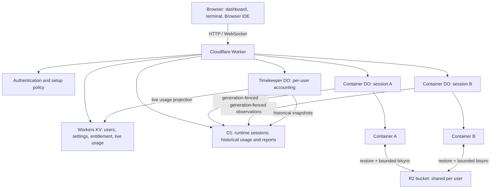
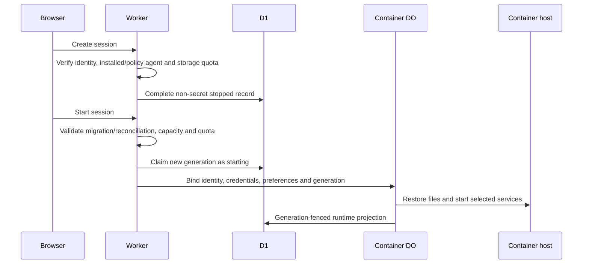
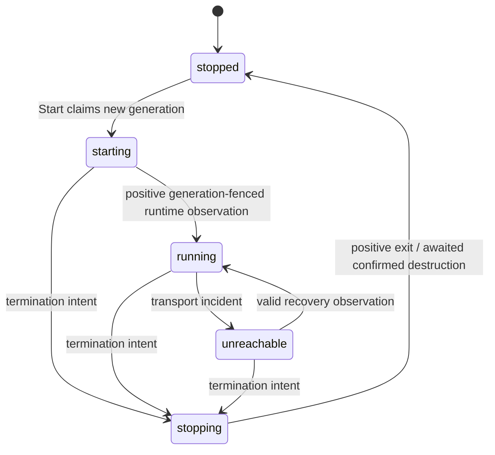

# Architecture

System map, ownership boundaries, authoritative state, cross-component flows, and failure domains for Codeflare.

**Audience:** Operators and developers

## Contents

- [Purpose, Audience, and Ownership](#purpose-audience-and-ownership)
- [System at a Glance](#system-at-a-glance)
- [System Components](#system-components)
- [Architectural Invariants](#architectural-invariants)
- [State Ownership and Durability](#state-ownership-and-durability)
- [Data Flow](#data-flow)
- [Failure Domains and Recovery Ownership](#failure-domains-and-recovery-ownership)
- [Observability and Operator Signals](#observability-and-operator-signals)
- [Capacity, Caching, and Performance Assumptions](#capacity-caching-and-performance-assumptions)
- [Security and Privacy Boundaries](#security-and-privacy-boundaries)
- [Developer Reference Boundaries](#developer-reference-boundaries)
- [Decision and Requirement Map](#decision-and-requirement-map)
- [Related Documentation](#related-documentation)

## Purpose, Audience, and Ownership

This lane owns runtime topology, component boundaries, authoritative state, cross-component flows, failure domains, and architectural invariants. It is the starting point for locating the owner of a decision or tracing a request across processes. It is not a merged internals manual or a source inventory.

| Question | Canonical owner |
|---|---|
| Which component owns this responsibility or state? | Architecture |
| What does an HTTP/WebSocket endpoint accept and return? | [API Reference](api-reference.md) |
| Which setting controls it? | [Configuration](configuration.md) |
| How is it deployed or restored? | [Deployment](deployment.md) |
| Which security control protects it? | [Security](security.md) |
| How does the session/container/host implement it? | [Container](container.md) |
| How are terminal and editor surfaces composed? | [Terminal & IDE](terminal-and-ide.md), [Browser IDE package](../../openvscode/README.md) |
| How are durable files reconciled? | [Storage & Sync](storage-and-sync.md) |
| How are seeded agents and policies delivered? | [Preseed](preseed.md) |
| What should an operator do when it fails? | [Troubleshooting](troubleshooting.md) |
| Why was a trade-off accepted? | [Decisions](../decisions/README.md) |

## System at a Glance

Each backend session has one isolated Cloudflare Container. Browser tabs, terminal panes, MultiView, and Browser IDE connect to a session; they do not define its identity. A user's sessions share one R2 bucket for selected durable files, with ephemeral local working copies. D1 owns complete non-secret session records and generation-fenced lifecycle truth. <!-- @impl: src/lib/session-repository.ts::D1SessionRepository --> KV retains users, setup/configuration, entitlement and live-usage projections. Container Durable Objects coordinate runtime processes and observations; Timekeeper coordinates per-user accounting.

```mermaid
graph TD
    B["Browser: dashboard, terminal, Browser IDE"] -->|"HTTP / WebSocket"| W["Cloudflare Worker"]
    W --> A["Authentication and setup policy"]
    W --> KV["Workers KV: users, settings, entitlement, live usage"]
    W --> DB["D1: runtime sessions; historical usage and reports"]
    W --> DO1["Container DO: session A"]
    W --> DO2["Container DO: session B"]
    W --> TK["Timekeeper DO: per-user accounting"]
    DO1 --> C1["Container A"]
    DO2 --> C2["Container B"]
    DO1 & DO2 -->|"generation-fenced observations"| DB
    TK -->|"live usage projection"| KV
    TK -->|"historical snapshots"| DB
    C1 <-->|"restore + bounded bisync"| R2["R2 bucket: shared per user"]
    C2 <-->|"restore + bounded bisync"| R2
```

The Worker owns the public edge. Interceptor-owned credentials remain Worker-side or are re-stamped there. The workload is deliberately powerful inside its isolation and may change files or permitted external systems. Source describes current authority; it does not establish deployed acceptance or upgrade Planned/Partial SDD status.

### Terminal topology ownership

The Worker stamps new Terminal sessions with immutable `classic` or `herdr` ownership from the authenticated user's server preference; absence resolves classic. Classic exposes up to six xterm.js surfaces with Codeflare tabs/layouts. Herdr exposes outer terminal `1`; its official client/fixed launcher and one named server own in-session tabs, panes, splits, workspaces, shells, and agents. Herdr's official structural `session.json` persists under `~/.codeflare` through ordinary R2 sync; live processes remain ephemeral. Both modes retain authenticated transport, host `Session`, restore, resize authority, input classification and prewarm adoption. Browser adapters forward cell-pointer reports and standard `Ctrl+B`; Herdr interprets following action keys. No Herdr socket/private protocol is exposed. MultiView remains browser-local and cross-session; Browser IDE is a separate service, not a standalone Herdr runtime.

**Contracts:** [AD146](../decisions/README.md#ad146-terminal-mode-is-an-immutable-per-session-choice), [REQ-TERM-033](../../sdd/spec/terminal.md#req-term-033-durable-herdr-structural-session-recovery), [REQ-TERM-036](../../sdd/spec/terminal.md#req-term-036-browser-pointer-interaction-with-herdr), [REQ-TERM-037](../../sdd/spec/terminal.md#req-term-037-browser-keyboard-interaction-with-herdr).

### Deployment modes

| Mode | Identity boundary | Public entry | Billing | Enterprise interception |
|---|---|---|---|---|
| Default | Cloudflare Access | Authenticated application | Disabled | Off |
| Onboarding | Configured GitHub OIDC or Access | Public landing/integrated sign-in | Disabled | Off |
| SaaS | Configured GitHub OIDC or Access | Public landing/provider chooser | Enabled | Off |
| Enterprise | Customer Cloudflare Access | Customer-controlled application | Suppressed | Optional AI Gateway, Browser/GitHub token, strict egress boundaries |

The `workers.dev` URL is a setup surface, not normal production entry. [Configuration](configuration.md), [Authentication](authentication.md) and [Deployment](deployment.md) own domain/Access setup and procedure. [REQ-SETUP-007](../../sdd/spec/setup.md#req-setup-007-custom-domain-with-dns-validation) defines the contract.

## System Components

### Worker (Hono Router)

**Responsibility:** Authenticates public requests, applies edge policy, serves assets and routes APIs, WebSockets and session work. Bounded per-isolate caches are optimizations, not durable authority. It does not own workload processes or workspace bytes.

**Inputs:** HTTP/WebSocket requests, Worker bindings, setup state and verified identity.

**Outputs:** API/assets responses, WebSocket upgrades and calls to owning components.

**Source:** `src/index.ts`, `src/middleware/auth.ts`. <!-- @impl: src/middleware/auth.ts::requireAdmin -->

**Contracts:** [REQ-AUTH-020](../../sdd/spec/authentication.md#req-auth-020-onboarding-mode-landing-integrated-login-shell), [REQ-AUTH-022](../../sdd/spec/authentication.md#req-auth-022-session-expiry-on-resume-produces-a-clean-sign-in-redirect-never-a-blank-page), [AD10](../decisions/README.md#ad10-bootstrap-window-pre-setup-endpoints-csrf-and-worker-name-derivation), [AD34](../decisions/README.md#ad34-websocket-auth-bypass-of-hono-middleware).

**Owners:** [API Reference](api-reference.md), [Authentication](authentication.md), [Configuration](configuration.md).

### Container DO (container)

**Responsibility:** Coordinates one session's configuration, startup, proxy, metrics, idle policy, recovery and teardown. DO storage owns runtime coordination, shutdown fences and recovery evidence; D1 owns shared session lifecycle. The DO does not own durable files, entitlement or browser-local presentation.

**Inputs:** Session/bucket identity, preferences, credentials, internal controls and host health/activity.

**Outputs:** Lifecycle transitions, authenticated proxy traffic, status, usage and recovery evidence.

**Source:** `src/container/`, `src/routes/container/`.

**Contracts:** [REQ-SESSION-002](../../sdd/spec/session-lifecycle.md#req-session-002-one-container-per-session-isolation), [REQ-SESSION-018](../../sdd/spec/session-lifecycle.md#req-session-018-persisted-status-is-authoritative-on-container-exit), [REQ-SESSION-021](../../sdd/spec/session-lifecycle.md#req-session-021-unreachable-container-transport-initiates-coordinator-reconstruction), [AD1](../decisions/README.md#ad1-one-container-per-session). [AD70](../decisions/README.md#ad70-container-exit-writes-kv-stopped-no-read-side-reconciliation) records the historical KV decision, not current storage authority.

**Owner:** [Container](container.md).

### LlmInterceptor (Enterprise Mode)

**Responsibility:** Routes configured enterprise LLM traffic through customer AI Gateway without exposing its token to the container. No durable state, provider keys, Access policy or model-selection UI is owned here.

**Inputs:** Authorized route/native handles, capability profiles, matched configured groups and Worker-held connection configuration.

**Outputs:** Bound Dynamic compat contracts (historical REST-first assignments retained), saved native/custom compat or Bedrock Runtime requests, normalized responses or bounded fail-closed errors.

**Source:** `src/llm-interceptor.ts`, `src/container/container-interception.ts`.

Authorized native Bedrock dispatch has a 120-second first-byte allowance; Dynamic timeout authority stays in the deployed Gateway graph. <!-- @impl: src/llm-interceptor.ts::LlmInterceptor --> <!-- @impl: src/lib/ai-capability-discovery/index.ts::capabilityCandidates -->

**Contracts:** [REQ-ENTERPRISE-004](../../sdd/spec/models-and-routing.md#req-enterprise-004-outbound-interception-llm-routing-to-customer-ai-gateway), [REQ-ENTERPRISE-007](../../sdd/spec/models-and-routing.md#req-enterprise-007-gateway-route-pinning), [REQ-ENTERPRISE-013](../../sdd/spec/models-and-routing.md#req-enterprise-013-per-group-dynamic-routing), [REQ-ENTERPRISE-032](../../sdd/spec/models-and-routing.md#req-enterprise-032-enterprise-pi-route-selection-and-runtime-translation), [REQ-ENTERPRISE-035](../../sdd/spec/models-and-routing.md#req-enterprise-035-enterprise-pi-protocol-match-selection), [REQ-ENTERPRISE-047](../../sdd/spec/models-and-routing.md#req-enterprise-047-native-ai-gateway-provider-discovery-and-selection), [REQ-ENTERPRISE-048](../../sdd/spec/models-and-routing.md#req-enterprise-048-native-provider-capability-catalog), [REQ-ENTERPRISE-049](../../sdd/spec/models-and-routing.md#req-enterprise-049-unified-enterprise-model-authorization), [REQ-ENTERPRISE-050](../../sdd/spec/models-and-routing.md#req-enterprise-050-native-provider-compat-dispatch), [REQ-ENTERPRISE-052](../../sdd/spec/models-and-routing.md#req-enterprise-052-native-provider-verification-and-runtime-enforcement), [REQ-ENTERPRISE-053](../../sdd/spec/models-and-routing.md#req-enterprise-053-native-target-identity-and-document), [REQ-ENTERPRISE-055](../../sdd/spec/models-and-routing.md#req-enterprise-055-native-target-authority-and-save), [REQ-ENTERPRISE-058](../../sdd/spec/models-and-routing.md#req-enterprise-058-native-model-container-publication), [REQ-ENTERPRISE-059](../../sdd/spec/models-and-routing.md#req-enterprise-059-native-provider-wire-adaptation), [REQ-ENTERPRISE-060](../../sdd/spec/models-and-routing.md#req-enterprise-060-native-target-input-validation), [REQ-ENTERPRISE-061](../../sdd/spec/setup.md#req-enterprise-061-native-target-administration-projection), [REQ-ENTERPRISE-087](../../sdd/spec/models-and-routing.md#req-enterprise-087-native-ai-gateway-request-timeout-authority).

**Decisions:** [AD72](../decisions/README.md#ad72-outbound-https-interception-over-a-worker-side-llm-proxy-for-enterprise-gateway-routing), [AD74](../decisions/README.md#ad74-enterprise-llm-transport-on-the-ai-gateway-rest-api), [AD152](../decisions/README.md#ad152-generalize-native-and-custom-provider-compat-dispatch).

**Owners:** [Models & Routing](models-and-routing.md), [Security](security.md#enterprise-mode-credential-containment-and-ca-trust), [Configuration](configuration.md#enterprise-access-group-configuration).

### EgressController (Strict Gateway Egress, Enterprise Mode)

**Responsibility:** Otherwise-unclaimed direct-internet traffic crosses customer Cloudflare Gateway through the required `EGRESS` binding. DO props bind strict state, account, exact user bucket and memory-only bucket-scoped credentials. The controller owns R2 re-signing and WebSocket bridging, not customer policy or general non-R2 platform authorization. Missing binding or another bucket fails closed.

**Inputs:** Intercepted requests, strict-egress state, account/bucket identity, scoped credentials and `EGRESS` binding.

**Outputs:** Gateway-routed traffic, scoped R2 requests, bridged WebSockets or fail-closed boundary errors.

**Source:** `src/egress-controller.ts`, `src/lib/controller-egress.ts`, `src/container/container-interception.ts`.

**Contracts:** [REQ-ENTERPRISE-016](../../sdd/spec/security.md#req-enterprise-016-strict-gateway-egress), [REQ-ENTERPRISE-023](../../sdd/spec/security.md#req-enterprise-023-strict-gateway-egress-controller-transport), [REQ-ENTERPRISE-026](../../sdd/spec/security.md#req-enterprise-026-strict-r2-interception-preserves-user-bucket-authority), [AD85](../decisions/README.md#ad85-controller-mediated-cloudflare-gateway-egress-as-a-mandatory-web-boundary-wizard-toggled-default-off), [AD86](../decisions/README.md#ad86-platform-native-cloudflare-primitives-bypass-strict-gateway-egress-only-direct-internet-egress-takes-cf1network), [AD87](../decisions/README.md#ad87-egresscontroller-re-signs-own-account-r2-container-holds-a-placeholder-key-bridges-websocket-upgrades-and-resolves-strict-via-props), [AD143](../decisions/README.md#ad143-strict-r2-interception-signs-only-with-the-bound-users-scoped-credential).

**Owners:** [Security](security.md#strict-gateway-egress-enterprise-mode), [Configuration](configuration.md), [Deployment](deployment.md#strict-gateway-egress-enterprise-mode).

### CloudflareBrowserInterceptor

**Responsibility:** Refreshes/injects user-scoped OAuth or enterprise Browser Rendering credentials at the Worker boundary for REST/CDP HTTP and WebSocket traffic. Identity is bound at wiring time, not chosen by a caller header. Missing valid credentials fail closed. Token storage belongs to the authentication/provider layer, not the interceptor.

**Inputs:** Intercepted REST/CDP traffic, session-bound identity and Worker-held token state.

**Outputs:** Authenticated HTTP/WebSocket traffic or fail-closed authentication responses.

**Source:** `src/cloudflare-browser-interceptor.ts`, `src/container/container-interception.ts`.

**Contracts:** [REQ-BROWSER-008](../../sdd/spec/browser-run.md#req-browser-008-browser-rendering-token-interception-never-in-the-container), [REQ-AGENT-078](../../sdd/spec/agents.md#req-agent-078-cloudflare-oauth-token-refreshed-at-the-apicloudflarecom-boundary), [AD93](../decisions/README.md#ad93-refresh-the-non-enterprise-cloudflare-oauth-token-at-the-apicloudflarecom-boundary-reusing-the-browser-interceptor).

**Owners:** [Authentication](authentication.md), [Security](security.md#api-token-containment).

### GitHub Integration

**Responsibility:** Connects verified users to repository discovery, cloning and mode-appropriate authenticated GitHub traffic. Encrypted `DeployKeys.githubToken` remains the credential store. Repository permissions, account policy and workspace durability are separate owners.

**Inputs:** OAuth state/tokens, repository selection, clone requests, session identity and intercepted GitHub traffic.

**Outputs:** Connection metadata, repository lists, clone operations and authenticated GitHub requests.

**Source:** `src/routes/github.ts`, `src/routes/github-auth.ts`, `src/lib/github-token.ts`, `src/github-interceptor.ts`, `host/src/git-clone.ts`, `web-ui/src/components/github/`.

**Contracts:** [REQ-GITHUB-001](../../sdd/spec/github.md#req-github-001-github-token-capture-and-storage), [REQ-GITHUB-003](../../sdd/spec/github.md#req-github-003-enterprise-egress-injected-github-credentials), [REQ-GITHUB-004](../../sdd/spec/github.md#req-github-004-clone-a-repository-into-a-session), [REQ-GITHUB-014](../../sdd/spec/github.md#req-github-014-clone-created-session-resume), [REQ-GITHUB-006](../../sdd/spec/github.md#req-github-006-other-mode-container-transport), [AD81](../decisions/README.md#ad81-reuse-the-container-egress-injection-layer-for-per-user-github-tokens).

**Owners:** [API Reference](api-reference.md#github-integration), [Security](security.md#github-token-containment), [Terminal & IDE](terminal-and-ide.md).

### Browser IDE

**Responsibility:** Provides a session-isolated code-server workbench with native Pi, official Claude or empty immutable agent inventory. The Worker snapshots the entitled default workspace at creation; absent/historical values mean Terminal. VS Code sessions are dashboard-owned, skip host PTY prewarm/terminal sockets, and open a stable session-keyed editor tab. Terminal sessions retain request-lazy editor startup.

Live editor databases, package bytes and agent processes are ephemeral. Only bounded UI continuity and extension-intent manifests persist. Browser IDE does not own terminal Pi conversation, generic VS Code authentication, private galleries, durable credentials or future workspace preference. Developer composition stays in [openvscode/README.md](../../openvscode/README.md); runtime/persistence/security stay in their specialist lanes.

**Inputs:** Session route, immutable workspace/agent selection, editor requests, bounded UI snapshot and extension manifest.

**Outputs:** Editor UI, agent context, file changes, diagnostics and lazy extension restoration.

**Source:** `host/src/vscode-proxy.ts`, `openvscode/agent-sidebar/`, `openvscode/claude/`; [package composition](../../openvscode/README.md).

**Contracts:** [REQ-IDE-002](../../sdd/spec/browser-ide.md#req-ide-002-session-isolated-ide-not-bucket-stable), [REQ-IDE-005](../../sdd/spec/browser-ide.md#req-ide-005-selected-native-ide-agent), [REQ-IDE-006](../../sdd/spec/browser-ide.md#req-ide-006-ide-conversation-context-and-credential-isolation), [REQ-IDE-008](../../sdd/spec/browser-ide.md#req-ide-008-ide-agent-process-lifecycle), [REQ-IDE-015](../../sdd/spec/browser-ide.md#req-ide-015-clean-browser-ide-url-and-private-workspace-selection), [REQ-IDE-019](../../sdd/spec/browser-ide.md#req-ide-019-codeflare-eligibility-in-editor-inline-chat), [REQ-IDE-020](../../sdd/spec/browser-ide.md#req-ide-020-native-pi-editor-proposal-execution), [REQ-IDE-022](../../sdd/spec/browser-ide.md#req-ide-022-native-pi-blocking-ui-protocol), [REQ-IDE-025](../../sdd/spec/browser-ide.md#req-ide-025-shared-ide-pi-surface-isolation), [REQ-IDE-026](../../sdd/spec/browser-ide.md#req-ide-026-native-inline-chat-edit-validation), [REQ-IDE-030](../../sdd/spec/browser-ide.md#req-ide-030-native-inline-chat-result-envelope), [REQ-IDE-033](../../sdd/spec/browser-ide.md#req-ide-033-controller-owned-inline-review-lifecycle), [REQ-IDE-034](../../sdd/spec/browser-ide.md#req-ide-034-bounded-inline-lifecycle-diagnostics), [REQ-IDE-035](../../sdd/spec/browser-ide.md#req-ide-035-canonical-browser-ide-workspace-projection), [REQ-IDE-036](../../sdd/spec/browser-ide.md#req-ide-036-persistent-user-managed-extensions), [REQ-IDE-037](../../sdd/spec/browser-ide.md#req-ide-037-lazy-extension-restoration), [REQ-IDE-038](../../sdd/spec/browser-ide.md#req-ide-038-extension-warning-acknowledgement), [REQ-IDE-040](../../sdd/spec/browser-ide.md#req-ide-040-user-extension-allowance-policy), [REQ-IDE-043](../../sdd/spec/browser-ide.md#req-ide-043-native-pi-provider-history-isolation), [REQ-IDE-048](../../sdd/spec/browser-ide.md#req-ide-048-default-workspace-and-dashboard-owned-vs-code-sessions), [REQ-IDE-049](../../sdd/spec/browser-ide.md#req-ide-049-dashboard-vs-code-startup-and-recovery), [REQ-IDE-050](../../sdd/spec/browser-ide.md#req-ide-050-browser-ide-status-and-ownership), [REQ-IDE-054](../../sdd/spec/browser-ide.md#req-ide-054-browser-ide-card-activation).

**Decisions:** [AD114](../decisions/README.md#ad114-native-pi-chat-and-the-official-claude-extension-own-editor-integration), [AD119](../decisions/README.md#ad119-replace-openvscode-with-pinned-code-server-behind-the-existing-session-proxy), [AD120](../decisions/README.md#ad120-browser-ide-uses-fixed-public-workspace-selection-and-exported-ui-state-continuity), [AD127](../decisions/README.md#ad127-native-inline-chat-uses-proposal-only-pi-turns-and-host-owned-text-edits), [AD128](../decisions/README.md#ad128-inline-review-lifecycle-belongs-to-the-pinned-controller), [AD129](../decisions/README.md#ad129-proxied-inline-uri-identity-must-be-observed-before-lifecycle-changes), [AD130](../decisions/README.md#ad130-the-projected-workspace-uses-the-canonical-browser-authority), [AD131](../decisions/README.md#ad131-inline-diagnostics-retain-only-sanitized-resource-identity), [AD132](../decisions/README.md#ad132-user-extensions-are-a-bounded-manifest-over-an-immutable-base-inventory), [AD135](../decisions/README.md#ad135-inline-chat-requires-one-host-correlated-result).

**Owners:** [Container](container.md#code-server-browser-ide), [Security](security.md#browser-ide-native-agents), [Terminal & IDE](terminal-and-ide.md).

### Terminal Server (node-pty)

**Responsibility:** Owns in-container PTYs, WebSocket framing, shared input activity, private health/control endpoints, connected-client state and resize authority. It reports observations, not public authorization or durable session lifecycle.

**Inputs:** Authenticated traffic, terminal controls/input, editor client frames and PTY output.

**Outputs:** Terminal/control frames, PTY writes, shared activity/health and internal sync responses.

**Source:** `host/src/server.ts`, `host/src/session.ts`, `host/src/activity-tracker.ts`, `host/src/terminal-ws.ts`, `host/src/request-router.ts`.

**Contracts:** [REQ-SESSION-005](../../sdd/spec/session-lifecycle.md#req-session-005-input-based-idle-detection), [REQ-TERM-021](../../sdd/spec/terminal.md#req-term-021-synchronized-output-frame-atomicity), [REQ-TERM-023](../../sdd/spec/terminal.md#req-term-023-away-only-agent-notification-delivery), [AD47](../decisions/README.md#ad47-pty-keepalive-as-safety-net-only-not-the-idle-policy), [AD82](../decisions/README.md#ad82-visible-terminal-panes-own-websockets-and-multiview-is-virtual).

**Owners:** [Container](container.md), [Terminal & IDE](terminal-and-ide.md), [API Reference](api-reference.md).

### Landing (Astro, prerendered)

**Responsibility:** Builds mode-aware public marketing/onboarding assets from typed content and tokens. It owns no application state. The contact route relays validated submissions without persisting content; KV holds only rate-limit counters. Authentication, Worker routing and contact credentials remain separate owners.

**Inputs:** Mode-aware typed content/tokens and public page requests; contact submissions enter the Worker route.

**Outputs:** Prerendered public assets and validated contact relay responses.

**Source:** `landing/src/`; [package composition](../../landing/README.md) and [Worker contact contract](api-reference.md#public-landing).

**Contracts:** [REQ-LANDING-001](../../sdd/spec/landing.md#req-landing-001-mode-aware-public-landing-serving), [REQ-LANDING-002](../../sdd/spec/landing.md#req-landing-002-demo-request-contact-pipeline), [REQ-LANDING-003](../../sdd/spec/landing.md#req-landing-003-landing-social-share-and-search-metadata), [REQ-LANDING-004](../../sdd/spec/landing.md#req-landing-004-first-paint-stability-and-immutable-asset-caching), [AD18](../decisions/README.md#ad18-vendored-creativewebgl-code-uses-untyped-patterns).

#### Landing implementation

The prerendered Astro package emits `/landing` assets into the web asset tree. Required content and dark first paint are server-rendered; JavaScript adds progressive enhancements, with reduced-motion/WebGL-failure fallbacks. The Worker owns eligibility, discovery documents and cache policy. Composition, source inventory, proof/content models, enhancement modules and package verification remain in the existing [Landing README](../../landing/README.md), not a second architecture manual. [API Reference](api-reference.md#public-landing) owns contact contracts and [Security](security.md) owns abuse controls.

### Frontend (SolidJS + xterm.js)

**Responsibility:** Presents dashboard, terminal, storage, settings, billing/provisioning and session controls. Browser-local state owns virtual MultiView membership and visible/focused panes, not runtime truth, durable files or credentials.

**Inputs:** API responses, terminal/control frames, user gestures and browser-local presentation state.

**Outputs:** Rendered surfaces, authenticated API requests and visible-pane terminal traffic.

**Source:** `web-ui/src/`.

**Contracts:** [REQ-TERM-011](../../sdd/spec/terminal.md#req-term-011-visible-terminal-panes-own-websocket-connections), [REQ-TERM-012](../../sdd/spec/terminal.md#req-term-012-multiview-virtual-session-workspace), [REQ-TERM-013](../../sdd/spec/terminal.md#req-term-013-multiview-selection-flow), [REQ-TERM-015](../../sdd/spec/terminal.md#req-term-015-focused-pane-owns-url-detection), [AD82](../decisions/README.md#ad82-visible-terminal-panes-own-websockets-and-multiview-is-virtual), [AD105](../decisions/README.md#ad105-streamed-output-defers-while-the-user-reads-scrollback-keyboard-open-swipes-are-always-terminal-input).

Visible panes own terminal sockets/resize; hidden running sessions mount neither. MultiView is never sent to lifecycle, quota, storage or terminal APIs. [Terminal & IDE](terminal-and-ide.md) owns desktop/tablet/mobile composition.

### KV

**Responsibility:** Holds durable users, setup/configuration, entitlement/live-usage projections, rate limits and ancillary state. It is eventually consistent; process caches do not strengthen it. Session records, lifecycle, readiness and runtime metrics are D1-owned, not KV list metadata. Legacy KV evidence remains historical.

**Inputs:** Worker-owned user/configuration, entitlement, live-usage and rate-limit writes.

**Outputs:** Eventually consistent records and projections, not session authority.

**Source:** `src/lib/kv-crypto.ts`, `src/routes/setup/`, `src/timekeeper/index.ts`.

**Original references:** [REQ-SESSION-010](../../sdd/spec/session-lifecycle.md#req-session-010-session-status-observable-from-dashboard), [REQ-SESSION-018](../../sdd/spec/session-lifecycle.md#req-session-018-persisted-status-is-authoritative-on-container-exit), [AD6](../decisions/README.md#ad6-kv-read-modify-write-races-and-collectmetrics-atomicity), [AD70](../decisions/README.md#ad70-container-exit-writes-kv-stopped-no-read-side-reconciliation).

### R2

**Responsibility:** Owns one user's selected durable file namespace, restored/reconciled by session containers, storage routes and seeding. It is not a live POSIX filesystem, process store, excluded-cache store or sync coordinator.

**Inputs:** User-scoped object writes from storage, seeding and selected-file sync.

**Outputs:** Durable object bytes/metadata for scoped reads and reconciliation.

**Source:** `src/routes/storage/`, `src/lib/r2-seed.ts`, `entrypoint.sh`.

**Contracts:** [REQ-STOR-001](../../sdd/spec/storage.md#req-stor-001-dedicated-per-user-r2-bucket), [REQ-STOR-002](../../sdd/spec/storage.md#req-stor-002-file-persistence-across-sessions), [REQ-STOR-003](../../sdd/spec/storage.md#req-stor-003-bidirectional-sync-every-15-minutes-with-manual-triggers), [AD3](../decisions/README.md#ad3-per-user-r2-buckets), [AD56](../decisions/README.md#ad56-15-minute-bisync-cadence-with-manual-triggers), [AD125](../decisions/README.md#ad125-bounded-automatic-resync-after-exhausted-recovery).

**Owner:** [Storage & Sync](storage-and-sync.md).

### Timekeeper

**Responsibility:** Converts monotonic per-session runtime reports into per-user deltas, live usage/quota signals and separately acknowledged historical snapshots. Durable accumulator/period/outbox state belongs to the DO; live serving projection belongs to KV; historical analytics/report claims belong to D1. It does not own session lifecycle or checkout.

**Inputs:** Session runtime reports, user/period identity and historical acknowledgement results.

**Outputs:** Usage deltas, live KV quota projections and historical D1 snapshots.

**Source:** `src/timekeeper/index.ts`; [Billing source map](billing.md#requirement-and-source-map).

**Contracts:** [REQ-SUB-006](../../sdd/spec/subscription.md#req-sub-006-real-time-usage-tracking-via-timekeeper-do), [REQ-SUB-007](../../sdd/spec/subscription.md#req-sub-007-quota-enforcement-at-session-start-402), [AD37](../decisions/README.md#ad37-kv-as-billing-read-cache----signal-and-sync-cf-015).

**Owners:** [Billing](billing.md), [Container](container.md).

## Architectural Invariants

| Invariant | Consequence / decision | Detailed owner |
|---|---|---|
| One container per backend session | Browser views cannot redefine identity; AD1 | Container |
| One R2 bucket per user | Selected files reconcile through one namespace; AD3 | Storage & Sync |
| D1 session authority is generation/revision ordered | Stale observations, uncertainty or read-side age cannot invent exit | Container |
| Classified input owns idle activity | Output and server-to-client chatter do not retain compute; AD47 | Container |
| Visible terminal panes own sockets/resize | MultiView remains browser-local; AD82 | Terminal & IDE |
| Final sync is awaited while workload is alive | Signal trap is a backstop; [AD57](../decisions/README.md#ad57-135-second-shutdown-budget-for-final-bisync) | Storage & Sync |
| Ordinary sync recovery precedes baseline reconstruction | Bounded exhausted-recovery resync; AD125 | Storage & Sync |
| Interceptor credentials remain outside workload | Required configuration fails closed; AD72/AD81 | Security |
| Strict direct internet crosses customer Gateway | Explicit scoped platform exceptions; AD86 | Security |
| Root sessions own mutation and delivery | Bounded review/CI/extraction agents report or publish only within contract; [AD98](../decisions/README.md#ad98-pi-pr-review-uses-visible-session-scoped-agents), [AD102](../decisions/README.md#ad102-pi-extraction-delivery-is-root-owned-visible-and-transactional) | Preseed, Vault |

## State Ownership and Durability

| State | Scope | Authority / durability | Writers/readers | Recovery owner |
|---|---|---|---|---|
| User/setup/configuration | Deployment/user | KV, persistent/eventually consistent | Authenticated Worker routes and policy/UI | Authentication/Configuration |
| Complete session/lifecycle/readiness/metrics | Session | D1 `runtime_sessions`, generation/revision/sequence fenced; [REQ-SESSION-031](../../sdd/spec/session-lifecycle.md#req-session-031-d1-session-schema-stores-complete-ordered-authority) retains Planned status | Lifecycle routes/DO observations; dashboard/API | Container |
| Workload ownership during `starting/running/unreachable/stopping` | Session | D1 even without container wake | Session admission and managed mutation gates <!-- @impl: src/lib/session-helpers.ts::hasOwningSessionContainer --> | Container |
| Runtime coordination/recovery/shutdown fence | Session | DO storage across reconstruction | Container DO <!-- @impl: src/container/index.ts::container --> | Container |
| Live processes/ports | Session | Containers platform and successful host observations, ephemeral | Runtime/DO | Container |
| Workspace/selected files | User | R2, persistent | Sync/storage routes; session/UI | Storage & Sync |
| Local workspace/agent runtime | Session | Ephemeral filesystem/processes | User/agent/IDE/entrypoint | R2/Git restore/restart |
| IDE UI snapshot and extension intent | User | Bounded files under `~/.codeflare`, ordinary selected sync | Exporter/manifest owner; restore | Browser IDE package/runtime |
| Editor databases/credentials/chat/logs | Session | Ephemeral by contract | code-server/extensions | Fresh launch, never R2 restore |
| MultiView membership | Browser | Browser storage | Frontend | Validate live sessions |
| Live usage accumulator/projection | User | Timekeeper durable state plus KV serving record | Timekeeper; quota/personal usage | Billing |
| Historical usage/tombstones/reports/retention | Organization/user | D1, separate from quota truth | Accounting/scheduler; admin Analytics/Reports | Billing |
| Per-isolate caches | Isolate | TTL/reset, ephemeral | Owning module | Configuration/Billing/Security |
| Vault/cumulative graph content | User | R2-backed Vault/published graph after exact success | Root-owned extraction; consumers | Vault |

Bucket creation is lazy/idempotent. Start and storage browse ensure it exists; specialist owners handle seeding and mode reconciliation. The legacy status metadata helper is preserved only as a historical traceability pointer: <!-- @impl: src/lib/kv-keys.ts::putSessionWithMetadata --> The original status reader pointer remains <!-- @impl: src/routes/session/lifecycle.ts::app -->; its current source reads D1.

## Data Flow

### Session Creation to Terminal Connection

#### Creation and start

```mermaid
sequenceDiagram
    participant U as Browser
    participant W as Worker
    participant DB as D1
    participant DO as Container DO
    participant C as Container host
    U->>W: Create session
    W->>W: Verify identity, installed/policy agent and storage quota
    W->>DB: Complete non-secret stopped record
    U->>W: Start session
    W->>W: Validate migration/reconciliation, capacity and quota
    W->>DB: Claim new generation as starting
    W->>DO: Bind identity, credentials, preferences and generation
    DO->>C: Restore files and start selected services
    DO->>DB: Generation-fenced runtime projection
```

#### Terminal connection

The browser reads startup readiness, then upgrades the authenticated session-scoped socket. Current API readiness keeps ordinary terminal clients disconnected until `ready`; mounting is not public attachment authority. Service readiness and shared lifecycle are different observations.

Creation consumes no running slot. Start counts workload-owning D1 states; that count and subsequent claim remain best effort, so simultaneous starts can exceed the nominal per-user cap. `max_instances` is the separate platform boundary. D1 authority failure rejects Start; quota-KV uncertainty follows Billing's separate availability posture. Accepted asynchronous startup is not port readiness; a later start failure does not invent stopped or erase its generation.

**Contracts:** [REQ-SESSION-002](../../sdd/spec/session-lifecycle.md#req-session-002-one-container-per-session-isolation), [REQ-SESSION-017](../../sdd/spec/session-lifecycle.md#req-session-017-container-health-and-startup-status-api). [API Reference](api-reference.md#container-lifecycle) owns exact outcomes; [Container](container.md) and [Troubleshooting](troubleshooting.md#container-start-is-rejected-or-returns-to-stopped) own recovery.

### Startup Status Stages

`stopped`, `starting`, `syncing`, `verifying`, `mounting`, `ready`, and `error` are derived endpoint stages, not the D1 lifecycle enum. Terminal readiness requires service/prewarm; VS Code readiness requires editor preparation without a host PTY. [API Reference](api-reference.md#container-lifecycle) owns progress percentages and details; [Terminal & IDE](terminal-and-ide.md) owns rendering/restore/focus behavior.

Original rendering contracts remain [REQ-TERM-043](../../sdd/spec/terminal.md#req-term-043-visible-terminal-readiness-gating) and [REQ-TERM-044](../../sdd/spec/terminal.md#req-term-044-terminal-restore-and-readiness-rendering). Their historical implementation pointers remain: <!-- @impl: web-ui/src/components/Layout.tsx::handleOpenSessionById --> <!-- @impl: web-ui/src/components/Terminal.tsx::Terminal --> <!-- @impl: web-ui/src/hooks/useTerminal.ts::useTerminal --> <!-- @impl: web-ui/src/lib/xterm-internals.ts::resyncViewportScrollState --> <!-- @impl: web-ui/src/stores/terminal.ts::reconnectOnVisibilityReturn --> These pointers do not turn the retired mounting-attachment prose into current endpoint authority.

### Session Lifecycle State Machine

```mermaid
stateDiagram-v2
    [*] --> stopped
    stopped --> starting: Start claims new generation
    starting --> running: positive generation-fenced runtime observation
    running --> unreachable: transport incident
    unreachable --> running: valid recovery observation
    starting --> stopping: termination intent
    running --> stopping: termination intent
    unreachable --> stopping: termination intent
    stopping --> stopped: positive exit / awaited confirmed destruction
```

Lifecycle generation fences replacement executions; observation sequence fences delayed DO projections; response revision orders client observations. An old `stopping` row, SDK false reading, elapsed diagnostic window, transport error or stale browser state is not exit evidence. `starting`, `running`, `unreachable` and `stopping` retain workload ownership. A shutdown marker prevents revival; D1 predicates additionally reject stale-generation/stopping writes. Individual Delete removes a row only after confirmed exit. Frontend ACTIVE/IDLE is device-local connectivity, not stored lifecycle.

**Original references retained:** [REQ-SESSION-009](../../sdd/spec/session-lifecycle.md#req-session-009-container-destroy-wipes-session-state), [REQ-SESSION-018](../../sdd/spec/session-lifecycle.md#req-session-018-persisted-status-is-authoritative-on-container-exit), [REQ-SESSION-020](../../sdd/spec/session-lifecycle.md#req-session-020-the-metrics-alarm-outlives-a-container-that-stops-answering), [REQ-SESSION-021](../../sdd/spec/session-lifecycle.md#req-session-021-unreachable-container-transport-initiates-coordinator-reconstruction), [REQ-SESSION-024](../../sdd/spec/session-lifecycle.md#req-session-024-transport-recovery-ownership-is-durable). Current statuses remain SDD-owned; historical KV authority is recorded under AD70.

### Metrics Data Flow

The host `/activity` and `/health` report observations. Container DO applies idle/recovery policy and publishes generation/sequence-fenced D1 projections. Dashboard batch status reads the owner-indexed D1 projection, not per-session KV or DO probes. Usage/storage/entitlement/release/migration use separate ancillary reads.

**Contracts:** [REQ-SESSION-004](../../sdd/spec/session-lifecycle.md#req-session-004-idle-containers-sleep-after-configurable-timeout), [REQ-SESSION-010](../../sdd/spec/session-lifecycle.md#req-session-010-session-status-observable-from-dashboard).

### Dashboard WS Disconnect Flow

Dashboard navigation starts a bounded disconnect grace; returning cancels it and reconnects exact visible terminal keys. Connection generations prevent stale cleanup from closing newer sockets. Authoritative denial/stopping ends attachment; transient transport remains uncertainty. [Terminal & IDE](terminal-and-ide.md), [API Reference](api-reference.md), and [Troubleshooting](troubleshooting.md) own timings/codes and recovery.

### Contact Relay Data Flow

Landing form → public Worker → KV rate limit → Turnstile → Resend → operator inbox. Validated/escaped content is relayed, not persisted. [REQ-LANDING-002](../../sdd/spec/landing.md#req-landing-002-demo-request-contact-pipeline), [API Reference](api-reference.md#public-landing), [Security](security.md).

### Onboarding Access-Request Flow

Authenticated onboarding users without active tier become pending access requests, receive confirmation redirects and best-effort operator/user email. SaaS retains subscription; Enterprise bypasses this flow. [Authentication](authentication.md) owns the branch; [Security](security.md#onboarding-access-request-oauth-gated) owns the boundary. [REQ-AUTH-021](../../sdd/spec/authentication.md#req-auth-021-onboarding-mode-sign-in-choices-and-access-request-flow).

### GitHub Clone Data Flow

Creation clone directives persist with the session and reapply before every start; configuration failure blocks startup, while clone itself preserves existing targets and is best effort for missing ephemeral workspaces. A running-session clone uses the authenticated private host and records successful panel clones immediately. Metrics reports bounded top-level repository inventory only after post-restore clone work completes; resume restores absent tracked repositories within per-repository/overall budgets and continues past failures. Enterprise stamps GitHub credentials Worker-side; other modes retain existing container transport.

**Contracts:** [REQ-GITHUB-004](../../sdd/spec/github.md#req-github-004-clone-a-repository-into-a-session), [REQ-GITHUB-014](../../sdd/spec/github.md#req-github-014-clone-created-session-resume), [REQ-GITHUB-015](../../sdd/spec/github.md#req-github-015-workspace-repository-tracking), [REQ-GITHUB-016](../../sdd/spec/github.md#req-github-016-tracked-repository-restoration). [API Reference](api-reference.md#github-integration) owns validation/outcomes.

### Enterprise LLM Routing <!-- @impl: src/llm-interceptor.ts::LlmInterceptor -->

Container placeholder + opaque authorized handle/canonical level → Worker interceptor → discovered compat/historical REST-first or saved native transport → customer Gateway → backend. Interception precedes startup so platform CA trust is available. Gateway token, URL and native binding remain Worker-side. Required missing/stale authority fails before upstream fetch. Explicit human Pi native authentication retains current permission/generation/strict-egress checks and never grants Operator access.

**Additional original routing contracts:** [REQ-ENTERPRISE-011](../../sdd/spec/models-and-routing.md#req-enterprise-011-container-start-interception-ordering), [REQ-ENTERPRISE-051](../../sdd/spec/setup.md#req-enterprise-051-native-ai-gateway-provider-and-model-workspace), [REQ-ENTERPRISE-054](../../sdd/spec/setup.md#req-enterprise-054-native-target-profile-and-lifecycle-administration), [REQ-ENTERPRISE-089](../../sdd/spec/models-and-routing.md#req-enterprise-089-human-native-pi-startup). Detailed transport/translation/discovery lives in [Models & Routing](models-and-routing.md), [Security](security.md) and [Configuration](configuration.md).

**Discovery boundary:** [REQ-ENTERPRISE-035](../../sdd/spec/models-and-routing.md#req-enterprise-035-enterprise-pi-protocol-match-selection), [Models & Routing — Contracts, not a model list](models-and-routing.md#contracts-not-a-model-list). <!-- @impl: src/lib/ai-capability-discovery/index.ts::capabilityCandidates --> <!-- @impl: src/lib/ai-capability-discovery/compatibility-wire.ts::compatibilityResponse -->

### Strict Gateway Egress

Host-specific registrations own credential stamping; otherwise-unclaimed direct internet crosses `env.EGRESS` and customer Gateway. Explicit own-account platform exceptions stay scoped. Catch-all traffic is transparent apart from bound-bucket R2 re-signing; absent mandatory binding never falls back to global fetch. [REQ-ENTERPRISE-024](../../sdd/spec/security.md#req-enterprise-024-strict-gateway-egress-host-specific-interceptor-routing) supplements component contracts. [Security](security.md) owns mechanisms.

### Pi Memory and Vault Extraction Data Flow

Root persists an immutable request snapshot → bounded background extraction → locked Vault/graph publication → correlated native terminal result → root exact-success artifact verification/finalization. Child self-report cannot advance counters/manifests. [REQ-MEM-002](../../sdd/spec/memory.md#req-mem-002-capture-triggers-every-20-user-messages-and-on-resume), [REQ-VAULT-027](../../sdd/spec/vault.md#req-vault-027-pi-vault-extraction-delivery-is-visible-and-transactional); [Vault](vault.md), [Preseed](preseed.md).

### Pi PR-Boundary Review Data Flow

An authoritative published open PR head selects report-only local lanes or the exclusive protected Enterprise Action path, never both. Root correlates exact results, publishes mutation-free triage, acknowledges the reviewed head and applies accepted fixes separately. [REQ-AGENT-036](../../sdd/spec/agents.md#req-agent-036-pr-boundary-review-trigger-conditions), [REQ-AGENT-055](../../sdd/spec/agents.md#req-agent-055-pi-session-scoped-review-window), [REQ-AGENT-098](../../sdd/spec/agents.md#req-agent-098-pi-review-triage-acknowledgement-barrier); [Operators](operators.md#req-operator-053-contract-details), [Preseed](preseed.md).

### User-Invoked Review and SDD Ownership

`/review` specialists report; root owns triage/approved mutation. `/sdd init` and `/sdd clean` are root workflows, specification enforcement before documentation enforcement. [REQ-AGENT-015](../../sdd/spec/agents.md#req-agent-015-review-command-for-multi-perspective-codebase-review), [REQ-AGENT-037](../../sdd/spec/agents.md#req-agent-037-sdd-clean-rescue-and-autonomy-modes), [REQ-AGENT-050](../../sdd/spec/agents.md#req-agent-050-pi-native-review-workflow-skill); [Preseed](preseed.md).

### Pi CI Monitoring Data Flow

Independent CI monitoring follows required reviewer launch and reports one exact PR head without acknowledgment, branch mutation, cancellation or chasing changed heads. [REQ-AGENT-068](../../sdd/spec/agents.md#req-agent-068-independent-pi-ci-monitoring), [AD99](../decisions/README.md#ad99-pi-ci-monitoring-uses-one-attached-native-background-subagent), [AD122](../decisions/README.md#ad122-the-ci-monitor-observes-and-reports-it-does-not-cancel-runs-or-chase-the-remote); [CI/CD](ci-cd.md), [Preseed](preseed.md).

### Managed Environment Data Flow

Protected private-repository publication produces an immutable signed release. Worker-held encrypted PAT resolves repository identity and verifies metadata/digests/signature/sequence/ABI/runtime/paths/bounds/extensions, caching content-addressed deployment R2 bytes. A repository-stable conditional pointer owns trust selection; losing replacement repairs bounded KV projection or fails explicitly. <!-- @impl: src/lib/remote-curation.ts::resolveManagedEnvironmentRelease --> <!-- @impl: src/lib/remote-curation.ts::configureManagedEnvironment -->

Dashboard compares the verified active descriptor with the applied stamp. Idle-user reconcile validates bounded streams, uses cached applied history for delta planning or marker-resumable full planning, writes at most six concurrent bucket operations, and stamps completion last. Recreate retains full overwrite. Container receives active boolean/applied digest, never PAT, signing material, bundles/signature or VSIX bytes. Private curation is runtime content master; baked preseed remains independent fallback; existing five-minute discovery is not a container downloader/webhook/new poll loop. <!-- @impl: src/lib/remote-curation.ts::verifyManagedReleaseStream --> <!-- @impl: src/lib/r2-seed.ts::reconcileAgentConfigs --> <!-- @impl: src/routes/storage/seed.ts::reconcileAgentConfigsForRequest -->

**Contracts:** [REQ-SETUP-013](../../sdd/spec/setup.md#req-setup-013-managed-environment-configuration), [REQ-SETUP-014](../../sdd/spec/setup.md#req-setup-014-managed-repository-credential-boundary), [REQ-AGENT-147](../../sdd/spec/agents.md#req-agent-147-signed-managed-agent-configuration-releases), [REQ-AGENT-148](../../sdd/spec/agents.md#req-agent-148-protected-managed-release-publication), [REQ-AGENT-149](../../sdd/spec/agents.md#req-agent-149-shared-compiler-cli-compatibility), [REQ-AGENT-150](../../sdd/spec/agents.md#req-agent-150-independent-managed-release-activation-validation), [REQ-AGENT-154](../../sdd/spec/agents.md#req-agent-154-build-compatible-managed-release-discovery), [REQ-AGENT-151](../../sdd/spec/agents.md#req-agent-151-bounded-managed-release-streaming), [REQ-STOR-020](../../sdd/spec/storage.md#req-stor-020-managed-environment-reconciliation), [REQ-STOR-021](../../sdd/spec/storage.md#req-stor-021-managed-content-ownership), [REQ-STOR-022](../../sdd/spec/storage.md#req-stor-022-managed-reconciliation-admission), [REQ-STOR-023](../../sdd/spec/storage.md#req-stor-023-managed-release-status-projection), [REQ-STOR-024](../../sdd/spec/storage.md#req-stor-024-managed-release-application), [REQ-IDE-042](../../sdd/spec/browser-ide.md#req-ide-042-additive-company-extension-reconciliation), [REQ-IDE-044](../../sdd/spec/browser-ide.md#req-ide-044-exact-company-vsix-verification), [REQ-IDE-045](../../sdd/spec/browser-ide.md#req-ide-045-company-extension-reconciliation-orchestration), [REQ-IDE-046](../../sdd/spec/browser-ide.md#req-ide-046-session-local-company-vsix-installation), [AD136](../decisions/README.md#ad136-managed-environments-reconcile-signed-releases-before-session-start). [Preseed](preseed.md#managed-curation-ownership), [Storage & Sync](storage-and-sync.md).

## Failure Domains and Recovery Ownership

| Domain | Authority / degradation | Recovery owner |
|---|---|---|
| Worker cache disagreement | Durable owner plus TTL/reset, never isolate memory | Configuration/Billing/Security |
| Session D1 read unavailable | Retain last ordered client state; warn; Start/managed mutation fail closed | Container/Troubleshooting |
| DO attachment/host transport loss | Durable incident/recovery evidence; bounded reconstruction cannot prove exit | Container/Troubleshooting |
| Accepted async start fails | Preserve generation truth for reconciliation, not KV rollback/invented stopped | Container/Troubleshooting |
| Old `stopping` or false SDK not-running | Ownership retained until positive generation-fenced exit | Container |
| Final persistence drain | Await live sync within shared deadline; audit incomplete outcomes | Storage & Sync |
| R2 bisync unrecoverable | Repair ordinary/vanishing failures before bounded baseline rebuild | Storage & Sync |
| Required enterprise credential/binding absent | Fail closed; never expose or bypass to container credentials | Security/Configuration |
| Editor/agent process failure | Reap matching generation before replacement | Container/Browser IDE package |
| Review/CI result for other head | Ignore stale result; do not acknowledge replacement | Preseed/CI/CD |
| Extraction self-report without artifacts | Leave root state unchanged; bounded redelivery | Vault/Preseed |

## Observability and Operator Signals

| Signal | Meaning / non-evidence | Owner |
|---|---|---|
| D1 lifecycle/generation/revision | Shared ordered lifecycle, not device-local connection or immediate service readiness | API/Container |
| Startup stage/details | Derived readiness, not persisted lifecycle | API/Container |
| `lastInputAt` | Classified terminal/IDE input, not autonomous output/liveness | Container |
| Metrics observation timestamp | Last publication, not standalone exit proof | Container/Troubleshooting |
| Terminal connection state | Local ACTIVE/IDLE, not backend lifecycle | Terminal & IDE |
| Sync health/log/audit | Cycle result, not complete bucket proof | Storage & Sync/Troubleshooting |
| Recovery correlation | Incident/attempt/outcome, not user shutdown | Container/Troubleshooting |
| CI native notification | Exact-head terminal CI result, not review completion | CI/CD |

## Capacity, Caching, and Performance Assumptions

Worker caches are per-isolate optimizations with bounded staleness; exact inventories belong to their configuration/billing/security owners. Legacy KV session-metadata savings and the original 1,500-user sizing model are historical evidence, not current D1 query guarantees.

| Assumption | Bound / consequence | Owner |
|---|---|---|
| Visible dashboard polling | Transitions five seconds; stable 60 seconds; hidden cancellation; frequent D1 projection separate from ancillary state | Container/Terminal & IDE |
| Metrics | Normally 60 seconds; bounded 10-second host polls | Container |
| Coordinator reconstruction | At most two resets; preserve possible workload, never infer exit from transport | Container/Troubleshooting |
| Bisync | 15 minutes plus manual triggers; local files may lead R2 | Storage & Sync |
| Final persistence | 120-second sync budget, shared 135-second teardown cap | Storage & Sync/Container |
| Initial restore/baseline/prewarm | Mode-specific readiness; baseline can run concurrently/deprioritized on single vCPU | Container |
| Create/start rate limit | 10 creates, five starts per user/minute | API Reference |
| Concurrent workload cap | SaaS effective tier; non-SaaS including current Enterprise role-based; best effort | Billing/Configuration; [REQ-SESSION-007](../../sdd/spec/session-lifecycle.md#req-session-007-running-session-count-limited-per-tier), [issue #880](https://github.com/nikolanovoselec/codeflare/issues/880) |
| Resource profile | Low 0.25 vCPU/1 GiB/4 GB; default/`saas` 1 vCPU/3 GiB/6 GB; high 2 vCPU/6 GiB/12 GB | Configuration |
| Deployment capacity | Default ten instances; positive-integer `MAX_INSTANCES` override | Configuration |
| Timekeeper user cache | 60 seconds, 100 entries | Billing |

R2 is durability, not FUSE; work runs on local disk and performance depends on bounded reconciliation.

## Security and Privacy Boundaries

Public identity/route policy precedes protected work. Session ownership and generation select one coordinator; private mutable host routes use lifecycle Bearer authentication. Worker-held AI/GitHub/Browser/R2 interceptor credentials remain outside workloads where that boundary applies. Strict traffic cannot bypass missing `EGRESS`. IDE persistence excludes credentials/chat/package bytes; extraction advances root state only after matching exact-success artifacts. [Security](security.md) owns mechanisms, allowlists and residual risks; [Authentication](authentication.md) owns admission.

## Developer Reference Boundaries

Retired Architecture Internals is not copied wholesale here. Backend/session module ownership continues in [Container](container.md), identity/error/authorization in [Authentication](authentication.md) and [API Reference](api-reference.md), configuration/cache/setup sources in [Configuration](configuration.md), model adapters/discovery in [Models & Routing](models-and-routing.md), Vault sources in [Vault](vault.md), terminal/GitHub panel/client sources in [Terminal & IDE](terminal-and-ide.md), and billing/accounting/frontend subscription sources in [Billing](billing.md). Existing [Landing](../../landing/README.md) and [Browser IDE](../../openvscode/README.md) READMEs remain package composition owners; no package references are renamed.

The [original source registry/composition](https://github.com/nikolanovoselec/codeflare/blob/6c1c11936740aa290266fc98fcbc360d3b5b3af1/documentation/lanes/architecture-internals.md#source-module-registry) and [CF-NNN index](https://github.com/nikolanovoselec/codeflare/blob/6c1c11936740aa290266fc98fcbc360d3b5b3af1/documentation/lanes/architecture-internals.md#appendix-cf-nnn-code-index) preserve meaningful historical anchors. They are immutable history, not current implementation authority. Current schema source corrects the former separate-copy claim: `src/lib/schemas.ts` re-exports canonical `TabConfigSchema` from `web-ui/src/lib/schemas.ts`; the current frontend module also consumes the shared capability decoder. Neither statement changes runtime behavior.

Cache inventory continues in [Configuration](configuration.md#module-level-caches), with domain-specific authority in Billing/Security. The [original cache sizing account](https://github.com/nikolanovoselec/codeflare/blob/6c1c11936740aa290266fc98fcbc360d3b5b3af1/documentation/lanes/architecture-internals.md#module-level-caches) is historical.

Setup retry and domain-recovery implementation belongs to [Configuration](configuration.md#setup-wizard-resilience); exact endpoint outcomes belong to [API Reference](api-reference.md).

## Decision and Requirement Map

Clause-local links above are navigation, not an acceptance ledger. Active requirements/status/verification remain authoritative in `sdd/spec/`; this source-informed map does not promote Planned or Partial requirements. Original AD70/KV and CF sizing accounts are historical. System topology, storage, IDE, enterprise/GitHub, landing and governed-agent contracts retain their original links above; detailed evidence remains with the specialist owner.

## Related Documentation

- [API Reference](api-reference.md) — HTTP/WebSocket contracts
- [Authentication](authentication.md) — identity/provisioning/authorization
- [Billing](billing.md) — entitlement/live accounting/history/reports
- [Configuration](configuration.md) — settings/caches/routine Administration
- [Container](container.md) — session/host/runtime ownership and recovery
- [Terminal & IDE](terminal-and-ide.md) — terminal, mobile, MultiView and editor surfaces
- [Models & Routing](models-and-routing.md) — enterprise model capability/dispatch
- [Operators](operators.md) — generic Operator platform and contracts
- [Landing README](../../landing/README.md), [Browser IDE README](../../openvscode/README.md) — package composition
- [CI/CD](ci-cd.md), [Deployment](deployment.md), [Troubleshooting](troubleshooting.md)
- [Preseed](preseed.md), [Security](security.md), [Storage & Sync](storage-and-sync.md), [Vault](vault.md)
- [Decisions](../decisions/README.md) — trade-offs and consequences
