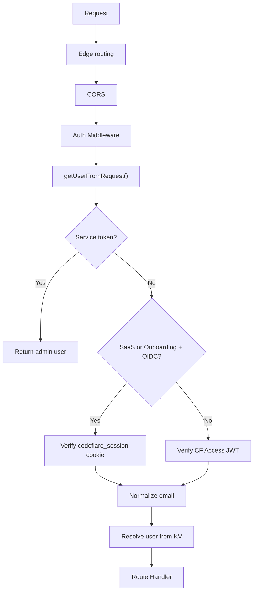
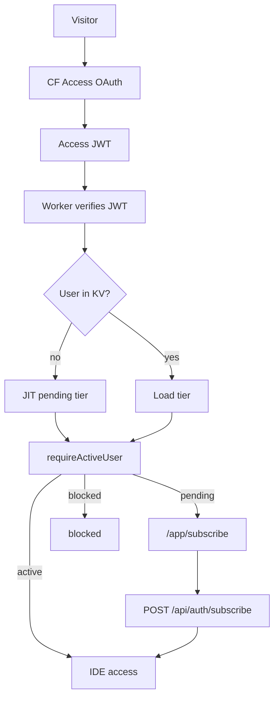

# Authentication

**Audience:** Operators, Developers

**Owns:** authentication-mode selection, credential precedence, verified identity, sessions/cookies, logout, expiry recovery, authorization middleware, and admin authorization.

**Does not own:** provisioning state, billing entitlement, provider-account connection mechanics, bucket internals, provider-secret placement, or token containment.

## Contents

- [Authentication Modes](#authentication-modes)
- [Interactive Authentication](#interactive-authentication)
- [Service Authentication](#service-authentication)
- [Identity and Authorization](#identity-and-authorization)
- [Mode-aware Routing](#mode-aware-routing)
- [Integration Aliases](#integration-aliases)
- [Requirement and Source Map](#requirement-and-source-map)
- [Related Documentation](#related-documentation)

## Authentication Modes

Codeflare selects one authentication branch for a request. Entering a configured branch never falls through to a weaker branch after verification fails.

| Condition | Interactive mechanism | Session credential | User authority |
|---|---|---|---|
| Session-OIDC deployment with `OAUTH_CLIENT_ID` | Worker-managed GitHub OAuth | `codeflare_session` cookie | Cryptographically verified GitHub identity plus durable user record |
| Otherwise | Cloudflare Access | `CF_Authorization` JWT | Verified Access identity plus configured/durable admission policy |
| Service secret configured and matching `X-Service-Auth` | Service automation path, evaluated first | Custom header | Synthetic admin automation identity; AD68 restrictions remain unimplemented |
| Setup incomplete and no configured identity path | Bounded pre-setup fallback only | Verified edge header under the setup guard | Bootstrap administration; disabled once configuration completes |

Session-OIDC includes the configured SaaS or onboarding flows. SaaS mode alone does not imply GitHub OAuth: without `OAUTH_CLIENT_ID`, requests stay on Cloudflare Access. <!-- @impl: src/lib/access.ts::authenticateRequest -->

### Credential precedence

1. Validate the optional `X-Service-Auth` path.
2. When session-OIDC is active and GitHub OAuth is configured, validate `codeflare_session`.
3. Otherwise validate the Cloudflare Access JWT.
4. Permit the tightly bounded pre-setup fallback only while setup is incomplete.
5. Reject invalid, expired, unverified, or missing credentials; never continue into another user-auth branch after failure.

### Failure posture

| Failure | Result |
|---|---|
| Invalid/expired session or Access credential | Authentication failure or top-level sign-in recovery; no JIT persistence |
| Configured identity provider unavailable | Fail closed for the request; existing durable user data is not rewritten |
| Missing optional service secret | Service authentication is disabled |
| Matching service secret | Current source returns the automation admin identity in every mode; see the explicit AD68 residual risk below |
| Unverified first-login identity | Reject before bucket claim or durable user creation |

## Interactive Authentication

### Direct GitHub OAuth Flow

The Worker creates a signed OAuth state carrying a nonce and bounded return target, redirects to GitHub, validates the callback state, exchanges the code, and accepts only a verified primary email. Callback-local provider credentials are used only for that flow and are not returned to the browser. Successful authentication issues `codeflare_session` with `HttpOnly`, `Secure`, and `SameSite=Lax`; the session has a one-hour lifetime and is refreshed when less than fifteen minutes remain. <!-- @impl: src/routes/github-auth.ts::app -->

State validation and nonce/single-use behavior prevent callback replay and open redirects. Provider errors fail the callback; they do not fall back to Cloudflare Access inside the same request.
<!-- @impl: src/routes/github-auth.ts::app -->

### Cloudflare Access Flow

The Worker verifies Access JWTs against the configured issuer/JWKS and derives the principal from verified claims. Setup may create the Access application, groups, and policies in applicable modes; exact provisioning belongs to [Configuration](configuration.md) and the setup implementation.
<!-- @impl: src/index.ts::app -->

### Session issuance and refresh

Browser JavaScript cannot read either authentication cookie. API requests carry credentials automatically. Session refresh reissues the same secure cookie attributes; identity is normalized before durable lookup.

### Logout

The frontend calls `/auth/logout`. The Worker dispatches session-OIDC deployments to `/auth/github/logout`, which clears `codeflare_session`; default/Enterprise Access deployments use `/cdn-cgi/access/logout`. This avoids sending a session-OIDC return target through Access's incompatible logout redirect rules. <!-- @impl: src/routes/auth-redirects.ts::app -->

### Access Session Expiry and Restored Pages

Authenticated API clients treat explicit 401, manual/opaque redirects, and HTML login responses as the same expired-session condition. They replace the top-level location with `/` and render a redirecting state until navigation commits. Mobile/bfcache restoration revalidates on visibility return and persisted `pageshow`; valid sessions continue, expired sessions re-enter the normal sign-in path. Fingerprinted application assets remain immutable while HTML remains revalidating, preventing an expired restored page from replacing CSS/JavaScript with login HTML. <!-- @impl: web-ui/src/api/fetch-helper.ts::expiredSessionError --> <!-- @impl: web-ui/src/App.tsx::App -->

## Service Authentication

Service automation uses `X-Service-Auth` only when the optional Worker `SERVICE_AUTH_SECRET` is configured. Environment-specific source-secret mapping and GitHub Environment placement belong to private [Deployment testing](https://github.com/nikolanovoselec/codeflare-private/blob/main/docs/verification/deployment-testing.md).

Current source checks this header before user authentication, compares it in constant time, and returns an admin automation identity when it matches. The stress-mode, SaaS-mode, and hostname restrictions accepted in [AD68](../decisions/README.md#ad68-service-token-admin-bypass-must-be-environment-gated-and-hostname-restricted) are **not implemented** and remain tracked by issue #130. This path must therefore be treated as a privileged residual risk, not described as environment-gated hardening. <!-- @impl: src/lib/access.ts::validateServiceAuthHeader -->

Cloudflare Access service headers remain an edge-auth mechanism where configured; they are not a substitute for Codeflare's custom Worker service-auth contract.

## Identity and Authorization

### Verified identity

Email identities are trimmed and normalized before durable lookup. A new identity becomes eligible for provisioning only after the active cryptographic verifier succeeds. Bucket authority is resolved server-side through the user/bucket claim boundary; a caller-supplied or merely sanitized bucket name is not authority. Provisioning transitions belong to [User Provisioning](user-provisioning.md).

### Authorization middleware

| Middleware | Contract |
|---|---|
| `requireIdentity` | Requires an authenticated principal; does not independently grant active entitlement |
| `requireActiveUser` | Requires identity and applies mode-aware active-user/tier gates |
| `requireAdmin` | Requires prior authentication and a durable admin role or current Enterprise Access-group elevation |

Blocked and pending outcomes are explicit authorization failures. Effective entitlement and session-mode policy belong to [Billing](billing.md).

### Admin authorization

A durable `role: 'admin'` record grants administration. Enterprise may additionally elevate a request through the configured Access admin group. That check runs only on admin-gated routes, short-circuits for a durable admin, and fails closed on a missing token, invalid Access domain, non-membership, or provider error. Elevation is request-local and writes no admin role, so group removal applies on the next request. <!-- @impl: src/middleware/auth.ts::requireAdmin -->

## Mode-aware Routing

### Root and login routing

The root route chooses the landing, login, authenticated application, or setup path from deployment mode, setup state, and authenticated identity. Session-OIDC login pages remain Worker-owned; Access deployments defer interactive login to Access. Pending SaaS users route to subscription through provisioning/entitlement policy, not through an alternative authentication mechanism.

### Setup boundary

Session-OIDC deployments do not create competing Cloudflare Access resources for the same application hostname. Access-backed modes may create and reconcile their Access application/policies during setup. Once setup is complete, the pre-setup identity fallback is disabled.

## Integration Aliases

### Provider account connections

Connecting GitHub or Cloudflare after authentication binds provider capability to the already verified user. Provider OAuth/PAT transport and token containment are owned by [Security](security.md#api-token-containment), [GitHub integration](api-reference.md#github-integration), and [Configuration](configuration.md). GitHub connections authorized before the `gist` scope was added must be disconnected and reconnected before gist-backed features are available.

### Bucket ownership

Authentication supplies verified identity; [User Provisioning](user-provisioning.md) owns the durable transition, and [Storage & Sync](storage-and-sync.md) owns bucket persistence. This lane intentionally does not duplicate bucket algorithms or creation procedures.

### Configuration

Public activation flags, identity-provider settings, cookie secrets, email credentials, and their consumers are catalogued in [Configuration](configuration.md). Exact non-default values and environment placement belong to private [Onboarding and SaaS modes](https://github.com/nikolanovoselec/codeflare-private/blob/main/docs/deployment/onboarding-and-saas.md) and [user OAuth registration](https://github.com/nikolanovoselec/codeflare-private/blob/main/docs/integrations/user-oauth.md).

### Frontend identity surfaces

Header/dropdown components render the current principal and invoke the canonical logout route. Component composition remains frontend/package implementation; it is not a second authentication authority.

### Current invariants and residual risks

- Entered authentication branches never fall through after verifier failure.
- Workers KV is eventually consistent; identical concurrent first-login writes may converge, but KV provides no per-key serialization.
- Access-group admin elevation is request-local and does not alter stored role or session-limit role resolution.
- AD68 service-auth restrictions remain unimplemented.
- Authentication success alone does not imply active entitlement, provisioning completion, or storage readiness.

## Requirement and Source Map

Exhaustive requirement status remains in the active SDD domains. This map identifies the canonical concern entry points rather than duplicating a coverage ledger.

| Concern | Requirements / decisions | Implementation | Behavioral evidence |
|---|---|---|---|
| Mode selection and credential order | [REQ-AUTH-001](../../sdd/spec/authentication.md#req-auth-001-two-authentication-modes), [REQ-AUTH-011](../../sdd/spec/authentication.md#req-auth-011-auth-resolution-order) | `src/lib/access.ts::authenticateRequest` | `src/__tests__/lib/access*.test.ts` |
| GitHub OAuth and verified email | [REQ-AUTH-002](../../sdd/spec/authentication.md#req-auth-002-saas-mode-uses-direct-github-oauth) | `src/routes/github-auth.ts` | `src/__tests__/routes/github-auth*.test.ts` |
| Logout and expiry recovery | [REQ-AUTH-009](../../sdd/spec/authentication.md#req-auth-009-logout-dispatches-by-mode), [REQ-AUTH-022](../../sdd/spec/authentication.md#req-auth-022-session-expiry-on-resume-produces-a-clean-sign-in-redirect-never-a-blank-page) | `src/routes/auth-redirects.ts`, `web-ui/src/api/fetch-helper.ts`, `web-ui/src/App.tsx` | auth redirect and restored-session suites |
| Service automation residual | [REQ-AUTH-004](../../sdd/spec/authentication.md#req-auth-004-service-token-authentication-for-service-automation), [AD68](../decisions/README.md#ad68-service-token-admin-bypass-must-be-environment-gated-and-hostname-restricted) | `src/lib/access.ts::validateServiceAuthHeader` | access/service-auth suites; issue #130 records missing guards |
| Admin authorization | [REQ-AUTH-018](../../sdd/spec/authentication.md#req-auth-018-user-management-admin-panel), [REQ-ENTERPRISE-014](../../sdd/spec/enterprise-mode.md#req-enterprise-014-admin-access-via-cloudflare-access-groups) | `src/middleware/auth.ts::requireAdmin` | Enterprise access-group suites |

## Related Documentation

- [User Provisioning](user-provisioning.md) — verified identity to durable user transitions
- [Billing](billing.md) — effective entitlement and session-mode policy
- [Security](security.md) — credential containment and residual risks
- [Configuration](configuration.md) — public settings and activation
- [API Reference](api-reference.md) — exact authentication and provider routes
- [Architecture](architecture.md) — cross-component identity flows
