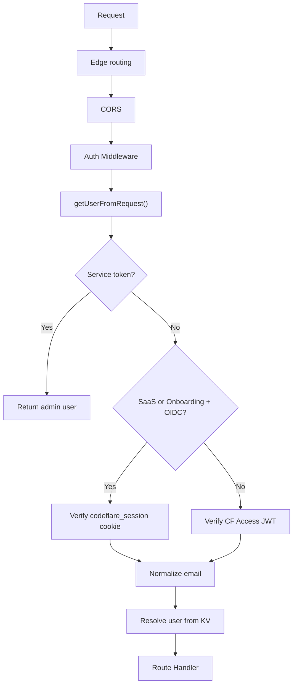
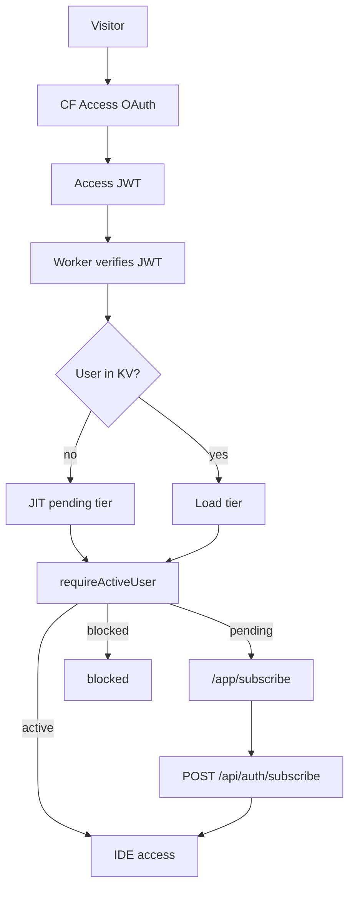

# Identity & Access

**Audience:** Operators, Developers

**Owns:** authentication-mode selection, credential precedence, verified identity, sessions/cookies, logout, expiry recovery, authorization middleware, admin authorization, verified-identity-to-user provisioning, approval/activation transitions, and offboarding handoffs.

**Does not own:** effective billing entitlement, provider-account connection mechanics, bucket algorithms, Access resource configuration, provider-secret placement, token containment, or frontend composition.

## Contents

- [Authentication Modes](#authentication-modes)
- [Interactive Authentication](#interactive-authentication)
- [Service Authentication](#service-authentication)
- [Identity and Authorization](#identity-and-authorization)
- [Mode-aware Routing](#mode-aware-routing)
- [Provisioning State Model](#provisioning-state-model)
- [SaaS JIT Provisioning](#saas-jit-provisioning)
- [Enterprise JIT Provisioning](#enterprise-jit-provisioning)
- [Approval and Activation](#approval-and-activation)
- [Offboarding Handoff](#offboarding-handoff)
- [Compatibility and Migration](#compatibility-and-migration)
- [Integration Aliases](#integration-aliases)
- [Requirement and Source Map](#requirement-and-source-map)
- [Related Documentation](#related-documentation)

## Authentication Modes

Codeflare selects one authentication branch for a request. Entering a configured branch never falls through to a weaker branch after verification fails.

| Condition | Interactive mechanism | Session credential | User authority |
|---|---|---|---|
| Session-OIDC deployment with `OAUTH_CLIENT_ID` | Worker-managed GitHub OAuth | `codeflare_session` cookie | Cryptographically verified GitHub identity plus durable user record |
| Otherwise | Cloudflare Access | `CF_Authorization` JWT | Verified Access identity plus configured/durable admission policy |
| Service secret configured and matching `X-Service-Auth` | Service automation path, evaluated first | Custom header | Synthetic admin automation identity; AD68 restrictions remain unimplemented |
| Setup incomplete and no configured identity path | Bounded pre-setup fallback only | Verified edge header under the setup guard | Bootstrap administration; disabled once configuration completes |

Session-OIDC includes the configured SaaS or onboarding flows. SaaS mode alone does not imply GitHub OAuth: without `OAUTH_CLIENT_ID`, requests stay on Cloudflare Access. <!-- @impl: src/lib/access.ts::authenticateRequest -->

### Credential precedence

1. Validate the optional `X-Service-Auth` path.
2. When session-OIDC is active and GitHub OAuth is configured, validate `codeflare_session`.
3. Otherwise validate the Cloudflare Access JWT.
4. Permit the tightly bounded pre-setup fallback only while setup is incomplete.
5. Reject invalid, expired, unverified, or missing credentials; never continue into another user-auth branch after failure.

### Failure posture

| Failure | Result |
|---|---|
| Invalid/expired session or Access credential | Authentication failure or top-level sign-in recovery; no JIT persistence |
| Configured identity provider unavailable | Fail closed for the request; existing durable user data is not rewritten |
| Missing optional service secret | Service authentication is disabled |
| Matching service secret | Current source returns the automation admin identity in every mode; see the explicit AD68 residual risk below |
| Unverified first-login identity | Reject before bucket claim or durable user creation |

## Interactive Authentication

### Direct GitHub OAuth Flow

The Worker creates a signed OAuth state carrying a nonce and bounded return target, redirects to GitHub, validates the callback state, exchanges the code, and accepts only a verified primary email. Callback-local provider credentials are used only for that flow and are not returned to the browser. Successful authentication issues `codeflare_session` with `HttpOnly`, `Secure`, and `SameSite=Lax`; the session has a one-hour lifetime and is refreshed when less than fifteen minutes remain. <!-- @impl: src/routes/github-auth.ts::app -->

State validation and nonce/single-use behavior prevent callback replay and open redirects. Provider errors fail the callback; they do not fall back to Cloudflare Access inside the same request.
<!-- @impl: src/routes/github-auth.ts::app -->

```mermaid
flowchart TD
    A[Request] --> B[Edge routing]
    B --> C[CORS]
    C --> D[Auth Middleware]
    D --> E["getUserFromRequest()"]
    E --> F{Service token?}
    F -->|Yes| G[Return admin user]
    F -->|No| H{SaaS or Onboarding + OIDC?}
    H -->|Yes| I[Verify codeflare_session cookie]
    H -->|No| J[Verify CF Access JWT]
    I --> K[Normalize email]
    J --> K
    K --> L[Resolve user from KV]
    L --> M[Route Handler]
```

### Human Access claims for the Operator Interface

`src/lib/jwt.ts::verifyHumanAccessJWT` shares signature, issuer, audience, time validation and JWKS caching with `verifyAccessJWT`, but requires a nonempty human subject/email, application token type and no service-token `common_name`. It returns only verified subject/email/issuer/audiences and actual issued-at/expiry, never the bearer token. The existing email verifier and ordinary authentication callers retain their accepted claim shape.

This primitive is not operator admission or renewal: callers must still enforce enterprise eligibility, owner resolution and valid authority at each protected effect. Missing/expired human context cannot fall back to service/setup/session credentials. See [REQ-OPERATOR-001](../../sdd/spec/operators.md#req-operator-001-verified-human-access-claims). The primitive alone does not establish Operator admission, deployment or activation; those require the separately authorized runtime and release evidence.

### Cloudflare Access Flow

The Worker verifies Access JWTs against the configured issuer/JWKS and derives the principal from verified claims. Setup may create the Access application, groups, and policies in applicable modes; exact resource configuration belongs to [Configuration](configuration.md).
<!-- @impl: src/index.ts::app -->

```mermaid
flowchart TD
    A["Visitor"] --> B["CF Access OAuth"]
    B --> C["Access JWT"]
    C --> D["Worker verifies JWT"]
    D --> E{"User in KV?"}
    E -->|no| F["JIT pending tier"]
    E -->|yes| G["Load tier"]
    F --> H["requireActiveUser"]
    G --> H
    H -->|pending| I["/app/subscribe"]
    H -->|active| J["IDE access"]
    H -->|blocked| K["blocked"]
    I --> L["POST /api/auth/subscribe"]
    L --> J
```

The Access flow diagram illustrates Access-backed SaaS activation. Enterprise admission uses the separate [Enterprise JIT](#enterprise-jit-provisioning) path; deployment modes do not share one pending-subscription transition.

### Session issuance and refresh

Browser JavaScript cannot read either authentication cookie. API requests carry credentials automatically. Session refresh reissues the same secure cookie attributes; identity is normalized before durable lookup.

### Logout

The frontend calls `/auth/logout`. The Worker dispatches session-OIDC deployments to `/auth/github/logout`, which clears `codeflare_session`; default/Enterprise Access deployments use `/cdn-cgi/access/logout`. This avoids sending a session-OIDC return target through Access's incompatible logout redirect rules. Operator catalog “Sign in again” uses native navigation to this dispatcher, not SPA navigation to `/` that can retain the denied session. <!-- @impl: src/routes/auth-redirects.ts::app --> <!-- @impl: web-ui/src/components/OperatorManagement.tsx::OperatorManagement -->

### Access Session Expiry and Restored Pages

Authenticated API clients treat explicit 401, manual/opaque redirects, and HTML login responses as the same expired-session condition. They replace the top-level location with `/` and render a redirecting state until navigation commits. Mobile/bfcache restoration revalidates on visibility return and persisted `pageshow`; valid sessions continue, expired sessions re-enter the normal sign-in path. Fingerprinted application assets remain immutable while HTML remains revalidating, preventing an expired restored page from replacing CSS/JavaScript with login HTML. <!-- @impl: web-ui/src/api/fetch-helper.ts::expiredSessionError --> <!-- @impl: web-ui/src/App.tsx::App -->

## Service Authentication

Service automation uses `X-Service-Auth` only when the optional Worker `SERVICE_AUTH_SECRET` is configured. Environment-specific source-secret mapping and GitHub Environment placement belong to private [Deployment testing](https://github.com/nikolanovoselec/codeflare-private/blob/main/docs/verification/deployment-testing.md).

Current source checks this header before user authentication, compares it in constant time, and returns an admin automation identity when it matches. The stress-mode, SaaS-mode, and hostname restrictions accepted in [AD68](../decisions/README.md#ad68-service-token-admin-bypass-must-be-environment-gated-and-hostname-restricted) are **not implemented** and remain tracked by issue #130. This path must therefore be treated as a privileged residual risk, not described as environment-gated hardening. <!-- @impl: src/lib/access.ts::validateServiceAuthHeader -->

Cloudflare Access service headers remain an edge-auth mechanism where configured; they are not a substitute for Codeflare's custom Worker service-auth contract.

## Identity and Authorization

### Verified identity

Email identities are trimmed and normalized before durable lookup. A new identity becomes eligible for provisioning only after the active cryptographic verifier succeeds. Bucket authority is resolved server-side through the user/bucket claim boundary; a caller-supplied or merely sanitized bucket name is not authority.

### Authorization middleware

| Middleware | Contract |
|---|---|
| `requireIdentity` | Requires an authenticated principal; does not independently grant active entitlement |
| `requireActiveUser` | Requires identity and applies mode-aware active-user/tier gates |
| `requireAdmin` | Requires prior authentication and a durable admin role or current Enterprise Access-group elevation |

Blocked and pending outcomes are explicit authorization failures. Effective entitlement and session-mode policy belong to [Billing](billing.md).

### Admin authorization

A durable `role: 'admin'` record grants administration. Enterprise may additionally elevate a request through the configured Access admin group. That check runs only on admin-gated routes, short-circuits for a durable admin, and fails closed on a missing token, invalid Access domain, non-membership, or provider error. Elevation is request-local and writes no admin role, so group removal applies on the next request. <!-- @impl: src/middleware/auth.ts::requireAdmin -->

## Mode-aware Routing

### Root and login routing

The root route chooses the landing, login, authenticated application, or setup path from deployment mode, setup state, and authenticated identity. Session-OIDC login pages remain Worker-owned; Access deployments defer interactive login to Access. Enterprise's public provider projection is empty so SPA root navigation cannot select the marketing login from Access IdPs ([REQ-ENTERPRISE-008](../../sdd/spec/setup.md#req-enterprise-008-enterprise-frontend-surface-suppression)); other deployment modes retain their provider projections. Pending SaaS users route to subscription through provisioning/entitlement policy, not through an alternative authentication mechanism. <!-- @impl: src/index.ts::app -->

### Setup boundary

Session-OIDC deployments do not create competing Cloudflare Access resources for the same application hostname. Access-backed modes may create and reconcile their Access application/policies during setup. Once setup is complete, the pre-setup identity fallback is disabled.

## Provisioning State Model

Provisioning begins only after the active authentication mechanism establishes cryptographic identity. Token presence, caller-supplied email, or a sanitized bucket name is insufficient.

| State / transition | Durable authority | Observable result |
|---|---|---|
| Unknown, verified SaaS identity | `user:{normalized-email}` absent | Create pending user, then route to activation/subscription |
| Unknown, verified Enterprise identity | User absent and optional Access entry gate passes | Create Enterprise JIT user with active initial state |
| Existing user | Durable record | Preserve stored role and fields; apply request-time deployment overrides separately |
| Pending → active | Approved free/direct activation or provider-confirmed paid state | Effective entitlement permits application/session behavior |
| Any → blocked | Durable administrator/provider transition | Authentication may succeed, but active-user authorization fails |
| Offboarding | Durable user plus cleanup handoffs | Revoke credentials, destroy sessions, remove scoped storage/control state |

Bucket ownership is resolved through the strongly consistent user/bucket claim boundary before durable provisioning uses it. Storage mechanics remain in [Storage & Sync](storage-and-sync.md). <!-- @impl: src/lib/access.ts::authenticateRequest -->

## SaaS JIT Provisioning

1. The configured Access or session-OIDC verifier produces a normalized, verified identity.
2. The resolver checks `user:{email}` and refuses first-login persistence when verifier provenance is absent.
3. The bucket claim boundary resolves durable ownership.
4. `resolveOrProvisionUser()` creates the initial pending record when the user is unknown.
5. `requireActiveUser` prevents pending application access and routes the browser to activation/subscription. <!-- @impl: src/lib/access.ts::resolveOrProvisionUser -->

This flow is provider-independent: a verified Cloudflare Access-backed SaaS identity is eligible just as a verified GitHub OAuth identity is.

### Concurrent first login

Workers KV is eventually consistent. Simultaneous first requests may both observe no record and write the same initial state; identical writes converge, but there is no per-key serialization. Bucket authority and welcome delivery use their own stronger boundaries so duplicate first-login observations do not grant another user's storage or send repeated welcome messages.

### Welcome-delivery handoff

After successful first provisioning, a strongly serialized Timekeeper claim selects one welcome-delivery owner. The email provider receives a deterministic idempotency key. Delivery is best effort and does not roll back the durable user record; absence or failure remains observable in logs and retry ownership rather than a `welcome-sent:*` KV flag.

## Enterprise JIT Provisioning

Enterprise provisioning runs before the SaaS branch for a verified Access identity.

1. `resolveOrProvisionEnterpriseUser()` returns an existing durable record without rewriting or downgrading it. Request-time Enterprise overrides are applied separately. <!-- @impl: src/lib/access.ts::resolveOrProvisionEnterpriseUser -->
2. For an unknown identity, a nonempty configured user-entry group list enables a live gate against the union of user-entry and admin groups. Membership in either list admits the identity. An empty user-entry list leaves this additional gate off, even if admin groups are configured; a required check with non-membership, missing/invalid Access token, unsafe Access domain, or provider error fails closed and creates no user.
3. On admission, the durable record uses `addedBy: 'enterprise-jit'`, role `user`, initial advanced access fields, and unlimited subscription projection. No subscription/welcome flow runs.
4. Effective tier and mode resolvers force the active Enterprise behavior independently of stale stored compatibility fields.

### Existing-user preservation and admin union

A setup administrator remains a durable admin. An Enterprise admin Access group may elevate an admitted request for admin routes without persisting role changes. When the user-entry gate is enabled, admin-group membership also satisfies admission. Admission and admin elevation remain separate decisions: admission does not itself grant administration, and admin elevation does not rewrite stored role or session-limit role resolution. [Admin authorization](#admin-authorization) owns the check.

### Fail-closed outcomes

| Failure | Result |
|---|---|
| Unverified identity | Reject before lookup/provisioning side effects |
| Configured entry group and non-member | Reject; no user write |
| Access identity lookup error or unsafe domain | Treat as non-member; no user write |
| Concurrent identical JIT writes | May both write; deterministic initial state converges |
| Existing record | Return without destructive normalization |

## Approval and Activation

### Pending activation

Pending users may choose the configured activation path. When Stripe is configured, every non-free paid selection uses checkout; direct `/api/auth/subscribe` does not activate those paid tiers. Free or intentionally provider-free deployment flows follow the route's configured direct behavior.

Turnstile is required only for a new subscription when the site key/secret is configured. Existing active subscribers changing plan are exempt. Missing or rejected required verification performs no provider call and no user mutation. Exact payment and entitlement behavior belongs to [Billing](billing.md); request/response envelopes belong to the [API Reference](api-reference.md#auth-saas-mode).

### Approval transitions

Administrator approval, provider-confirmed checkout, onboarding admission, and block/unblock actions must preserve verified identity and unrelated durable fields. A transition becomes visible through active-user middleware and effective entitlement; frontend selection alone cannot activate a user.

### Entitlement alias

Configured tier modes, paid `subscribedMode`, stored next-session preference, downgrade policy, and Enterprise override are owned by [Billing](billing.md#concurrent-session-and-mode-gates). When an administrator assigns `advanced`, `max`, or `unlimited`, source may initialize `sessionMode: 'advanced'`; that preference does not bypass effective entitlement. <!-- @impl: src/routes/users.ts::app -->

## Offboarding Handoff

**Requirement:** [REQ-SETUP-013 AC6](../../sdd/spec/setup.md#req-setup-013-managed-environment-configuration)

Managed environment Setup is deployment configuration, not an entitlement source. Enabling, replacing, disabling, or omitting its fields does not infer offboarding or invoke the user-cleanup path. Destructive offboarding requires the explicit authoritative workflow tracked separately in issue #905. <!-- @impl: src/routes/setup/index.ts::default -->

Provisioning owns orchestration; specialist owners perform each operation. Explicit account cleanup is not the same contract as an individual session Stop/Delete.

| Handoff | Current result contract |
|---|---|
| Historical accounting | D1 tombstone must succeed before live account cleanup; failure returns `503 history_delete_unavailable` before live data removal |
| Active sessions | Cleanup attempts destruction, logs failures, then deletes eligible D1 owner rows. Rows with a pending boundary activity are retained; `deletedSessions` counts deleted rows, not confirmed teardowns |
| GitHub provider binding | Attempt revocation, log failure, clear local credential, and continue |
| Cloudflare provider binding | Revocation failure aborts cleanup under its provider-owned contract |
| User/bucket KV | Remove normalized user-scoped control keys after provider handoffs settle |
| R2 token | Deletion failure is logged and can leave `tokenDeleted: false` |
| R2 objects and bucket | Empty/delete failure is logged and can leave `bucketDeleted: false` |
| Usage/accounting state | Remove the live KV usage projection; preserve retained historical accounting under Billing |

The route logs the cleanup result but returns `{ success: true, email }` even when container, token, or bucket cleanup is unconfirmed. GitHub warnings indicate possible residual provider access but do not retain local credentials or stop cleanup. Operators must treat container warnings and false `tokenDeleted`/`bucketDeleted` as residual work; a session count is not teardown proof. The API has no fail-closed completion receipt for those best-effort handoffs. This limitation must not be generalized to the generation-fenced individual [session contract](api-reference.md#session-management). The [original KV cleanup wording](https://github.com/nikolanovoselec/codeflare/blob/6c1c11936740/documentation/lanes/user-provisioning.md#offboarding-handoff) is historical, not current session-storage authority.

## Compatibility and Migration

- Legacy `accessTier` remains a read fallback while `subscriptionTier` is preferred.
- Tier mutation writes `subscriptionTier` and a compatible legacy `accessTier`; newer tier names map to legacy `advanced` where the old schema has no equivalent.
- Auth status without either stored tier preserves the legacy `advanced` fallback.
- General tier resolution uses the configured tier marked `isDefault`; `isActiveTier(undefined)` remains active for backward compatibility.
- Migration must not invent entitlement beyond those explicit compatibility defaults.
- Enterprise request-time overrides do not require rewriting older durable records.
- Normalized email remains the durable identity key input.
- Eventual consistency is explicit; no prose may claim KV per-key serialization.

### Authentication and configuration alias

Access application creation, policy/group configuration, and deployment-mode selection belong to [Authentication Modes](#authentication-modes) and [Configuration](configuration.md).

### Frontend alias

Subscription, pending, administration, and Enterprise-suppression components render backend state. Component composition is not provisioning authority. The [original composition account](https://github.com/nikolanovoselec/codeflare/blob/6c1c11936740aa290266fc98fcbc360d3b5b3af1/documentation/lanes/architecture-internals.md#saas-and-frontend-composition) records historical implementation; current behavior is owned by this lane, [Billing](billing.md), and the frontend sources.

## Integration Aliases

### Provider account connections

Connecting GitHub or Cloudflare after authentication binds provider capability to the already verified user. Provider OAuth/PAT transport and token containment are owned by [Security](security.md#api-token-containment), [GitHub integration](api-reference.md#github-integration), and [Configuration](configuration.md). GitHub connections authorized before the `gist` scope was added must be disconnected and reconnected before gist-backed features are available.

### Bucket ownership

Authentication supplies verified identity and owns the durable provisioning transition; [Storage & Sync](storage-and-sync.md) owns bucket persistence. This lane does not duplicate bucket algorithms or creation procedures.

### Configuration

Public activation flags, identity-provider settings, cookie secrets, email credentials, and their consumers are catalogued in [Configuration](configuration.md). Exact non-default values and environment placement belong to private [Onboarding and SaaS modes](https://github.com/nikolanovoselec/codeflare-private/blob/main/docs/deployment/onboarding-and-saas.md) and [user OAuth registration](https://github.com/nikolanovoselec/codeflare-private/blob/main/docs/integrations/user-oauth.md).

### Frontend identity surfaces

Header/dropdown components render the current principal and invoke the canonical logout route. Component composition remains frontend implementation; it is not a second authentication authority.

### Current invariants and residual risks

- Entered authentication branches never fall through after verifier failure.
- Workers KV is eventually consistent; identical concurrent first-login writes may converge, but KV provides no per-key serialization.
- Access-group admin elevation is request-local and does not alter stored role or session-limit role resolution.
- AD68 service-auth restrictions remain unimplemented.
- Authentication success alone does not imply active entitlement, provisioning completion, or storage readiness.

## Requirement and Source Map

Exhaustive requirement status remains in active SDD domains. This is navigation, not a coverage or acceptance ledger.

| Concern | Requirements / decisions | Implementation / behavioral evidence |
|---|---|---|
| Mode selection and credential order | [REQ-AUTH-001](../../sdd/spec/authentication.md#req-auth-001-two-authentication-modes), [REQ-AUTH-011](../../sdd/spec/authentication.md#req-auth-011-auth-resolution-order) | `src/lib/access.ts::authenticateRequest`; `src/__tests__/lib/access*.test.ts` |
| GitHub OAuth and verified email | [REQ-AUTH-002](../../sdd/spec/authentication.md#req-auth-002-saas-mode-uses-direct-github-oauth) | `src/routes/github-auth.ts`; `src/__tests__/routes/github-auth*.test.ts` |
| Logout and expiry recovery | [REQ-AUTH-009](../../sdd/spec/authentication.md#req-auth-009-logout-dispatches-by-mode), [REQ-AUTH-022](../../sdd/spec/authentication.md#req-auth-022-session-expiry-on-resume-produces-a-clean-sign-in-redirect-never-a-blank-page) | `src/routes/auth-redirects.ts`, `web-ui/src/api/fetch-helper.ts`, `web-ui/src/App.tsx`; redirect/restored-session suites |
| Service automation residual | [REQ-AUTH-004](../../sdd/spec/authentication.md#req-auth-004-service-token-authentication-for-service-automation), [AD68](../decisions/README.md#ad68-service-token-admin-bypass-must-be-environment-gated-and-hostname-restricted) | `src/lib/access.ts::validateServiceAuthHeader`; issue #130 and access/service-auth suites |
| Admin authorization | [REQ-AUTH-018](../../sdd/spec/authentication.md#req-auth-018-user-management-admin-panel), [REQ-ENTERPRISE-014](../../sdd/spec/authentication.md#req-enterprise-014-admin-access-via-cloudflare-access-groups) | `src/middleware/auth.ts::requireAdmin`; Enterprise access-group suites. Original provisioning map named `src/lib/access.ts::requireAdmin`; retain that original pointer as historical, not current handler authority |
| Verified SaaS JIT | [REQ-AUTH-007](../../sdd/spec/authentication.md#req-auth-007-jit-user-provisioning-in-saas-mode) | `src/lib/access.ts::resolveOrProvisionUser`; access/JIT suites |
| Enterprise JIT and entry group | [REQ-ENTERPRISE-010](../../sdd/spec/authentication.md#req-enterprise-010-access-gated-jit-user-provisioning) | `src/lib/access.ts::resolveOrProvisionEnterpriseUser`; Enterprise access-group suites |
| Activation/subscription handoff | [REQ-SETUP-009](../../sdd/spec/setup.md#req-setup-009-subscribe-page-with-tier-selection), [Subscription SDD](../../sdd/spec/subscription.md) | auth/billing routes; subscribe/checkout suites |
| Offboarding | [REQ-GITHUB-005](../../sdd/spec/github.md#req-github-005-disconnect-and-offboarding-revocation), user cleanup requirements | user cleanup and specialist owners; cleanup/revocation suites |

## Related Documentation

- [Billing](billing.md) — effective entitlement and payment lifecycle
- [Security](security.md) — credential containment and residual risks
- [Configuration](configuration.md) — settings, Access resources, routine Administration
- [Storage & Sync](storage-and-sync.md) — durable bucket behavior
- [API Reference](api-reference.md) — authentication, provider, and user/admin contracts
- [Architecture](architecture.md) — cross-component identity and provisioning flows
