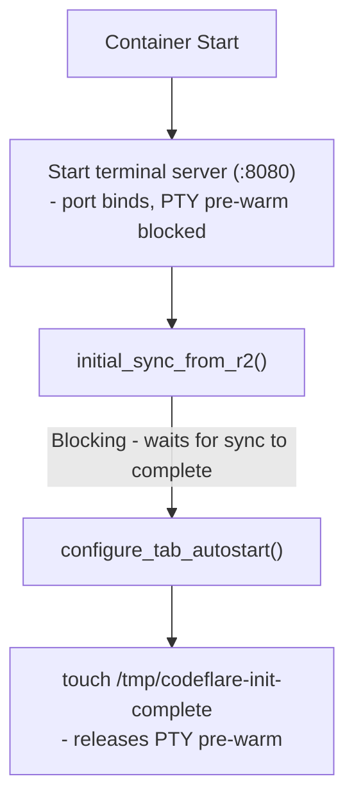

# Container

Container image contents, startup sequence, AI tool integration, auto-sleep configuration, and injected features.

**Audience:** Operators, Developers

**Owns:** image contents, startup and readiness, host/runtime supervision, idle policy, teardown orchestration, and transport recovery. **Does not own:** durable-file reconciliation detail, endpoint schemas, entitlement policy, or credential-containment rationale.

---

## Contents

- [Container Image](#container-image)
- [Runtime Paths](#runtime-paths)
- [Runtime Lifecycle](#runtime-lifecycle)
- [Agent Runtime Interfaces](#agent-runtime-interfaces)
- [Release and Deployment Alias](#release-and-deployment-alias)
- [Requirement and Source Map](#requirement-and-source-map)
- [Related Documentation](#related-documentation)

## Container Image

**File:** `Dockerfile` - Base: `public.ecr.aws/docker/library/node:24-bookworm-slim` (AWS ECR Public mirror; avoids Docker Hub anonymous pull rate limits on CI runners), multi-stage build (builder compiles native addons, runtime has no build tools).

### Installed Tools

| Category | Packages |
|----------|----------|
| Sync | rclone |
| Version Control | git, github-cli (gh), lazygit |
| Editors | vim (symlinked to neovim), neovim, nano |
| Network | curl, openssh-client |
| Process | procps (ps, pgrep) |
| Utilities | jq, python3 plus `python` alias, ripgrep, fd, tree, htop, tmux, yazi, fzf, zoxide, bat |

### Lock-backed NPM Tools

The shared npm-tool set—agent CLIs, Bun, context-mode, `consult-llm-mcp`, and `chrome-devtools-mcp`—installs from `preseed/npm-tools/package.json` and its committed lock. `.cache-bust` still invalidates that layer on each deploy, but `npm ci` preserves reviewed registry integrity and transitive versions. Before the layer is committed, the build removes alternate Claude, Codex, Copilot, and OpenCode operating-system, architecture, baseline, and musl payloads while retaining each canonical Linux x64 package. The pruning unit test verifies retained canonical package directories and removed variants; deployment's complete-image smoke rejects any retained alternate package and executes every selected launcher. The pruning boundary also reports reclaimed bytes ([REQ-OPS-040](../../sdd/spec/operations.md#req-ops-040-selected-coding-agent-packaging) AC4).

The environment-scoped GitHub variable `CODING_AGENTS` may narrow shared launchers to any non-empty subset of `claude-code,codex,copilot,antigravity,opencode,pi`; unset preserves all six. The build canonicalizes and hashes the set, prunes omitted npm agents in the install layer, and skips Antigravity's checksum-backed installer when omitted. Bash and shared non-agent tools remain. Native Pi/Claude IDE inventories and Pi's separate prewarm/Jiti layout are intentionally unaffected ([REQ-OPS-038](../../sdd/spec/operations.md#req-ops-038-build-selected-coding-agent-clis), [REQ-OPS-040](../../sdd/spec/operations.md#req-ops-040-selected-coding-agent-packaging), [REQ-OPS-039](../../sdd/spec/operations.md#req-ops-039-reduced-image-capability-preservation)).

Antigravity remains a checksum-verified installer outside npm when selected. Browser Run MCP uses its own committed package lock. Weekly Shadow Pins updates each owning manifest and lock after the supply-chain cooldown.

**Known trade-off:** Long-lived sessions keep the image version they started with while a later reviewed image may carry newer CLIs. Version changes remain a compatibility risk, but they now pass PR checks and image smoke instead of entering an arbitrary deploy through mutable resolution.

| Package | Current pin | Provides |
|---------|-------------|----------|
| `@anthropic-ai/claude-code` | image-tools lock | Terminal `claude` command. Runs with `IS_SANDBOX=1` plus the tab-1 permission mode. The Browser IDE official extension has its own Open VSX pin. |
| `@openai/codex` | image-tools lock | `codex` command |
| Antigravity (agy) | installer SHA-256 pinned | `agy` command. The reviewed installer hash is verified before execution. |
| `opencode-ai` | image-tools lock | `opencode` command |
| `@github/copilot` | image-tools lock | `copilot` command. Post-install: non-linux-x64 prebuilds, `mxc-bin/arm64`, bundled `ripgrep/` (system `rg` used instead), and non-linux native modules (`clipboard`, `pvrecorder`, `sharp` node_modules) stripped to save ~200MB. |
| `@earendil-works/pi-coding-agent` | image-tools lock | `pi` command and local RPC backend used by native Pi Chat. |
| `bun` | image-tools lock | JS/TS subprocess runtime autodetected by context-mode. The shadow-pin workflow updates the shared manifest and lock. Image cleanup retains only the linux-x64 executable and strips non-Linux packages. |
| `consult-llm-mcp` | image-tools lock | `consult-llm-mcp` command — the LLM Consultation MCP server for Claude Code + Pi. |
| `browser-run-mcp` | dedicated package lock | Claude Code's cheap one-shot Browser Run READ surface. |
| `chrome-devtools-mcp` | image-tools lock | Interactive Browser Run for Claude Code and Pi. The image exposes a baked executable; advanced-mode startup registers it only with a Browser Rendering token. Shadow-pin automation updates the shared manifest and lock. ([REQ-BROWSER-001](../../sdd/spec/browser-run.md#req-browser-001-browser-run-as-a-webfetch-fallback-claude-code-via-chrome-devtools-mcp), [REQ-BROWSER-006](../../sdd/spec/browser-run.md#req-browser-006-pi-interactive-browser-via-chrome-devtools-through-the-pi-mcp-adapter)) |

`consult-llm-mcp` and `chrome-devtools-mcp` are installed by the shared `npm ci` and linked onto `PATH`; the build also executes Chrome DevTools MCP's help command. Runtime config points both agents at stable binaries, so sessions perform no registry resolution. Their shadow-pin jobs update the shared manifest and lock atomically.

Additional details:

**`browser-run-mcp`:** Claude Code's cheap one-shot Browser Run READ surface. Exposes `browser_markdown` / `browser_content` / `browser_scrape` over Cloudflare Browser Run REST Quick Actions. Its dedicated committed lock installs with `npm ci`, followed by an import smoke test. The weekly SDK bump updates the exact manifest pin and lock together. Pi's equivalent is the native `browser-run.ts` + `browser-run-helpers.ts` extension. ([REQ-BROWSER-005](../../sdd/spec/browser-run.md#req-browser-005-claude-browser-run-mcp-server-read-surface-parity))

### Pi Extension npm Cache

Pi extension dependencies derived from `preseed/agents/pi/package.json` are preinstalled at Docker build time into `/opt/codeflare/pi-agent/npm/` (see **Pi SDK lockstep** below for the install step). This includes Goal, context-mode, subagents, and the managed tool extensions. (Graphify tools are exposed as a first-party native Pi extension via `graphify-native.ts`, not as an npm package — see [Preseed System](preseed.md).) On container boot, `warm_pi_npm_dependencies()` in `entrypoint.sh` symlinks `~/.pi/agent/npm/node_modules` to the image-local cache (instant, zero-copy). The symlink is recreated on each boot since `**/node_modules/**` is excluded from R2 sync. `PI_OFFLINE=1` prevents Pi from writing to the read-only target.

The runtime npm cache (`~/.npm`) is purged at boot to reclaim ~200MB of disk from prior session installs.

Neither `entrypoint.sh` nor the preseeded `context-mode-runtime.ts` extension forces `CONTEXT_MODE_BRIDGE_IDLE_MS=0` globally. Package assembly installs context-mode with `extensions: []` (skills remain available), and `context-mode-runtime.ts` loads the installed Pi adapter once for the process-wide foreground owner. In-process subagent ResourceLoaders therefore never initialize context-mode or spawn `server.bundle.mjs`; they use native fallbacks. The owner is released on `session_shutdown`, so root reload/toggle cycles clean up and reattach one bridge without modifying either upstream package ([AD101](../decisions/README.md#ad101-context-mode-is-foreground-owned-in-pi-in-process-subagents-use-native-transports), [REQ-AGENT-076](../../sdd/spec/agents.md#req-agent-076-pi-context-mode-enablement-and-tool-extension-defaults) AC1/AC7, [REQ-AGENT-089](../../sdd/spec/agents.md#req-agent-089-pi-context-mode-foreground-ownership)).

**Pi SDK lockstep (build-time):** the runtime image-tools manifest and Pi prewarm manifest commit the same exact Pi version. Both installs consume committed locks with `npm ci`; the image compares the two pins before installation and verifies the installed prewarm version afterward. Pi bump automation updates both manifests, both locks, bundled-dependency integrity pins, and the embedded seed atomically.

The bounded `brace-expansion` 5.0.9 and Undici 7.29.0/8.9.0 lock corrections handle upstream packed shrinkwrap entries until their owning releases include patched dependencies. [`scripts/apply-npm-security-lock-pins.mjs`](../../scripts/apply-npm-security-lock-pins.mjs) content-addresses each correction by the registry SHA-512 and fails closed on malformed locks under [REQ-OPS-033](../../sdd/spec/operations.md#req-ops-033-lock-backed-npm-bump-coherence).

### V8 Compile Cache Warm-Up

Pi is warmed at Docker build time by running `pi --version`, which triggers V8 to compile and cache bytecode via `NODE_COMPILE_CACHE`. This pre-populates the compile cache so that first-launch inside containers skips the JavaScript compilation overhead, resulting in faster startup times. Go binaries (opencode, Antigravity/agy) are already natively compiled and do not need V8 cache warm-up. Claude Code ships as a native binary and is verified at build time via `claude --version`.

**codex and copilot are excluded (image-size owner decision, [AD96](../decisions/README.md#ad96-deactivate-codexcopilot-v8-warm-up-and-opencode-db-pre-init-image-size)):** both warm-ups are commented out in the Dockerfile so their bytecode is not baked into the image; each pays the V8 compile cost on its own first launch instead. Re-enable by restoring the two commented `RUN` lines next to `RUN pi --version` in the Dockerfile.

### Pi Extension Jiti Transpile Cache Warm-Up ([AD79](../decisions/README.md#ad79-image-baked-pi-extension-transpile-cache))

`pi --version` does **not** load extensions, so the V8 warm-up above leaves Pi's TypeScript extension set cold. A dedicated build layer pre-transpiles the full Pi extension set (npm packages + local preseed extensions) into a baked jiti cache. Without it, every fresh container paid ~9s of cold jiti transpile before Pi's first PTY output, pushing the host's pre-warm past its 20s hard cap. Mechanics:

- jiti caches transpiles under `$TMPDIR/jiti`; the warm run redirects `TMPDIR` and moves the result to `/opt/codeflare/jiti-cache`. <!-- @impl: Dockerfile::PI_CODING_AGENT_DIR -->
- Before the terminal host starts, entrypoint exports `TMPDIR=/run/codeflare/pi-tmp` and links its `jiti` child to the image cache. <!-- @impl: entrypoint.sh::configure_pi_jiti_runtime_cache -->
- jiti's cache key is **path-sensitive** — the async entry filename encodes `hash(realpath)`, while the compiled output embeds a source/version marker that rejects stale content. Identical bytes at two different paths therefore produce entries that never hit each other.

    The warm run therefore transpiles each extension at exactly the path Pi loads it from at runtime (`/home/user/.pi/agent/extensions/`), using the real `PI_CODING_AGENT_DIR`/`HOME` — not a throwaway tmpdir. npm packages hit regardless because warm and runtime both resolve through the same symlink realpath (`/opt/codeflare/pi-agent/npm`). The entrypoint's `relay_managed_pi_extensions()` keeps the on-disk extension bytes equal to the build so the embedded content marker validates in all deployment modes.
- The package list is **derived** from the preseed `package.json`, so a version bump there warms the right set automatically.
- The build is **fail-closed**: after warm-up, it requires a cache artifact for every local preseed extension and for Goal and Usage. <!-- @impl: Dockerfile::goal_hit --> <!-- @impl: Dockerfile::usage_hit -->

    Local extensions are checked by cache filename (`extensions-<base>.<hash>.mjs`). A separate explicit Pi load warms `@narumitw/pi-goal` and `@narumitw/pi-usage` from their installed `src/index.ts` entrypoints; Goal's image transform also makes that warmed patched source its package-declared runtime entrypoint. Each expected artifact is derived from its resolved source path and must be a regular file ([REQ-AGENT-111](../../sdd/spec/agents.md#req-agent-111-native-goal-workflow-in-pi-sessions) AC2/AC3; [REQ-AGENT-131](../../sdd/spec/agents.md#req-agent-131-native-usage-workflow-in-pi-sessions) AC2/AC3). An added extension, one modified into a non-loading state, a skipped extension, or a Pi CLI change that breaks warm-up therefore fails the build instead of silently regressing production startup.

### OpenCode Database Pre-Initialization

OpenCode uses SQLite with Goose migrations that run on first startup ("Performing one time database migration"). The DB is stored at `~/.local/share/opencode/opencode.db` (XDG data directory).

**Disabled (image-size owner decision, [AD96](../decisions/README.md#ad96-deactivate-codexcopilot-v8-warm-up-and-opencode-db-pre-init-image-size)):** the Dockerfile's `opencode run "hello"` build-time warm-up is commented out — it baked ~147MB of opencode data into the image. OpenCode now runs its one-time DB migration on first interactive launch instead. Re-enable by uncommenting the `RUN ANTHROPIC_API_KEY="" ... opencode run "hello"` block in the Dockerfile.

### Browser Shims

CLI tools (Claude Code, OpenCode, Antigravity) try to open a browser for OAuth. The Dockerfile installs shims (`open-url` for `BROWSER` env var, `xdg-open-shim` for `xdg-open`) that exit 1, forcing CLIs to print auth URLs as plain text in the PTY. The xterm.js link provider then detects and makes these URLs clickable.

### code-server Browser IDE Binary

**File:** `Dockerfile` installs coder/code-server 4.132.0 from the pinned linux-amd64 release with SHA-256 verification. The build also verifies code-server commit `313bf0359b4d391ba18f1fa131aad8a583bc2919`, the actual embedded Code package version 1.132.0, and product provenance; it records VS Code gitlink `df53daabb18cd157bdb08c7f01c34df936cf12f4`, which the Shadow Pins job derives from the immutable release tag. Only `/usr/local/bin/code-server` is exposed; no OpenVSCode runtime binary remains. The dedicated `code-server` Shadow Pins job derives the packaged commit and Code version from the immutable upstream release artifact, cross-checks its package/product identities, derives the VS Code source gitlink from the release tag, and invalidates the checksum for operator review. See [AD119](../decisions/README.md#ad119-replace-openvscode-with-pinned-code-server-behind-the-existing-session-proxy).

A digest-pinned Node 22.21.1 stage builds Codeflare's native Pi Chat participant with no runtime npm dependency or native addon. A separate stage fetches Anthropic's exact official `linux-x64` VSIX from Open VSX, verifies its fixed SHA-256 and package identity, extracts its files unchanged, and deletes the archive. The final image contains a root-owned Pi inventory whose visible participant is **Codeflare**, an immutable official Claude inventory, and an empty `none` inventory. Legacy private paths under `openvscode/` and `/opt/codeflare/openvscode/` remain intentionally unchanged for this migration. See [`openvscode/README.md`](../../openvscode/README.md) and [AD114](../decisions/README.md#ad114-native-pi-chat-and-the-official-claude-extension-own-editor-integration).

code-server listens only on container-local `127.0.0.1:13337`; the terminal host remains on the container's exposed port 8080.

---

## Runtime Paths

| Path | Owner / purpose |
|---|---|
| `/home/user` | Runtime user home |
| `/home/user/workspace` | Session working tree synchronized through the storage contract |
| `/home/user/.claude/` | Claude configuration and credentials projection |
| `/opt/codeflare/pi-agent/npm` | Image-local read-only Pi extension npm seed cache |
| `/home/user/.pi/agent/npm` | Runtime Pi extension npm directory copied from the seed on startup |
| `/home/user/.config/rclone/rclone.conf` | Generated rclone configuration |
| `/tmp/sync-status.json` | Initialization/synchronization status read by the private health surface |
| `/tmp/sync.log` | Runtime synchronization diagnostics |

Path ownership is a runtime contract; storage semantics and finalization authority remain in [Storage & Sync](storage-and-sync.md).

## Runtime Lifecycle

**File:** `entrypoint.sh`

Uses polling with safety timeouts: poll until success OR background process exits OR safety timeout expires. Exit immediately on success. Safety timeout `SYNC_TIMEOUT=120` (2 min) prevents infinite blocking.

### Startup Sequence

Port 8080 must bind before Cloudflare's container port-wait timeout (~10-15s) elapses. The entrypoint therefore starts the terminal server immediately - before R2 sync - then gates PTY pre-warm behind a flag file written only after sync and configuration complete.

**Managed Pi extension relay & background-init deprioritization ([REQ-STOR-017](../../sdd/spec/storage.md#req-stor-017-faster-startup-sync--bisync-head-storm-fix--governed-mode-preseed-bake)):** After `configure_tab_autostart()` and before the background bisync `--resync` baseline, `entrypoint.sh` calls `relay_managed_pi_extensions()` **synchronously, in all deployment modes**: it re-lays the image-baked managed Pi extension bytes (`/opt/codeflare/pi-agent/extensions/*.ts`) over the post-sync `~/.pi/agent/extensions/` tree, overwriting only codeflare-owned filenames (user-added extensions and all other seed files are untouched).

This keeps the on-disk extension bytes equal to the build — the content marker validated inside each jiti prewarm artifact (see [Pi Extension Jiti Transpile Cache Warm-Up](#pi-extension-jiti-transpile-cache-warm-up-ad79)) — so the cache hits at runtime instead of cold-transpiling ~2.4s/session. `cp` (no `-p`) gives a fresh mtime so the subsequent `--resync` baseline treats local as authoritative and self-heals R2.

That bisync baseline then runs in a **background subshell deprioritized to `nice 19` / `ionice -c 3` (idle I/O class)**, so it yields the single vCPU and disk to the concurrent PTY pre-warm rather than contending for the core; the scheduling class is inherited by its rclone and daemon children and is best-effort (`|| true`).

> **Enterprise mode:** Before `container.start()`, `wireContainerInterception()` (the container-interception.ts registry) wires outbound-HTTPS interception when `ENTERPRISE_MODE=active` ([REQ-ENTERPRISE-011](../../sdd/spec/enterprise-mode.md#req-enterprise-011-container-start-interception-ordering); see [Architecture — Enterprise LLM Routing](architecture.md#enterprise-llm-routing)). This step is a no-op in non-enterprise deployments.

> **Enterprise mode — container-side CA trust:** When `ENTERPRISE_MODE=active`, `entrypoint.sh` (container-side, separate from the DO-side interception wiring above) installs the Cloudflare containers CA into the system trust store and **prepends** three `export` lines (`NODE_EXTRA_CA_CERTS`, `SSL_CERT_FILE`, `REQUESTS_CA_BUNDLE`) to `~/.bashrc`, so the login-shell agent PTYs inherit the trust settings. The prepend (rather than append) is load-bearing: the `configure_tab_autostart` block launches the agent inline and blocks, so exports placed after it would never be sourced before the agent starts. See [Security — Credential Containment and CA Trust](security.md#enterprise-mode-credential-containment-and-ca-trust). No-op in non-enterprise deployments.

**Init-complete flag ([REQ-SESSION-015](../../sdd/spec/session-lifecycle.md#req-session-015-container-port-readiness-gating-with-pre-warm-pre-condition) AC1):** `CODEFLARE_INIT_FLAG_FILE=/tmp/codeflare-init-complete`. The terminal server polls for this file (every 250ms, up to 130s) before spawning the tab-1 PTY session. This ensures pre-warm reads the fully-restored `.claude.json`, `.bashrc`, and MCP server registrations rather than pre-sync state. If the flag does not appear within 130s (`PREWARM_INIT_WAIT_MS`), pre-warm proceeds anyway. The flag is deleted and recreated on every container start.

Auto-start uses `claude --dangerously-skip-permissions` for fast boot. Auto-updates are disabled by default via `FAST_CLI_START=true` (see [Fast Start](#fast-start) below). Users can enable auto-updates via Settings.

**PTY PATH:** The `.bashrc` tab autostart block sets `PATH="/usr/local/bin:/usr/bin:/bin:$PATH"` so that PTY sessions can find globally installed CLI tools.

### code-server (Browser IDE)

**Workspace-started ([REQ-IDE-003](../../sdd/spec/browser-ide.md#req-ide-003-ide-lifecycle-and-availability), [REQ-IDE-048](../../sdd/spec/browser-ide.md#req-ide-048-default-workspace-and-dashboard-owned-vs-code-sessions)):** `entrypoint.sh`'s retained private `start_openvscode_supervisor` launches code-server on `127.0.0.1:13337` against the session's `~/workspace`, supervised by the existing crash-restart loop. A VS Code session arms the supervisor when initialization completes. A Terminal session still waits for the host's first `/api/vscode` request, so Terminal-only work pays no editor-process cost.

code-server receives `--auth none` only behind the Worker's Access/ownership chain and the container bearer check; it also receives disabled telemetry, updates, built-in proxying, Getting Started override, and workspace trust. Its exact ephemeral user-data path is `/tmp/openvscode-data/data`, whose User settings are prepared at `/tmp/openvscode-data/data/User`; fixed extensions remain under `/opt/codeflare/openvscode/extensions/{pi,claude,none}`.

Every inventory manages **Bash** as the integrated-terminal default. Its `/bin/bash -l` profile sets `MANUAL_TAB=1`, so the existing `.bashrc` contract skips tab-1 agent autostart; users can explicitly choose the adjacent **Codeflare Session Agent** login-shell profile to run the configured agent instead ([REQ-IDE-047](../../sdd/spec/browser-ide.md#req-ide-047-bash-first-browser-ide-terminals)). No additional launcher or process is introduced. <!-- @impl: openvscode/claude/managed-settings.mjs::buildBaseOpenVscodeSettings --> <!-- @impl: entrypoint.sh::configure_tab_autostart -->

The browser keeps a clean `/api/vscode/<sessionId>/`: Worker and host independently reject public `folder`, `workspace`, and `ew` selectors ([REQ-IDE-012](../../sdd/spec/browser-ide.md#req-ide-012-fixed-clean-browser-ide-workspace-selection)), while the host adds `folder=/home/user/workspace` only to the private loopback root request and strips it from redirects ([REQ-IDE-015](../../sdd/spec/browser-ide.md#req-ide-015-clean-browser-ide-url-and-private-workspace-selection)).

Because Code OSS reads workspace selectors from the browser location rather than that private request, the host projects the equivalent fixed `vscode-remote` `folderUri` into the successful root workbench configuration. Pinned code-server emits `remote` as a deliberate server-side authority placeholder and replaces only `remoteAuthority` with `location.host` in the browser; Codeflare therefore projects the folder URI with the same canonical public authority it forwards as `Host`. This keeps renderer models and remote-extension-host `file:` transformations on one URI identity. <!-- @impl: host/src/vscode-proxy.ts::projectVscodeWorkbenchWorkspace -->

The host buffers at most 2 MiB and fails closed when either authority or the pinned meta-element shape is missing, duplicated, malformed, compressed, or oversized; assets and protocol traffic remain streaming. Advanced-mode only; torn down through the retained `/tmp/openvscode.pid` generation lifecycle. See [REQ-IDE-001](../../sdd/spec/browser-ide.md#req-ide-001-per-session-browser-ide-served-through-the-worker-proxy) and [REQ-IDE-035](../../sdd/spec/browser-ide.md#req-ide-035-canonical-browser-ide-workspace-projection). <!-- @impl: host/src/vscode-proxy.ts::projectVscodeWorkbenchWorkspace --> <!-- @impl: host/src/request-router.ts::createRequestHandler -->

**Startup transport ([REQ-IDE-004](../../sdd/spec/browser-ide.md#req-ide-004-resilient-editor-activity-transport)):** While the upstream editor WebSocket connects, the host retains at most 128 client frames and 8 MiB cumulatively. It preserves order and text/binary form, flushes once upstream opens, and closes with retry-later code `1013` if either limit is exceeded. Close, error, and overflow paths release listeners and retained frames. <!-- @impl: host/src/vscode-proxy.ts::bridgeVscodeClientMessages -->

**Idle activity ([REQ-IDE-004](../../sdd/spec/browser-ide.md#req-ide-004-resilient-editor-activity-transport)):** Every client-to-server editor frame refreshes the host's `lastInputAt` timestamp without protocol parsing. The authoritative `collectMetrics()` idle policy therefore treats continued editing as user input just like PTY keystrokes. <!-- @impl: host/src/vscode-proxy.ts::bridgeVscodeClientMessages -->

**Selected native IDE agent ([REQ-IDE-005](../../sdd/spec/browser-ide.md#req-ide-005-selected-native-ide-agent), [REQ-IDE-006](../../sdd/spec/browser-ide.md#req-ide-006-ide-conversation-context-and-credential-isolation), [REQ-IDE-007](../../sdd/spec/browser-ide.md#req-ide-007-ide-guarded-approval), [REQ-IDE-008](../../sdd/spec/browser-ide.md#req-ide-008-ide-agent-process-lifecycle), [REQ-IDE-010](../../sdd/spec/browser-ide.md#req-ide-010-pinned-ide-inventory-compatibility), [REQ-IDE-017](../../sdd/spec/browser-ide.md#req-ide-017-unsupported-ide-base-inventory-isolation), [REQ-IDE-019](../../sdd/spec/browser-ide.md#req-ide-019-codeflare-eligibility-in-editor-inline-chat), [REQ-IDE-020](../../sdd/spec/browser-ide.md#req-ide-020-native-pi-editor-proposal-execution), [REQ-IDE-021](../../sdd/spec/browser-ide.md#req-ide-021-account-free-browser-ide-chrome), [REQ-IDE-022](../../sdd/spec/browser-ide.md#req-ide-022-native-pi-blocking-ui-protocol), [REQ-IDE-036](../../sdd/spec/browser-ide.md#req-ide-036-persistent-user-managed-extensions), [REQ-IDE-037](../../sdd/spec/browser-ide.md#req-ide-037-lazy-extension-restoration)):** When `TAB_CONFIG` is present, `_openvscode_agent_kind` maps only exact tab-1 Pi and Claude commands to fixed immutable extension directories; an absent `TAB_CONFIG` preserves the legacy Claude default. Invalid or unsupported configurations use an empty base inventory. Every generation symlinks that selected base into one writable `/tmp/openvscode-data/extensions` directory, where ordinary restored or newly installed extensions are real directories; the unsupported base therefore stays empty while still permitting agent-independent user extensions.

The deployment image smoke rejects any entry in the packaged unsupported base, then separately composes a fixed symlink with an ephemeral user VSIX and verifies install, restore, capture, uninstall, and fixed-byte immutability. <!-- @impl: entrypoint.sh::_openvscode_agent_kind --> <!-- @impl: entrypoint.sh::_openvscode_extensions_dir --> <!-- @impl: scripts/ci/smoke-openvscode-sidebar-image.mjs::verifyUnsupportedInventory -->

Pi immediately activates its owned provider before initial model-picker resolution and uses one default panel participant and editor Inline Chat entry point visibly named **Codeflare**. Pi disables Code OSS's unrelated built-in AI setup through managed settings and marks that setup hidden before refreshing its models, removing the **Sign In** status control while its registered participant keeps Chat available. Claude and unsupported inventories retain the same managed disablement. Server-side profile preparation no longer pretends to control `chat.statusBarEntry`, which Code OSS 1.132 owns in browser IndexedDB; it still preserves unrelated values while preparing the separate left-side Accounts preference. The pinned host artifact, authentication APIs, and Bump Shadow Pins workflow remain unchanged. <!-- @impl: openvscode/agent-sidebar/src/extension.ts::activate --> <!-- @impl: openvscode/claude/managed-settings.mjs::buildPiOpenVscodeSettings --> <!-- @impl: openvscode/claude/managed-settings.mjs::buildUnsupportedOpenVscodeSettings --> <!-- @impl: openvscode/claude/prepare-sidebar-config.mjs::writeOpenVscodeProfileState -->

The stable `codeflare.pi` identifier remains private, and on-start compatibility context removes Code OSS's account-backed setup actions while retaining **Review with Codeflare**. Its hidden `copilot` fallback preserves the pinned extension host's absent-request-model lookup, while its selectable model uses the distinct `codeflare` vendor to avoid Copilot setup. Both request no authorization and reject generation.

Panel requests use direct unrestricted Pi RPC. Editor submissions are identified through `chatParticipantPrivate` and reuse that process in a serialized result-only turn. The command dispatches through Pi's `ExtensionAPI.sendUserMessage`; the active turn exposes only its current-turn messages and one mandatory result tool on known OpenAI Chat Completions and Responses routes. Inline turns are edit-first: validated edits return through the pinned host's native text-edit stream, while only an already-satisfied request or one with no valid safe edit returns `noChange` without a text-edit call. The prior panel tools are then restored. <!-- @impl: openvscode/agent-sidebar/package.json::chatParticipants --> <!-- @impl: openvscode/agent-sidebar/package.json::enabledApiProposals --> <!-- @impl: openvscode/agent-sidebar/src/extension.ts::HOST_FALLBACK_MODEL --> <!-- @impl: openvscode/agent-sidebar/src/extension.ts::HOST_VISIBLE_MODEL --> <!-- @impl: openvscode/agent-sidebar/src/extension.ts::activate --> <!-- @impl: openvscode/agent-sidebar/src/pi/native-chat.ts::runNativePiChat --> <!-- @impl: preseed/agents/pi/extensions/inline-edit.ts::registerInlineEditMode --> <!-- @impl: preseed/agents/pi/extensions/inline-edit.ts::constrainInlineOpenAiPayload --> <!-- @impl: openvscode/agent-sidebar/src/pi/inline-edit-validation.ts::validateInlineTextEdits -->

Ephemeral Pi settings disable Code OSS's duplicate `~/.claude/agents` source and retain `~/.copilot/agents`, without changing native Pi's `~/.pi/agent/agents`. The first request lazily starts one `/usr/local/bin/pi --mode rpc --no-session --no-themes` process shared by unrestricted panel turns and result-only editor turns. FIFO requests retain it after normal completion; active cancellation, malformed results, command-attributed or nested runtime dispatch errors, failure, exit, or deactivation boundedly reap it before replacement. <!-- @impl: openvscode/agent-sidebar/src/pi/native-chat.ts::NativePiRuntime --> <!-- @impl: openvscode/agent-sidebar/src/pi/node-rpc-backend.ts::parseInlineEditResult -->

Each invocation captures bounded canonical-workspace editor context. Cold or replacement panel creation also hydrates that surface's visible history. Warm panel turns and every Inline turn omit replay; Inline additionally filters Pi's provider context to the current editor request without mutating stored panel history. <!-- @impl: openvscode/agent-sidebar/src/pi/native-chat.ts::buildNativePiPrompt --> <!-- @impl: openvscode/agent-sidebar/src/pi/native-chat.ts::runNativePiChat -->

Documented `select` and `input` requests keep bounded correlated dialogs. Unrestricted panel writes and commands are not host-managed transactions; editor edit results instead use host-owned text edits with controller-owned Keep/Close, while bounded already-satisfied or unsafe-to-edit outcomes perform no editor transaction. Reasoning-capable OpenAI Responses panel turns request provider-authored detailed summaries through the same native thinking stream; direct Qwen reasoning remains unchanged. <!-- @impl: openvscode/agent-sidebar/src/pi/approval-bridge.ts::ApprovalBridge --> <!-- @impl: openvscode/agent-sidebar/src/pi/vscode-approval-host.ts::VsCodeApprovalHost --> <!-- @impl: openvscode/agent-sidebar/src/pi/session.ts::FIXED_PI_SPAWN_SPEC --> <!-- @impl: preseed/agents/pi/extensions/inline-edit.ts::requestSidebarReasoningSummary -->

Claude uses Anthropic's exact official `linux-x64` Open VSX extension, installed unchanged during the image build under the owner risk acceptance in [AD114](../decisions/README.md#ad114-native-pi-chat-and-the-official-claude-extension-own-editor-integration). Before launch, Codeflare prepares a dedicated `/tmp/codeflare-sidebar/claude/config` and ephemeral code-server User settings for unrestricted `bypassPermissions` mode, dangerous permission skipping, no Anthropic login prompt, the right sidebar, and no unrelated native Chat/Copilot setup. Anthropic's loopback-only authenticated IDE MCP supplies selections, native diffs, and diagnostics. Terminal history and runtime state are not projected.

**Branding ([REQ-IDE-039](../../sdd/spec/browser-ide.md#req-ide-039-codeflare-browser-ide-branding)):** The existing code-server launch sets its supported `--app-name Codeflare` product override, so browser titles and external-link trust dialogs use the product name without patching Code OSS. The Pi Chat participant and welcome panel reuse the packaged Codeflare brand mark at `media/agent.svg`. <!-- @impl: entrypoint.sh::_openvscode_launch_once --> <!-- @impl: openvscode/agent-sidebar/src/extension.ts::activate --> <!-- @impl: openvscode/agent-sidebar/src/welcome-extension.ts::activate --> <!-- @test: openvscode/agent-sidebar/test/activation.test.ts (REQ-IDE-039 AC2: native Pi registers the Codeflare brand icon) --> <!-- @test: openvscode/agent-sidebar/test/welcome-extension.test.ts (REQ-IDE-039 AC3: welcome panel uses the Codeflare brand icon) --> <!-- @test: host/__tests__/entrypoint-openvscode.test.js (REQ-IDE-039 AC1: code-server uses the Codeflare app name) --> <!-- @test: openvscode/agent-sidebar/test/packaging.test.ts (REQ-IDE-039 AC4: packaged brand icon matches the product icon) -->

**Workspace-open settings ([REQ-IDE-009](../../sdd/spec/browser-ide.md#req-ide-009-frictionless-workspace-open-for-every-ide-agent), [REQ-IDE-040](../../sdd/spec/browser-ide.md#req-ide-040-user-extension-allowance-policy), [REQ-IDE-047](../../sdd/spec/browser-ide.md#req-ide-047-bash-first-browser-ide-terminals)):** Before launch, `_openvscode_prepare_agent` seeds ephemeral User settings beneath the same root passed to code-server as `--user-data-dir`. They disable workspace trust, ignore extension recommendations, and manage `extensions.allowed` as `{ "*": true, "codeflare.codeflare-agent-sidebar": true }` for every agent kind. <!-- @impl: entrypoint.sh::_openvscode_prepare_agent -->

Terminal workspaces default to the managed Bash profile. VS Code workspaces default to the existing `Codeflare Session Agent` profile; the welcome extension creates or reuses that integrated terminal once and focuses it after placing the welcome editor behind the terminal panel. <!-- @impl: openvscode/claude/managed-settings.mjs::buildBaseOpenVscodeSettings --> <!-- @impl: openvscode/agent-sidebar/src/welcome-extension.ts::activate -->

Pi receives the base settings plus its single-personal-agent-source setting. The empty inventory receives only base settings, and Claude also carries its isolated settings. A preparation failure refuses the launch.

**Bounded IDE continuity ([REQ-IDE-002](../../sdd/spec/browser-ide.md#req-ide-002-session-isolated-ide-not-bucket-stable), [REQ-IDE-016](../../sdd/spec/browser-ide.md#req-ide-016-bounded-ide-state-capture-and-restore-ordering), [REQ-IDE-036](../../sdd/spec/browser-ide.md#req-ide-036-persistent-user-managed-extensions), [REQ-IDE-037](../../sdd/spec/browser-ide.md#req-ide-037-lazy-extension-restoration), [REQ-IDE-038](../../sdd/spec/browser-ide.md#req-ide-038-extension-warning-acknowledgement)):** Live data, extension package directories, and SQLite companions remain under `/tmp`. Only after a launch generation is reaped, `browser-ide-ui-state.py` exports a maximum-1-MiB JSON allowlist containing theme values, string-valued `keyboard.layout`, and key-specific Explorer/open-file resource schemas. Independently, the always-present welcome extension lazily restores and captures a mode-0600 `~/.codeflare/ide-extensions.json` bounded to 64 KiB, 50 lowercase IDs, and 32 KiB of contributed global User settings. Extension, registry, and contributed-setting changes share one capture path; welcome deactivation flushes pending settings, and `browser-ide-extensions.py` repeats registry-only capture after reap. Invalid content is retained unchanged, fixed IDs are excluded, and `.obsolete` alone proves uninstall.

Restore creates fresh workspace storage before managed Pi/Claude/unsupported settings overwrite inventory-owned keys. The extension bootstrap runs only after workbench startup, so gallery latency never delays readiness. A changed manifest write signals the existing sync daemon; no second writer exists. No VSIX or extracted package byte, raw database, global/workspace extension state, SecretStorage, Accounts, enablement, keybinding, snippet, authentication, chat history, log, WAL, or SHM file is synced. <!-- @impl: scripts/browser-ide-ui-state.py::capture --> <!-- @impl: scripts/browser-ide-ui-state.py::restore -->

**Post-merge integration acceptance:** Create one new Terminal session and one new VS Code session after deployment. Confirm Terminal opens its existing terminal without starting code-server until requested. Confirm the VS Code card stays on the dashboard, changes from **Preparing** to **Open**, opens one editor tab on repeated clicks, starts one `Codeflare Session Agent` integrated terminal, and creates no host browser-terminal connection. Change **Default workspace** afterward and verify both existing sessions keep their original surfaces. Stop and delete the VS Code session; its editor tab may show the existing unavailable state and must not be closed by the dashboard.

**Generation cleanup:** Every code-server launch runs in a new process group with a random generation token and recorded PID/start identity. Native Pi and official Claude descendants inherit the launch token; Pi requests also carry a narrower request token. Exit, restart, cancellation, and session shutdown send TERM, wait for the bounded grace period, and KILL remaining generation members before replacement. `/tmp/openvscode-generation.pid` is identity-checked so a stale file cannot signal a reused PID.

**User-extension supply-chain posture:** User extensions come only from code-server's compiled Open VSX gallery after one root-capable-code warning acknowledgement. code-server disables VSIX signature verification and grants proposed APIs broadly; TLS is the v1 transport boundary, and the workbench install command does not expose artifact bytes for Codeflare hashing. Exact-version restore has two workers, one structured not-found fallback, no retry loop, and preserves failed intent. Whole-file manifest convergence remains newest-wins across simultaneous sessions. [AD132](../decisions/README.md#ad132-user-extensions-are-a-bounded-manifest-over-an-immutable-base-inventory) records the accepted limits.

**Supply-chain posture:** the image starts from the exact upstream code-server release under [AD119](../decisions/README.md#ad119-replace-openvscode-with-pinned-code-server-behind-the-existing-session-proxy), then deliberately removes its bundled GitHub Copilot extension; code-server and embedded Code source remain unpatched. The archive, code-server commit, and embedded Code package are checked in the complete image, which also proves the Copilot directory is absent; source gitlink metadata is derived from the immutable release tag and recorded with that evidence; no prior OpenVSCode scanner exception is carried forward automatically. The owned Pi package has no runtime npm dependency or native addon. The build checksum- and identity-verifies Anthropic's exact official VSIX, deletes the archive after extracting unchanged files, and stages both inventories root-owned and immutable.

### Fast Start

**User preference:** `fastStartEnabled` (default: `true`) in `UserPreferences`.
**Container env var:** `FAST_CLI_START` (default: `'true'`).

When enabled, `entrypoint.sh` disables auto-update checks for all AI tools, eliminating 5-30s of startup delay per tool. Each tool has a different disable mechanism:

| Tool | Disable Mechanism | Type |
|------|------------------|------|
| Claude Code | `DISABLE_AUTOUPDATER=1` | Env var |
| OpenCode | `OPENCODE_DISABLE_AUTOUPDATE=1` | Env var |
| Copilot | `COPILOT_AUTO_UPDATE=false` | Env var |
| Codex | `~/.codex/version.json` -> `dismissed_version: "999.0.0"` | Config file (overwrite) |
| Pi | `PI_OFFLINE=1`, `PI_SKIP_VERSION_CHECK=1` | Env vars |

**Codex dismissed_version hack:** Writes `{"dismissed_version":"999.0.0"}` to trick the Codex version checker into thinking a future version was already dismissed. The `~/.codex/` directory is excluded from rclone sync, so this file is safe to recreate on every container start.

**context-mode update notice (always disabled, not Fast-Start-gated):** context-mode is not a CLI agent but it polls `registry.npmjs.org/context-mode/latest` (MCP server on boot + hourly; CLI on each `ctx_stats`/`ctx_insight` render) and prints an "Update available ... ctx_upgrade" line into the agent chat. It exposes no env var or flag to suppress this, so the Dockerfile context-mode bundle patch (the same step that prepends the createRequire shim) repoints the probe URL at a refused local address; the version then resolves to `"unknown"`, the notice never renders, and no outbound npm traffic is generated.

This disable is unconditional — a governed container is not a surface a user self-upgrades context-mode from — and is unaffected by the Fast Start toggle. See [REQ-AGENT-076](../../sdd/spec/agents.md#req-agent-076-pi-context-mode-enablement-and-tool-extension-defaults) AC4.

When Fast Start is disabled (`FAST_CLI_START=false`), `entrypoint.sh` unsets the Dockerfile-level env vars (`DISABLE_AUTOUPDATER`, `DISABLE_INSTALLATION_CHECKS`) and the entrypoint-level update suppressors (`OPENCODE_DISABLE_AUTOUPDATE`, `COPILOT_AUTO_UPDATE`, `PI_OFFLINE`, `PI_SKIP_VERSION_CHECK`), removes Codeflare-managed Codex settings-file suppressors, and runs `pi update` so Pi and Pi packages reconcile before the session starts. Fast Start ON sets `PI_OFFLINE=1`, so Pi skips startup network checks and will not install restored user-added Pi packages that are absent from the image cache until Fast Start is turned off.

### Auto-sleep (Configurable sleepAfter)

**User preference:** `sleepAfter` (type: `SleepAfterOption`, optional) in `UserPreferences`. Allowed values: `15m`, `30m`, `1h`, `2h`, `4h` (a pre-existing stored `5m` is still tolerated on read). Default when not set: `30m` (applied by container lifecycle route). **Free tier override:** backend forces `15m` regardless of stored preference; frontend locks dropdown and shows upgrade hint.

**SDK timer:** `override sleepAfter = '24h'` in `container/index.ts` sets the Container SDK's own idle timer to a 24-hour sentinel so it never fires in normal operation. Idle policy is owned exclusively by `collectMetrics()` (see AC4-AC5 in [REQ-SESSION-004](../../sdd/spec/session-lifecycle.md#req-session-004-idle-containers-sleep-after-configurable-timeout)). The user-facing preference is held in the in-memory field `idleTimeoutPref`; the wire-protocol and DO storage key remain `sleepAfter` for backwards compatibility with existing sessions. A secondary per-PTY reaper (`PTY_KEEPALIVE_MS`, default 240 min / 4h) in the host process acts as a safety net if `lastInputAt` tracking gets stuck. It is floor-clamped at the maximum `sleepAfter` so it cannot undercut the authoritative `collectMetrics` path. See [AD47](../decisions/README.md#ad47-pty-keepalive-as-safety-net-only-not-the-idle-policy).

**Not-running confirmation window and self-heal ([REQ-SESSION-018](../../sdd/spec/session-lifecycle.md#req-session-018-persisted-status-is-authoritative-on-container-exit) AC2–AC4):** `collectMetrics()` does not write `stopped` immediately on a single not-running reading. It opens a confirmation window (persisted to DO storage under `notRunningConfirmationOpenedAt`) and re-arms a `collectMetrics` tick. If the container is still not running after the window elapses, it writes `stopped`. A genuine crash transitions within one to a few ticks; a container that recovers clears the window with no false stopped written.

`onError` (unexpected SDK exit) normally feeds the same window (`openNotRunningConfirmation`) rather than writing `stopped` directly. A spurious platform event — deploy-roll, monitor blip — that fires `onError` on a live container defers the stopped decision to `collectMetrics`' confirmation window instead of flipping KV immediately. `Network connection lost` is handled first: because the SDK monitor has already made `container.running` false, `onError` persists the existing bounded recovery record, arms a five-second confirmation, and aborts only the Durable Object so a surviving container can be rediscovered.

**Self-heal:** When `collectMetrics` reaches its running branch (successful `/health` probe), but KV reads `stopped` and the persisted deliberate-stop marker (`shutdownRequested` in DO storage) is absent, it re-asserts `running` in KV, bounding any false-stopped window to a single alarm tick (~60 s). The self-heal does not apply when `destroy()` has written the marker: `destroy()` persists `shutdownRequested` as its first action — before clearing session identifiers — and also drops the `collectMetrics` alarm, so the guard survives a DO eviction mid-teardown.

`destroy()` also writes KV `status: 'stopped'` itself, immediately after the marker persist and while `_bucketName` is still available, so a teardown killed partway — before `onStop()` ever runs — still leaves the session recorded `stopped` rather than dangling at `running` ([REQ-SESSION-020](../../sdd/spec/session-lifecycle.md#req-session-020-the-metrics-alarm-outlives-a-container-that-stops-answering) AC3-AC4). The order closes the false-self-heal window: a `collectMetrics` tick cannot observe the new KV `stopped` value without first observing the durable shutdown marker.

The stop and delete API routes treat a rejected `destroy()` as unconfirmed teardown. Stop leaves the prior session state retryable, while delete retains the KV record; neither route reports success until graceful destruction and its final-sync boundary complete ([REQ-SESSION-006](../../sdd/spec/session-lifecycle.md#req-session-006-user-can-stop-restart-and-delete-sessions) AC2/AC5).

`onStart()` clears the deliberate-stop marker, partial transport-failure streak, and any recovery record on the next fresh container lifecycle; failure to batch-clear the transport keys leaves metrics unarmed ([REQ-SESSION-021](../../sdd/spec/session-lifecycle.md#req-session-021-unreachable-container-transport-initiates-coordinator-reconstruction) AC4; [REQ-SESSION-024](../../sdd/spec/session-lifecycle.md#req-session-024-transport-recovery-ownership-is-durable) AC1). A Durable Object-only reconstruction does not run `onStart()` because the workload never stopped; its recovery record remains durable through reconstruction and exhaustion. Confirmed recovery requires a host-route response followed by successful evidence deletion. Any restart path that destroys the container must go on to start it ([REQ-SESSION-020](../../sdd/spec/session-lifecycle.md#req-session-020-the-metrics-alarm-outlives-a-container-that-stops-answering) AC5) rather than reporting it already running.

**Restart re-assertion:** `startOrRestartContainer` can tear the container down and rebuild it mid-restart, for example to correct the R2 bucket forward. Its session snapshot predates that teardown, so it still reads `running` even though `destroy()` has since written KV `stopped` and refreshed `lastActiveAt`. A `destroyedForRestart` flag forces the `running` write back through on that path, re-read from the record rather than spread from the snapshot, so a restart whose bucket-forward step fails does not strand the session at `stopped` — the state the non-retryable terminal-upgrade gate would otherwise leave for the user to clear by hand ([REQ-SESSION-020](../../sdd/spec/session-lifecycle.md#req-session-020-the-metrics-alarm-outlives-a-container-that-stops-answering) AC5-AC6).

**Poll timeout and transport reconstruction ([REQ-SESSION-020](../../sdd/spec/session-lifecycle.md#req-session-020-the-metrics-alarm-outlives-a-container-that-stops-answering) AC1-AC2; [REQ-SESSION-021](../../sdd/spec/session-lifecycle.md#req-session-021-unreachable-container-transport-initiates-coordinator-reconstruction) AC1-AC6; [REQ-SESSION-022](../../sdd/spec/session-lifecycle.md#req-session-022-transport-recovery-is-confirmed-and-bounded); [REQ-SESSION-023](../../sdd/spec/session-lifecycle.md#req-session-023-accelerated-recovery-preserves-usage-and-quota); [REQ-SESSION-024](../../sdd/spec/session-lifecycle.md#req-session-024-transport-recovery-ownership-is-durable); [REQ-SESSION-025](../../sdd/spec/session-lifecycle.md#req-session-025-transport-recovery-failures-are-observable); [REQ-SESSION-026](../../sdd/spec/session-lifecycle.md#req-session-026-transport-recovery-scheduling-failures-reach-lifecycle-callers)):** Every in-container request `collectMetrics()` awaits — `/activity`, `/health`, and the Timekeeper ping — is bounded to 10 s (`CONTAINER_POLL_BUDGET_MS`).

The re-arm is the alarm's last statement and the schedule is one-shot, so a container that accepted the TCP connection but never answered did not merely skip a reading: it ended the loop for the rest of the session's life, with neither `onStart` (fresh start only) nor `onError` (SDK-observed exit only) able to restore it for a container that is wedged but still reported running.

`/activity` and `/health` share port 8080, the Node process, and its event loop. Their simultaneous failure proves host-path unreachability, not whether the fault is the DO attachment, container network, listener, CPU starvation, or host process. The first complete failure records the normal tick's usage; accelerated 5 s confirmations do not add usage or ping Timekeeper. The third persists an attempt ID and calls `ctx.abort()` without stopping the container or writing KV `stopped`. Any route response, including HTTP non-OK, proves transport reachability. Successful evidence deletion then confirms recovery and restores 60 s metrics; deletion failure retains five-second, non-billable confirmation.

If transport stays unreachable, three post-reset confirmations permit one final reconstruction. This budget also applies when a monitor-loss reconstruction still reads not-running, where no host probe can run. Three failures after the second attempt persist `exhausted`. Another complete probe failure writes an existing session record to KV `stopped` even when the SDK's `container.running` flag remains stale at `true`; an already-absent record is terminal without another write. The terminal path records no usage, requests `SIGTERM`, and relinquishes recovery without another alarm only after the platform accepts that stop.

Failed status writes or stop requests retain explicit terminal recovery ownership and attempt to schedule a non-billable 60 s retry; a scheduling failure is logged and propagated while that durable ownership remains. A retained pre-upgrade `exhausted` record with stopped KV state, or absent KV state while the SDK still reports running, migrates to terminal stop ownership before probes can restore `running`. A failed early ownership read likewise attempts to re-arm the one-shot alarm. A not-running container continues through persisted exit confirmation without another reset.

The dashboard CPU metric is the one-minute host load average divided by the reported CPU count, not sampled CPU utilization. Runnable or uninterruptible work may therefore produce values above 100%; interpret the value as normalized load pressure and correlate it with memory, sync, responsiveness, and repeated samples. <!-- @impl: host/src/metrics.ts::getSystemMetrics -->

Logs correlate reset, confirmation, success, and exhaustion with DO and attempt identities, counts, elapsed time, container state, and a bounded route failure category (`timeout`, `network-lost`, `connection-refused`, or `other`). A persisted `shutdownRequested` marker ends recovery; an unreadable marker suppresses reconstruction and alarm re-arming. The SDK constructor's running-container path is expected to reattach `container.monitor()`; browser reconnection to the existing PTY remains a deployed smoke check.

The bound is on the poll rather than on the tick deliberately — four exits stop the loop on purpose (confirmed exit, idle stop, zombie DO, stop already issued), and a blanket re-arm would resurrect a zombie. Transport reconstruction is different: it preserves the workload and resets only the control object whose private container attachment stopped serving.

**DO storage persistence:** `sleepAfter` is persisted to DO storage (`ctx.storage.put('sleepAfter', ...)`) on both initial set and restart paths. The constructor's `blockConcurrencyWhile` reloads it with regex validation, falling back fail-safely to `'4h'` if absent or invalid. This ensures the user's configured idle timeout survives Cloudflare DO resets (infrastructure-level events that reinitialize the DO instance). Cleaned up in `destroy()` alongside other operational keys.

**Data flow:**

1. User selects auto-sleep duration in Settings > Session Defaults > Auto-sleep dropdown
2. `PATCH /api/preferences` saves `{ sleepAfter: '30m' }` to KV (`user-prefs:{bucketName}`)
3. On next session start, `POST /api/container/start` reads preferences from KV
4. `configureContainerDO()` → `buildSetBucketNameBody()` includes `sleepAfter` in the JSON body
5. Container DO receives it in `handleSetBucketName()`, validates against `/^(5m|15m|30m|1h|2h|4h)$/`, sets `this.idleTimeoutPref = sleepAfterPref`, and persists to DO storage under the key `sleepAfter`
6. `collectMetrics()` reads `idleTimeoutPref` on every 60 s poll to determine the threshold; the SDK timer at 24 h is never the enforcer
7. On restart (idempotent 409 path), `sleepAfter` is also updated from the latest preference and persisted to DO storage
8. On DO reset (cold start), constructor loads `sleepAfter` from DO storage before any `collectMetrics` alarm fires

**Access control:**
- **Admins** - always allowed to change their own `sleepAfter`
- **Paying users** (standard, advanced, max, unlimited) - allowed to change, default `30m`
- **Free users** - dropdown visible but disabled, locked to `15m`; hint text: "Fixed at 15 minutes on the Free plan. Upgrade for longer idle timeouts."
- **Non-subscribed users** - dropdown disabled; hint text: "Auto-sleep is managed by your administrator."
- Backend enforcement in `lifecycle-validation.ts` (`resolveEffectiveSleepAfter`): `effectiveTier === 'free' ? '15m' : (preferences.sleepAfter || '30m')` - free tier cannot bypass via API

**Settings UI:** Rendered in `SessionSection.tsx` as a `<select>` dropdown with 5 options. `SettingsPanel.tsx` fetches `hasSubscribed` from `/api/user` and computes `isFreeUser()` from `liveAccessTier()`. The `canChangeSleepAfter` accessor returns `(isAdmin() || userHasSubscribed()) && !isFreeUser()`. The `isFreeUser` prop is passed to `SessionSection` to show tier-specific hint text.

**`SleepAfterOption` type:** Defined in `src/types.ts` and `web-ui/src/types.ts`. The `SleepAfterOptions` array (`['15m', '30m', '1h', '2h', '4h']`) is exported from `src/types.ts`; legacy stored `5m` remains tolerated on read.

**Sleep timer UI (`web-ui/src/lib/sleep-timer.ts`):** Frontend displays a countdown clock icon when a session's idle timeout is approaching. Computes `remainingMs = sleepAfterMs - (now - lastActiveAt)` from batch-status data. Only visible when < 10 min remaining. Orange pulse at < 10 min, red faster pulse at < 5 min. Hidden for stopped sessions or when `lastActiveAt` is null.

- **Session cards** (`SessionStatCard.tsx`): Clock icon (`mdiClockTimeEightOutline`) between status dot and menu trigger. Click shows inline tooltip with explanation text (same pattern as Workspace tooltip in `FileList.tsx`).
- **Header toolbar** (`Header.tsx`): Clock icon next to the avatar. Click shows dropdown with countdown bucket + explanation text.
- **Data source:**

    `lastActiveAt` initialized to container start time by `onStart()`, then refreshed by `collectMetrics` every 60 s from the in-container `/activity` endpoint's `lastInputAt` value (the Unix timestamp of the latest classified terminal input or client-to-server Browser IDE frame tracked by the shared host activity tracker). This ensures the timer icon has a reference timestamp from the moment the session starts, even before any user input. Read by `batch-status` endpoint and passed to frontend via 5 s session list poll.

### Managed curation startup boundary

**Requirements:** [REQ-STOR-020](../../sdd/spec/storage.md#req-stor-020-managed-environment-reconciliation), [REQ-STOR-022](../../sdd/spec/storage.md#req-stor-022-managed-reconciliation-admission), [REQ-STOR-023](../../sdd/spec/storage.md#req-stor-023-managed-release-status-and-discovery), [REQ-STOR-024](../../sdd/spec/storage.md#req-stor-024-managed-release-application), [REQ-IDE-042](../../sdd/spec/browser-ide.md#req-ide-042-additive-company-extension-reconciliation), [REQ-IDE-045](../../sdd/spec/browser-ide.md#req-ide-045-company-extension-reconciliation-orchestration)

The Worker permits startup only when the bucket's applied digest, sequence, and resolved mode match the active verified release. If the deployment cache is transiently unavailable, a bucket with a prior verified applied stamp may continue from that last-known-good state only when its applied mode still matches the currently resolved mode; a fresh or mode-mismatched bucket receives `MANAGED_ENVIRONMENT_UPDATE_PENDING` and cannot start with baked substitutes. <!-- @impl: src/routes/container/lifecycle.ts::startOrRestartContainer -->

The set-bucket transport carries `REMOTE_CURATION_ACTIVE=true`, `REMOTE_CURATION_RELEASE_DIGEST`, and `REMOTE_CURATION_MANIFEST_DIGEST`, the Worker-derived SHA-256 of the exact `.codeflare/managed-extensions.json` bytes. The entrypoint uses the boolean only to skip image pre-laydown and the image Pi relay. Browser IDE settings, TypeScript extension reconciliation, and generation-reap capture accept company records only when both transported digests match. Missing or different bytes preserve current company extensions, perform no company-extension mutation, and show the **Managed Browser IDE extensions could not be verified** remediation warning. Disabling curation clears all three environment values on warm and cold container paths. <!-- @impl: src/container/container-env.ts::buildEnvVars --> <!-- @impl: openvscode/agent-sidebar/src/extension-persistence.ts::reconcileCompanyExtensions -->

---

## Agent Runtime Interfaces

### Claude Code Projection

When `claude-code` is build-selected, terminal tab 1 runs the official global `@anthropic-ai/claude-code` npm package as root with `IS_SANDBOX=1` and its configured `--dangerously-skip-permissions` command. The separate Browser IDE uses Anthropic's pinned official Open VSX panel and bundled CLI regardless of shared CLI selection, restores a fixed unrestricted settings overlay on each launch, and runs every tool without approval.

**Auto-update control:** `DISABLE_AUTOUPDATER=1` prevents the CLI's internal auto-updater from running, avoiding startup delay. Updates happen at Docker build time via `.cache-bust` layer invalidation. When Fast Start is OFF, `DISABLE_AUTOUPDATER` is unset, allowing the CLI to update to latest on startup.

### Container Environment Variables

**Global (Dockerfile ENV):** `NPM_CONFIG_UPDATE_NOTIFIER=false`, `IS_SANDBOX=1`, `DISABLE_INSTALLATION_CHECKS=1`, `DISABLE_AUTOUPDATER=1`, `NODE_COMPILE_CACHE=/root/.cache/node-compile-cache`, `BROWSER=/usr/local/bin/open-url`, and canonical `CODEFLARE_CODING_AGENTS` build evidence.

**Prewarm readiness:** Detected by first PTY output -- as soon as the agent produces any terminal output, pre-warm is considered ready. The 20s hard timeout in `server.ts` remains as a safety net.

**Auto-start flags (.bashrc):** `--dangerously-skip-permissions`

---

### Graphify (Knowledge-Graph Context) (REQ-AGENT-023)

`graphifyy` (Apache-2.0) is installed globally at Docker build time via `uv tool install graphifyy[mcp,sql,pdf]==<VER>`. The version is pinned to `preseed/agents/claude/plugins/graphify/.claude-plugin/plugin.json` `.version`; a Dependabot bump there triggers a Dockerfile rebuild in lockstep so the runtime binary and the plugin manifest stay synchronised. The `graphify` CLI lives at `/root/.local/bin/graphify` (PATH-ready). The MCP server is invoked via the venv's own interpreter at `/root/.local/share/uv/tools/graphifyy/bin/python`, running the `graphify-mcp-lazy.py` wrapper (preseeded at `~/.claude/plugins/graphify/scripts/graphify-mcp-lazy.py`).

System `python3` cannot import graphifyy directly because `uv tool install` keeps the package isolated. Graphify provider/backend extras are intentionally omitted; interactive semantic extraction is produced by the active agent session. Community labels are optional and, when requested, Graphify consumes the session-authored `.graphify_labels.json` without a provider backend or reclustering. Build cost: ~220 MB.

**Tier-split gating ([AD52](../decisions/README.md#ad52-graphify-mcp-available-everywhere-discipline-advanced-only), [AD53](../decisions/README.md#ad53-graphify-hot-reload-wrapper-with-multi-repo-sentinel-tracking)):** the MCP server + `graphify-mcp-lazy.py` wrapper are registered in `~/.claude.json` for both default and advanced session modes (ambient capability). PostToolUse-on-clone triage, the PreToolUse graph-first nudge, and the active-repo tracker - plus the graph-first discipline (a section of `engineering-constitution.md` since 2026-07-25) and `graphify/SKILL.md` - ship in advanced session mode only. Default session mode users have the capability without the proactive discipline and without multi-repo tracking precision.

**Hot-reload wrapper ([AD53](../decisions/README.md#ad53-graphify-hot-reload-wrapper-with-multi-repo-sentinel-tracking)):** `graphify-mcp-lazy.py` lets the MCP server come up against an empty workspace. Upstream `graphify.serve` `sys.exit(1)`s when `graphify-out/graph.json` is missing; the wrapper monkey-patches `_load_graph` to return a `LazyGraph` (subclass of `nx.DiGraph`) that starts empty and rebinds its underlying dicts atomically as a `graph.json` appears or changes on disk. Watcher thread polls every `GRAPHIFY_POLL_SECONDS` (default 2s). The tool list stays static; only G's contents swap.

**Active-repo tracking (advanced only, [AD53](../decisions/README.md#ad53-graphify-hot-reload-wrapper-with-multi-repo-sentinel-tracking)):** Codeflare sessions begin with an empty workspace and typically hold 2-3 cloned repos. `graphify-active-repo.sh` is a PostToolUse hook on `Bash | Edit | Write | Read | NotebookEdit | mcp__context-mode__ctx_execute | mcp__context-mode__ctx_execute_file | mcp__context-mode__ctx_batch_execute`.

It resolves the agent's current repo root (Bash from session cwd; Edit/Write/Read by walking up from `file_path`; ctx_execute variants by parsing `cd X` from the shell snippet) and writes it to a sentinel at `~/.cache/codeflare-hooks/graphify-active-cwd`. The wrapper polls the sentinel and rebinds G to that repo's `graphify-out/graph.json`. When the sentinel is absent (default mode, or before the first hook fires), the wrapper falls back to the freshest mtime across `CODEFLARE_WORKSPACE/*/graphify-out/graph.json`.

Per-branch graphs are not supported - the wrapper reads `<repo>/.git/HEAD` only for an informative log line on rebind; users run `graphify update` after a checkout and the mtime watcher picks it up.

**Coexistence:** graphify functions in all paid tiers and does not depend on context-mode. Context-mode routing is advisory (the Bash deny-gate was removed); when context-mode is present, subagent Read/Grep calls during `/graphify` extraction route through `ctx_execute` for bonus token savings. Without context-mode, graphify's own subagent-chunking model bounds the main agent's context.

**MCP tools exposed:** `mcp__graphify__query_graph`, `mcp__graphify__get_node`, `mcp__graphify__get_neighbors`, `mcp__graphify__get_community`, `mcp__graphify__god_nodes`, `mcp__graphify__graph_stats`, `mcp__graphify__shortest_path`.

**Pi native tools exposed:** `graphify_query`, `graphify_path`, and `graphify_explain` are registered by `graphify-native.ts`. They shell the same Graphify CLI and resolve the cwd repo graph, then the active-repo sentinel graph, then the merged global graph.

**Persistence:** `graphify-out/` lives in the repo, not in R2. Repo owners commit `graph.json`, `GRAPH_REPORT.md`, `graph.html`, and `callflow.html`; `.graphify_labels.json` is included only when community naming was requested. Contributors get the graph and browser-openable visualizations on clone. Repos without push permission keep the graph local-only and ephemeral. R2 bisync explicitly excludes `**/graphify-out/**`.

The SKILL's `.gitignore` block adds regenerable build outputs under `graphify-out/` (`cache/`, `.cache/`, `.chunks/`, `manifest.json`, `obsidian/` - the Obsidian-app stub vault that rewrites on every update and would drown PRs), the `.graphify_*` working-tree intermediates the protocol creates mid-run (cleaned by the build's Step 9, gitignored as the safety net for runs interrupted before cleanup), and per-machine markers such as `.graphify_root` with an absolute path.

The semantic merge driver for `graph.json` is registered globally in the image (`git config --global merge.graphify.driver`), so concurrent edits across branches merge cleanly when the repo's `.gitattributes` opts in with `graphify-out/graph.json merge=graphify`.

---

### LLM Consultation

When `CODEFLARE_OPENAI_API_KEY` or `CODEFLARE_GEMINI_API_KEY` env vars are present (or the user is logged into Codex), `entrypoint.sh` (`configure_consult_llm`) configures the `consult-llm-mcp` MCP server for **both** Claude Code (`~/.claude.json`) and Pi (`~/.pi/agent/mcp.json`). Pi reaches it through the pi-mcp-adapter `mcp` proxy with `lifecycle: "lazy"`, so the server starts only when the user explicitly asks to consult an external LLM. On each start, entrypoint replaces Codeflare's owned `mcpServers["consult-llm"]` object, removing the old always-on `keep-alive` / `directTools` fields while preserving unrelated user MCP servers.

The keys are injected under a `CODEFLARE_` namespace so the coding agents (Pi, opencode, antigravity) cannot auto-detect them as their own credentials, then mapped back to the bare `OPENAI_API_KEY`/`GEMINI_API_KEY` **only inside the server's scoped `env` block** — never the container's global env. Keys are stored in KV as `llm-keys:{bucketName}`, managed via `PUT /api/llm-keys`, injected during `setBucketName()`, and read fresh from KV on each container start (never persisted in DO storage). ([REQ-AGENT-031](../../sdd/spec/agents.md#req-agent-031-consult-llm-key-isolation-subscription-backend-and-multi-agent-parity))

**Backend selection** (per provider; the server is written only when ≥1 provider is usable):

| Provider | Backend |
|----------|---------|
| OpenAI | **Codex subscription** (`CONSULT_LLM_OPENAI_BACKEND=codex-cli`, `CONSULT_LLM_CODEX_REASONING_EFFORT=high`) when `~/.codex/auth.json` is present — routes through the user's Codex login, no API spend; otherwise the `CODEFLARE_OPENAI_API_KEY` (api backend). |
| Gemini | `CODEFLARE_GEMINI_API_KEY` (api backend; no consult-llm-compatible Gemini *subscription* CLI ships, so Gemini is API-key only). |

**Invocation gate:** The consult-llm skill runs only when the current user request explicitly asks to consult external LLMs or names GPT, ChatGPT, Gemini, OpenAI, or `consult_llm`. Generic "second opinion", "stronger model", or advisor requests do not activate it; ask a clarification instead. See [REQ-AGENT-067](../../sdd/spec/agents.md#req-agent-067-consult-llm-invocation-and-model-selection-behavior), `preseed/agents/claude/skills/consult-llm/SKILL.md`, and `preseed/agents/pi/skills/consult-llm/SKILL.md`.

**Model selection:** when the user names a specific model (e.g. `gpt-5.5`, `gemini-3.1-pro`), the skill passes that exact ID with no dialog. Otherwise it shows a single-select `AskUserQuestion` dialog (on Pi, the equivalent `ask_user_question`) with four options — the tool auto-adds an "Other" free-text choice for five total:

1. **Latest Google (Gemini)** → call with the selector `model: "gemini"`.
2. **Latest OpenAI (GPT)** → call with the selector `model: "openai"`.
3. **Both** → one call per provider, then synthesize across them.
4. **List all available** → read concrete Gemini/OpenAI IDs from the latest `AVAILABLE MODELS` block in `~/.local/state/consult-llm-mcp/mcp.log`, then call with the chosen exact ID.
5. *(Other — added automatically)* → the exact model the user types, passed verbatim.

The `"openai"`/`"gemini"` selectors are resolved to the current best flagship by the `consult_llm` server at call time, so "latest" never drifts to a stale pin and no live `GET /v1/models` lookup (which would require the isolated key in the agent's env) is performed.

**Enterprise mode:** consult-llm is fully unavailable — no keys are injected, `/api/llm-keys` returns `403`, the "LLM API Keys" settings UI is hidden, and any seeded `consult-llm` skill dir (Claude + Pi) is removed at boot. Enterprise models route through the managed AI Gateway instead ([REQ-AGENT-118](../../sdd/spec/agents.md#req-agent-118-enterprise-consult-llm-unavailability)).

Skill definitions: `preseed/agents/claude/skills/consult-llm/SKILL.md` (Claude), `preseed/agents/pi/skills/consult-llm/SKILL.md` (Pi).

---

## Release and Deployment Alias

Optional feature that lets users connect GitHub and Cloudflare accounts once in Settings. Tokens are stored in KV (`deploy-keys:{bucketName}`), validated against provider APIs on save, and injected as environment variables into every container session.

**Environment variables injected:** `GH_TOKEN` (GitHub fine-grained PAT), `CLOUDFLARE_API_TOKEN` (Cloudflare API token), `CLOUDFLARE_ACCOUNT_ID` (auto-fetched from CF API).

**Backend:** `src/routes/deploy-keys.ts` - GET returns masked tokens, PUT validates against GitHub/Cloudflare APIs before storing, DELETE clears all. Follows the same pattern as `llm-keys.ts`.

**Container injection:** Deploy keys are read from KV at container start (`lifecycle.ts`) and serialized into the setBucketName body via `buildSetBucketNameBody()` in `src/routes/container/lifecycle-init.ts`. The DO injects them as `envVars`. Keys are sent as explicit `null` when absent (not omitted) to ensure revocation propagates on session restart.

**Git credential helper:** `entrypoint.sh` configures `git config --global credential.helper` when `GH_TOKEN` is present, enabling `git push` without `gh auth login`.

**Token scopes:** GitHub permissions pre-filled via template URL, Cloudflare scopes pre-filled. Both URLs use provider-specific template mechanisms to pre-select permissions.

**GitHub PAT template (Aug 2025 format):** Uses correct parameter names (`emails` for email addresses, added `user_copilot_requests=read` account permission). Copilot CLI checks env vars in order: `COPILOT_GITHUB_TOKEN`, `GH_TOKEN`, `GITHUB_TOKEN`. If `GH_TOKEN` is set but lacks Copilot scope, auth fails silently. See [GitHub docs](https://docs.github.com/en/authentication/keeping-your-account-and-data-secure/managing-your-personal-access-tokens).

**Frontend:** `web-ui/src/components/settings/DeployKeysSection.tsx` - self-contained component with connect/disconnect flows for both providers, multi-account Cloudflare dropdown, and token masking.

**Preseed rule:** `preseed/agents/claude/rules/deploy-credentials.md` - comprehensive capability reference telling agents what commands are available with each token.

**Docker Hub fallback:** When the primary Cloudflare-managed registry drops connections mid-upload, dispatching `deploy.yml` with `registry: dockerhub` pushes the image to Docker Hub instead. See [CI/CD](ci-cd.md) for workflow details.

**Known gotchas:**
- `printf '%s' "$SECRET" | gh secret set` can store empty values - use file redirect (`< tmpfile`) instead.
- `cloudflare/wrangler-action@v3` bundles an old wrangler. Use `npx --yes wrangler deploy` with `env:` block for secrets.

---

## Requirement and Source Map

| Runtime concern | Requirements | Source owner | Observable evidence |
|---|---|---|---|
| Image and pinned inventory | REQ-OPS-011, REQ-IDE-005/010 | `Dockerfile`, package manifests, image checks | Installed versions and packaged inventory tests |
| Startup/readiness | Session Lifecycle and Storage SDD | `entrypoint.sh`, host health/prewarm, lifecycle route | Init status plus port/readiness gates |
| Idle and status reconciliation | REQ-OPS-016/017, REQ-SESSION-005/013/018 | container metrics/lifecycle modules | DO/KV state and countdown/client behavior |
| Finalization/teardown | REQ-OPS-010, REQ-SESSION-008/009/011 | `Container.destroy()` lifecycle and entrypoint backstop | Final drain result and authoritative persisted state |
| Browser IDE runtime | REQ-IDE-006/007/008/021/022 | host, OpenVSCode package, agent-sidebar extension | Shared IDE conversation and bounded approval/process behavior |
| Enterprise interception | [REQ-ENTERPRISE-011](../../sdd/spec/enterprise-mode.md#req-enterprise-011-container-start-interception-ordering) | Worker container-start composition | Interceptor installation before `container.start()` |

---

## Related Documentation
- [Architecture](architecture.md#container-do-container) - Container Durable Object
- [Storage & Sync](storage-and-sync.md) - R2 sync during startup
- [Configuration](configuration.md#container-environment) - Container environment variables
- [Memory](vault.md#memory-capture-system) - Vault-based cross-session memory, automatic capture, hook mechanics
- [Preseed System](preseed.md) - Session modes, manifest pipeline, multi-agent adaptation, hooks
