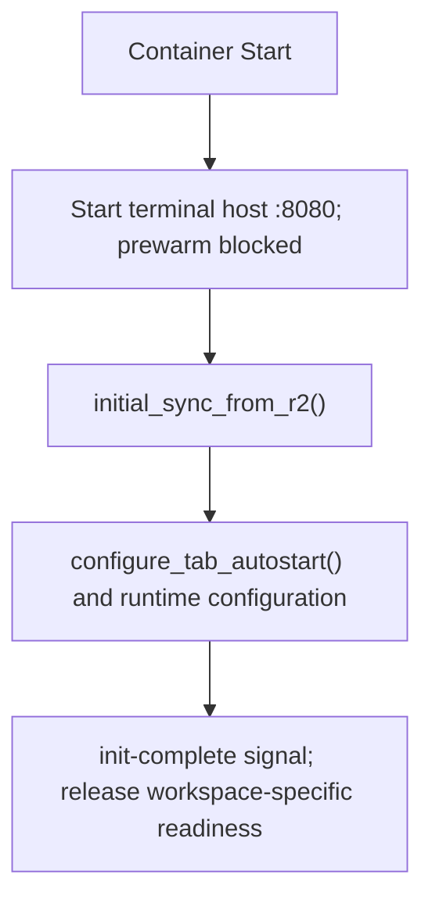

# Sessions & Runtime

Container image contents, startup and readiness, session authority, supervision, idle policy, recovery, and teardown.

**Audience:** Operators, Developers

**Owns:** image contents; D1 session catalog and lifecycle projection; startup/readiness; host/runtime supervision; idle policy; generation-fenced recovery and teardown. **Does not own:** durable-file reconciliation detail, endpoint schemas, entitlement policy, credential-containment rationale, terminal/editor client interaction, or package-local IDE adapters.

## Contents

- [Container Image](#container-image)
- [Runtime Paths](#runtime-paths)
- [Lifecycle authority](#lifecycle-authority)
- [Runtime Lifecycle](#runtime-lifecycle)
- [Runtime recovery and status](#runtime-recovery-and-status)
- [Cutover boundary](#cutover-boundary)
- [Schema and mutation design](#schema-and-mutation-design)
- [Agent Runtime Interfaces](#agent-runtime-interfaces)
- [Release and Deployment Alias](#release-and-deployment-alias)
- [Requirement and Source Map](#requirement-and-source-map)
- [Related Documentation](#related-documentation)

## Container Image

**File:** `Dockerfile`. Base: digest-pinned `mirror.gcr.io/library/node:26-bookworm-slim`. Dockerfile records Public ECR HTTP 429 throttling on shared GitHub Actions runners as the reason for using Google's Docker Hub mirror. The multi-stage builder compiles native addons; the runtime has no build tools.

### Installed Tools

| Category | Packages |
|---|---|
| Sync | rclone |
| Version control | git, github-cli (gh), lazygit |
| Editors | vim (symlinked to neovim), neovim, nano |
| Network | curl, openssh-client |
| Process | procps (ps, pgrep) |
| Utilities | jq, python3 plus `python` alias, ripgrep, fd, tree, htop, tmux, yazi, fzf, zoxide, bat |
| Terminal runtime | Herdr v0.9.3, checksum-pinned official Linux x86-64 binary, image-owned config, Apache-2.0 attribution |

Copilot 1.0.88 installs from the pinned npm dependency. <!-- @impl: preseed/npm-tools/package.json::@github/copilot --> `slirp4netns`, `iptables`/`ip6tables`, and util-linux sandbox tooling are included. <!-- @impl: Dockerfile::RUN apt-get update --> This grants neither TUN access, privileged containers, nor local-network permission; platform restrictions and explicit sandbox policy still apply.

### Bundled image tooling

SVG, PNG and JPEG rendering/conversion tools install at build time, not startup. Use `rsvg-convert drawing.svg -o drawing.png`, `convert drawing.png drawing.jpg`, or Python `PIL`. DejaVu fonts live at `/usr/share/fonts/truetype/dejavu/`. Bookworm supplies ImageMagick `convert`/`identify`, not the ImageMagick 7 `magick` launcher.

`python3 -m pip` is included. Install additional Python dependencies in `python3 -m venv .venv`, without bypassing Debian system-Python protection; `--system-site-packages` also exposes bundled Pillow. No model weights or paid generation service are included. Existing sessions keep their original image until normal lifecycle replacement. [REQ-OPS-062](../../sdd/spec/operations.md#req-ops-062-build-bundled-basic-image-tooling) owns this offline toolset. <!-- @impl: Dockerfile::librsvg2-bin -->

APT sources use HTTPS. Additional package installation requires `apt-get update` because image indexes are cleared. Strict enterprise egress still requires an approved HTTPS destination and the existing policy path; HTTPS does not guarantee reachability. Never disable certificate or repository-signature verification ([REQ-OPS-063](../../sdd/spec/operations.md#req-ops-063-https-distribution-package-sources)). <!-- @impl: Dockerfile::APT_HTTPS_SOURCES -->

### Lock-backed NPM Tools

Shared agents, Bun, context-mode, `consult-llm-mcp`, and `chrome-devtools-mcp` install from `preseed/npm-tools/package.json` and its committed lock. Image-owned `oxlint` has `image/oxlint/package.json` and a dedicated lock, weekly cooldown-backed Dependabot updates, and `/usr/local/bin/oxlint` without managed-seed compatibility changes ([REQ-OPS-051](../../sdd/spec/operations.md#req-ops-051-image-owned-oxlint-lifecycle)).

`.cache-bust` invalidates build layers while `npm ci` preserves reviewed registry integrity and transitive versions. Build pruning removes alternate OS/architecture/baseline/musl payloads, retaining canonical Linux x64 packages. Pruning tests check retained directories; complete-image smoke rejects alternates and executes every selected launcher. The pruning boundary reports reclaimed bytes ([REQ-OPS-040](../../sdd/spec/operations.md#req-ops-040-selected-coding-agent-packaging) AC4).

Environment-scoped `CODING_AGENTS` may select any non-empty subset of `claude-code,codex,copilot,antigravity,opencode,pi`; unset preserves all six. The build canonicalizes/hashes that set, prunes omitted npm agents, and skips Antigravity's checksum-backed installer when omitted. Bash/shared tools, native Pi/Claude IDE inventories, and Pi's separate prewarm/Jiti layout are unaffected ([REQ-OPS-038](../../sdd/spec/operations.md#req-ops-038-build-selected-coding-agent-clis), [REQ-OPS-040](../../sdd/spec/operations.md#req-ops-040-selected-coding-agent-packaging), [REQ-OPS-039](../../sdd/spec/operations.md#req-ops-039-reduced-image-capability-preservation)).

| Package | Pin owner | Provides |
|---|---|---|
| `@anthropic-ai/claude-code` | image-tools lock | Terminal `claude`, `IS_SANDBOX=1`, tab-1 permission mode; official IDE VSIX has a separate Open VSX pin |
| `@openai/codex` | image-tools lock | `codex` |
| Antigravity | installer SHA-256 | `agy`; hash checked before execution |
| `opencode-ai` | image-tools lock | `opencode` |
| `@github/copilot` | image-tools lock | `copilot`; non-linux-x64 prebuilds, `mxc-bin/arm64`, bundled ripgrep and non-linux native modules are stripped; system `rg` is used |
| `@earendil-works/pi-coding-agent` | image-tools lock | `pi`, including the separate native Pi Chat RPC backend |
| `bun` | image-tools lock | context-mode JS/TS subprocess runtime; cleanup retains linux-x64 only |
| `consult-llm-mcp` | image-tools lock | Consultation MCP for Claude and Pi |
| `browser-run-mcp` | dedicated lock | Claude cheap one-shot Browser Run READ |
| `chrome-devtools-mcp` | image-tools lock | Interactive Browser Run for Claude and Pi; advanced startup registration requires a Browser Rendering token |

Browser Run is a browser-automation capability, not the Browser IDE editor. `browser-run-mcp` exposes `browser_markdown`, `browser_content`, and `browser_scrape` over Cloudflare REST Quick Actions; dedicated `npm ci` is followed by an import smoke. Its weekly SDK bump updates exact manifest and lock together. Pi uses native `browser-run.ts`/`browser-run-helpers.ts` ([REQ-BROWSER-005](../../sdd/spec/browser-run.md#req-browser-005-claude-browser-run-mcp-server-read-surface-parity)). Interactive Browser Run is governed separately by [REQ-BROWSER-001](../../sdd/spec/browser-run.md#req-browser-001-browser-run-as-a-webfetch-fallback-claude-code-via-chrome-devtools-mcp) and [REQ-BROWSER-006](../../sdd/spec/browser-run.md#req-browser-006-pi-interactive-browser-via-chrome-devtools-through-the-pi-mcp-adapter).

`consult-llm-mcp` and `chrome-devtools-mcp` are shared-`npm ci` installs linked onto PATH; image smoke runs Chrome DevTools MCP help. Stable binaries avoid registry resolution at startup. Their Shadow Pins definitions prescribe paired atomic manifest/lock changes, but that workflow is intentionally disabled; this is not a startup repair obligation. Antigravity remains a checksum-verified non-npm installer when selected. Weekly Shadow Pins applies supply-chain cooldown to owning pins/locks where enabled.

Long-lived sessions keep their starting image even when a later reviewed image has newer CLIs. Compatibility risk remains, but reviewed PR checks/image smoke replace mutable deploy-time resolution.

### Pi Extension npm Cache

Dependencies derived from `preseed/agents/pi/package.json` are preinstalled under `/opt/codeflare/pi-agent/npm/`: Goal, context-mode, subagents, and managed tools. Native `graphify-native.ts`, not an npm package, supplies first-party Graphify tools; see [Preseed](preseed.md). `warm_pi_npm_dependencies()` symlinks `~/.pi/agent/npm/node_modules` to this image-local cache on every boot; node_modules is excluded from R2 sync and `PI_OFFLINE=1` avoids writes to the read-only target. The runtime `~/.npm` cache is purged at boot, reclaiming roughly 200 MB.

Neither entrypoint nor `context-mode-runtime.ts` forces `CONTEXT_MODE_BRIDGE_IDLE_MS=0` globally. Package assembly uses `extensions: []` (skills remain); the preseed adapter loads once for the foreground owner. In-process subagent ResourceLoaders use native fallbacks and spawn no bridge. `session_shutdown` releases ownership so reload/toggle cleans up and reattaches one bridge without upstream modifications ([AD101](../decisions/README.md#ad101-context-mode-is-foreground-owned-in-pi-in-process-subagents-use-native-transports), [REQ-AGENT-076](../../sdd/spec/agents.md#req-agent-076-pi-context-mode-enablement-and-tool-extension-defaults) AC1/AC7, [REQ-AGENT-089](../../sdd/spec/agents.md#req-agent-089-pi-context-mode-foreground-ownership)).

**Pi SDK lockstep:** image-tools and Pi prewarm manifests commit one exact Pi version. Both use committed locks and `npm ci`; build compares pins before install and verifies prewarm afterward. Bumps update both manifests/locks, bundled integrity pins and embedded seed atomically.

The integrated lock inventory includes bounded `brace-expansion` 5.0.12, Undici 7.30.0/8.11.2, and four `ip-address` 10.7.3 packed-shrinkwrap record corrections. This source inventory is neither runtime acceptance nor deployment proof; historical 10.7.2 observations remain historical. [`scripts/apply-npm-security-lock-pins.mjs`](../../scripts/apply-npm-security-lock-pins.mjs) uses registry SHA-512 and fails closed on malformed locks ([REQ-OPS-033](../../sdd/spec/operations.md#req-ops-033-lock-backed-npm-bump-coherence)).

Source pins and image identities are authoritative in the owning manifests, lockfiles, `Dockerfile` and [`openvscode/README.md`](../../openvscode/README.md). Dated integration, compiler synchronization, curation publication and runtime activation evidence belongs to its existing Git/PR/CI records; these are separate outcomes, not an unresolved campaign list or a claim of current acceptance.

### V8 Compile Cache Warm-Up

Build-time `pi --version` populates `NODE_COMPILE_CACHE` bytecode. Go agents (OpenCode, Antigravity) need no V8 warmup. Claude is native and verified via `claude --version`.

Codex/Copilot V8 warmups are disabled by image-size owner decision [AD96](../decisions/README.md#ad96-deactivate-codexcopilot-v8-warm-up-and-opencode-db-pre-init-image-size); each pays first-launch compile cost. The original commented Dockerfile RUN lines identify the opt-in change, not a startup obligation.

### Pi Extension Jiti Transpile Cache Warm-Up ([AD79](../decisions/README.md#ad79-image-baked-pi-extension-transpile-cache))

`pi --version` does not load extensions. A separate build layer pre-transpiles npm and local preseed extensions into `/opt/codeflare/jiti-cache`, avoiding roughly 9 seconds of cold extension startup and the host's 20-second prewarm cap.

- Warmup redirects `$TMPDIR/jiti` before moving the cache. <!-- @impl: Dockerfile::PI_CODING_AGENT_DIR -->
- Before host startup, entrypoint exports `TMPDIR=/run/codeflare/pi-tmp` and links its `jiti` child to the image cache. Fast Start Off replaces only the runtime link with a runtime-owned directory after updates. <!-- @impl: entrypoint.sh::configure_pi_jiti_runtime_cache --> <!-- @impl: scripts/verify-pi-lockstep.mjs::resetRuntimeJitiCache -->
- Jiti uses realpath-sensitive filenames and source/version markers. Local files warm at exactly `/home/user/.pi/agent/extensions/` with real `HOME`/`PI_CODING_AGENT_DIR`; npm resolves through the same image symlink. Runtime relay preserves managed bytes.
- Package warmup derives from preseed `package.json`. Build requires regular-file artifacts for every local extension and explicit installed Goal/Usage entrypoints, including Goal's image-transformed package entrypoint. Missing/non-loading/changed extensions fail the build. <!-- @impl: Dockerfile::goal_hit --> <!-- @impl: Dockerfile::usage_hit --> [REQ-AGENT-111](../../sdd/spec/agents.md#req-agent-111-native-goal-workflow-in-pi-sessions) AC2/AC3; [REQ-AGENT-131](../../sdd/spec/agents.md#req-agent-131-native-usage-workflow-in-pi-sessions) AC2/AC3.

### OpenCode Database Pre-Initialization

OpenCode Goose migrations initialize `~/.local/share/opencode/opencode.db` on first interactive launch. The former image `opencode run "hello"` warmup is disabled (roughly 147 MB, [AD96](../decisions/README.md#ad96-deactivate-codexcopilot-v8-warm-up-and-opencode-db-pre-init-image-size)); the commented block records the old choice.

### Browser Shims

`BROWSER=open-url` and `xdg-open-shim` exit 1 so OAuth-capable CLIs print plain auth URLs in the PTY rather than trying to launch a browser. Browser URL detection/activation is owned by [Terminal & IDE](terminal-and-ide.md#browser-terminal-link-activation), not Browser Run.

### code-server Browser IDE Binary

`Dockerfile` installs SHA-256-verified coder/code-server 4.140.0 linux-amd64, verifies packaged commit `ccc19adc2e8992e18b14dd25eb1e646f5b9ef7cf`, embedded Code 1.140.0 and product provenance, and records VS Code gitlink `07f806f999227108933c2e30515b26eecc1fda74`. Only `/usr/local/bin/code-server` is exposed; OpenVSCode is a retained private directory identifier, not a runtime binary. Shadow Pins derives package/product identity and source gitlink from the immutable release and invalidates checksum for review ([AD119](../decisions/README.md#ad119-replace-openvscode-with-pinned-code-server-behind-the-existing-session-proxy)).

A digest-pinned Node 22.21.1 stage builds the owned Pi Chat participant with no runtime npm dependency/native addon. A separate stage checksum-/identity-verifies Anthropic's exact official linux-x64 Open VSX VSIX, extracts unchanged files and deletes the archive. Root-owned inventories contain visible **Codeflare** Pi, official Claude, and empty `none` bases. Legacy `/opt/codeflare/openvscode/` paths remain ([AD114](../decisions/README.md#ad114-native-pi-chat-and-the-official-claude-extension-own-editor-integration)).

The exact upstream code-server release is the image baseline. Build deliberately removes bundled GitHub Copilot; code-server and embedded Code editor source remain unpatched. Complete-image evidence checks archive/package identity and Copilot absence; no former OpenVSCode scanner exception transfers automatically. Client contracts live in [Terminal & IDE](terminal-and-ide.md#code-server-browser-ide); package inventory/adapters and verification live in [`openvscode/README.md`](../../openvscode/README.md).

The archive checksum identifies the upstream baseline, not the entire installed dependency tree. A bounded image overlay replaces compression with SHA-512-verified 1.8.2, supplies its private destroy 1.2.0 dependency, and preserves nested debug 2.6.9. It changes dependencies, not editor source or authentication. Remove the overlay when the upstream artifact supplies compression 1.8.2 or later with its required dependency closure. Existing image smoke and vulnerability gates remain mandatory.

## Runtime Paths

| Path | Owner / purpose |
|---|---|
| `/home/user` | Runtime home |
| `/home/user/workspace` | Synced session working tree |
| `/home/user/.claude/` | Claude config/credential projection |
| `/opt/codeflare/pi-agent/npm` | Read-only image Pi npm cache |
| `/home/user/.pi/agent/npm` | Runtime Pi directory; node_modules links to image seed |
| `/home/user/.config/rclone/rclone.conf` | Generated rclone config |
| `/run/codeflare/sync/sync-status.json` | Private health init/sync status |
| `/run/codeflare/sync/sync.log` | Sync diagnostics |
| `/run/codeflare/sync/rclone/` | Bisync listings/locks |
| `/run/codeflare/services/` | Terminal, Vault monitor, SilverBullet, init-complete and detached CI-monitor scripts/logs |
| `/run/codeflare/openvscode/` | IDE trigger/generation PIDs/logs/sidebar/mutable editor data |
| `/run/codeflare/locks/` | Cross-process locks |

Path contracts: [REQ-OPS-047](../../sdd/spec/operations.md#req-ops-047-cleanup-safe-synchronization-state), [REQ-OPS-048](../../sdd/spec/session-lifecycle.md#req-ops-048-cleanup-safe-service-and-browser-ide-state), [REQ-OPS-049](../../sdd/spec/operations.md#req-ops-049-cleanup-safe-coordination-and-background-work). File reconciliation/finalization semantics remain in [Storage & Sync](storage-and-sync.md).

## Lifecycle authority

Complete non-secret session records and shared lifecycle projections live in `USAGE_DB` D1. KV still owns credentials, provider tokens, preferences/configuration, entitlements, managed-release records, storage caches, Timekeeper and unrelated records; it is not a session compatibility store. <!-- @impl: src/lib/session-repository.ts::D1SessionRepository --> [REQ-SESSION-028](../../sdd/spec/session-lifecycle.md#req-session-028-session-authority-has-no-kv-compatibility-path).

Backend states are `stopped`, `starting`, `running`, `unreachable`, `stopping`. Create inserts `stopped` without running-capacity consumption. Start conditionally claims a new generation before process work. The session DO controls the process, retains assigned generation/monotonic observation sequence and schedules; D1 conditional updates reject old generations and delayed observations. Accepted mutations advance response revision. Neither owner reads, elapsed time, SDK flags nor signal acceptance prove exit. Only generation-fenced positive process-monitor completion or awaited destroy confirming exit writes `stopped`. Aged `stopping` retains ownership and blocks replacement/managed mutation. Protected Action cancellation is a separate fence. <!-- @impl: src/lib/session-repository.ts::D1SessionRepository --> [REQ-SESSION-018](../../sdd/spec/session-lifecycle.md#req-session-018-d1-lifecycle-evidence-is-generation-fenced), [REQ-SESSION-035](../../sdd/spec/session-lifecycle.md#req-session-035-stale-stopping-retains-ownership-until-confirmed-exit), [REQ-OPERATOR-054](../../sdd/spec/operators.md#req-operator-054-protected-action-claim-and-stop-fence).

Start admission uses owner-scoped D1 workload ownership (`starting`, `running`, `unreachable`, `stopping`) with existing best-effort capacity rules, not an atomic reservation. A replacement requires D1-confirmed prior exit; SDK or historical KV state cannot authorize it. Failed bucket forwarding/destruction stays retryable. Stop/Delete preserve intent/record on ambiguous destroy; neither reports success until destruction is confirmed. Delayed writers only UPDATE and cannot recreate a deleted row.

## Runtime Lifecycle

**File:** `entrypoint.sh`. Polling exits on success, background-process exit or safety timeout; `SYNC_TIMEOUT=120` bounds initial restore.

### Startup Sequence

Port 8080 binds before Cloudflare's roughly 10–15-second port wait. The host starts before R2 restore and blocks PTY prewarm behind initialization:

```mermaid
flowchart TD
    A[Container Start] --> B["Start terminal host :8080; prewarm blocked"]
    B --> C["initial_sync_from_r2()"]
    C --> D["configure_tab_autostart() and runtime configuration"]
    D --> E["init-complete signal; release workspace-specific readiness"]
```

After configuration and before background bisync baseline, `relay_managed_pi_extensions()` synchronously lays image-managed Pi bytes over owned post-sync filenames in all ordinary modes, preserving user-added extensions/other seed files. Fresh mtimes let background `--resync` repair R2. Baseline runs best-effort `nice 19`/`ionice -c 3`, inherited by rclone/daemon, yielding to single-vCPU prewarm ([REQ-STOR-017](../../sdd/spec/storage.md#req-stor-017-faster-startup-sync--bisync-head-storm-fix--governed-mode-preseed-bake)). Remote curation has the explicit exception below.

`CODEFLARE_INIT_FLAG_FILE=/run/codeflare/services/init-complete` is recreated on each start. Host polls every 250 ms up to `PREWARM_INIT_WAIT_MS=130000`. Normal prewarm reads restored `.claude.json`, `.bashrc` and MCP registrations; timeout permits degraded startup, not false init-success ([REQ-SESSION-015](../../sdd/spec/session-lifecycle.md#req-session-015-container-port-readiness-gating-with-pre-warm-pre-condition)). Classic retains first-output settlement and 20-second fallback. Herdr also requires configured-command bootstrap; orphan expiry without that marker terminates host for recovery. Fresh/restored pinned Pi native evidence has bounded compatibility fallbacks, not indefinite startup blocking ([REQ-TERM-035](../../sdd/spec/terminal.md#req-term-035-terminal-readiness-follows-mode-and-workspace)).

Persisted `CODEFLARE_TERMINAL_MODE` determines ownership. Classic starts `/bin/bash -l`, up to six node-pty sessions. Its Pi/Claude tab-1 binding uses one current-session-only UUID under `.codeflare/classic`; Pi seeds an empty native header before exact-ID launch. Stop/restart resumes that UUID's synced transcript; a different session starts empty. Successful root Pi `/resume` atomically adopts the last selected binding, rejecting non-root paths and invalid/mismatched IDs. <!-- @impl: entrypoint.sh::configure_tab_autostart --> <!-- @impl: preseed/agents/pi/extensions/classic-session-binding.ts::adoptClassicResumedSession --> [REQ-AGENT-211](../../sdd/spec/agents.md#req-agent-211-classic-agent-transcript-resume).

Herdr attaches its official client to deterministic `cf-<SESSION_ID>` in mode-0700 `/run/codeflare/herdr/<SESSION_ID>`; its structural `session.json` alone syncs through normal `.codeflare` R2. Sockets/logs/pane output/user-edited runtime config stay ephemeral; restoration does not claim arbitrary processes survived. Browser IDE workspaces start neither Herdr nor an outer host terminal. Terminal/editor client compatibility belongs to [Terminal & IDE](terminal-and-ide.md). <!-- @impl: image/herdr/codeflare-herdr-terminal::run_agent --> <!-- @impl: image/herdr/codeflare-herdr-terminal::wait_for_live_pi -->

The tab-autostart `.bashrc` PATH is `/usr/local/bin:/usr/bin:/bin:$PATH`. Claude's configured fast-boot launch uses `--dangerously-skip-permissions`; Fast Start controls updates, not that permission boundary.

Enterprise interception is installed by `wireContainerInterception()` before `container.start()` when `ENTERPRISE_MODE=active`; otherwise no-op. [REQ-ENTERPRISE-011](../../sdd/spec/models-and-routing.md#req-enterprise-011-container-start-interception-ordering); [Architecture](architecture.md#enterprise-llm-routing). Separately entrypoint installs the container CA and prepends `NODE_EXTRA_CA_CERTS`, `SSL_CERT_FILE`, `REQUESTS_CA_BUNDLE` exports to `.bashrc` before blocking agent autostart; appending would be too late. See [Security](security.md#enterprise-mode-credential-containment-and-ca-trust).

### Restricted Operator Lifecycle

`CODEFLARE_OPERATOR_SESSION=true` selects a separate parent-marked profile ([REQ-OPERATOR-022](../../sdd/spec/operators.md#req-operator-022-restricted-operator-container-lifecycle)); ordinary sessions are unchanged.

PID1 validates bounded matching Pi/sync activity/session identities and fixed `/home/user/.codeflare/operators/<activityId>` ownership. Mode-0700 work/agent/sessions/output/private metadata, mode-0600 trusted Pi settings, image-owned providers and empty `auth.json` are prepared; verified parent input precedes readiness. It does not restore whole-home R2/managed policy/Vault, start bisync baseline/daemon, or clone repositories. Broad user/deployment credentials, human authentication and inline provider secrets are omitted. <!-- @impl: entrypoint.sh::run_operator_startup --> <!-- @impl: src/container/container-env.ts::buildEnvVars -->

Shutdown stops supervised processes, waits at most 120 seconds only for an already accepted explicit upload still `uploading`, and then stops host. It starts no upload/ordinary bisync/final sync; unresolved receipt remains incomplete/unknown for parent reconciliation, never presumed persistent. <!-- @impl: entrypoint.sh::drain_operator_sync_shutdown --> <!-- @impl: entrypoint.sh::shutdown_handler --> Structured Pi/explicit sync remain private authenticated services, not PTY replacements. See [API](api-reference.md#internal-operator-host-apis), [Storage](storage-and-sync.md#restricted-operator-persistence).

### code-server (Browser IDE)

The retained private `start_openvscode_supervisor` runs code-server on loopback `127.0.0.1:13337` against `~/workspace`; host remains exposed on 8080. Advanced VS Code workspaces arm it after initialization; Terminal workspaces wait for first `/api/vscode` request and pay no unused editor process cost ([REQ-IDE-003](../../sdd/spec/browser-ide.md#req-ide-003-ide-lifecycle-and-availability), [REQ-IDE-048](../../sdd/spec/browser-ide.md#req-ide-048-default-workspace-and-dashboard-owned-vs-code-sessions)).

Each crash-restarted launch uses a fresh process group, random generation token and PID/start identity. Pi/Claude descendants inherit it, with narrower Pi request tokens. Exit/restart/cancel/shutdown TERM, boundedly wait, then KILL remaining members before replacement. `generation.pid` identity checks reject reused PIDs; retained `supervisor.pid` owns shutdown. Live user-data is `/run/codeflare/openvscode/data/data`, with User settings beneath it; fixed inventories remain under `/opt/codeflare/openvscode/extensions/{pi,claude,none}`. Generation reaping precedes bounded UI/extension capture; restore precedes managed inventory settings. <!-- @impl: entrypoint.sh::_openvscode_supervise_loop --> <!-- @test: host/__tests__/entrypoint-openvscode.test.js (REQ-IDE-039 AC1 / REQ-OPS-048 AC4: code-server uses protected data and extension roots) --> Client proxy, editor integration and continuity limits are in [Terminal & IDE](terminal-and-ide.md#code-server-browser-ide); package mechanics in [`openvscode/README.md`](../../openvscode/README.md).

### Fast Start

`fastStartEnabled` defaults true; `FAST_CLI_START` defaults `'true'`. Update suppressors avoid roughly 5–30 seconds per tool:

| Tool | Suppression |
|---|---|
| Claude | `DISABLE_AUTOUPDATER=1` |
| OpenCode | `OPENCODE_DISABLE_AUTOUPDATE=1` |
| Copilot | `COPILOT_AUTO_UPDATE=false` |
| Codex | managed `dismissed_version: "999.0.0"`; managed interactive `--no-daemon` |
| Pi | `PI_OFFLINE=1`, `PI_SKIP_VERSION_CHECK=1` |

Codex 0.157.0's managed Classic/Herdr `--no-daemon` prevents default updating-daemon launch only while Fast Start ON. User config, `codex exec`, version probes and explicit startup updater remain unchanged; sync excludes named ephemeral paths, not whole `.codex`.

OFF unsets Docker/entrypoint suppressors and removes managed Codex settings suppressors. Before readiness, installed Pi/Codex explicitly update, Pi reconciles packages, and logs show before/after versions or failure. Pi validates dependencies and real image processing; incomplete install gets one lockfile reinstall. Runtime-temporary downloads are cleared; failures remain visible without stranding readiness. Both image Pi copies are validated ([REQ-AGENT-012](../../sdd/spec/agents.md#req-agent-012-fast-cli-start-configurable), [REQ-AGENT-206](../../sdd/spec/agents.md#req-agent-206-fast-start-off-runtime-updates)). ON does not install restored user Pi packages absent from image cache.

context-mode's update notice is always disabled independently of Fast Start: its bundle patch redirects the npm probe to a refused local address, resolving unknown without chat notices/outbound registry traffic. No user runtime self-upgrade is intended ([REQ-AGENT-076](../../sdd/spec/agents.md#req-agent-076-pi-context-mode-enablement-and-tool-extension-defaults) AC4).

### Auto-sleep (Configurable sleepAfter)

Allowed settings are `15m`, `30m`, `1h`, `2h`, `4h`; stored legacy `5m` remains readable. Paying default is 30m; backend forces free tier 15m. Admins can change their own timeout, non-subscribed dropdown is disabled, and free users see the upgrade hint. Enforcement/entitlement detail remains in [Configuration](configuration.md) and [Billing](billing.md).

The SDK's `sleepAfter='24h'` sentinel is not the normal idle enforcer. `collectMetrics()` uses classified terminal input and every client-to-server IDE frame; socket attachment, output, server editor traffic, Vault activity and agent work are not input. Host per-PTY `PTY_KEEPALIVE_MS` defaults 240 minutes and is floor-clamped to maximum configured sleep ([AD47](../decisions/README.md#ad47-pty-keepalive-as-safety-net-only-not-the-idle-policy), [REQ-SESSION-004](../../sdd/spec/session-lifecycle.md#req-session-004-idle-containers-sleep-after-configurable-timeout), [REQ-SESSION-005](../../sdd/spec/session-lifecycle.md#req-session-005-input-based-idle-detection)).

Settings saves `sleepAfter` in KV `user-prefs:{bucketName}`. Start reads preferences and set-bucket transport carries it; `handleSetBucketName()` validates `/^(5m|15m|30m|1h|2h|4h)$/` and stores it under DO key `sleepAfter`. Initial/restart paths preserve that key. Constructor hydrates it, and current `collectMetrics()` re-reads storage each tick (cache is not authority), selecting fail-safe 4h if invalid/unavailable. Destroy clears it. Types/option arrays live in backend/frontend `types.ts`.

No-input enforcement reuses durable `containerStartedAt` across reconstruction. Missing/invalid baseline gets one persisted fallback; unreadable/unpersistable timing skips idle termination while observation continues. Valid expired timing still stops ([REQ-SESSION-034](../../sdd/spec/session-lifecycle.md#req-session-034-durable-idle-baseline-survives-coordinator-reconstruction)).

Card/header warnings appear below ten minutes (warning), below five (critical), hidden for stopped/no timestamp. Running projections use current-run `lastInputAt` or current-run start, never prior-run input; non-running context retains lifecycle `lastActiveAt`. Countdown changes cannot grant Stop/restart authority. <!-- @impl: src/routes/session/crud.ts --> <!-- @impl: src/routes/session/lifecycle.ts --> [REQ-SESSION-013](../../sdd/spec/session-lifecycle.md#req-session-013-sleep-timer-countdown-ui), [REQ-SESSION-036](../../sdd/spec/session-lifecycle.md#req-session-036-header-sleep-countdown-presentation).

### Managed curation startup boundary

Worker startup requires applied digest/sequence/resolved mode matching active verified release. Transient cache failure permits prior verified last-known-good only in the current resolved mode; fresh/mismatched buckets fail `MANAGED_ENVIRONMENT_UPDATE_PENDING`, never silently substitute baked state. <!-- @impl: src/routes/container/lifecycle.ts::startOrRestartContainer -->

Set-bucket carries `REMOTE_CURATION_ACTIVE=true`, release digest and Worker-derived exact managed-extension manifest SHA-256. Entry boolean skips image pre-laydown/Pi relay. IDE settings/reconciliation/reap capture require both digest matches; missing/different bytes preserve company extensions, perform no mutation and show **Managed Browser IDE extensions could not be verified**. Disabled curation clears all three values on warm/cold paths. <!-- @impl: src/container/container-env.ts::buildEnvVars --> <!-- @impl: openvscode/agent-sidebar/src/extension-persistence.ts::reconcileCompanyExtensions --> [REQ-STOR-020](../../sdd/spec/storage.md#req-stor-020-managed-environment-reconciliation), [REQ-STOR-022](../../sdd/spec/storage.md#req-stor-022-managed-reconciliation-admission), [REQ-STOR-023](../../sdd/spec/storage.md#req-stor-023-managed-release-status-projection), [REQ-STOR-024](../../sdd/spec/storage.md#req-stor-024-managed-release-application), [REQ-IDE-042](../../sdd/spec/browser-ide.md#req-ide-042-additive-company-extension-reconciliation), [REQ-IDE-045](../../sdd/spec/browser-ide.md#req-ide-045-company-extension-reconciliation-orchestration).

### Teardown orchestration

Deliberate Stop/Delete, idle and quota paths give pending agent events one bounded final attempt, then live authenticated R2 sync, then stop. `destroy()` persists `shutdownRequested` before clearing operational identity, captures session/Bearer for drains, cancels metrics schedules, clears runtime keys and audits final-sync outcome. Sync starts/awaits its own `syncing`→terminal transition, not a previous success. The DO sync budget is 120 seconds and the entire teardown shares a 135-second deadline. Failed events/sync still permit stop within that ceiling; a rejected/ambiguous SDK destroy is not confirmed exit. SIGTERM trap is only a best-effort backstop. R2 remains; only confirmed Delete removes D1 session record. <!-- @impl: src/container/container-lifecycle.ts::destroy --> [REQ-SESSION-011](../../sdd/spec/session-lifecycle.md#req-session-011-graceful-shutdown-with-final-sync), [REQ-SESSION-019](../../sdd/spec/session-lifecycle.md#req-session-019-final-sync-drain-endpoint-authentication), [REQ-SESSION-032](../../sdd/spec/session-lifecycle.md#req-session-032-final-notification-drain-precedes-shutdown-sync).

`shutdownRequested` fences coordinator work but is not exit evidence. Synthetic SDK `onStop()` also cannot release D1 ownership. Positive low-level monitor completion captures generation before waiting, fences pending Protected Action cancellation, then conditionally confirms exit. Stop/Delete retries retain the same generation/intent; interrupted teardown remains owner-held. Fresh `onStart()` transaction clears old transport/shutdown residue only after generation validation; replay preserves established baseline/schedules, and stale/stopping callbacks cannot clear newer fences ([REQ-SESSION-033](../../sdd/spec/session-lifecycle.md#req-session-033-start-callbacks-preserve-lifecycle-ownership)).

## Runtime recovery and status

Normal metrics uses one bounded authenticated `/internal/runtime-observation` host snapshot and one generation/sequence-fenced D1 projection; tracked clone persistence, agent events, DO storage and Timekeeper are separate owners. Snapshot validity/readiness, transport response and confirmed process exit are different evidence. Host poll/Timekeeper budgets are 10 seconds; peer failure cannot strand the eligible one-shot schedule. <!-- @impl: host/src/request-router.ts::createRequestHandler --> D1 update failure is persistence uncertainty, not transport or exit evidence. <!-- @impl: src/container/container-metrics.ts::collectMetrics --> [REQ-SESSION-020](../../sdd/spec/session-lifecycle.md#req-session-020-runtime-observation-is-bounded-and-projected-once).

**Authority contract (not a deployment acceptance claim):** a complete host-transport failure opens one D1 `unreachable` incident with absolute first-observation +120-second deadline. Reconstruction adopts the assigned generation/incident/deadline and retained process identity/PTY; repeated failure cannot extend the deadline. Expiry is earliest termination eligibility, not guaranteed exit. Same-generation conditional intent and duplicate-safe SIGTERM preserve `stopping` until positive exit evidence. D1 outages do not open incidents. <!-- @impl: src/lib/session-runtime-policy.ts::openUnreachableIncident --> <!-- @impl: src/lib/session-runtime-policy.ts::claimExpiredTermination --> [REQ-SESSION-021](../../sdd/spec/session-lifecycle.md#req-session-021-complete-transport-failure-opens-one-unreachable-incident), [REQ-SESSION-022](../../sdd/spec/session-lifecycle.md#req-session-022-unreachable-recovery-preserves-process-identity), [REQ-SESSION-024](../../sdd/spec/session-lifecycle.md#req-session-024-recovery-deadline-and-termination-intent-are-durable). These requirements retain their existing Planned verification/status; moving documentation does not prove end-to-end activation.

**Current coordinator implementation:** `container-metrics.ts` still owns DO transport streak/recovery attempt records. Three complete failures cause DO-only `ctx.abort()`, five-second confirmations allow at most two reconstruction attempts, and exhausted state remains non-billable owner-held uncertainty. Any host response (even HTTP non-OK) proves transport reachability; successful evidence deletion settles recovery. It never infers stopped from exhaustion/not-running duration. `Network connection lost` in SDK `onError` selects the same bounded coordinator recovery. Shutdown marker prevents reset/re-arm; unreadable ownership fails closed. This mechanism must not be described as KV lifecycle self-heal or as proof that the Planned D1 deadline signalling policy is integrated. The policy helper and D1 fields are not enough to establish that integration.

Owner batch status reads D1 once with `no-store`, without SDK/container wake or ancillary refresh. Old `stopping` remains `stopping`; only confirmed stopped releases managed-resource ownership. Optional usage/storage/entitlement/managed/preseed/migration data has a separate slower/event-driven route. <!-- @impl: src/routes/session/lifecycle.ts::app --> Managed mutation admission uses the same owner-scoped D1 check, never SDK `stopped`/`stopped_with_code`. <!-- @impl: src/lib/session-helpers.ts::hasOwningSessionContainer --> <!-- @impl: src/routes/storage/seed.ts::assertNoOwningSession --> <!-- @impl: src/routes/preferences.ts::app -->

Terminal admission reads owner D1: only `stopping`/`stopped` yields authoritative 4503. A failed no-start health/readiness probe yields retryable 1013 before rate limits. Verified survivors may forward despite stale SDK state; public forwarding never starts a replacement. Ordinary inner DO fetch uses retryable 1013 for volatile not-running, while authenticated `forwardExisting()` reaches the verified survivor. <!-- @impl: src/routes/terminal.ts::handleWebSocketUpgrade --> <!-- @impl: src/container/index.ts::fetch -->

Backend authority is separate from connectivity: Terminal ACTIVE/IDLE is this device's socket presentation; a ready running IDE stays green through temporary connectivity recovery with an accessible notice. D1 status outage retains last ordered lifecycle and mounted workspace. The historical client helper name is retained only as a traceability pointer, not KV lifecycle authority: <!-- @impl: web-ui/src/stores/session.ts::shouldRetainNegativeKv --> Client details live in [Terminal & IDE](terminal-and-ide.md#backend-state-and-client-connectivity). <!-- @impl: web-ui/src/lib/session-presentation.ts::terminalPresentation --> <!-- @impl: web-ui/src/lib/session-presentation.ts::vscodePresentation --> <!-- @impl: web-ui/src/lib/session-presentation.ts::applyStatusFailure -->

Recovery confirmations/D1 reconciliation are not another usage or quota source; Timekeeper remains usage authority. CPU display is normalized one-minute host load/CPU count, not sampled utilization, and may exceed 100%; correlate memory/sync/responsiveness. <!-- @impl: host/src/metrics.ts::getSystemMetrics --> Structured generation/incident logs use bounded categories, not credentials/terminal contents. Retained current attempt logs do not by themselves establish Planned complete D1 transition observability ([REQ-SESSION-025](../../sdd/spec/session-lifecycle.md#req-session-025-lifecycle-recovery-is-observably-correlated), [REQ-SESSION-026](../../sdd/spec/session-lifecycle.md#req-session-026-lifecycle-scheduling-and-persistence-failures-remain-actionable)).

## Cutover boundary

**Current admission:** additive `0002_runtime_sessions.sql` creates a pending singleton, and deployment migration `0003_complete_session_cutover.sql` marks it complete. Create/Start still require `complete`; normal deployment opens admission immediately, with no legacy import/read/deletion, quiescence wait or automatic drain. Legacy KV session records have no authority. Post-cutover rollback must stay D1-compatible. <!-- @impl: migrations/usage/0003_complete_session_cutover.sql --> <!-- @impl: src/lib/session-repository.ts::D1SessionRepository --> [REQ-SESSION-030](../../sdd/spec/session-lifecycle.md#req-session-030-clean-slate-d1-admission-is-live-on-deployment), [REQ-SESSION-028](../../sdd/spec/session-lifecycle.md#req-session-028-session-authority-has-no-kv-compatibility-path).

The retained `runSessionCutover()` helper is separately operator-authorized historical cleanup tooling, not a normal deployment prerequisite. It requires quiescence, exact `session:${bucketName}:` prefixes and empty D1 before pending→complete; a complete marker returns without purge. This document authorizes no cleanup. <!-- @impl: src/lib/session-cutover.ts::runSessionCutover --> The superseded pending-until-purge description is preserved only in [the original immutable D1 lane](https://github.com/nikolanovoselec/codeflare/blob/6c1c11936740aa290266fc98fcbc360d3b5b3af1/documentation/lanes/session-lifecycle-d1.md#cutover-boundary).

## Schema and mutation design

Migration/repository owns concrete SQL shape; the inventory is not a new SQL-shape acceptance criterion. <!-- @impl: migrations/usage/0002_runtime_sessions.sql::CREATE TABLE runtime_sessions --> <!-- @impl: migrations/usage/0004_boundary_activity.sql::ALTER TABLE runtime_sessions --> <!-- @impl: src/lib/session-repository.ts::D1SessionRepository --> [REQ-SESSION-031](../../sdd/spec/session-lifecycle.md#req-session-031-d1-session-schema-stores-complete-ordered-authority).

| Group | `runtime_sessions` columns |
|---|---|
| Identity | `owner_key`, `session_id`, composite primary key |
| Complete record | `name`, `created_at`, `last_accessed_at`, nullable `agent_type`, `workspace`, `terminal_mode`, nullable `tab_config_json`, `clone_json`, `clones_json` |
| Ordering | `lifecycle_state`, `lifecycle_generation`, `response_revision`, `observation_sequence` |
| Lifecycle | `last_started_at`, `last_active_at`, `transitioned_at`, `lifecycle_reason` |
| Readiness | `editor_ready`, `editor_ready_error`, `readiness_observed_at` |
| Latest projection | `cpu`, `memory`, `disk`, `sync_status`, `metrics_observed_at`, `last_input_at` |
| Incident | `unreachable_incident_id`, `unreachable_first_observed_at`, `unreachable_deadline_ms` |
| Termination | `termination_intent_id`, `termination_generation`, `termination_claimed_at`, `termination_signal_accepted_at` |
| Protected Action | `boundary_activity_id`; exact pending activity until successful completed-result consumption or durable Stop cancellation <!-- @impl: src/routes/operator-webhook.ts::app --> |

Checks bound lifecycle vocabulary, non-negative counters, booleans, paired incident fields and generation-bound termination fields. Generation/revision start zero; observation sequence starts -1 to admit zero. Owner ordering is `last_accessed_at DESC, session_id ASC`, with one index. `session_cutover` singleton (`id=1`) has state/update/completion timestamps; the later completion migration, not purge, opens normal admission.

#### Normative mutation predicates

- Create inserts complete `stopped`, generation/revision zero only when admission complete.
- Start conditionally requires stopped, complete admission, no termination intent and no pending boundary activity; advances generation/revision, resets sequence to -1 and enters starting.
- Projection UPDATE matches owner/session/generation, greater sequence, eligible non-terminating state; accepted update advances revision. No normal pre-read/readback.
- Incident open/recovery/termination are same-generation/same-incident conditional policy operations; idempotent ambiguity reconciles exceptionally and conflicting ownership fails closed. Planned integrated paths remain Planned.
- Confirmed exit alone clears matching intent/incident and writes stopped, after pending Protected Action cancellation.
- Delete only removes confirmed-stopped/no-boundary rows; delayed writers do not UPSERT/replace.
- Zero-change/ambiguous ownership results justify bounded exceptional reconciliation, never ownership inference.

## Agent Runtime Interfaces

### Claude Code Projection

Build-selected terminal Claude runs official global npm as root with `IS_SANDBOX=1` and configured `--dangerously-skip-permissions`. IDE Claude independently uses its pinned official VSIX/bundled CLI and fixed unrestricted overlay, even if shared CLI is omitted. Its client/conversation isolation belongs to [Terminal & IDE](terminal-and-ide.md#selected-native-ide-agent).

### Container Environment Variables

Global image ENV includes `NPM_CONFIG_UPDATE_NOTIFIER=false`, `IS_SANDBOX=1`, `DISABLE_INSTALLATION_CHECKS=1`, `DISABLE_AUTOUPDATER=1`, `NODE_COMPILE_CACHE=/root/.cache/node-compile-cache`, `BROWSER=/usr/local/bin/open-url`, and canonical `CODEFLARE_CODING_AGENTS` evidence. Prewarm mode/marker controls remain above; `.bashrc` autostart carries dangerous-permission flag.

### Graphify (Knowledge-Graph Context) (REQ-AGENT-023)

`graphifyy[mcp,sql,pdf]` installs globally through uv at the exact version in `preseed/agents/claude/plugins/graphify/.claude-plugin/plugin.json`; manifest bumps rebuild binary in lockstep. `/root/.local/bin/graphify` is PATH-ready. MCP uses the isolated venv interpreter `/root/.local/share/uv/tools/graphifyy/bin/python` and preseed `graphify-mcp-lazy.py`; system Python cannot import that isolated install. Provider/backend extras are omitted; active agent creates semantic extraction, and optional labels consume session-authored `.graphify_labels.json` without backend/reclustering. Approximate cost is 220 MB.

MCP wrapper reaches default/advanced modes; proactive query/build/hook routing remains advanced only ([AD52](../decisions/README.md#ad52-graphify-mcp-available-everywhere-discipline-advanced-only), [AD53](../decisions/README.md#ad53-graphify-hot-reload-wrapper-with-multi-repo-sentinel-tracking)). `LazyGraph` starts empty, then atomically rebinds when a graph appears/changes, polling `GRAPHIFY_POLL_SECONDS` (default 2). Static tool list does not change.

Advanced active-repo PostToolUse tracking resolves cwd/repo from tool paths and writes `~/.cache/codeflare-hooks/graphify-active-cwd`; default fallback is freshest workspace graph. Per-branch graph storage is unsupported; `.git/HEAD` is informative and owners explicitly update after checkout. Graphify does not require context-mode; its routing is advisory, with native chunking available when absent.

MCP exposes query/get-node/neighbors/community/god-nodes/stats/shortest-path. Pi native `graphify_query`, `graphify_path`, `graphify_explain` shell the same CLI and resolve cwd, sentinel, then merged global graph.

`graphify-out/` belongs in the repository, not R2. Owners commit graph JSON/report and optional labels; regenerable HTML/callflow and caches/manifest/obsidian/intermediates/machine markers are ignored. R2 excludes all graph output. Image registers semantic merge driver globally; repository `.gitattributes` must opt in. Source/skill details remain in [Preseed](preseed.md).

### LLM Consultation

`configure_consult_llm` registers Claude `.claude.json` and Pi `mcp-adapter.json` when an isolated Codeflare OpenAI/Gemini key or Codex login is usable. Pi lifecycle is lazy and starts only on explicit consultation. After restore, the shared Pi preparation regenerates recognizable managed MCP entries; custom configurations and unrelated servers remain protected. A rejected user file blocks Pi bootstrap writes/removals, not container startup. Customized surviving consult entries are not removed by name-only disabled cleanup. <!-- @impl: entrypoint.sh::configure_pi_mcp_adapter --> <!-- @impl: preseed/agents/pi/extensions/00-mcp-adapter-config.ts::migratePiMcpAdapterConfig -->

`CODEFLARE_` keys are mapped to bare provider names only in server-scoped ENV, never global agent ENV. KV `llm-keys:{bucketName}` is read fresh on startup, not persisted to DO ([REQ-AGENT-031](../../sdd/spec/agents.md#req-agent-031-consult-llm-key-isolation-subscription-backend-and-multi-agent-parity)). OpenAI prefers Codex subscription (`codex-cli`, high reasoning) if auth exists, otherwise API; Gemini is API-only.

Only explicit requests for external LLM consultation or GPT/ChatGPT/Gemini/OpenAI/`consult_llm` activate the skill; generic second-opinion language asks clarification. Exact named models pass verbatim; otherwise single-select Latest Google (`gemini`), Latest OpenAI (`openai`), Both, List available (latest log block), plus tool-provided free-text Other. Server resolves provider selectors at call time without exposing a global key for live model discovery ([REQ-AGENT-067](../../sdd/spec/agents.md#req-agent-067-consult-llm-invocation-and-model-selection-behavior)). Skills reside in both Claude/Pi preseed trees.

Enterprise disables consultation entirely: no key injection, API 403, hidden settings, removed seeded skills; managed AI Gateway owns models ([REQ-AGENT-118](../../sdd/spec/agents.md#req-agent-118-enterprise-consult-llm-unavailability)).

## Release and Deployment Alias

Optional Settings deploy keys are validated against provider APIs and stored in KV `deploy-keys:{bucketName}`. `deploy-keys.ts` GET masks, PUT validates, DELETE clears. Startup reads fresh and set-bucket carries `GH_TOKEN`, `CLOUDFLARE_API_TOKEN`, auto-fetched account ID, explicitly null when absent so revocation propagates. Git credential helper is configured only when GH token exists.

Provider template URLs preselect scopes. GitHub PAT template uses `emails` and `user_copilot_requests=read`; Copilot checks `COPILOT_GITHUB_TOKEN`, `GH_TOKEN`, `GITHUB_TOKEN` in order, and a GH token lacking Copilot permission can fail silently. Frontend `DeployKeysSection.tsx` owns connect/disconnect/multi-account selection/masking; preseed Claude deploy-credentials rule is the capability reference.

Docker Hub registry fallback and release workflow belong to [CI/CD](ci-cd.md). Historical operational caveats: piping `printf` to `gh secret set` can store empty values; file redirect avoids that. Old bundled Wrangler in `cloudflare/wrangler-action@v3` is not the authoritative deploy launcher; use the reviewed workflow's explicit Wrangler invocation. This guide authorizes no credential/deploy action.

## Requirement and Source Map

| Runtime concern | Requirements | Source owner | Observable evidence |
|---|---|---|---|
| Image inventory | REQ-OPS-011, REQ-IDE-005/010 | Docker/manifests/image checks | Packaged identities/versions; runtime acceptance separate |
| D1 catalog/admission | REQ-SESSION-028/030/031 | migrations, session repository | Complete owner record, deployment completion admission |
| Startup/readiness | REQ-SESSION-015, Storage | entrypoint, host, lifecycle route | Init/port/workspace gates |
| Classic continuity | REQ-AGENT-211 | entrypoint, classic-session-binding | Exact UUID/last root resume on restart |
| Idle/observation | REQ-SESSION-004/005/013/020/034 | metrics/routes/host | Input timing and conditional D1 projection |
| Recovery ownership | REQ-SESSION-018/021/022/024/035 | policy/repository/coordinator | Generation-fenced uncertainty/exit; Planned integration not promoted |
| Finalization | REQ-OPS-010, REQ-SESSION-008/009/011/019/032 | lifecycle/entrypoint | Drain/audit/confirmed exit |
| IDE supervision | REQ-IDE-003/008 | entrypoint/host/package | Reaped generation before restart |
| Enterprise interception | REQ-ENTERPRISE-011 | Worker start composition | Interception precedes start |
| Managed persistence admission | REQ-ENTERPRISE-027/028/029 | lifecycle/DO/EgressController | Verified policy before start/signing; identity is not authority |

## Related Documentation

- [Architecture](architecture.md#container-do-container)
- [Terminal & IDE](terminal-and-ide.md)
- [API Reference](api-reference.md)
- [Storage & Sync](storage-and-sync.md)
- [Configuration](configuration.md#container-environment)
- [Security](security.md)
- [Vault and Memory](vault.md#memory-capture-system)
- [Preseed](preseed.md)
