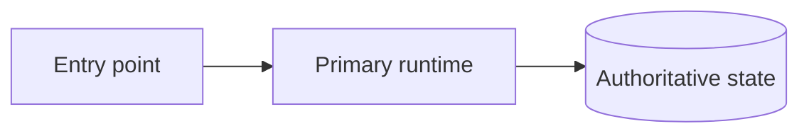
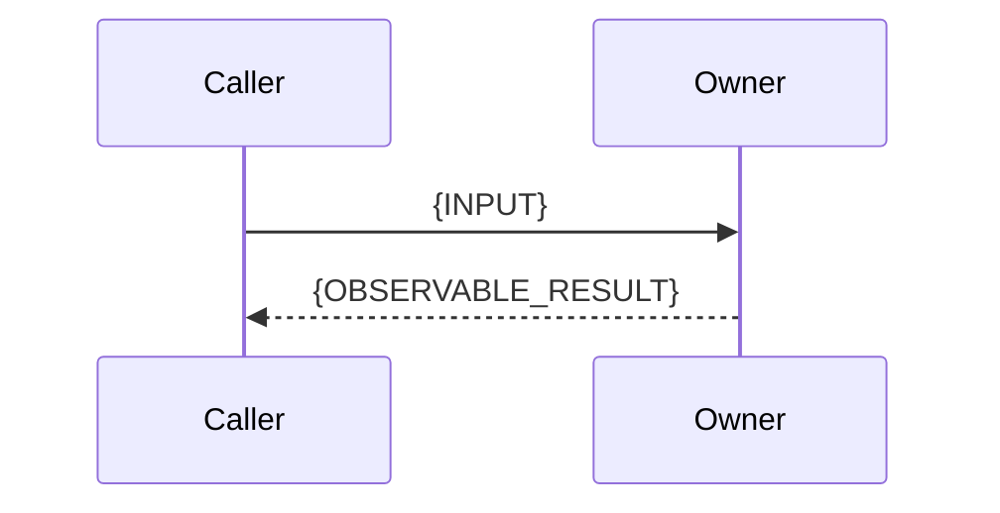

# {PROJECT_NAME} Architecture

**Audience:** Engineers and operators who need the system map and authority boundaries.

**Owns:** System topology, component responsibility, state authority, cross-component flows, failure recovery, and links to detailed owner lanes.

**Does not own:** Endpoint inventories, configuration values, deployment commands, or troubleshooting recipes.

## Contents

- [Purpose, Audience, and Ownership](#purpose-audience-and-ownership)
- [System at a Glance](#system-at-a-glance)
- [System Components](#system-components)
- [Architectural Invariants](#architectural-invariants)
- [State Ownership and Durability](#state-ownership-and-durability)
- [Data Flow](#data-flow)
- [Failure Domains and Recovery Ownership](#failure-domains-and-recovery-ownership)
- [Observability and Operator Signals](#observability-and-operator-signals)
- [Security and Privacy Boundaries](#security-and-privacy-boundaries)
- [Decision and Requirement Map](#decision-and-requirement-map)
- [Related Documentation](#related-documentation)

## Purpose, Audience, and Ownership

Explain what this architecture reference lets a new engineer or operator determine. Name the detailed lanes that own implementation inventories and procedures.

## System at a Glance

Describe the deployment boundary and principal request or job path in one short paragraph.

## System Components

Use one dossier per long-lived component or authority boundary. Do not create an exhaustive source-file inventory.

### {COMPONENT_NAME}

**Responsibility:** {RESPONSIBILITY}

**Inputs:** {INPUTS}

**Outputs:** {OUTPUTS}

**State owned:** {STATE_OWNED}

**Does not own:** {NOT_OWNED}

**Source:** `{PATH}::{SYMBOL}`

**Requirements:** [REQ-DOMAIN-001](../../sdd/spec/domain.md#req-domain-001)

**Detailed documentation:** {DETAILED_DOCUMENTATION}

## Architectural Invariants

| Invariant | Consequence | Detailed owner |
|---|---|---|
| {INVARIANT} | {CONSEQUENCE} | {DETAILED_OWNER} |

## State Ownership and Durability

| State | Scope | Authority | Durability | Writers | Readers | Recovery owner |
|---|---|---|---|---|---|---|
| {STATE} | {SCOPE} | {AUTHORITY} | {DURABILITY} | {WRITERS} | {READERS} | {RECOVERY_OWNER} |

## Data Flow

Use one short flow per cross-component path. Identify the authoritative state in prose when the diagram alone is ambiguous.

### {FLOW_NAME}

Failure and recovery are owned by {FAILURE_OWNER}.

## Failure Domains and Recovery Ownership

| Failure domain | Observable disagreement | Authority | Recovery owner | Degradation rule |
|---|---|---|---|---|
| {FAILURE_DOMAIN} | {SIGNAL} | {AUTHORITY} | {RECOVERY_OWNER} | {DEGRADATION_RULE} |

## Observability and Operator Signals

Summarize only the signals needed to understand architecture. Link detailed signal fields and incident procedures to Observability or Troubleshooting.

## Security and Privacy Boundaries

Summarize trust boundaries and failure posture. Link detailed controls and residual risks to Security.

## Decision and Requirement Map

| Concern | Architecture section | Requirements | Decisions | Detailed owner |
|---|---|---|---|---|
| {CONCERN} | {SECTION_LINK} | [REQ-DOMAIN-001](../../sdd/spec/domain.md#req-domain-001) | [AD1](../decisions/README.md#ad1-example) | {DETAILED_OWNER} |

## Related Documentation

{RELATED_DOCUMENTATION}
