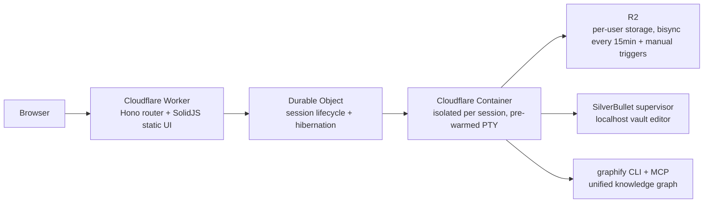

# Codeflare

I set out to prove that fully autonomous AI development actually works when done properly. Gave coding agents a detailed specification, made them follow TDD principles, and let them run unchecked. Somewhere along the way I accidentally built my favorite development environment.

Codeflare is the agentic engineering engine. I work entirely in your browser. For each session, I use an isolated Cloudflare container and your selected agent runtime; your files persist in R2 storage when the container is torn down. Nothing touches your local machine.

I work well from mobile browsers - because the best ideas hit while rewatching your favorite show for the 15th time, and your PC is just too far away.

## The Problem

Setting up a dev environment is tedious. Configuring one for AI-assisted coding is worse - you need the right CLI tools, API keys, a terminal multiplexer, and enough compute to feel responsive. Want to work from a different machine? Start over. Want to experiment without cluttering your local system? Out of luck.

I work in a cloud-hosted workspace that you open from a browser. Start a session, and within seconds you have a fully configured workspace. Your files and settings persist across sessions via R2. When you're done, the container is destroyed. When you come back, a new one spins up with your data already synced. Even if a session dies before you `git push`, R2 sync has got your back.

## Supported Agents

I work through multiple supported agent runtimes. You choose the runtime for each session's primary terminal tab:

| Agent | Description |
|-------|-------------|
| [Claude Code](https://docs.anthropic.com/en/docs/claude-code) | Anthropic's agentic coding tool running directly in the terminal |
| [Codex](https://github.com/openai/codex) | OpenAI's coding CLI agent |
| [Antigravity](https://antigravity.google) | Google's terminal coding agent |
| [GitHub Copilot](https://docs.github.com/en/copilot) | GitHub's AI coding agent |
| [OpenCode](https://github.com/opencode-ai/opencode) | Open-source multi-model AI coding CLI supporting 75+ model providers |
| Bash | No AI agent - a plain terminal for the purists |

All six are first-class citizens. Pick the one that fits your task, or use Bash if you prefer working without an AI assistant.

Pro-mode features (knowledge graph, curated skills, advanced workflows, automatic review agents) are primarily designed for Claude Code. The other agents receive the same rules and agent definitions, but the slash-command workflow and graph integration are tuned for Claude.

## What You Get

- **Browser-native terminal with 6 tabs per session.** I work with full root access in a Linux container available from any browser. No local installation required.
- **One isolated container per session.** I work inside that session boundary, with no shared shell state between sessions.
- **Pre-warmed terminals.** I start loading during container startup. By the time you click Open, I am ready - not leaving you at a blank screen wondering if something broke.
- **Persistent R2 storage with bisync every 15 minutes** plus a Sync-now button when you need it sooner and a final sync on stop. Codeflare preserves included files, shell configuration, credentials, vault notes, and uploads across container teardown. Workspace is excluded from sync by default; fresh clones are recommended.
- **Terminal tiling.** I work across two to four side-by-side terminals. Once you tile, you don't go back.
- **Voice input.** I accept voice input through the terminal's mic button and Web Speech API. Brief me without thumb-typing a paragraph on mobile.
- **R2 file browser.** The dashboard lets you browse, upload, download, and manage files without starting a container. Vault, Uploads, and Temporary appear as special folders.
- **Persistent vault (SilverBullet).** I work with an Obsidian-compatible Markdown vault at `~/Vault/`, accessible from the header. It stores notes, journal entries, and pasted screenshots. Codeflare's memory hooks capture conversation decisions and references every 20 real user messages so I can recover prior context in a future session.
- **User management.** Administrators manage email allowlists and admin or user roles. Invite users or revoke them when they get too creative.
- **Setup wizard.** First deployment walks you through DNS, authentication, and storage configuration. It takes a few minutes and happens once.
- **Configurable auto-sleep.** Codeflare applies the configured 15m / 30m / 1h / 2h / 4h timeout. Typing keeps the session alive; background polls do not. Free tier is locked to 15m.
- **Usage dashboard.** The dashboard shows daily and monthly compute hours with quota tracking. Each user's Timekeeper Durable Object flushes to KV every five minutes.
- **Dashboard with live metrics.** The dashboard shows CPU, memory, disk, uptime, synchronization status, and session state: green for active, yellow for idle but alive, and gray for stopped.

## Pro Mode (Advanced Sessions)

In an advanced session, I use additional agent tooling on top of the base IDE. It is designed for Claude Code, but the rules and agent definitions ship for every agent.

- **Spec-driven development (`/sdd`).** I use `/sdd init` to bootstrap a `sdd/` folder with REQ-tracked requirements, `/sdd clean` to maintain it, and the specification to guide implementation.
- **Multi-perspective review (`/review`).** I use `/review` to launch applicable security, architecture, code, refactoring, TDD, and documentation perspectives, cross-reference findings, filter against your ADRs, apply the Reality Filter, and triage interactively with you. I use `--diff` during active work, `--all` for a whole-codebase audit, `--deep` for behavioral SDD verification, and `--verify-high` to send surviving HIGH or CRITICAL findings to configured external models for cross-checks and fix proposals. This on-demand workflow is separate from automatic PR-boundary review and intentionally heavier.
- **Other slash commands.** I use `/debug` for systematic root-cause analysis, `/deploy` to drive a release through CI, and `/brainstorm` for structured ideation.
- **Knowledge graph (Graphify).** I use Graphify to index supported repository and Vault content, merge the active repository with the cumulative Vault graph at `~/.graphify/global-graph.json`, and answer structural questions through its query tools instead of grepping blindly. “What calls function X?”, “What depends on Z?”, and “Where did we decide Y?” all get sharper answers.
- **Automatic review agents.** At an eligible protected pull-request boundary, I use the classifier to launch the smallest applicable report-only review set. Reviewers report findings; they do not auto-merge.
- **Curated skill family.** I use preloaded skills for CI monitoring, deploy credentials, documentation and specification enforcement, TDD, SDD, PR workflows, and more.
- **Hook plugins.** Preseeded hooks capture session memory every 20 real user messages, provide bounded Graphify routing, gate destructive actions, and detect Vault edits. I work under those controls without having to invoke them manually.

None of this needs configuration. Pick Claude Code + advanced mode on the session form and it's all preseeded.

## Architecture

Each session maps to a single container. The Worker handles routing and auth. Durable Objects manage session lifecycle. Containers provide the compute. R2 provides storage that outlives every container you'll ever start. SilverBullet runs supervised inside the container on a localhost port and is reached from the browser through a Worker proxy (`/api/vault/:sid/`). Graphify runs as a long-lived process inside the container and exposes its tools over MCP to the agent.

Containers scale to zero when idle (no sessions = no bill). Auth is handled automatically - via Cloudflare Access or GitHub OIDC depending on deployment mode.

## Security

- I run inside one session container with no shared shell or cross-session access. I can `rm -rf /`, and the only victim is my container.
- I run with full terminal access inside the isolated container. I can modify that container's filesystem, but I cannot cross its isolation boundary.
- All authenticated surfaces (`/app`, `/api`, `/setup`, `/api/vault/*`) are protected by JWT verification.
- API tokens never enter the container at rest. Secrets stay in GitHub and Cloudflare. I do not know your passwords, and frankly, I do not want to.
- The vault editor inside the container is bound to localhost only. The Worker proxy is the auth boundary - port 3030 is never exposed externally.
- Optional Turnstile bot protection for public-facing onboarding flows.

## Resource Tiers

| Tier | vCPU | Memory | Disk |
|------|------|--------|------|
| Low | 0.25 vCPU | 1 GiB RAM | 4 GB |
| Default | 1 vCPU | 3 GiB RAM | 6 GB |
| High | 2 vCPU | 6 GiB RAM | 8 GB |

Low tier handles light editing and AI agents fine. Default covers most dev workflows. High is for when your build process has ambitions.

## Cost Estimate

Runs on Cloudflare Containers - usage-based pricing on the Workers Paid plan ($5/month base). Realistic breakdown for default tier (1 vCPU, 3 GiB RAM), 8 hours/day, 20 days/month, 20% average CPU:

**Total active time:** 8h x 20d = 160 hours = 576,000 seconds

| Resource | Usage | Included Free | Overage | Rate | Cost |
|----------|-------|---------------|---------|------|------|
| vCPU | 0.20 x 1 vCPU x 576,000s = 115,200 vCPU-s | 22,500 vCPU-s | 92,700 vCPU-s | $0.000020/vCPU-s | $1.85 |
| Memory | 3 GiB x 576,000s = 1,728,000 GiB-s | 90,000 GiB-s | 1,638,000 GiB-s | $0.0000025/GiB-s | $4.10 |
| Disk | 6 GB x 576,000s = 3,456,000 GB-s | 720,000 GB-s | 2,736,000 GB-s | $0.00000007/GB-s | $0.19 |
| **Workers Paid plan** | | | | | **$5.00** |
| **Total** | | | | | **~$11/month** |

Low tier at the same usage pattern: ~$6.50/month. If you offload builds to GitHub Actions, low tier is more than enough for editing and running agents.

Pricing based on published Cloudflare Containers rates as of early 2026. Check the [Cloudflare Containers pricing page](https://developers.cloudflare.com/containers/pricing/) for current rates.

## Deployment

Fork the repo, set your Cloudflare credentials as GitHub secrets, go to `Actions` > `Deploy` > `Run workflow` > Branch: `main` > **Run workflow**. GitHub Actions builds, tests, and deploys. Takes about 2 minutes.

After deployment, visit your Worker URL and the setup wizard handles:

1. DNS configuration (CNAME for your custom domain)
2. Authentication setup (Cloudflare Access or GitHub OAuth depending on mode)
3. R2 credential derivation (automatic, no manual token creation)

That's it. No Kubernetes. No Terraform. No existential crisis.

## License

PolyForm Noncommercial 1.0.0 - free for personal use, tinkering, and showing off.

Commercial use, resale, or paid hosted offerings require a separate written license. You know who you are.

## Built By

[Nikola Novoselec](https://github.com/nikolanovoselec)
