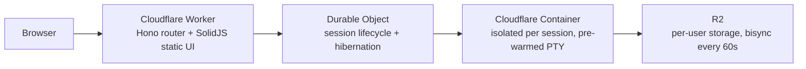

# Codeflare

I set out to prove that fully autonomous AI development actually works when done properly. Gave coding agents a detailed specification, made them follow TDD principles, and let them run unchecked. Somewhere along the way I accidentally built my favorite development environment.

Codeflare is an ephemeral cloud IDE that runs entirely in your browser. Every session spins up an isolated container on Cloudflare, pre-loads your AI agent of choice, and tears itself down when you're done. Your files persist in R2 storage. The containers don't. Nothing touches your local machine.

It's strongly optimized for mobile - because the best ideas hit while rewatching your favorite show for the 15th time, and your PC is just too far away.

## The Problem

Setting up a dev environment is tedious. Configuring one for AI-assisted coding is worse - you need the right CLI tools, API keys, a terminal multiplexer, and enough compute to feel responsive. Want to work from a different machine? Start over. Want to experiment without cluttering your local system? Out of luck.

Codeflare moves the whole thing to the cloud. Open a browser, start a session, and within seconds you have a fully configured workspace. Your files and settings persist across sessions via R2. When you're done, the container is destroyed. When you come back, a new one spins up with your data already synced. Even if a session dies before you `git push`, R2 sync has got your back.

## Supported Agents

Codeflare isn't tied to any single AI provider. Each session lets you choose which agent runs in your primary terminal tab:

| Agent | Description |
|-------|-------------|
| [Claude Unleashed](https://github.com/nikolanovoselec/claude-unleashed) | Anthropic's Claude Code, minus the "please don't run as root" lectures |
| Codex | OpenAI's Codex CLI agent |
| Gemini | Google's Gemini CLI agent |
| [OpenCode](https://github.com/opencode-ai/opencode) | Open-source multi-model AI coding CLI supporting 75+ model providers |
| Bash | No AI agent - a plain terminal for the purists |

All five are first-class citizens. Pick the one that fits your task, or use Bash if you prefer working without an AI assistant.

## What You Get

- **Browser-native terminal with 6 tabs per session.** Full Linux containers with root access, available in seconds from any browser. No local installation required.
- **One isolated container per session.** No shared state between sessions. Agents can't escape their sandbox (I checked).
- **Pre-warmed terminals.** The agent starts loading during container startup. By the time you click Open, it's ready - not staring at a blank screen wondering if something broke.
- **Persistent R2 storage with bisync every 60s.** Files, shell config, and credentials survive container teardown. Set your API key once. It's there forever.
- **Terminal tiling.** View 2-4 terminals side by side. Once you tile, you don't go back.
- **R2 file browser.** Browse, upload, download, and manage files directly from the dashboard - without starting a container.
- **User management.** Email-based allowlists and role-based permissions (admin and user). Invite users or revoke them when they get too creative.
- **Setup wizard.** First-time deployment walks you through DNS, auth, and storage config. Takes a few minutes, only happens once.
- **Auto-idle teardown.** Containers shut down after inactivity. You pay for what you use. Nothing when you don't.
- **Dashboard with live metrics.** CPU, memory, disk, uptime, and sync status at a glance.

## Architecture

Each session maps to a single container. The Worker handles routing and auth. Durable Objects manage session lifecycle. Containers provide the compute. R2 provides storage that outlives every container you'll ever start.

Containers scale to zero when idle (no sessions = no bill). Auth is handled by Cloudflare Access - no custom login pages, no token management, no OAuth dance.

## Security

- Every session runs in its own container. No shared shells, no cross-session access. Your agent can `rm -rf /` and the only victim is itself.
- AI agents run with full terminal access *inside* the container - and can't get out. I gave them root and a sandbox. They got root in a sandbox.
- Cloudflare Access gates all authenticated surfaces (`/app`, `/api`, `/setup`).
- API tokens never enter the container. Secrets stay in GitHub and Cloudflare. The agent doesn't know your passwords, and frankly, it doesn't want to.
- Optional Turnstile bot protection for public-facing onboarding flows.

## Resource Tiers

| Tier | vCPU | Memory | Disk |
|------|------|--------|------|
| Low | 0.25 vCPU | 1 GiB RAM | 4 GB |
| Default | 1 vCPU | 3 GiB RAM | 4 GB |
| High | 2 vCPU | 6 GiB RAM | 8 GB |

Low tier handles light editing and AI agents fine. Default covers most dev workflows. High is for when your build process has ambitions.

## Cost Estimate

Runs on Cloudflare Containers - usage-based pricing on the Workers Paid plan ($5/month base). Realistic breakdown for default tier (1 vCPU, 3 GiB RAM), 8 hours/day, 20 days/month, 20% average CPU:

**Total active time:** 8h x 20d = 160 hours = 576,000 seconds

| Resource | Usage | Included Free | Overage | Rate | Cost |
|----------|-------|---------------|---------|------|------|
| vCPU | 0.20 x 1 vCPU x 576,000s = 115,200 vCPU-s | 22,500 vCPU-s | 92,700 vCPU-s | $0.000020/vCPU-s | $1.85 |
| Memory | 3 GiB x 576,000s = 1,728,000 GiB-s | 90,000 GiB-s | 1,638,000 GiB-s | $0.0000025/GiB-s | $4.10 |
| Disk | 4 GB x 576,000s = 2,304,000 GB-s | 720,000 GB-s | 1,584,000 GB-s | $0.00000007/GB-s | $0.11 |
| **Workers Paid plan** | | | | | **$5.00** |
| **Total** | | | | | **~$11/month** |

Low tier at the same usage pattern: ~$6.50/month. If you offload builds to GitHub Actions, low tier is more than enough for editing and running agents.

Pricing based on published Cloudflare Containers rates as of early 2026. Check the [Cloudflare Containers pricing page](https://developers.cloudflare.com/containers/pricing/) for current rates.

## Deployment

Fork the repo, set your Cloudflare credentials as GitHub secrets, go to `Actions` > `Deploy` > `Run workflow` > Branch: `main` > **Run workflow**. GitHub Actions builds, tests, and deploys. Takes about 2 minutes.

After deployment, visit your Worker URL and the setup wizard handles:

1. DNS configuration (CNAME for your custom domain)
2. Cloudflare Access setup (auth and user allowlist)
3. R2 credential derivation (automatic, no manual token creation)

That's it. No Kubernetes. No Terraform. No existential crisis.

## License

PolyForm Noncommercial 1.0.0 - free for personal use, tinkering, and showing off.

Commercial use, resale, or paid hosted offerings require a separate written license. You know who you are.

## Built By

[Nikola Novoselec](https://github.com/nikolanovoselec)
